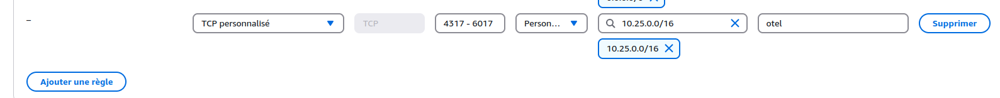

# Centreon agent benchs
The goal of these scripts is to reach the limit of checks number on a host (cma either nsclient++) and also to reach the agent number limit connected to one poller

## Setup
### Centreon

#### Create instances (one poller and one central)

The simplest is to use centreon-on-demand

Then you have to open tcp ports 4317 => 6017 on poller. In case of EC2 instances, add a rule to security group:



#### Poller setup
* Install plugins: ``` dnf install centreon-plugin-Operatingsystems-Windows-Restapi centreon-nrpe3-plugin centreon-plugin-Operatingsystems-Linux-Snmp -y ```
* Copy conf files from centreon_conf directory to poller /etc
* In /etc/centreon-broker/central-module.json replace ip central by central ip
* restart centengine
* copy create_bench_service.py and create_many_linux_agent.py to poller

#### Windows host
Create a windows server instance and open ports 22, 4317, 8443 and 5666

##### install openssh server
In an administrator powershell window:
```powershell
Add-WindowsCapability -Online -Name OpenSSH.Server
Start-Service sshd
Set-Service -Name sshd -StartupType 'Automatic'
if (!(Get-NetFirewallRule -Name "OpenSSH-Server-In-TCP" -ErrorAction SilentlyContinue | Select-Object Name, Enabled)) {
	Write-Output "Firewall Rule 'OpenSSH-Server-In-TCP' does not exist, creating it..."
	New-NetFirewallRule -Name 'OpenSSH-Server-In-TCP' -DisplayName 'OpenSSH Server (sshd)' -Enabled True -Direction Inbound -Protocol TCP -Action Allow -LocalPort 22
}
else {
	Write-Output "Firewall rule 'OpenSSH-Server-In-TCP' has been created and exists."
}
```
##### Install centreon monitoring agent and centreon ns client on the host
copy nsclient.ini to the nsclient directory
stop and start nsclient:
```
net stop nscp
net start nscp
```

copy measure_agent_perf.ps1 to C:\Users\Public


## Bench CMA
The goal of this bench is to bench cma performance on host side. You have three checks:
* echo: agent fork and execute a cmd.exe /C echo
* cpu: native cpu check 
* memory: native memory check

Of course, echo is the most expensive check as it create process.

In order to do that, execute create_bench_service.py.
It will create many echo, cpu and memory checks in the /etc/centreon-engine/services.cfg file.
Then restart agent and centengine to measure footprint.
In order to measure agent consumption, you have a load service that measure agent footprint.
With CPU and memory checks, you have also host health.
On poller side, you can get engine stats with pidstat

## Bench Poller
The goal of this bench is to bench centengine with many cma connection in borh normal and reverse mode.

First create several instances (for example 2CPUs, 4Go memory and 20G disk).
Open ports 4317 to 6000

In a text file, save alls agent instances IPs.
In order to install cma on hosts, execute from your computer:
./create_many_linux_agent.py --key_file ~/.ssh/key_file.pem  --ip_file host_ip.txt --install

You are now ready to execute benchs:
An example: ```./create_many_linux_agent.py --key_file ~/.ssh/key_file.pem  --ip_file host_ip.txt --start --nb_agent 500 --nb_cpu_service 20 --poller <ip poller> --reverse```

Beware, if you are too greedy, you may hang engine or host servers.

Then you can do a pidstat or a top to measure engine footprint

