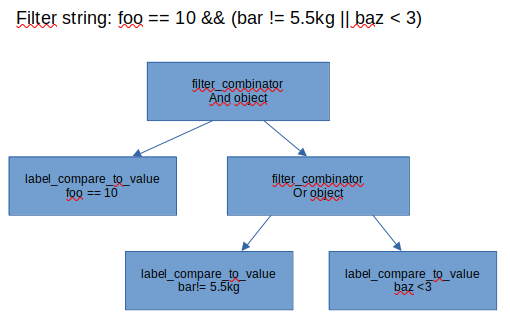

# Centreon Monitoring Agent documentation {#mainpage}

## Introduction

The purpose of this program is to run checks on the Windows and Linux operating systems. It is entirely asynchronous, with the exception of the gRPC layers. It is also single-threaded and therefore needs no mutexes, except in the gRPC part.
This is why, when a request is received, it is posted to ASIO for processing in the main thread.

## Configuration
The configuration is given by Engine by an AgentConfiguration message sent over gRPC.
The configuration object is embedded in MessageToAgent::config

## Scheduler
Scheduler is created when a server service (revers connection is created) or when agent creates a service client.
At this time he doesn't know the list of checks to execute. He begins to execute checks when he receives the an AgentConfiguration message.
We try to spread checks over the check_period.
Example: We have 10 checks to execute during one second. Check1 will start at now, second at now + 0.1s..

When the Agent receives the configuration, all checks are recreated.
For example, we have 100 checks to execute in 10 minutes, at it is 12:00:00.
The first service check will start right now, the second one at 12:00:06, third at 12:00:12... and the last one at 12:09:54
We don't care about the duration of tests, we work with time points. 
In the previous example, the second check for the first service will be scheduled at 12:00:10 even if all other checks has not been yet started.

In case of check duration is too long, we might exceed maximum of concurrent checks. In that case checks will be executed as soon one will be ended.

This means that the second check may start later than the scheduled time point (12:00:10) if the first checks take too long.

When a check completes, it is inserted into _waiting_check_queue, and its start will be scheduled as soon as a slot in the queue is available (the queue is a set indexed by expected_start) minus old_start plus check_period.


## native checks
All checks are scheduled by one thread, no mutex needed.
In order to add a native check, you need to inherit from check class. 
Then you have to override constructor and start_check method.
All is asynchronous. When start_check is called, it must not block caller for a long time. 
At the end of measure, it must call check::on_completion().
That method need 4 arguments:
* start_check_index: For long asynchronous operation, at the beginning, asynchronous job must store running_index and use it when he has to call check::on_completion(). It is useful for scheduler to check if it's the result of the last asynchronous job start. The new class can get running index with check::_get_running_check_index()
    An example, checks starts a first measure, the timeout expires, a second measure starts, the first measure ends,we don't take into account his result and we wait for the end off second one.
* status: plugins status equivalent. Values are 0:Ok, 1: warning, 2: critical, 3: unknown (https://nagios-plugins.org/doc/guidelines.html#AEN41)
* perfdata: a list of com::centreon::common::perfdata objects
* outputs: equivalent of plugins output as "CPU 54% OK"

A little example:
```c++
class dummy_check : public check {
  duration _command_duration;
  asio::system_timer _command_timer;

 public:
  void start_check(const duration& timeout) override {
    if (!check::start_check(timeout)) {
      return;
    }
    _command_timer.expires_after(_command_duration);
    _command_timer.async_wait([me = shared_from_this(), this,
                               running_index = _get_running_check_index()](
                                  const boost::system::error_code& err) {
      if (err) {
        return;
      }
      on_completion(running_index, 1,
                    std::list<com::centreon::common::perfdata>(),
                    {"output dummy_check of " + get_command_line()});
    });
  }

  template <typename handler_type>
  dummy_check(const std::string& serv,
              const std::string& command_name,
              const std::string& command_line,
              const duration& command_duration,
              handler_type&& handler)
      : check(g_io_context,
              spdlog::default_logger(),
              std::chrono::system_clock::now(),
              std::chrono::seconds(1),
              serv,
              command_name,
              command_line,
              nullptr,
              handler),
        _command_duration(command_duration),
        _command_timer(*g_io_context) {}
};
```

### About filters
In order to parse filter grammars, we use boost parser library. With that library, you can build a tree of config objects with a few lines of code.
Some tips:
* Author advises to skip whitespaces during parsing. It's a bas idea as whitespace are useful to separate tokens. This is why you will see some bp::ws in rule implementations.
* When you define a rule, you have to create the object that will receive parse result. You have two possibilities. First, you receive a tuple or a variant with all parsed fields. You can give a constructor with all of types contained in the tuple, library will do the bridge. The main difficulty is to know th variant type. In order to have the exact type, I first create a template<typename T> constructor(T&&). Then I write a test that uses this grammar, so compiler will create all needed constructor. Then a nm -C on ut_agent gives me all needed types of constructors.
* As parsed objects need also a copy and no parameter constructor.
* There are some unused parameters in parser library, so these warnings are disabled.
* A piece of code in in filter_rules.hh. The goal is to reuse type less rules in centagent and ut_agent.

Filtering is done in two steps in order to be more reusable.
- First step
    Filtering parse filter string, it builds a tree of object composed of filter objects (label_compare_to_value, label_in...). Then you get a filter object that contains filter tree with a check method. But there is no even checking checker in this filters.
- Second step
    Once you have your tree, you just have a just configuration tree. You have to:
  * define a data object that inherit from testable struct with all mandatory data for filters.
  * define a checker constructor that will be applied to tree config. This checker builder will set _checker member of each filter. Then when you will call root object::check, it will apply checker to each sub filter according to logical rules.

If you have problems on filter testing, you can call the set_logger method. By setting logger to the top filter and enabling trace level, you will see in log which filter return false.
Another feature is filter enable disable, If you don't set checker in one or more filters, they won't be taken into account in logical and, or filters combinations.



You can find grammar elements here: [Boost Parser Cheat Sheet](https://www.boost.org/doc/libs/1_87_0/doc/html/boost_parser/cheat_sheet.html)


### native_check_cpu (linux version)
It uses /proc/stat to measure cpu statistics. When start_check is called, a first snapshot of /proc/stat is done. Then a timer is started and will expires at max time_out or check_interval minus 1 second. When this timer expires, we do a second snapshot and create plugin output and perfdata from this difference.
The arguments accepted by this check (in json format) are:
* cpu-detailed: 
  * if false, produces only average cpu usage perfdata per processor and one for the average 
  * if true, produces per processor and average one perfdata for user, nice, system, idle, iowait, irq, soft_irq, steal, guest, guest_nice and total used counters

Output is inspired from centreon local cpu and cpu-detailed plugins
Examples of output: 
* OK: CPU(s) average usage is 24.08%
* CRITICAL: CPU'0' Usage: 24.66%, User 17.58%, Nice 0.00%, System 5.77%, Idle 75.34%, IOWait 0.39%, Interrupt 0.00%, Soft Irq 0.91%, Steal 0.00%, Guest 0.00%, Guest Nice 0.00% WARNING: CPU'2' Usage: 24.18%, User 17.69%, Nice 0.00%, System 5.99%, Idle 75.82%, IOWait 0.38%, Interrupt 0.00%, Soft Irq 0.12%, Steal 0.00%, Guest 0.00%, Guest Nice 0.00% CRITICAL: CPU(s) average Usage: 24.08%, User 17.65%, Nice 0.00%, System 5.80%, Idle 75.92%, IOWait 0.36%, Interrupt 0.00%, Soft Irq 0.27%, Steal 0.00%, Guest 0.00%, Guest Nice 0.00%
  
Example of perfdatas in not cpu-detailed mode: 
* cpu.utilization.percentage
* 0#core.cpu.utilization.percentage
* 1#core.cpu.utilization.percentage

Example of perfdatas in cpu-detailed mode:
* 0~user#core.cpu.utilization.percentage
* 0~system#core.cpu.utilization.percentage
* 1~interrupt#core.cpu.utilization.percentage
* iowait#cpu.utilization.percentage
* used#cpu.utilization.percentage

### native_check_cpu (windows version)
metrics aren't the same as linux version. We collect user, idle, kernel , interrupt and dpc times.

There are two methods, you can use internal microsoft function NtQuerySystemInformation. Yes Microsoft says that they can change signature or data format at any moment, but it's quite stable for many years. A trick, idle time is included un kernel time, so we subtract first from the second. Dpc time is yet included in interrupt time, so we don't sum it to calculate total time.
The second one relies on performance data counters (pdh API), it gives us percentage despite that sum of percentage is not quite 100%. That's why the default method is the first one.
The choice between the two methods is done by 'use-nt-query-system-information' boolean parameter.

### check_drive_size
we have to get free space on server drives. In case of network drives, this call can block in case of network failure. Unfortunately, there is no asynchronous API to do that. So a dedicated thread (drive_size_thread) computes these statistics. In order to be os independent and to test it, drive_size_thread relies on a functor that do the job: drive_size_thread::os_fs_stats. This functor is initialized in main function. drive_size thread is stopped at the end of main function.

So it works like that:
* check_drive_size post query in drive_size_thread queue
* drive_size_thread call os_fs_stats
* drive_size_thread post result in io_context
* io_context calls check_drive_size::_completion_handler

### check_health
This little check sends agent's statistics to the poller. In order to do that, each check shares a common checks_statistics object. 
This object is created by scheduler each time agent receives config from poller. This object contains last check interval and last check duration of each command. The first time it's executed, it can send unknown state if there is no other yet executed checks.

### event_log
This is the first checked developed with filters and parameterizable output. 
How it works:
* First we subscribe to eventlog, in fact, OS creates a thread that call a callback( container::_subscription_callback)
* We extract raw data in the object event_data with few or no memory allocation.
* We apply global filter, warning and critical filters to this object.
* If it pass global filter:
  * if it matches critical filter it is stored in container::_critical
  * or if it matches warning filter it's stored in container::_warning
  * or we only store time create in _ok_events
When event_data matches to warning or critical filter, we create an event object from event_data.
As filter can contain peremption filters (written > -60m), we need to apply filters also on event objects to test if an event object is still accepted by filter.
That's why event_filter::check_builder is templated by raw_data_tag or event_tag. Warning and critical filters must apply on event_data and event objects. So in container class, you will find _critical_filter and _event_critical_filter. These objects are identical but accessor that allow them to check objects are different, one apply to event_data and other to event class.

In order to do a parameterizable output, we rely on std::format, we just replace for example {file} by {0} and we pass file in first std::vformat argument.

Another point is uniq. When we print event to output, we avoid to print each of them. User can pass a uniq string that acts as a group by in order to not print several events that have for example the same event_id. In order to do that, class event_comparator is used to hash and compare events according to user parameters. Then these class is used by a flat_hash_set to do the 'unique' job.

Use of flyweight: we may create a lot of event objects. As we can have the same string in several objects, we use boost flyweight library in order to store only one string in memory for several events.

### process_log
On each check, it scans all running processes on host. 
In order to save CPU, at check construction, we set a field mask (process_field) in order to only get needed data.
Then it:
 * enumerates hangs processes and update processes states
 * applies filters
 * calc status, output and perfdata