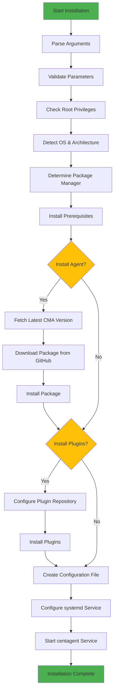
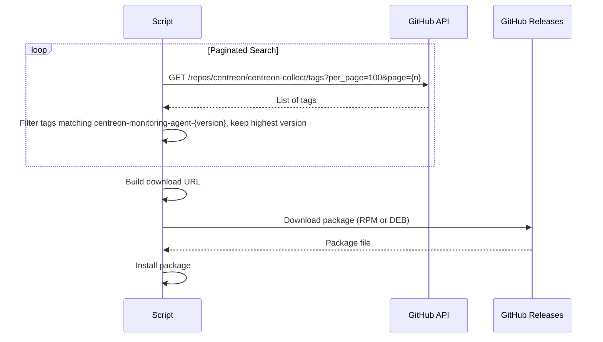
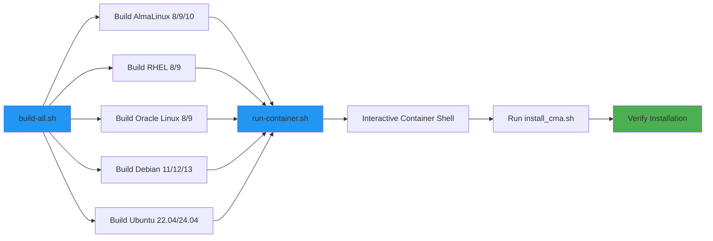
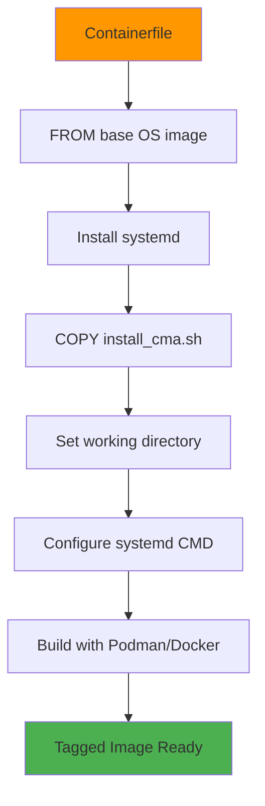

# Centreon Monitoring Agent (CMA) Linux Installation Script

## Overview

The `install_cma.sh` script provides automated installation and configuration of the Centreon Monitoring Agent on Linux systems. It supports multiple distributions and handles package installation from GitHub releases, configuration file generation, and service management.

## Supported Operating Systems

- **RHEL-based**: AlmaLinux 8/9/10, RHEL 8/9, Oracle Linux 8/9
- **Debian-based**: Debian 11/12/13, Ubuntu 22.04/24.04
- **Architectures**: x86_64 (all platforms), ARM64 (Debian/Ubuntu only)

## Features

- ✅ **Automated Installation**: Downloads and installs CMA from GitHub releases
- ✅ **Multi-OS Support**: Works across RHEL and Debian-based distributions
- ✅ **Architecture Detection**: Automatic x86_64/ARM64 package selection
- ✅ **Configuration Management**: Generates JSON configuration files
- ✅ **Plugin Installation**: Optional Centreon plugin installation
- ✅ **Dry-Run Mode**: Preview changes without applying them

## Installation Flow



## GitHub Release Integration

The script fetches the latest CMA version from GitHub releases using the following workflow:



## Usage

### Basic Installation

```bash
# Minimal installation
sudo ./install_cma.sh -e "poller.example.com:4317" -t "auth-token"

# With custom hostname
sudo ./install_cma.sh -e "192.168.1.100:4317" -t "auth-token" -n "my-server"

# With plugins
sudo ./install_cma.sh -e "192.168.1.100:4317" -t "auth-token" -p "agent,plugin"
```

### Advanced Configurations

```bash
# Full TLS encryption (agent-initiated)
sudo ./install_cma.sh \
  -e "poller.example.com:4317" \
  -t "auth-token" \
  -c full \
  -a /etc/ssl/certs/ca.crt

# Reverse mode with TLS (poller-initiated)
sudo ./install_cma.sh \
  -e "0.0.0.0:4317" \
  -t "auth-token" \
  -r \
  -c full \
  -C /etc/ssl/certs/server.crt \
  -k /etc/ssl/private/server.key

# Custom logging configuration
sudo ./install_cma.sh \
  -e "192.168.1.100:4317" \
  -t "auth-token" \
  -T file \
  -L /var/log/cma/agent.log \
  -l debug \
  -M 10485760 \
  -m 5
```

### GitHub Token Authentication

To avoid API rate limits when fetching releases:

```bash
export GITHUB_TOKEN="ghp_your_token_here"
sudo -E ./install_cma.sh -e "poller.example.com:4317" -t "auth-token"
```

Create a token at: https://github.com/settings/tokens (no special permissions needed for public repositories)

### Dry-Run Mode

Preview what the script will do without making changes:

```bash
./install_cma.sh -e "poller.example.com:4317" -t "auth-token" -d
```

## Command-Line Options

| Option                | Description                                                  | Required | Default                                          |
| --------------------- | ------------------------------------------------------------ | -------- | ------------------------------------------------ |
| `-e, --endpoint`      | OpenTelemetry endpoint (host:port)                           | ✅        | -                                                |
| `-t, --token`         | Authentication token                                         | ✅        | -                                                |
| `-n, --host`          | Custom hostname for Centreon                                 | ❌        | System hostname                                  |
| `-v, --version`       | Centreon version                                             | ❌        | 25.10                                            |
| `-c, --encryption`    | Encryption mode: full, insecure, no                          | ❌        | full                                             |
| `-r, --reverse`       | Enable reverse mode                                          | ❌        | false                                            |
| `-a, --ca`            | CA certificate path                                          | ❌        | -                                                |
| `-N, --commonname`    | CA common name                                               | ❌        | -                                                |
| `-C, --cert`          | Public certificate path                                      | ❌        | -                                                |
| `-k, --key`           | Private key path                                             | ❌        | -                                                |
| `-f, --fingerprint`   | Certificate fingerprint                                      | ❌        | -                                                |
| `-T, --logtype`       | Log type: file, stdout                                       | ❌        | file                                             |
| `-L, --logfile`       | Log file path                                                | ❌        | /var/log/centreon-monitoring-agent/centagent.log |
| `-l, --loglevel`      | Log level: off, critical, error, warning, info, debug, trace | ❌        | error                                            |
| `-M, --max-file-size` | Max log file size in bytes                                   | ❌        | 10                                               |
| `-m, --max-number`    | Max number of log files                                      | ❌        | 3                                                |
| `-x, --custom-check`  | Custom check file path                                       | ❌        | -                                                |
| `-p, --components`    | Components to install: agent,plugin                          | ❌        | agent,plugin                                     |
| `-d, --dry-run`       | Preview without making changes                               | ❌        | false                                            |
| `-h, --help`          | Display help message                                         | ❌        | -                                                |

## Test Infrastructure

The `tests/` directory contains a comprehensive testing infrastructure using containers to validate the installation script across all supported operating systems.

### Test Directory Structure

```
tests/
├── build-all.sh                    # Build all test container images
├── run-container.sh                # Run a container for manual testing
├── test_install_cma.sh            # Automated test script (future)
├── Containerfile.almalinux8       # AlmaLinux 8 container definition
├── Containerfile.almalinux9       # AlmaLinux 9 container definition
├── Containerfile.almalinux10      # AlmaLinux 10 container definition
├── Containerfile.rhel8            # RHEL 8 container definition
├── Containerfile.rhel9            # RHEL 9 container definition
├── Containerfile.oraclelinux8     # Oracle Linux 8 container definition
├── Containerfile.oraclelinux9     # Oracle Linux 9 container definition
├── Containerfile.debian11         # Debian 11 container definition
├── Containerfile.debian12         # Debian 12 container definition
├── Containerfile.debian13         # Debian 13 container definition
├── Containerfile.ubuntu2204       # Ubuntu 22.04 container definition
└── Containerfile.ubuntu2404       # Ubuntu 24.04 container definition
```

### Container Testing Workflow



### Using the Test Infrastructure

#### 1. Build All Test Containers

```bash
cd tests/
./build-all.sh
```

This builds container images for all 12 supported OS distributions. Each image includes:
- Base OS installation
- systemd support for service management
- The `install_cma.sh` script copied to `/opt/centreon/`

#### 2. Run a Test Container

```bash
# Run AlmaLinux 8 container
./run-container.sh almalinux8

# Run Debian 12 container
./run-container.sh debian12

# Run Ubuntu 24.04 container
./run-container.sh ubuntu2404
```

Available distributions:
- `almalinux8`, `almalinux9`, `almalinux10`
- `rhel8`, `rhel9`
- `oraclelinux8`, `oraclelinux9`
- `debian11`, `debian12`, `debian13`
- `ubuntu2204`, `ubuntu2404`

#### 3. Test Inside the Container

Once inside the container:

```bash
# Navigate to the script location
cd /opt/centreon

# Run dry-run to preview
./install_cma.sh -e "poller.example.com:4317" -t "test-token" -d

# Run actual installation
export GITHUB_TOKEN="your_token_here"  # Optional but recommended
./install_cma.sh -e "poller.example.com:4317" -t "test-token"

# Check service status
systemctl status centagent

# View logs
journalctl -u centagent -f

# Verify configuration
cat /etc/centreon-monitoring-agent/centagent.json

# Test agent command
centagent --version
```

#### 4. Testing Different Scenarios

```bash
# Test agent-only installation (no plugins)
./install_cma.sh -e "test:4317" -t "token" -p "agent"

# Test with custom logging
./install_cma.sh -e "test:4317" -t "token" -T stdout -l debug

# Test reverse mode
./install_cma.sh -e "0.0.0.0:4317" -t "token" -r

# Test with TLS certificates
./install_cma.sh -e "test:4317" -t "token" -c full -a /path/to/ca.crt
```

### Container Build Process



### Manual Testing Checklist

When testing in containers, verify:

- ✅ OS detection works correctly
- ✅ Package manager detected (dnf/yum/apt)
- ✅ Architecture detected (x86_64/aarch64)
- ✅ Prerequisites installed (curl, hostname)
- ✅ Latest CMA version fetched from GitHub
- ✅ Package downloaded successfully
- ✅ Package installed without errors
- ✅ Configuration file created at `/etc/centreon-monitoring-agent/centagent.json`
- ✅ Service enabled and started
- ✅ `centagent` command available
- ✅ Service running: `systemctl is-active centagent`