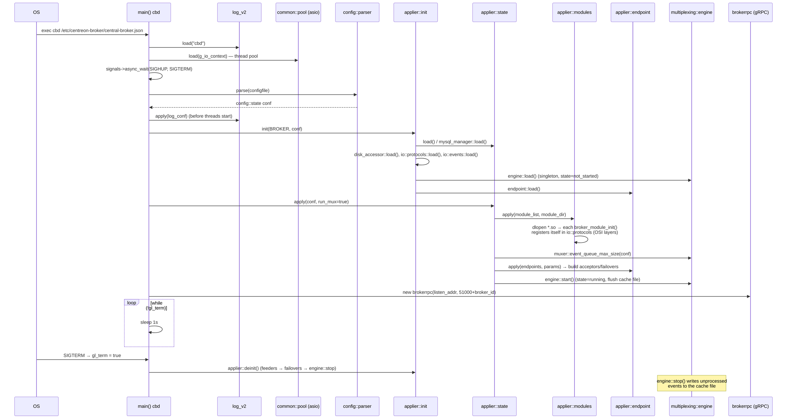
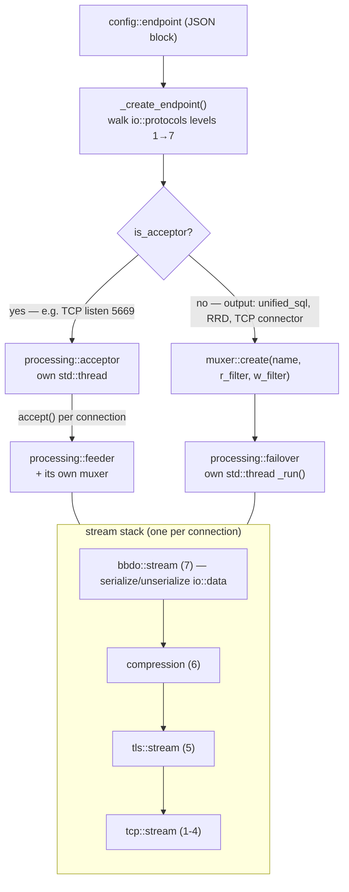
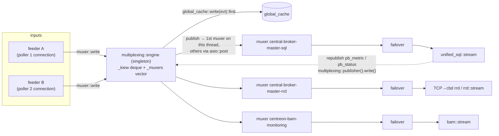
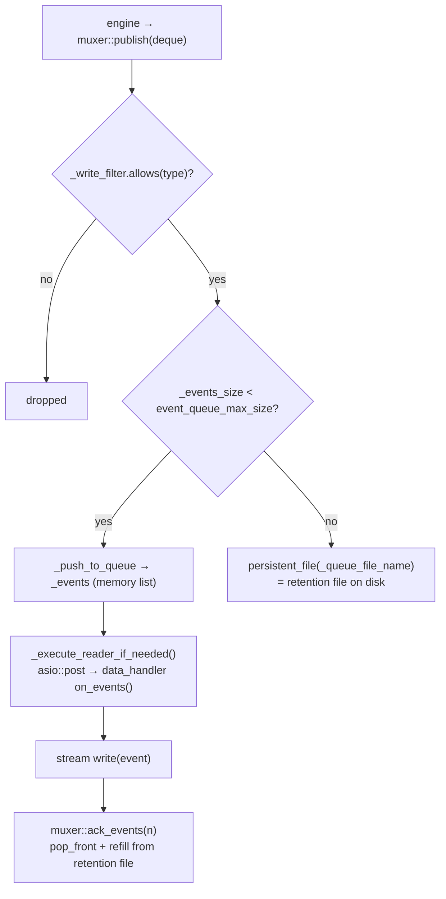
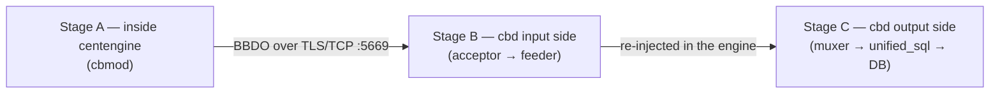
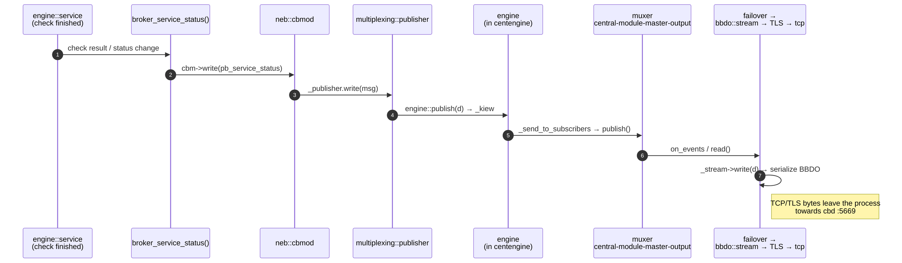
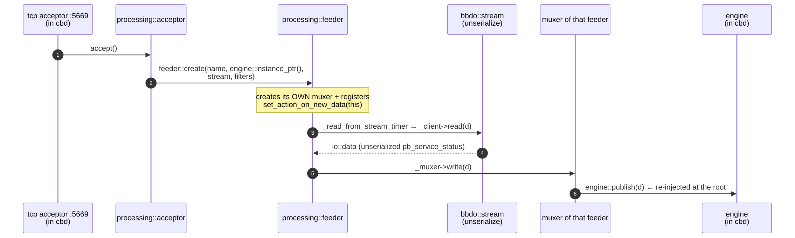
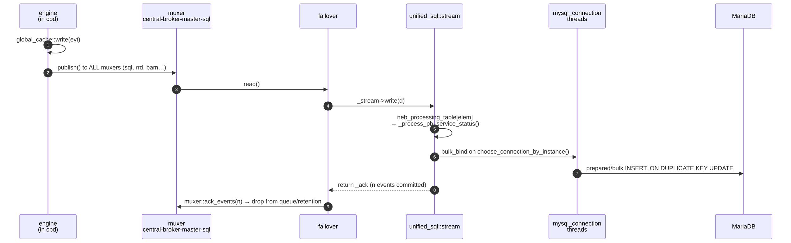

# How `cbd` (Centreon Broker) runs

From process start to a row in MariaDB.

> For the detailed, layer-by-layer version — each layer in its own file, with links to the exact
> functions — see [cbd/README.md](cbd/README.md).

- [1. Startup sequence](#1-startup-sequence)
- [2. How an endpoint becomes a running object](#2-how-an-endpoint-becomes-a-running-object)
- [3. The multiplexing core](#3-the-multiplexing-core)
- [4. Engine → Broker → SQL](#4-engine--broker--sql)

---

## 1. Startup sequence

Source: `broker/core/src/main.cc`



Two things worth noting:

- the main thread does nothing but `sleep(1)` — all real work happens on the asio pool and on
  per-endpoint threads;
- `SIGHUP` re-parses the config and calls `state::apply(conf)` again, rolling back to `gl_state`
  if it throws (`broker/core/src/main.cc:135-182`).

---

## 2. How an endpoint becomes a running object

Source: `broker/core/src/config/applier/endpoint.cc`

Each `input`/`output` block in the JSON is turned into an OSI-like **stack of `io::endpoint`s**,
built bottom-up by `_create_endpoint()`. Modules register themselves with an OSI range at load
time:

| Layer | Registered by | Examples |
|---|---|---|
| 1–4 (transport) | `tcp`, `grpc`, `file`, `RRD`, `unified_sql`, `OTLP`, `graphite`, `bam`… | `broker/unified_sql/src/main.cc:160`, `broker/rrd/src/main.cc:122` |
| 5 | `TLS` | `broker/tls/src/main.cc:69` |
| 6 | compression | |
| 7 | `BBDO` | `broker/core/bbdo/internal.cc:60` |



- **acceptor** = server side. One thread doing `accept()`; every accepted connection spawns a
  `feeder` (`broker/core/src/processing/acceptor.cc:68-94`).
- **failover** = client/output side. One dedicated thread with a
  `read stream → write muxer / read muxer → write stream` loop
  (`broker/core/src/processing/failover.cc:295-400`).
- **feeder** is event-driven instead of a loop: it registers itself as the muxer's `data_handler`
  and gets called back from the asio pool (`broker/core/src/processing/feeder.cc:67-72`).

---

## 3. The multiplexing core

One engine, N muxers.



The muxer is the buffering + back-pressure unit
(`broker/core/multiplexing/inc/com/centreon/broker/multiplexing/muxer.hh:29-50`):



The key invariant: an event is **only removed from the queue when the destination acknowledges
it** (`_pos` marks the read cursor, `_events.begin()` the un-acked head). That is what makes
retention survive a broker or DB outage.

---

## 4. Engine → Broker → SQL

`centengine` does not talk BBDO itself. It embeds a *whole broker core* via **cbmod** — that is
why `cbmod::cbmod()` calls `config::applier::init(ENGINE, ...)` (`broker/neb/src/cbmod.cc:49-90`).
So there is a multiplexing engine + muxer + failover *inside the centengine process*.

The entry points are the `broker_*()` callbacks in `engine/src/broker.cc` — e.g.
`broker_service_status()` at `engine/src/broker.cc:4796`, which forwards to
`cbm->write(...)` (`broker/neb/src/cbmod.cc:110`).

The full path is split below into three stages, because it crosses two processes:



### Stage A — from the check result to the wire (centengine process)



### Stage B — reception in cbd, back up to the engine



### Stage C — fan-out to unified_sql, and the acknowledgement path back



### Where exactly the data "lands"

**Reception point:** `processing::acceptor::accept()`
(`broker/core/src/processing/acceptor.cc:68`) — every incoming poller connection creates a
`feeder`, and **the feeder creates its own muxer** (`broker/core/src/processing/feeder.cc:91-95`).
So yes, there is a muxer on the input side too. It is used in the *other* direction than you
would expect:

- `muxer::write(d)` (called by feeder/failover) does **not** enqueue — it forwards to
  `engine::publish()`, i.e. the root of the tree.
- `muxer::publish(deque)` (called only by the engine) enqueues into that muxer's own queue, for
  the stream to consume.

That asymmetry is the whole trick: input muxers push *up* to the engine, output muxers buffer
*down* to their stream. See the class doc at
`broker/core/multiplexing/inc/com/centreon/broker/multiplexing/muxer.hh:38-48`.

**Fan-out:** `engine::_send_to_subscribers()` (`broker/core/multiplexing/src/engine.cc`) writes
the batch to `global_cache` **first** (outputs may need it), then delivers to every muxer — the
first one on the calling thread, the rest via `asio::post` on the pool.

**SQL landing:** `unified_sql::stream::write()` (`broker/unified_sql/src/stream.cc:711`) is a pure
dispatcher:

```cpp
uint16_t cat  = category_of_type(type);
uint16_t elem = element_of_type(type);
if (cat == io::neb)
  (this->*(neb_processing_table[elem]))(data);   // 50-entry jump table
```

`neb_processing_table` (`broker/unified_sql/src/stream.cc:49-108`) maps BBDO element ids to
`_process_*` handlers. For a service status that is `_process_pb_service_status()`
(`broker/unified_sql/src/stream_sql.cc:4570`), which:

1. drops the event if the host is not in `_cache_host_instance` (unknown poller);
2. picks a DB connection with `_mysql.choose_connection_by_instance(instance_id)` — connections
   are sharded per poller so ordering per poller is preserved;
3. fills a `bulk_bind` row (or a plain prepared statement if bulk is not available);
4. lets the `mysql_connection` worker thread execute it asynchronously.

Actual flushing is time/count driven, back in `stream::write()`:

```cpp
if (now >= _next_loop_timeout || _count >= _max_pending_queries) {
  _count = 0; _next_loop_timeout = now + 10;
  _finish_actions();          // commits, then bumps _ack
}
int32_t retval = _ack; _ack -= retval;
return retval;                // ← this is what un-blocks the muxer queue
```

So the number returned by `write()` is the acknowledgement count that flows back through
`failover` → `muxer::ack_events()`. Until the DB commits, the events stay in the muxer's memory
queue, and past `event_queue_max_size` they spill into the retention file. That is the same
return-value contract an OTLP output has to honour (see `otlp_output_architecture.md`).

Finally, perfdata takes a second hop: `unified_sql` writes `data_bin`/`metrics` **and
republishes** `storage::pb_metric` / `pb_status` into the multiplexing engine via
`multiplexing::publisher().write(...)` (`broker/unified_sql/src/stream_storage.cc:124` and
`:365`), where the RRD muxer picks them up — which is why RRD graphs depend on `unified_sql`
being alive.
