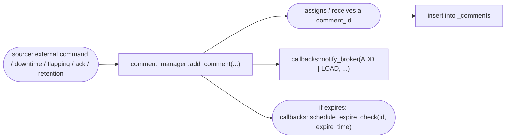
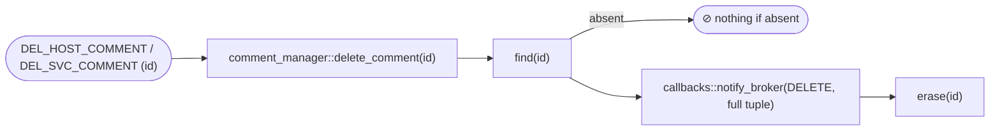

# comments library — Broker integration guide

<!-- TOC -->
* [comments library — Broker integration guide](#comments-library--broker-integration-guide)
  * [Overview](#overview)
  * [Current state in Engine](#current-state-in-engine)
    * [The comment class](#the-comment-class)
    * [The static comment::comments map](#the-static-commentcomments-map)
    * [The four comment types](#the-four-comment-types)
    * [Deletion operations](#deletion-operations)
    * [Broker notification](#broker-notification)
  * [Target architecture (shared)](#target-architecture-shared)
    * [Class hierarchy](#class-hierarchy)
    * [comment — base class](#comment--base-class)
    * [comment_manager — owning singleton](#comment_manager--owning-singleton)
    * [comment_callbacks — integration contract](#comment_callbacks--integration-contract)
  * [Lifecycle of a comment](#lifecycle-of-a-comment)
    * [Creation](#creation)
    * [Targeted deletion by id](#targeted-deletion-by-id)
    * [Bulk deletion](#bulk-deletion)
    * [Expiration](#expiration)
    * [Comments tied to a downtime](#comments-tied-to-a-downtime)
    * [Comments tied to flapping](#comments-tied-to-flapping)
    * [Acknowledgement comments](#acknowledgement-comments)
  * [Broker integration](#broker-integration)
    * [Initialization](#initialization)
    * [Callbacks to implement](#callbacks-to-implement)
      * [Object existence](#object-existence)
      * [Broker notification](#broker-notification-1)
      * [Expiration scheduling](#expiration-scheduling)
    * [Comment identity: comment_id vs internal_id](#comment-identity-comment_id-vs-internal_id)
    * [Driving the manager from BBDO events](#driving-the-manager-from-bbdo-events)
    * [Retention](#retention)
  * [Key differences with the engine implementation](#key-differences-with-the-engine-implementation)
<!-- TOC -->

---

## Overview

Today, comment management lives **entirely in Engine** (`engine/src/comment.cc`,
`engine/inc/com/centreon/engine/comment.hh`). There is no shared library yet, unlike downtimes.

The goal of this reimplementation is to factor comment management into a `common/comments` library,
following the same model as `common/downtimes`:

* a `comment` class holding the state of a comment;
* a `comment_manager` singleton owning the whole set of comments;
* an abstract `comment_callbacks` interface injecting every runtime-specific concern (object
  existence, event scheduling, broker notification);
* **no engine- or broker-specific code** in the library itself.

Engine would provide `engine_comment_callbacks`; Broker would provide its own
`broker_comment_callbacks` implementation. Ultimately this lets Broker **own** comments (notably
generate their identifier), reducing Engine to a relay role — see
[Comment identity](#comment-identity-comment_id-vs-internal_id).

A comment can have one of four **entry types** (`entry_type`): `user`, `downtime`, `flapping`,
`acknowledgment`.

---

## Current state in Engine

### The comment class

`engine/inc/com/centreon/engine/comment.hh`

| Field | Type | Meaning |
|---|---|---|
| `_comment_type` | `enum type { host = 1, service }` | Carrying object |
| `_entry_type` | `enum e_type { user = 1, downtime, flapping, acknowledgment }` | Comment origin |
| `_comment_id` | `uint64_t` | Unique identifier (minted by Engine) |
| `_source` | `enum src { internal, external }` | Created by the engine or by an external command |
| `_persistent` | `bool` | Survives restarts / not auto-deleted |
| `_entry_time` | `time_t` | Creation time |
| `_expires` / `_expire_time` | `bool` / `time_t` | Optional expiration |
| `_host_id` / `_service_id` | `uint64_t` | Target object (`_service_id == 0` ⇒ host comment) |
| `_author` | `std::string` | Author |
| `_comment_data` | `std::string` | Text |

### The static comment::comments map

`engine/src/comment.cc:26`

```cpp
comment_map comment::comments;            // absl::flat_hash_map<uint64_t, shared_ptr<comment>>
uint64_t comment::_next_comment_id = 1;   // ID counter minted by Engine
```

Every comment is inserted into this global map, keyed by `comment_id`. The ID is assigned by Engine
in the constructor (`comment.cc:63-68`) when no ID is provided; otherwise the comment is treated as
**loaded** (retention). `_next_comment_id` is:

* persisted in retention (`retention/program.cc`, key `next_comment_id`);
* exposed in `status.dat` (`xsddefault.cc:224`) and in the gRPC `program_status`
  (`command_manager.cc:268`);
* reset to `1` on configuration reload (`applier/state.cc:224,260`).

### The four comment types

Two types store their `comment_id` on the owning object so they can delete it later; the other two
are found differently.

| `entry_type` | Created by | `comment_id` stored | Deleted when |
|---|---|---|---|
| `user` | `cmd_add_comment` (`commands.cc:207`) — `ADD_HOST_COMMENT` / `ADD_SVC_COMMENT` | — | `DEL_*_COMMENT` by id, `DEL_ALL_*`, or object deletion |
| `downtime` | `downtime::subscribe()` via callback (`engine_downtime_callbacks.cc:478`) | `downtime::_comment_id` | downtime object destruction |
| `flapping` | `host::set_flap()` / `service::set_flap()` (`host.cc:1980`, `service.cc:2742`) | `notifier::_flapping_comment_id` | `clear_flap()` (flapping ends) |
| `acknowledgment` | `cmd_acknowledge_*_problem` (`commands.cc:2519/2558`) | — | ack cleared → scan by host/service + `entry_type` |

### Deletion operations

`engine/src/comment.cc`

| Method | Key | Usage |
|---|---|---|
| `delete_comment(id)` | `comment_id` (find) | `DEL_HOST_COMMENT` / `DEL_SVC_COMMENT`, and every targeted deletion (downtime, flapping) |
| `delete_host_comments(host_id)` | iteration | `DEL_ALL_HOST_COMMENTS` |
| `delete_service_comments(host_id, svc_id)` | iteration | `DEL_ALL_SVC_COMMENTS` |
| `delete_host_acknowledgement_comments(host*)` | iteration + `entry_type==ack` + non-persistent | host ack cleared |
| `delete_service_acknowledgement_comments(svc*)` | iteration + `entry_type==ack` + non-persistent | service ack cleared |
| `remove_if_expired_comment(id)` | `comment_id` + `expires`/`expire_time` | `EVENT_EXPIRE_COMMENT` (`timed_event.cc:291`) |

All of them send Broker a `NEBTYPE_COMMENT_DELETE` rebuilt from the comment's **full tuple** (author,
host/service, entry_time, etc.) — which is precisely the reason the in-memory map exists.

### Broker notification

`engine/src/comment.cc` → `broker_comment_data()` → `forward_pb_comment()` (`broker.cc:1295`).

* Creation: `broker_comment_data(NEBTYPE_COMMENT_ADD | NEBTYPE_COMMENT_LOAD, ...)`
  (`comment.cc:64`), depending on whether the ID was minted or loaded.
* Deletion: `broker_comment_data(NEBTYPE_COMMENT_DELETE, ...)`.

**Important**: in `forward_pb_comment`, the only effect of `type` is to set `deletion_time` when it
equals `NEBTYPE_COMMENT_DELETE` (`broker.cc:1323`). `ADD` and `LOAD` produce **exactly the same**
BBDO `Comment` message; the message carries no field to tell them apart. The useful semantics
therefore boil down to a single "deleted / not deleted" boolean.

---

## Target architecture (shared)

### Class hierarchy

```
comment_callbacks  (abstract — injected at startup)
    ↑ implemented by
engine_comment_callbacks   (Engine side, engine/src/)
broker_comment_callbacks   (Broker side — to be written)

comment            (base, common/comments/)
comment_manager    (singleton, owner of all comments)
```

Unlike downtimes, **no `host_comment` / `service_comment` specialization is required**: the
host/service distinction collapses to `_service_id == 0` and the `_comment_type` field (this is also
the direction taken by the downtimes simplification, where `host_downtime` and `service_downtime`
are no longer compiled).

### comment — base class

Reuses the fields of the current class (see [The comment class](#the-comment-class)). Runtime-specific
logic (broker notification, expiration scheduling) is delegated to callbacks rather than hardcoded.

### comment_manager — owning singleton

Replaces the static `comment::comments` map and the static helpers. Owns:

```cpp
comment_map _comments;   // keyed by comment_id
```

| Method | Description |
|---|---|
| `load(callbacks)` | Initializes the singleton with the injected callbacks |
| `add_comment(...)` | Creates a comment, inserts it, notifies broker |
| `delete_comment(id)` | Deletes a comment by id, notifies broker |
| `delete_host_comments(host_id)` | Deletes all comments of a host |
| `delete_service_comments(host_id, svc_id)` | Same for a service |
| `delete_acknowledgement_comments(host_id, svc_id)` | Deletes non-persistent ack comments |
| `remove_if_expired_comment(id)` | Deletes if expired |
| `find(id)` | Lookup by id |
| `clear()` | Flush (configuration reload) |
| `callbacks()` | Access to the injected `comment_callbacks` |

### comment_callbacks — integration contract

The library calls back the integrator for any operation requiring knowledge of the runtime
environment.

```cpp
enum class action { ADD, LOAD, DELETE };
```

> Note: `ADD` and `LOAD` are currently equivalent downstream (see
> [Broker notification](#broker-notification)). They are kept for NEBTYPE compatibility but are
> mergeable.

Expected pure-virtual methods:

```cpp
// Existence (broker cache / engine objects)
bool host_exists(uint64_t host_id) override;
bool service_exists(uint64_t host_id, uint64_t service_id) override;

// Notification: publish/persist the change
void notify_broker(action act,
                   comment::type comment_type, comment::e_type entry_type,
                   uint64_t host_id, uint64_t service_id, time_t entry_time,
                   const std::string& author, const std::string& data,
                   bool persistent, comment::src source,
                   bool expires, time_t expire_time, uint64_t comment_id) override;

// Expiration
void schedule_expire_check(uint64_t comment_id, time_t when) override;
void remove_expire_check(uint64_t comment_id) override;
```

---

## Lifecycle of a comment

### Creation



### Targeted deletion by id



This is also the path used by downtime destruction (`_comment_id`) and the end of a flapping episode
(`_flapping_comment_id`).

### Bulk deletion

`DEL_ALL_HOST_COMMENTS` / `DEL_ALL_SVC_COMMENTS` iterate the map and delete all comments of the
object. On the Broker side, these naturally translate to
`UPDATE comments SET deletion_time = ... WHERE host_id = ... [AND service_id = ...]`.

### Expiration

Comments marked `expires = true` schedule an `EVENT_EXPIRE_COMMENT` (`timed_event.cc:291`) which
calls `remove_if_expired_comment(id)`. In Broker, the equivalent is an `io_context` one-shot timer;
`schedule_expire_check` / `remove_expire_check` play the role of `schedule_downtime_check` /
`remove_downtime_check` on the downtime side.

### Comments tied to a downtime

See [downtimes-integration-en.md](downtimes-integration-en.md). The downtime creates its comment in
`subscribe()` and stores `_comment_id`; it deletes it on destruction. The comment therefore lives
exactly as long as the downtime object. The `START`/`STOP` transition does **not** touch the comment.

### Comments tied to flapping

Symmetric to the downtime: `host::set_flap()` / `service::set_flap()` create a `flapping` comment and
store its ID in `notifier::_flapping_comment_id`; `clear_flap()` deletes it (`host.cc:2014`,
`service.cc:2777`). The comment lives for the duration of the flapping episode.

### Acknowledgement comments

Created by `cmd_acknowledge_*_problem`. They are not referenced by a stored ID: when the ack is
cleared, `delete_*_acknowledgement_comments()` iterates the map and deletes the object's
**non-persistent** `acknowledgment` comments.

---

## Broker integration

### Initialization

```cpp
// At cbd startup, once the cache is ready:
comment_manager::load(std::make_unique<broker_comment_callbacks>(...));
// reload comments from retention if needed
```

### Callbacks to implement

#### Object existence

```cpp
bool host_exists(uint64_t host_id) override;
bool service_exists(uint64_t host_id, uint64_t service_id) override;
```

In Broker, these query the global cache (`broker_cache`).

#### Broker notification

```cpp
void notify_broker(action act, ...) override;
```

In Engine, this method calls `broker_comment_data()` which publishes a `pb_comment` to Broker. In
Broker it is the reverse: the point where the library informs the Broker code that a comment changed.
Depending on the architecture, it:

* updates the `comments` table via `unified_sql` (insert/upsert for `ADD`/`LOAD`, setting
  `deletion_time` for `DELETE`);
* optionally updates the global cache.

Action mapping:

| `action` | Engine NEBTYPE | DB effect |
|---|---|---|
| `ADD` | `NEBTYPE_COMMENT_ADD` | insert / upsert |
| `LOAD` | `NEBTYPE_COMMENT_LOAD` | insert / upsert (identical to `ADD`) |
| `DELETE` | `NEBTYPE_COMMENT_DELETE` | `deletion_time` set |

#### Expiration scheduling

```cpp
void schedule_expire_check(uint64_t comment_id, time_t when) override;
void remove_expire_check(uint64_t comment_id) override;
```

`io_context` one-shot timers calling `comment_manager::instance().remove_if_expired_comment(id)`.
Broker keeps a `comment_id → timer` map so it can cancel.

### Comment identity: comment_id vs internal_id

This is the central point for making Broker the owner of comments. The
`centreon_storage.comments` table carries **two** identifiers:

```sql
comment_id  int NOT NULL AUTO_INCREMENT,        -- PRIMARY KEY, generated by the database
internal_id int NOT NULL,                        -- = Engine's in-memory comment_id
UNIQUE KEY (entry_time, host_id, service_id, instance_id, internal_id),
KEY (internal_id)
```

* `comment_id` (PK) is **already** fully managed by MariaDB: neither Engine nor Broker writes it.
  Today it is **not** used to address a comment — the UI never sends it back.
* `internal_id` is the ID minted by Engine. It is **load-bearing at both ends of the chain** and
  carries two distinct roles:
  1. **Deletion handle used by the UI.** This is the crucial point, and it is stronger than "Broker
     resends the tuple". When an operator deletes a comment, the Centreon UI/API sends an **external
     command** `DEL_HOST_COMMENT` / `DEL_SVC_COMMENT` carrying the **`internal_id`** — *not* the
     `comment_id` PK (`www/include/monitoring/comments/common-Func.php`). Engine looks the comment up
     in its in-memory map by that id (its `comment_id` == the DB `internal_id`), then sends
     `NEBTYPE_COMMENT_DELETE` with the full tuple; Broker sets `deletion_time` matching the unique
     key. So `internal_id` is the identifier the whole delete round-trip is keyed on.
  2. **Unique-key disambiguation / upsert idempotency.** It disambiguates the unique key (two
     comments created the same second on the same host/service from the same poller would otherwise
     collide) and, because the `INSERT ... ON DUPLICATE KEY UPDATE` never writes `comment_id`, it is
     also what makes a replayed BBDO `pb_comment` upsert in place instead of duplicating.

**Target**: hand identity over to the `comment_id` PK. Note this is **not a Broker-only change** —
it is a coordinated **cross-repo migration** (Centreon web PHP + Broker), precisely because the UI
addresses comments by `internal_id` today:

1. **PHP/UI**: read and send `comment_id` (instead of `internal_id`) in the deletion path — either
   in `DEL_*_COMMENT` (Engine then routes on it) or by talking to Broker directly.
2. **Broker**: add a "delete-by-id" path running `UPDATE comments SET deletion_time = ...
   WHERE comment_id = X`.
3. On creation, Engine no longer assigns an ID: Broker lets the auto-increment PK decide.
4. **Idempotency must be preserved**: as long as Engine remains the *producer* of comments and BBDO
   can replay events, a stable producer-side key is still required to avoid duplicate rows — so
   `internal_id` (or an equivalent) survives in role (2) even after role (1) moves to `comment_id`.
   It only disappears entirely if comment **origination** itself moves into Broker.

Once roles (1) and (2) are both addressed, Engine no longer needs to mint and store IDs, and the
in-memory `comment::comments` map can go — provided expiration and bulk deletions are also moved to
Broker (see above).

### Driving the manager from BBDO events

| `pb_comment` BBDO event content | `comment_manager` call |
|---|---|
| `deletion_time` not set | `add_comment(...)` |
| `deletion_time` set | `delete_comment(id)` |

### Retention

Engine currently persists comments and `next_comment_id` in its retention file. If Broker becomes
the owner of comments, that persistence becomes redundant with the `comments` table: Broker reloads
from the DB rather than from a retention file, and `next_comment_id` disappears (replaced by the
auto-increment).

---

## Key differences with the engine implementation

| Aspect | Engine (current) | Broker (target) |
|---|---|---|
| Storage | Static `comment::comments` map | `comments` table + cache |
| Identifier | `comment_id` minted by Engine → DB `internal_id` | `comment_id` auto-increment PK |
| UI deletion handle | `internal_id` (via `DEL_*_COMMENT` external command) | `comment_id` (requires a PHP/UI change) |
| Idempotency key (replay) | `internal_id` in the unique key (upsert) | still needed while Engine produces — kept |
| Object lookup | `host::hosts`, `service::services` | Global cache (`broker_cache`) |
| Deletion by id | `delete_comment(id)` rebuilds the full tuple | `UPDATE ... WHERE comment_id = X` |
| Bulk deletion | Map iteration | `UPDATE ... WHERE host_id = ...` |
| Expiration | `EVENT_EXPIRE_COMMENT` (event loop) | `io_context` one-shot timer |
| ADD vs LOAD type | Emitted distinctly, equivalent downstream | Mergeable (a single "insert") |
| Broker notification | Publishes a `pb_comment` *to* Broker | Updates the DB / publishes to clients |
| Retention | File + `next_comment_id` | Reload from the `comments` table |
