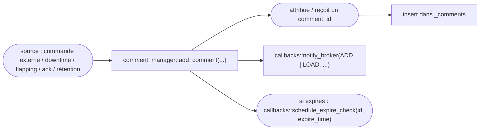
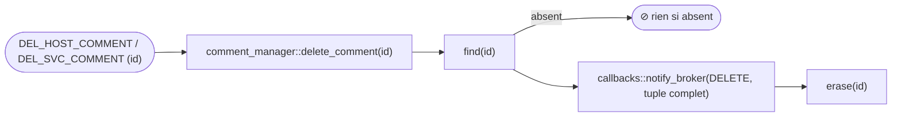

# Librairie comments — Guide d'intégration Broker

<!-- TOC -->
* [Librairie comments — Guide d'intégration Broker](#librairie-comments--guide-dintégration-broker)
  * [Vue d'ensemble](#vue-densemble)
  * [État actuel dans Engine](#état-actuel-dans-engine)
    * [La classe comment](#la-classe-comment)
    * [La map statique comment::comments](#la-map-statique-commentcomments)
    * [Les quatre types de commentaires](#les-quatre-types-de-commentaires)
    * [Opérations de suppression](#opérations-de-suppression)
    * [Notification broker](#notification-broker)
  * [Architecture cible (partagée)](#architecture-cible-partagée)
    * [Hiérarchie des classes](#hiérarchie-des-classes)
    * [comment — classe de base](#comment--classe-de-base)
    * [comment_manager — singleton propriétaire](#comment_manager--singleton-propriétaire)
    * [comment_callbacks — contrat d'intégration](#comment_callbacks--contrat-dintégration)
  * [Cycle de vie d'un commentaire](#cycle-de-vie-dun-commentaire)
    * [Création](#création)
    * [Suppression ciblée par id](#suppression-ciblée-par-id)
    * [Suppression en masse](#suppression-en-masse)
    * [Expiration](#expiration)
    * [Commentaires liés à un downtime](#commentaires-liés-à-un-downtime)
    * [Commentaires liés au flapping](#commentaires-liés-au-flapping)
    * [Commentaires d'acquittement](#commentaires-dacquittement)
  * [Intégration dans Broker](#intégration-dans-broker)
    * [Initialisation](#initialisation)
    * [Callbacks à implémenter](#callbacks-à-implémenter)
      * [Existence des objets](#existence-des-objets)
      * [Notification broker](#notification-broker-1)
      * [Planification de l'expiration](#planification-de-lexpiration)
    * [Identité d'un commentaire : comment_id vs internal_id](#identité-dun-commentaire--comment_id-vs-internal_id)
    * [Piloter le manager depuis les événements BBDO](#piloter-le-manager-depuis-les-événements-bbdo)
    * [Rétention](#rétention)
  * [Différences clés avec l'implémentation engine](#différences-clés-avec-limplémentation-engine)
<!-- TOC -->

---

## Vue d'ensemble

Aujourd'hui, la gestion des commentaires vit **entièrement dans Engine** (`engine/src/comment.cc`,
`engine/inc/com/centreon/engine/comment.hh`). Il n'existe pas encore de librairie partagée comme
pour les downtimes.

L'objectif de cette réimplémentation est de factoriser la gestion des commentaires dans une
librairie `common/comments`, sur le même modèle que `common/downtimes` :

* une classe `comment` portant l'état d'un commentaire ;
* un singleton `comment_manager` propriétaire de l'ensemble des commentaires ;
* une interface abstraite `comment_callbacks` injectant tous les points spécifiques à
  l'environnement d'exécution (existence des objets, planification d'événements, notification
  broker) ;
* **aucun code spécifique à engine ou broker** dans la librairie elle-même.

Engine fournirait `engine_comment_callbacks` ; Broker devrait fournir sa propre implémentation
`broker_comment_callbacks`. À terme, cela permet à Broker de **posséder** les commentaires (et
notamment d'en générer l'identifiant), réduisant Engine au rôle de relais — voir
[Identité d'un commentaire](#identité-dun-commentaire--comment_id-vs-internal_id).

Un commentaire peut avoir l'un de quatre **types d'entrée** (`entry_type`) : `user`, `downtime`,
`flapping`, `acknowledgment`.

---

## État actuel dans Engine

### La classe comment

`engine/inc/com/centreon/engine/comment.hh`

| Champ | Type | Signification |
|---|---|---|
| `_comment_type` | `enum type { host = 1, service }` | Objet porteur |
| `_entry_type` | `enum e_type { user = 1, downtime, flapping, acknowledgment }` | Origine du commentaire |
| `_comment_id` | `uint64_t` | Identifiant unique (minté par Engine) |
| `_source` | `enum src { internal, external }` | Créé par le moteur ou par une commande externe |
| `_persistent` | `bool` | Survit aux redémarrages / non supprimé automatiquement |
| `_entry_time` | `time_t` | Date de création |
| `_expires` / `_expire_time` | `bool` / `time_t` | Expiration optionnelle |
| `_host_id` / `_service_id` | `uint64_t` | Objet concerné (`_service_id == 0` ⇒ commentaire hôte) |
| `_author` | `std::string` | Auteur |
| `_comment_data` | `std::string` | Texte |

### La map statique comment::comments

`engine/src/comment.cc:26`

```cpp
comment_map comment::comments;            // absl::flat_hash_map<uint64_t, shared_ptr<comment>>
uint64_t comment::_next_comment_id = 1;   // compteur d'ID minté par Engine
```

Tout commentaire est inséré dans cette map globale, indexée par `comment_id`. L'ID est attribué par
Engine dans le constructeur (`comment.cc:63-68`) lorsqu'aucun ID n'est fourni ; sinon le commentaire
est considéré comme **chargé** (rétention). `_next_comment_id` est :

* persisté dans la rétention (`retention/program.cc`, clé `next_comment_id`) ;
* exposé dans `status.dat` (`xsddefault.cc:224`) et dans le `program_status` gRPC
  (`command_manager.cc:268`) ;
* remis à `1` au rechargement de configuration (`applier/state.cc:224,260`).

### Les quatre types de commentaires

Trois types stockent désormais leur `comment_id` sur l'objet propriétaire pour pouvoir le supprimer
plus tard ; seuls les commentaires `user` sont adressés par un id fourni de l'extérieur.

| `entry_type` | Créé par | `comment_id` stocké | Supprimé quand |
|---|---|---|---|
| `user` | `cmd_add_comment` (`commands.cc:207`) — `ADD_HOST_COMMENT` / `ADD_SVC_COMMENT` | — | `DEL_*_COMMENT` par id, `DEL_ALL_*`, ou suppression de l'objet |
| `downtime` | `downtime::subscribe()` via callback (`engine_downtime_callbacks.cc:478`) | `downtime::_comment_id` | destruction de l'objet downtime |
| `flapping` | `host::set_flap()` / `service::set_flap()` (`host.cc:1980`, `service.cc:2742`) | `notifier::_flapping_comment_id` | `clear_flap()` (fin du flapping) |
| `acknowledgment` | `cmd_acknowledge_*_problem` (`commands.cc`) | `notifier::_acknowledgement_comment_id` (non persistant uniquement) | levée d'ack → suppression par id stocké |

> **Phase 1 (faite).** Le type `acknowledgment` était auparavant retrouvé par scan de toute la map
> filtré sur `entry_type==ack`. Il calque désormais `flapping` : l'id d'un commentaire d'ack
> non-persistant est conservé sur le notifier (`_acknowledgement_comment_id`) à la création et
> supprimé par id à la levée de l'acquittement. Les commentaires d'ack persistants ne sont jamais
> trackés (id reste `0`) donc ils survivent — même sémantique, sans scan de map.

### Opérations de suppression

`engine/src/comment.cc`

| Méthode | Clé | Usage |
|---|---|---|
| `delete_comment(id)` | `comment_id` (find) | `DEL_HOST_COMMENT` / `DEL_SVC_COMMENT`, et toute suppression ciblée (downtime, flapping, ack) |
| `delete_host_comments(host_id)` | itération | `DEL_ALL_HOST_COMMENTS` |
| `delete_service_comments(host_id, svc_id)` | itération | `DEL_ALL_SVC_COMMENTS` |
| `notifier::delete_acknowledgement_comment()` | `comment_id` (stocké sur le notifier) | levée d'ack (remplace les anciens scans de map) |
| `remove_if_expired_comment(id)` | `comment_id` + `expires`/`expire_time` | `EVENT_EXPIRE_COMMENT` — **code mort** (cf. ci-dessous) |

Les suppressions ciblées envoient à Broker un `NEBTYPE_COMMENT_DELETE` reconstruit à partir du
**tuple complet** du commentaire (auteur, host/service, entry_time, etc.) — c'est précisément la
raison d'être de la map mémoire qui subsiste encore.

> **Constat de la Phase 0 — l'expiration est du code mort.** Tout commentaire est créé avec
> `expires=false` (`commands.cc`, `host.cc`, `service.cc`, `engine_downtime_callbacks.cc`) et aucune
> commande externe ne porte de paramètre d'expiration. Rien ne produit jamais de commentaire
> expirant, donc `EVENT_EXPIRE_COMMENT` / `remove_if_expired_comment` ne se déclenchent jamais. Ils
> seront simplement supprimés (pas portés vers Broker).

### Notification broker

`engine/src/comment.cc` → `broker_comment_data()` → `forward_pb_comment()` (`broker.cc:1295`).

* Création : `broker_comment_data(NEBTYPE_COMMENT_ADD | NEBTYPE_COMMENT_LOAD, ...)`
  (`comment.cc:64`), selon que l'ID a été minté ou chargé.
* Suppression : `broker_comment_data(NEBTYPE_COMMENT_DELETE, ...)`.

**Important** : côté `forward_pb_comment`, le seul effet du `type` est de positionner
`deletion_time` quand il vaut `NEBTYPE_COMMENT_DELETE` (`broker.cc:1323`). `ADD` et `LOAD`
produisent **exactement le même message** `Comment` BBDO ; le message ne porte d'ailleurs aucun
champ permettant de les distinguer. La sémantique utile se résume donc à un booléen
« supprimé / non supprimé ».

---

## Architecture cible (partagée)

### Hiérarchie des classes

```
comment_callbacks  (abstrait — injecté au démarrage)
    ↑ implémenté par
engine_comment_callbacks   (côté Engine, engine/src/)
broker_comment_callbacks   (côté Broker — à écrire)

comment            (base, common/comments/)
comment_manager    (singleton, propriétaire de tous les commentaires)
```

Contrairement aux downtimes, **aucune spécialisation `host_comment` / `service_comment` n'est
nécessaire** : la distinction hôte/service se réduit à `_service_id == 0` et au champ `_comment_type`
(c'est d'ailleurs la direction prise par la simplification des downtimes, où `host_downtime` et
`service_downtime` ne sont plus compilés).

### comment — classe de base

Reprend les champs de la classe actuelle (voir [La classe comment](#la-classe-comment)). La logique
spécifique à l'environnement (notification broker, planification de l'expiration) est déléguée aux
callbacks plutôt que codée en dur.

### comment_manager — singleton propriétaire

Remplace la map statique `comment::comments` et les helpers statiques. Possède :

```cpp
comment_map _comments;   // indexé par comment_id
```

| Méthode | Description |
|---|---|
| `load(callbacks)` | Initialise le singleton avec les callbacks injectés |
| `add_comment(...)` | Crée un commentaire, l'insère, notifie broker |
| `delete_comment(id)` | Supprime un commentaire par id, notifie broker |
| `delete_host_comments(host_id)` | Supprime tous les commentaires d'un hôte |
| `delete_service_comments(host_id, svc_id)` | Idem pour un service |
| `delete_acknowledgement_comments(host_id, svc_id)` | Supprime les commentaires d'ack non persistants |
| `remove_if_expired_comment(id)` | Supprime si expiré |
| `find(id)` | Recherche par id |
| `clear()` | Vidage (rechargement de configuration) |
| `callbacks()` | Accès aux `comment_callbacks` injectés |

### comment_callbacks — contrat d'intégration

La librairie rappelle l'intégrateur pour toute opération nécessitant la connaissance de
l'environnement d'exécution.

```cpp
enum class action { ADD, LOAD, DELETE };
```

> Note : `ADD` et `LOAD` sont aujourd'hui équivalents en aval (voir
> [Notification broker](#notification-broker)). Ils sont conservés pour la compatibilité NEBTYPE
> mais sont fusionnables.

Méthodes purement virtuelles attendues :

```cpp
// Existence (cache broker / objets engine)
bool host_exists(uint64_t host_id) override;
bool service_exists(uint64_t host_id, uint64_t service_id) override;

// Notification : publie/persiste le changement
void notify_broker(action act,
                   comment::type comment_type, comment::e_type entry_type,
                   uint64_t host_id, uint64_t service_id, time_t entry_time,
                   const std::string& author, const std::string& data,
                   bool persistent, comment::src source,
                   bool expires, time_t expire_time, uint64_t comment_id) override;

// Expiration
void schedule_expire_check(uint64_t comment_id, time_t when) override;
void remove_expire_check(uint64_t comment_id) override;
```

---

## Cycle de vie d'un commentaire

### Création



### Suppression ciblée par id



C'est aussi le chemin utilisé par la destruction d'un downtime (`_comment_id`) et la fin d'un
flapping (`_flapping_comment_id`).

### Suppression en masse

`DEL_ALL_HOST_COMMENTS` / `DEL_ALL_SVC_COMMENTS` itèrent la map et suppriment tous les commentaires
de l'objet. Au niveau Broker, ces opérations se traduisent naturellement en
`UPDATE comments SET deletion_time = ... WHERE host_id = ... [AND service_id = ...]`.

### Expiration

Les commentaires marqués `expires = true` planifient un `EVENT_EXPIRE_COMMENT`
(`timed_event.cc:291`) qui appelle `remove_if_expired_comment(id)`. Dans Broker, l'équivalent est un
timer one-shot `io_context` ; `schedule_expire_check` / `remove_expire_check` jouent le rôle de
`schedule_downtime_check` / `remove_downtime_check` côté downtimes.

### Commentaires liés à un downtime

Voir [downtimes-integration-fr.md](downtimes-integration-fr.md). Le downtime crée son commentaire à
`subscribe()` et mémorise `_comment_id` ; il le supprime à sa destruction. Le commentaire vit donc
exactement aussi longtemps que l'objet downtime. Le passage `START`/`STOP` ne touche **pas** au
commentaire.

### Commentaires liés au flapping

Symétrique au downtime : `host::set_flap()` / `service::set_flap()` créent un commentaire `flapping`
et stockent son ID dans `notifier::_flapping_comment_id` ; `clear_flap()` le supprime
(`host.cc:2014`, `service.cc:2777`). Le commentaire vit le temps de l'épisode de flapping.

### Commentaires d'acquittement

Créés par `cmd_acknowledge_*_problem`. Depuis la Phase 1, ils se comportent comme les commentaires de
flapping : l'id d'un commentaire d'ack **non persistant** est stocké sur le notifier
(`_acknowledgement_comment_id`) à la création. À la levée de l'ack,
`notifier::delete_acknowledgement_comment()` le supprime par id et remet le champ à zéro. Les
commentaires d'ack persistants ne sont jamais trackés (id reste `0`) et survivent donc à la levée. Au
redémarrage, `retention/applier/comment.cc` restaure le lien d'id pour un ack non persistant conservé.

---

## Intégration dans Broker

### Initialisation

```cpp
// Au démarrage de cbd, après que le cache est prêt :
comment_manager::load(std::make_unique<broker_comment_callbacks>(...));
// recharger les commentaires depuis la rétention si nécessaire
```

### Callbacks à implémenter

#### Existence des objets

```cpp
bool host_exists(uint64_t host_id) override;
bool service_exists(uint64_t host_id, uint64_t service_id) override;
```

Dans Broker, interrogent le cache global (`broker_cache`).

#### Notification broker

```cpp
void notify_broker(action act, ...) override;
```

Dans Engine, cette méthode appelle `broker_comment_data()` qui publie un `pb_comment` vers Broker.
Dans Broker, c'est l'inverse : le point où la librairie informe le code Broker qu'un commentaire a
changé. Selon l'architecture, cela :

* met à jour la table `comments` via `unified_sql` (insert/upsert pour `ADD`/`LOAD`, positionnement
  de `deletion_time` pour `DELETE`) ;
* met éventuellement à jour le cache global.

Correspondance des actions :

| `action` | NEBTYPE Engine | Effet en DB |
|---|---|---|
| `ADD` | `NEBTYPE_COMMENT_ADD` | insert / upsert |
| `LOAD` | `NEBTYPE_COMMENT_LOAD` | insert / upsert (identique à `ADD`) |
| `DELETE` | `NEBTYPE_COMMENT_DELETE` | `deletion_time` positionné |

#### Planification de l'expiration

```cpp
void schedule_expire_check(uint64_t comment_id, time_t when) override;
void remove_expire_check(uint64_t comment_id) override;
```

Timers one-shot `io_context` appelant `comment_manager::instance().remove_if_expired_comment(id)`.
Broker maintient une map `comment_id → timer` pour pouvoir annuler.

### Identité d'un commentaire : comment_id vs internal_id

C'est le point central pour faire de Broker le propriétaire des commentaires. La table
`centreon_storage.comments` porte **deux** identifiants :

```sql
comment_id  int NOT NULL AUTO_INCREMENT,        -- PRIMARY KEY, générée par la base
internal_id int NOT NULL,                        -- = comment_id mémoire d'Engine
UNIQUE KEY (entry_time, host_id, service_id, instance_id, internal_id),
KEY (internal_id)
```

* `comment_id` (PK) est **déjà** entièrement géré par MariaDB : ni Engine ni Broker ne l'écrivent.
  Aujourd'hui il n'est **pas** utilisé pour adresser un commentaire — l'IHM ne le renvoie jamais.
* `internal_id` est l'ID minté par Engine. Il est **porteur aux deux bouts de la chaîne** et joue
  deux rôles distincts :
  1. **Handle de suppression utilisé par l'IHM.** C'est le point crucial, et il est plus fort qu'un
     simple « Broker renvoie le tuple ». Lorsqu'un opérateur supprime un commentaire, l'IHM/API
     Centreon envoie une **commande externe** `DEL_HOST_COMMENT` / `DEL_SVC_COMMENT` portant
     l'**`internal_id`** — et *non* la PK `comment_id` (`www/include/monitoring/comments/common-Func.php`).
     Engine retrouve le commentaire dans sa map mémoire par cet id (son `comment_id` == l'`internal_id`
     en base), puis envoie `NEBTYPE_COMMENT_DELETE` avec le tuple complet ; Broker positionne
     `deletion_time` via la clé unique. C'est donc `internal_id` qui sert de clé à tout l'aller-retour
     de suppression.
  2. **Désambiguïsation de la clé unique / idempotence de l'upsert.** Il désambiguïse la clé unique
     (deux commentaires créés la même seconde sur le même host/service depuis le même poller
     entreraient sinon en collision) et, comme l'`INSERT ... ON DUPLICATE KEY UPDATE` n'écrit jamais
     `comment_id`, c'est aussi lui qui fait qu'un `pb_comment` rejoué par BBDO fait un upsert sur place
     au lieu de dupliquer.

**Cible** : confier l'identité à la PK `comment_id`. À noter que ce n'est **pas un changement
Broker-only** — c'est une **migration cross-repo** coordonnée (Centreon web PHP + Broker),
précisément parce que l'IHM adresse les commentaires par `internal_id` aujourd'hui :

1. **PHP/IHM** : lire et envoyer `comment_id` (au lieu d'`internal_id`) dans le chemin de suppression
   — soit dans `DEL_*_COMMENT` (Engine route alors dessus), soit en parlant directement à Broker.
2. **Broker** : ajouter un chemin « delete-by-id » exécutant `UPDATE comments SET deletion_time = ...
   WHERE comment_id = X`.
3. À la création, Engine n'attribue plus d'ID : Broker laisse la PK auto-increment décider.
4. **L'idempotence doit être préservée** : tant qu'Engine reste le *producteur* des commentaires et
   que BBDO peut rejouer les événements, une clé stable côté producteur reste nécessaire pour éviter
   les lignes dupliquées — donc `internal_id` (ou un équivalent) survit dans le rôle (2) même après
   que le rôle (1) ait basculé sur `comment_id`. Il ne disparaît totalement que si l'**origination**
   des commentaires migre elle-même dans Broker.

Une fois les rôles (1) et (2) traités, Engine n'a plus besoin de minter et stocker des ID, et la map
mémoire `comment::comments` peut disparaître — à condition de migrer aussi vers Broker l'expiration
et les suppressions en masse (cf. ci-dessus).

### Piloter le manager depuis les événements BBDO

| Contenu de l'événement BBDO `pb_comment` | Appel `comment_manager` |
|---|---|
| `deletion_time` non positionné | `add_comment(...)` |
| `deletion_time` positionné | `delete_comment(id)` |

### Rétention

Engine persiste aujourd'hui les commentaires et `next_comment_id` dans son fichier de rétention.
Si Broker devient propriétaire des commentaires, cette persistance devient redondante avec la table
`comments` : Broker recharge depuis la DB plutôt que depuis un fichier de rétention, et
`next_comment_id` disparaît (remplacé par l'auto-increment).

---

## Différences clés avec l'implémentation engine

| Aspect | Engine (actuel) | Broker (cible) |
|---|---|---|
| Stockage | Map statique `comment::comments` | Table `comments` + cache |
| Identifiant | `comment_id` minté par Engine → `internal_id` en base | PK `comment_id` auto-increment |
| Handle de suppression IHM | `internal_id` (via commande externe `DEL_*_COMMENT`) | `comment_id` (nécessite un changement PHP/IHM) |
| Clé d'idempotence (replay) | `internal_id` dans la clé unique (upsert) | toujours nécessaire tant qu'Engine produit — conservé |
| Lookup d'objet | `host::hosts`, `service::services` | Cache global (`broker_cache`) |
| Suppression par id | `delete_comment(id)` reconstruit le tuple complet | `UPDATE ... WHERE comment_id = X` |
| Suppression en masse | Itération de la map | `UPDATE ... WHERE host_id = ...` |
| Expiration | `EVENT_EXPIRE_COMMENT` (boucle d'événements) | Timer one-shot `io_context` |
| Type ADD vs LOAD | Émis distinctement, équivalents en aval | Fusionnables (un seul « insert ») |
| Notification broker | Publie un `pb_comment` *vers* Broker | Met à jour la DB / publie vers les clients |
| Rétention | Fichier + `next_comment_id` | Rechargement depuis la table `comments` |
