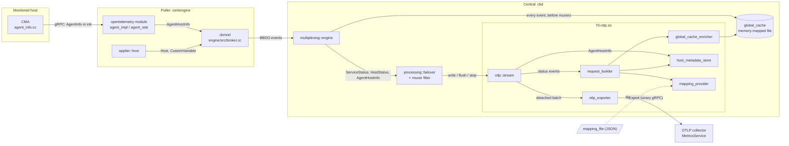
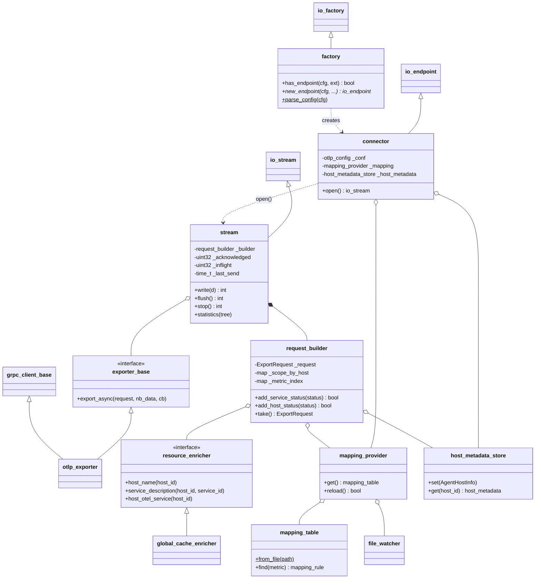
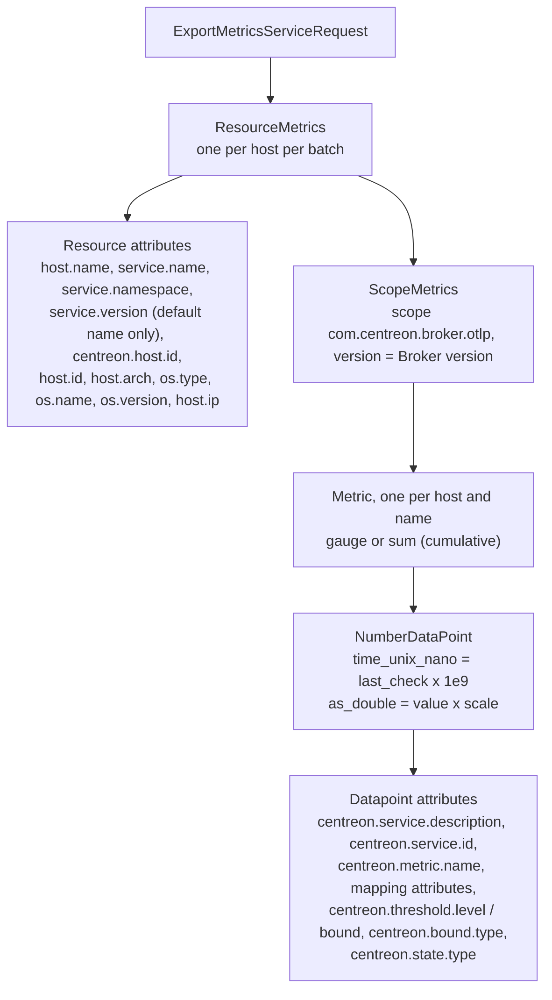
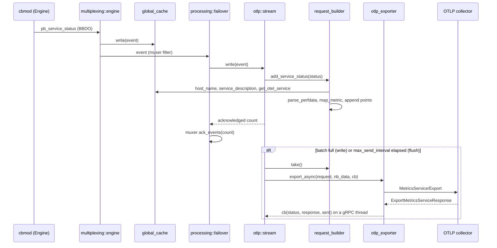
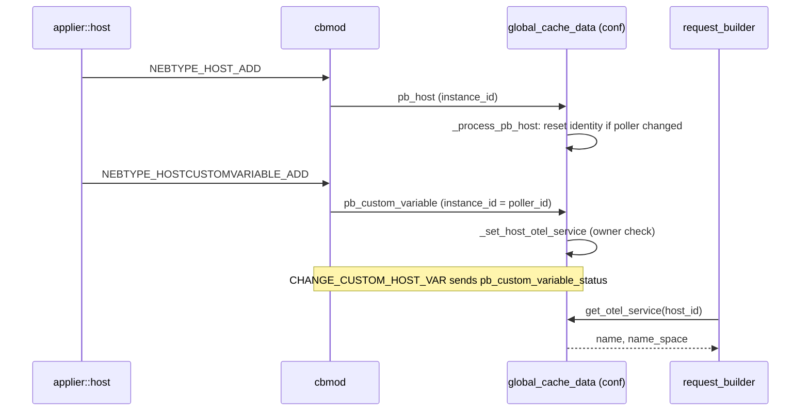

# Broker OTLP output

## 1. Overview

The OTLP output is a Centreon Broker output module, `70-otlp.so`, used by endpoints of type `otlp`. It turns check results into OpenTelemetry metrics and pushes them to any OTLP collector through the gRPC `MetricsService/Export` call.

- **Problem solved:** Centreon monitoring data (perfdata, thresholds, check states) can go to OpenTelemetry backends with standard OTel resource identity (`host.name`, `service.name`, `service.namespace`, `host.*`, `os.*`). Metric names can follow OTel semantic conventions through a mapping file that is reloaded when it changes.
- **Place in the system:** the module runs inside `cbd` as an output endpoint fed by the muxer. It reads NEB status events directly. It does not depend on `unified_sql`, a database, or RRD. Resolving names and identities relies on the Broker global cache. Two supporting changes live outside the Broker:
  - Engine sends the host information of Centreon Monitoring Agents (CMA) and tags custom variables with their poller.
  - The CMA collects OS, architecture and machine id.
- **Input:** `neb::pb_service_status`, `neb::pb_host_status` and `neb::pb_agent_host_info` events. The global cache supplies host names, service descriptions and the OTel identity. A JSON mapping file is optional.
- **Output:** `opentelemetry.proto.collector.metrics.v1.ExportMetricsServiceRequest` messages, sent as unary gRPC calls.

## 2. Architecture

### 2.1 High-level view



The feature spans three binaries:

| Layer | Location | Role in the feature |
|---|---|---|
| Agent (CMA) | `agent/` | Collects `os_type`, `os_name`, `os_version`, `arch`, `machine_id`, `ips` and sends them in `AgentInfo` when the connection is established. |
| Engine | `engine/modules/opentelemetry/`, `engine/src/` | Turns `AgentInfo` into an `AgentHostInfo` BBDO event. Tags custom-variable events with `instance_id`. Sends host custom variables after the host. |
| BBDO | `bbdo/` | New `AgentHostInfo` message and `instance_id` fields. New `pb_otel_grpc_lib` target that holds the `MetricsService` stub. |
| Broker core | `broker/core/` | Global cache stores the per-host OTel identity. New BBDO2 → BBDO3 converter for `custom_variable_status`. Maps endpoint type `otlp` to `70-otlp.so`. |
| Broker OTLP module | `broker/otlp/` | Builds the OTLP requests and exports them. |

**Boundaries.** The module never reads from the network except the Export responses, and it never writes to the cache. Everything it knows about hosts comes from three places:

- the global cache (read-only through `resource_enricher`);
- `AgentHostInfo` events (kept in `host_metadata_store`);
- the status events themselves.

The cache itself is fed by `multiplexing::engine::_send_to_subscribers()`. That function writes every event to `cache::global_cache::instance_ptr()` before publishing it to the muxers, so a `Host` or `CustomVariable` event updates the cache before any later status reaches the stream.

**External libraries and protocols:**

- gRPC C++ callback API (`MetricsService::Stub::async()->Export`) through `common::grpc::grpc_client_base`;
- protobuf messages from `opentelemetry-proto`;
- Boost.Interprocess, for the memory-mapped global cache;
- Boost.Asio, to parse IP addresses and run the file watcher;
- rapidjson with a JSON schema (`common::json_validator`) for the mapping file;
- Abseil containers and mutexes.

### 2.2 Broker module structure



Ownership and lifetime:

- **Connector-level (one per endpoint):** `otlp_config`, `mapping_provider` and `host_metadata_store`. They outlive stream reopenings by `processing::failover`.
- **Stream-level (one per `connector::open()`):** the `stream`, its `request_builder`, its `global_cache_enricher` and its `otlp_exporter`, which owns its own gRPC channel.

### 2.3 Components

#### Module entry point

**Responsibility.** Registers the `OTLP` protocol with the Broker I/O layer.

**Main files**
```text
broker/otlp/src/main.cc
broker/core/src/config/parser.cc   (type "otlp" → "70-otlp.so")
broker/CMakeLists.txt              (add_broker_module(OTLP ON))
```

**Main classes/functions.** `broker_module_init()`, `broker_module_deinit()`, `broker_module_parents()`.

**Interactions.**
- `broker_module_parents()` returns `10-neb.so`, which registers the NEB events that the module consumes.
- `broker_module_init()` calls `io::protocols::instance().reg("OTLP", std::make_shared<otlp::factory>(), 1, 7)` on the first load.

#### factory

**Responsibility.** Recognizes `otlp` endpoints, validates and parses their parameters, loads the global cache and creates the `connector`.

**Main files**
```text
broker/otlp/inc/com/centreon/broker/otlp/factory.hh
broker/otlp/src/factory.cc
broker/otlp/inc/com/centreon/broker/otlp/otlp_config.hh
```

**Main classes/functions.**
- `factory::has_endpoint()`: matches `type` case-insensitively.
- `factory::parse_config()`: fills `otlp_config`.
- `factory::new_endpoint()`: always a connector (`is_acceptor = false`).

**Interactions.**
- Throws `msg_fmt` in three cases:
  - `endpoint` is missing;
  - a number or boolean parameter is not well-formed;
  - `max_datapoints_per_batch` or `max_inflight_requests` is 0.
- When `config::applier::state::loaded()`, calls `cache::global_cache::load()` on `<cache_dir>.cache.global`, so that host names can be resolved.

#### connector

**Responsibility.** Endpoint that fixes the event subscription and creates the streams.

**Main files**
```text
broker/otlp/inc/com/centreon/broker/otlp/connector.hh
broker/otlp/src/connector.cc
```

**Main classes/functions.** `connector::connector()`, `connector::open()`.

**Interactions.**
- The mandatory muxer filter is `{pb_service_status, pb_host_status, pb_agent_host_info}`. The forbidden filter is its reverse. With that pair, `config::applier::endpoint` forces exactly this set and ignores any user `filters` block.
- The constructor builds the `mapping_provider`: `mapping_provider::empty()` when `mapping_file` is empty, `mapping_provider::load()` otherwise. `load()` throws on an invalid file.
- `open()` returns a new `stream` wired to the following:
  - a new `global_cache_enricher`;
  - the shared `mapping_provider`;
  - a new `otlp_exporter`;
  - the shared `host_metadata_store`.

#### stream

**Responsibility.** Output stream driven by `processing::failover`. It dispatches each event, triggers batches and reports acknowledgements.

**Main files**
```text
broker/otlp/inc/com/centreon/broker/otlp/stream.hh
broker/otlp/src/stream.cc
```

**Main classes/functions.**
- `stream::write()`, `stream::flush()`, `stream::stop()`, `stream::statistics()`;
- private: `_prepare_send_locked()`, `_dispatch()`, `_take_acknowledged_locked()`;
- `read()` always throws `exceptions::shutdown`.

**Interactions.**
- Receives events from the failover thread, the single writer.
- Sends status events to `request_builder`, and `AgentHostInfo` to `host_metadata_store::set()`.
- Detaches batches with `request_builder::take()` and hands them to `exporter_base::export_async()`.
- The completion callback runs on a gRPC thread. It takes `_protect`, decrements `_inflight` and updates the statistics. Batches are therefore detached while holding `_protect`, and dispatched only after releasing it.

#### request_builder

**Responsibility.** Accumulates status events into a single `ExportMetricsServiceRequest`, with one `ResourceMetrics` per host and one `Metric` per (host, metric name).

**Main files**
```text
broker/otlp/inc/com/centreon/broker/otlp/request_builder.hh
broker/otlp/src/request_builder.cc
```

**Main classes/functions.**
- public: `add_service_status()`, `add_host_status()`, `take()`, `nb_data()`, `empty()`;
- private: `_scope_for_host()`, `_metric_for()`, `_new_point()`, `_add_perfdata()`, `_add_host_metadata()`;
- helpers: `is_link_local()`, `to_unix_nano()`.

**Interactions.**
- Asks the `resource_enricher` for the host name, the service description and the OTel identity.
- Takes one `mapping_table` snapshot from `mapping_provider::get()` for each status.
- Asks `host_metadata_store::get()` for the CMA host information.
- Parses perfdata with `common::perfdata::parse_perfdata()`.

#### Semantic-convention mapping

**Responsibility.** Resolves a Centreon perfdata label to an emitted metric (name, unit, instrument, scale, attributes).

**Main files**
```text
broker/otlp/inc/com/centreon/broker/otlp/semconv_mapping.hh
broker/otlp/src/semconv_mapping.cc
```

**Main classes/functions.**
- types: `mapping_table`, `mapping_rule`, `mapping`, `instrument` (`gauge`, `sum_monotonic`, `sum_non_monotonic`), `decomposed_name`;
- functions: `decompose()`, `map_metric()`, `sanitize()`, `threshold_metric_name()`, `bound_metric_name()`.

**Interactions.**
- `mapping_table::from_json()` validates the document against the embedded schema `k_mapping_schema`, then builds an immutable table. It is used by `mapping_provider` and `request_builder`.

#### mapping_provider

**Responsibility.** Serves the current `mapping_table` and replaces it when the file is rewritten.

**Main files**
```text
broker/otlp/inc/com/centreon/broker/otlp/mapping_provider.hh
broker/otlp/src/mapping_provider.cc
common/inc/com/centreon/common/file_watcher.hh
```

**Main classes/functions.** `mapping_provider::empty()`, `load()`, `get()`, `reload()`, `_start_watcher()`.

**Interactions.**
- `common::file_watcher` watches the parent directory of the file (inotify on Linux, `ReadDirectoryChangesW` on Windows).
- The watcher debounces events and calls `reload()` on the `io_context` thread.
- `get()` may be called from any thread, under `absl::Mutex`.

#### resource_enricher / global_cache_enricher

**Responsibility.** A read-only interface to the names and identity stored in the global cache.

**Main files**
```text
broker/otlp/inc/com/centreon/broker/otlp/resource_enricher.hh
broker/otlp/src/resource_enricher.cc
```

**Main classes/functions.**
- `resource_enricher` (abstract): `host_name()`, `service_description()`, `host_otel_service()`;
- `global_cache_enricher` implements it;
- the `otel_service` struct.

**Interactions.**
- Uses `cache::global_cache::instance_ptr()`: `get_host()`, `get_service()` and `get_otel_service()`.
- Returns `nullopt` or empty values when the cache is not loaded.

#### Global cache: OTel identity

**Responsibility.** Stores `OTEL_SERVICE_NAME` / `OTEL_SERVICE_NAMESPACE` for each host, and enforces which poller is allowed to update them.

**Main files**
```text
broker/core/cache/inc/com/centreon/broker/cache/global_cache.hh
broker/core/cache/inc/com/centreon/broker/cache/global_cache_data.hh
broker/core/cache/src/global_cache_data.cc
broker/core/src/bbdo2_to_bbdo3.cc
```

**Main classes/functions.**
- `global_cache_data::id_to_otel_service`: the `host_otel_service` map in the memory-mapped file;
- update paths: `_process_pb_custom_variable()`, `_process_pb_custom_variable_status()`, `_set_host_otel_service()`;
- clean-up in `_process_pb_host()` and `_process_pb_instance()`;
- `get_otel_service()`;
- helper: `otel_service_field_of()`.

**Interactions.**
- Receives events in `_write_conf()`, which handles:
  - `pb_custom_variable` and `pb_custom_variable_status`;
  - the BBDO2 `custom_variable` and `custom_variable_status`, converted by `bbdo2_to_bbdo3()`.
- `get_otel_service()` on a real-time cache delegates to the conf cache.

#### host_metadata_store

**Responsibility.** Keeps the last CMA host information of each host in memory.

**Main files**
```text
broker/otlp/inc/com/centreon/broker/otlp/host_metadata_store.hh
broker/otlp/src/host_metadata_store.cc
```

**Main classes/functions.** `host_metadata_store::set()`, `get()`, `size()`, and the `host_metadata` struct.

**Interactions.**
- Written by `stream::write()` from `AgentHostInfo` events, and read by `request_builder::_add_host_metadata()`.
- Protected by its own `absl::Mutex`, because all the streams of an endpoint share it.

#### otlp_exporter

**Responsibility.** Sends one batch as a unary gRPC `Export` call, without blocking.

**Main files**
```text
broker/otlp/inc/com/centreon/broker/otlp/otlp_exporter.hh
broker/otlp/src/otlp_exporter.cc
common/grpc/src/grpc_client.cc
bbdo/CMakeLists.txt               (pb_otel_grpc_lib)
```

**Main classes/functions.**
- `exporter_base` (abstract, a seam for tests);
- `otlp_exporter::export_async()`;
- the `pending_call` struct, which holds the `ClientContext`, the request and the response.

**Interactions.**
- `grpc_client_base` builds the channel: TLS or insecure credentials, keepalive and compression.
- `MetricsService::Stub` comes from `pb_otel_grpc_lib`, generated in `bbdo/` next to the `opentelemetry-proto` messages.
- The callback logs RPC failures and `partial_success.rejected_data_points`, then calls the stream callback.

#### Engine side

**Responsibility.**
- Publishes the CMA host information.
- Makes custom-variable events attributable to a poller.
- Orders host and custom-variable events so that a moved host is attributed correctly.

**Main files**
```text
engine/modules/opentelemetry/src/centreon_agent/agent_impl.cc
engine/modules/opentelemetry/src/centreon_agent/agent_stat.cc
engine/modules/opentelemetry/inc/com/centreon/engine/modules/opentelemetry/centreon_agent/agent_stat.hh
engine/src/broker.cc
engine/src/configuration/applier/host.cc
```

**Main classes/functions.**
- `agent_stat::set_host_info()`, `agent_stat::_send_host_infos()`, `agent_stat::_send_timer_handler()`;
- `broker_agent_host_info()`;
- `forward_pb_custom_variable()` and `forward_pb_external_command()`: both set `instance_id` to `cbm->poller_id()`;
- `applier::host::add_object()` and `modify_object()`.

**Interactions.**
- `agent_impl::on_request()` calls `set_host_info()` when it receives the `init` message.
- `_send_host_infos()` runs on the Engine main thread through `command_manager::enqueue()`. It resolves `host_id` from the host name in `host::hosts` and skips unknown hosts.

#### Agent side

**Responsibility.** Collects the OTel host and OS information.

**Main files**
```text
agent/native_linux/src/agent_info.cc
agent/native_windows/src/agent_info.cc
agent/inc/com/centreon/agent/agent_info.hh
agent/proto/agent.proto            (AgentInfo fields 8-11)
```

**Main classes/functions.** `read_os_version()`, `fill_agent_info()`, and on Linux `otel_arch()` and `read_machine_id()`.

**Interactions.**
- `read_os_version()` runs once at start-up (`main.cc`, `main_win.cc`).
- `fill_agent_info()` fills the `init` message sent by `streaming_client.cc` and `streaming_server.cc`.

### 2.4 Messages exchanged

| Message | Defined in | Producer → Consumer | Fields used by the feature |
|---|---|---|---|
| `AgentInfo` (in `MessageFromAgent.init`) | `agent/proto/agent.proto` | CMA → Engine | `host`, `os_version`, `ips`, `os_type` (8), `os_name` (9), `arch` (10), `machine_id` (11) |
| `AgentHostInfo` (`neb::de_pb_agent_host_info` = 59, gRPC tag 60) | `bbdo/neb.proto`, `bbdo/events.hh` | Engine → Broker | `poller_id`, `host_id`, `host_name`, `observed_at`, `os_type`, `os_name`, `os_version`, `arch`, `machine_id`, `ips` |
| `CustomVariable`, `CustomVariableStatus` | `bbdo/neb.proto` | Engine → Broker cache | `host_id`, `service_id`, `name`, `value`, `enabled`, `instance_id` (new, 12) |
| `Host`, `Instance` | `bbdo/neb.proto` | Engine → Broker cache | `host_id`, `instance_id`, `enabled`, `running` |
| `ServiceStatus`, `HostStatus` | `bbdo/neb.proto` | Engine → OTLP stream | `host_id`, `service_id`, `perfdata`, `last_check`, `state`, `state_type` |
| `ExportMetricsServiceRequest` / `Response` | `opentelemetry-proto` | OTLP stream → collector | see 2.5 |

`AgentHostInfo` is registered in `broker/neb/src/broker.cc` as `"AgentHostInfo"`, with table `no_table`. The comment line `/* io::neb, neb::de_pb_agent_host_info, 60 */` gives the tag of the BBDO gRPC oneof. `broker/grpc/generate_proto.py` parses that comment.

### 2.5 Output payload structure



The service identity is carried as datapoint attributes, not resource attributes, so all the series of a host stay grouped under one resource keyed by `host.name`.

## 3. Data / Execution Flow

### 3.1 Check result to OTLP export

1. Engine's cbmod emits a `pb_service_status` or `pb_host_status`.
2. In the central Broker, `multiplexing::engine::_send_to_subscribers()` first writes the event to the global cache, then publishes it to the muxers. The OTLP muxer filter lets only the three event types of the connector through.
3. `processing::failover` calls `stream::write(d)`. Under `_protect`:
   - `validate()` rejects null events.
   - A `pb_service_status` goes to `request_builder::add_service_status()`, a `pb_host_status` to `add_host_status()`.
   - The event is counted in `_acknowledged` in every case. When the host name is unknown, the builder returns `false` and `_stat_dropped_no_host_name` is incremented.
4. `add_service_status()` works through the status:
   - It resolves the host name through `global_cache_enricher::host_name()`, returning `false` if the name is unknown.
   - It resolves the service description, and converts `last_check` to nanoseconds.
   - It calls `_add_perfdata()`, then appends a `centreon.check.state` point when `send_status` is true.
5. `_add_perfdata()` parses the perfdata. For each value it:
   - calls `map_metric()` on the table snapshot;
   - calls `_metric_for()`, which creates the host resource through `_scope_for_host()` on its first use in the batch;
   - appends the value point, then the threshold and min/max points when those options are enabled.
6. When `nb_data() >= max_datapoints_per_batch`, `write()` calls `_prepare_send_locked()`. If fewer than `max_inflight_requests` exports are in flight, that call does three things:
   - it detaches the batch with `take()`;
   - it increments `_inflight`;
   - it resets `_last_send`.
7. After `_protect` is released, `write()` returns the acknowledged count and `_dispatch()` calls `otlp_exporter::export_async()`. The failover passes that count to `muxer::ack_events()`.
8. `export_async()` sets the deadline to `now + export_timeout` and starts `Export`. On completion, the callback runs on a gRPC thread:
   - it logs errors or rejected datapoints;
   - it decrements `_inflight`;
   - it updates `batches_sent`, `datapoints_sent` or `export_errors`.
9. When the failover is idle (no event and no stream activity), it calls `stream::flush()` about once per second. `flush()` sends the pending batch if `max_send_interval` seconds have passed since `_last_send`. `stop()` sends it whatever its age. Both remain subject to `max_inflight_requests`.



### 3.2 Service identity from host macros

1. `applier::host::expand_objects()` sets `is_sent` on the host custom variables that are allowed by `enable_macros_filter` / `macros_filter`.
2. `applier::host::add_object()` sends `NEBTYPE_HOST_ADD` first, then one `NEBTYPE_HOSTCUSTOMVARIABLE_ADD` for each variable with `is_sent`. `modify_object()` keeps `is_sent` when it updates a variable.
3. `forward_pb_custom_variable()` builds `pb_custom_variable` with `instance_id = poller_id`. `CHANGE_CUSTOM_HOST_VAR` builds `pb_custom_variable_status` with `instance_id` too.
4. In the Broker, `_write_conf()` routes the event to `_process_pb_custom_variable()` or `_process_pb_custom_variable_status()`. `otel_service_field_of()` keeps only host-level (`service_id == 0`) `OTEL_SERVICE_NAME` / `OTEL_SERVICE_NAMESPACE`, matched case-insensitively.
5. `_set_host_otel_service()` checks the owner and updates or clears the field in `id_to_otel_service`.
6. When `request_builder::_scope_for_host()` creates the resource of a host, it reads the identity through `global_cache_enricher::host_otel_service()`.



### 3.3 CMA host information

1. At start-up the agent runs `read_os_version()`. At each connection `fill_agent_info()` fills `AgentInfo`, which is sent as `MessageFromAgent.init`.
2. Engine's `agent_impl::on_request()` calls `agent_stat::set_host_info()`. That call stores the info, keyed by reactor, with the reception time, then calls `_send_host_infos()`.
3. `_send_host_infos()` enqueues a task on the Engine main thread. The task resolves `host_id` by host name, builds `AgentHostInfo` and calls `broker_agent_host_info()`, which sets `poller_id` and writes to cbmod.
4. `_send_timer_handler()` runs every minute. Every `host_info_snapshot_ticks` (5) ticks, it sends again the information of every agent still connected. `remove_agent()` drops the entry of a reactor.
5. In the Broker, `stream::write()` stores the event with `host_metadata_store::set()`.
6. `_add_host_metadata()` adds the non-empty fields to the host resource. When `host_ip_exclude_link_local` is set, it first filters `host.ip`.

### 3.4 Mapping reload

1. `common::file_watcher` detects a change of `mapping_file` and calls `mapping_provider::reload()`.
2. `reload()` calls `mapping_table::from_file()`:
   - on success, it swaps `_table` and logs `otlp: N metric mappings reloaded from <path>`;
   - on failure, it logs `otlp: <error>; keeping the previous mapping` and keeps the current table.
3. The next status processed by `request_builder` takes the new snapshot. A table already in use stays valid until its last `shared_ptr` is released.

## 4. Configuration

### 4.1 OTLP output endpoint

These parameters go in an element of the Broker `output` array. Every value must be a JSON string: `config::parser::_parse_endpoint()` copies only string values into `config::endpoint::params`, and ignores the others with a debug log.

| Parameter | Type | Required | Default | Description |
|---|---|---|---|---|
| `type` | `string` | Yes | - | `otlp` (case-insensitive in `factory::has_endpoint()`). Selects `70-otlp.so`. |
| `name` | `string` | Yes | - | Endpoint name, used in logs and errors. |
| `endpoint` | `string` | Yes | - | `host:port` of the OTLP gRPC collector. |
| `encryption` | `bool` | No | `false` | Uses TLS credentials instead of insecure ones. |
| `certificate` | `string` | No | `""` | Passed unchanged to `grpc_config` / `SslCredentialsOptions` (PEM content). The factory does not read files. |
| `private_key` | `string` | No | `""` | Same as `certificate`. |
| `ca_certificate` | `string` | No | `""` | Same as `certificate`. |
| `ca_name` | `string` | No | `""` | Stored in `grpc_config`. `grpc_client_base` applies it as `GRPC_SSL_TARGET_NAME_OVERRIDE_ARG` only in `TLS_INSECURE` mode. The constructor used by the factory leaves the mode at `NONE`, so the option has no effect for this output. |
| `compression` | `bool` | No | `false` | Enables gRPC compression (`GRPC_COMPRESS_LEVEL_HIGH`). |
| `keepalive_interval` | `uint` (s) | No | `30` | gRPC keepalive time. |
| `max_datapoints_per_batch` | `uint` | No | `5000` | Datapoint count that triggers an export in `write()`. Must be > 0. |
| `max_send_interval` | `uint` (s) | No | `10` | Age of the batch after which `flush()` sends it. |
| `max_inflight_requests` | `uint` | No | `4` | Maximum number of concurrent `Export` calls. Must be > 0. |
| `export_timeout` | `uint` (s) | No | `30` | Deadline of each `Export` call. |
| `mapping_file` | `string` | No | `""` | JSON mapping file. When empty, every metric is exported under `centreon.*`. When set, it is watched and reloaded; an invalid file at start-up makes endpoint creation fail. |
| `send_thresholds` | `bool` | No | `true` | Emits `*.threshold` metrics (warning/critical, lower/upper). |
| `send_min_max` | `bool` | No | `true` | Emits `*.bound` metrics (min/max). |
| `send_status` | `bool` | No | `true` | Emits `centreon.check.state` and `centreon.host.state`. |
| `host_ip_exclude_link_local` | `bool` | No | `false` | Removes `169.254.0.0/16` and `fe80::/10` addresses (including IPv4-mapped ones) from `host.ip`. |

Numbers are parsed with `absl::SimpleAtoi` and booleans with `absl::SimpleAtob`. An invalid value throws `otlp: '<key>' must be numeric|a boolean for endpoint '<name>'`. A `filters` block on this endpoint has no effect (see `connector`).

### 4.2 Host macros (Engine configuration)

| Macro | Scope | Default when unset or blank | Effect |
|---|---|---|---|
| `_OTEL_SERVICE_NAME` | host | `centreon-broker`, plus `service.version` = Broker version | Resource `service.name`. |
| `_OTEL_SERVICE_NAMESPACE` | host | `centreon` | Resource `service.namespace`. |

- The names are matched case-insensitively, and the values are trimmed at export time.
- Service-level variables with these names are ignored.
- When `enable_macros_filter` is enabled in Engine, both names must appear in `macros_filter`. Otherwise Engine does not send them (`applier::host::expand_objects()`).

### 4.3 Mapping file

A mapping file follows the schema in `semconv_mapping.cc` (`k_mapping_schema`). The keys of `metrics` are the metric part of a perfdata label, that is the text after `#`.

| Field | Type | Required | Default | Description |
|---|---|---|---|---|
| `name` | `string` | Yes | - | Emitted metric name. |
| `unit` | `string` | No | `""` | Emitted unit. |
| `instrument` | `string` | No | `gauge` | `gauge`, `sum_monotonic` or `sum_non_monotonic`. |
| `scale` | `number` | No | `1` | Multiplies the value, the thresholds and the bounds. |
| `attributes` | `object` of strings | No | - | Constant datapoint attributes. |
| `instance_attribute` | `string` | No | - | Datapoint attribute that receives the label instance. When set and the label has no instance, the rule is skipped (fallback). |
| `description` | `string` | No | - | Accepted by the schema and ignored by the code. |

### 4.4 Example

```json
{
  "centreonBroker": {
    "output": [
      {
        "name": "central-otlp",
        "type": "otlp",
        "endpoint": "otel-collector.example.com:4317",
        "compression": "true",
        "max_datapoints_per_batch": "5000",
        "max_send_interval": "10",
        "mapping_file": "/etc/centreon-broker/otlp-mapping.json",
        "host_ip_exclude_link_local": "true"
      }
    ]
  }
}
```

```json
{
  "metrics": {
    "disk.space.usage.bytes": {
      "name": "system.filesystem.usage",
      "unit": "By",
      "instrument": "sum_non_monotonic",
      "attributes": { "system.filesystem.state": "used" },
      "instance_attribute": "system.filesystem.mountpoint"
    }
  }
}
```

### 4.5 How the configuration reaches the code

1. **Parsing:**
   - `config::parser::_parse_endpoint()` maps `type: otlp` to the module `70-otlp.so`.
   - It stores the string values in `config::endpoint::params`.
   - `factory::parse_config()` turns them into an `otlp_config`.
   - The gRPC options go into a `common::grpc::grpc_config` (`otlp_config::grpc`).
2. **Storage:** the `otlp_config::pointer` is shared (`const`) by the `connector`, every `stream`, `request_builder` and `otlp_exporter`.
3. **Consumers:**

| Option | Consumer |
|---|---|
| gRPC options | `grpc_client_base` |
| `export_timeout` | `otlp_exporter` |
| `max_datapoints_per_batch`, `max_send_interval`, `max_inflight_requests` | `stream` |
| `send_*`, `host_ip_exclude_link_local` | `request_builder` |
| `mapping_file` | `connector` → `mapping_provider` |

4. **Host macros:** they reach the Broker as `CustomVariable` / `CustomVariableStatus` events, which `global_cache_data` stores. `global_cache_enricher` reads them back.

## 5. How It Works

### 5.1 Initialization

1. `broker_module_init()` registers the `OTLP` protocol.
2. `factory::new_endpoint()` parses the configuration, loads the global cache, and logs `otlp: endpoint '<name>' exporting to <host:port>`.
3. The `connector` constructor loads the mapping. A configured file must be valid at this point: `mapping_provider::load()` throws, and does not fall back to an empty table. The constructor then starts the file watcher.
4. Each `connector::open()` creates a fresh `stream` with its own `request_builder` and `otlp_exporter`, and therefore its own gRPC channel. The mapping provider and the host-metadata store are kept across reopenings.

### 5.2 Event handling and acknowledgement

- `write()` acknowledges every event it receives, in all cases:
  - a status whose host name cannot be resolved (counted in `dropped_no_host_name`);
  - an `AgentHostInfo`;
  - any other type.
- Events are acknowledged when they are added to the batch, not when the export completes. A failed `Export` is logged by `otlp_exporter` and counted in `export_errors`, and its datapoints are not re-sent. The code has no retry path.
- When `_inflight` has reached `max_inflight_requests`, `_prepare_send_locked()` defers: the builder keeps accumulating until a later `write()` or `flush()` finds a free slot. The code puts no upper bound on this accumulation.
- `stop()` dispatches the pending batch, if an in-flight slot is free, but does not wait for its completion.

### 5.3 Transformations

**Resource.** `_scope_for_host()` builds the resource once per host per batch. It is not refreshed within the batch.

- `host.name`: from the cache.
- `service.name`, `service.namespace`: the stripped macro values, or the defaults. `service.version` is added only when the name is the default.
- `centreon.host.id`: an integer.
- CMA attributes, when known: `host.id` (`machine_id`), `host.arch`, `os.type`, `os.name`, `os.version`, and `host.ip` (a string array, optionally without link-local addresses). Empty fields are omitted.

**Metric name resolution (`map_metric()`).**

1. `decompose()` splits `instance~sub1~sub2#metric` into instance, sub-instances and metric. A label without `#` is only a metric name.
2. If the table has a rule for the metric part, and either the rule has no `instance_attribute` or the label has an instance, the rule applies:
   - name, unit, instrument, scale and attributes come from the rule;
   - `instance_attribute` is set to the instance when the rule defines it.
3. Otherwise the fallback applies:
   - name `centreon.<sanitize(metric)>`, where `sanitize()` lower-cases, keeps `[a-z0-9.]`, collapses other characters into `_`, and returns `unnamed` if nothing is left;
   - unit converted with `ucum_unit()` (`""`→`1`, `%`, `B`/`b`→`By`, `s`, `ms`, `c`→`1`, others unchanged);
   - instrument `sum_monotonic` for `perfdata::counter` / `derive`, `gauge` otherwise;
   - scale 1;
   - `centreon.metric.instance` set to the instance, if there is one.

**Datapoints appended for each perfdata value.**

| Metric | Instrument | Value | Specific attributes |
|---|---|---|---|
| mapped name | rule or fallback | `value × scale` | `centreon.metric.name` (raw label), mapping attributes |
| `threshold_metric_name(name)`: `<name>.threshold`, prefixed with `centreon.` if the name does not start with it | gauge, same unit | `bound × scale` for each finite warning/critical upper/lower bound | `centreon.threshold.level` (`warning`/`critical`), `centreon.threshold.bound` (`upper`/`lower`) |
| `bound_metric_name(name)`: `<name>.bound`, same prefix rule | gauge, same unit | `min`/`max × scale` when finite | `centreon.bound.type` (`min`/`max`) |

- When `service_id != 0`, each of these points also carries `centreon.service.description` (if known) and `centreon.service.id`.
- A `Metric` is shared by every point with the same (host, name) in a batch. `_new_point()` follows the instrument the `Metric` already has.
- A sum is emitted with `AGGREGATION_TEMPORALITY_CUMULATIVE` and `is_monotonic` set by the instrument.

**State points (`send_status`).**
- `centreon.check.state`: unit `1`, value `ServiceStatus.state`, attributes `centreon.service.description`, `centreon.service.id` and `centreon.state.type` (`hard`/`soft`).
- `centreon.host.state`: value `HostStatus.state`, attribute `centreon.state.type`.
- `add_host_status()` exits early when `send_status` is false and the host perfdata is empty. Host perfdata uses `service_id` 0, so its points have no service attributes.

### 5.4 State changes of the OTel identity (global cache)

| Event | Condition | Effect on `id_to_otel_service` |
|---|---|---|
| `CustomVariable` for `OTEL_SERVICE_NAME` / `OTEL_SERVICE_NAMESPACE` (`service_id == 0`) | `enabled` | Sets the field to `value` (stored untrimmed). |
| same | `!enabled` (deletion) | Clears the field. |
| `CustomVariableStatus` for the same names | - | Sets the field; an empty value clears it. |
| Any of the above with `instance_id != 0` | host unknown, or owned by another `instance_id` | Ignored (debug log). |
| Any of the above with `instance_id == 0` | older senders | Accepted without owner check. |
| `Host` `enabled` | cached and new `instance_id` both non-zero and different | Entry erased (the host moved poller). |
| `Host` not `enabled` | - | Entry erased (the host was deleted). |
| `Instance` `running` | - | Entries of hosts owned by that instance are erased; the start-up dump that follows sets them again. |
| Field cleared | both fields empty | Entry erased. |

The map lives in the memory-mapped conf cache, so the identity survives a `cbd` restart without any replay.

The CMA information in `host_metadata_store` behaves differently:
- it is in memory only, and each `AgentHostInfo` replaces the whole record of its host;
- records are never removed;
- after a Broker restart it is refilled by Engine's 5-minute snapshot.

### 5.5 Final output and observability

- **Output:** each detached batch is one `ExportMetricsServiceRequest`, with scope `com.centreon.broker.otlp` and the Broker version.
- **Logs:**
  - after a successful export: `otlp: <n> datapoints of <h> hosts sent in <ms> ms (...)`;
  - after a failure: `otlp: export of <n> datapoints failed: <error>`, or `otlp: collector rejected <n> datapoints: <message>`.
- **Statistics** (`stream::statistics()`): `batches_sent`, `datapoints_sent`, `export_errors`, `dropped_no_host_name`, `host_metadata_received`, `host_metadata_known`, `inflight_requests`, `pending_datapoints`.
- **Not determined from the current implementation:** how collector-side rejections (`partial_success`) should be handled beyond logging.
