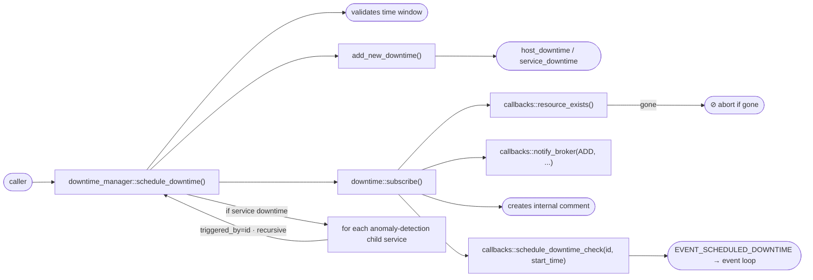
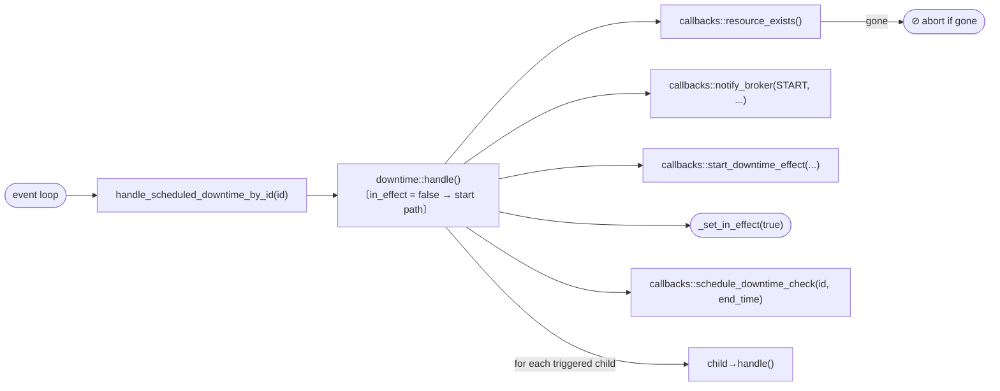
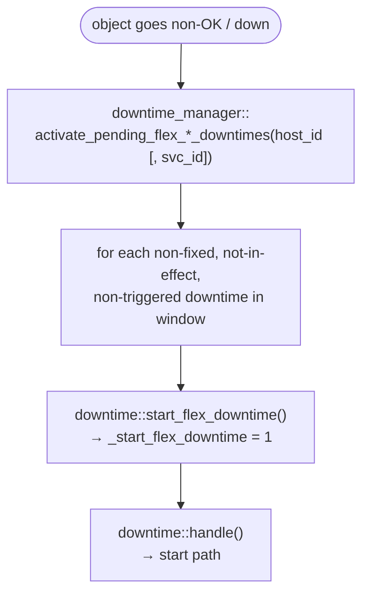
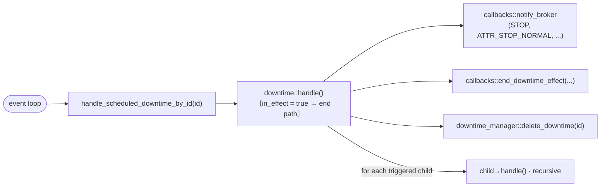
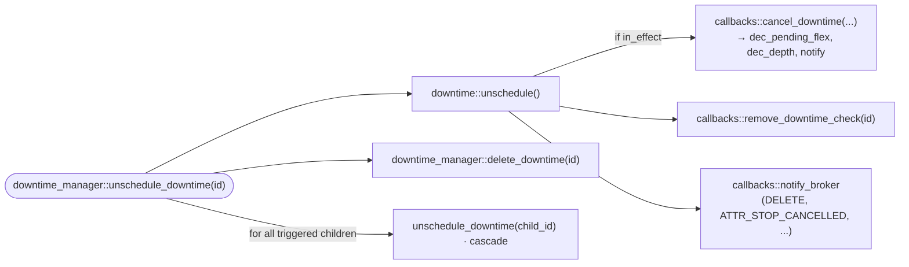

# Downtimes library — Broker integration guide

<!-- TOC -->
* [Downtimes library — Broker integration guide](#downtimes-library--broker-integration-guide)
* [Overview](#overview)
* [Architecture](#architecture)
  * [Class hierarchy](#class-hierarchy)
  * [downtime — base class](#downtime--base-class)
  * [host_downtime / service_downtime — specialisations](#host_downtime--service_downtime--specialisations)
  * [downtime_manager — singleton owner](#downtime_manager--singleton-owner)
  * [downtime_finder — search utility](#downtime_finder--search-utility)
  * [downtime_callbacks — integration contract](#downtime_callbacks--integration-contract)
* [Downtime lifecycle](#downtime-lifecycle)
  * [Creation and scheduling](#creation-and-scheduling)
  * [Fixed downtime start](#fixed-downtime-start)
  * [Flexible downtime](#flexible-downtime)
  * [End and deletion](#end-and-deletion)
  * [Triggered downtimes](#triggered-downtimes)
  * [Anomaly detection children](#anomaly-detection-children)
* [Broker integration](#broker-integration)
  * [Initialisation](#initialisation)
  * [Callbacks to implement](#callbacks-to-implement)
    * [Object existence and naming](#object-existence-and-naming)
    * [Anomaly detection lookup](#anomaly-detection-lookup)
    * [Event scheduling](#event-scheduling)
    * [State mutations](#state-mutations)
    * [Broker notification](#broker-notification)
  * [Driving the manager from BBDO events](#driving-the-manager-from-bbdo-events)
  * [Retention](#retention)
* [Key differences from the engine implementation](#key-differences-from-the-engine-implementation)
<!-- TOC -->

---

## Overview

The `common/downtimes` library provides a self-contained downtime scheduling engine shared between
`centengine` (Engine) and `cbd` (Broker). It handles:

* creation, scheduling, activation, and deletion of host and service downtimes;
* fixed and flexible downtime semantics;
* triggered (parent/child) downtime chains;
* automatic child downtime creation for anomaly-detection services;
* comment management and event scheduling via an abstract callback interface.

The library itself contains **no engine-specific or broker-specific code**. All integration points are
injected through the `downtime_callbacks` abstract class. Engine provides
`engine_downtime_callbacks`; Broker must provide its own implementation.

---

## Architecture

### Class hierarchy

```
downtime_callbacks  (abstract — injected at startup)
    ↑ implemented by
engine_downtime_callbacks   (Engine side, engine/src/)
broker_downtime_callbacks   (Broker side — to be written)

downtime            (base, common/downtimes/)
  ├── host_downtime
  └── service_downtime

downtime_manager    (singleton, owns all downtimes)
downtime_finder     (stateless search helper)
```

### downtime — base class

`common/downtimes/downtime.hh`

Holds the full state of one scheduled downtime:

| Field | Type | Meaning |
|---|---|---|
| `_host_id` | `uint64_t` | Host this downtime applies to |
| `_service_id` | `uint64_t` | 0 for host downtimes |
| `_entry_time` | `time_t` | When the downtime was created |
| `_start_time` / `_end_time` | `time_t` | Scheduled window |
| `_fixed` | `bool` | Fixed vs. flexible |
| `_duration` | `uint32_t` | Duration for flexible downtimes (seconds) |
| `_triggered_by` | `uint64_t` | Parent downtime ID (0 = none) |
| `_downtime_id` | `uint64_t` | Unique identifier |
| `_in_effect` | `bool` | Whether the downtime is currently active |
| `_comment_id` | `uint64_t` | Internal comment created at scheduling |
| `_start_flex_downtime` | `int` | Number of pending flex activations |
| `_incremented_pending_downtime` | `bool` | Guard against double-increment |

Key virtual methods (overridden by the specialisations):

| Method | Called when |
|---|---|
| `subscribe()` | Right after creation — creates comment, schedules start event |
| `handle()` | At start time or end time — activates or deactivates the downtime |
| `unschedule()` | On deletion — cancels the effect if in effect, removes events |
| `is_stale()` | At startup — returns true if the host/service no longer exists |
| `notify_broker_load()` | At retention reload — tells broker the downtime was restored |
| `print()` / `retention()` | Status/retention file serialisation |

### host_downtime / service_downtime — specialisations

`common/downtimes/host_downtime.hh` and `service_downtime.hh`

These classes are **compiled into Engine** (they include engine headers directly) and provide the
engine-specific implementations of `handle()` and `unschedule()` that interact with
`host::hosts_by_id`, `service::services_by_id`, `inc_scheduled_downtime_depth()`, engine notifications, etc.

For Broker, analogous classes must be written that interact with the broker cache and SQL streams
instead of the engine runtime objects.

`service_downtime` also skips BAM pseudo-services (host name starting with `_Module_BAM_`, service
description starting with `ba_`) in `print()` and `retention()`.

### downtime_manager — singleton owner

`common/downtimes/downtime_manager.hh`

The manager is the single point of access. It owns all scheduled downtimes in:

```cpp
std::multimap<time_t, std::shared_ptr<downtime>> _scheduled_downtimes;
// keyed by start_time; multiple downtimes can share the same start_time
```

Lifecycle methods:

| Method | Description |
|---|---|
| `load(callbacks)` | Initialises the singleton with the injected callbacks |
| `schedule_downtime(...)` | Creates, validates, and subscribes a new downtime |
| `unschedule_downtime(id)` | Cancels and removes a downtime and its triggered children |
| `delete_downtime(id)` | Removes from the map without unscheduling (used internally during `handle()`) |
| `find_downtime(type, id)` | Linear search by ID, optionally filtered by type |
| `initialize_downtime_data()` | Called at startup — removes stale entries, resets the ID counter |
| `validate_downtime_data()` | Removes orphaned triggered downtimes |
| `delete_expired_downtimes()` | Removes flexible downtimes whose window has passed |
| `activate_pending_flex_host_downtimes(host_id)` | Called when a host goes down |
| `activate_pending_flex_service_downtimes(host_id, svc_id)` | Called when a service goes non-OK |
| `callbacks()` | Access to the injected `downtime_callbacks` |

`schedule_downtime()` enforces:
* `start_time < end_time`
* `end_time > now()`
* clamps `start_time` and `end_time` to 2100-01-01 (timestamp 4 102 441 200)
* clamps `duration` to 366 days (31 622 400 s)

### downtime_finder — search utility

`common/downtimes/downtime_finder.hh`

Stateless helper that filters the multimap by a set of `criteria` (key/value string pairs). Supported
keys: `"host"`, `"service"`, `"start"`, `"end"`, `"fixed"`, `"triggered_by"`, `"duration"`,
`"author"`, `"comment"`. Returns a `result_set` (vector of downtime IDs matching **all** criteria).

### downtime_callbacks — integration contract

`common/downtimes/downtime_callbacks.hh`

The library calls back into the integrator for every operation that requires knowledge of the runtime
environment (does this host exist? schedule an event in the event loop; apply downtime effect to the
DB; etc.).

Two enums control broker notifications:

```cpp
enum class action { ADD, START, DELETE, LOAD, STOP };
enum class attribute { ATTR_NONE = 0, ATTR_STOP_NORMAL = 1, ATTR_STOP_CANCELLED = 2 };
```

All pure-virtual methods are listed in the [Callbacks to implement](#callbacks-to-implement) section.

---

## Downtime lifecycle

### Creation and scheduling



### Fixed downtime start

When the scheduled event fires:



### Flexible downtime

A flexible downtime waits for the monitored object to enter a non-OK/non-UP state within its window.



If the object recovers before the window closes, `callbacks::schedule_expire_downtime()` is used to
schedule an `EVENT_EXPIRE_DOWNTIME` event that calls `delete_expired_downtimes()`.

### End and deletion



Cancellation (e.g. `DEL_HOST_DOWNTIME` command):



### Triggered downtimes

A downtime with `triggered_by != 0` is started and stopped in lockstep with its parent. The parent
`handle()` (both start and end paths) iterates all downtimes and calls `handle()` on each child
whose `_triggered_by` matches the parent ID.

At unschedule time, `unschedule_downtime()` recursively unschedules all children before removing
the parent.

### Anomaly detection children

When `schedule_downtime()` creates a **service downtime**, it looks up anomaly-detection services
that monitor the same `(host_id, service_id)` pair via
`callbacks::get_anomaly_detection_services()`. For each returned service ID, it creates an
additional service downtime with `triggered_by` set to the parent's ID.

In Engine, `get_anomaly_detection_services()` is implemented via
`anomalydetection::find_by_dependent_service()`. In Broker, this information must come from the
global cache (or from configuration data received via BBDO).

---

## Broker integration

### Initialisation

```cpp
// In cbd startup, after the cache is ready:
downtime_manager::load(std::make_unique<broker_downtime_callbacks>(...));
downtime_manager::instance().initialize_downtime_data();
// reload downtimes from retention if any
```

`initialize_downtime_data()` removes stale entries (objects that no longer exist or whose window
has expired) and computes the next available downtime ID from the existing set.

### Callbacks to implement

#### Object existence and naming

```cpp
bool host_exists(uint64_t host_id) override;
bool service_exists(uint64_t host_id, uint64_t service_id) override;
bool resource_exists(uint64_t host_id, uint64_t service_id) override;
// resource_exists delegates to host_exists (svc_id == 0) or service_exists
```

In Broker, these query the global cache (`broker_cache`), which holds the current set of known
hosts and services.

```cpp
std::string get_host_name(uint64_t host_id) override;
std::pair<std::string,std::string>
    get_host_and_service_names(uint64_t host_id, uint64_t service_id) override;
```

Also satisfied from the global cache or the `resources` table.

```cpp
bool is_resource_ok(uint64_t host_id, uint64_t service_id) override;
```

Returns true if the host is UP (for host downtimes) or the service is OK (for service downtimes).
Broker must track the last known state, e.g. from `pb_host_status` / `pb_service_status` events.

#### Anomaly detection lookup

```cpp
std::vector<uint64_t>
    get_anomaly_detection_services(uint64_t host_id, uint64_t service_id) override;
```

Returns the list of `service_id` values of anomaly-detection services whose dependent service is
`(host_id, service_id)`.

In Engine this is provided by `anomalydetection::find_by_dependent_service()` which maintains an
in-process index. In Broker, the equivalent mapping must be built from configuration data received
via BBDO (specifically from `pb_service` objects where `type == ANOMALY_DETECTION` and
`internal_id` points to the dependent service).

A simple structure in `broker_downtime_callbacks`:

```cpp
// built from pb_service events with type == ANOMALY_DETECTION:
absl::flat_hash_map<std::pair<uint64_t,uint64_t>,   // {host_id, dependent_svc_id}
                    std::vector<uint64_t>>            // anomaly-detection svc_ids
    _anomaly_detection_index;
```

#### Event scheduling

```cpp
void schedule_downtime_check(uint64_t downtime_id, time_t when) override;
void remove_downtime_check(uint64_t downtime_id) override;
void schedule_expire_downtime(time_t when) override;
```

In Engine these insert `EVENT_SCHEDULED_DOWNTIME` and `EVENT_EXPIRE_DOWNTIME` into the engine event
loop. In Broker, the equivalent is the `io_context` timer infrastructure already used for
reconnection and heartbeat timers. Each scheduled downtime check is a one-shot timer that calls
`handle_scheduled_downtime_by_id(downtime_id)` at the scheduled time.

`schedule_expire_downtime()` schedules a one-shot timer that calls
`downtime_manager::instance().delete_expired_downtimes()`.

Broker must maintain a map `downtime_id → timer` so that `remove_downtime_check()` can cancel the
pending timer.

#### State mutations

```cpp
void inc_pending_flex_downtime(uint64_t host_id, uint64_t service_id) override;
```

Increments a pending flexible downtime counter on the host or service object. In Broker, this
counter may be maintained in the global cache or in a dedicated map, as there are no runtime engine
objects.

```cpp
void start_downtime_effect(uint64_t host_id, uint64_t service_id,
                           const std::string& author,
                           const std::string& comment) override;
void end_downtime_effect(uint64_t host_id, uint64_t service_id,
                         bool is_fixed, bool incremented_pending,
                         const std::string& author,
                         const std::string& comment) override;
```

In Engine, `start_downtime_effect()` calls `inc_scheduled_downtime_depth()` on the host/service
object, which triggers a notification and a status event. In Broker, this must:

* increment the `scheduled_downtime_depth` counter in the cache and propagate it to the DB (`hosts`
  or `services` table);
* suppress notifications for the object while the depth is > 0.

`end_downtime_effect()` does the reverse: decrements the depth and, if it reaches 0, re-enables
notifications.

```cpp
void cancel_downtime(uint64_t host_id, uint64_t service_id,
                     bool is_fixed, bool incremented_pending,
                     bool is_in_effect) override;
```

Called during `unschedule()` when the downtime was in effect. Must:

* if `incremented_pending` and `!is_fixed`: decrement the pending flex downtime counter;
* if `is_in_effect`: call `end_downtime_effect()` equivalent (decrement depth).

#### Broker notification

```cpp
void notify_broker(action act, attribute attr,
                   uint64_t host_id, uint64_t service_id,
                   const std::string& author, const std::string& comment,
                   time_t entry_time, time_t start_time, time_t end_time,
                   bool fixed, uint64_t triggered_by, uint32_t duration,
                   uint64_t downtime_id) override;
```

In Engine, this calls `broker_downtime_data()` (the NEB module callback) which publishes a
`pb_downtime` BBDO event to Broker. In Broker, this method plays the opposite role: it is the
point at which the library informs the Broker code that a downtime changed state. Depending on the
architecture, this may:

* update the `downtimes` table in the DB via `unified_sql`;
* publish a `pb_downtime` event to connected clients (e.g. MAP, Centreon Web) if needed;
* update the global cache.

The `action` enum maps to downtime NEBTYPE values:

| `action` | Engine NEBTYPE | Meaning |
|---|---|---|
| `ADD` | `NEBTYPE_DOWNTIME_ADD` | Downtime created |
| `START` | `NEBTYPE_DOWNTIME_START` | Downtime became active |
| `STOP` | `NEBTYPE_DOWNTIME_STOP` | Downtime ended normally |
| `DELETE` | `NEBTYPE_DOWNTIME_DELETE` | Downtime cancelled |
| `LOAD` | `NEBTYPE_DOWNTIME_LOAD` | Downtime reloaded from retention |

The `attribute` enum:

| `attribute` | Engine NEBATTR | Meaning |
|---|---|---|
| `ATTR_NONE` | `NEBATTR_NONE` | Normal event |
| `ATTR_STOP_NORMAL` | `NEBATTR_DOWNTIME_STOP_NORMAL` | Ended at scheduled time |
| `ATTR_STOP_CANCELLED` | `NEBATTR_DOWNTIME_STOP_CANCELLED` | Cancelled by command |

### Driving the manager from BBDO events

When Broker receives a `pb_downtime` BBDO event from Engine (or from another source), it must
translate it into a `downtime_manager` call:

| BBDO event content | `downtime_manager` call |
|---|---|
| `type == ADD` | `schedule_downtime(...)` |
| `type == DELETE` or `STOP_CANCELLED` | `unschedule_downtime(id)` |

Events of type `START` and `STOP_NORMAL` are driven internally by the library timers, not by
incoming BBDO events, so Broker should only persist them to the DB (via `notify_broker`) without
calling the manager again.

### Retention

The library serialises downtime state through `downtime::retention(os)`. The output format matches
the Engine `retention.dat` syntax. On startup, Broker reads its own retention file (if any) and
calls `schedule_downtime()` for each entry (with `triggered_by` preserved) followed by
`notify_broker_load()` to advertise the reload to clients.

---

## Key differences from the engine implementation

| Aspect | Engine | Broker |
|---|---|---|
| Object lookup | `host::hosts_by_id`, `service::services_by_id` | Global cache (`broker_cache`) |
| Anomaly detection index | `anomalydetection::find_by_dependent_service()` (in-process) | Must be built from `pb_service` BBDO events |
| Event scheduling | Engine event loop (`timed_event`) | `io_context` one-shot timers |
| Downtime effect | `inc/dec_scheduled_downtime_depth()` on engine objects | DB update + cache counter |
| `start/end_downtime_effect` | Triggers engine notification pipeline | Updates `hosts`/`services` table and cache |
| `notify_broker` | Publishes BBDO event *to* Broker | Updates DB and/or publishes to clients |
| Comment creation | Internal engine comment map | Can be omitted or stored in DB |
| `host_downtime` / `service_downtime` sources | Compiled with engine objects | Must have broker-specific specialisations |
