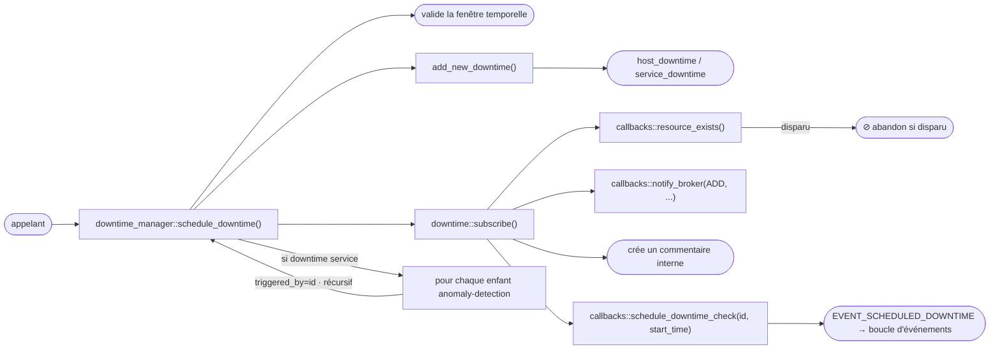
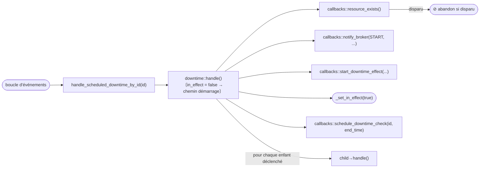
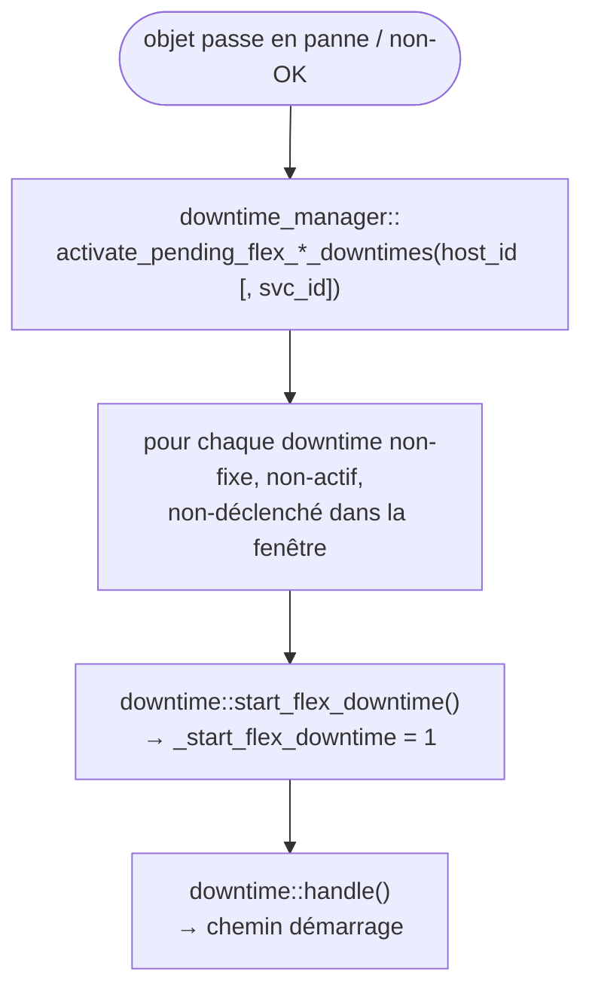
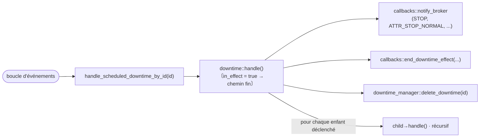
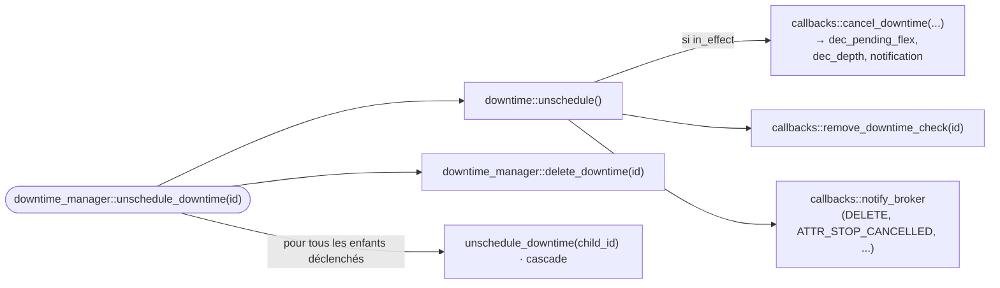

# Librairie downtimes — Guide d'intégration Broker

<!-- TOC -->
* [Librairie downtimes — Guide d'intégration Broker](#librairie-downtimes--guide-dintégration-broker)
  * [Vue d'ensemble](#vue-densemble)
  * [Architecture](#architecture)
    * [Hiérarchie des classes](#hiérarchie-des-classes)
    * [downtime — classe de base](#downtime--classe-de-base)
    * [host_downtime / service_downtime — spécialisations](#host_downtime--service_downtime--spécialisations)
    * [downtime_manager — singleton propriétaire](#downtime_manager--singleton-propriétaire)
    * [downtime_finder — utilitaire de recherche](#downtime_finder--utilitaire-de-recherche)
    * [downtime_callbacks — contrat d'intégration](#downtime_callbacks--contrat-dintégration)
  * [Cycle de vie d'un downtime](#cycle-de-vie-dun-downtime)
    * [Création et planification](#création-et-planification)
    * [Démarrage d'un downtime fixe](#démarrage-dun-downtime-fixe)
    * [Downtime flexible](#downtime-flexible)
    * [Fin et suppression](#fin-et-suppression)
    * [Downtimes déclenchés (triggered)](#downtimes-déclenchés-triggered)
    * [Enfants anomaly detection](#enfants-anomaly-detection)
  * [Intégration dans Broker](#intégration-dans-broker)
    * [Initialisation](#initialisation)
    * [Callbacks à implémenter](#callbacks-à-implémenter)
      * [Existence des objets et nommage](#existence-des-objets-et-nommage)
      * [Index anomaly detection](#index-anomaly-detection)
      * [Planification d'événements](#planification-dévénements)
      * [Mutations d'état](#mutations-détat)
      * [Notification broker](#notification-broker)
    * [Piloter le manager depuis les événements BBDO](#piloter-le-manager-depuis-les-événements-bbdo)
    * [Rétention](#rétention)
  * [Différences clés avec l'implémentation engine](#différences-clés-avec-limplémentation-engine)
<!-- TOC -->

---

## Vue d'ensemble

La librairie `common/downtimes` fournit un moteur de planification de downtimes partagé entre
`centengine` (Engine) et `cbd` (Broker). Elle gère :

* la création, la planification, l'activation et la suppression des downtimes hôtes et services ;
* la sémantique des downtimes fixes et flexibles ;
* les chaînes de downtimes déclenchés (parent/enfant) ;
* la création automatique de downtimes enfants pour les services anomaly detection ;
* la gestion des commentaires et la planification d'événements via une interface de callback abstraite.

La librairie **ne contient aucun code spécifique à engine ou broker**. Tous les points d'intégration
sont injectés via la classe abstraite `downtime_callbacks`. Engine fournit
`engine_downtime_callbacks` ; Broker doit fournir sa propre implémentation.

---

## Architecture

### Hiérarchie des classes

```
downtime_callbacks  (abstrait — injecté au démarrage)
    ↑ implémenté par
engine_downtime_callbacks   (côté Engine, engine/src/)
broker_downtime_callbacks   (côté Broker — à écrire)

downtime            (base, common/downtimes/)
  ├── host_downtime
  └── service_downtime

downtime_manager    (singleton, propriétaire de tous les downtimes)
downtime_finder     (helper de recherche sans état)
```

### downtime — classe de base

`common/downtimes/downtime.hh`

Contient l'état complet d'un downtime planifié :

| Champ | Type | Signification |
|---|---|---|
| `_host_id` | `uint64_t` | Hôte concerné |
| `_service_id` | `uint64_t` | 0 pour les downtimes hôtes |
| `_entry_time` | `time_t` | Date de création |
| `_start_time` / `_end_time` | `time_t` | Fenêtre planifiée |
| `_fixed` | `bool` | Fixe vs. flexible |
| `_duration` | `uint32_t` | Durée pour les downtimes flexibles (secondes) |
| `_triggered_by` | `uint64_t` | ID du parent (0 = aucun) |
| `_downtime_id` | `uint64_t` | Identifiant unique |
| `_in_effect` | `bool` | Si le downtime est actuellement actif |
| `_comment_id` | `uint64_t` | Commentaire interne créé à la planification |
| `_start_flex_downtime` | `int` | Nombre d'activations flex en attente |
| `_incremented_pending_downtime` | `bool` | Protection contre le double-incrément |

Méthodes virtuelles clés (redéfinies par les spécialisations) :

| Méthode | Appelée quand |
|---|---|
| `subscribe()` | Juste après la création — crée le commentaire, planifie l'événement de démarrage |
| `handle()` | À l'heure de début ou de fin — active ou désactive le downtime |
| `unschedule()` | À la suppression — annule l'effet si actif, retire les événements |
| `is_stale()` | Au démarrage — retourne true si l'hôte/service n'existe plus |
| `notify_broker_load()` | Au rechargement de rétention — informe broker du downtime restauré |
| `print()` / `retention()` | Sérialisation status/rétention |

### host_downtime / service_downtime — spécialisations

`common/downtimes/host_downtime.hh` et `service_downtime.hh`

Ces classes sont **compilées dans Engine** (elles incluent des en-têtes engine) et fournissent les
implémentations spécifiques engine de `handle()` et `unschedule()` qui interagissent avec
`host::hosts_by_id`, `service::services_by_id`, `inc_scheduled_downtime_depth()`, les notifications
engine, etc.

Pour Broker, des classes analogues doivent être écrites pour interagir avec le cache broker et les
streams SQL.

`service_downtime` ignore également les pseudo-services BAM (nom d'hôte commençant par
`_Module_BAM_`, description de service commençant par `ba_`) dans `print()` et `retention()`.

### downtime_manager — singleton propriétaire

`common/downtimes/downtime_manager.hh`

Le manager est le point d'accès unique. Il possède tous les downtimes planifiés dans :

```cpp
std::multimap<time_t, std::shared_ptr<downtime>> _scheduled_downtimes;
// indexé par start_time ; plusieurs downtimes peuvent avoir le même start_time
```

Méthodes du cycle de vie :

| Méthode | Description |
|---|---|
| `load(callbacks)` | Initialise le singleton avec les callbacks injectés |
| `schedule_downtime(...)` | Crée, valide et souscrit un nouveau downtime |
| `unschedule_downtime(id)` | Annule et supprime un downtime et ses enfants déclenchés |
| `delete_downtime(id)` | Supprime de la map sans unscheduler (usage interne dans `handle()`) |
| `find_downtime(type, id)` | Recherche linéaire par ID, filtrée optionnellement par type |
| `initialize_downtime_data()` | Appelé au démarrage — supprime les entrées obsolètes, remet à zéro le compteur d'ID |
| `validate_downtime_data()` | Supprime les downtimes déclenchés orphelins |
| `delete_expired_downtimes()` | Supprime les downtimes flexibles dont la fenêtre est passée |
| `activate_pending_flex_host_downtimes(host_id)` | Appelé quand un hôte tombe en panne |
| `activate_pending_flex_service_downtimes(host_id, svc_id)` | Appelé quand un service passe non-OK |
| `callbacks()` | Accès aux `downtime_callbacks` injectés |

`schedule_downtime()` impose :
* `start_time < end_time`
* `end_time > now()`
* tronque `start_time` et `end_time` au 01/01/2100 (timestamp 4 102 441 200)
* tronque `duration` à 366 jours (31 622 400 s)

### downtime_finder — utilitaire de recherche

`common/downtimes/downtime_finder.hh`

Helper sans état qui filtre la multimap par un ensemble de `criteria` (paires clé/valeur en
chaîne). Clés supportées : `"host"`, `"service"`, `"start"`, `"end"`, `"fixed"`,
`"triggered_by"`, `"duration"`, `"author"`, `"comment"`. Retourne un `result_set` (vecteur d'IDs
de downtimes satisfaisant **tous** les critères).

### downtime_callbacks — contrat d'intégration

`common/downtimes/downtime_callbacks.hh`

La librairie rappelle l'intégrateur pour toute opération nécessitant une connaissance de
l'environnement d'exécution (cet hôte existe-t-il ? planifier un événement dans la boucle
d'événements ; appliquer l'effet downtime en DB ; etc.).

Deux énumérations pilotent les notifications broker :

```cpp
enum class action { ADD, START, DELETE, LOAD, STOP };
enum class attribute { ATTR_NONE = 0, ATTR_STOP_NORMAL = 1, ATTR_STOP_CANCELLED = 2 };
```

Toutes les méthodes purement virtuelles sont détaillées dans la section
[Callbacks à implémenter](#callbacks-à-implémenter).

---

## Cycle de vie d'un downtime

### Création et planification



### Démarrage d'un downtime fixe

Quand l'événement planifié se déclenche :



### Downtime flexible

Un downtime flexible attend que l'objet surveillé entre dans un état non-OK/non-UP dans sa fenêtre.



Si l'objet se rétablit avant la fermeture de la fenêtre, `callbacks::schedule_expire_downtime()`
planifie un événement `EVENT_EXPIRE_DOWNTIME` qui appelle `delete_expired_downtimes()`.

### Fin et suppression



Annulation (p.ex. commande `DEL_HOST_DOWNTIME`) :



### Downtimes déclenchés (triggered)

Un downtime avec `triggered_by != 0` démarre et s'arrête en même temps que son parent. Le
`handle()` du parent (chemin démarrage et fin) itère tous les downtimes et appelle `handle()` sur
chaque enfant dont le `_triggered_by` correspond à l'ID du parent.

À l'unschedule, `unschedule_downtime()` annule récursivement tous les enfants avant de supprimer
le parent.

### Enfants anomaly detection

Quand `schedule_downtime()` crée un **downtime service**, il recherche les services
anomaly detection qui surveillent la même paire `(host_id, service_id)` via
`callbacks::get_anomaly_detection_services()`. Pour chaque ID de service retourné, il crée un
downtime service supplémentaire avec `triggered_by` positionné à l'ID du parent.

Dans Engine, `get_anomaly_detection_services()` est implémenté via
`anomalydetection::find_by_dependent_service()` qui maintient un index en mémoire. Dans Broker,
cette information doit provenir du cache global (ou des données de configuration reçues par BBDO).

---

## Intégration dans Broker

### Initialisation

```cpp
// Dans le démarrage de cbd, après que le cache est prêt :
downtime_manager::load(std::make_unique<broker_downtime_callbacks>(...));
downtime_manager::instance().initialize_downtime_data();
// recharger les downtimes depuis la rétention si nécessaire
```

`initialize_downtime_data()` supprime les entrées obsolètes (objets disparus ou fenêtre expirée) et
calcule le prochain ID disponible à partir de l'ensemble existant.

### Callbacks à implémenter

#### Existence des objets et nommage

```cpp
bool host_exists(uint64_t host_id) override;
bool service_exists(uint64_t host_id, uint64_t service_id) override;
bool resource_exists(uint64_t host_id, uint64_t service_id) override;
// resource_exists délègue à host_exists (svc_id == 0) ou service_exists
```

Dans Broker, ces méthodes interrogent le cache global (`broker_cache`) qui contient l'ensemble
connu des hôtes et services.

```cpp
std::string get_host_name(uint64_t host_id) override;
std::pair<std::string,std::string>
    get_host_and_service_names(uint64_t host_id, uint64_t service_id) override;
```

Également satisfaites depuis le cache global ou la table `resources`.

```cpp
bool is_resource_ok(uint64_t host_id, uint64_t service_id) override;
```

Retourne true si l'hôte est UP (pour les downtimes hôtes) ou le service est OK (pour les downtimes
services). Broker doit suivre le dernier état connu, p.ex. depuis les événements
`pb_host_status` / `pb_service_status`.

#### Index anomaly detection

```cpp
std::vector<uint64_t>
    get_anomaly_detection_services(uint64_t host_id, uint64_t service_id) override;
```

Retourne la liste des `service_id` des services anomaly detection dont le service dépendant est
`(host_id, service_id)`.

Dans Engine, ceci est fourni par `anomalydetection::find_by_dependent_service()` qui maintient un
index en mémoire. Dans Broker, le mapping équivalent doit être construit à partir des événements
de configuration reçus par BBDO (spécifiquement des objets `pb_service` où `type == ANOMALY_DETECTION`
et `internal_id` pointe vers le service dépendant).

Structure suggérée dans `broker_downtime_callbacks` :

```cpp
// construit à partir des événements pb_service avec type == ANOMALY_DETECTION :
absl::flat_hash_map<std::pair<uint64_t,uint64_t>,   // {host_id, svc_id_dépendant}
                    std::vector<uint64_t>>            // svc_ids anomaly detection
    _anomaly_detection_index;
```

#### Planification d'événements

```cpp
void schedule_downtime_check(uint64_t downtime_id, time_t when) override;
void remove_downtime_check(uint64_t downtime_id) override;
void schedule_expire_downtime(time_t when) override;
```

Dans Engine, ces méthodes insèrent `EVENT_SCHEDULED_DOWNTIME` et `EVENT_EXPIRE_DOWNTIME` dans la
boucle d'événements engine. Dans Broker, l'équivalent est l'infrastructure de timers `io_context`
déjà utilisée pour les reconnexions et les heartbeats. Chaque vérification de downtime planifiée
est un timer one-shot qui appelle `handle_scheduled_downtime_by_id(downtime_id)` à l'heure prévue.

`schedule_expire_downtime()` planifie un timer one-shot qui appelle
`downtime_manager::instance().delete_expired_downtimes()`.

Broker doit maintenir une map `downtime_id → timer` pour que `remove_downtime_check()` puisse
annuler le timer en attente.

#### Mutations d'état

```cpp
void inc_pending_flex_downtime(uint64_t host_id, uint64_t service_id) override;
```

Incrémente un compteur de downtime flexible en attente sur l'objet hôte ou service. Dans Broker,
ce compteur peut être maintenu dans le cache global ou dans une map dédiée, puisqu'il n'y a pas
d'objets engine en mémoire.

```cpp
void start_downtime_effect(uint64_t host_id, uint64_t service_id,
                           const std::string& author,
                           const std::string& comment) override;
void end_downtime_effect(uint64_t host_id, uint64_t service_id,
                         bool is_fixed, bool incremented_pending,
                         const std::string& author,
                         const std::string& comment) override;
```

Dans Engine, `start_downtime_effect()` appelle `inc_scheduled_downtime_depth()` sur l'objet
hôte/service, ce qui déclenche une notification et un événement de statut. Dans Broker, cela doit :

* incrémenter le compteur `scheduled_downtime_depth` dans le cache et le propager en DB (table
  `hosts` ou `services`) ;
* supprimer les notifications pour l'objet tant que la profondeur est > 0.

`end_downtime_effect()` fait l'inverse : décrémente la profondeur et, si elle atteint 0, réactive
les notifications.

```cpp
void cancel_downtime(uint64_t host_id, uint64_t service_id,
                     bool is_fixed, bool incremented_pending,
                     bool is_in_effect) override;
```

Appelé pendant `unschedule()` quand le downtime était en effet. Doit :

* si `incremented_pending` et `!is_fixed` : décrémenter le compteur de downtime flex en attente ;
* si `is_in_effect` : effectuer l'équivalent de `end_downtime_effect()` (décrémenter la profondeur).

#### Notification broker

```cpp
void notify_broker(action act, attribute attr,
                   uint64_t host_id, uint64_t service_id,
                   const std::string& author, const std::string& comment,
                   time_t entry_time, time_t start_time, time_t end_time,
                   bool fixed, uint64_t triggered_by, uint32_t duration,
                   uint64_t downtime_id) override;
```

Dans Engine, cette méthode appelle `broker_downtime_data()` (le callback du module NEB) qui publie
un événement BBDO `pb_downtime` vers Broker. Dans Broker, cette méthode joue le rôle inverse :
c'est le point auquel la librairie informe le code Broker qu'un downtime a changé d'état. Selon
l'architecture, cela peut :

* mettre à jour la table `downtimes` en DB via `unified_sql` ;
* publier un événement `pb_downtime` vers les clients connectés (p.ex. MAP, Centreon Web) si
  nécessaire ;
* mettre à jour le cache global.

L'énumération `action` correspond aux valeurs NEBTYPE :

| `action` | NEBTYPE Engine | Signification |
|---|---|---|
| `ADD` | `NEBTYPE_DOWNTIME_ADD` | Downtime créé |
| `START` | `NEBTYPE_DOWNTIME_START` | Downtime devenu actif |
| `STOP` | `NEBTYPE_DOWNTIME_STOP` | Downtime terminé normalement |
| `DELETE` | `NEBTYPE_DOWNTIME_DELETE` | Downtime annulé |
| `LOAD` | `NEBTYPE_DOWNTIME_LOAD` | Downtime rechargé depuis la rétention |

L'énumération `attribute` :

| `attribute` | NEBATTR Engine | Signification |
|---|---|---|
| `ATTR_NONE` | `NEBATTR_NONE` | Événement normal |
| `ATTR_STOP_NORMAL` | `NEBATTR_DOWNTIME_STOP_NORMAL` | Terminé à l'heure prévue |
| `ATTR_STOP_CANCELLED` | `NEBATTR_DOWNTIME_STOP_CANCELLED` | Annulé par commande |

### Piloter le manager depuis les événements BBDO

Quand Broker reçoit un événement BBDO `pb_downtime` d'Engine (ou d'une autre source), il doit le
traduire en appel `downtime_manager` :

| Contenu de l'événement BBDO | Appel `downtime_manager` |
|---|---|
| `type == ADD` | `schedule_downtime(...)` |
| `type == DELETE` ou `STOP_CANCELLED` | `unschedule_downtime(id)` |

Les événements `START` et `STOP_NORMAL` sont pilotés en interne par les timers de la librairie et
non par des événements BBDO entrants ; Broker doit donc seulement les persister en DB (via
`notify_broker`) sans rappeler le manager.

### Rétention

La librairie sérialise l'état des downtimes via `downtime::retention(os)`. Le format de sortie
correspond à la syntaxe `retention.dat` d'Engine. Au démarrage, Broker lit son propre fichier de
rétention (si existant) et appelle `schedule_downtime()` pour chaque entrée (avec `triggered_by`
préservé), suivi de `notify_broker_load()` pour annoncer le rechargement aux clients.

---

## Différences clés avec l'implémentation engine

| Aspect | Engine | Broker |
|---|---|---|
| Lookup d'objet | `host::hosts_by_id`, `service::services_by_id` | Cache global (`broker_cache`) |
| Index anomaly detection | `anomalydetection::find_by_dependent_service()` (en mémoire) | À construire depuis les événements BBDO `pb_service` |
| Planification d'événements | Boucle d'événements engine (`timed_event`) | Timers one-shot `io_context` |
| Effet du downtime | `inc/dec_scheduled_downtime_depth()` sur objets engine | Mise à jour DB + compteur cache |
| `start/end_downtime_effect` | Déclenche le pipeline de notification engine | Met à jour table `hosts`/`services` et cache |
| `notify_broker` | Publie un événement BBDO *vers* Broker | Met à jour la DB et/ou publie vers les clients |
| Création de commentaire | Map de commentaires interne engine | Peut être omis ou stocké en DB |
| Sources `host_downtime` / `service_downtime` | Compilées avec les objets engine | Doivent avoir des spécialisations spécifiques broker |
