# Negotiation between Engine and Broker

<!-- TOC -->
* [Negotiation between Engine and Broker](#negotiation-between-engine-and-broker)
* [Introduction](#introduction)
* [New negotiation](#new-negotiation)
  * [cbmod becomes a library](#cbmod-becomes-a-library)
  * [New parameters for Engine/cbmod](#new-parameters-for-enginecbmod)
  * [New parameters for Broker](#new-parameters-for-broker)
  * [The negotiation](#the-negotiation)
    * [New Broker functionality](#new-broker-functionality)
    * [Engine initiates the connection](#engine-initiates-the-connection)
    * [Broker initiates the connection](#broker-initiates-the-connection)
* [Reading Engine configuration](#reading-engine-configuration)
  * [Configuration management on the Engine side](#configuration-management-on-the-engine-side)
  * [Managing configuration sending by Broker to Engine](#managing-configuration-sending-by-broker-to-engine)
    * [Lifecycle of the `X.lck` file](#lifecycle-of-the-xlck-file)
  * [Calculating the difference](#calculating-the-difference)
  * [Writing configuration to database](#writing-configuration-to-database)
    * [Case study](#case-study)
    * [Implementation](#implementation)
  * [Tricky cases](#tricky-cases)
  * [Cross-cutting objects](#cross-cutting-objects)
  * [The necessity of centralized cache](#the-necessity-of-centralized-cache)
  * [Some more technical points](#some-more-technical-points)
  * [Split of broker::config::applier::state](#split-of-brokerconfigapplierstate)
* [SQL/storage streams](#sqlstorage-streams)
* [Broker centralized cache](#broker-centralized-cache)
  * [Operating in centralized configuration](#operating-in-centralized-configuration)
  * [Host `poller_id` population in the cache](#host-poller_id-population-in-the-cache)
    * [The problem](#the-problem)
    * [The fix — two complementary changes](#the-fix--two-complementary-changes)
    * [Why the global diff has no `poller_id`](#why-the-global-diff-has-no-poller_id)
  * [Operating in *legacy* mode](#operating-in-legacy-mode)
  * [Possible evolutions](#possible-evolutions)
* [Retention and RRD stream](#retention-and-rrd-stream)
  * [Current problem](#current-problem)
  * [Proposed architecture](#proposed-architecture)
    * [Overview](#overview)
    * [Phase 1: Reconnection](#phase-1-reconnection)
    * [Phase 2: Junction detection](#phase-2-junction-detection)
    * [Phase 3: Merge via the reconstruction engine](#phase-3-merge-via-the-reconstruction-engine)
  * [Buffer format](#buffer-format)
    * [`.prot` files](#prot-files)
    * [Merge triggers](#merge-triggers)
  * [Multiple disconnections](#multiple-disconnections)
  * [Integration with the existing rebuild](#integration-with-the-existing-rebuild)
  * [Edge cases](#edge-cases)
    * [Retention exceeded](#retention-exceeded)
    * [Broker crash during merge](#broker-crash-during-merge)
    * [Broker crash during buffering](#broker-crash-during-buffering)
  * [Concurrency](#concurrency)
  * [Migration plan](#migration-plan)
    * [Step 1 — `retention_manager` component ✅ implemented](#step-1--retention_manager-component--implemented)
    * [Step 2 — Bifurcation in `stream.cc` ✅ implemented](#step-2--bifurcation-in-streamcc--implemented)
    * [Step 3 — Junction detection ✅ implemented](#step-3--junction-detection--implemented)
      * [Progressive partial merge](#progressive-partial-merge)
    * [Step 4 — Unified reconstruction engine ✅ implemented](#step-4--unified-reconstruction-engine--implemented)
* [Remote Servers and centralized configuration](#remote-servers-and-centralized-configuration)
  * [Current situation](#current-situation)
  * [Relay identification](#relay-identification)
  * [New BBDO messages](#new-bbdo-messages)
  * [Topology in broker\_cache](#topology-in-broker_cache)
  * [Topology persistence](#topology-persistence)
  * [Scenario 1: poller connects to the remote](#scenario-1-poller-connects-to-the-remote)
  * [Scenario 1b: relay chain (multi-hop)](#scenario-1b-relay-chain-multi-hop)
  * [Scenario 2: configuration pushed by PHP](#scenario-2-configuration-pushed-by-php)
  * [Scenario 3: remote offline then reconnects](#scenario-3-remote-offline-then-reconnects)
  * [Scenario 4: central restart](#scenario-4-central-restart)
  * [Poller migration between two remotes](#poller-migration-between-two-remotes)
  * [gRPC GetTopology endpoint](#grpc-gettopology-endpoint)
  * [.prot file storage](#prot-file-storage)
  * [broker\_state evolution](#broker_state-evolution)
  * [Required changes](#required-changes)
  * [Roll-out](#roll-out)
    * [Step 1 — New BBDO messages ( ✅ implemented)](#step-1--new-bbdo-messages--implemented)
    * [Step 2 — via_remote + relay detection ( ✅ implemented)](#step-2--via_remote--relay-detection--implemented)
    * [Step 3 — ConfigRequest sent by the relay ( ✅ implemented)](#step-3--configrequest-sent-by-the-relay--implemented)
    * [Step 4 — ConfigRequest handling at the central ( ✅ implemented)](#step-4--configrequest-handling-at-the-central--implemented)
    * [Step 5 — Forward DiffState/ack in the relay ( ✅ implemented)](#step-5--forward-diffstateack-in-the-relay--implemented)
    * [Step 6 — PHP push via relay ( ✅ implemented)](#step-6--php-push-via-relay--implemented)
    * [Step 7 — Migration + ConfigRevoke ( ✅ implemented)](#step-7--migration--configrevoke--implemented)
    * [Step 8 — Topology persistence](#step-8--topology-persistence)
    * [Step 9 — gRPC GetTopology](#step-9--grpc-gettopology)
* [Centralized downtime and acknowledgement management](#centralized-downtime-and-acknowledgement-management)
  * [Problem](#problem)
  * [Solution: Broker as source of truth](#solution-broker-as-source-of-truth)
  * [New BBDO messages](#new-bbdo-messages)
  * [Persistence and restart](#persistence-and-restart)
  * [Migration and downtimes / acknowledgements](#migration-and-downtimes--acknowledgements)
* [Poller HA](#poller-ha)
  * [Poller configuration tree](#poller-configuration-tree)
  * [Engine configuration files](#engine-configuration-files)
  * [List of peers](#list-of-peers)
  * [Engine self-monitoring](#engine-self-monitoring)
    * [Implementation](#implementation-1)
    * [What Engine does with these indicators](#what-engine-does-with-these-indicators)
  * [unified_sql](#unified_sql)
  * [HA protocol architecture](#ha-protocol-architecture)
    * [Overview](#overview-1)
    * [Non-HA mode: compatibility and single-poller zone](#non-ha-mode-compatibility-and-single-poller-zone)
    * [PHP → Broker interface: centengine.cfg](#php--broker-interface-centengine)
    * [Zone-to-poller configuration inheritance](#zone-to-poller-configuration-inheritance)
    * [Zone activation: min_pollers](#zone-activation-min_pollers)
    * [Resource distribution across pollers](#resource-distribution-across-pollers)
      * [Co-location blocks](#co-location-blocks)
      * [Two-phase algorithm](#two-phase-algorithm)
    * [Behavior when a poller is removed from the zone](#behavior-when-a-poller-is-removed-from-the-zone)
    * [Host migration protocol](#host-migration-protocol)
    * [Runtime state preservation during migration](#runtime-state-preservation-during-migration)
    * [Threshold rebalancing](#threshold-rebalancing)
      * [Health message](#health-message)
      * [Load score and thresholds](#load-score-and-thresholds)
    * [Failure detection and failover](#failure-detection-and-failover)
    * [Return of a failed poller](#return-of-a-failed-poller)
* [Tickets](#tickets)
  * [First tickets](#first-tickets)
    * [Internal health check in Engine with reporting to Broker](#internal-health-check-in-engine-with-reporting-to-broker)
    * [About diff calculation](#about-diff-calculation)
    * [Study on distribution mechanism](#study-on-distribution-mechanism)
    * [Introduction of Zone and DiffZone messages](#introduction-of-zone-and-diffzone-messages)
  * [Multiple tickets in parallel](#multiple-tickets-in-parallel)
    * [Preparing unified_sql](#preparing-unified_sql)
    * [Centralized cache](#centralized-cache)
    * [The conversion block](#the-conversion-block)
  * [Evolutions](#evolutions)
    * [Improving the conversion block](#improving-the-conversion-block)
    * [Recovering the health check](#recovering-the-health-check)
* [Potential issues to resolve](#potential-issues-to-resolve)
* [Issue resolution](#issue-resolution)
  * [Moving external command sending to Broker](#moving-external-command-sending-to-broker)
<!-- TOC -->

# Introduction

Currently, two databases run on the central server: the configuration database and the real-time database. The first allows PHP to generate the Engine configuration. Once this configuration is created, it is transmitted to pollers via Gorgone.

Each poller reads its configuration and starts by sending it to Broker, which gradually prepares the real-time database to accept monitoring afterwards.

We would like to stop these back-and-forths between `Engine` and Broker. The idea would be for `Engine` to connect to Broker, indicate the configuration it knows, and for `Broker` to send it an update if necessary.

# New negotiation

We cannot break the current behavior completely; changes must be made *step by step*.

The step here is to evolve the negotiation between the two programs.

`Engine` speaks network because it is linked to `cbmod`. `Cbmod` does not have direct access to Engine code, it only knows what is transmitted to it. This is problematic because, for example, `cbmod` does not know Engine's configuration directory.

## cbmod becomes a library

The issues encountered with `cbmod` can be reduced by transforming it into a library. This would allow `Engine` to use it directly and transmit necessary information much more easily.

One impact of this is that the parameter passed to `cbmod` is now directly passed to `Engine` with the `-b` option followed by the `Broker` configuration file. This information can also be provided directly in the `Engine` configuration file with the `broker_module_cfg_file` key. Finally, due to issues with processing old `Engine` versions, it is still possible to keep the old module declaration format for `cbmod`. A deprecation message is written in the logs but it works.

## New parameters for Engine/cbmod

Currently, since the `cbmod` modification, `Engine` starts with essentially two parameters, as follows:

`centengine -b /etc/centreon-broker/central-module.json /etc/centreon-engine/centengine.cfg`

We will progressively replace the use of the `/etc/centreon-engine` directory with `/var/lib/centreon-engine` so that `Engine` is in control since this directory is its `HOME`. It will write the configuration file and read it too. This file is not necessarily present; if it is, `Engine` can start with it, but if it isn't, it will retrieve its configuration and therefore its content during negotiation with `Broker`. Finally, we don't specify the file name; `Engine` determines it. The only important point is the working directory.

In the end, if we want to keep two ways of operating for `Engine`, we have the following two cases:

- With `-p /var/lib/centreon-engine`: we are in the new generation where `Engine` retrieves its configuration during negotiation with `Broker`;

- With `/etc/centreon-engine/centengine.cfg`: we are in the old generation where `Engine` reads its configuration from a `cfg` file.

The two situations are not incompatible; we can imagine that `Engine` reads its configuration from a `cfg` file and updates it during negotiation with `Broker`. This can be useful during the *old generation* → *new generation* transition.

To summarize, we have the following behavior:

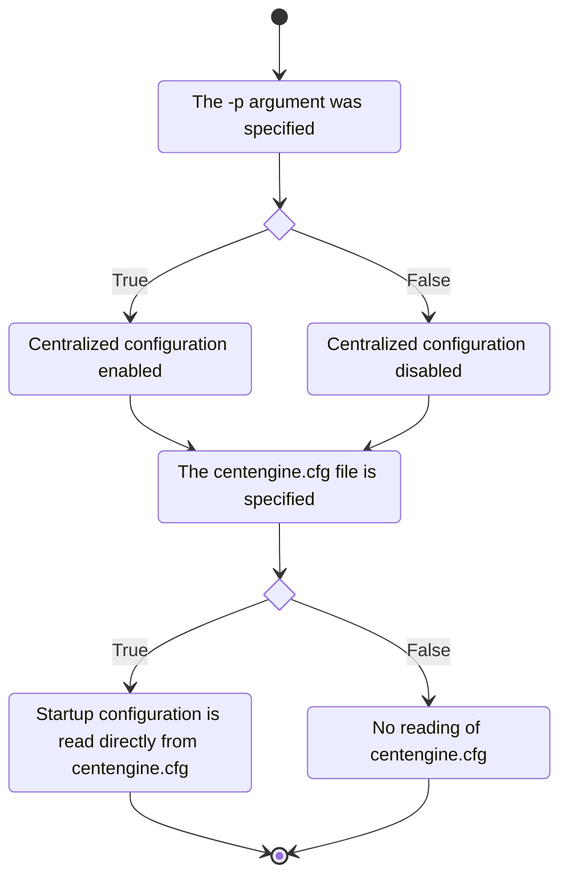
```mermaid
stateDiagram-v2
    State1: The -p argument was specified
    State2: The centengine.cfg file is specified
    Conclusion1: Centralized configuration enabled
    NotConclusion1: Centralized configuration disabled
    Conclusion2: Startup configuration is read directly from centengine.cfg
    NotConclusion2: No reading of centengine.cfg
    state if_state <<choice>>
    [*] --> State1
    State1 --> if_state
    if_state --> Conclusion1: True
    if_state --> NotConclusion1: False
    state if_state2 <<choice>>
    Conclusion1 --> State2
    NotConclusion1 --> State2
    State2 --> if_state2
    if_state2 --> Conclusion2: True
    if_state2 --> NotConclusion2: False
    Conclusion2 --> [*]
    NotConclusion2 --> [*]
```

## New parameters for Broker

`Broker` has two new parameters found in its configuration file:

- `cache_config_directory` - the PHP cache directory, i.e., the directory where the configuration sent by PHP is written.

- `pollers_config_directory` - the poller configuration directory that it will now maintain.

The first directory contains subdirectories whose names are integers representing the poller ID. Each of these directories contains the configuration of the `Engine` installed on it. At the same level as each of these directories, there is also an empty file named with the poller ID with a `.lck` extension, which is updated only once the concerned directory is updated.

An example directory for `cache_config_directory`:

* cache:
  * 1
    * centengine.cfg
    * services.cfg
    * etc...
  * 1.lck
  * 2
    * centengine.cfg
    * services.cfg
    * etc...
  * 2.lck

The principle is as follows: as soon as PHP finishes updating a directory for a poller, it touches the associated `lck` file. This file is monitored by `Broker` and as soon as it is notified, it takes into account the new configuration written in the directory.

For the second directory, `Broker` uses it to manage all poller configurations. This directory already contains all poller configurations in serialized Protobuf form.

As soon as the PHP cache directory is provided, `Broker` considers itself to be in the new generation.

An example of `pollers_config_directory`:

* pollers-configuration:
  * 1.prot
  * 2.prot

## The negotiation

We consider that the new capabilities implemented here only work with BBDO3.

The `Welcome` message gets a few additional parameters:

- `broker_name`,
- `extended_negociation`
- `peer_type`

If `cbmod` is configured with the new parameters, it fills these new fields.

The `Welcome` message is now defined as follows:

```
    message Welcome {
      Bbdo version = 1;
      string extensions = 2;
      uint64 poller_id = 3;
      string poller_name = 4;
      /* \Broker\ name is more relevant than poller name because for example on the
       * central, rrd broker, central broker and engine share the same poller name
       * that is 'Central'. */
      string broker_name = 5;
      com.centreon.common.PeerType peer_type = 6;
      bool extended_negotiation = 7;
      /* Engine configuration version sent by Engine so Broker is aware of it. */
      string engine_conf = 8;
    }
```

The `version` and `extensions` fields do not change. `poller_id` and `poller_name` still represent the poller ID and name. But on the Central, for example, there are three programs that share these two pieces of information. So to make the identification of the instance sending the message unique, we added `broker_name` (which also makes sense in the case of `Engine`).

`peer_type` is an enumerated type that can take the following values:

- ENGINE
- BROKER
- MAP
- UNKNOWN

Finally, `extended_negotiation` is a boolean that indicates whether the program can handle the new negotiation, so for an `Engine`, whether it knows about the Protobuf configuration directory, and for a `Broker`, whether it knows about the PHP cache directory.

Until now, when code was executed in `cbmod` or in `Broker`, we didn't have visibility on the running program, we didn't know if we were in a `Broker` or in an `Engine`. With this evolution, we can know. This is important since we want `Broker` to send the configuration to `Engine`.

In the bbdo stream, `Broker` stores information about its interlocutor; we already had `poller_name` and `poller_id`. We complete this information with `broker_name`, `peer_type`, the boolean `extended_negociation`, and the string `config_version` which for now contains the hash of the `Engine` configuration. In the near future, this information will probably evolve.

And in `configuration::applier::state` we also have this information for our instance.

To summarize, we have the `broker::config::applier::state` class which contains the following fields (partial content):

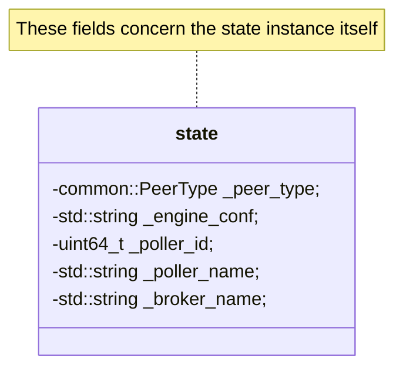
```mermaid
classDiagram
    note for state "These fields concern the state instance itself"
class state {
    -common::PeerType _peer_type;
    -std::string _engine_conf;
    -uint64_t _poller_id;
    -std::string _poller_name;
    -std::string _broker_name;
}
```

We also have the `broker::bbdo::stream` class which contains the following fields (partial content):

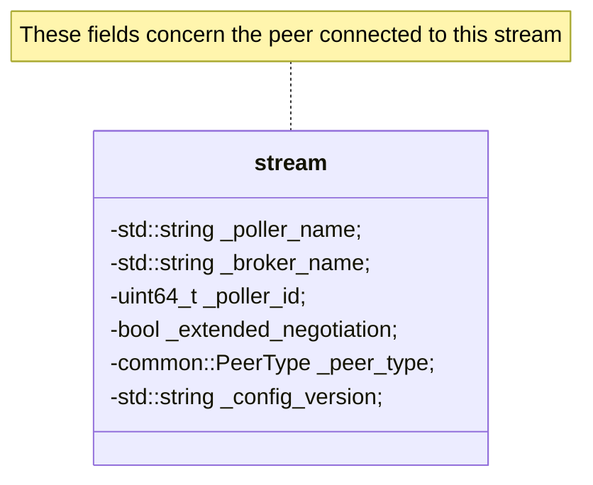
```mermaid
classDiagram
    note for stream "These fields concern the peer connected to this stream"
class stream {
    -std::string _poller_name;
    -std::string _broker_name;
    -uint64_t _poller_id;
    -bool _extended_negotiation;
    -common::PeerType _peer_type;
    -std::string _config_version;
}
```

At the negotiation level, the two important points are knowing whether extended negotiation is supported and in the case of an `Engine` connection, knowing which configuration version it knows. This is not the time to exchange the `Engine` configuration; there is potentially retention to clear before switching to sending it.

How does negotiation work? Two cases arise:

1. `Engine` initiates the connection.
2. `Broker` initiates the connection.

We consider here that `Engine` starts and connects to a `Broker` already running.

### New Broker functionality

`Broker` is configured with two new directories we already discussed:

- `cache_config_directory`
- `pollers-config`

We will focus on these two directories. The first contains subdirectories that are the numbers of pollers connected to this `Broker`. Next to each one, there is a file `XX.lck` where `XX` is the poller number. These `.lck` files are monitored for modifications by `Broker`.

As soon as PHP finishes filling one of these directories with the poller's configuration, i.e., a new subdirectory `<poller_ID>` is created, it creates next to it a file `<poller_ID>.lck`, `Broker` is directly notified.

In reality, `Broker` is not directly notified, as this would cost using a thread for that. So in reality, `Broker` executes a timer (every 5s) in its `config::applier::state` object. Every 5s,

1. It asks `inotify` if there have been modifications in the configuration cache directory. This request translates to a non-blocking file descriptor read. If there is nothing, the function returns immediately with no result.

2. In case of a positive response, it retrieves the file names `<poller ID>.lck` to deduce which configurations just arrived.

3. For each file of this form, it reads the configuration, creates a file `new-<poller ID>.prot` in the `pollers-config` directory.

4. Then in case there already existed a file `<poller ID>.prot` in this directory, it also creates a file `<diff-<poller ID.prot>`. If the file doesn't exist, the diff file is created but with the complete configuration.

5. `Broker` maintains the list of its interlocutors, so it also updates the item corresponding to the `Engine` with the correct poller ID to remember that it needs a new configuration.

6. These tasks are all executed by an independent thread; they should have only a limited impact on `Broker`'s operation.

Sending this difference is managed in the `bbdo` stream.

### Engine initiates the connection

`Engine` connects to `Broker` and sends the `Welcome` message. `Broker` is then informed whether the latest `Engine` configuration version is known by its interlocutor. It also knows if it supports the new negotiation. And it responds with a similar message.

Knowing that `Broker` listens to the PHP cache directory, when it has a new configuration available, it can send it.

An important point: `Broker` does not check the available `Engine` configuration version during negotiation. This is done as a background task. However, it stores in its information about the `Engine` peer its configuration version. Consequently, when a new version arrives, it can verify that the two are indeed different.

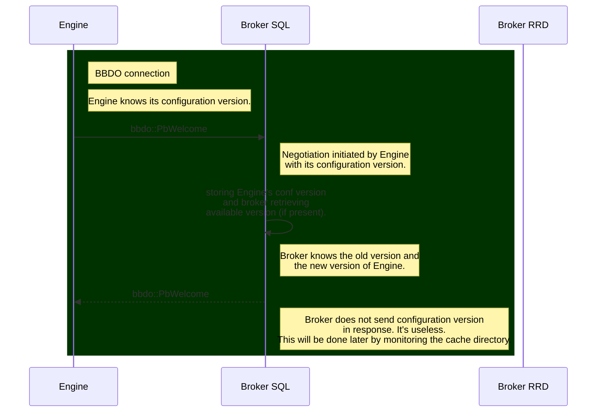
```mermaid
sequenceDiagram
    participant E as Engine
    participant BS as Broker SQL
    participant BR as Broker RRD

    rect rgb(0, 50, 0)
    note right of E: BBDO connection
    note right of E: Engine knows its configuration version.
    E ->> BS: bbdo::PbWelcome
    note right of BS: Negotiation initiated by Engine<br/>with its configuration version.

    BS ->> BS: storing Engine's conf version<br/>and broker retrieving<br/>available version (if present).
    note right of BS: Broker knows the old version and<br/>the new version of Engine.
    BS -->> E: bbdo::PbWelcome
    note right of BS: Broker does not send configuration version<br/>in response. It's useless.<br/>This will be done later by monitoring the cache directory.
    end
```

### Broker initiates the connection

`Broker` connects to `Engine` and sends the `Welcome` message. `Engine` learns at this moment whether `Broker` supports the new negotiation or not. And it responds by sending the current configuration version.

In terms of diagram, we are on a very similar scheme to the previous one except that the questions/answers are reversed.

# Reading Engine configuration

## Configuration management on the Engine side

`Engine` is started with the new configuration. It reads the serialized Protobuf configuration available in its `HOME`. It then connects to `Broker` and sends the `Welcome` message with the correct configuration version number. We saw that `Broker` just responds by saying whether it supports centralized configuration or not. In a second step, Broker, as a background task, checks if new configurations are available for `Engine`. If one appears, it sends a message with the configuration difference. `cbmod` keeps it on hold and when `Engine` starts a new cycle in its main loop, it applies this configuration.

If there is retention, it is sent as a background task during application of the new configuration. Once retention is finished, `Engine` having applied the configuration, in case of a reload, sends an `InstanceConfiguration` message to `Broker` to tell it that it has received the configuration.

FIXME DBO: Is the `InstanceConfiguration` message still necessary?

But actually, there is a specific message for this, it's the `pb_diff_state_ack` message that is sent by `Engine` to `Broker` to tell it that it has received and applied the new configuration.

## Managing configuration sending by Broker to Engine

`Broker` uses `inotify` to monitor the PHP cache directory. After PHP finishes writing the poller *X* configuration in this directory, it creates next to directory *X*, a file `X.lck`. `Broker` monitors the creation/modification of any `*.lck` file in this directory. For this, a timer set to 5 seconds does a read on the `inotify` file descriptor. This timer is launched asynchronously and when a file is detected, `Broker` performs several tasks:

In addition to `inotify`, the timer also performs a directory scan on each trigger.
This fallback detects `.lck` files that `inotify` may have missed (for example when
multiple rapid `touch()` calls saturate the kernel event queue). Any `.lck` file
found during the scan but not reported by `inotify` is treated as a missed
configuration event.

1. It reads the configuration directory to make an `engine::State` structure.

2. It serializes in its `pollers-conf` directory this configuration in a file `new-X.prot`.

3. In case a file `X.prot` already exists, it also creates a file `diff-X.prot` which contains the difference between the two configurations.

4. In case the file `X.prot` doesn't exist, it also creates the file `diff-X.prot` but fills it with the complete configuration.

All these steps are done as a background task.

#### Lifecycle of the `X.lck` file

The `X.lck` file does not merely mean "a configuration has just arrived", but
"a configuration is pending delivery to poller *X*". Its deletion is therefore
**conditioned on the poller being present**:

- Neither the `inotify` detection (`_watch_engine_conf`) nor the fallback scan
  deletes the `.lck`. They only add the poller to the list to process.
- The deletion happens only in `_check_last_engine_conf`, **after**
  `_prepare_diff_for_poller` and **only if the poller is connected**
  (`_is_engine_peer_connected`, i.e. present in `_engine_peers`).
- If the poller is not connected yet, the `.lck` is kept. To avoid needlessly
  re-parsing the configuration on every 5 s tick, a guard at the top of the
  loop skips processing when the poller is not connected and `new-X.prot` has
  already been prepared.

Why this precaution? When a poller connects **after** its configuration has
been prepared (for instance, its `.lck` was detected while it was still
starting up), Broker finds the retained `.lck` through
`_get_lck_file_if_exists` during `add_peer`. The poller is then re-queued and
its configuration is delivered on the next tick. Without this retention, the
prepared `diff-X.prot` would be left orphaned: the poller would connect with
neither `X.prot` nor `X.lck`, and Broker would wrongly consider its
configuration *lost or unknown* (see the
[Configuration management on the Engine side](#configuration-management-on-the-engine-side)
section).

> **Fixed race.** This behavior fixes a race where, when not all known pollers
> are connected at the same time, Broker published the global diff with a
> subset of the pollers (those whose config had been *sent and acknowledged*)
> and dropped the prepared configuration of the late poller. With the `.lck`
> retention, that poller's configuration is delivered as soon as it connects,
> and a new global diff is published to integrate it into the database.

The BBDO stream in connection with poller *X* is configured on reading to also check if the connected `Engine` has a new version:

1. `Broker` has the list of its interlocutors, among them the `Engine`s with current configuration and new one if present. It knows therefore if a new configuration is available for the `Engine` opposite.

2. If this is the case, just after receiving an event from `Engine`, it sends the `DiffState` message with the difference between old and new configuration.

3. After sending the `DiffState`, and receiving an acknowledgement from `Engine`, `Broker` deletes the difference file.

4. This message is stored on the `cbmod` side by `Engine` and is applied as soon as possible in its main loop.

On the `Broker` side, speaking a bit more technically, reading the `Engine` configuration is done using the `engine_conf` library. Once read, the configuration is resolved so that all `host_id` and others are correctly filled.

This resolution code was originally in `Engine` but it was moved to the `engine_conf` library. If `Engine` must work as before, it also uses this library.

Monitoring using `inotify` is done within the `config::applier::state` class.

## Calculating the difference

`Broker` is notified of new `Engine` configuration versions.

The configuration is received by the `config::applier::state` instance of `Broker`.

It is interesting to keep a small time window to be able to mutualize changes from different pollers. For now, queries to `inotify` are made every 5 seconds; perhaps it will be necessary to increase this delay a bit or configure it differently. The advantage of doing this at regular intervals is that if several pollers are modified in parallel, `Broker` should be able to process them together.

In the previous step, we evolved the negotiation between `Engine` and `Broker` but overall the two work as before. Just, in a certain number of cases, we avoid `Engine` resending its configuration to Broker.

## Writing configuration to database

### Case study

Currently, even if negotiation has evolved, `Broker` continues to write the configuration drop by drop following what pollers send it.

### Implementation

The good solution seems to be:

1. From poller differentials recovered on a configuration change, we create a global differential. The advantage is to resolve inter-poller conflicts in advance.

2. `Broker` must learn to be less strict on database writes. For example, if a host is deleted and we still send data on it, knowing that the host is just disabled, we should still be able to write the data.

3. When the global differential is ready, we would no longer be forced to wait for an `Instance` to process it. That said, if a poller is three weeks behind, what would be the impact on data of sending almost at poller connection the new configuration?

An algorithm for grouping differentials could follow the following solution:

- For added objects, we can do the union. We will have all added objects. On each addition, we must check among deleted ones if the object is not already referenced. If it is, we can move it to modified objects.

- For modified objects (which don't change poller), we can also do the union.

- For a host moved from one poller to another, one differential will say the host is added while another will say it is deleted.

- For a deleted object, we must check if it is not already added, and if it is, it must be put in modified objects.

On the Protobuf side, we have two configuration objects which are `State` and `DiffState`. They are good because serializable but they have the problem of being very limited for searches.

We therefore introduce two new objects `IndexedState` and `IndexedDiffState` which store objects in hash tables. A `merge()` method is implemented in `IndexedDiffState` to merge several differentials.

The diagram assumes pollers are already connected to `Broker`:

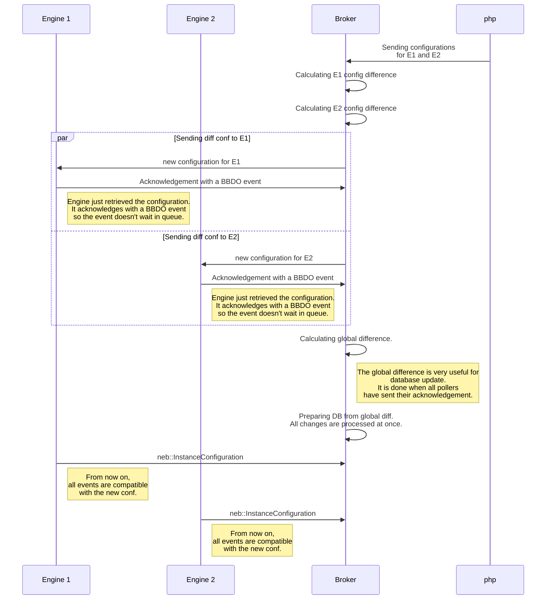
```mermaid
sequenceDiagram
  participant E1 as Engine 1
  participant E2 as Engine 2
  participant B as Broker
  participant php
  php ->> B: Sending configurations<br/>for E1 and E2
  B ->> B: Calculating E1 config difference
  B ->> B: Calculating E2 config difference
  par Sending diff conf to E1
    B ->> E1: new configuration for E1
    E1 ->> B: Acknowledgement with a BBDO event
    Note right of E1: Engine just retrieved the configuration.<br/> It acknowledges with a BBDO event<br/>so the event doesn't wait in queue.
  and Sending diff conf to E2
    B ->> E2: new configuration for E2
    E2 ->> B: Acknowledgement with a BBDO event
    Note right of E2: Engine just retrieved the configuration.<br/> It acknowledges with a BBDO event<br/>so the event doesn't wait in queue.
  end
  B ->> B: Calculating global difference.
  Note right of B: The global difference is very useful for<br/>database update.<br/>It is done when all pollers<br/> have sent their acknowledgement.
  B ->> B: Preparing DB from global diff.<br/>All changes are processed at once.
  E1 ->> B: neb::InstanceConfiguration
  Note right of E1: From now on,<br/> all events are compatible<br/> with the new conf.
  E2 ->> B: neb::InstanceConfiguration
  Note right of E2: From now on,<br/> all events are compatible<br/> with the new conf.
```

**Remarks.**

1. A point of vigilance: In case the second poller is very late, the arrival of the second `ConfigurationInstance` can really be delayed. If `Broker` waits for all `ConfigurationInstance` to update the base, it penalizes E1 data since the cache will take a long time before being updated.

2. Perhaps the global difference could be made on receiving acknowledgements. And timed with a timeout. For example from the first reception, Broker gives itself a 10s timeout, during this time span, as soon as it receives an acknowledgement, it enriches the global difference with the acknowledged configuration. When the timeout is finished, everything is sent to the database and cache.

3. A point of vigilance: we have assumed here that the configuration was coming from
   php. We also need to be able to recover if the configuration is already on the
   Engine side, including if it has been deleted on the Broker side.

For point 3., if Engine starts with a configuration already known by Broker, there is
no issue — the configuration is already in place. However, if an administrator has
deleted the configuration known by Engine from Broker's side, it would be good for
Engine to be able to send it to Broker to resolve the issue.

This case is handled as follows: during BBDO negotiation, if Broker finds neither an
`<ID>.prot` file nor an `<ID>.lck` file for a poller, it sends a
`DiffState{unknown=true}` to Engine. Engine detects this message and attempts to send
its current configuration to Broker. If `state.prot` exists, Engine sends it;
otherwise (first start, no configuration has been applied yet), Engine logs a warning
and sends nothing — the normal configuration flow (via `.lck` files) will take over.
In both cases, Engine immediately resets the `reloading` flag to `false` so that
subsequent diffs can be processed.

Broker receives the current `State`, then calls `create_prot_file()`. Before writing
`<ID>.prot`, Broker checks that no more recent configuration is already being
processed:

- if a `<ID>.lck` file exists in the PHP cache directory, PHP has just sent a new
  configuration; Broker lets the normal flow handle it;
- if a `new-<ID>.prot` file exists, the normal flow is already preparing the new
  configuration;
- if `<ID>.prot` already exists, the normal flow has already installed it.

In all three cases, Broker simply resets `conf_unknown` to `false` without
overwriting the file.

> **Not to be confused with a late poller.** This `unknown=true` mechanism only
> covers genuine configuration loss (no `<ID>.prot`, no `<ID>.lck`, no
> `new-<ID>.prot` in progress). The case of a poller that connects *after* PHP
> has pushed its configuration no longer lands here: the `<ID>.lck` is kept
> until the connection (see [Lifecycle of the `X.lck` file](#lifecycle-of-the-xlck-file)),
> so `_get_lck_file_if_exists` finds it and delivery resumes through the normal
> flow instead of a `DiffState{unknown=true}`.

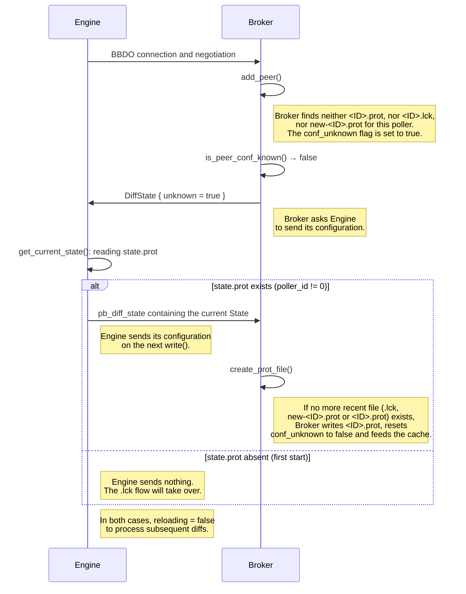
```mermaid
sequenceDiagram
    participant E as Engine
    participant B as Broker

    E ->> B: BBDO connection and negotiation
    B ->> B: add_peer()
    note right of B: Broker finds neither <ID>.prot, nor <ID>.lck,<br/>nor new-<ID>.prot for this poller.<br/>The conf_unknown flag is set to true.
    B ->> B: is_peer_conf_known() → false
    B ->> E: DiffState { unknown = true }
    note right of B: Broker asks Engine<br/>to send its configuration.
    E ->> E: get_current_state(): reading state.prot
    alt state.prot exists (poller_id != 0)
        E ->> B: pb_diff_state containing the current State
        note right of E: Engine sends its configuration<br/>on the next write().
        B ->> B: create_prot_file()
        note right of B: If no more recent file (.lck,<br/>new-<ID>.prot or <ID>.prot) exists,<br/>Broker writes <ID>.prot, resets<br/>conf_unknown to false and feeds the cache.
    else state.prot absent (first start)
        note right of E: Engine sends nothing.<br/>The .lck flow will take over.
    end
    note right of E: In both cases, reloading = false<br/>to process subsequent diffs.
```

If `Engine` is restarted before sending this *event*, it will connect with the new configuration but `Broker` will still have work remnants to perform which can be problematic. To avoid this, we go through a new BBDO *event* (therefore managed outside the event stack); as soon as `Engine` reads the configuration, it emits this new *event* to inform `Broker` as soon as possible that it is taken into account. To apply the configuration on the database, `Broker` waits to have received all these acknowledgements.

Let's detail more the file management during configuration sending to better understand the issues we could encounter.


## Tricky cases

When there is retention, we have two cases that pose problems:

1. If the first poller is on time and the second has retention. In case a host is moved from the second to the first, Broker risks receiving data from the same host at the same time, coming from the two pollers, this until the second poller catches up with retention. In terms of dating, data arriving from the second poller will be older.

2. If the second poller has retention and before `Broker` receives its InstanceConfiguration, the user pushes a new configuration. It is possible in this case that `Engine` has already taken into account the penultimate configuration, and on the other hand that `Broker` is not yet informed and considers `Engine` is still on the previous configuration. Consequently, the differential newly calculated by `Broker` will be wrong.

The second tricky case should be resolved thanks to the introduction of the BBDO acknowledgement event.

We have a *flag* in `Broker` to specify if it is busy processing poller configuration or not. There are two portions of code concerned by this *flag*.

1. When the timer creates diff files, state files, etc. It's a whole moment where the *flag* is activated. So if the bbdo stream wants to access available configurations, access is refused and it goes on its way.

2. When the BBDO stream sends configuration to pollers. The timer no longer has access to configuration files, and the timer is just rescheduled for later waiting for the task to be finished. The BBDO stream, ideally, should disable the flag when all pollers have sent an acknowledgement.

Below is the illustration of situation 2 we want to avoid:


Thanks to the acknowledgement message, `Broker` will not read the new available configuration until it has received the acknowledgement from `Engine`. And once the acknowledgement is received, `Broker` knows that it is now this configuration that is in place (even if it is not yet completely effective due to retention). Consequently, when `Broker` reads the new configuration, it correctly calculates the differential with the correct configuration already in place.

There is a third worrying case concerning all cross-cutting objects. Let's consider Hostgroup for example. A poller whose certain hosts belong to Hostgroups, has a configuration declaring necessary Hostgroups with hosts it contains. The problem is that poller 1 only knows its hosts, and consequently the Hostgroups it has in definition also only know its hosts.

Let's take an example, we have hosts 1 and 2 on poller 1 and hosts 3 and 4 on poller 2. A Hostgroup contains all 4 hosts.

The configuration of poller 1 will therefore contain a declaration of the Hostgroup with only hosts 1 and 2 and the configuration of poller 2 will have another with hosts 3 and 4.

Let's now resume our centralized configuration, the configuration of poller 1 changes by removing hosts 1 and 2 from the Hostgroup. The config diff will simply delete the Hostgroup.

In case only poller 1 has configuration modifications, we end up with a diff that declares the deletion of the Hostgroup. This will be inserted in the global differential used to prepare the database. But we cannot delete the Hostgroup like that, it is still used by poller 2.

So for Hostgroups and Servicegroups, the differential system set up cannot apply.

The differential with Hostgroups, Servicegroups implemented like the others must be kept because it is used when sending the diff to the poller.

The problem is when gathering modifications on these objects for database writing and later for broker's global cache.

The neb::service object is more complete than a configuration::service configuration. So during initialization with a neb::service, we also have the service state, pending if nothing is given at the start. In case of a configuration::service, we find NULL in the status column of the `resources` table; which causes test cases that can fail for now and will need to be fixed.

## Cross-cutting objects

We have a Protobuf DiffState object which is distributed in an indexed_diff_state, which, as its name indicates, indexes container objects.

For GlobalDiffState, we currently have the same objects. Could we inherit from indexed_diff_state to add specificities.

Let's imagine the structure of global_indexed_diff_state. This class inherits from indexed_diff_state. Let's process the merge of a DiffState.

* Poller 1 sees the arrival of a new Hostgroup with hosts 6 and 7. Its diff contains an added Hostgroup with two members. Poller 2 sees the same new Hostgroup to which hosts 8 and 10 are added.

	* Current state: the first diff will complete the global diff state with a new hostgroup and its members. The second diff will also complete the global diff state with the same new one. Their contents are not merged, the second overwrites the first.
	* Evolution: We can keep the same added/modified/removed structure but the viewpoints of different pollers must not interfere, so it's best to index these changes by poller. At the global cache level, we have the current state of all Hostgroups and we can really apply changes.

## The necessity of centralized cache

Let's start with two scenarios:
1. Engine knows no configuration, it starts and connects to broker. Broker sends it the complete configuration.
   In this case, Broker also calculates the "global" difference that will allow registering this configuration in the `centreon_storage` database. And monitoring can start running.
2. Let's now imagine situation 1. but we stop `Engine`. Then we restart it. It reconnects to `Broker` and gives the configuration it knows.
   On its side, `Broker` has no new configuration so it sends nothing to `Engine`. So `Engine` acknowledges nothing. So the global diff contains nothing on this poller that just restarted. When `Engine` previously stopped, all its resources were disabled. But nothing allows reactivating them for now. So `Engine` connects, works normally, but on `Broker` side we see nothing.

The second case with the system we know works very well because `Engine` sends all its configuration and resources are reactivated one by one.

Let's resume the configuration exchange diagram.

We assume Broker is already running.

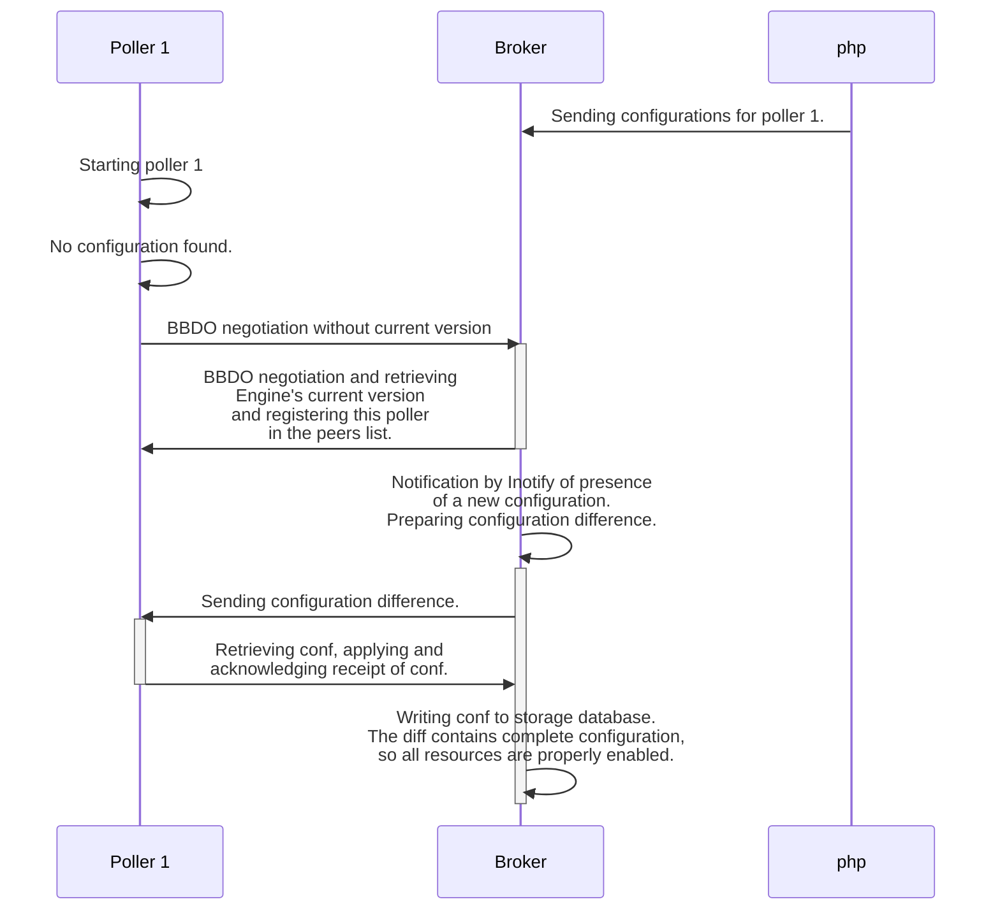
```mermaid
sequenceDiagram
    participant E as Poller 1
    participant B as Broker
    participant php
    php ->> B: Sending configurations for poller 1.
    E ->> E: Starting poller 1
    E ->> E: No configuration found.
    E ->> B: BBDO negotiation without current version
    activate B
    B ->> E: BBDO negotiation and retrieving<br/>Engine's current version<br/>and registering this poller<br/>in the peers list.
    deactivate B
    B ->> B: Notification by Inotify of presence<br/>of a new configuration.<br/>Preparing configuration difference.
    activate B
    B ->> E: Sending configuration difference.
    activate E
    E ->> B: Retrieving conf, applying and<br/>acknowledging receipt of conf.
    deactivate E
    B ->> B: Writing conf to storage database.<br/> The diff contains complete configuration,<br/>so all resources are properly enabled.
    deactivate B
```

Let's resume the previous case, but this time, `Engine` already knows the configuration.

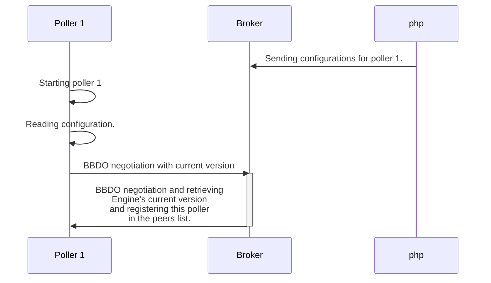
```mermaid
sequenceDiagram
    participant E as Poller 1
    participant B as Broker
    participant php
    php ->> B: Sending configurations for poller 1.
    E ->> E: Starting poller 1
    E ->> E: Reading configuration.
    E ->> B: BBDO negotiation with current version
    activate B
    B ->> E: BBDO negotiation and retrieving<br/>Engine's current version<br/>and registering this poller<br/>in the peers list.
    deactivate B
```

In this second case, there is no configuration sending, so no acknowledgement, so no database update.
The user is left in the dark, because resources are disabled and don't reactivate.

Just before starting monitoring, `Engine` sends an `Instance` message that could be used to reactivate resources.

But here, we face another problem. Deleted resources like disabled resources just have the `enabled` column at 0 in the `resources` table. So, we cannot distinguish between the two.

So if we set `enabled` to 1, all resources, including old ones, will be reactivated which is problematic.

`Broker` must absolutely keep a trace of resources on its side, which allows reactivating what is needed at these moments. We therefore need a cache on `Broker`.

## Some more technical points

When an Engine connects to Broker, the `config::applier::add_peer()` method is called. It works as follows:

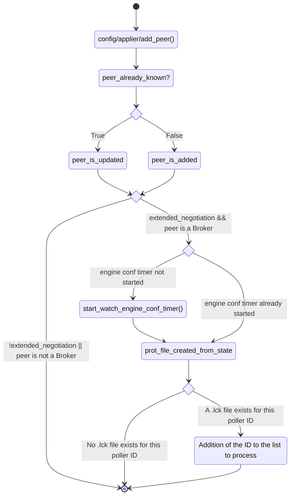
```mermaid
stateDiagram-v2
    [*] --> config/applier/add_peer()
    config/applier/add_peer() --> peer_already_known?
    state if_state <<choice>>
    peer_already_known? --> if_state
    if_state --> peer_is_updated:True
    if_state --> peer_is_added:False
    state extended_nego <<choice>>
    peer_is_updated --> extended_nego
    peer_is_added --> extended_nego
    extended_nego --> [*]: !extended_negotiation || peer is not a Broker
    state if_watch_engine_timer_started <<choice>>
    extended_nego --> if_watch_engine_timer_started: extended_negotiation && peer is a Broker
    if_watch_engine_timer_started --> start_watch_engine_conf_timer(): engine conf timer not started
    start_watch_engine_conf_timer() --> prot_file_created_from_state
    if_watch_engine_timer_started --> prot_file_created_from_state: engine conf timer already started

    state if_existing_lck_file_for_current_poller_id <<choice>>
    prot_file_created_from_state --> if_existing_lck_file_for_current_poller_id
    if_existing_lck_file_for_current_poller_id --> keep_lck_file_in_memory: A .lck file exists for this poller ID
    if_existing_lck_file_for_current_poller_id --> [*]: No .lck file exists for this poller ID
    keep_lck_file_in_memory: Addition of the ID to the list to process
    keep_lck_file_in_memory --> [*]
```

This method memorizes the poller in its peers list. It starts the `Engine` configuration monitoring timer if negotiation is extended and the peer is an `Engine`. And it also checks if a `.lck` file already exists for the poller ID because `inotify` doesn't report files existing before it starts. If such a file is found, the poller ID is added to the list to process on the next timer tick.

Subsequently, the timer is executed as a background task and checks every 5s if a `.lck` file has been modified or created; in this case the list of `.lck` files is enriched then processed as a background task. Let's focus on this part.

The timer executes the `config::applier::state::_check_last_engine_conf()` method.

```mermaid
stateDiagram-v2
    [*] --> _watch_engine_conf(poller_ids)
    _watch_engine_conf(poller_ids) --> pour_chaque_poller_id
    note right of _watch_engine_conf(poller_ids): This function retrieves IDs reported by inotify<br/>(completed by the fallback directory scan).<br/>The ID.lck file is NOT deleted here: it marks<br/>a configuration pending delivery.
    pour_chaque_poller_id: For each poller ID in poller_ids
    state garde_attente <<choice>>
    pour_chaque_poller_id --> garde_attente
    garde_attente --> fin_pour_chaque_poller_id: Poller not connected AND new-ID.prot<br/>already present → keep the .lck<br/>and wait for the connection
    lect_conf_engine: Reading Engine configuration
    garde_attente --> lect_conf_engine: otherwise
    lect_conf_engine --> resolution_de_la_configuration_engine
    resolution_de_la_configuration_engine: Resolution and extension of Engine configuration
    resolution_de_la_configuration_engine --> ecriture_dans_fichier__new_ID_prot
    ecriture_dans_fichier__new_ID_prot: Writing configuration in State format<br/> to a new-ID.prot file
    ecriture_dans_fichier__new_ID_prot --> preparation_de_la_difference
    preparation_de_la_difference: _prepare_diff_for_poller(poller_id, state)
    note right of preparation_de_la_difference: This function prepares the difference<br/> between current and new configuration.<br/>It creates the diff-ID.prot file.
    preparation_de_la_difference --> suppression_conditionnelle_lck
    suppression_conditionnelle_lck: Is the poller connected?
    state lck_decision <<choice>>
    suppression_conditionnelle_lck --> lck_decision
    suppr_lck: Deletion of the ID.lck file
    garde_lck: Keep ID.lck<br/>(replayed when the poller connects)
    lck_decision --> suppr_lck: connected (_is_engine_peer_connected)
    lck_decision --> garde_lck: not connected
    suppr_lck --> fin_pour_chaque_poller_id
    garde_lck --> fin_pour_chaque_poller_id
    fin_pour_chaque_poller_id: End of loop on poller IDs
    fin_pour_chaque_poller_id --> pour_chaque_poller_id
    fin_pour_chaque_poller_id --> [*]
```

Let's detail a bit the behavior of the `config::applier::state::_prepare_diff_for_poller()` method.

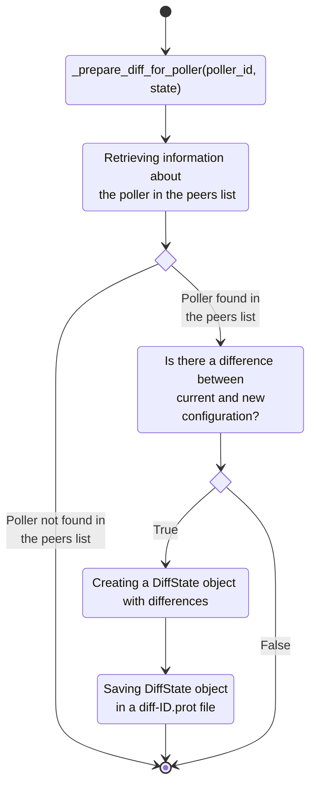
```mermaid
stateDiagram-v2
    prepare_diff_poller: _prepare_diff_for_poller(poller_id, state)
    [*] --> prepare_diff_poller
    recup_poller_in_peers: Retrieving information about<br/> the poller in the peers list
    state si_pas_trouve <<choice>>
    recup_poller_in_peers --> si_pas_trouve
    prepare_diff_poller --> recup_poller_in_peers
    si_pas_trouve --> [*]: Poller not found in<br/> the peers list
    comparaison: Is there a difference between<br/> current and new configuration?
    si_pas_trouve --> comparaison: Poller found in<br/> the peers list
    state si_differe <<choice>>
    comparaison --> si_differe
    create_diff: Creating a DiffState object with differences
    si_differe --> create_diff: True
    sauv_diff: Saving DiffState object<br/> in a diff-ID.prot file
    create_diff --> sauv_diff
    sauv_diff --> [*]
    si_differe --> [*]: False
```

Consequently, on the `state` side, Broker monitors `Engine` configurations and as soon as a new one is available, it calculates the difference and creates the `diff-ID.prot` and `new-ID.prot` files.

Each BBDO stream knows its interlocutor. If `Broker` is connected to `Engine`, a BBDO stream links them and `Broker` knows it is connected to an `Engine`, it knows its poller ID, if it supports centralized configuration, etc.

This stream regularly reads incoming events, this is how `Broker` receives monitoring. Reading is done by a `bbdo::stream::read()` method. It is in this method that certain actions like event acknowledgement are done. And it is also there that Broker detects if a new configuration is available for the connected poller. In case a configuration is available, it is then read and sent to `Engine`.

A simplified algorithm of this method is as follows:


```mermaid
stateDiagram-v2
    read: read(d, deadline)
    read_one_event: Reading one BBDO event
    read --> read_one_event
    state if_bbdo_event <<choice>>
    read_one_event --> if_bbdo_event
    if_bbdo_event --> handle_bbdo_event(d): Its category is BBDO
    state if_ack_needed <<choice>>
    if_bbdo_event --> if_ack_needed: Its category is not BBDO
    handle_bbdo_event(d) --> read_one_event
    if_ack_needed --> send_event_acknowledgement(): Max number of events reached,<br/>sending acknowledgement.
    state if_peer_is_engine <<choice>>
    if_ack_needed --> if_peer_is_engine: otherwise
    send_event_acknowledgement() --> if_peer_is_engine
    read_conf: Reading available Engine<br/>configuration difference diff-ID.prot
    if_peer_is_engine --> read_conf: Peer is an Engine and<br/> a new configuration is available
    if_peer_is_engine --> [*]: otherwise
    send_conf: Sending Engine configuration<br/> difference to poller
    read_conf --> send_conf
    update_peers: Updating peers list<br/> to indicate that poller received<br/>a configuration update
    send_conf --> update_peers
    update_peers --> [*]
```

In this same `read()` method, we have a call to the `handle_bbdo_event()` method for events of BBDO category. It is in this method that we find among other things the processing of configuration acknowledgement by `Engine`.

When acknowledgement is received for a poller with ID poller_id, the peers list is updated to indicate that this poller is up to date. The `new-ID.prot` file replaces the `ID.prot` file.

Finally, when all pollers are up to date, a `com::centreon::engine::configuration::indexeed_diff_state` object is built by merging all poller differentials. This object is published by `Broker` to be processed by the `unifie_sql` stream.

The arrangement of these functions gives approximately the following diagram:

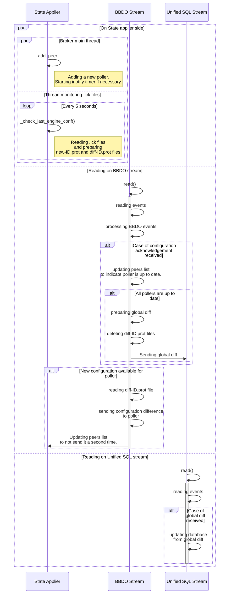
```mermaid
sequenceDiagram
participant S as State Applier
participant BBDO as BBDO Stream
participant USQL as Unified SQL Stream

par On State applier side
    par Broker main thread
    S ->> S: add_peer
    note right of S: Adding a new poller.<br/>Starting inotify timer if necessary.
    and Thread monitoring .lck files
        loop Every 5 seconds
            S ->> S: _check_last_engine_conf()
            note right of S: Reading .lck files<br/>and preparing<br/>new-ID.prot and diff-ID.prot files
        end
    end
and Reading on BBDO stream
    BBDO ->> BBDO: read()
    activate BBDO
    BBDO ->> BBDO: reading events
    BBDO ->> BBDO: processing BBDO events
    alt Case of configuration acknowledgement received
        BBDO ->> BBDO: updating peers list<br/>to indicate poller is up to date.
        alt All pollers are up to date
            BBDO ->> BBDO: preparing global diff
            BBDO ->> BBDO: deleting diff-ID.prot files
            BBDO ->> USQL: Sending global diff
        end
    end
    alt New configuration available for poller
    BBDO ->> BBDO: reading diff-ID.prot file
    BBDO ->> BBDO: sending configuration difference<br/>to poller
    BBDO ->> S: Updating peers list<br/>to not send it a second time.
    end
    deactivate BBDO
and Reading on Unified SQL stream
    USQL ->> USQL: read()
    activate USQL
    USQL ->> USQL: reading events
    alt Case of global diff received
        USQL ->> USQL: updating database<br/>from global diff
    end
    deactivate USQL
end
```

## Split of broker::config::applier::state

This `broker::config::applier::state` object is used by both `cbmod` and `broker`. It manages monitoring of `Engine` configuration files, calculating differences, etc.

Its behavior is a bit different depending on whether it is used by `cbmod` or by `broker`.

Keeping a single object for both forces us to keep attributes used by one and not by the other. The peers list, for example, has quite complicated management to handle both cases. The `_engine_conf` attribute, used only on the `cbmod` side, is also found in `broker` even though it serves no purpose there.

The `com::centreon::broker::config::applier::state` class is therefore split into three:

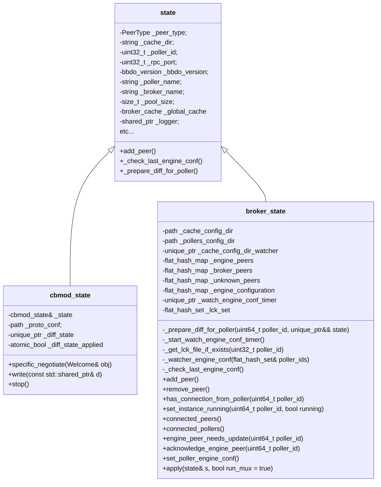
```mermaid
classDiagram
    class state {
        -PeerType _peer_type;
        -string _cache_dir;
        -uint32_t _poller_id;
        -uint32_t _rpc_port;
        -bbdo_version _bbdo_version;
        -string _poller_name;
        -string _broker_name;
        -size_t _pool_size;
        -broker_cache _global_cache
        -shared_ptr<spdlog::logger> _logger;

        +add_peer()
        +_check_last_engine_conf()
        +_prepare_diff_for_poller()
        etc...
    }
    class cbmod_state {
        -cbmod_state& _state
        -path _proto_conf;
        -unique_ptr<DiffState> _diff_state
        -atomic_bool _diff_state_applied
        +specific_negotiate(Welcome& obj)
        +write(const std::shared_ptr<io::data>& d)
        +stop()
    }
    class broker_state {
        -path _cache_config_dir
        -path _pollers_config_dir
        -unique_ptr<directory_watcher> _cache_config_dir_watcher
        -flat_hash_map<peer_key, engine_peer> _engine_peers
        -flat_hash_map<peer_key, broker_peer> _broker_peers
        -flat_hash_map<peer_key, unknown_peer> _unknown_peers
        -flat_hash_map<uint64_t, string> _engine_configuration
        -unique_ptr<steady_timer> _watch_engine_conf_timer
        -flat_hash_set<uint32_t> _lck_set
        -_prepare_diff_for_poller(uint64_t poller_id, unique_ptr<State>&& state)
        -_start_watch_engine_conf_timer()
        -_get_lck_file_if_exists(uint32_t poller_id)
        -_watcher_engine_conf(flat_hash_set<uint32_t>& poller_ids)
        -_check_last_engine_conf()
        +add_peer()
        +remove_peer()
        +has_connection_from_poller(uint64_t poller_id)
        +set_instance_running(uint64_t poller_id, bool running)
        +connected_peers()
        +connected_pollers()
        +engine_peer_needs_update(uint64_t poller_id)
        +acknowledge_engine_peer(uint64_t poller_id)
        +set_poller_engine_conf()
        +apply(state& s, bool run_mux = true)
    }
    state <|-- cbmod_state
    state <|-- broker_state
```

The split of `state` also implies splitting the `bbdo::stream` class.

There are `bbdo::stream` used by `cbmod` to connect to a `broker`, there are `bbdo::stream` used by `broker` to connect to an `engine`, and there are also `bbdo::stream` used by cache or *unprocessed* files.

To represent all this, it was necessary to split `bbdo::stream` into a base class `bbdo::basic_stream` then a pure virtual class `bbdo::stream` that inherits from `bbdo::basic_stream` and finally two concrete classes `bbdo::broker_stream` and `bbdo::cbmod_stream` that inherit from `bbdo::stream`.

Which gives the following structure:

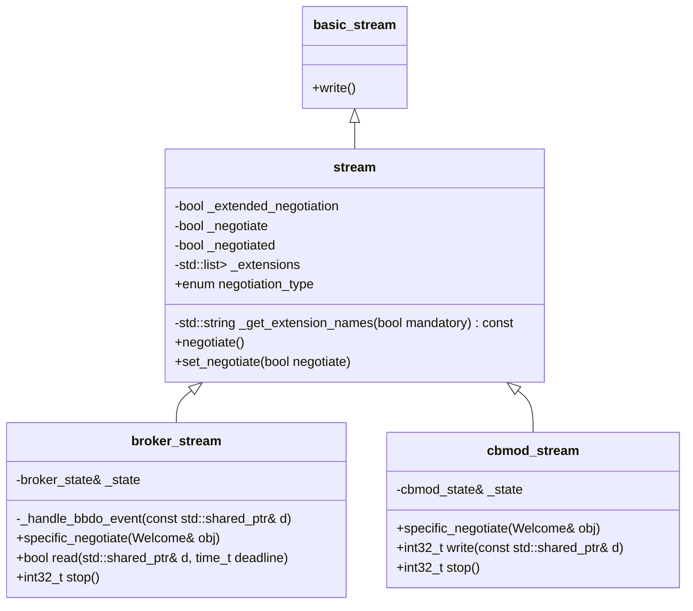
```mermaid
classDiagram
    class basic_stream {
        +write()
    }
    class stream {
        -bool _extended_negotiation
        -bool _negotiate
        -bool _negotiated
        -std::list<std::shared_ptr<io::extension>> _extensions
        -std::string _get_extension_names(bool mandatory) const
        +enum negotiation_type
        +negotiate()
        +set_negotiate(bool negotiate)
    }
    class broker_stream {
        -broker_state& _state
        -_handle_bbdo_event(const std::shared_ptr<io::data>& d)
        +specific_negotiate(Welcome& obj)
        +bool read(std::shared_ptr<io::data>& d, time_t deadline)
        +int32_t stop()
    }
    class cbmod_stream {
        -cbmod_state& _state
        +specific_negotiate(Welcome& obj)
        +int32_t write(const std::shared_ptr<io::data>& d)
        +int32_t stop()
    }
    basic_stream <|-- stream
    stream <|-- broker_stream
    stream <|-- cbmod_stream
```

# SQL/storage streams

These two streams have been deprecated in favor of the unified SQL stream. These streams do not work with BBDO 3
and are therefore unusable with centralized configuration.

It is therefore time to remove them, which will avoid issues with potential regressions.

Regarding *robot* tests, many are still based on these streams. Broker needs to start by default
with the unified SQL stream and the tests need to be adapted accordingly.

# Broker centralized cache

## Operating in centralized configuration

Since caches before introducing centralized cache stored `neb::services`, `neb::hosts`, the new cache will also contain these events. This imposes conversions from configuration, but given Lua's need, it's difficult to do otherwise.

The global cache, unlike the previous situation, is no longer updated by `neb::services` and others; it's essentially configuration that fills it then `service_status`, `host_status` for some updates.

This update is done in the multiplexer. When its *engine* receives events, it takes the opportunity to update the cache.

We also need to look at how configuration acts on the cache.

This diagram needs to be updated with cache update...

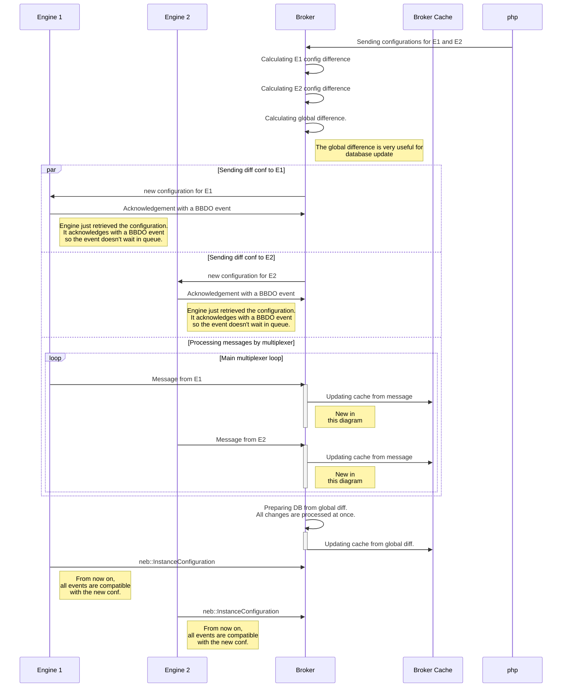
```mermaid
sequenceDiagram
    participant E1 as Engine 1
    participant E2 as Engine 2
    participant B as Broker
    participant C as Broker Cache
    participant php
    php ->> B: Sending configurations for E1 and E2
    B ->> B: Calculating E1 config difference
    B ->> B: Calculating E2 config difference
    B ->> B: Calculating global difference.
    Note right of B: The global difference is very useful for<br/>database update
    par Sending diff conf to E1
        B ->> E1: new configuration for E1
        E1 ->> B: Acknowledgement with a BBDO event
        Note right of E1: Engine just retrieved the configuration.<br/> It acknowledges with a BBDO event<br/>so the event doesn't wait in queue.
    and Sending diff conf to E2
        B ->> E2: new configuration for E2
        E2 ->> B: Acknowledgement with a BBDO event
        Note right of E2: Engine just retrieved the configuration.<br/> It acknowledges with a BBDO event<br/>so the event doesn't wait in queue.
    and Processing messages by multiplexer
        loop Main multiplexer loop
            E1 ->> B: Message from E1
            activate B
            B ->> C: Updating cache from message
            Note right of B: New in<br/>this diagram
            deactivate B
            E2 ->> B: Message from E2
            activate B
            B ->> C: Updating cache from message
            Note right of B: New in<br/>this diagram
            deactivate B
        end
    end

    B ->> B: Preparing DB from global diff.<br/>All changes are processed at once.
    activate B
    B ->> C: Updating cache from global diff.
    deactivate B
    E1 ->> B: neb::InstanceConfiguration
    Note right of E1: From now on,<br/> all events are compatible<br/> with the new conf.
    E2 ->> B: neb::InstanceConfiguration
    Note right of E2: From now on,<br/> all events are compatible<br/> with the new conf.
```

`Broker`'s behavior is adapted with the addition of centralized cache.

**Remarks.**

1. An interesting point is to see if we can apply a DiffState to the cache directly even before writing to database. This would simplify cache writing. However, this can pose problems when updating the database because it uses the cache a lot.

2. Otherwise, we can update the cache as database writing progresses. But what happens if one day the database is deleted?

In case cache update is done upstream of database writing, we get the following diagram:

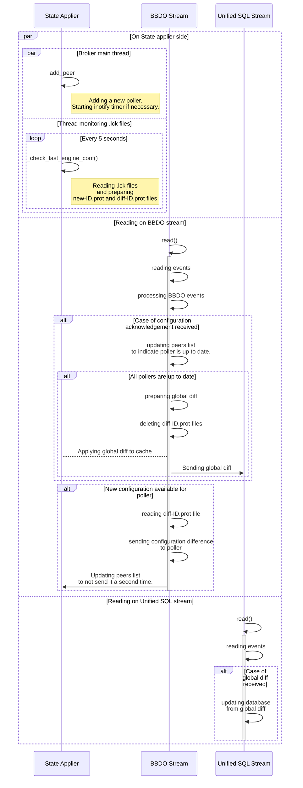
```mermaid
sequenceDiagram
    participant S as State Applier
    participant BBDO as BBDO Stream
    participant USQL as Unified SQL Stream

    par On State applier side
        par Broker main thread
            S ->> S: add_peer
            note right of S: Adding a new poller.<br/>Starting inotify timer if necessary.
        and Thread monitoring .lck files
            loop Every 5 seconds
                S ->> S: _check_last_engine_conf()
                note right of S: Reading .lck files<br/>and preparing<br/>new-ID.prot and diff-ID.prot files
            end
        end
    and Reading on BBDO stream
        BBDO ->> BBDO: read()
        activate BBDO
        BBDO ->> BBDO: reading events
        BBDO ->> BBDO: processing BBDO events
        alt Case of configuration acknowledgement received
            BBDO ->> BBDO: updating peers list<br/>to indicate poller is up to date.
            alt All pollers are up to date
                BBDO ->> BBDO: preparing global diff
                BBDO ->> BBDO: deleting diff-ID.prot files
                BBDO --> S: Applying global diff to cache
                BBDO ->> USQL: Sending global diff
            end
        end
        alt New configuration available for poller
            BBDO ->> BBDO: reading diff-ID.prot file
            BBDO ->> BBDO: sending configuration difference<br/>to poller
            BBDO ->> S: Updating peers list<br/>to not send it a second time.
        end
        deactivate BBDO
    and Reading on Unified SQL stream
        USQL ->> USQL: read()
        activate USQL
        USQL ->> USQL: reading events
        alt Case of global diff received
            USQL ->> USQL: updating database<br/>from global diff
        end
        deactivate USQL
    end
```

## Host `poller_id` population in the cache

### The problem

In the protobuf `State` message (sent by Engine as a `pb_engine_state` event),
the `poller_id` field is set at the **message level** — i.e., `state.poller_id()`
is non-zero and identifies the poller. However, the individual `Host` objects
embedded in `state.hosts()` do **not** carry their own `poller_id` field: they
only have `host_id`, `host_name`, and other host-specific attributes. The same
applies to `DiffHost` objects inside `DiffState` messages.

This matters because `broker_cache` stores hosts in a `_hosts` multi-index
container, and the cached `Host` objects must have a valid `instance_id`
(= `poller_id`) in order for the group-link removal logic in `apply()` to work
correctly. When a servicegroup or hostgroup is removed from a poller, the code
iterates over all service/host-group links and erases only those whose host
belongs to the affected poller, using the comparison:

```
host->obj().instance_id() == sgp.poller_id()
```

If `instance_id` is 0 because the host was never given a valid `poller_id`,
this comparison always fails and no links are ever removed.

### The fix — two complementary changes

**1. `_fill_host()` accepts a `poller_id_hint`**

The private helper `broker_cache::_fill_host()` now takes an optional
`poller_id_hint` parameter. When `cfg.poller_id() == 0` (which is always the
case for hosts coming from a `pb_engine_state`), the hint is used instead:

```cpp
uint64_t pid = cfg.poller_id() != 0 ? cfg.poller_id() : poller_id_hint;
```

`merge()` passes `state.poller_id()` as the hint:

```cpp
_fill_host(&h->mut_obj(), host, state.poller_id());
```

**2. `indexed_diff_state::add_diff_state()` stamps hosts with `poller_id`**

Before the global diff is published, `add_diff_state()` aggregates all
per-poller diffs. In both the full-state path and the differential path, the
key-builder lambda for hosts now explicitly calls `obj->set_poller_id(poller_id)`
before returning the host key:

```cpp
// Full state path
_add_message<Host, uint64_t>(
    diff_state.mutable_state()->mutable_hosts(), ...,
    [poller_id = diff_state.poller_id()](Host* obj) {
      obj->set_poller_id(poller_id);   // stamp before key extraction
      return obj->host_id();
    });

// Differential path
_add_diff_message<DiffHost, Host, uint64_t>(
    diff_state.mutable_hosts(), ...,
    [poller_id = diff_state.poller_id()](Host* obj) {
      obj->set_poller_id(poller_id);   // stamp before key extraction
      return obj->host_id();
    });
```

This ensures that the `Host` objects stored in the global diff already carry
a valid `poller_id`, so `apply()` can call `_fill_host()` without a hint and
still produce correctly-populated cache entries.

### Why the global diff has no `poller_id`

Note that the **global** `DiffState` (the one sent as `pb_global_diff_state`)
intentionally has `poller_id == 0` at the message level, because it
aggregates changes from multiple pollers. Each individual host object inside
this global diff carries its own `poller_id` (set by the stamping above), so
the per-host association is preserved even though the message-level id is
absent.

## Operating in *legacy* mode

If centralized configuration is not enabled, the cache must replace the old
stream caches in a fairly similar manner. It won't be identical; we know that
with the new cache we may lose synchronization between a poller and the central
during configuration updates.

When an Engine starts, it sends its configuration to the Broker. The cache is thus
updated. However, if the broker is restarted, the cache is lost. The cache must
therefore be saved to disk when Broker stops so that it can
be reloaded identically when Broker restarts.

In the *legacy* case, we therefore obtain the following behavior:
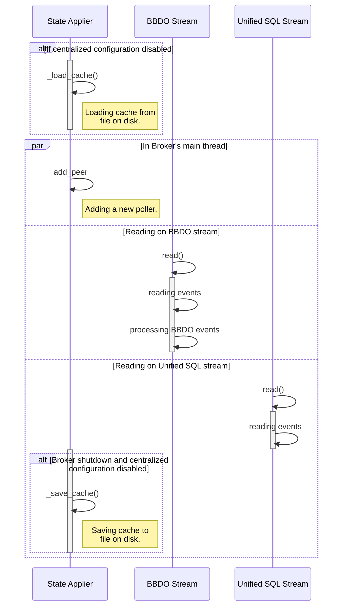
```mermaid
sequenceDiagram
    participant S as State Applier
    participant BBDO as BBDO Stream
    participant USQL as Unified SQL Stream

    alt If centralized configuration disabled
        activate S
        S ->> S: _load_cache()
        note right of S: Loading cache from<br/>file on disk.
        deactivate S
    end
    par In Broker's main thread
        S ->> S: add_peer
        note right of S: Adding a new poller.
    and Reading on BBDO stream
        BBDO ->> BBDO: read()
        activate BBDO
        BBDO ->> BBDO: reading events
        BBDO ->> BBDO: processing BBDO events
        deactivate BBDO
    and Reading on Unified SQL stream
        USQL ->> USQL: read()
        activate USQL
        USQL ->> USQL: reading events
        deactivate USQL
        activate S
        alt Broker shutdown and centralized configuration disabled
            S ->> S: _save_cache()
            note right of S: Saving cache to<br/>file on disk.
        end
        deactivate S
    end
```

A point of attention regarding legacy mode and possibly also in centralized configuration concerns
index mappings and metric mappings. These two objects are stored very comprehensively in
the `unified_sql` cache. They are obtained largely through an SQL query made during stream
startup.

When other streams use these two pieces of information, they only use a small portion of them.

Several points:

* There's no need to save this information in the cache file since it's retrieved at startup and
will be much more up-to-date. Especially since PHP can also write to it directly.
* This also means that the cache, even though it's largely updated by the configuration and by
engine sends, is also updated by SQL queries made at `unified_sql` startup and for now it
seems difficult to do without them.
* The simplest approach is to update metrics and `index_mapping` only by going through `unified_sql`. And the cache
doesn't need to make SQL queries to retrieve them.

Outside of `unified_sql`, the only stream using `index_mapping` is the lua stream.
Usually, this stream is on the central broker so it does have access to the data.
However, the day we want to move the lua stream to a remote broker, `index_mapping` is no longer
available.

## Possible evolutions

Rather than accessing the cache in write mode from `unified_sql`, we could go through the multiplexer.
The `index_mapping` could be transmitted to neighboring brokers. That would already solve the lua stream issue.
A second evolution would be for the cache to become a broker module. This cache could be hosted by a broker
and neighboring brokers could access it in read/write mode via BBDO messages. This solution is
particularly interesting with the broker cluster.

# Retention and RRD stream

## Current problem

When an Engine is disconnected for a long period (e.g. one week), it accumulates
retention data. Upon reconnection, Broker receives this data in the order Engine
emitted it — oldest first. Throughout the entire transmission of the retention
data, current data is not visible.

This behaviour raises two distinct problems:

1. **Visibility**: current data (real-time monitoring state) only reaches Broker
   once all retention data has been transmitted.
2. **RRD writing**: RRD requires data to be inserted in strictly chronological
   order. Any value older than the last written timestamp is silently rejected.
   It is therefore impossible to insert past data once recent data has been
   written.

## Proposed architecture

### Overview

The central idea is to split the data stream into two channels as soon as Engine
reconnects:


```mermaid
flowchart TD
    E([Engine reconnected])
    E -->|current data| RRD[current RRD\nimmediate write]
    E -->|retention data| BUF[.prot buffer\non disk]
    BUF --> J{junction\ndetection}
    J --> MR[reconstruction engine]
    MR --> TMP[temp RRD]
    TMP -->|atomic rename| RRD2[final RRD]
```

Current data is written immediately to the live RRD, guaranteeing visibility
without delay. Retention data is stored in an intermediate buffer (memory-first,
spilling to disk if needed) and merged in later.

### Phase 1: Reconnection


```mermaid
gantt
    dateFormat X
    axisFormat %s
    section Current RRD
        normal data      : 0, 10
        empty (gap)      : crit, 10, 20
        current data     : 20, 30
    section .prot buffer
        buffered retention data : active, 10, 20
```

- The current RRD contains data from before the disconnection and current data
  (after reconnection). The disconnection period remains a gap in the RRD.
- The `.prot` buffer accumulates data from the disconnection period as Engine
  retransmits it.

### Phase 2: Junction detection

The junction is reached when the last data point in the buffer and the first
post-reconnection data point in the current RRD are at most one step apart
(configurable, default 5 minutes):

```mermaid
gantt
    dateFormat X
    axisFormat %s
    section .prot buffer
        retention data   : 10, 19
    section Current RRD
        current data     : 20, 30
    section Junction
        gap ≤ step       : milestone, 19, 20
```

This condition is reliable because the step is statically known for each metric.

### Phase 3: Merge via the reconstruction engine

Once the junction is detected (or on an external trigger), the reconstruction
engine produces a new complete RRD file:

```mermaid
flowchart LR
    BUF[".prot files\n(chrono sort)"]
    RRD["current RRD\n(rrd_fetch)"]
    MS["external merge-sort\n(bounded memory)"]
    TMP[temp RRD]
    OUT[final RRD]

    BUF -->|stream| MS
    RRD -->|stream| MS
    MS --> TMP
    TMP -->|atomic rename| OUT
```

The external merge-sort guarantees bounded memory consumption regardless of the
amount of buffered data: each source is read sequentially; only the head of each
stream is in memory at any given time.

## Buffer format

### `.prot` files

The buffer uses *length-delimited* protobuf messages written in *append* mode.
`storage::pb_metric` and `storage::pb_status` events received by the RRD module
are large; before being stored in the buffer they are converted into compact
protobuf messages defined in a file internal to the RRD module
(`broker/rrd/proto/rrd_retention.proto`) — this format is never transmitted over
the network:

```protobuf
message MetricRetentionPoint {
  uint64 time  = 1;
  double value = 2;
}

message StatusRetentionPoint {
  uint64 time   = 1;
  uint32 status = 2;
}

// Each on-disk .prot file contains exactly one of these batch messages.
message MetricRetentionBatch {
  repeated MetricRetentionPoint points = 1;
}

message StatusRetentionBatch {
  repeated StatusRetentionPoint points = 1;
}
```

Points accumulate in an **in-memory protobuf batch** (`MetricRetentionBatch` or
`StatusRetentionBatch`). The batch is only serialised to disk when it reaches
the configured rotation threshold or when the manager is destroyed (graceful
shutdown). Each on-disk `.prot` file therefore contains exactly one batch
message.

The `retention_manager` creates **one `.prot` file per metric and per status**,
co-located with the `.rrd` files:

- `<metric_id>.prot` in `metrics_path` for metrics
- `<index_id>.prot` in `status_path` for statuses

This per-identifier organisation is essential for the merge (Step 4): at the
junction of metric X, only the rotation files for X are opened, without
scanning unrelated data.

Files are stored alongside the `.rrd` files in the RRD broker's `metrics_path`
and `status_path` directories (JSON parameters, production values e.g.
`/var/lib/centreon/metrics` and `/var/lib/centreon/status`):

```
{metrics_path}/<metric_id>.prot              ← graceful-shutdown flush
{metrics_path}/<metric_id>.<ts>.prot         ← rotated, immutable, awaiting merge
{status_path}/<index_id>.prot
{status_path}/<index_id>.<ts>.prot
```

Example in production:

```
/var/lib/centreon/metrics/42.prot
/var/lib/centreon/metrics/42.1735000000.prot
/var/lib/centreon/status/7.prot
```

Rotation is triggered when the combined number of points in the in-memory batch
reaches `retention_buffer_max_pending_points` (default: **144**, i.e. 12 hours
at one point per 5 minutes). The Unix timestamp is inserted before `.prot` in
rotated file names.

A file is **immutable** once rotated: it can be read as a stream during the merge
without locking. After a successful merge, the corresponding `.prot` files are
deleted.

### Merge triggers

| Trigger | Description |
|---|---|
| Junction detected | Buffer has caught up with the current RRD (gap ≤ step) |
| File count | Number of rotated files reaches `retention_buffer_max_files` (default: 5) |
| Schedule | Low-load nightly merge |
| Manual | Explicit administration command |

The `retention_buffer_max_files` parameter is read from the RRD endpoint JSON
block (like `cache_size`). When the number of rotated files for a metric reaches
this limit, a partial merge is triggered immediately to free space before buffering
continues.

## Multiple disconnections

If an Engine disconnects several times, gaps accumulate in the buffer without
creating extra files: the buffer accepts all gaps in the same
`(metric_id, timestamp, value)` structure, regardless of how many there are.

```mermaid
gantt
    dateFormat X
    axisFormat %s
    section Current RRD
        active : 0,  5
        active : 10, 15
        active : 20, 25
        active : 30, 35
    section .prot buffer
        gap 1  : active, 5,  10
        gap 2  : active, 15, 20
        gap 3  : active, 25, 30
```

The merge remains a single operation: all data in the buffer (all gaps combined)
is merged with the current RRD in a single pass.

## Integration with the existing rebuild

The current RRD rebuild and the retention merge are structurally identical: both
create a temporary RRD, write in chronological order from multiple sources, then
perform an atomic rename. They therefore share the same **reconstruction engine**:

```mermaid
flowchart LR
    T1([Manual rebuild])
    T2([Retention junction])
    T3([Nightly schedule])
    S1[historical DB]
    S2[.prot files]
    S3[current RRD]
    MS[merge-sort]
    TMP[temp RRD]
    OUT[final RRD]

    T1 & T2 & T3 --> MS
    S1 & S2 & S3 -->|stream| MS
    MS --> TMP -->|atomic rename| OUT
```

Practical consequence: a manually triggered rebuild **automatically absorbs** the
pending `.prot` files for the affected metrics. There is no separate code path to
maintain.

## Edge cases

### Retention exceeded

If the disconnection period exceeds the RRD archive duration (e.g. 3-month
disconnection for a 1-month RRD), the junction can never be reached. In that case:

- There is no point storing data that is too old; it is discarded immediately.
- When the buffer is merged, a few data points may fall outside the RRD window
  (they will be ignored by RRD but do not cause errors).
- The `.prot` files are deleted after the merge, whether complete or partial.

### Broker crash during merge

The atomic rename guarantees that a crash during the merge leaves the system in a
consistent state: either the old RRD is intact, or the new one is in place. The
`.prot` files are only deleted after a successful rename.

### Broker crash during buffering

If Broker crashes while retention data is being buffered (outside of a merge),
the `.prot` files are on disk but the in-memory state is lost. Full reconstruction
is possible without any separate metadata file.

| Lost state | Reconstruction source |
|---|---|
| `last_retention_time[id]` | last record of the metric's last `.prot` file |
| `earliest_current_time[id]` | no need to recover — reset when first current data point arrives |
| `last_partial_merge[id]` | first record of the metric's oldest `.prot` file − 1 step |

**Potentially truncated current file**

A crash mid-write may leave the current file with an incomplete trailing protobuf
message. On startup, Broker repairs each current file: it reads it sequentially
up to the last *complete* message (the length-delimited format makes truncation
detectable) then truncates the file at that offset. Rotated files are always
intact by definition (immutable once rotated).

**Startup algorithm**

```
for each metric that has .prot files:
  1. repair the current file if needed (truncate to last valid message)
  2. read the last record → last_retention_time
  3. last_partial_merge = first record of oldest file − step
  4. check the junction condition immediately
     (may have been reached before the crash)
```

`earliest_current_time` is reset to "unknown"; junction detection resumes
naturally as soon as the first current data point arrives.

**In-memory data not yet flushed to disk**

Because the buffer is memory-first, data received but not yet written to disk at
the time of the crash is permanently lost. This data is retention data — already
in the past — whose absence slightly widens the gap in the graph without affecting
real-time monitoring. This trade-off is acceptable: a synchronous flush after each
record would be too costly, and a periodic flush would add complexity for a
marginal benefit on data that is offline by definition.

## Concurrency

The `retention_buffer` is accessed from two concurrent paths:

- **Write path**: data reception from `output::write()` (muxer thread)
- **Merge path**: reading `.prot` files and reconstructing the RRD (Asio thread
  via `asio::post`)

The fundamental property that simplifies synchronisation is that **rotated files
are immutable**: the write path always writes to the *current* file for a metric,
while the merge path always reads *rotated* files. These two operations never
contend for the same file — except at rotation time.

**Model: per-metric mutex**

```cpp
struct MetricRetentionState {
  absl::Mutex           mutex;
  int                   current_fd;
  uint64_t              last_retention_time;
  uint64_t              earliest_current_time;
  uint64_t              last_partial_merge;
  std::vector<fs::path> rotated_files;  // immutable, readable without lock
};
```

- **Write path**: acquires the mutex, appends to `current_fd`, updates timestamps,
  checks the junction condition, releases. Critical section: a few microseconds.
- **Merge trigger**: acquires the mutex, performs rotation (closes `current_fd`,
  adds it to `rotated_files`, opens a new file), releases immediately. Then reads
  `rotated_files` **without holding the lock** (immutable). The critical section
  is limited to the rotation, not the duration of the merge.
- **After merge**: acquires the mutex, updates `last_partial_merge`, deletes the
  merged files, releases.

Lock contention is therefore limited to a few microseconds per rotation. The merge
itself (potentially several seconds for large files) runs entirely without any lock.

## Migration plan

The transformation of the current RRD module into this new architecture is carried
out in four sequential steps, summarised in the following diagram:

```mermaid
flowchart LR
    E1["Step 1\nretention_buffer component\n(.prot files)"]
    E2["Step 2\nBifurcation in output.cc\n(current / retention)"]
    E3["Step 3\nJunction detection\n(Asio timer)"]
    E4["Step 4\nUnified reconstruction\nengine"]

    E1 --> E2
    E2 --> E3
    E3 --> E4
```

No protocol change is required: Broker determines itself whether a data point is
retention by comparing its timestamp to `now - step[id]`. If the timestamp is
older than this threshold, the data point is treated as retention and routed to
the buffer; otherwise it goes directly to the RRD.

**Origin of `step` and `rrd_len`**

The RRD module has no database access. Both values are carried directly by the
`pb_metric` and `pb_status` events via the `interval()` and `rrd_len()` fields.
From the very first event received for a metric, `step[id]` and `rrd_len[id]` are
known and stored in the `MetricRetentionState`. After a crash and restart, these
values are recovered from the first event received for each metric — no additional
persistence is required.

### Step 1 — `retention_manager` component ✅ implemented

The component `broker/rrd/src/retention_manager.cc` (+ `.hh`) is responsible
for:

- Accumulating `MetricRetentionPoint` / `StatusRetentionPoint` data points into
  in-memory protobuf batches (`MetricRetentionBatch` / `StatusRetentionBatch`),
  one batch per metric/status identifier.
- Flushing a batch to a rotated `.prot` file when the combined point count
  reaches `retention_buffer_max_pending_points` (default: **144**). This
  parameter is read from the RRD endpoint JSON configuration.
- Serialising remaining in-memory batches to disk on graceful shutdown
  (`~retention_manager()`), so no data is lost across restarts.
- Scanning `metrics_path` and `status_path` on `init()` to recover files left
  by a previous instance (crash recovery).
- Keeping `last_activity_time` per identifier to detect and clean up orphan
  buffers after `retention_buffer_orphan_interval` seconds of inactivity.
- Keeping in memory the latest timestamp received per `metric_id` (and per
  `index_id` for statuses) to enable junction detection (Step 3).
- Storing `step[id]` on receipt of the first event for a metric.

This component is tested independently with synthetic data in
`broker/rrd/test/retention_manager.cc`.

### Step 2 — Bifurcation in `stream.cc` ✅ implemented

The `write()` method of `stream<T>` routes each data point based on its age
relative to `now - step`, where `step` is always available from the event itself
(`pb_metric::interval()` / `pb_status::interval()`):

- `timestamp ≥ now - step` → **current** path: write directly to the RRD
  backend.  Record `_metric_earliest_current[id]` (or
  `_status_earliest_current[id]`) = earliest current timestamp seen for this
  identifier since the stream was instantiated.  This value is used by Step 3
  to detect the junction.
- `timestamp < now - step` → **old / backfill** data: route to the
  `retention_manager` only.  The RRD backend is **not** called.

The bifurcation applies to both `storage::pb_metric` / `storage::pb_status`
(protobuf) and the legacy `storage::metric` / `storage::status` events.

`_metric_earliest_current[id]` is cleared on `_do_metric_merge()` (gap filled)
and on remove-graph events.  `cleanup_orphans()` is called from `update()`
(invoked on SIGHUP).

Requires Step 1.

### Step 3 — Junction detection ✅ implemented

Detection is **event-driven**: the check is performed inside `write()` on every
incoming data point, in O(1) via an `unordered_map` lookup. No periodic scan of
all metrics is needed.

Monitoring does not stop during downtimes: data is collected every 5 minutes
without interruption. Consequently, a large gap between two consecutive timestamps
in the retention stream (> 2 × `step`) is a reliable signal: it marks the
boundary between two distinct disconnection periods. This is the natural moment to
check the junction condition for the batch that has just ended.

The junction is reached as soon as one of these two conditions is true:

| Condition | Trigger |
|---|---|
| `last_retention[id] + step ≥ earliest_current[id]` | arrival of a current or retention data point for `id` |
| `last_retention[id] + step ≥ now` | arrival of a retention data point (no current data known yet) |

A third trigger covers batch endings: when a retention data point shows a gap
`timestamp − last_retention[id] > 2 × step`, the previous batch is finished; the
conditions above are checked immediately against `last_retention[id]` before
updating the value.

#### Progressive partial merge

When the retention backlog is large (disconnection of several days or weeks),
waiting for the full junction before triggering the merge means the user sees no
graph reconstruction during the entire catch-up period.

To address this, a **partial merge** is triggered as soon as the buffer for a
metric covers a complete slice of configurable duration (default: 1 day) since the
last merge (or since the start of buffering). Each processed slice produces a valid
RRD immediately visible; the user sees the graph rebuild day by day as data is
received.

This trigger is handled by the same event-driven mechanism: on each incoming
retention data point, check whether
`last_retention[id] − last_partial_merge[id] ≥ partial_merge_interval`.

The reconstruction engine (Step 4) must therefore support partial merges: merging
only the `.prot` files covering the slice
`[last_partial_merge[id], last_partial_merge[id] + partial_merge_interval]`
without waiting for the complete buffer to be available.

When a junction or partial merge is detected, the merge is triggered asynchronously
via `asio::post` so as not to block the write path.

A cleanup timer handles only **orphan buffers**: metrics whose retention is present
but for which no data has arrived for more than `retention_buffer_orphan_interval`
seconds (host deleted, metric disabled…). Its role is to free resources, not to
detect junctions. It fires at the same period `retention_buffer_orphan_interval`.

This parameter is read from the RRD endpoint JSON block (like `cache_size`), with
a default value of **3600 seconds** (1 hour). If the key is absent from the
configuration file, this default applies.

Requires Step 2.

### Step 4 — Unified reconstruction engine ✅ implemented

Extend the existing RRD rebuild mechanism (START / DATA / END sequence) to accept
as input either:

- A manually triggered rebuild (current behaviour), or
- The result of a detected junction (Step 3).

In both cases, the engine:

1. Reads the relevant `.prot` files in chronological order (external merge-sort
   with bounded memory).
2. Merges with the data already in the current RRD via `rrd_fetch`.
3. Writes a new temporary RRD file in strictly increasing order.
4. Atomically substitutes the new RRD for the old one via `rename(2)`.
5. Deletes the merged `.prot` files.

The existing manual rebuild code path becomes a special case of this engine: no
visible change for users who trigger a rebuild via the interface.

**librrd / rrdcached compatibility**

The RRD module supports two backends: `librrd` (direct writes) or `rrdcached`
(writes via a daemon that batches updates). The reconstruction engine must adapt
its behaviour depending on the active backend:

| Step | librrd | rrdcached |
|---|---|---|
| Before `rrd_fetch` (step 2) | nothing | `FLUSH <path>` — forces rrdcached to write pending data to disk |
| After `rename(2)` (step 4) | nothing | `FORGET <old_path>` — purges rrdcached's internal queue for the old path |

Without `FLUSH`, `rrd_fetch` would read an incomplete file (recent data still in
rrdcached's memory buffer). Without `FORGET`, rrdcached would attempt to write to
a non-existent or incorrect path after the rename.

The existing rebuild mechanism likely already handles `FLUSH`; `FORGET` after
rename is the point to verify during implementation.

# Remote Servers and centralized configuration

A **remote server** is an intermediate node between the central and a group of pollers. It has its own `cbd` instance and its own local database. Its poller Engine instances connect to its local `cbd` — they do not see the central directly.

## Current situation

The centralized configuration mechanism as currently implemented only covers `ENGINE` peers:

```cpp
if (peer_type() == common::ENGINE &&
    _state.engine_peer_needs_update(poller_id())) {
```

A remote server connects to the central as a `BROKER` peer. It therefore receives no configuration diff. Its local pollers are not visible to the central and never receive their centralized configuration.

## Relay identification

### Central vs relay

Both the central and a relay have incoming BBDO connections (from pollers or other relays) and outgoing BBDO connections (to rrd for the central, to the central for the relay). The presence of a CBD output alone is therefore not enough to tell them apart.

**The real discriminant is `pollers_config_dir`**: the central is configured with a `pollers_config_dir` directory where PHP deposits `.prot` files. A relay does not have one.

```cpp
bool supports_centralized_conf() const override {
  return !_pollers_config_dir.empty();
}
```

| | Central | Relay |
|---|---|---|
| `pollers_config_dir` | configured | empty |
| `supports_centralized_conf()` | `true` | `false` |
| BBDO output | toward rrd | toward the central |
| `ConfigRequest` received | handles (replies with `DiffState`) | forwards upstream |

### Behaviour on ConfigRequest receipt

When a `bbdo_stream` receives a `ConfigRequest` for poller N:

- `supports_centralized_conf() == true` → we are the **central**: look up N's `.prot` and reply with `DiffState`.
- `supports_centralized_conf() == false` → we are a **relay**: record `_engine_peers[N].via_remote`, then forward the `ConfigRequest` on the CBD output stream.

### Relay auto-detection

No new `PeerType` and no flag in the `Welcome` message are needed. A cbd automatically detects itself as a relay as soon as the following three conditions are met:

1. **BBDO3 active** — centralized configuration is enabled
2. **At least one incoming Engine connection** — this cbd receives pollers
3. **`supports_centralized_conf() == false` and at least one outgoing connection to a CBD** — this cbd is connected to an upstream broker without being the central itself

Once in relay mode, a cbd sends a `ConfigRequest` to the central for each Engine poller that connects. It is through these `ConfigRequest` messages that the central discovers the topology — not from the `Welcome`. There is no explicit declaration: the relay behaviour manifests itself naturally.

## New BBDO messages

A new message allows the remote to request a poller's configuration from the central. The response is an ordinary `DiffState` — the same message the central sends to a directly connected Engine.

```proto
message ConfigRequest {
  uint64 poller_id      = 1;
  string config_version = 2;  // hash of the local .prot for this poller
                               // empty if the remote has no cached config for this poller
}
// No ConfigResponse: the central replies with a standard DiffState.
```

The central compares `config_version` with its own version for this poller and responds:
- `config_version` empty **or** central does not know N → `DiffState{unknown=true}`
- versions identical → empty `DiffState` (no changes, nothing to do)
- central has a newer version → `DiffState{diff}`

The remote handles this `DiffState` the same way a direct Engine would: whether received in response to a `ConfigRequest` or pushed by the central (scenario 2), the behaviour is identical. This is the same mechanism as the direct Engine↔central negotiation (the `engine_conf` field in `Welcome`), proxied one level through the remote.

## Topology in broker\_cache

Topology (which poller is behind which remote) is encoded directly in the `via_remote` field of `engine_peer` entries in `_engine_peers`. When remote R sends `ConfigRequest {poller_id=N}`, the central creates (or updates) an `engine_peer{poller_id=N, via_remote=R}` entry in `_engine_peers`. When PHP pushes a diff, the central looks up `_engine_peers[N].via_remote` to determine which remote to route the diff to.

The central has only a partial view: for a chain `N → R2 → R1 → central`, it only sees `via_remote=R1`. R2 is opaque to it.

There is no separate `remote_relay` table in `broker_cache`: the information is derived from `_engine_peers`. `broker_cache` remains responsible for **persistence** of the topology via `topology.cache` (see next section), which stores `(poller_id, remote_id)` pairs to reconstruct hints on restart.

## Topology persistence

`broker_cache` is today purely in-memory. In centralized configuration mode, the topology part must be persisted to survive a central restart.

On clean shutdown, the central writes a `topology.cache` file (protobuf). On startup, it reloads it as a **hint**: the topology is considered valid until proven otherwise. Incoming `ConfigRequest` messages as remotes reconnect correct or confirm each entry.

On crash (no clean shutdown), `topology.cache` is absent or stale. This is not blocking: the central starts without topology and rebuilds it as remotes reconnect. PHP diffs produced during this window are queued.

## Scenario 1: poller connects to the remote

A poller Engine connects to the remote. Two situations are possible depending on whether the remote is itself connected to the central.

The remote cannot know whether its local copy of N's config is up to date without querying the central — when the connection is up, it **always** sends a `ConfigRequest`. When the connection is down, it behaves as if the central had replied `unknown=true`.

In both cases, if the remote already holds a local `N.prot` cache and the central says it does not know N, the local cache is authoritative: the remote sends it to Engine **and** to the central to resynchronise them.

```mermaid
sequenceDiagram
    participant E as Engine (poller N)
    participant R as Remote Broker
    participant C as Central Broker

    E->>R: Welcome {poller_id=N, engine_conf=version_E}

    alt Remote connected to central
        opt Remote has N.prot in local cache (version_R ≠ version_E)
            Note over R,E: Immediate service — no wait for central
            R->>E: pb_diff_state {local config of N}
            E->>R: pb_diff_state_ack
        end

        R->>C: ConfigRequest {poller_id=N, config_version=version_R or ""}
        C->>C: _engine_peers[N].via_remote ← R

        alt Central has newer config → DiffState{diff}
            C->>R: DiffState {diff-N}
            R->>R: updates N.prot (→ version_R')
            R->>E: pb_diff_state {diff-N}
            E->>R: pb_diff_state_ack
            R->>C: pb_diff_state_ack
        else Central does not know N → DiffState{unknown=true}
            C->>R: DiffState {unknown=true}
            alt Remote has N.prot in local cache
                Note over R: Engine already served — sync local cache to central only
                R->>C: pb_diff_state {local config of N}
                C->>C: creates N.prot
            else Remote has no cache for N
                R->>E: pb_diff_state {unknown=true}
                E->>R: pb_diff_state {full state}
                R->>R: stores N.prot locally
                R->>C: pb_diff_state {full state of N}
                C->>C: creates N.prot
            end
        else Central is up to date → DiffState{empty}
            Note over R: Local cache already up to date, nothing to do
        end

    else Remote not connected to central
        alt Remote has N.prot in local cache
            R->>E: pb_diff_state {local config of N}
            E->>R: pb_diff_state_ack
        else Remote has no cache for N
            R->>E: pb_diff_state {unknown=true}
            E->>R: pb_diff_state {full state}
            R->>R: stores N.prot locally
        end
        Note over R: Synchronisation with central on reconnect (see Scenario 3)
    end
```

## Scenario 1b: relay chain (multi-hop)

This scenario generalises Scenario 1 to a topology with several relays in series.

```mermaid
graph LR
    E["Engine\n(poller N)"]
    R2["R2\n(direct relay)"]
    R1["R1\n(intermediate relay)"]
    C["Central Broker"]

    E -- BBDO --> R2
    R2 -- BBDO --> R1
    R1 -- BBDO --> C
```

R2 is the direct relay for the poller. R1 is an intermediate relay between R2 and the central.

### Hop-by-hop routing

`via_remote` remains a single integer representing the **immediate next hop** toward the poller:

| Node | `_engine_peers[N].via_remote` |
|------|-------------------------------|
| Central C | `R1_id` |
| Relay R1 | `R2_id` |
| Relay R2 | `0` (direct connection) |

Each relay derives its next hop from **the connection on which the `ConfigRequest` arrived** — no full path is needed in the message.

### ConfigRequest forwarding

When a relay receives a `ConfigRequest` for a poller it does not serve directly, it:
1. records the source connection as `_engine_peers[N].via_remote`;
2. forwards the `ConfigRequest` upstream unchanged.

`DiffState` responses and acknowledgements travel in the opposite direction, each relay routing via its own `_engine_peers[N].via_remote`.

```mermaid
sequenceDiagram
    participant E as Engine (poller N)
    participant R2 as Relay R2 (direct)
    participant R1 as Relay R1 (intermediate)
    participant C as Central Broker

    E->>R2: Welcome {poller_id=N, engine_conf=version_E}

    opt R2 has N.prot in local cache (version_R2 ≠ version_E)
        Note over R2,E: Immediate service — no wait for central (see Scenario 1)
        R2->>E: pb_diff_state {local config of N}
        E->>R2: pb_diff_state_ack
    end

    R2->>R1: ConfigRequest {poller_id=N, config_version=version_R2}
    R1->>R1: _engine_peers[N].via_remote ← R2
    R1->>C: ConfigRequest {poller_id=N, config_version=version_R2}
    C->>C: _engine_peers[N].via_remote ← R1 (R2 opaque to central)

    alt Central has newer config → DiffState{diff}
        C->>R1: DiffState {diff-N}
        R1->>R2: DiffState {diff-N}
        R2->>R2: updates N.prot (→ version_R2')
        R2->>E: pb_diff_state {diff-N}
        E->>R2: pb_diff_state_ack
        R2->>R1: pb_diff_state_ack
        R1->>C: pb_diff_state_ack
    else Central does not know N → DiffState{unknown=true}
        C->>R1: DiffState {unknown=true}
        R1->>R2: DiffState {unknown=true}
        alt R2 has N.prot in local cache
            Note over R2: Engine already served — sync local cache to C via R1
            R2->>R1: pb_diff_state {local config of N}
            R1->>C: pb_diff_state {local config of N}
            C->>C: creates N.prot
        else R2 has no cache for N
            R2->>E: pb_diff_state {unknown=true}
            E->>R2: pb_diff_state {full state}
            R2->>R2: stores N.prot locally
            R2->>R1: pb_diff_state {full state of N}
            R1->>C: pb_diff_state {full state of N}
            C->>C: creates N.prot
        end
    else Central is up to date → DiffState{empty}
        C->>R1: DiffState {empty}
        R1->>R2: DiffState {empty}
        Note over R2: Local caches already up to date, nothing to do
    end
```

## Scenario 2: configuration pushed by PHP

PHP produces a new configuration for poller N, which is behind remote R.

```mermaid
sequenceDiagram
    participant P as PHP
    participant C as Central Broker
    participant R as Remote Broker
    participant E as Engine (poller N)

    P->>C: new-N.prot
    C->>C: computes diff-N.prot
    C->>C: _engine_peers[N].via_remote = R → route to R
    C->>R: pb_diff_state {diff-N}
    R->>R: updates N.prot locally
    R->>E: pb_diff_state {diff-N}
    E->>E: applies configuration
    E->>R: pb_diff_state_ack
    R->>C: pb_diff_state_ack
    C->>C: N.prot ← new-N.prot
```

## Scenario 3: remote offline then reconnects

Phase 1: the remote ↔ central link is down, one or more pollers connect to the remote (see Scenario 1, "not connected to central" branch).
Phase 2: the remote reconnects to the central.

When the Welcome negotiation completes, the remote recognises its peer as a CBD (peer_type=BROKER). As it is itself in relay mode, it then iterates all its local `engine_peer` entries and sends one `ConfigRequest` per poller. This is what triggers the batch resynchronisation.

```mermaid
sequenceDiagram
    participant E1 as Engine (poller N)
    participant E2 as Engine (poller M)
    participant R as Remote Broker
    participant C as Central Broker

    Note over R,C: Remote ↔ Central link down
    Note over R: Pollers N and M connect (Scenario 1 offline branch)
    Note over R: R holds N.prot and M.prot in local cache

    Note over R,C: Remote reconnects to Central

    R->>C: Welcome {remote_server=true}
    C->>R: Welcome {peer_type=BROKER, remote_server=false}

    Note over R: Welcome received → R iterates its engine_peers (N, M)

    par ConfigRequest for each connected poller
        R->>C: ConfigRequest {poller_id=N, config_version=version_RN}
        C->>C: _engine_peers[N].via_remote ← R
    and
        R->>C: ConfigRequest {poller_id=M, config_version=version_RM}
        C->>C: _engine_peers[M].via_remote ← R
    end

    alt Central has newer config for N → DiffState{diff}
        C->>R: DiffState {diff-N}
        R->>R: updates N.prot (→ version_RN')
        R->>E1: pb_diff_state {diff-N}
        E1->>R: pb_diff_state_ack
        R->>C: pb_diff_state_ack
    else Central does not know N → DiffState{unknown=true}
        C->>R: DiffState {unknown=true for N}
        R->>C: pb_diff_state {local config of N}
        C->>C: creates N.prot
    else Central is up to date for N → DiffState{empty}
        C->>R: DiffState {empty for N}
        Note over R,E1: version_RN compared to version_EN (see Scenario 1)
    end

    Note over R,C: Same sequence for M (parallel or sequential)
```

## Scenario 4: central restart

The central restarts. PHP may have pushed a config during the outage.

```mermaid
sequenceDiagram
    participant P as PHP
    participant C as Central Broker
    participant R as Remote Broker
    participant E as Engine (poller N)

    Note over C: Clean shutdown — writes topology.cache
    Note over C: Restart — loads topology.cache
    C->>C: _engine_peers[N].via_remote = R (hint from topology.cache)

    P->>C: new-N.prot (while R not yet reconnected)
    C->>C: computes diff-N.prot
    C->>C: _engine_peers[N].via_remote = R → diff queued for R

    Note over R,C: R reconnects to central
    R->>C: Welcome {remote_server=true}
    R->>C: ConfigRequest {poller_id=N}
    C->>C: _engine_peers[N].via_remote ← R (confirms or corrects hint)
    C->>R: DiffState {diff-N} (queued diff sent)
    R->>R: updates N.prot locally
    R->>E: pb_diff_state {diff-N}
    E->>R: pb_diff_state_ack
    R->>C: pb_diff_state_ack
    C->>C: N.prot ← new-N.prot
```

## Poller migration between two remotes

Poller N moves from R1 to R2 (PHP reconfiguration). When N connects to R2, `broker_state` detects the migration and must send `ConfigRevoke` to R1 — but this message must go through `bbdo_stream_1`, the stream connected to R1, not through `bbdo_stream_2` which received the `ConfigRequest`.

The diagram below breaks the central into its internal components: `broker_state` manages the topology, `bbdo_stream_1` is the stream toward R1, `bbdo_stream_2` is the stream toward R2.

```mermaid
sequenceDiagram
    participant E as Engine (poller N)
    participant R2 as Relay R2 (new)
    box cbd_central
        participant S2 as bbdo_stream_2
        participant BS as broker_state
        participant S1 as bbdo_stream_1
    end
    participant R1 as Relay R1 (old)

    Note over BS: _engine_peers[N].via_remote = R1_id

    E->>R2: Welcome {poller_id=N, engine_conf=version_E}
    opt R2 has N.prot in local cache (version_R2 ≠ version_E)
        R2->>E: pb_diff_state {local config of N}
        E->>R2: pb_diff_state_ack
    end

    R2->>S2: ConfigRequest {poller_id=N, config_version=version_R2}
    S2->>BS: on_config_request(poller_id=N, relay_id=R2_id)
    Note over BS: R1_id ≠ R2_id → migration detected
    BS->>BS: find stream for R1_id → bbdo_stream_1
    BS->>S1: send_config_revoke(poller_id=N)
    S1->>R1: ConfigRevoke {poller_id=N}
    R1->>R1: deletes local N.prot
    BS->>BS: _engine_peers[N].via_remote ← R2_id
    BS->>S2: send_diff_state(poller_id=N)
    S2->>R2: DiffState {diff-N}
    R2->>R2: stores N.prot locally
    R2->>E: pb_diff_state {diff-N}
    E->>R2: pb_diff_state_ack
    R2->>S2: pb_diff_state_ack
    S2->>BS: ack(poller_id=N)
```

## gRPC GetTopology endpoint

A gRPC endpoint exposes the central's current topology. It is useful for debugging, monitoring, and PHP.

The central always has exactly **one level of CBD** directly connected to it. Its view is partial: for a chain `N → R2 → R1 → central`, N appears as directly behind R1 — R2 is invisible.

```proto
// excerpt from broker.proto
message PollerEntry {
  uint64 poller_id   = 1;
  string poller_name = 2;
}

message BrokerEntry {
  uint64               poller_id   = 1;
  string               broker_name = 2;
  repeated PollerEntry pollers     = 3;
}

message TopologyResponse {
  repeated BrokerEntry direct_brokers = 1; // brokers directly connected to the central
  repeated PollerEntry direct_pollers = 2; // pollers directly connected to the central (no broker)
}
```

Example for the topology `N → R2 → R1 → central`, `M → R1 → central`, `P → central`:

```
direct_brokers:
  { poller_id: R1_id, broker_name: "r1", pollers: [
      { poller_id: N_id, poller_name: "n" },
      { poller_id: M_id, poller_name: "m" }
  ]}
direct_pollers:
  { poller_id: P_id, poller_name: "p" }
```

N appears behind R1 even though it is actually behind R2 — the central cannot do better with the information it has.

## .prot file storage

The central remains the source of truth for configurations it knows. The remote stores `.prot` files locally for its pollers so it can serve them if the central is disconnected (scenario 3, phase 1). This local persistence also allows it to send a targeted `ConfigRequest` with a version number at reconnection time.

A relay only stores `.prot` files for the Engine pollers **directly connected** to it. It does not store `.prot` files for child relays or their pollers — each relay is responsible for its own direct pollers only.

## broker\_state evolution

The former single `peer` struct mixed Engine-specific fields with generic ones. It has been replaced by three distinct structs, each stored in its own `flat_hash_map` indexed by `peer_key = tuple<poller_id, poller_name, broker_name>`:

```cpp
struct engine_peer {
    uint64_t    poller_id;
    std::string poller_name;
    std::string broker_name;
    time_t      connected_since;
    bool        extended_negotiation;
    std::string available_conf;      // diff available to send to the engine
    std::string engine_conf;         // config version the engine declares it has
    bool        available_conf_sent;
    bool        conf_acknowledged;
    bool        conf_unknown;
    /* Set to true only when a pb_instance(running=true) content event has been
     * received from this poller.  Guards against stale add_peer() / remove_peer()
     * calls that replay running=false events on Broker reconnect. */
    bool        running = false;
};

struct broker_peer {
    uint64_t    poller_id;
    std::string poller_name;
    std::string broker_name;
    time_t      connected_since;
    bool        extended_negotiation;
};

struct unknown_peer {
    uint64_t         poller_id;
    std::string      poller_name;
    std::string      broker_name;
    time_t           connected_since;
    common::PeerType peer_type;       // precise type if determined later
    bool             extended_negotiation;
};

// Reporting struct returned by connected_peers()
struct peer {
    engine_peer      ep;
    common::PeerType peer_type;
};

using peer_key = std::tuple<uint64_t, std::string, std::string>;

absl::flat_hash_map<peer_key, engine_peer>  _engine_peers
    ABSL_GUARDED_BY(_connected_peers_m);
absl::flat_hash_map<peer_key, broker_peer>  _broker_peers
    ABSL_GUARDED_BY(_connected_peers_m);
absl::flat_hash_map<peer_key, unknown_peer> _unknown_peers
    ABSL_GUARDED_BY(_connected_peers_m);
```

Three type-separated maps eliminate all dispatch at iteration time: methods that operate on engine peers (`engine_peer_needs_update()`, `all_engine_peers_acknowledged()`, etc.) iterate `_engine_peers` directly without any type test. `connected_peers()` aggregates the three maps into a vector of `peer` with the correct `peer_type` for each entry.

```cpp
// Targeted iteration over engine peers:
for (auto& [key, ep] : _engine_peers) {
    if (std::get<0>(key) == poller_id) { /* engine logic */ }
}

// Adding a peer — erase from all maps first
// in case the type changed on reconnection:
_engine_peers.erase(key);
_broker_peers.erase(key);
_unknown_peers.erase(key);
switch (peer_type) {
    case common::ENGINE:  _engine_peers[key]  = engine_peer{...};  break;
    case common::BROKER:  _broker_peers[key]  = broker_peer{...};  break;
    default:              _unknown_peers[key] = unknown_peer{...}; break;
}
```

### `running` flag and `has_connection_from_poller` semantics

`engine_peer::running` distinguishes a peer that is **actively running** from one that is merely registered.  It is managed by `set_instance_running()`, which is called by every module that processes `pb_instance` events (e.g. BAM's `monitoring_stream`):

- `pb_instance(running=true)` → `set_instance_running(poller_id, true)` — the Engine instance is up.
- `pb_instance(running=false)` → `set_instance_running(poller_id, false)` then `remove_peer()` — the Engine instance stopped or disconnected.

`has_connection_from_poller(poller_id)` returns `true` **only** when an `engine_peer` exists for that poller *and* its `running` flag is `true`.  This guards against false positives that occur when Broker replays a backlog of `pb_instance(running=false)` events on reconnect: `add_peer()` is called by the BBDO layer as soon as the TCP connection is accepted, but `running` remains `false` until the first `pb_instance(running=true)` content event confirms the instance is actually alive.

The base class `state` provides a virtual no-op default for `set_instance_running()` so that modules that don't need it (e.g. `cbmod_state`) require no change.

## Required changes

| Component | Change |
|-----------|--------|
| `bbdo/bbdo.proto` | Add `bool remote_server` to `Welcome` |
| `bbdo/bbdo.proto` | Add `ConfigRequest` and `ConfigRevoke` messages |
| `broker_state` | Replace `_connected_peers` with three typed `flat_hash_map`s: `_engine_peers`, `_broker_peers`, `_unknown_peers` |
| `broker_cache` | Persist topology in `topology.cache` on clean shutdown (`poller_id → remote_id` pairs) |
| `broker_stream::read()` (central) | Detect `remote_server=true`; handle `ConfigRequest`; populate `_engine_peers[N].via_remote`; send `ConfigRevoke` on migration |
| `broker_state` (central) | Route PHP diffs via `_engine_peers[N].via_remote`; queue diffs when remote is absent |
| `broker_state` (remote) | Store `.prot` files locally; send `ConfigRequest`; collect and relay acks |
| `broker.proto` (gRPC) | Add `GetTopology` |

## Roll-out

### Step 1 — New BBDO messages ( ✅ implemented)
  No Robot test at this stage — validation is purely at compilation and unit test level
  (message serialisation/deserialisation).

### Step 2 — via_remote + relay detection ( ✅ implemented)
  Same — unit tests on `is_relay()` and the detection logic.

### Step 3 — ConfigRequest sent by the relay ( ✅ implemented)
  → CCCRC1 (`centralized-relay-conf.robot`): A configured relay receives an Engine. Verify in the
  central's logs that `ConfigRequest{poller_id=N}` is received.

  Implemented keywords: `Ctn Config Relay`, `Ctn Start Relay`, `Ctn Stop Relay`
  (in `tests/resources/Broker.py` and `tests/resources/resources.resource`).

### Step 4 — ConfigRequest handling at the central ( ✅ implemented)
  → CCCRC2 (`centralized-relay-conf.robot`): A poller configuration is pre-created before the
  central broker starts. Verify that the central processes the lck file, computes the diff, and
  sends a non-unknown `DiffState` to the relay when a `ConfigRequest` arrives.

  CCCRC1 covers the unknown path (central has no config → sends `DiffState{unknown=true}`).
  CCCRC2 covers the diff_ready path (central has config → sends `DiffState` with content).

### Step 5 — Forward DiffState/ack in the relay ( ✅ implemented)
  → CCCRC3 (`centralized-relay-conf.robot`): Pre-created config for poller 1. Central sends
  `DiffState` to relay. The relay queues it in `_pending_diff_states` and forwards it to Engine
  on the next `read()` cycle of the ENGINE-connected stream. Engine applies it and sends back a
  `DiffStateAck`. The relay queues the ack in `_pending_diff_state_acks` and forwards it upstream
  to the central on the next `read()` cycle of the BROKER-connected stream. No local storage on
  the relay. Verified by: central log `received diff state ack from poller 1`.
  The handler for `pb_diff_state_ack` was also fixed to use `obj.poller_id()` (not `poller_id()`)
  so that forwarded acks (where the BROKER stream's poller_id is the relay's, not the Engine's)
  are routed correctly.

### Step 6 — PHP push via relay ( ✅ implemented)
  When PHP pushes a new `.lck` for a poller whose Engine is behind a relay, the central must
  route the resulting DiffState through the relay rather than looking for a direct ENGINE stream.

  **Implementation**: `broker_state::engine_peers_via_relay_needing_update(relay_id)` collects
  engine peers with `via_remote == relay_id` that have `available_conf ≠ engine_conf` and
  `available_conf_sent == false`.  In `broker_stream::read()`, when `peer_type() == BROKER &&
  !is_relay()`, the central iterates this list and pushes the `diff-N.prot` to the relay —
  identical to the `ConfigRequest` diff_ready path, but triggered by the PHP push timer instead
  of an incoming request.

  → CCCRC4 (`centralized-relay-conf.robot`): Initial config established via relay (ack received).
  Then `Ctn Prepare Engine Config` adds 5 hosts + `Ctn Notify Broker Of Engine Config Change` →
  verify central log "BBDO: sending DiffState to relay for poller 1" then "received diff state ack
  from poller 1".

### Step 7 — Migration + ConfigRevoke ( ✅ implemented)
  When Engine N reconnects via a new relay R2 while previously registered behind R1, the central
  detects the migration and must send `ConfigRevoke{poller_id=N}` to R1 so it can clean up.

  **Implementation**:
  - `broker_state::_pending_config_revokes` — `flat_hash_map<relay_id, vector<engine_id>>` guarded
    by `_connected_peers_m`.
  - `register_engine_peer_via_relay`: when `old_relay != 0 && old_relay != relay_poller_id`,
    pushes `engine_id` into `_pending_config_revokes[old_relay]` before updating `via_remote`.
  - `pop_pending_config_revokes(relay_id)`: drains the queue under WriterMutex; called by the old
    relay's BROKER stream in `read()`.
  - `broker_stream::read()` (central, `BROKER && !is_relay()`): sends `pb_config_revoke` for each
    engine popped from the queue.
  - `broker_stream::_handle_bbdo_event()` (relay, `pb_config_revoke`): logs receipt and calls
    `clear_pending_for_poller(pid)` to discard stale forwarding state.

  → CCCRC5 (`centralized-relay-conf.robot`): Engine connects via Relay3 (poller_id=4, port 5669),
  initial config acked.  Then cbmod output port changed to 5670, Relay4 (poller_id=5) started,
  Engine restarted → Relay4 sends ConfigRequest → central detects migration →
  central sends ConfigRevoke to Relay3 (verified in relay3 log) + DiffState to Relay4 → ack.

### Step 8 — Topology persistence ( ✅ implemented)
  **Implementation**:
  - `TopologyCache` protobuf message added to `bbdo/bbdo.proto` — on-disk format for
    `(poller_id, relay_id)` pairs.
  - `broker_state::save_topology_cache()` — called from the destructor on clean shutdown;
    iterates `_engine_peers` and writes all entries with `via_remote != 0`.
  - `broker_state::load_topology_cache()` — called from `apply()` the first time
    `_pollers_config_dir` is set; populates `_engine_peers[N]` hints so that PHP diffs
    pushed during the outage can be routed via `via_remote` before relays reconnect.

  → CCCRC6 (`centralized-relay-conf.robot`): Relay→central flow established (initial
  DiffStateAck received). Central stopped cleanly. New config pushed. Central restarted.
  Verify that the relay reconnects and DiffStateAck is received again (topology.cache hint
  enables routing before relay reconnects).

### Step 9 — gRPC GetTopology ( ✅ implemented)
  **Implementation**: `broker_impl::GetTopology` iterates `connected_peers()` and builds
  a `TopologyResponse` with `direct_brokers` (ENGINE peers with `via_remote != 0` grouped
  under their relay entry) and `direct_pollers` (ENGINE peers with `via_remote == 0`).
  Python test keyword `ctn_check_broker_topology(relay_poller_id, engine_poller_ids)` added
  to `tests/resources/Broker.py`.

  → CCCRC7 (`centralized-relay-conf.robot`): Relay3 (poller_id=4) connected to central
  with Engine (poller_id=1) behind it. Call `GetTopology` on central gRPC port. Verify
  that `direct_brokers` contains relay3 with poller 1 listed under it.

### Common Robot infrastructure to create in tests/resources/:
  - `Relay.py` (or extension of `Broker.py`) — config/start/stop of a relay cbd
  - Keyword `Ctn Config Engine For Relay`
  - Keyword `Ctn Wait For Relay To Be Ready` (relay↔central connection log)
  - Keyword `Ctn Check Poller Config Via Relay` (verifies `N.prot` on the relay side)

  Tests would live in `tests/remote-servers/remote-servers.robot`. They can be created
  incrementally — BCSRV1 from step 3, BCSRV2/3 at steps 5/6, etc.

# Centralized downtime and acknowledgement management

## Problem

In the current architecture, downtimes and acknowledgements are managed directly by Engine. PHP
sends commands to Engine, which stores and applies these objects locally. Two distinct problems
arise from this.

**BAM / Engine synchronisation (existing problem)**

Broker's BAM module manages *inherited downtimes*: when a host or service enters a downtime,
BAM can propagate that downtime to a Business Activity. To do so, Broker must create or delete
downtimes in Engine via external commands. However, Engine remains the source of truth for its
own downtimes — Broker merely injects commands into it. On Engine or Broker restart, the two
can fall out of sync: Engine has lost the inherited downtimes that Broker thought were active,
or conversely Broker is unaware of downtimes that Engine retained in its retention file. This
desynchronisation causes false alerts or unwanted alert suppression.

**Poller HA migration (upcoming problem)**

If a host is migrated from poller A to poller B under Poller HA, the downtimes and
acknowledgements defined on A are not automatically transferred to B. The host would arrive on
B without its active downtimes, risking false alerts during a maintenance window.

## Solution: the notification_mode parameter

**In legacy mode**, Engine continues to manage downtimes, acknowledgements, and notifications
exactly as it always has. No change.

**In centralized configuration mode** (BBDO3), the `notification_mode` parameter in
`centengine.cfg` controls who manages notifications, downtimes, and acknowledgements:

- `notification_mode = engine` **(default)**: Engine manages everything exactly as in legacy
  mode. PHP continues to send downtime and acknowledgement commands to Engine via the command
  pipe. Suitable for single-poller zones and as a migration step from legacy.

- `notification_mode = broker`: Broker becomes the sole authority. PHP sends downtimes,
  acknowledgements, and escalation rules to Broker via the `BrokerRpc` gRPC API; Broker stores
  them directly in its database. Engine emits `pb_notification_request` events instead of
  executing notification commands. Engine is never informed of downtimes, acknowledgements, or
  escalation rules. `hostescalation` and `serviceescalation` objects are removed from
  `centengine.cfg` entirely.
  This mode is **required** when Poller HA is active (multiple pollers in a zone with automatic
  resource distribution); it is also available as a standalone option for single-poller zones,
  allowing the infrastructure to be built and tested before HA is introduced.

**BAM with `notification_mode = broker`**: the BAM module runs inside Broker and has direct
access to the downtime store. The synchronisation problem described above disappears — there
is no longer any Engine-side copy to fall out of sync with.

## Persistence

Broker stores downtimes and acknowledgements in its persistent database, including future
downtimes whose window has not yet started. On Broker restart, these objects are reloaded from
the database — no Engine interaction needed.

## Migration and downtimes / acknowledgements

No action is required during a host migration. Downtimes and acknowledgements live in Broker's
database and remain accessible regardless of which poller currently monitors the host. The
`MigrationStateSnapshot` carries no downtime or acknowledgement data in centralized
configuration mode.

# Preparatory work before Poller HA

The work described in this section is implemented **before** Poller HA. It serves two purposes:
building the Broker-side notification infrastructure on single-poller zones, and validating it
thoroughly before the complexity of multi-poller HA is introduced.

| Ticket | Description |
|--------|-------------|
| **T1** | Triple-priority neb queue |
| **T2** | `global_cache` downtime state tracking |
| **T3** | BrokerRpc endpoints: downtimes and acknowledgements |
| **T4** | BrokerRpc endpoints: escalation rules |
| **T5** | Inherited downtimes via BrokerRpc (BAM) |
| **T6** | `pb_notification_request` emission in Engine |
| **T7** | Notification service in Broker |
| **T8** | `notification_mode` parameter |
| **T9** | Test suite for `notification_mode = broker` |

```mermaid
gantt
    title Preparatory work before Poller HA
    dateFormat  YYYY-MM-DD

    section Infrastructure
    T1 · Triple-priority neb queue         :t1, 2024-01-01, 5d
    T3 · BrokerRpc downtime & ack         :t3, 2024-01-01, 5d
    T4 · BrokerRpc escalation rules       :t4, 2024-01-01, 3d

    section Engine
    T6 · pb_notification_request          :t6, 2024-01-01, 4d

    section Cache & BAM
    T2 · global_cache downtime state      :t2, after t1 t3, 4d
    T5 · Inherited downtimes via RPC      :t5, after t3, 3d

    section Broker notification
    T7 · Notification service             :t7, after t3 t4, 5d

    section Activation
    T8 · notification_mode parameter      :t8, after t6 t7, 2d

    section Validation
    T9 · Test suite (broker mode)         :t9, after t8 t2 t5, 5d
```

T1, T3, T4, and T6 have no dependencies and can be developed in parallel. T2 requires
both T1 (neb priority path) and T3 (BrokerRpc path). T8 requires both T6 (Engine side)
and T7 (Broker side). T9 gates on everything.

## Triple-priority neb queue

Today the neb module maintains a single FIFO queue for all monitoring events. When Engine has
a large retention backlog (e.g. after a two-week disconnection), every event — including urgent
downtimes and notification requests — must wait behind hours of accumulated check results before
reaching Broker.

To resolve this, the neb event queue is split into three. The queue an event is placed in is
determined **at insertion time**, based on the event type and its timestamp:

| Event type | Classification rule | Queue |
|------------|---------------------|-------|
| `pb_downtime`, `pb_acknowledgement`, `pb_notification_request` | **Always priority (P)** — age is irrelevant; what matters is whether the downtime or acknowledgement is still active | P |
| Host / service status | Inserted into **Current (C)**; demoted to **Historical (H)** when `now − insertion_time ≥ priority_age_threshold` (default: 5 min) | C or H |
| Performance data, logs, other bulk events | Always **Historical (H)** | H |

The `priority_age_threshold` (default 5 minutes, one typical check interval) is configurable.
In normal operation all check results are fresh and go to queue C — queues C and H are then
indistinguishable from a single secondary queue. The distinction only activates under backlog:
old check results go directly to H at insertion while recent ones drain from C before H.

This preserves the causality between a downtime and the resource it is associated with (both
remain in the `neb` namespace), while guaranteeing that urgent events are never blocked by
accumulated bulk data.

**Boundary with the `bbdo` namespace**

`bbdo`-namespace messages (`pb_diff_state`, `pb_diff_state_ack`, `Health`, `pb_welcome`) remain
completely out-of-band — they bypass all three queues entirely. These are connection and
configuration management messages, not monitoring event stream entries; their delivery must be
independent of any queue state.

```
bbdo namespace   →  bypasses all queues  (connection / config management)
neb priority P   →  drained first        (urgent monitoring events — always active)
neb current C    →  drained second       (fresh real-time check results)
neb historical H →  drained last         (bulk data, old check results)
```

**Connected Engine with large historical queue**

Even when Engine is actively connected but saturated with check results, a new `pb_downtime` or
`pb_notification_request` is placed in queue P and delivered to Broker immediately,
without waiting for queues C or H to drain.

**Reconnection after a long absence**

This is the more subtle and important case. Consider Engine reconnecting after several days of
disconnection. It has a large historical queue (accumulated check results). Immediately after
reconnection, a monitored resource goes down — Engine generates a real-time check result and
places it in queue C. Meanwhile, the `pb_downtime` for that resource — created days
ago, still sitting in queue P — drains first:

```
Engine reconnects
  → queue P drains: pb_downtime (created 5 days ago, still active) → Broker
  → queue C drains: check result DOWN (real-time) → Broker
  → queue H drains: accumulated old check results → Broker

Broker receives pb_downtime first → downtime is active → DOWN arrives → notification suppressed ✓
```

The age of the `pb_downtime` event is irrelevant: what matters is whether the downtime is
**still active**, not when it was created. Queue P guarantees that Broker has the
correct downtime state before it processes the first real-time check result.

Expired downtimes are also handled correctly. A downtime that started and ended during the
disconnection period appears as a `pb_downtime_start` / `pb_downtime_end` pair, both in queue P,
in order. Broker processes them in sequence: downtime created, then closed.
When the first real-time check result arrives, no downtime is active — and notification fires
correctly.

- `pb_notification_request` stays in the `neb` namespace; no `bbdo`-namespace workaround is needed.
- BrokerRpc (path 2 below) remains the appropriate path for downtimes created directly via the
  PHP/API layer, and for the case where Engine is completely disconnected.

### Implementation

#### Container: `std::deque` + `size_t` index

The current `_events` is a `std::list<std::shared_ptr<io::data>>` with an iterator `_pos`
pointing to the next event to read. `std::list` was chosen for iterator stability: `push_back`
and `pop_front` do not invalidate iterators to other elements. With index-based position
tracking this constraint disappears.

Each queue entry carries the event timestamp alongside the pointer, extracted once at insertion:

```cpp
struct queue_entry {
    int64_t                    timestamp;  // extracted at insertion, INT64_MAX for always-priority
    std::shared_ptr<io::data>  event;
};

std::deque<queue_entry> _priority_events;    // Queue P: INT64_MAX events
std::deque<queue_entry> _current_events;     // Queue C: fresh status events
std::deque<queue_entry> _historical_events;  // Queue H: bulk/old events
size_t _priority_read_pos{0};
size_t _current_read_pos{0};
size_t _historical_read_pos{0};
size_t _current_events_size{0};             // live entries in _current_events (tombstones excluded)
```

Storing the timestamp in the entry eliminates any `dynamic_cast` or virtual dispatch at
classification time. The `_push_to_queue` "exhausted queue" adjustment that currently does
`_pos = --_events.end()` disappears: when `_priority_read_pos == _priority_events.size()` and
a new priority event is pushed, `_priority_read_pos` already equals the index of the new element.

#### Classification at insertion

| Condition | Queue | Stored timestamp |
|-----------|-------|-----------------|
| type ∈ {`pb_downtime`, `pb_acknowledgement`, `pb_notification_request`} | P | `INT64_MAX` |
| host/service status | C (at insertion); demoted to H once `now − insertion_time ≥ priority_age_threshold` | `now` (insertion time) |
| all other types (perf data, logs, …) | H | `now` (insertion time) |

`priority_age_threshold` defaults to **5 minutes** (one typical check interval) and is
configurable in Broker's JSON configuration.

#### Acknowledgement

`ack_events` takes a single count and drains queues in order P → C → H until the count is
exhausted. Because events are always delivered to the caller in that same order, a single count
unambiguously identifies which events to remove.

```cpp
void ack_events(uint32_t count);
```

The caller reads a batch, writes it to the stream, and acknowledges however many were accepted:

```cpp
muxer.read(to_fill, max);

uint32_t written = stream.write(to_fill);
muxer.ack_events(written);
```

`pb_ack` is unchanged — it carries a single `acknowledged_events` count, which is sufficient
because Engine's retention queue is also a simple FIFO and only needs to know how many events
Broker has received.

#### Disk spill (retention on disk)

The muxer already supports persistent retention on disk via `_file` (`persistent_file`): when
the in-memory queue is full, events overflow to a file on disk so that they survive a Broker
restart and are eventually delivered once the connection recovers. This mechanism is called
**disk spill** — excess events that no longer fit in RAM are spilled into the retention file.

With the triple-priority queue, the spill policy is:

- Queue H events spill to `_file` first (they are the least urgent).
- Queue C events spill next.
- Queue P events have a separate, higher in-memory limit before spilling.
- Events reloaded from `_file` on restart are reclassified based on their **event type** — the
  `queue_entry` timestamp is an in-memory artifact that is not persisted on disk. Events of type
  `pb_downtime`, `pb_acknowledgement`, or `pb_notification_request` go back into queue P (they
  are potentially still active and must reach Broker before any check results); all other events
  go into queue H (they are historical backlog at this point). The file format is unchanged and
  files produced by older versions reload correctly.

#### Benchmark results

The choice of `std::deque` + `size_t` index over `std::list` + iterator was validated with
Google Benchmark modelling the real muxer access pattern (push / sequential read / ack):

| Scenario | Queue size | List | Deque | Ratio |
|----------|-----------|------|-------|-------|
| SteadyState | 4 096 | 5 323 816 ns | 4 612 033 ns | ×1.15 |
| BacklogDrain | 131 072 | 21 757 648 ns | 18 809 356 ns | ×1.16 |
| StatsDistance | 4 096 | 7 340 ns | 1.13 ns | ×6 500 |
| StatsDistance | 65 536 | 138 620 ns | 1.13 ns | ×122 000 |

`std::deque` is **15% faster** on all access patterns due to cache locality (elements in
contiguous chunks vs. scattered list nodes).

`StatsDistance` isolates `_update_stats()` which calls `std::distance(begin, _pos)` — O(N) on
`std::list`. With `_read_pos` on `std::deque` this becomes O(1). At 65 536 events in queue,
the list takes **138 µs** per call vs **1.13 ns** for the deque index — a factor of 122 000.

#### Entry type: struct vs pair, emplace_back vs push_back

Each queue entry is `struct queue_entry { int64_t timestamp; std::shared_ptr<io::data> event; }`.
Using a named struct instead of `std::pair<int64_t, shared_ptr<io::data>>` has zero runtime cost:
the compiler generates identical code (same memory layout, same field offsets). The struct is
preferred solely for readability (`.timestamp` / `.event` vs `.first` / `.second`).

#### Timestamp field: insertion time, not event data time

The `timestamp` field stores `std::chrono::system_clock::now()` captured **at the moment
`push_back` is called** — not the event's `last_check` field.

This choice preserves a key invariant: because events are enqueued in FIFO order and the
stored timestamp reflects when the event entered the queue, **the deque is always sorted
by age** — entries near the front are older than entries near the back.

This invariant enables an early-exit scan when looking for stale events to demote from queue C
to queue H:

```
[very old] [old] [normal] [normal] …
  demote   demote   STOP — everything after is also fresh
```

Because queue C never contains `INT64_MAX` entries (those go directly into queue P at insertion),
the scan requires no special-casing. As soon as the scan reaches an entry whose timestamp exceeds
the demotion threshold, all subsequent entries also exceed it, and the loop terminates
immediately.

**In-flight events and tombstone demotion**

At any point, the first `_current_read_pos` entries in `_current_events` are *in-flight*: they
have been sent to Broker but not yet acknowledged. The demotion scan starts at
`_current_read_pos`, not at 0 — in-flight events have already been delivered and cannot be
moved.

In practice, `_current_read_pos` is 0 whenever demotion is needed: for a pending entry to be
stale it must have been in C for more than `priority_age_threshold` (5 minutes); because the
deque is sorted by age, in-flight entries are older still, so if no acknowledgement has returned
for that long the connection is broken and `nack_events()` will already have reset
`_current_read_pos` to 0.

Regardless, demotion is implemented as **tombstoning**: there is no middle-of-deque erasure at all.
When entry at position `_current_read_pos` is stale:
1. Its event is pushed to queue H.
2. The `event` pointer in the `_current_events` entry is set to `nullptr`.
3. `_current_read_pos` is advanced past the tombstone.

```
before:  [e0 in-flight] [e1 in-flight] [e2 in-flight] [e3 stale] [e4 stale] [e5 fresh]
         _current_read_pos = 3
demote:  [e0 in-flight] [e1 in-flight] [e2 in-flight] [null]     [null]     [e5 fresh]
         _current_read_pos = 5   (e3, e4 already in H)
```

`read()` resumes at the new `_current_read_pos` and never returns a null entry to the caller.

When `ack_events` processes C, it pops non-null entries for the acked count, then discards any
leading nulls:

```cpp
// ack 3 events that came from C
pop e0  // non-null, count 1
pop e1  // non-null, count 2
pop e2  // non-null, count 3 — done
pop     // null, cleanup
pop     // null, cleanup
// _current_read_pos: 5 − 5 pops = 0
```

Each demotion is O(1) (one pointer write + one index increment). The null cleanup is folded
into the normal ack pop loop at no extra asymptotic cost.

`get_event_queue_size()` relies on a dedicated counter rather than iterating the deques.
The counter is incremented on each `push_back` and decremented both when an entry is tombstoned
(event set to `nullptr`) and when a non-null entry is popped during ack. This keeps the size
query O(1) and avoids any deque traversal.

Had `last_check` been stored instead, an event arriving late (reconnection replay, out-of-order
delivery) could carry a very old `last_check` despite being inserted after fresher events,
breaking the ordering invariant and forcing a full-deque scan.

#### Handling connection loss: `nack_events()`

When a connection is lost before an acknowledgement arrives, `nack_events()` resets all three
`_read_pos` values to 0. In-flight events in all three queues re-enter the pending state and
will be re-sent on the next connection. In queue C, the sorted order is preserved after the
reset: the previously in-flight entries (oldest) sit at the front, ahead of the entries that
were never sent.

`emplace_back` brings no gain over `push_back(std::move(e))` on the write path: events arrive
pre-constructed from the engine or network layer and are moved into the queue — there is no
temporary to elide. On the read path, `push_back` copies each `queue_entry` into the output
vector, which increments the `shared_ptr` atomic reference count. `emplace_back` cannot avoid
this: the reference count increment is the **irreducible cost** of `read()`, independent of
container or insertion API.

## BAM: reading downtime state from the Broker cache

The in-memory cache (`global_cache`) does not yet track active downtime state. It must be
extended to do so. Downtimes reach Broker via two distinct paths, and both must update the
same cache:

**Path 1 — via Engine (neb priority queue)**

A downtime is sent to Engine via the external command pipe. Engine creates it internally and
emits a `pb_downtime` BBDO event that Broker intercepts:

```
external command → Engine → pb_downtime → Broker → global_cache.update_downtime(...)
                            (neb priority)        → centreon_storage.downtimes (existing)
```

This path is safe in all modes:
- In `notification_mode = engine`: Engine suppresses notifications locally as soon as the
  downtime is created, without waiting for Broker to receive the event.
- In `notification_mode = broker`: `pb_downtime` travels in the neb priority queue and arrives
  at Broker ahead of any accumulated check results, regardless of backlog depth.

**Path 2 — via BrokerRpc (downtimes created from PHP/API layer, or Engine disconnected)**

A downtime is sent directly to Broker via gRPC. Broker creates it in the database and updates
the cache atomically, without involving Engine and without any retention queue:

```
BrokerRpc::ScheduleHostDowntime → Broker → global_cache.update_downtime(...)   ← immediate
                                         → centreon_storage.downtimes
```

The downtime is effective immediately regardless of Engine's connection state or queue depth.

The cache receives updates from both paths (path 1 for legacy mode events that still flow
through, path 2 for directly-created downtimes). Once the cache tracks downtime state, BAM
can query it directly:

```
# current
BAM maintains its own downtime map, updated from pb_downtime events
→ risk of desync with Engine on restart

# after cache extension
BAM queries global_cache.is_in_downtime(host_id, service_id) on demand
→ single source of truth, consistent regardless of which path created the downtime
```

This improvement is **mode-independent**: it applies in legacy mode, centralized configuration
mode, and HA mode alike. It does not eliminate the inherited downtime injection problem (see
below), but it removes the read-side desynchronisation.

## Implementing notification_mode = broker on single-poller zones

The `notification_mode = broker` option is implemented and validated on single-poller zones
before any HA work begins. This covers:

### BrokerRpc gRPC endpoints

The `BrokerRpc` service gains downtime and acknowledgement endpoints (see
[Centralized downtimes and acknowledgements](#centralized-downtimes-and-acknowledgements)).
PHP switches from direct Engine command pipe calls to these endpoints. Broker stores downtimes
and acknowledgements directly in `centreon_storage`.

### Inherited downtimes via BrokerRpc

In the current BAM implementation, inherited downtimes are injected into Engine via external
commands. With `notification_mode = broker`, BAM creates inherited downtimes via the same
`BrokerRpc` endpoints as any other downtime. Broker is the single authority — there is no
Engine-side state to lose on restart.

The BAM/Engine synchronisation problem described in [Problem](#problem) disappears entirely in
`notification_mode = broker` mode: inherited downtimes survive Engine restarts because they
live in Broker's database.

In `notification_mode = engine` (legacy behaviour), inherited downtime injection into Engine
remains unchanged. The BAM cache read improvement reduces the risk of read-side desync but
does not address the write-side problem.

### Escalation rules

In `notification_mode = engine`, escalation rules live in each poller's `centengine.cfg` as
`hostescalation` and `serviceescalation` objects. Engine evaluates them locally at notification
time.

In `notification_mode = broker`, escalation rules are moved out of Engine configuration
entirely. PHP sends them to Broker via `BrokerRpc`; Broker stores them in its database and
evaluates them when processing a `pb_notification_request`.

Two consequences follow:

- **Escalation rules survive host migration** — rules live in Broker's database regardless of
  which poller currently monitors the host. No migration step is needed.
- **Cross-poller escalations become possible** — a single escalation rule can reference hosts
  or services spread across multiple pollers. This was structurally impossible in the per-poller
  model, where each Engine only knew about its own resources.

As a corollary, `hostescalation` / `serviceescalation` objects are no longer a co-location
constraint in the resource distribution algorithm: because the notification service runs in
Broker and has access to all escalation rules regardless of poller, there is no requirement that
escalated hosts share a poller.

### pb_notification_request

Engine no longer executes notification commands directly. Instead it emits
`pb_notification_request` BBDO events (see [Notifications](#notifications-in-ha-mode)) that
Broker forwards to the configured notification endpoint. The notification service checks
downtimes, acknowledgements, and escalation rules from Broker's database before executing the
command.

## Test strategy

Both modes are validated on single-poller zones before HA work begins:

- `notification_mode = engine`: all existing tests must pass unchanged — this is the
  compatibility baseline.
- `notification_mode = broker`: a dedicated test suite validates the full cycle:
  downtime creation via BrokerRpc, notification suppression, acknowledgement, inherited
  downtime propagation by BAM, and Engine restart survivability of all downtime records.

Once both modes are stable, Poller HA can be implemented with confidence that the notification
and downtime infrastructure is solid.

# Poller HA
## Poller configuration tree
Without talking about HA, we have the following structure:
* engine:
	* 1/ poller 1 configuration
	* 1.lck file saying that broker can retrieve configuration

Here number 1 represents the poller ID.

Currently, with centralized configuration:

* creation of new-1.prot file with configuration inside
* Creation of diff-1.prot which contains the difference with previous configuration.
* Sending diff-1 to poller 1.
* On acknowledgement from poller 1, we move to next steps:
* Updating global configuration for broker cache
* updating global difference, if several configurations are received simultaneously, to be able to update the STORAGE database.

The zone concept replaces the poller as the central configuration unit. The full architecture — PHP→Broker interface files, zone-to-poller configuration inheritance, `min_pollers` activation, resource distribution, and rebalancing — is described in the [HA protocol architecture](#ha-protocol-architecture) section below.

## Engine self-monitoring

To feed the load calculation described above, Engine must monitor itself.
As a first step, two indicators are sufficient and cheap to collect:

**Global latency** — Engine already computes `latency = actual_start − scheduled_start` per host/service check. A sliding average over the last N minutes (e.g. 5 min) across all checks is enough. An average latency exceeding one step is the first sign of overload.

**`events::loop` queue depth** — Engine's internal event loop maintains a scheduled queue. If this queue grows monotonically between two samples, Engine is accumulating backlog faster than it can drain it.

### Implementation

An ASIO timer (`asio::steady_timer`) fired every N seconds (e.g. 10 s) inside the event loop thread is sufficient. No dedicated thread is needed:

```mermaid
flowchart TD
    A[events::loop] --> B["asio::steady_timer\n(every 10 s)"]
    B --> C[latency_avg\nsliding average of last N checks]
    B --> D[queue_depth\nevents::loop queue size]
    C --> E["EngineHealth\n{ poller_id, latency_avg, queue_depth, timestamp }"]
    D --> E
    E --> F[log WARN\nif thresholds exceeded]
    E --> G["(next phase)\nBBDO message → Broker"]
```

### What Engine does with these indicators

In a first phase, Engine simply logs a warning whenever a threshold is crossed (e.g. `latency_avg > step` or `queue_depth > 1000`). This lets the watchdog (`cbwd`) and operators detect a degraded Engine before it fully falls behind, without modifying the BBDO protocol.

These values are sent to Broker in a `Health` message belonging to the **bbdo** namespace
(not `neb`), guaranteeing immediate delivery without going through the queue. If Engine is
overloaded, the `neb` queue is precisely what is growing — a `Health` message in `neb` would
be delayed by the very overload it is meant to report.

## HA protocol architecture

### Overview

The HA model introduces a load-balancing and failover layer on top of the existing centralized
configuration mechanism. A *zone* groups several pollers that can monitor the same set of
resources. At any instant, each host is assigned to **exactly one** poller within its zone.

Broker maintains an **assignment table** `host → poller` as the source of truth. This table must
be persisted to survive Broker restarts.

### Non-HA mode: compatibility and single-poller zone

Poller HA is a **PHP module**. Broker and Engine do not know whether they are operating in
HA mode or not — they always process zones, with no conditional branch.

In the free edition, PHP generates single-poller zones. A single-poller zone is semantically
identical to the old per-poller model: no distribution, no migration, no rebalancing. The Broker
code is the same in both cases.

**`zone_id` is a stable identifier, independent of `poller_id`s.**

PHP assigns `zone_id`s in its own namespace, distinct from `poller_id`s, from the very first
deployment — even for a single-poller zone. Broker treats `zone_id`s as opaque and never assumes
`zone_id == poller_id`.

This independence guarantees that the `zone_id` remains stable throughout the zone lifecycle:

```
# free edition — single-poller zone
define zone { zone_id 1001  pollers 1 }

# HA upgrade — PHP adds pollers to the same zone
define zone { zone_id 1001  pollers 1 2 3 }

# rollback — PHP removes the added pollers
define zone { zone_id 1001  pollers 1 }
# → Broker migrates everything to poller 1 via the standard protocol
# → no ID realignment needed
```

Rollback is an ordinary zone update: PHP sends a `centengine.cfg` with one poller, Broker redistributes
resources via the migration protocol, the `zone_id` does not change.

**Backward compatibility: self-describing configuration object**

The configuration object — whether a `centengine.cfg` file on disk, a parsed in-memory
structure, or a future BBDO message — carries the mode discriminator directly in its fields.
Exactly one of `poller_id` or `zone_id` is set (a `oneof` in protobuf terms):

- **`poller_id` set** → legacy mode. The object describes a single poller. Broker treats it
  as a single-poller zone (`zone_id = poller_id` internally). `pollers.cfg` is not required.
  The existing installation continues to work without any change on the PHP side.
- **`zone_id` set** → centralized configuration mode. The object describes a full zone,
  potentially with multiple pollers.

This discrimination is intrinsic to the object: no external heuristic or filename convention
is needed to determine the mode. It applies identically at every layer — file, cache, message.

```
# legacy centengine.cfg — still supported as-is
poller_id=1
log_file=/var/log/centreon-engine/centengine.log
...
# poller_id is set → Broker treats it as a single-poller zone internally

# zone centengine.cfg
define zone {
  zone_id  1001
  pollers  1 2 3
  ...
}
# zone_id is set → Broker treats it as a full zone
```

PHP can migrate progressively, poller by poller: existing pollers keep working while new
ones are deployed in zone format. Existing Robot Framework tests, which use the `poller_id`
format, continue to run without modification.

### PHP → Broker interface: centengine.cfg

PHP sends a `centengine.cfg` file **in addition to** the existing per-poller configuration files it
already sends. The format is identical to the existing text `cfg` files — the impact on the PHP
side is minimal.

The trigger changes from `{poller_id}.lck` to `{zone_id}.lck`.

The zone directory contains:

```
42/
  centengine.cfg       ← zone_id, poller list, shared parameters
  pollers.cfg    ← per-poller identity (poller_id, poller_name)
  hosts.cfg      ← all zone hosts
  services.cfg
  commands.cfg
  contacts.cfg
  timeperiods.cfg
  hostgroups.cfg
  servicegroups.cfg
42.lck
```

`centengine.cfg` holds the Engine parameters shared across all pollers as well as the zone structure.
`pollers.cfg` contains one block per poller, reduced to identity. Resource files (`hosts.cfg`,
etc.) cover the whole zone. Hosts not covered by a pattern in `pollers.cfg` are free —
Broker distributes them automatically.

```
# centengine.cfg
define zone {
  zone_id   42
  pollers   1 3 7
  log_file  /var/log/centreon-engine/centengine.log
  ...
}

# pollers.cfg
define poller {
  poller_id    1
  poller_name  poller-paris
  hosts        paris-*
}
define poller {
  poller_id    3
  poller_name  poller-lyon
  hosts        lyon-* bordeaux-*
}
define poller {
  poller_id    7
  poller_name  poller-nice
}

# hosts.cfg — no poller_id in host definitions
define host { host_name paris-web-01 }
define host { host_name lyon-db-01   }
define host { host_name srv-generic  }   # free → no pattern matches, Broker distributes
```

When Broker detects `{zone_id}.lck`, it:

1. Reads `centengine.cfg` and `pollers.cfg`
2. Reads the resource files (`hosts.cfg`, `services.cfg`, …)
3. Computes or updates the resource → poller distribution (see next section)
4. Computes diffs for **currently connected** pollers whose configuration changed —
   disconnected pollers will receive their diff upon reconnection, computed by comparing
   their declared state against `{zone_id}.prot`
5. Stores the complete zone state in `{zone_id}.prot`
6. Sends `pb_diff_state` only to pollers whose configuration changed

### Zone-to-poller configuration inheritance

The zone acts as a **configuration template** for its pollers. All Engine behaviour parameters
can be defined at zone level and inherited by pollers.

**Precedence rule**: if a parameter is defined both in the zone and in a poller, the **poller
wins**. A poller that does not redefine a parameter inherits the zone value.

```
final_poller_config = zone_config ← overridden by poller_config
```

**What can be defined at zone level (all Engine behaviour):**
- Log levels and behaviour (`log_level_config`, `log_level_checks`, …)
- Intervals and attempts (`interval_length`, `max_check_attempts`, …)
- Check and notification timeouts
- Notification settings (`enable_notifications`, …)
- Flap detection, freshness checks, event handlers
- BBDO output configuration — all pollers in a zone connect to the same Broker

**What must remain per-poller:**
- Identity: `poller_id`, `poller_name`

In a containerized architecture (the target model), each poller runs in its own container with
an isolated filesystem. Paths such as `log_file`, `command_file`, or `lock_file` are **identical
inside each container** — they can therefore be defined at zone level.

The only case where these paths must be per-poller is a bare-metal installation with several
pollers on the same machine (legacy case).

**Practical impact for PHP**: `pollers.cfg` is reduced to pure identity. All configuration
lives in `centengine.cfg`.

```diff
# centengine.cfg — complete zone configuration
 define zone {
+  zone_id            42
+  pollers            1 3 7
   cfg_file           /etc/centreon-engine/42/hosts.cfg
   cfg_file           /etc/centreon-engine/42/services.cfg
   cfg_file           /etc/centreon-engine/42/commands.cfg
   cfg_file           /etc/centreon-engine/42/pollers.cfg
   log_file           /var/log/centreon-engine/centengine.log
   command_file       /var/run/centreon-engine/rw/centengine.cmd
   lock_file          /var/run/centreon-engine/centengine.pid
   log_level_checks   error
   interval_length    60
   max_check_attempts 3
   broker_host        central-broker.example.com
   broker_port        5669
 }

# pollers.cfg — pure identity
define poller {
  poller_id    1
  poller_name  poller-paris
}

define poller {
  poller_id    3
  poller_name  poller-lyon
}
```

#### Evolution of the `centengine.cfg` format

The current `centengine.cfg` is a flat key=value file generated by PHP for **a single poller**.
Paths and identifiers are specific to that poller (the `1` in the paths is the `poller_id`):

```
# current centengine.cfg — flat format, per-poller
cfg_file=/etc/centreon-engine/config1/hosts.cfg
cfg_file=/etc/centreon-engine/config1/services.cfg
cfg_file=/etc/centreon-engine/config1/commands.cfg
cfg_file=/etc/centreon-engine/config1/pollers.cfg
...
log_file=/var/log/centreon-engine/config1/centengine.log
command_file=/var/run/centreon-engine/config1/rw/centengine.cmd
interval_length=60
rpc_port=50002
broker_module=/usr/lib64/centreon-engine/externalcmd.so
broker_module_cfg_file=/etc/centreon-broker/central-module1.json
log_level_checks=info
...
```

The new format covers an entire zone. Here are the field-by-field changes:

**Added fields (mandatory)**

- `zone_id`: **replaces `poller_id`** in `centengine.cfg` — stable zone identifier (PHP's own namespace, distinct from `poller_id`s)
- `pollers`: space-separated list of `poller_id`s in the zone

**Added fields (optional)**

- `min_pollers`: zone activation threshold (default: 1 — see next section)
- `notification_mode`: `engine` (default) or `broker` — controls who manages notifications,
  downtimes, and acknowledgements. Forced to `broker` when Poller HA is active.

**Format**

The key=value format is kept as-is — the existing definitions are simply wrapped with
`define zone {` on one side and `}` on the other (see example above).
Only `zone_id`, `min_pollers`, `notification_mode` and `pollers` are added as new fields.

**New file: `pollers.cfg`**

PHP must create this file alongside `centengine.cfg`. It contains one `define poller { }`
block per poller listed in `pollers`. Only `poller_id` and `poller_name` are mandatory.
Any other Engine parameter in a `define poller` block overrides the zone value for that
poller only (bare-metal use case: different paths and ports per poller).

**PHP action checklist**

1. Emit **one** `centengine.cfg` per zone in `{zone_id}/` instead of one file
   per poller in `config{poller_id}/`
2. Switch from flat key=value to a `define zone { ... }` block
3. Create `{zone_id}/pollers.cfg` — new file
4. Place all resource files in the shared `{zone_id}/` directory
5. Create `{zone_id}.lck` after all files are written (triggers Broker)

### Zone activation: min_pollers

The `min_pollers` parameter in `centengine.cfg` defines the number of pollers expected for
the initial distribution. Broker pre-divides the resources into `min_pollers` shares and
sends them as pollers connect, one share per poller.

```
define zone {
  zone_id      42
  pollers      1 3 7 53 99
  min_pollers  3            # default: 1
}
```

Broker pre-divides the resources into `min_pollers` equal-weight shares **before** the first
poller connects. Each poller receives its share upon its first connection, without modifying
shares already sent.

**Startup sequence**

```
min_pollers=3, 30 resources, pollers=[1, 3, 7]

Poller 1 connects → receives 10 resources (1/3), pollers 3 and 7 unchanged
Poller 3 connects → receives 10 resources (2/3), poller 1 unchanged
Poller 7 connects → receives 10 resources (3/3), pollers 1 and 3 unchanged
```

Monitoring starts as soon as the first poller connects — on its fraction of the resources.
Full coverage is reached when all `min_pollers` pollers have received their share.

**Additional pollers**

When a poller beyond `min_pollers` connects, Broker redistributes only if the rebalancing
threshold is exceeded (see *Threshold rebalancing* section).

**Unassigned share**

Shares go to the first `min_pollers` pollers that connect, regardless of their `poller_id`.
With `min_pollers=3` and `pollers=[1, 3, 5, 7]`, any three pollers from the zone connecting
is enough for all resources to be distributed.

Shares remain unassigned only if the total number of connected pollers never reaches
`min_pollers` — this is a user configuration error.

**Failover after full initialisation**

Once all `min_pollers` pollers have received their share, the zone is fully initialised.
Any subsequent disconnection triggers the standard failover — the failed poller's resources
are redistributed to the survivors, without checking `min_pollers` again.

**Default value: 1** — all resources go to the first poller that connects. This is the
non-HA behaviour and the equivalent of the old per-poller model.

### Resource distribution across pollers

Broker is responsible for distributing resources across the pollers of a zone. Two cases:

**Assigned resource**: a host whose `host_name` matches one of the glob patterns in the
`hosts` field of a `define poller` block in `pollers.cfg` is assigned to that poller. `hosts`
accepts a space-separated list of patterns (`hosts lyon-* bordeaux-*`). If a host matches
patterns from multiple pollers, Broker raises a configuration error. If the target poller is
not in the zone, same error.

**Free resource**: a host that matches no pattern is distributed by the *sticky rebalancing*
algorithm described below.

#### Co-location blocks

Before any distribution, Broker identifies **co-location blocks**: sets of hosts that must
reside on the same poller. Blocks are computed as the transitive closure of the following
constraints:

- `hostdependencies` / `servicedependencies`: linked hosts must be on the same poller
- `anomalydetection`: must be on the same poller as its associated service

A block is the atomic unit of distribution — its members cannot be split across different
pollers. The weight of a block is the total number of services across all its hosts.

Hosts with no constraints each form their own block of size 1.

#### Two-phase algorithm

**Phase 1 — Initial assignment or after topology change**

```
For each block not yet assigned or whose poller has been removed:
  → assign to the active poller with the lowest total weight
  (first-fit decreasing: sort blocks by descending weight before assignment)
```

Existing assignments are preserved without modification.

**Phase 2 — Rebalancing if imbalance detected**

```
# quantities computed by Broker
total_weight   = sum of services across all hosts in the zone
target_load    = total_weight / nb_pollers         # ideal load if perfectly balanced

# configurable parameter
rebalance_threshold = 0.2                          # default ±20%

# derived threshold
high_threshold = target_load × (1 + rebalance_threshold)

# effective weights, updated in real time
W_eff[P] = W[P] for all pollers P

# Phase 1 — build the pool of blocks to redistribute
pool = []
for each poller S (by descending W_eff) where W_eff[S] > high_threshold:
  Δ = W_eff[S] − target_load
  sum = 0
  for each block b from S (by descending weight):
    pool.append((b, S))          # keep origin for bilateral exchange
    sum += weight(b) ; W_eff[S] −= weight(b)
    if sum >= Δ: break

# Phase 2 — redistribute the pool to the least-loaded pollers
sort pool by descending weight
for each (b, S_src) in pool:
  R = poller with minimum W_eff
  assign b to R ; W_eff[R] += weight(b)
  # Bilateral exchange: if b overloads R while S_src has dropped below target_load,
  # R gives back a light block to S_src — both converge to target_load in one cycle.
  if W_eff[R] > target_load and W_eff[S_src] < target_load:
    b' = block from R with weight ≤ min(W_eff[R] − target_load, target_load − W_eff[S_src])
    if b' found:
      assign b' to S_src ; W_eff[S_src] += weight(b') ; W_eff[R] −= weight(b')

# Phase 3 — send migrations in one round trip per poller
for each poller P with a non-zero balance (blocks received and/or given):
  send DiffState(add received blocks, remove given blocks) → P
  wait for ack
```

- **Phase 1**: each overloaded poller releases its heaviest blocks until its surplus is covered. Multiple pollers can feed the pool simultaneously.
- **Phase 2**: pool blocks are redistributed one by one to the least-loaded poller. If a block overloads its receiver R while the source poller has dropped below `target_load`, R gives back one of its lightest blocks to the source: both converge to `target_load` in a single Health cycle, even with coarse-grained blocks.
- **Phase 3**: all additions and removals for a given poller are combined into a single DiffState, regardless of batch size.
- If a poller remains above `target_load` after the pool (no exchange possible), the partial migration is applied; the next `Health` cycle will trigger a new iteration.

`rebalance_threshold` is the only parameter to configure (default: 0.2, i.e. ±20%). It
controls the trade-off between stability and balance: a high value minimises movements, a
low value enforces strict balance. Below 0.1, the risk of incessant migrations increases;
above 0.3, rebalancing becomes rare.

For dynamic rebalancing triggered by `Health` messages, phase 2 applies using runtime metrics
(`latency_avg`, `queue_depth`) instead of service counts.

### Behavior when a poller is removed from the zone

When PHP removes a poller from `pollers.cfg`, the `define poller` block disappears along with
its `hosts` field. Hosts that matched its patterns no longer have any pattern claiming them —
they become free and are automatically redistributed to the remaining pollers via the migration
protocol.

A poller added to the zone receives a share of free resources from the most-loaded pollers.

### Host migration protocol

Migration of host H from poller A to poller B follows an overlap protocol:

```
1. Broker sends DiffState(add H + runtime_state of H) → poller B  — B starts monitoring H
2. Broker waits for B's DiffStateAck
3. Broker sends DiffState(remove H) → poller A
4. Broker waits for A's DiffStateAck
5. Broker updates the assignment table: H → B
```

During the window between steps 1 and 3, both pollers monitor H simultaneously. `unified_sql`
receives duplicates and filters them by only retaining results from the assigned poller (according
to the assignment table) once step 5 is reached. The out-of-order RRD data problem being already
handled, late results from A do not affect data consistency.

**Failover case** (A is dead): steps 3 and 4 are skipped. Broker sends
`DiffState(add H + runtime_state of H) → B` directly then updates the table. No deletion
`DiffState` is sent to A.

### Runtime state preservation during migration

When host H is migrated, poller B must receive the last known state of H and its services to
avoid false alerts at the first check start.

Broker has this information: all status events (`pb_host_status`, `pb_service_status`) transit
through Broker from the pollers. Broker therefore always knows the last state of each host and
service.

The state is embedded in the optional `runtime_state` field of any `DiffState` containing added
hosts during a migration. Broker fills it from its cache for each added host/service, whether it
is the initial `DiffState(add)` to the receiver or the return `DiffState(add)` to the source in
a bilateral exchange:

```protobuf
message HostRuntimeState {
  uint64 host_id                     = 1;
  int32  current_status              = 2;  // UP/DOWN/UNREACHABLE
  int32  state_type                  = 3;  // SOFT/HARD
  int32  current_attempt             = 4;
  string output                      = 5;
  string perfdata                    = 6;
  int64  last_check                  = 7;
  int64  last_state_change           = 8;
  bool   acknowledged                = 9;   // display hint; Engine decision-making only when notification_mode=engine
  bool   in_downtime                 = 10;  // display hint; Engine decision-making only when notification_mode=engine
  int64  last_notification           = 11;  // notification_mode=engine only
  int32  current_notification_number = 12;  // notification_mode=engine only
}

message ServiceRuntimeState {
  uint64 host_id                     = 1;
  uint64 service_id                  = 2;
  int32  current_status              = 3;
  int32  state_type                  = 4;
  int32  current_attempt             = 5;
  string output                      = 6;
  string perfdata                    = 7;
  int64  last_check                  = 8;
  int64  last_state_change           = 9;
  bool   acknowledged                = 10;  // display hint; Engine decision-making only in distributed mode
  bool   in_downtime                 = 11;  // display hint; Engine decision-making only in distributed mode
  int64  last_notification           = 12;  // distributed mode only
  int32  current_notification_number = 13;  // distributed mode only
}

message MigrationStateSnapshot {
  repeated HostRuntimeState    hosts            = 1;
  repeated ServiceRuntimeState services         = 2;
  repeated Downtime            downtimes        = 3;  // notification_mode=engine only
  repeated Acknowledgement     acknowledgements = 4;  // notification_mode=engine only
}

// Field added to DiffState — present in any add DiffState issued from a migration.
// Broker embeds the cached state for each added host/service.
message DiffState {
  // ... existing fields (hosts, services, hostgroups, etc.) ...
  optional MigrationStateSnapshot runtime_state = N;
}
```

Engine initialises the internal state of each host/service from this snapshot before starting to
monitor them. It schedules the next check at `last_check + check_interval` rather than
immediately.

In a failover case, the transmitted state is the last message received from A before its
disconnection, potentially slightly old depending on the outage duration. This is always
preferable to a cold start.

### Centralized downtimes and acknowledgements

Who manages downtimes and acknowledgements is controlled by `notification_mode`.

#### notification_mode = engine (default)

Engine manages downtimes and acknowledgements as it always has: commands arrive via the
external command pipe (`centengine.cmd`), Engine creates the records internally, and emits
`pb_downtime` / `pb_acknowledgement` BBDO events that Broker stores in
`centreon_storage.downtimes` / `centreon_storage.acknowledgements`.

No change to this path. Existing deployments continue to work without modification.

On host migration, Broker reads the active downtimes and acknowledgements from
`centreon_storage` and includes them in `MigrationStateSnapshot` (fields 3 and 4). The
receiving Engine recreates these records locally before its first check run.

#### notification_mode = broker

In this mode, Engine does not handle notifications (see [Notifications](#notifications-in-ha-mode))
and therefore has no use for downtimes or acknowledgements. Broker is the sole authority.
This mode is required for Poller HA and available as a standalone option for single-poller zones.

Broker exposes the following `BrokerRpc` gRPC endpoints. The caller (UI or PHP) does not
need to know which poller monitors a given host:

```protobuf
service BrokerRpc {
  rpc ScheduleHostDowntime(HostDowntimeRequest)               returns (CommandResult);
  rpc ScheduleServiceDowntime(ServiceDowntimeRequest)         returns (CommandResult);
  rpc DeleteHostDowntime(DeleteDowntimeRequest)               returns (CommandResult);
  rpc AcknowledgeHostProblem(HostAcknowledgementRequest)      returns (CommandResult);
  rpc AcknowledgeServiceProblem(ServiceAcknowledgementRequest) returns (CommandResult);
  rpc RemoveHostAcknowledgement(RemoveAcknowledgementRequest) returns (CommandResult);
  rpc RemoveServiceAcknowledgement(RemoveAcknowledgementRequest) returns (CommandResult);
}
```

Broker stores the downtime or acknowledgement directly, without any transit through Engine:

```
UI/PHP → BrokerRpc::ScheduleHostDowntime(host_id, ...)
       → Broker stores directly in centreon_storage.downtimes
       → Broker updates the in_downtime flag in its cache and in the DB
```

Nothing needs to be migrated on host failover or rebalancing: downtimes and acknowledgements
live in Broker's database and are immediately accessible regardless of which poller currently
monitors the host.

`acknowledged` and `in_downtime` in `HostRuntimeState` / `ServiceRuntimeState` are kept as
display hints for the UI but Engine makes no decisions based on them in HA mode.

`MigrationStateSnapshot` fields 3 and 4 (`downtimes`, `acknowledgements`) are unused when
`notification_mode = broker`. They exist only for `notification_mode = engine` migrations.

### Notifications in HA mode

#### notification_mode = engine (default)

Each poller executes notification commands directly for the resources it monitors. All
notification infrastructure (mail relay, scripts, webhook endpoints) must be reachable from
every poller in the zone.

Notification state fields `last_notification` and `current_notification_number` in
`HostRuntimeState` and `ServiceRuntimeState` ensure continuity on migration: the receiving
poller resumes the notification chain at the exact point where the source poller left it,
avoiding both duplicate notifications and broken escalation sequences.

On host migration, Broker also reads active downtimes and acknowledgements from
`centreon_storage` and includes them in `MigrationStateSnapshot` (fields 3 and 4) so that the
receiving Engine can recreate the records locally before its first check run.

#### notification_mode = broker

A dedicated notification service handles all notifications for the zone. Engine does not
execute notification commands. When Engine determines that a notification is due (state change,
re-notification interval elapsed, etc.), it emits a `pb_notification_request` BBDO event
instead of calling a command directly:

```protobuf
// neb queue P — Engine → Broker: delivered before all queue C and H events.
// Notification requests must not be delayed by accumulated check results.
message NotificationRequest {
  uint32 poller_id         = 1;
  uint64 host_id           = 2;
  uint64 service_id        = 3;   // 0 for a host notification
  int32  notification_type = 4;
  string contact_name      = 5;
  string command           = 6;
  string output            = 7;
}
```

Broker forwards `pb_notification_request` to the notification service. The notification
service checks active downtimes and acknowledgements from Broker's database and executes the
command if suppression conditions are not met.

Advantages:
- Only the notification service needs access to the notification infrastructure
- Pollers can be fully network-isolated
- Notification history and suppression logic are centralised

With `notification_mode = broker`, `MigrationStateSnapshot` carries no notification state, no
downtimes, and no acknowledgements — Engine holds none of this information.

### Threshold rebalancing

#### Health message

Broker periodically receives a `Health` message from each Engine. `Health` belongs to the
**bbdo** namespace (like `pb_welcome`, `pb_diff_state_ack`): it is transmitted immediately,
bypassing the `neb` queue. This is essential — if Engine is overloaded, the `neb` queue is
precisely what is growing, and a message in `neb` would be delayed by the overload it is
meant to report.

The two retained metrics are **latency** and **queue_depth** — Engine-internal metrics,
directly linked to its capacity to sustain its workload, without system calls or
platform-specific code:

```protobuf
// bbdo namespace — immediate delivery, bypasses neb queue
message Health {
  uint32 poller_id    = 1;
  float  latency_avg  = 2;  // sliding average of (actual_start − scheduled_start) in seconds
  uint32 queue_depth  = 3;  // number of events waiting in the event loop queue
}
```

CPU and memory were discarded: they are indirect system metrics, sensitive to noise from other
processes on the machine and not reliably correlated with monitoring overload.

The implementation in Engine is an `asio::steady_timer` fired every N seconds (e.g. 10 s) in the
event loop thread — no dedicated thread needed.

#### Load score and thresholds

A global score is computed from the two metrics, each normalised between 0 and 1:

```
C = α · min(latency_avg / latency_max, 1.0) + β · min(queue_depth / queue_max, 1.0)
    with α + β = 1
```

Rebalancing is triggered only by threshold crossing, not continuously:

- When a poller's score exceeds the **high threshold** (e.g. 80%): Broker computes the batch of
  blocks to migrate (see the phase 2 algorithm) and distributes them to the most available pollers
  in the zone.
- A **cooldown** applies: a poller that has recently sent or received a migration cannot trigger
  a new one for N minutes.
- A recently migrated host cannot be re-migrated during the same delay (anti-ping-pong
  protection).

The high threshold, α/β weights, latency_max, queue_max, and cooldown are configurable.

```mermaid
sequenceDiagram
    participant E1 as Engine 1 (overloaded)
    participant B as Broker
    participant E2 as Engine 2 (available)

    loop every 10 s
        E1->>B: Health { latency_avg=2.5s, queue_depth=850 }
        E2->>B: Health { latency_avg=0.1s, queue_depth=30 }
    end

    Note over B: score(E1) > high threshold (80 %)<br/>Δ = W_E1 − target_load<br/>blocks sorted by descending weight,<br/>receivers sorted by descending capacity

    B->>E2: DiffState(add blocks b₁…bₖ)
    E2-->>B: DiffStateAck
    Note over E2: starts monitoring blocks

    B->>E1: DiffState(remove blocks b₁…bₖ)
    E1-->>B: DiffStateAck
    Note over E1: stops monitoring blocks

    Note over B: assignments updated<br/>cooldown started for E1 and migrated blocks
```

### Failure detection and failover

Poller loss is detected by the **absence of BBDO messages for a configurable delay**, not by a
pure TCP disconnect which can be transient. Periodic Health messages serve as a heartbeat.

Failover sequence:

```
1. Broker receives no message from A for the configured delay
2. Broker marks A as failed
3. Broker redistributes all hosts assigned to A to other pollers in the zone
   (migration protocol — steps 1, 2, 4 only; no deletion DiffState sent)
4. Assignments are updated and persisted
```

If A reconnects before the delay expires, the reconnection is handled normally — no failover
is triggered.

### Return of a failed poller

When a dead poller reconnects, the existing centralized reconnection mechanism applies: Broker
sends it the configuration corresponding to its current assignment. If all its hosts were
redistributed during the failover, it receives an empty configuration and remains host-free
until threshold rebalancing naturally redistributes some hosts to it (if the other pollers in
the zone are overloaded).

No special mechanism is needed for a returning poller — centralized reconnection and threshold
rebalancing together cover the case.


# Tickets
## First tickets
### Internal health check in Engine with reporting to Broker
Engine retrieves its CPU, MEM occupation, check latency to send a Health message to Broker:
```
message Health {
  uint32 poller_id = 1;
  float cpu = 2; // number between 0 and 1
  float mem = 3; // number between 0 and 1
  float latency = 4;
}
```
This message format gives a goal but should not be taken as final. A study is necessary on useful information for distribution.

A classic system is to weight different indicators to calculate an overall load.
To achieve this, it's good that all parameters are between 0 and 1.
For cpu and memory, the message already contains information at the right scale.
For latency, we must define a threshold beyond which we consider the poller is overloaded. For example, if latency is greater than 10s, we consider the poller is overloaded.

We can now calculate the poller's overall load with the following formula:
C=alpha * cpu + beta * mem + gamma * latency / latency_max with alpha + beta + gamma = 1.

If we find another interesting parameter, we can always add it to the formula and rebalance weights.

A more thorough study could allow us to determine optimal weights for each poller. But empirically, we can start with alpha = 0.4, beta = 0.2 and gamma = 0.4. It seems that cpu and latency have a more important impact than memory hence these parameters.

Once we have this load, we can define a limit load interval. For example, from 60% to 80%; the advantage of having an interval is to be able to work with hysteresis.

* When we want to increase a poller's load, we allow ourselves to do so as long as load is below 60%.
* we consider a poller too loaded when it exceeds 80%.
* When it is too loaded (load > 80%), we try to reduce its load so it goes back below 60%.

The [60%;80%] interval must be configurable.

When a poller is too loaded (so load > 80%), we must remove hosts from it so it goes back below 60%.
The 60% is a target, it's difficult to know exactly the number of hosts to remove to reach it. So the goal is to end up in the interval.

So we have some configuration parameters to define:
* maximum latency (for example 10 seconds)
* CPU, memory and latency load weights (configurable)
* load interval between 60% and 80% (configurable)

### About diff calculation

Broker receives zone configurations, which gives new-zone-1.prot, new-zone-2.prot, ...
These zones are already running and their configuration is in zone-1.prot, zone-2.prot, ...

We then calculate diff-zone-1.prot, diff-zone-2.prot, ...

If zone 1 contains pollers 1, 2 and 3.

The goal would be to distribute modifications on each poller according to its load. And we would use the same machinery as when monitoring pollers.

### Study on distribution mechanism
What load to report to broker and how should Broker adapt distribution to these loads?
It's especially the second part of the question that interests us.

### Introduction of Zone and DiffZone messages
Initial configuration calculation by broker is no longer State/DiffState but Zone / DiffZone.

The Zone is a message very similar to State, it contains the configuration of zone pollers, for now we consider that all pollers are configured the same way. And perhaps this will evolve over time.
The zone carries all hosts/services to be managed by the pollers it contains. However, unlike State, the Zone contains a list of pollers. If global parameters defined at Zone level must be differentiated by poller, we can move them from zone to pollers (at message definition level).

The content of centengine.cfg is a first draft of configuration for the zone. But we must add an array per poller since there are already specific hosts for each.
We can also imagine different log levels per poller.
However, minimum check duration must be shared across the entire zone.

It remains to determine which fields to move per poller.

13 points.

## Multiple tickets in parallel

### Preparing unified_sql
The goal is to write configuration prepared by broker in one go in centreon_storage.

21 points.

### Centralized cache
All streams must access the same cache which comes largely from configuration.

It is composed of two parts:
* configuration
* real-time and other (inheritance from current broker caches)

We must inventory currently used caches. And then we produce a global cache to feed the whole.

We have the global engine configuration which is enriched as configurations are sent on the broker side.
The cache is separate and points to this global configuration.
By doing this, on the Engine side, cbmod also has its cache which this time points to the Engine configuration in globals.cc.
Feeding is templated because done either by Zone or by State.

Possibility to split:
1. we make the new cache. Still quite heavy but reasonable.
2. progressively migrate other caches to it. Migrations can be done in parallel (influxdb, graphite, VictoriaMetrics, Lua, rrd, unified_sql).
3. A ticket already exists to remove sql and storage outputs.

### The conversion block
DiffZone to DiffState, from the zone, we launch one DiffState per poller.

A first step is to consider all pollers identical, and round-robin does the job.

## Evolutions
### Improving the conversion block
Based on the study, distribution on pollers must be improvable.
The block must be configurable using broker's configuration file. One algorithm will surely not be enough to handle all cases.

### Recovering the health check
Taking into account Health by Broker must allow rebalancing poller configurations.

# Potential issues to resolve
* external commands
* problematic passive services
* agent
* retention.dat (on poller side, if it changes we no longer have the info)
* hostdependencies hosts must be on the same poller.
* servicedependencies hosts of these services must be on the same poller.
* Hostescalation / Serviceescalation: escalations must follow the notified object (co-location constraint already enforced by the distribution algorithm; handled by the notification service in centralized configuration mode).
* Downtimes and acknowledgements: handled — see [Centralized downtimes and acknowledgements](#centralized-downtimes-and-acknowledgements) and [Notifications in HA mode](#notifications-in-ha-mode).
* Anomalydetection must be on the same poller as the associated service. And its configuration must follow.
* Very difficult to keep compatibility with old engine behavior
* ping-pong
* Engine configuration check must be migrated to gRPC on Broker.
* in the resources table, we currently only have poller_id, is it wise to also add zone_id? First impression: yes. Even if overall we replace poller_id with zone_id, there are exceptions!! Poller IDs keep their meaning for example to access logs.

# Issue resolution
## Moving external command sending to Broker
We create entry points for all Engine external commands on Broker.
And Broker, internally, sends the request to the concerned poller
