# Negotiation between Engine and Broker

<!-- TOC -->
* [Negotiation between Engine and Broker](#negotiation-between-engine-and-broker)
* [Introduction](#introduction)
* [New negotiation](#new-negotiation)
  * [cbmod becomes a library](#cbmod-becomes-a-library)
  * [New parameters for Engine/cbmod](#new-parameters-for-enginecbmod)
  * [New parameters for Broker](#new-parameters-for-broker)
  * [The negotiation](#the-negotiation)
    * [New Broker functionality](#new-broker-functionality)
    * [Engine initiates the connection](#engine-initiates-the-connection)
    * [Broker initiates the connection](#broker-initiates-the-connection)
* [Reading Engine configuration](#reading-engine-configuration)
  * [Configuration management on the Engine side](#configuration-management-on-the-engine-side)
  * [Managing configuration sending by Broker to Engine](#managing-configuration-sending-by-broker-to-engine)
  * [Calculating the difference](#calculating-the-difference)
  * [Writing configuration to database](#writing-configuration-to-database)
    * [Case study](#case-study)
    * [Implementation](#implementation)
  * [Tricky cases](#tricky-cases)
  * [Cross-cutting objects](#cross-cutting-objects)
  * [The necessity of centralized cache](#the-necessity-of-centralized-cache)
  * [Some more technical points](#some-more-technical-points)
  * [Split of broker::config::applier::state](#split-of-brokerconfigapplierstate)
* [SQL/storage streams](#sqlstorage-streams)
* [Broker centralized cache](#broker-centralized-cache)
  * [Operating in centralized configuration](#operating-in-centralized-configuration)
  * [Host `poller_id` population in the cache](#host-poller_id-population-in-the-cache)
  * [Operating in *legacy* mode](#operating-in-legacy-mode)
  * [Possible evolutions](#possible-evolutions)
* [Retention](#retention)
* [Poller HA](#poller-ha)
  * [Poller configuration tree](#poller-configuration-tree)
  * [Engine configuration files](#engine-configuration-files)
  * [List of peers](#list-of-peers)
  * [unified_sql](#unified_sql)
* [Tickets](#tickets)
  * [First tickets](#first-tickets)
    * [Internal health check in Engine with reporting to Broker](#internal-health-check-in-engine-with-reporting-to-broker)
    * [About diff calculation](#about-diff-calculation)
    * [Study on distribution mechanism](#study-on-distribution-mechanism)
    * [Introduction of Zone and DiffZone messages](#introduction-of-zone-and-diffzone-messages)
  * [Multiple tickets in parallel](#multiple-tickets-in-parallel)
    * [Preparing unified_sql](#preparing-unified_sql)
    * [Centralized cache](#centralized-cache)
    * [The conversion block](#the-conversion-block)
  * [Evolutions](#evolutions)
    * [Improving the conversion block](#improving-the-conversion-block)
    * [Recovering the health check](#recovering-the-health-check)
* [Potential issues to resolve](#potential-issues-to-resolve)
* [Issue resolution](#issue-resolution)
  * [Moving external command sending to Broker](#moving-external-command-sending-to-broker)
<!-- TOC -->

# Introduction

Currently, two databases run on the central server: the configuration database and the real-time database. The first allows PHP to generate the Engine configuration. Once this configuration is created, it is transmitted to pollers via Gorgone.

Each poller reads its configuration and starts by sending it to Broker, which gradually prepares the real-time database to accept monitoring afterwards.

We would like to stop these back-and-forths between `Engine` and Broker. The idea would be for `Engine` to connect to Broker, indicate the configuration it knows, and for `Broker` to send it an update if necessary.

# New negotiation

We cannot break the current behavior completely; changes must be made *step by step*.

The step here is to evolve the negotiation between the two programs.

`Engine` speaks network because it is linked to `cbmod`. `Cbmod` does not have direct access to Engine code, it only knows what is transmitted to it. This is problematic because, for example, `cbmod` does not know Engine's configuration directory.

## cbmod becomes a library

The issues encountered with `cbmod` can be reduced by transforming it into a library. This would allow `Engine` to use it directly and transmit necessary information much more easily.

One impact of this is that the parameter passed to `cbmod` is now directly passed to `Engine` with the `-b` option followed by the `Broker` configuration file. This information can also be provided directly in the `Engine` configuration file with the `broker_module_cfg_file` key. Finally, due to issues with processing old `Engine` versions, it is still possible to keep the old module declaration format for `cbmod`. A deprecation message is written in the logs but it works.

## New parameters for Engine/cbmod

Currently, since the `cbmod` modification, `Engine` starts with essentially two parameters, as follows:

`centengine -b /etc/centreon-broker/central-module.json /etc/centreon-engine/centengine.cfg`

We will progressively replace the use of the `/etc/centreon-engine` directory with `/var/lib/centreon-engine` so that `Engine` is in control since this directory is its `HOME`. It will write the configuration file and read it too. This file is not necessarily present; if it is, `Engine` can start with it, but if it isn't, it will retrieve its configuration and therefore its content during negotiation with `Broker`. Finally, we don't specify the file name; `Engine` determines it. The only important point is the working directory.

In the end, if we want to keep two ways of operating for `Engine`, we have the following two cases:

- With `-p /var/lib/centreon-engine`: we are in the new generation where `Engine` retrieves its configuration during negotiation with `Broker`;

- With `/etc/centreon-engine/centengine.cfg`: we are in the old generation where `Engine` reads its configuration from a `cfg` file.

The two situations are not incompatible; we can imagine that `Engine` reads its configuration from a `cfg` file and updates it during negotiation with `Broker`. This can be useful during the *old generation* → *new generation* transition.

To summarize, we have the following behavior:

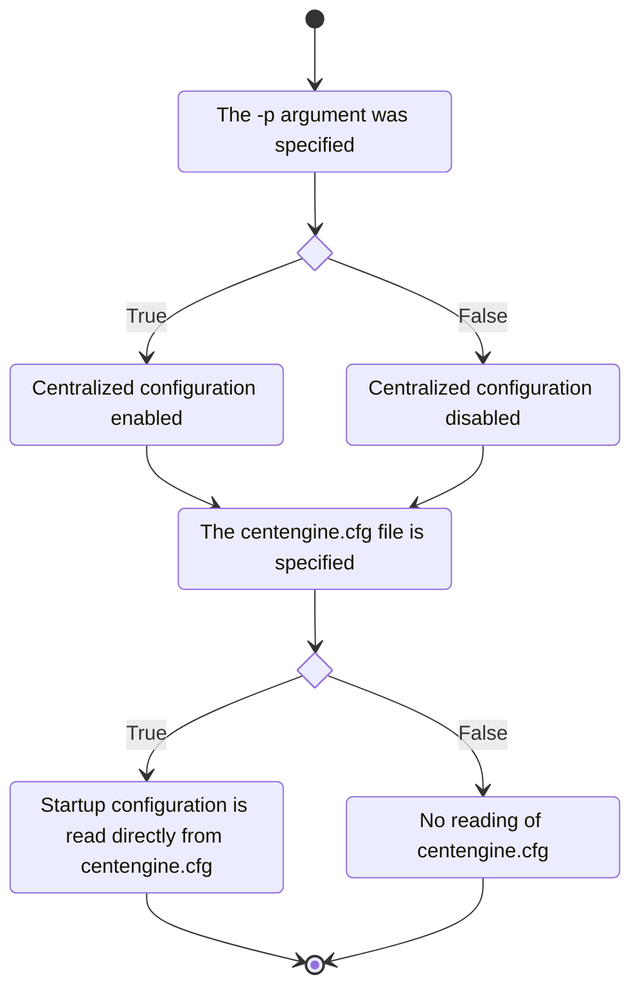
```mermaid
stateDiagram-v2
    State1: The -p argument was specified
    State2: The centengine.cfg file is specified
    Conclusion1: Centralized configuration enabled
    NotConclusion1: Centralized configuration disabled
    Conclusion2: Startup configuration is read directly from centengine.cfg
    NotConclusion2: No reading of centengine.cfg
    state if_state <<choice>>
    [*] --> State1
    State1 --> if_state
    if_state --> Conclusion1: True
    if_state --> NotConclusion1: False
    state if_state2 <<choice>>
    Conclusion1 --> State2
    NotConclusion1 --> State2
    State2 --> if_state2
    if_state2 --> Conclusion2: True
    if_state2 --> NotConclusion2: False
    Conclusion2 --> [*]
    NotConclusion2 --> [*]
```

## New parameters for Broker

`Broker` has two new parameters found in its configuration file:

- `cache_config_directory` - the PHP cache directory, i.e., the directory where the configuration sent by PHP is written.

- `pollers_config_directory` - the poller configuration directory that it will now maintain.

The first directory contains subdirectories whose names are integers representing the poller ID. Each of these directories contains the configuration of the `Engine` installed on it. At the same level as each of these directories, there is also an empty file named with the poller ID with a `.lck` extension, which is updated only once the concerned directory is updated.

An example directory for `cache_config_directory`:

* cache:
  * 1
    * centengine.cfg
    * services.cfg
    * etc...
  * 1.lck
  * 2
    * centengine.cfg
    * services.cfg
    * etc...
  * 2.lck

The principle is as follows: as soon as PHP finishes updating a directory for a poller, it touches the associated `lck` file. This file is monitored by `Broker` and as soon as it is notified, it takes into account the new configuration written in the directory.

For the second directory, `Broker` uses it to manage all poller configurations. This directory already contains all poller configurations in serialized Protobuf form.

As soon as the PHP cache directory is provided, `Broker` considers itself to be in the new generation.

An example of `pollers_config_directory`:

* pollers-configuration:
  * 1.prot
  * 2.prot

## The negotiation

We consider that the new capabilities implemented here only work with BBDO3.

The `Welcome` message gets a few additional parameters:

- `broker_name`,
- `extended_negociation`
- `peer_type`

If `cbmod` is configured with the new parameters, it fills these new fields.

The `Welcome` message is now defined as follows:

```
    message Welcome {
      Bbdo version = 1;
      string extensions = 2;
      uint64 poller_id = 3;
      string poller_name = 4;
      /* \Broker\ name is more relevant than poller name because for example on the
       * central, rrd broker, central broker and engine share the same poller name
       * that is 'Central'. */
      string broker_name = 5;
      com.centreon.common.PeerType peer_type = 6;
      bool extended_negotiation = 7;
      /* Engine configuration version sent by Engine so Broker is aware of it. */
      string engine_conf = 8;
    }
```

The `version` and `extensions` fields do not change. `poller_id` and `poller_name` still represent the poller ID and name. But on the Central, for example, there are three programs that share these two pieces of information. So to make the identification of the instance sending the message unique, we added `broker_name` (which also makes sense in the case of `Engine`).

`peer_type` is an enumerated type that can take the following values:

- ENGINE
- BROKER
- MAP
- UNKNOWN

Finally, `extended_negotiation` is a boolean that indicates whether the program can handle the new negotiation, so for an `Engine`, whether it knows about the Protobuf configuration directory, and for a `Broker`, whether it knows about the PHP cache directory.

Until now, when code was executed in `cbmod` or in `Broker`, we didn't have visibility on the running program, we didn't know if we were in a `Broker` or in an `Engine`. With this evolution, we can know. This is important since we want `Broker` to send the configuration to `Engine`.

In the bbdo stream, `Broker` stores information about its interlocutor; we already had `poller_name` and `poller_id`. We complete this information with `broker_name`, `peer_type`, the boolean `extended_negociation`, and the string `config_version` which for now contains the hash of the `Engine` configuration. In the near future, this information will probably evolve.

And in `configuration::applier::state` we also have this information for our instance.

To summarize, we have the `broker::config::applier::state` class which contains the following fields (partial content):

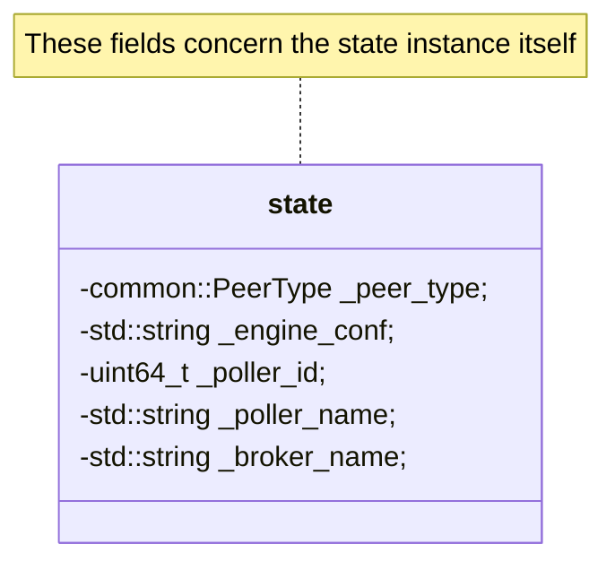
```mermaid
classDiagram
    note for state "These fields concern the state instance itself"
class state {
    -common::PeerType _peer_type;
    -std::string _engine_conf;
    -uint64_t _poller_id;
    -std::string _poller_name;
    -std::string _broker_name;
}
```

We also have the `broker::bbdo::stream` class which contains the following fields (partial content):

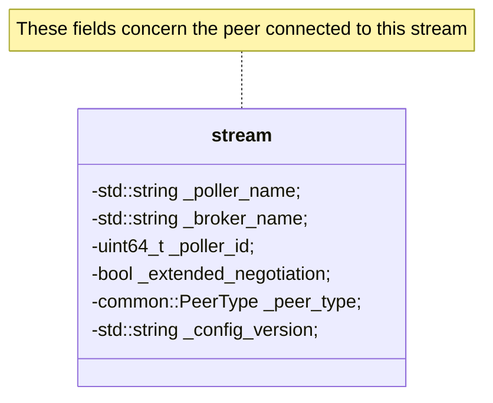
```mermaid
classDiagram
    note for stream "These fields concern the peer connected to this stream"
class stream {
    -std::string _poller_name;
    -std::string _broker_name;
    -uint64_t _poller_id;
    -bool _extended_negotiation;
    -common::PeerType _peer_type;
    -std::string _config_version;
}
```

At the negotiation level, the two important points are knowing whether extended negotiation is supported and in the case of an `Engine` connection, knowing which configuration version it knows. This is not the time to exchange the `Engine` configuration; there is potentially retention to clear before switching to sending it.

How does negotiation work? Two cases arise:

1. `Engine` initiates the connection.
2. `Broker` initiates the connection.

We consider here that `Engine` starts and connects to a `Broker` already running.

### New Broker functionality

`Broker` is configured with two new directories we already discussed:

- `cache_config_directory`
- `pollers-config`

We will focus on these two directories. The first contains subdirectories that are the numbers of pollers connected to this `Broker`. Next to each one, there is a file `XX.lck` where `XX` is the poller number. These `.lck` files are monitored for modifications by `Broker`.

As soon as PHP finishes filling one of these directories with the poller's configuration, i.e., a new subdirectory `<poller_ID>` is created, it creates next to it a file `<poller_ID>.lck`, `Broker` is directly notified.

In reality, `Broker` is not directly notified, as this would cost using a thread for that. So in reality, `Broker` executes a timer (every 5s) in its `config::applier::state` object. Every 5s,

1. It asks `inotify` if there have been modifications in the configuration cache directory. This request translates to a non-blocking file descriptor read. If there is nothing, the function returns immediately with no result.

2. In case of a positive response, it retrieves the file names `<poller ID>.lck` to deduce which configurations just arrived.

3. For each file of this form, it reads the configuration, creates a file `new-<poller ID>.prot` in the `pollers-config` directory.

4. Then in case there already existed a file `<poller ID>.prot` in this directory, it also creates a file `<diff-<poller ID.prot>`. If the file doesn't exist, the diff file is created but with the complete configuration.

5. `Broker` maintains the list of its interlocutors, so it also updates the item corresponding to the `Engine` with the correct poller ID to remember that it needs a new configuration.

6. These tasks are all executed by an independent thread; they should have only a limited impact on `Broker`'s operation.

Sending this difference is managed in the `bbdo` stream.

### Engine initiates the connection

`Engine` connects to `Broker` and sends the `Welcome` message. `Broker` is then informed whether the latest `Engine` configuration version is known by its interlocutor. It also knows if it supports the new negotiation. And it responds with a similar message.

Knowing that `Broker` listens to the PHP cache directory, when it has a new configuration available, it can send it.

An important point: `Broker` does not check the available `Engine` configuration version during negotiation. This is done as a background task. However, it stores in its information about the `Engine` peer its configuration version. Consequently, when a new version arrives, it can verify that the two are indeed different.

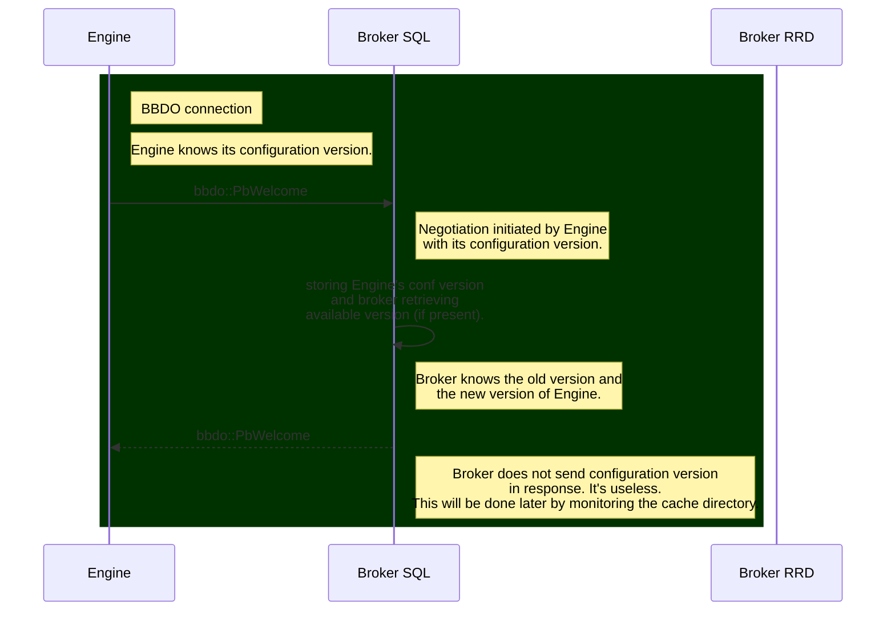
```mermaid
sequenceDiagram              
    participant E as Engine
    participant BS as Broker SQL
    participant BR as Broker RRD

    rect rgb(0, 50, 0)
    note right of E: BBDO connection
    note right of E: Engine knows its configuration version.
    E ->> BS: bbdo::PbWelcome
    note right of BS: Negotiation initiated by Engine<br/>with its configuration version.

    BS ->> BS: storing Engine's conf version<br/>and broker retrieving<br/>available version (if present).
    note right of BS: Broker knows the old version and<br/>the new version of Engine.
    BS -->> E: bbdo::PbWelcome
    note right of BS: Broker does not send configuration version<br/>in response. It's useless.<br/>This will be done later by monitoring the cache directory.
    end
```

### Broker initiates the connection

`Broker` connects to `Engine` and sends the `Welcome` message. `Engine` learns at this moment whether `Broker` supports the new negotiation or not. And it responds by sending the current configuration version.

In terms of diagram, we are on a very similar scheme to the previous one except that the questions/answers are reversed.

# Reading Engine configuration

## Configuration management on the Engine side

`Engine` is started with the new configuration. It reads the serialized Protobuf configuration available in its `HOME`. It then connects to `Broker` and sends the `Welcome` message with the correct configuration version number. We saw that `Broker` just responds by saying whether it supports centralized configuration or not. In a second step, Broker, as a background task, checks if new configurations are available for `Engine`. If one appears, it sends a message with the configuration difference. `cbmod` keeps it on hold and when `Engine` starts a new cycle in its main loop, it applies this configuration.

If there is retention, it is sent as a background task during application of the new configuration. Once retention is finished, `Engine` having applied the configuration, in case of a reload, sends an `InstanceConfiguration` message to `Broker` to tell it that it has received the configuration.

FIXME DBO: Is the `InstanceConfiguration` message still necessary?

But actually, there is a specific message for this, it's the `pb_diff_state_ack` message that is sent by `Engine` to `Broker` to tell it that it has received and applied the new configuration.

## Managing configuration sending by Broker to Engine

`Broker` uses `inotify` to monitor the PHP cache directory. After PHP finishes writing the poller *X* configuration in this directory, it creates next to directory *X*, a file `X.lck`. `Broker` monitors the creation/modification of any `*.lck` file in this directory. For this, a timer set to 5 seconds does a read on the `inotify` file descriptor. This timer is launched asynchronously and when a file is detected, `Broker` performs several tasks:

In addition to `inotify`, the timer also performs a directory scan on each trigger.
This fallback detects `.lck` files that `inotify` may have missed (for example when
multiple rapid `touch()` calls saturate the kernel event queue). Any `.lck` file
found during the scan but not reported by `inotify` is treated as a missed
configuration event.

1. It reads the configuration directory to make an `engine::State` structure.

2. It serializes in its `pollers-conf` directory this configuration in a file `new-X.prot`.

3. In case a file `X.prot` already exists, it also creates a file `diff-X.prot` which contains the difference between the two configurations.

4. In case the file `X.prot` doesn't exist, it also creates the file `diff-X.prot` but fills it with the complete configuration.

All these steps are done as a background task.

The BBDO stream in connection with poller *X* is configured on reading to also check if the connected `Engine` has a new version:

1. `Broker` has the list of its interlocutors, among them the `Engine`s with current configuration and new one if present. It knows therefore if a new configuration is available for the `Engine` opposite.

2. If this is the case, just after receiving an event from `Engine`, it sends the `DiffState` message with the difference between old and new configuration.

3. After sending the `DiffState`, and receiving an acknowledgement from `Engine`, `Broker` deletes the difference file.

4. This message is stored on the `cbmod` side by `Engine` and is applied as soon as possible in its main loop.

On the `Broker` side, speaking a bit more technically, reading the `Engine` configuration is done using the `engine_conf` library. Once read, the configuration is resolved so that all `host_id` and others are correctly filled.

This resolution code was originally in `Engine` but it was moved to the `engine_conf` library. If `Engine` must work as before, it also uses this library.

Monitoring using `inotify` is done within the `config::applier::state` class.

## Calculating the difference

`Broker` is notified of new `Engine` configuration versions.

The configuration is received by the `config::applier::state` instance of `Broker`.

It is interesting to keep a small time window to be able to mutualize changes from different pollers. For now, queries to `inotify` are made every 5 seconds; perhaps it will be necessary to increase this delay a bit or configure it differently. The advantage of doing this at regular intervals is that if several pollers are modified in parallel, `Broker` should be able to process them together.

In the previous step, we evolved the negotiation between `Engine` and `Broker` but overall the two work as before. Just, in a certain number of cases, we avoid `Engine` resending its configuration to Broker.

## Writing configuration to database

### Case study

Currently, even if negotiation has evolved, `Broker` continues to write the configuration drop by drop following what pollers send it.

### Implementation

The good solution seems to be:

1. From poller differentials recovered on a configuration change, we create a global differential. The advantage is to resolve inter-poller conflicts in advance.

2. `Broker` must learn to be less strict on database writes. For example, if a host is deleted and we still send data on it, knowing that the host is just disabled, we should still be able to write the data.

3. When the global differential is ready, we would no longer be forced to wait for an `Instance` to process it. That said, if a poller is three weeks behind, what would be the impact on data of sending almost at poller connection the new configuration?

An algorithm for grouping differentials could follow the following solution:

- For added objects, we can do the union. We will have all added objects. On each addition, we must check among deleted ones if the object is not already referenced. If it is, we can move it to modified objects.

- For modified objects (which don't change poller), we can also do the union.

- For a host moved from one poller to another, one differential will say the host is added while another will say it is deleted.

- For a deleted object, we must check if it is not already added, and if it is, it must be put in modified objects.

On the Protobuf side, we have two configuration objects which are `State` and `DiffState`. They are good because serializable but they have the problem of being very limited for searches.

We therefore introduce two new objects `IndexedState` and `IndexedDiffState` which store objects in hash tables. A `merge()` method is implemented in `IndexedDiffState` to merge several differentials.

The diagram assumes pollers are already connected to `Broker`:

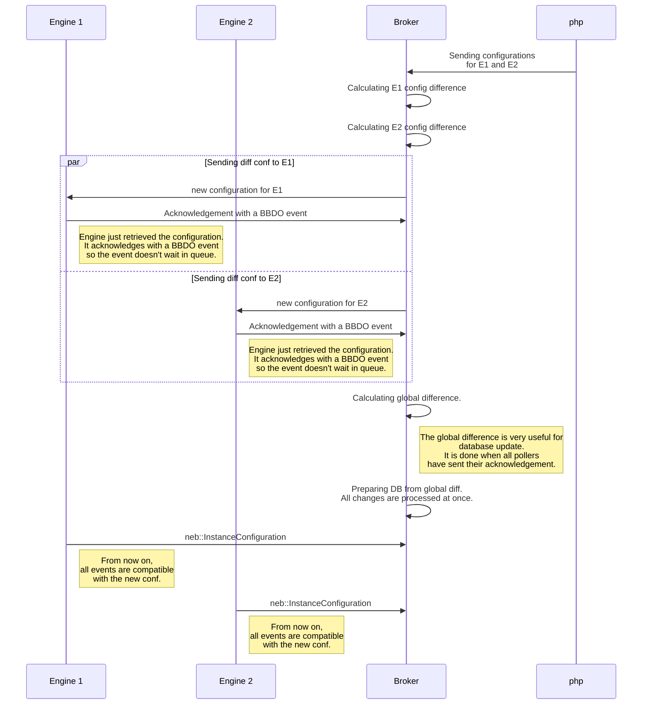
```mermaid
sequenceDiagram
  participant E1 as Engine 1
  participant E2 as Engine 2
  participant B as Broker
  participant php
  php ->> B: Sending configurations<br/>for E1 and E2
  B ->> B: Calculating E1 config difference
  B ->> B: Calculating E2 config difference
  par Sending diff conf to E1
    B ->> E1: new configuration for E1
    E1 ->> B: Acknowledgement with a BBDO event
    Note right of E1: Engine just retrieved the configuration.<br/> It acknowledges with a BBDO event<br/>so the event doesn't wait in queue.
  and Sending diff conf to E2
    B ->> E2: new configuration for E2
    E2 ->> B: Acknowledgement with a BBDO event
    Note right of E2: Engine just retrieved the configuration.<br/> It acknowledges with a BBDO event<br/>so the event doesn't wait in queue.
  end
  B ->> B: Calculating global difference.
  Note right of B: The global difference is very useful for<br/>database update.<br/>It is done when all pollers<br/> have sent their acknowledgement.
  B ->> B: Preparing DB from global diff.<br/>All changes are processed at once.
  E1 ->> B: neb::InstanceConfiguration
  Note right of E1: From now on,<br/> all events are compatible<br/> with the new conf.
  E2 ->> B: neb::InstanceConfiguration
  Note right of E2: From now on,<br/> all events are compatible<br/> with the new conf.
```

**Remarks.**

1. A point of vigilance: In case the second poller is very late, the arrival of the second `ConfigurationInstance` can really be delayed. If `Broker` waits for all `ConfigurationInstance` to update the base, it penalizes E1 data since the cache will take a long time before being updated.

2. Perhaps the global difference could be made on receiving acknowledgements. And timed with a timeout. For example from the first reception, Broker gives itself a 10s timeout, during this time span, as soon as it receives an acknowledgement, it enriches the global difference with the acknowledged configuration. When the timeout is finished, everything is sent to the database and cache.

3. A point of vigilance: we have assumed here that the configuration was coming from
   php. We also need to be able to recover if the configuration is already on the
   Engine side, including if it has been deleted on the Broker side.

For point 3., if Engine starts with a configuration already known by Broker, there is
no issue — the configuration is already in place. However, if an administrator has
deleted the configuration known by Engine from Broker's side, it would be good for
Engine to be able to send it to Broker to resolve the issue.

This case is handled as follows: during BBDO negotiation, if Broker finds neither an
`<ID>.prot` file nor an `<ID>.lck` file for a poller, it sends a
`DiffState{unknown=true}` to Engine. Engine detects this message and attempts to send
its current configuration to Broker. If `state.prot` exists, Engine sends it;
otherwise (first start, no configuration has been applied yet), Engine logs a warning
and sends nothing — the normal configuration flow (via `.lck` files) will take over.
In both cases, Engine immediately resets the `reloading` flag to `false` so that
subsequent diffs can be processed.

Broker receives the current `State`, then calls `create_prot_file()`. Before writing
`<ID>.prot`, Broker checks that no more recent configuration is already being
processed:

- if a `<ID>.lck` file exists in the PHP cache directory, PHP has just sent a new
  configuration; Broker lets the normal flow handle it;
- if a `new-<ID>.prot` file exists, the normal flow is already preparing the new
  configuration;
- if `<ID>.prot` already exists, the normal flow has already installed it.

In all three cases, Broker simply resets `conf_unknown` to `false` without
overwriting the file.

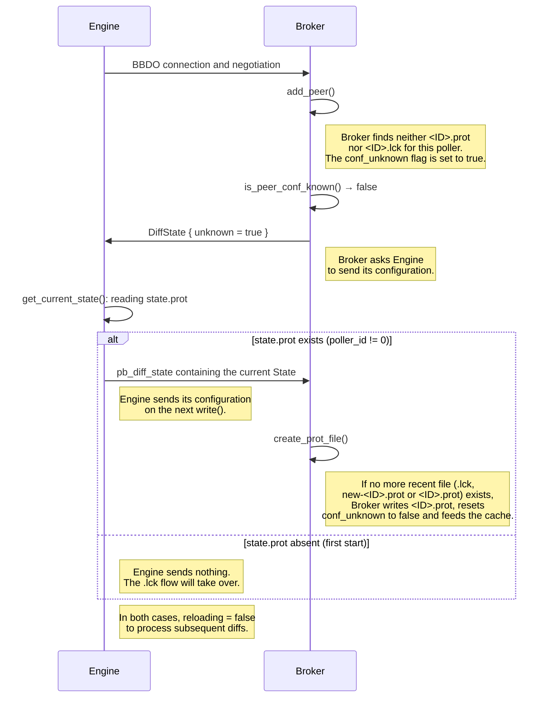
```mermaid
sequenceDiagram
    participant E as Engine
    participant B as Broker

    E ->> B: BBDO connection and negotiation
    B ->> B: add_peer()
    note right of B: Broker finds neither <ID>.prot<br/>nor <ID>.lck for this poller.<br/>The conf_unknown flag is set to true.
    B ->> B: is_peer_conf_known() → false
    B ->> E: DiffState { unknown = true }
    note right of B: Broker asks Engine<br/>to send its configuration.
    E ->> E: get_current_state(): reading state.prot
    alt state.prot exists (poller_id != 0)
        E ->> B: pb_diff_state containing the current State
        note right of E: Engine sends its configuration<br/>on the next write().
        B ->> B: create_prot_file()
        note right of B: If no more recent file (.lck,<br/>new-<ID>.prot or <ID>.prot) exists,<br/>Broker writes <ID>.prot, resets<br/>conf_unknown to false and feeds the cache.
    else state.prot absent (first start)
        note right of E: Engine sends nothing.<br/>The .lck flow will take over.
    end
    note right of E: In both cases, reloading = false<br/>to process subsequent diffs.
```

If `Engine` is restarted before sending this *event*, it will connect with the new configuration but `Broker` will still have work remnants to perform which can be problematic. To avoid this, we go through a new BBDO *event* (therefore managed outside the event stack); as soon as `Engine` reads the configuration, it emits this new *event* to inform `Broker` as soon as possible that it is taken into account. To apply the configuration on the database, `Broker` waits to have received all these acknowledgements.

Let's detail more the file management during configuration sending to better understand the issues we could encounter.


## Tricky cases

When there is retention, we have two cases that pose problems:

1. If the first poller is on time and the second has retention. In case a host is moved from the second to the first, Broker risks receiving data from the same host at the same time, coming from the two pollers, this until the second poller catches up with retention. In terms of dating, data arriving from the second poller will be older.

2. If the second poller has retention and before `Broker` receives its InstanceConfiguration, the user pushes a new configuration. It is possible in this case that `Engine` has already taken into account the penultimate configuration, and on the other hand that `Broker` is not yet informed and considers `Engine` is still on the previous configuration. Consequently, the differential newly calculated by `Broker` will be wrong.

The second tricky case should be resolved thanks to the introduction of the BBDO acknowledgement event.

We have a *flag* in `Broker` to specify if it is busy processing poller configuration or not. There are two portions of code concerned by this *flag*.

1. When the timer creates diff files, state files, etc. It's a whole moment where the *flag* is activated. So if the bbdo stream wants to access available configurations, access is refused and it goes on its way.

2. When the BBDO stream sends configuration to pollers. The timer no longer has access to configuration files, and the timer is just rescheduled for later waiting for the task to be finished. The BBDO stream, ideally, should disable the flag when all pollers have sent an acknowledgement.

Below is the illustration of situation 2 we want to avoid:


Thanks to the acknowledgement message, `Broker` will not read the new available configuration until it has received the acknowledgement from `Engine`. And once the acknowledgement is received, `Broker` knows that it is now this configuration that is in place (even if it is not yet completely effective due to retention). Consequently, when `Broker` reads the new configuration, it correctly calculates the differential with the correct configuration already in place.

There is a third worrying case concerning all cross-cutting objects. Let's consider Hostgroup for example. A poller whose certain hosts belong to Hostgroups, has a configuration declaring necessary Hostgroups with hosts it contains. The problem is that poller 1 only knows its hosts, and consequently the Hostgroups it has in definition also only know its hosts.

Let's take an example, we have hosts 1 and 2 on poller 1 and hosts 3 and 4 on poller 2. A Hostgroup contains all 4 hosts.

The configuration of poller 1 will therefore contain a declaration of the Hostgroup with only hosts 1 and 2 and the configuration of poller 2 will have another with hosts 3 and 4.

Let's now resume our centralized configuration, the configuration of poller 1 changes by removing hosts 1 and 2 from the Hostgroup. The config diff will simply delete the Hostgroup.

In case only poller 1 has configuration modifications, we end up with a diff that declares the deletion of the Hostgroup. This will be inserted in the global differential used to prepare the database. But we cannot delete the Hostgroup like that, it is still used by poller 2.

So for Hostgroups and Servicegroups, the differential system set up cannot apply.

The differential with Hostgroups, Servicegroups implemented like the others must be kept because it is used when sending the diff to the poller.

The problem is when gathering modifications on these objects for database writing and later for broker's global cache.

The neb::service object is more complete than a configuration::service configuration. So during initialization with a neb::service, we also have the service state, pending if nothing is given at the start. In case of a configuration::service, we find NULL in the status column of the `resources` table; which causes test cases that can fail for now and will need to be fixed.

## Cross-cutting objects

We have a Protobuf DiffState object which is distributed in an indexed_diff_state, which, as its name indicates, indexes container objects.

For GlobalDiffState, we currently have the same objects. Could we inherit from indexed_diff_state to add specificities.

Let's imagine the structure of global_indexed_diff_state. This class inherits from indexed_diff_state. Let's process the merge of a DiffState.

* Poller 1 sees the arrival of a new Hostgroup with hosts 6 and 7. Its diff contains an added Hostgroup with two members. Poller 2 sees the same new Hostgroup to which hosts 8 and 10 are added.

	* Current state: the first diff will complete the global diff state with a new hostgroup and its members. The second diff will also complete the global diff state with the same new one. Their contents are not merged, the second overwrites the first.
	* Evolution: We can keep the same added/modified/removed structure but the viewpoints of different pollers must not interfere, so it's best to index these changes by poller. At the global cache level, we have the current state of all Hostgroups and we can really apply changes.

## The necessity of centralized cache

Let's start with two scenarios:
1. Engine knows no configuration, it starts and connects to broker. Broker sends it the complete configuration.
   In this case, Broker also calculates the "global" difference that will allow registering this configuration in the `centreon_storage` database. And monitoring can start running.
2. Let's now imagine situation 1. but we stop `Engine`. Then we restart it. It reconnects to `Broker` and gives the configuration it knows.
   On its side, `Broker` has no new configuration so it sends nothing to `Engine`. So `Engine` acknowledges nothing. So the global diff contains nothing on this poller that just restarted. When `Engine` previously stopped, all its resources were disabled. But nothing allows reactivating them for now. So `Engine` connects, works normally, but on `Broker` side we see nothing.

The second case with the system we know works very well because `Engine` sends all its configuration and resources are reactivated one by one.

Let's resume the configuration exchange diagram.

We assume Broker is already running.

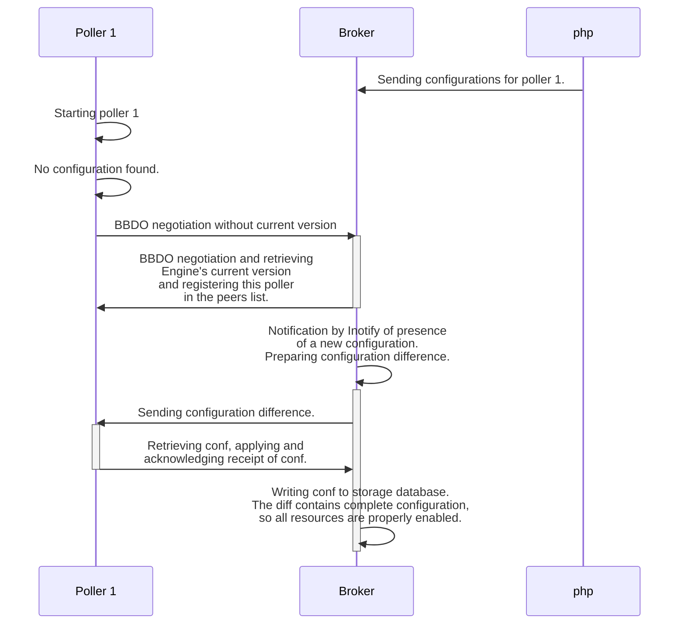
```mermaid
sequenceDiagram
    participant E as Poller 1
    participant B as Broker
    participant php
    php ->> B: Sending configurations for poller 1.
    E ->> E: Starting poller 1
    E ->> E: No configuration found.
    E ->> B: BBDO negotiation without current version
    activate B
    B ->> E: BBDO negotiation and retrieving<br/>Engine's current version<br/>and registering this poller<br/>in the peers list.
    deactivate B
    B ->> B: Notification by Inotify of presence<br/>of a new configuration.<br/>Preparing configuration difference.
    activate B
    B ->> E: Sending configuration difference.
    activate E
    E ->> B: Retrieving conf, applying and<br/>acknowledging receipt of conf.
    deactivate E
    B ->> B: Writing conf to storage database.<br/> The diff contains complete configuration,<br/>so all resources are properly enabled.
    deactivate B
```

Let's resume the previous case, but this time, `Engine` already knows the configuration.

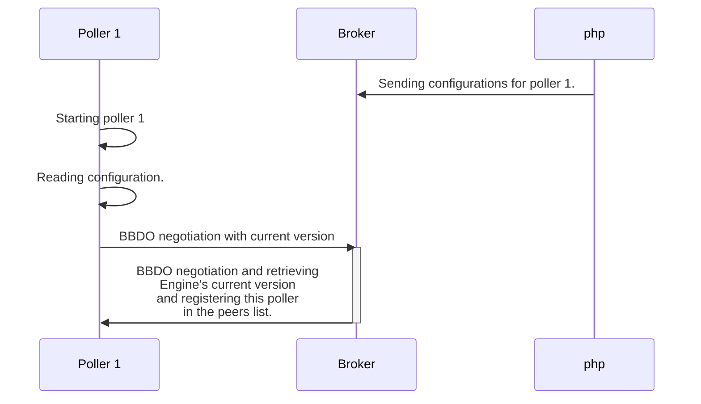
```mermaid
sequenceDiagram
    participant E as Poller 1
    participant B as Broker
    participant php
    php ->> B: Sending configurations for poller 1.
    E ->> E: Starting poller 1
    E ->> E: Reading configuration.
    E ->> B: BBDO negotiation with current version
    activate B
    B ->> E: BBDO negotiation and retrieving<br/>Engine's current version<br/>and registering this poller<br/>in the peers list.
    deactivate B
```
        
In this second case, there is no configuration sending, so no acknowledgement, so no database update.
The user is left in the dark, because resources are disabled and don't reactivate.

Just before starting monitoring, `Engine` sends an `Instance` message that could be used to reactivate resources.

But here, we face another problem. Deleted resources like disabled resources just have the `enabled` column at 0 in the `resources` table. So, we cannot distinguish between the two.

So if we set `enabled` to 1, all resources, including old ones, will be reactivated which is problematic.

`Broker` must absolutely keep a trace of resources on its side, which allows reactivating what is needed at these moments. We therefore need a cache on `Broker`.

## Some more technical points

When an Engine connects to Broker, the `config::applier::add_peer()` method is called. It works as follows:


```mermaid
stateDiagram-v2
    [*] --> config/applier/add_peer()
    config/applier/add_peer() --> peer_already_known?
    state if_state <<choice>>
    peer_already_known? --> if_state
    if_state --> peer_is_updated:True
    if_state --> peer_is_added:False
    state extended_nego <<choice>>
    peer_is_updated --> extended_nego
    peer_is_added --> extended_nego
    extended_nego --> [*]: !extended_negotiation || peer is not a Broker
    state if_watch_engine_timer_started <<choice>>
    extended_nego --> if_watch_engine_timer_started: extended_negotiation && peer is a Broker
    if_watch_engine_timer_started --> start_watch_engine_conf_timer(): engine conf timer not started
    start_watch_engine_conf_timer() --> prot_file_created_from_state
    if_watch_engine_timer_started --> prot_file_created_from_state: engine conf timer already started
    
    state if_existing_lck_file_for_current_poller_id <<choice>>
    prot_file_created_from_state --> if_existing_lck_file_for_current_poller_id
    if_existing_lck_file_for_current_poller_id --> keep_lck_file_in_memory: A .lck file exists for this poller ID
    if_existing_lck_file_for_current_poller_id --> [*]: No .lck file exists for this poller ID
    keep_lck_file_in_memory: Addition of the ID to the list to process
    keep_lck_file_in_memory --> [*]
```

This method memorizes the poller in its peers list. It starts the `Engine` configuration monitoring timer if negotiation is extended and the peer is an `Engine`. And it also checks if a `.lck` file already exists for the poller ID because `inotify` doesn't report files existing before it starts. If such a file is found, the poller ID is added to the list to process on the next timer tick.

Subsequently, the timer is executed as a background task and checks every 5s if a `.lck` file has been modified or created; in this case the list of `.lck` files is enriched then processed as a background task. Let's focus on this part.

The timer executes the `config::applier::state::_check_last_engine_conf()` method.

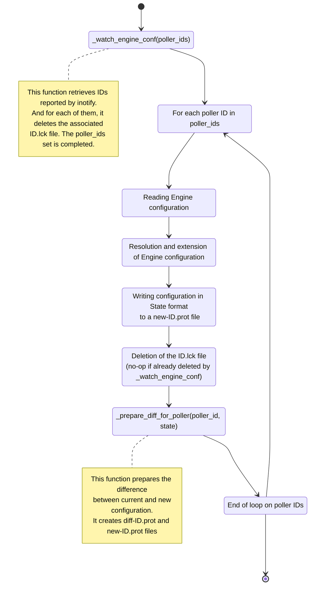
```mermaid
stateDiagram-v2
    [*] --> _watch_engine_conf(poller_ids)
    _watch_engine_conf(poller_ids) --> pour_chaque_poller_id
    note right of _watch_engine_conf(poller_ids): This function retrieves IDs reported by inotify.<br/>And for each of them, it deletes the associated<br/>ID.lck file. The poller_ids set is completed.
    lect_conf_engine: Reading Engine configuration
    pour_chaque_poller_id: For each poller ID in poller_ids
    pour_chaque_poller_id --> lect_conf_engine
    lect_conf_engine --> resolution_de_la_configuration_engine
    resolution_de_la_configuration_engine: Resolution and extension of Engine configuration
    resolution_de_la_configuration_engine --> ecriture_dans_fichier__new_ID_prot
    ecriture_dans_fichier__new_ID_prot: Writing configuration in State format<br/> to a new-ID.prot file
    ecriture_dans_fichier__new_ID_prot --> suppression_fichier_lck
    suppression_fichier_lck: Deletion of the ID.lck file<br/>(no-op if already deleted by _watch_engine_conf)
    suppression_fichier_lck --> preparation_de_la_difference
    preparation_de_la_difference: _prepare_diff_for_poller(poller_id, state)
    preparation_de_la_difference --> fin_pour_chaque_poller_id
    note right of preparation_de_la_difference: This function prepares the difference<br/> between current and new configuration.<br/>It creates diff-ID.prot and new-ID.prot files
    fin_pour_chaque_poller_id: End of loop on poller IDs
    fin_pour_chaque_poller_id --> pour_chaque_poller_id
    fin_pour_chaque_poller_id --> [*]
```

Let's detail a bit the behavior of the `config::applier::state::_prepare_diff_for_poller()` method.

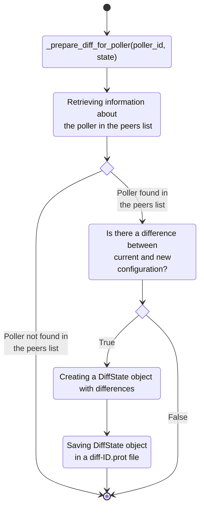
```mermaid
stateDiagram-v2
    prepare_diff_poller: _prepare_diff_for_poller(poller_id, state)
    [*] --> prepare_diff_poller
    recup_poller_in_peers: Retrieving information about<br/> the poller in the peers list
    state si_pas_trouve <<choice>>
    recup_poller_in_peers --> si_pas_trouve
    prepare_diff_poller --> recup_poller_in_peers
    si_pas_trouve --> [*]: Poller not found in<br/> the peers list
    comparaison: Is there a difference between<br/> current and new configuration?
    si_pas_trouve --> comparaison: Poller found in<br/> the peers list
    state si_differe <<choice>>
    comparaison --> si_differe
    create_diff: Creating a DiffState object with differences
    si_differe --> create_diff: True
    sauv_diff: Saving DiffState object<br/> in a diff-ID.prot file
    create_diff --> sauv_diff
    sauv_diff --> [*]
    si_differe --> [*]: False
```

Consequently, on the `state` side, Broker monitors `Engine` configurations and as soon as a new one is available, it calculates the difference and creates the `diff-ID.prot` and `new-ID.prot` files.

Each BBDO stream knows its interlocutor. If `Broker` is connected to `Engine`, a BBDO stream links them and `Broker` knows it is connected to an `Engine`, it knows its poller ID, if it supports centralized configuration, etc.

This stream regularly reads incoming events, this is how `Broker` receives monitoring. Reading is done by a `bbdo::stream::read()` method. It is in this method that certain actions like event acknowledgement are done. And it is also there that Broker detects if a new configuration is available for the connected poller. In case a configuration is available, it is then read and sent to `Engine`.

A simplified algorithm of this method is as follows:

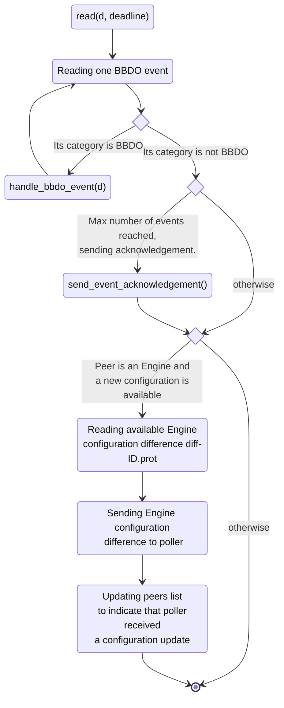
```mermaid
stateDiagram-v2
    read: read(d, deadline)
    read_one_event: Reading one BBDO event
    read --> read_one_event
    state if_bbdo_event <<choice>>
    read_one_event --> if_bbdo_event
    if_bbdo_event --> handle_bbdo_event(d): Its category is BBDO
    state if_ack_needed <<choice>>
    if_bbdo_event --> if_ack_needed: Its category is not BBDO
    handle_bbdo_event(d) --> read_one_event
    if_ack_needed --> send_event_acknowledgement(): Max number of events reached,<br/>sending acknowledgement.
    state if_peer_is_engine <<choice>>
    if_ack_needed --> if_peer_is_engine: otherwise
    send_event_acknowledgement() --> if_peer_is_engine
    read_conf: Reading available Engine<br/>configuration difference diff-ID.prot
    if_peer_is_engine --> read_conf: Peer is an Engine and<br/> a new configuration is available
    if_peer_is_engine --> [*]: otherwise
    send_conf: Sending Engine configuration<br/> difference to poller
    read_conf --> send_conf
    update_peers: Updating peers list<br/> to indicate that poller received<br/>a configuration update
    send_conf --> update_peers
    update_peers --> [*]
```

In this same `read()` method, we have a call to the `handle_bbdo_event()` method for events of BBDO category. It is in this method that we find among other things the processing of configuration acknowledgement by `Engine`.

When acknowledgement is received for a poller with ID poller_id, the peers list is updated to indicate that this poller is up to date. The `new-ID.prot` file replaces the `ID.prot` file.

Finally, when all pollers are up to date, a `com::centreon::engine::configuration::indexeed_diff_state` object is built by merging all poller differentials. This object is published by `Broker` to be processed by the `unifie_sql` stream.

The arrangement of these functions gives approximately the following diagram:

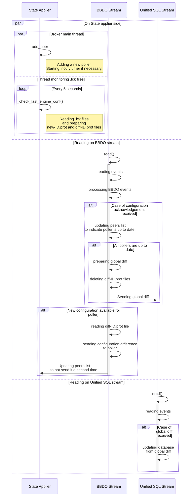
```mermaid
sequenceDiagram
participant S as State Applier
participant BBDO as BBDO Stream
participant USQL as Unified SQL Stream

par On State applier side
    par Broker main thread
    S ->> S: add_peer
    note right of S: Adding a new poller.<br/>Starting inotify timer if necessary.
    and Thread monitoring .lck files
        loop Every 5 seconds
            S ->> S: _check_last_engine_conf()
            note right of S: Reading .lck files<br/>and preparing<br/>new-ID.prot and diff-ID.prot files
        end
    end
and Reading on BBDO stream
    BBDO ->> BBDO: read()
    activate BBDO
    BBDO ->> BBDO: reading events
    BBDO ->> BBDO: processing BBDO events
    alt Case of configuration acknowledgement received
        BBDO ->> BBDO: updating peers list<br/>to indicate poller is up to date.
        alt All pollers are up to date
            BBDO ->> BBDO: preparing global diff
            BBDO ->> BBDO: deleting diff-ID.prot files
            BBDO ->> USQL: Sending global diff
        end
    end
    alt New configuration available for poller
    BBDO ->> BBDO: reading diff-ID.prot file
    BBDO ->> BBDO: sending configuration difference<br/>to poller
    BBDO ->> S: Updating peers list<br/>to not send it a second time.
    end
    deactivate BBDO
and Reading on Unified SQL stream    
    USQL ->> USQL: read()
    activate USQL
    USQL ->> USQL: reading events
    alt Case of global diff received
        USQL ->> USQL: updating database<br/>from global diff
    end
    deactivate USQL
end        
```

## Split of broker::config::applier::state

This `broker::config::applier::state` object is used by both `cbmod` and `broker`. It manages monitoring of `Engine` configuration files, calculating differences, etc.

Its behavior is a bit different depending on whether it is used by `cbmod` or by `broker`.

Keeping a single object for both forces us to keep attributes used by one and not by the other. The peers list, for example, has quite complicated management to handle both cases. The `_engine_conf` attribute, used only on the `cbmod` side, is also found in `broker` even though it serves no purpose there.

The `com::centreon::broker::config::applier::state` class is therefore split into three:

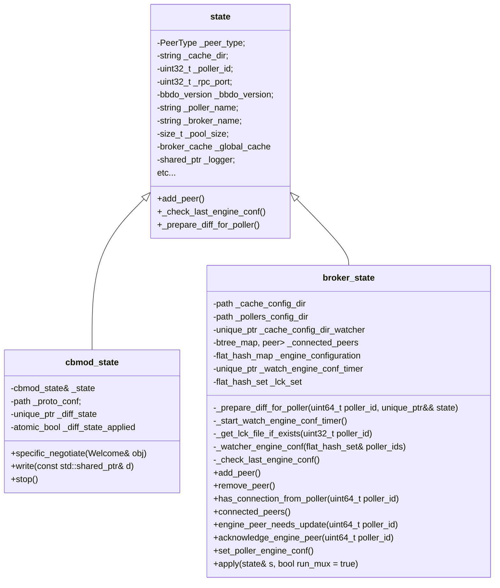
```mermaid
classDiagram
    class state {
        -PeerType _peer_type;
        -string _cache_dir;
        -uint32_t _poller_id;
        -uint32_t _rpc_port;
        -bbdo_version _bbdo_version;
        -string _poller_name;
        -string _broker_name;
        -size_t _pool_size;
        -broker_cache _global_cache
        -shared_ptr<spdlog::logger> _logger;

        +add_peer()
        +_check_last_engine_conf()
        +_prepare_diff_for_poller()
        etc...
    }
    class cbmod_state {
        -cbmod_state& _state
        -path _proto_conf;
        -unique_ptr<DiffState> _diff_state
        -atomic_bool _diff_state_applied
        +specific_negotiate(Welcome& obj)
        +write(const std::shared_ptr<io::data>& d)
        +stop()
    }
    class broker_state {
        -path _cache_config_dir
        -path _pollers_config_dir
        -unique_ptr<directory_watcher> _cache_config_dir_watcher
        -btree_map<tuple<uint64_t, string, string>, peer> _connected_peers
        -flat_hash_map<uint64_t, string> _engine_configuration
        -unique_ptr<steady_timer> _watch_engine_conf_timer
        -flat_hash_set<uint32_t> _lck_set
        -_prepare_diff_for_poller(uint64_t poller_id, unique_ptr<State>&& state)
        -_start_watch_engine_conf_timer()
        -_get_lck_file_if_exists(uint32_t poller_id)
        -_watcher_engine_conf(flat_hash_set<uint32_t>& poller_ids)
        -_check_last_engine_conf()
        +add_peer()
        +remove_peer()
        +has_connection_from_poller(uint64_t poller_id)
        +connected_peers()
        +engine_peer_needs_update(uint64_t poller_id)
        +acknowledge_engine_peer(uint64_t poller_id)
        +set_poller_engine_conf()
        +apply(state& s, bool run_mux = true)
    }
    state <|-- cbmod_state
    state <|-- broker_state
```

The split of `state` also implies splitting the `bbdo::stream` class.

There are `bbdo::stream` used by `cbmod` to connect to a `broker`, there are `bbdo::stream` used by `broker` to connect to an `engine`, and there are also `bbdo::stream` used by cache or *unprocessed* files.

To represent all this, it was necessary to split `bbdo::stream` into a base class `bbdo::basic_stream` then a pure virtual class `bbdo::stream` that inherits from `bbdo::basic_stream` and finally two concrete classes `bbdo::broker_stream` and `bbdo::cbmod_stream` that inherit from `bbdo::stream`.

Which gives the following structure:

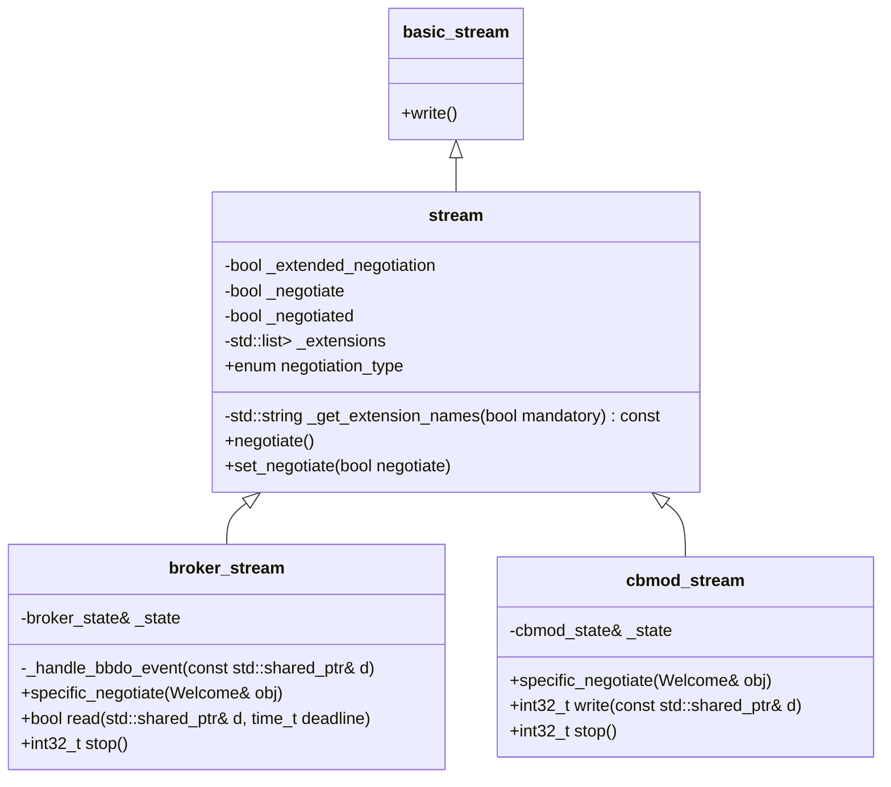
```mermaid
classDiagram
    class basic_stream {
        +write()
    }
    class stream {
        -bool _extended_negotiation
        -bool _negotiate
        -bool _negotiated
        -std::list<std::shared_ptr<io::extension>> _extensions
        -std::string _get_extension_names(bool mandatory) const
        +enum negotiation_type
        +negotiate()
        +set_negotiate(bool negotiate)
    }
    class broker_stream {
        -broker_state& _state
        -_handle_bbdo_event(const std::shared_ptr<io::data>& d)
        +specific_negotiate(Welcome& obj)
        +bool read(std::shared_ptr<io::data>& d, time_t deadline)
        +int32_t stop()
    }
    class cbmod_stream {
        -cbmod_state& _state
        +specific_negotiate(Welcome& obj)
        +int32_t write(const std::shared_ptr<io::data>& d)
        +int32_t stop()
    }
    basic_stream <|-- stream
    stream <|-- broker_stream
    stream <|-- cbmod_stream
```

# SQL/storage streams

These two streams have been deprecated in favor of the unified SQL stream. These streams do not work with BBDO 3
and are therefore unusable with centralized configuration.

It is therefore time to remove them, which will avoid issues with potential regressions.

Regarding *robot* tests, many are still based on these streams. Broker needs to start by default
with the unified SQL stream and the tests need to be adapted accordingly.

# Broker centralized cache

## Operating in centralized configuration

Since caches before introducing centralized cache stored `neb::services`, `neb::hosts`, the new cache will also contain these events. This imposes conversions from configuration, but given Lua's need, it's difficult to do otherwise.

The global cache, unlike the previous situation, is no longer updated by `neb::services` and others; it's essentially configuration that fills it then `service_status`, `host_status` for some updates.

This update is done in the multiplexer. When its *engine* receives events, it takes the opportunity to update the cache.

We also need to look at how configuration acts on the cache.

This diagram needs to be updated with cache update...

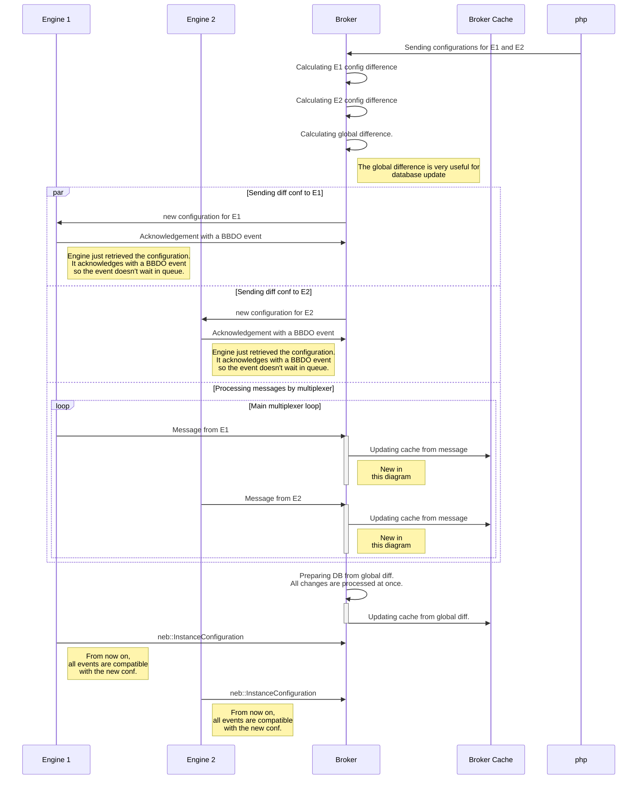
```mermaid
sequenceDiagram
    participant E1 as Engine 1
    participant E2 as Engine 2
    participant B as Broker
    participant C as Broker Cache
    participant php
    php ->> B: Sending configurations for E1 and E2
    B ->> B: Calculating E1 config difference
    B ->> B: Calculating E2 config difference
    B ->> B: Calculating global difference.
    Note right of B: The global difference is very useful for<br/>database update
    par Sending diff conf to E1
        B ->> E1: new configuration for E1
        E1 ->> B: Acknowledgement with a BBDO event
        Note right of E1: Engine just retrieved the configuration.<br/> It acknowledges with a BBDO event<br/>so the event doesn't wait in queue.
    and Sending diff conf to E2
        B ->> E2: new configuration for E2
        E2 ->> B: Acknowledgement with a BBDO event
        Note right of E2: Engine just retrieved the configuration.<br/> It acknowledges with a BBDO event<br/>so the event doesn't wait in queue.
    and Processing messages by multiplexer
        loop Main multiplexer loop
            E1 ->> B: Message from E1
            activate B
            B ->> C: Updating cache from message
            Note right of B: New in<br/>this diagram
            deactivate B
            E2 ->> B: Message from E2
            activate B
            B ->> C: Updating cache from message
            Note right of B: New in<br/>this diagram
            deactivate B
        end
    end
    
    B ->> B: Preparing DB from global diff.<br/>All changes are processed at once.
    activate B
    B ->> C: Updating cache from global diff.
    deactivate B
    E1 ->> B: neb::InstanceConfiguration
    Note right of E1: From now on,<br/> all events are compatible<br/> with the new conf.
    E2 ->> B: neb::InstanceConfiguration
    Note right of E2: From now on,<br/> all events are compatible<br/> with the new conf.
```

`Broker`'s behavior is adapted with the addition of centralized cache.

**Remarks.**

1. An interesting point is to see if we can apply a DiffState to the cache directly even before writing to database. This would simplify cache writing. However, this can pose problems when updating the database because it uses the cache a lot.

2. Otherwise, we can update the cache as database writing progresses. But what happens if one day the database is deleted?

In case cache update is done upstream of database writing, we get the following diagram:

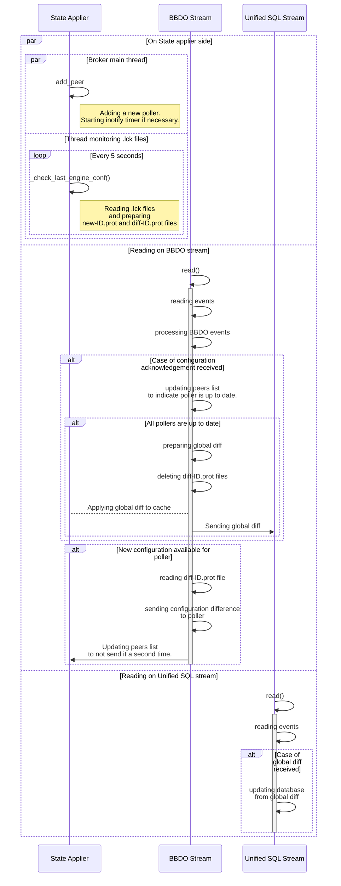
```mermaid
sequenceDiagram
    participant S as State Applier
    participant BBDO as BBDO Stream
    participant USQL as Unified SQL Stream

    par On State applier side
        par Broker main thread
            S ->> S: add_peer
            note right of S: Adding a new poller.<br/>Starting inotify timer if necessary.
        and Thread monitoring .lck files
            loop Every 5 seconds
                S ->> S: _check_last_engine_conf()
                note right of S: Reading .lck files<br/>and preparing<br/>new-ID.prot and diff-ID.prot files
            end
        end
    and Reading on BBDO stream
        BBDO ->> BBDO: read()
        activate BBDO
        BBDO ->> BBDO: reading events
        BBDO ->> BBDO: processing BBDO events
        alt Case of configuration acknowledgement received
            BBDO ->> BBDO: updating peers list<br/>to indicate poller is up to date.
            alt All pollers are up to date
                BBDO ->> BBDO: preparing global diff
                BBDO ->> BBDO: deleting diff-ID.prot files
                BBDO --> S: Applying global diff to cache
                BBDO ->> USQL: Sending global diff
            end
        end
        alt New configuration available for poller
            BBDO ->> BBDO: reading diff-ID.prot file
            BBDO ->> BBDO: sending configuration difference<br/>to poller
            BBDO ->> S: Updating peers list<br/>to not send it a second time.
        end
        deactivate BBDO
    and Reading on Unified SQL stream
        USQL ->> USQL: read()
        activate USQL
        USQL ->> USQL: reading events
        alt Case of global diff received
            USQL ->> USQL: updating database<br/>from global diff
        end
        deactivate USQL
    end        
```

## Host `poller_id` population in the cache

### The problem

In the protobuf `State` message (sent by Engine as a `pb_engine_state` event),
the `poller_id` field is set at the **message level** — i.e., `state.poller_id()`
is non-zero and identifies the poller. However, the individual `Host` objects
embedded in `state.hosts()` do **not** carry their own `poller_id` field: they
only have `host_id`, `host_name`, and other host-specific attributes. The same
applies to `DiffHost` objects inside `DiffState` messages.

This matters because `broker_cache` stores hosts in a `_hosts` multi-index
container, and the cached `Host` objects must have a valid `instance_id`
(= `poller_id`) in order for the group-link removal logic in `apply()` to work
correctly. When a servicegroup or hostgroup is removed from a poller, the code
iterates over all service/host-group links and erases only those whose host
belongs to the affected poller, using the comparison:

```
host->obj().instance_id() == sgp.poller_id()
```

If `instance_id` is 0 because the host was never given a valid `poller_id`,
this comparison always fails and no links are ever removed.

### The fix — two complementary changes

**1. `_fill_host()` accepts a `poller_id_hint`**

The private helper `broker_cache::_fill_host()` now takes an optional
`poller_id_hint` parameter. When `cfg.poller_id() == 0` (which is always the
case for hosts coming from a `pb_engine_state`), the hint is used instead:

```cpp
uint64_t pid = cfg.poller_id() != 0 ? cfg.poller_id() : poller_id_hint;
```

`merge()` passes `state.poller_id()` as the hint:

```cpp
_fill_host(&h->mut_obj(), host, state.poller_id());
```

**2. `indexed_diff_state::add_diff_state()` stamps hosts with `poller_id`**

Before the global diff is published, `add_diff_state()` aggregates all
per-poller diffs. In both the full-state path and the differential path, the
key-builder lambda for hosts now explicitly calls `obj->set_poller_id(poller_id)`
before returning the host key:

```cpp
// Full state path
_add_message<Host, uint64_t>(
    diff_state.mutable_state()->mutable_hosts(), ...,
    [poller_id = diff_state.poller_id()](Host* obj) {
      obj->set_poller_id(poller_id);   // stamp before key extraction
      return obj->host_id();
    });

// Differential path
_add_diff_message<DiffHost, Host, uint64_t>(
    diff_state.mutable_hosts(), ...,
    [poller_id = diff_state.poller_id()](Host* obj) {
      obj->set_poller_id(poller_id);   // stamp before key extraction
      return obj->host_id();
    });
```

This ensures that the `Host` objects stored in the global diff already carry
a valid `poller_id`, so `apply()` can call `_fill_host()` without a hint and
still produce correctly-populated cache entries.

### Why the global diff has no `poller_id`

Note that the **global** `DiffState` (the one sent as `pb_global_diff_state`)
intentionally has `poller_id == 0` at the message level, because it
aggregates changes from multiple pollers. Each individual host object inside
this global diff carries its own `poller_id` (set by the stamping above), so
the per-host association is preserved even though the message-level id is
absent.

## Operating in *legacy* mode

If centralized configuration is not enabled, the cache must replace the old
stream caches in a fairly similar manner. It won't be identical; we know that
with the new cache we may lose synchronization between a poller and the central
during configuration updates.

When an Engine starts, it sends its configuration to the Broker. The cache is thus
updated. However, if the broker is restarted, the cache is lost. The cache must
therefore be saved to disk when Broker stops so that it can
be reloaded identically when Broker restarts.

In the *legacy* case, we therefore obtain the following behavior:
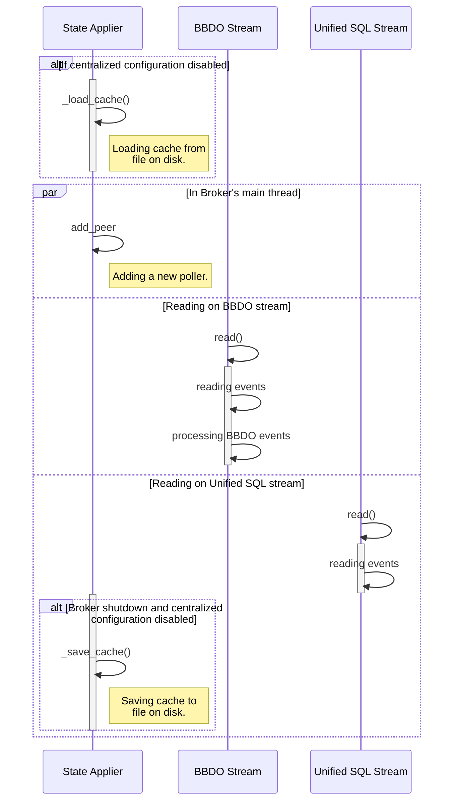
```mermaid
sequenceDiagram
    participant S as State Applier
    participant BBDO as BBDO Stream
    participant USQL as Unified SQL Stream

    alt If centralized configuration disabled
        activate S
        S ->> S: _load_cache()
        note right of S: Loading cache from<br/>file on disk.
        deactivate S
    end
    par In Broker's main thread
        S ->> S: add_peer
        note right of S: Adding a new poller.
    and Reading on BBDO stream
        BBDO ->> BBDO: read()
        activate BBDO
        BBDO ->> BBDO: reading events
        BBDO ->> BBDO: processing BBDO events
        deactivate BBDO
    and Reading on Unified SQL stream
        USQL ->> USQL: read()
        activate USQL
        USQL ->> USQL: reading events
        deactivate USQL
        activate S
        alt Broker shutdown and centralized configuration disabled
            S ->> S: _save_cache()
            note right of S: Saving cache to<br/>file on disk.
        end
        deactivate S
    end
```

A point of attention regarding legacy mode and possibly also in centralized configuration concerns
index mappings and metric mappings. These two objects are stored very comprehensively in
the `unified_sql` cache. They are obtained largely through an SQL query made during stream
startup.

When other streams use these two pieces of information, they only use a small portion of them.

Several points:

* There's no need to save this information in the cache file since it's retrieved at startup and
will be much more up-to-date. Especially since PHP can also write to it directly.
* This also means that the cache, even though it's largely updated by the configuration and by
engine sends, is also updated by SQL queries made at `unified_sql` startup and for now it
seems difficult to do without them.
* The simplest approach is to update metrics and `index_mapping` only by going through `unified_sql`. And the cache
doesn't need to make SQL queries to retrieve them.

Outside of `unified_sql`, the only stream using `index_mapping` is the lua stream.
Usually, this stream is on the central broker so it does have access to the data.
However, the day we want to move the lua stream to a remote broker, `index_mapping` is no longer
available.

## Possible evolutions

Rather than accessing the cache in write mode from `unified_sql`, we could go through the multiplexer.
The `index_mapping` could be transmitted to neighboring brokers. That would already solve the lua stream issue.
A second evolution would be for the cache to become a broker module. This cache could be hosted by a broker
and neighboring brokers could access it in read/write mode via BBDO messages. This solution is
particularly interesting with the broker cluster.

# Retention

## Current problem

When an Engine is disconnected for a long period (e.g. one week), it accumulates
retention data. Upon reconnection, Broker receives this data in the order Engine
emitted it — oldest first. Throughout the entire transmission of the retention
data, current data is not visible.

This behaviour raises two distinct problems:

1. **Visibility**: current data (real-time monitoring state) only reaches Broker
   once all retention data has been transmitted.
2. **RRD writing**: RRD requires data to be inserted in strictly chronological
   order. Any value older than the last written timestamp is silently rejected.
   It is therefore impossible to insert past data once recent data has been
   written.

## Proposed architecture

### Overview

The central idea is to split the data stream into two channels as soon as Engine
reconnects:

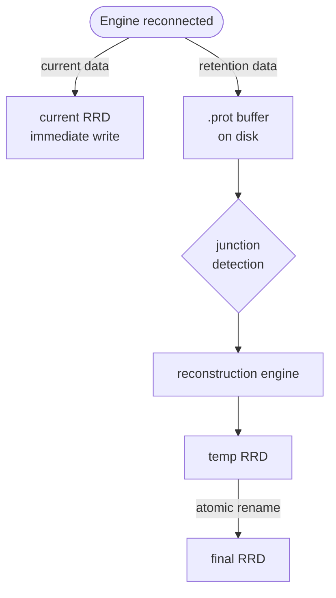
```mermaid
flowchart TD
    E([Engine reconnected])
    E -->|current data| RRD[current RRD\nimmediate write]
    E -->|retention data| BUF[.prot buffer\non disk]
    BUF --> J{junction\ndetection}
    J --> MR[reconstruction engine]
    MR --> TMP[temp RRD]
    TMP -->|atomic rename| RRD2[final RRD]
```

Current data is written immediately to the live RRD, guaranteeing visibility
without delay. Retention data is stored in an intermediate buffer (memory-first,
spilling to disk if needed) and merged in later.

### Phase 1: Reconnection


```mermaid
gantt
    dateFormat X
    axisFormat %s
    section Current RRD
        normal data      : 0, 10
        empty (gap)      : crit, 10, 20
        current data     : 20, 30
    section .prot buffer
        buffered retention data : active, 10, 20
```

- The current RRD contains data from before the disconnection and current data
  (after reconnection). The disconnection period remains a gap in the RRD.
- The `.prot` buffer accumulates data from the disconnection period as Engine
  retransmits it.

### Phase 2: Junction detection

The junction is reached when the last data point in the buffer and the first
post-reconnection data point in the current RRD are at most one step apart
(configurable, default 5 minutes):

```mermaid
gantt
    dateFormat X
    axisFormat %s
    section .prot buffer
        retention data   : 10, 19
    section Current RRD
        current data     : 20, 30
    section Junction
        gap ≤ step       : milestone, 19, 20
```

This condition is reliable because the step is statically known for each metric.

### Phase 3: Merge via the reconstruction engine

Once the junction is detected (or on an external trigger), the reconstruction
engine produces a new complete RRD file:

```mermaid
flowchart LR
    BUF[".prot files\n(chrono sort)"]
    RRD["current RRD\n(rrd_fetch)"]
    MS["external merge-sort\n(bounded memory)"]
    TMP[temp RRD]
    OUT[final RRD]

    BUF -->|stream| MS
    RRD -->|stream| MS
    MS --> TMP
    TMP -->|atomic rename| OUT
```

The external merge-sort guarantees bounded memory consumption regardless of the
amount of buffered data: each source is read sequentially; only the head of each
stream is in memory at any given time.

## Buffer format

### `.prot` files

The buffer uses *length-delimited* protobuf messages written in *append* mode.
`storage::pb_metric` and `storage::pb_status` events received by the RRD module
are large; before being stored in the buffer they are converted into compact
protobuf messages defined in a file internal to the RRD module
(`broker/rrd/proto/rrd_retention.proto`) — this format is never transmitted over
the network:

```protobuf
message MetricRetentionPoint {
  uint64 time  = 1;
  double value = 2;
}

message StatusRetentionPoint {
  uint64 time   = 1;
  uint32 status = 2;
}
```

The `retention_buffer` creates **one `.prot` file per metric and per status**:

- `metric_<metric_id>.prot` for metrics
- `status_<index_id>.prot` for statuses

Each file is append-only and naturally sorted by time. This per-identifier
organisation is essential for the merge (Step 4): at the junction of metric X,
only the rotation files for X are opened, without scanning unrelated data. With
a memory-first buffer, files are not all open simultaneously, making the file
count (on the order of the number of metrics) perfectly manageable.

Files are organised with rotation on configurable size:

```
retention_buffer/
  metric_42_0001.prot    ← closed, awaiting merge
  metric_42_0002.prot    ← closed, awaiting merge
  metric_42_0003.prot    ← current write file
```

A file is **immutable** once rotated: it can be read as a stream during the merge
without locking. After a successful merge, the corresponding `.prot` files are
deleted.

### Merge triggers

| Trigger | Description |
|---|---|
| Junction detected | Buffer has caught up with the current RRD (gap ≤ step) |
| Buffer size | Buffer exceeds N MB (configurable) |
| Schedule | Low-load nightly merge |
| Manual | Explicit administration command |

## Multiple disconnections

If an Engine disconnects several times, gaps accumulate in the buffer without
creating extra files: the buffer accepts all gaps in the same
`(metric_id, timestamp, value)` structure, regardless of how many there are.

```mermaid
gantt
    dateFormat X
    axisFormat %s
    section Current RRD
        active : 0,  5
        active : 10, 15
        active : 20, 25
        active : 30, 35
    section .prot buffer
        gap 1  : active, 5,  10
        gap 2  : active, 15, 20
        gap 3  : active, 25, 30
```

The merge remains a single operation: all data in the buffer (all gaps combined)
is merged with the current RRD in a single pass.

## Integration with the existing rebuild

The current RRD rebuild and the retention merge are structurally identical: both
create a temporary RRD, write in chronological order from multiple sources, then
perform an atomic rename. They therefore share the same **reconstruction engine**:

```mermaid
flowchart LR
    T1([Manual rebuild])
    T2([Retention junction])
    T3([Nightly schedule])
    S1[historical DB]
    S2[.prot files]
    S3[current RRD]
    MS[merge-sort]
    TMP[temp RRD]
    OUT[final RRD]

    T1 & T2 & T3 --> MS
    S1 & S2 & S3 -->|stream| MS
    MS --> TMP -->|atomic rename| OUT
```

Practical consequence: a manually triggered rebuild **automatically absorbs** the
pending `.prot` files for the affected metrics. There is no separate code path to
maintain.

## Edge cases

### Retention exceeded

If the disconnection period exceeds the RRD archive duration (e.g. 3-month
disconnection for a 1-month RRD), the junction can never be reached. In that case:

- There is no point storing data that is too old; it is discarded immediately.
- When the buffer is merged, a few data points may fall outside the RRD window
  (they will be ignored by RRD but do not cause errors).
- The `.prot` files are deleted after the merge, whether complete or partial.

### Broker crash during merge

The atomic rename guarantees that a crash during the merge leaves the system in a
consistent state: either the old RRD is intact, or the new one is in place. The
`.prot` files are only deleted after a successful rename.

### Broker crash during buffering

If Broker crashes while retention data is being buffered (outside of a merge),
the `.prot` files are on disk but the in-memory state is lost. Full reconstruction
is possible without any separate metadata file.

| Lost state | Reconstruction source |
|---|---|
| `last_retention_time[id]` | last record of the metric's last `.prot` file |
| `earliest_current_time[id]` | no need to recover — reset when first current data point arrives |
| `last_partial_merge[id]` | first record of the metric's oldest `.prot` file − 1 step |

**Potentially truncated current file**

A crash mid-write may leave the current file with an incomplete trailing protobuf
message. On startup, Broker repairs each current file: it reads it sequentially
up to the last *complete* message (the length-delimited format makes truncation
detectable) then truncates the file at that offset. Rotated files are always
intact by definition (immutable once rotated).

**Startup algorithm**

```
for each metric that has .prot files:
  1. repair the current file if needed (truncate to last valid message)
  2. read the last record → last_retention_time
  3. last_partial_merge = first record of oldest file − step
  4. check the junction condition immediately
     (may have been reached before the crash)
```

`earliest_current_time` is reset to "unknown"; junction detection resumes
naturally as soon as the first current data point arrives.

**In-memory data not yet flushed to disk**

Because the buffer is memory-first, data received but not yet written to disk at
the time of the crash is permanently lost. This data is retention data — already
in the past — whose absence slightly widens the gap in the graph without affecting
real-time monitoring. This trade-off is acceptable: a synchronous flush after each
record would be too costly, and a periodic flush would add complexity for a
marginal benefit on data that is offline by definition.

## Concurrency

The `retention_buffer` is accessed from two concurrent paths:

- **Write path**: data reception from `output::write()` (muxer thread)
- **Merge path**: reading `.prot` files and reconstructing the RRD (Asio thread
  via `asio::post`)

The fundamental property that simplifies synchronisation is that **rotated files
are immutable**: the write path always writes to the *current* file for a metric,
while the merge path always reads *rotated* files. These two operations never
contend for the same file — except at rotation time.

**Model: per-metric mutex**

```cpp
struct MetricRetentionState {
  absl::Mutex           mutex;
  int                   current_fd;
  uint64_t              last_retention_time;
  uint64_t              earliest_current_time;
  uint64_t              last_partial_merge;
  std::vector<fs::path> rotated_files;  // immutable, readable without lock
};
```

- **Write path**: acquires the mutex, appends to `current_fd`, updates timestamps,
  checks the junction condition, releases. Critical section: a few microseconds.
- **Merge trigger**: acquires the mutex, performs rotation (closes `current_fd`,
  adds it to `rotated_files`, opens a new file), releases immediately. Then reads
  `rotated_files` **without holding the lock** (immutable). The critical section
  is limited to the rotation, not the duration of the merge.
- **After merge**: acquires the mutex, updates `last_partial_merge`, deletes the
  merged files, releases.

Lock contention is therefore limited to a few microseconds per rotation. The merge
itself (potentially several seconds for large files) runs entirely without any lock.

## Migration plan

The transformation of the current RRD module into this new architecture is carried
out in four sequential steps, summarised in the following diagram:

```mermaid
flowchart LR
    E1["Step 1\nretention_buffer component\n(.prot files)"]
    E2["Step 2\nBifurcation in output.cc\n(current / retention)"]
    E3["Step 3\nJunction detection\n(Asio timer)"]
    E4["Step 4\nUnified reconstruction\nengine"]

    E1 --> E2
    E2 --> E3
    E3 --> E4
```

No protocol change is required: Broker determines itself whether a data point is
retention by comparing its timestamp to `now - step`. If the timestamp is older
than this threshold (configurable), the data point is treated as retention and
routed to the buffer; otherwise it goes directly to the RRD.

### Step 1 — `retention_buffer` component

Create a new component `broker/rrd/src/retention_buffer.cc` (+ `.hh`) responsible
for:

- Receiving `MetricRetentionPoint` / `StatusRetentionPoint` messages and
  serialising them into the corresponding `.prot` files (rotation on configurable
  size or duration).
- Keeping in memory the latest timestamp received per `metric_id` (and per
  `index_id` for statuses) to enable junction detection.
- Immediately discarding any point older than `rrd_len` to avoid growing buffers
  unnecessarily.

This component can be developed and tested independently with synthetic data.

### Step 2 — Bifurcation in `output.cc`

Modify the `write()` method of the RRD module to route based on the age of the
data point. For `storage::pb_metric` and `storage::pb_status`:

- `timestamp ≥ now - step` → current path: write directly to the RRD file.
  In parallel, record `earliest_current_time[id]` = first current timestamp
  received for this identifier since (re)connection.
- `timestamp < now - step` → convert to `MetricRetentionPoint` or
  `StatusRetentionPoint` and delegate to the `retention_buffer`.

Requires Step 1.

### Step 3 — Junction detection

Detection is **event-driven**: the check is performed inside `write()` on every
incoming data point, in O(1) via an `unordered_map` lookup. No periodic scan of
all metrics is needed.

Monitoring does not stop during downtimes: data is collected every 5 minutes
without interruption. Consequently, a large gap between two consecutive timestamps
in the retention stream (> 2 × `step`) is a reliable signal: it marks the
boundary between two distinct disconnection periods. This is the natural moment to
check the junction condition for the batch that has just ended.

The junction is reached as soon as one of these two conditions is true:

| Condition | Trigger |
|---|---|
| `last_retention[id] + step ≥ earliest_current[id]` | arrival of a current or retention data point for `id` |
| `last_retention[id] + step ≥ now` | arrival of a retention data point (no current data known yet) |

A third trigger covers batch endings: when a retention data point shows a gap
`timestamp − last_retention[id] > 2 × step`, the previous batch is finished; the
conditions above are checked immediately against `last_retention[id]` before
updating the value.

#### Progressive partial merge

When the retention backlog is large (disconnection of several days or weeks),
waiting for the full junction before triggering the merge means the user sees no
graph reconstruction during the entire catch-up period.

To address this, a **partial merge** is triggered as soon as the buffer for a
metric covers a complete slice of configurable duration (default: 1 day) since the
last merge (or since the start of buffering). Each processed slice produces a valid
RRD immediately visible; the user sees the graph rebuild day by day as data is
received.

This trigger is handled by the same event-driven mechanism: on each incoming
retention data point, check whether
`last_retention[id] − last_partial_merge[id] ≥ partial_merge_interval`.

The reconstruction engine (Step 4) must therefore support partial merges: merging
only the `.prot` files covering the slice
`[last_partial_merge[id], last_partial_merge[id] + partial_merge_interval]`
without waiting for the complete buffer to be available.

When a junction or partial merge is detected, the merge is triggered asynchronously
via `asio::post` so as not to block the write path.

A low-frequency cleanup timer (default: 5 min) handles only **orphan buffers**:
metrics whose retention is present but for which no current data will ever arrive
(host deleted, metric disabled…). Its role is to free resources, not to detect
junctions.

Requires Step 2.

### Step 4 — Unified reconstruction engine

Extend the existing RRD rebuild mechanism (START / DATA / END sequence) to accept
as input either:

- A manually triggered rebuild (current behaviour), or
- The result of a detected junction (Step 3).

In both cases, the engine:

1. Reads the relevant `.prot` files in chronological order (external merge-sort
   with bounded memory).
2. Merges with the data already in the current RRD via `rrd_fetch`.
3. Writes a new temporary RRD file in strictly increasing order.
4. Atomically substitutes the new RRD for the old one via `rename(2)`.
5. Deletes the merged `.prot` files.

The existing manual rebuild code path becomes a special case of this engine: no
visible change for users who trigger a rebuild via the interface.

# Poller HA
## Poller configuration tree
Without talking about HA, we have the following structure:
* engine:
	* 1/ poller 1 configuration
	* 1.lck file saying that broker can retrieve configuration

Here number 1 represents the poller ID.

Currently, with centralized configuration:

* creation of new-1.prot file with configuration inside
* Creation of diff-1.prot which contains the difference with previous configuration.
* Sending diff-1 to poller 1.
* On acknowledgement from poller 1, we move to next steps:
* Updating global configuration for broker cache
* updating global difference, if several configurations are received simultaneously, to be able to update the STORAGE database.

The next step is to replace poller 1 with zone 1.

* creation of new-1.prot file with configuration inside
* Creation of diff-1.prot which contains the difference with previous configuration.

By moving to HA configuration, this ID will represent a zone ID (poller group).
The change is at the next step. diff-1.prot contains a difference concerning zone 1. So it describes several pollers at the same time.

1.prot contains current configuration. It is not aware of host/poller association.
new-1.prot must be created this way:
* reading configuration
* resolving configuration
* difference calculation doesn't change.
* we can process by poller, deleted or modified objects.
* in a second step, we can process added objects, to be done globally on the entire zone.
* After this last step, we get diff-1.prot, diff-2.prot, ...

## Engine configuration files
There is a new file which is pollers.cfg. It must contain the following fields for each poller:
```
define poller {
  poller_id    1
  poller_name  titus
  address      192.168.1.18
  hosts        list of hosts essential to each poller
}
```

When broker creates the first prot file, which is now called new-zone1.prot, it's a new Zone message that contains the same fields as State with in addition:
* zone_id
* a list of Pollers, each with the fields defined above.

We redefine all fields of the Zone message, it doesn't directly contain the State message, this to keep flexibility.

Conclusion: we no longer define 1.prot and new-1.prot but zone1.prot and new-zon1.prot. They are no longer dumps of the State message but dumps of Zone.

The next step is creating diff-1.prot

## List of peers
com::centreon::broker::config::applier::state contains the list of peers connected to broker.

It must be completed with poller occupation and supported load. This load is not directly configurable but calculated by broker as it operates.

We must maintain the list of hosts associated with pollers on the broker side. At the next restart, allocations are therefore not recalculated.

Load calculation quite problematic.

## unified_sql
instance_id will become zone_id in resources and hosts.

# Tickets
## First tickets
### Internal health check in Engine with reporting to Broker
Engine retrieves its CPU, MEM occupation, check latency to send a Health message to Broker:
```
message Health {
  uint32 poller_id = 1;
  float cpu = 2; // number between 0 and 1
  float mem = 3; // number between 0 and 1
  float latency = 4;
}
```
This message format gives a goal but should not be taken as final. A study is necessary on useful information for distribution.

A classic system is to weight different indicators to calculate an overall load.
To achieve this, it's good that all parameters are between 0 and 1.
For cpu and memory, the message already contains information at the right scale.
For latency, we must define a threshold beyond which we consider the poller is overloaded. For example, if latency is greater than 10s, we consider the poller is overloaded.

We can now calculate the poller's overall load with the following formula:
C=alpha * cpu + beta * mem + gamma * latency / latency_max with alpha + beta + gamma = 1.

If we find another interesting parameter, we can always add it to the formula and rebalance weights.

A more thorough study could allow us to determine optimal weights for each poller. But empirically, we can start with alpha = 0.4, beta = 0.2 and gamma = 0.4. It seems that cpu and latency have a more important impact than memory hence these parameters.

Once we have this load, we can define a limit load interval. For example, from 60% to 80%; the advantage of having an interval is to be able to work with hysteresis.

* When we want to increase a poller's load, we allow ourselves to do so as long as load is below 60%.
* we consider a poller too loaded when it exceeds 80%.
* When it is too loaded (load > 80%), we try to reduce its load so it goes back below 60%.

The [60%;80%] interval must be configurable.

When a poller is too loaded (so load > 80%), we must remove hosts from it so it goes back below 60%.
The 60% is a target, it's difficult to know exactly the number of hosts to remove to reach it. So the goal is to end up in the interval.

So we have some configuration parameters to define:
* maximum latency (for example 10 seconds)
* CPU, memory and latency load weights (configurable)
* load interval between 60% and 80% (configurable)

### About diff calculation

Broker receives zone configurations, which gives new-zone-1.prot, new-zone-2.prot, ...
These zones are already running and their configuration is in zone-1.prot, zone-2.prot, ...

We then calculate diff-zone-1.prot, diff-zone-2.prot, ...

If zone 1 contains pollers 1, 2 and 3.

The goal would be to distribute modifications on each poller according to its load. And we would use the same machinery as when monitoring pollers.

### Study on distribution mechanism
What load to report to broker and how should Broker adapt distribution to these loads?
It's especially the second part of the question that interests us.

### Introduction of Zone and DiffZone messages
Initial configuration calculation by broker is no longer State/DiffState but Zone / DiffZone.

The Zone is a message very similar to State, it contains the configuration of zone pollers, for now we consider that all pollers are configured the same way. And perhaps this will evolve over time.
The zone carries all hosts/services to be managed by the pollers it contains. However, unlike State, the Zone contains a list of pollers. If global parameters defined at Zone level must be differentiated by poller, we can move them from zone to pollers (at message definition level).

The content of centengine.cfg is a first draft of configuration for the zone. But we must add an array per poller since there are already specific hosts for each.
We can also imagine different log levels per poller.
However, minimum check duration must be shared across the entire zone.

It remains to determine which fields to move per poller.

13 points.

## Multiple tickets in parallel

### Preparing unified_sql
The goal is to write configuration prepared by broker in one go in centreon_storage.

21 points.

### Centralized cache
All streams must access the same cache which comes largely from configuration.

It is composed of two parts:
* configuration
* real-time and other (inheritance from current broker caches)

We must inventory currently used caches. And then we produce a global cache to feed the whole.

We have the global engine configuration which is enriched as configurations are sent on the broker side.
The cache is separate and points to this global configuration.
By doing this, on the Engine side, cbmod also has its cache which this time points to the Engine configuration in globals.cc.
Feeding is templated because done either by Zone or by State.

Possibility to split:
1. we make the new cache. Still quite heavy but reasonable.
2. progressively migrate other caches to it. Migrations can be done in parallel (influxdb, graphite, VictoriaMetrics, Lua, rrd, unified_sql).
3. A ticket already exists to remove sql and storage outputs.

### The conversion block
DiffZone to DiffState, from the zone, we launch one DiffState per poller.

A first step is to consider all pollers identical, and round-robin does the job.

## Evolutions
### Improving the conversion block
Based on the study, distribution on pollers must be improvable.
The block must be configurable using broker's configuration file. One algorithm will surely not be enough to handle all cases.

### Recovering the health check
Taking into account Health by Broker must allow rebalancing poller configurations.

# Potential issues to resolve
* external commands
* problematic passive services
* agent
* retention.dat (on poller side, if it changes we no longer have the info)
* hostdependencies hosts must be on the same poller.
* servicedependencies hosts of these services must be on the same poller.
* Hostescalation / Serviceescalation: concerns notifications. They must follow the notified object.
* Also watch out for downtimes
* Anomalydetection must be on the same poller as the associated service. And its configuration must follow.
* Very difficult to keep compatibility with old engine behavior
* ping-pong
* Engine configuration check must be migrated to gRPC on Broker.
* in the resources table, we currently only have poller_id, is it wise to also add zone_id? First impression: yes. Even if overall we replace poller_id with zone_id, there are exceptions!! Poller IDs keep their meaning for example to access logs.

# Issue resolution
## Moving external command sending to Broker
We create entry points for all Engine external commands on Broker.
And Broker, internally, sends the request to the concerned poller
