Négociation entre Engine et Broker
==================================

<!-- TOC -->
* [Négociation entre Engine et Broker](#négociation-entre-engine-et-broker)
* [Introduction](#introduction)
* [Nouvelle négociation](#nouvelle-négociation)
  * [cbmod devient une librairie](#cbmod-devient-une-librairie)
  * [Nouveaux paramètres pour Engine/cbmod](#nouveaux-paramètres-pour-enginecbmod)
  * [Nouveaux paramètres pour Broker](#nouveaux-paramètres-pour-broker)
  * [La négociation](#la-négociation)
    * [Nouvelle fonctionnalité de Broker](#nouvelle-fonctionnalité-de-broker)
    * [Engine initie la connexion](#engine-initie-la-connexion)
    * [Broker initie la connexion](#broker-initie-la-connexion)
* [Lecture de la configuration Engine](#lecture-de-la-configuration-engine)
  * [Gestion de la configuration côté Engine](#gestion-de-la-configuration-côté-engine)
  * [Gestion de l’envoi de la configuration par Broker à Engine](#gestion-de-lenvoi-de-la-configuration-par-broker-à-engine)
  * [Calcul de la différence](#calcul-de-la-différence)
  * [Écriture de la configuration en base de données](#écriture-de-la-configuration-en-base-de-données)
    * [Étude de cas](#étude-de-cas)
    * [Mise en pratique](#mise-en-pratique)
  * [Cas épineux](#cas-épineux)
  * [objets transverses](#objets-transverses)
  * [De la nécessité du cache centralisé](#de-la-nécessité-du-cache-centralisé)
  * [Quelques points plus techniques](#quelques-points-plus-techniques)
  * [Split de broker::config::applier::state](#split-de-brokerconfigapplierstate)
* [Streams sql/storage](#streams-sqlstorage)
* [Cache centralisé Broker](#cache-centralisé-broker)
  * [Fonctionnement en configuration centralisée](#fonctionnement-en-configuration-centralisée)
  * [Renseignement du `poller_id` des hosts dans le cache](#renseignement-du-poller_id-des-hosts-dans-le-cache)
    * [Le problème](#le-problème)
    * [Le correctif — deux changements complémentaires](#le-correctif--deux-changements-complémentaires)
    * [Pourquoi le diff global n'a pas de `poller_id`](#pourquoi-le-diff-global-na-pas-de-poller_id)
  * [Fonctionnement en mode *legacy*](#fonctionnement-en-mode-legacy)
  * [Evolutions possibles](#evolutions-possibles)
* [Rétention et stream RRD](#rétention-et-stream-rrd)
  * [Problème actuel](#problème-actuel)
  * [Architecture proposée](#architecture-proposée)
    * [Vue d'ensemble](#vue-densemble)
    * [Phase 1 : Reconnexion](#phase-1--reconnexion)
    * [Phase 2 : Détection de la jonction](#phase-2--détection-de-la-jonction)
    * [Phase 3 : Merge via le moteur de reconstruction](#phase-3--merge-via-le-moteur-de-reconstruction)
  * [Format du buffer](#format-du-buffer)
    * [Fichiers `.prot`](#fichiers-prot)
    * [Déclencheurs du merge](#déclencheurs-du-merge)
  * [Gestion des déconnexions multiples](#gestion-des-déconnexions-multiples)
  * [Intégration avec le rebuild existant](#intégration-avec-le-rebuild-existant)
  * [Cas limites](#cas-limites)
    * [Rétention dépassée](#rétention-dépassée)
    * [Crash broker pendant le merge](#crash-broker-pendant-le-merge)
    * [Reprise après crash pendant le buffering](#reprise-après-crash-pendant-le-buffering)
  * [Concurrence](#concurrence)
  * [Plan de migration](#plan-de-migration)
    * [Étape 1 — Composant `retention_manager` ✅ implémenté](#étape-1--composant-retention_manager--implémenté)
    * [Étape 2 — Bifurcation dans `stream.cc` ✅ implémentée](#étape-2--bifurcation-dans-streamcc--implémentée)
    * [Étape 3 — Détection de jonction ✅ implémentée](#étape-3--détection-de-jonction--implémentée)
      * [Merge partiel progressif](#merge-partiel-progressif)
    * [Étape 4 — Moteur de reconstruction unifié ✅ implémentée](#étape-4--moteur-de-reconstruction-unifié--implémentée)
* [Remote Servers et configuration centralisée](#remote-servers-et-configuration-centralisée)
  * [Situation actuelle](#situation-actuelle)
  * [Identification d'un relais](#identification-dun-relais)
    * [Central vs relais](#central-vs-relais)
    * [Comportement sur réception d'un ConfigRequest](#comportement-sur-réception-dun-configrequest)
    * [Auto-détection du mode relais](#auto-détection-du-mode-relais)
  * [Nouveaux messages BBDO](#nouveaux-messages-bbdo)
  * [Topologie dans broker\_cache](#topologie-dans-broker_cache)
  * [Persistance de la topologie](#persistance-de-la-topologie)
  * [Scénario 1 : connexion d'un poller au remote](#scénario-1--connexion-dun-poller-au-remote)
  * [Scénario 1b : chaîne de relais (multi-hop)](#scénario-1b--chaîne-de-relais-multi-hop)
    * [Routage hop-by-hop](#routage-hop-by-hop)
    * [Forwarding du ConfigRequest](#forwarding-du-configrequest)
  * [Scénario 2 : configuration poussée par PHP](#scénario-2--configuration-poussée-par-php)
  * [Scénario 3 : remote hors-ligne puis reconnexion](#scénario-3--remote-hors-ligne-puis-reconnexion)
  * [Scénario 4 : redémarrage du central](#scénario-4--redémarrage-du-central)
  * [Migration d'un poller entre deux remotes](#migration-dun-poller-entre-deux-remotes)
  * [Endpoint gRPC GetTopology](#endpoint-grpc-gettopology)
  * [Stockage des fichiers .prot](#stockage-des-fichiers-prot)
  * [Évolution de broker\_state](#évolution-de-broker_state)
  * [Modifications nécessaires](#modifications-nécessaires)
  * [Mise en place](#mise-en-place)
    * [Étape 1 — Nouveaux messages BBDO ( ✅ implémenté)](#étape-1--nouveaux-messages-bbdo---implémenté)
    * [Étape 2 — via_remote + détection relais ( ✅ implémenté)](#étape-2--via_remote--détection-relais---implémenté)
    * [Étape 3 — ConfigRequest envoyé par le relais ( ✅ implémentée)](#étape-3--configrequest-envoyé-par-le-relais---implémentée)
    * [Étape 4 — Traitement du ConfigRequest au central ( ✅ implémentée)](#étape-4--traitement-du-configrequest-au-central---implémentée)
    * [Étape 5 — Forward DiffState/ack dans le relais ( ✅ implémenté)](#étape-5--forward-diffstateack-dans-le-relais---implémenté)
    * [Étape 6 — PHP push via relais ( ✅ implémentée)](#étape-6--php-push-via-relais---implémentée)
    * [Étape 7 — Migration + ConfigRevoke ( ✅ implémentée)](#étape-7--migration--configrevoke---implémentée)
    * [Étape 8 — Persistance de la topologie ( ✅ implémentée)](#étape-8--persistance-de-la-topologie---implémentée)
    * [Étape 9 — gRPC GetTopology ( ✅ implémentée)](#étape-9--grpc-gettopology---implémentée)
    * [Infrastructure Robot commune à créer dans tests/resources/ :](#infrastructure-robot-commune-à-créer-dans-testsresources-)
* [Gestion centralisée des downtimes et acquittements](#gestion-centralisée-des-downtimes-et-acquittements)
  * [Problème](#problème)
  * [Solution : Broker comme source de vérité](#solution--broker-comme-source-de-vérité)
  * [Nouveaux messages BBDO](#nouveaux-messages-bbdo)
  * [Persistance et redémarrage](#persistance-et-redémarrage)
  * [Migration et downtimes / acquittements](#migration-et-downtimes--acquittements)
* [Poller HA](#poller-ha)
  * [Arborescence de configuration des pollers](#arborescence-de-configuration-des-pollers)
  * [Auto-surveillance d'Engine](#auto-surveillance-dengine)
    * [Mise en œuvre](#mise-en-œuvre)
  * [Architecture du protocole HA](#architecture-du-protocole-ha)
    * [Vision générale](#vision-générale)
    * [La notion de zone](#la-notion-de-zone)
    * [Mode non-HA : compatibilité et zone à un seul poller](#mode-non-ha--compatibilité-et-zone-à-un-seul-poller)
    * [Interface PHP → Broker : le fichier centengine.cfg](#interface-php--broker--le-fichier-centenginecfg)
    * [Héritage de configuration zone → poller](#héritage-de-configuration-zone--poller)
    * [Activation de la zone : min_pollers](#activation-de-la-zone--min_pollers)
    * [Distribution des ressources sur les pollers](#distribution-des-ressources-sur-les-pollers)
      * [Blocs de co-localisation](#blocs-de-co-localisation)
      * [Algorithme en deux phases](#algorithme-en-deux-phases)
    * [Comportement lors de la suppression d'un poller de la zone](#comportement-lors-de-la-suppression-dun-poller-de-la-zone)
    * [Protocole de migration d'un host](#protocole-de-migration-dun-host)
    * [Préservation de l'état lors de la migration](#préservation-de-létat-lors-de-la-migration)
    * [Rebalancing par seuil](#rebalancing-par-seuil)
      * [Message Health](#message-health)
      * [Score de charge et seuils](#score-de-charge-et-seuils)
    * [Détection de panne et failover](#détection-de-panne-et-failover)
    * [Retour d'un poller défaillant](#retour-dun-poller-défaillant)
* [Tickets](#tickets)
  * [Premiers tickets](#premiers-tickets)
    * [Check health interne à Engine avec remontée à Broker](#check-health-interne-à-engine-avec-remontée-à-broker)
    * [A propos du calcul de diff](#a-propos-du-calcul-de-diff)
    * [Étude sur le mécanisme de répartition](#étude-sur-le-mécanisme-de-répartition)
    * [Introduction des messages Zone et DiffZone](#introduction-des-messages-zone-et-diffzone)
  * [Plusieurs tickets en parallèle](#plusieurs-tickets-en-parallèle)
    * [Préparation d'unified\_sql](#préparation-dunified_sql)
    * [Cache centralisé](#cache-centralisé)
    * [Le bloc de conversion](#le-bloc-de-conversion)
  * [Évolutions](#évolutions)
    * [Amélioration du bloc de conversion](#amélioration-du-bloc-de-conversion)
    * [Récupération du check Health](#récupération-du-check-health)
* [Soucis potentiels à résoudre](#soucis-potentiels-à-résoudre)
* [Résolution des soucis](#résolution-des-soucis)
  * [Déplacement de l'envoi des commandes externes sur Broker](#déplacement-de-lenvoi-des-commandes-externes-sur-broker)
<!-- TOC -->

# Introduction

Actuellement, deux bases de données tournent sur le central. La base de
configuration et la base temps réel. La première permet au php de
générer la configuration d’engine. Une fois cette configuration créée,
elle est transmise aux pollers par gorgone.

Chaque poller lit sa configuration et commence par l’envoyer à Broker,
qui au fil de l’eau prépare la base temps réel pour accepter par la
suite la supervision.

Nous aimerions arrêter ces aller-retours entre `Engine` et Broker.
L’idée serait plutôt qu’`Engine` se connecte à Broker, qu’il dise la
configuration qu’il connaît et que si besoin `Broker` lui transmette une
mise à jour.

# Nouvelle négociation

Nous ne pouvons pas casser tout le comportement actuel, les changements doivent être
faits *étape par étape*.

L’étape ici est de faire évoluer la négociation entre les deux
programmes.

`Engine` parle réseau car il est lié à `cbmod`. `Cbmod` n’a pas accès
directement au code d’Engine, il ne connaît que ce qu’il lui transmet.
Ceci est problématique car, par exemple, `cbmod` ne connaît pas le
répertoire de configuration d’`Engine`.

## cbmod devient une librairie

Les soucis rencontrés sur `cbmod` peuvent être réduits en le
transformant en librairie. Cela permettrait à `Engine` de l’utiliser
directement et de lui transmettre les informations nécessaires beaucoup
plus facilement.

Un des impacts à cela est que le paramètre passé à `cbmod` est
maintenant directement passé à `Engine` avec l’option `-b` suivie du
fichier de paramétrage `Broker`. On peut aussi fournir cette information
directement dans le fichier de configuration `Engine` avec la clé
`broker_module_cfg_file`. Enfin, suite à des soucis avec le traitement
des anciennes versions d’`Engine`, il est toujours possible de garder
l’ancien format de déclaration de module pour `cbmod`. Un message de
dépréciation est écrit dans les logs mais ça fonctionne.

## Nouveaux paramètres pour Engine/cbmod

````Actuellement, depuis la modification de `cbmod`, `Engine` démarre avec
essentiellement deux paramètres, de la façon suivante :

`centengine -b /etc/centreon-broker/central-module.json /etc/centreon-engine/centengine.cfg`

Nous allons remplacer progressivement l’utilisation du répertoire
`/etc/centreon-engine` par `/var/lib/centreon-engine` pour
qu’`Engine` en soit maître puisque ce répertoire est son `HOME`. C’est
lui qui écrira le fichier de configuration et qui le lira aussi. Ce
fichier n’est pas forcément présent, s’il l’est `Engine` peut démarrer
avec mais s’il ne l’est pas il va récupérer sa configuration et donc son
contenu au moment de la négociation avec `Broker`. Enfin, on ne précise
pas le nom du fichier, c’est `Engine` qui le détermine. Le seul point
important est le répertoire de travail.

Au final, si nous voulons garder deux manières de fonctionner pour
`Engine`, nous avons les deux cas suivants :

-   Avec `-p /var/lib/centreon-engine` : nous sommes dans la nouvelle
    génération où `Engine` récupère sa configuration lors de la
    négociation avec `Broker`;

-   Avec `/etc/centreon-engine/centengine.cfg` : nous sommes dans
    l’ancienne génération où `Engine` lit sa configuration dans un
    fichier `cfg`.

Les deux situations ne sont pas incompatibles, on peut imaginer
qu’`Engine` lit sa configuration dans un fichier `cfg` et qu’il la
mette à jour lors de la négociation avec `Broker`. Ça peut être utile
pendant la transition *ancienne génération* → *nouvelle génération*.

Pour résumer, on a le comportement suivant :

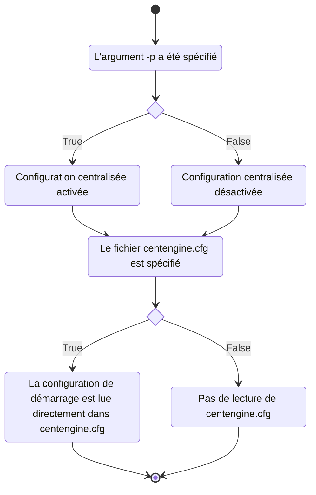
```mermaid
stateDiagram-v2
    State1: L'argument -p a été spécifié
    State2: Le fichier centengine.cfg est spécifié
    Conclusion1: Configuration centralisée activée
    NotConclusion1: Configuration centralisée désactivée
    Conclusion2: La configuration de démarrage est lue directement dans centengine.cfg
    NotConclusion2: Pas de lecture de centengine.cfg
    state if_state <<choice>>
    [*] --> State1
    State1 --> if_state
    if_state --> Conclusion1: True
    if_state --> NotConclusion1: False
    state if_state2 <<choice>>
    Conclusion1 --> State2
    NotConclusion1 --> State2
    State2 --> if_state2
    if_state2 --> Conclusion2: True
    if_state2 --> NotConclusion2: False
    Conclusion2 --> [*]
    NotConclusion2 --> [*]
```

## Nouveaux paramètres pour Broker

`Broker` a deux nouveaux paramètres que l’on retrouve dans son fichier
de configuration qui sont :

-   `cache_config_directory` - le répertoire de cache php, c’est-à-dire
    le répertoire dans lequel la configuration envoyée par le php est
    écrite.

-   `pollers_config_directory` - le répertoire des configurations poller
    qu’il va désormais maintenir.

Le premier répertoire contient des sous-répertoires dont les noms sont
des entiers représentant l’ID du poller. Chacun de ces répertoires
contient la configuration de l’`Engine` installé dessus. Au même niveau
que chacun de ces répertoires, on trouve aussi un fichier vide nommé
avec l’ID du poller dont l’extension est `.lck` , qui est mis à jour
seulement une fois le répertoire concerné mis à jour.

Un exemple de répertoire pour `cache_config_directory` :

* cache:
  * 1
    * centengine.cfg
    * services.cfg
    * etc...
  * 1.lck
  * 2
    * centengine.cfg
    * services.cfg
    * etc...
  * 2.lck

Le principe est le suivant, dès que le php termine de mettre à jour un
répertoire pour un poller, il touche le fichier `lck` associé. Ce dernier est
écouté par `Broker` et dès qu’il est notifié il prend en considération
la nouvelle configuration écrite dans le répertoire.

Pour le second répertoire, `Broker` l’utilise pour gérer l’ensemble des
configurations des pollers. Ce répertoire contient déjà toutes les
configurations des pollers sous la forme Protobuf sérialisée.

À partir du moment où le répertoire de cache php est fourni,
`Broker` considère qu’il est en nouvelle génération.

Un exemple de répertoire `pollers_config_directory`:

* pollers-configuration:
  * 1.prot
  * 2.prot

## La négociation

Nous considérons que les nouvelles capacités implémentées ici ne
fonctionnent qu’avec BBDO3.

Le message `Welcome` se voit ajouter quelques paramètres :

-   `broker_name`,
-   `extended_negociation`
-   `peer_type`

Si `cbmod` est configuré avec les nouveaux paramètres, alors il remplit
ces nouveaux champs.

Le message `Welcome` est maintenant défini comme suit :

```
    message Welcome {
      Bbdo version = 1;
      string extensions = 2;
      uint64 poller_id = 3;
      string poller_name = 4;
      /* \Broker\ name is more relevant than poller name because for example on the
       * central, rrd broker, central broker and engine share the same poller name
       * that is 'Central'. */
      string broker_name = 5;
      com.centreon.common.PeerType peer_type = 6;
      bool extended_negotiation = 7;
      /* Engine configuration version sent by Engine so Broker is aware of it. */
      string engine_conf = 8;
    }
```

Les champs `version` et `extensions` ne changent pas. `poller_id` et
`poller_name` représentent toujours l’ID et le nom du poller. Mais sur
le Central, par exemple, il y a trois programmes qui partagent ces deux
informations. Donc pour rendre unique l’identification de l’instance qui
envoie le message, nous avons ajouté le `broker_name` (qui a aussi du
sens dans le cas d’`Engine`).

`peer_type` est un type énuméré qui peut prendre les valeurs suivantes :

-   ENGINE
-   BROKER
-   MAP
-   UNKNOWN

Enfin, `extended_negotiation` est un booléen qui indique si le programme
est capable de gérer la nouvelle négociation, donc pour un `Engine`,
s’il a connaissance du répertoire de configuration Protobuf, et pour un
`Broker`, s’il a connaissance du répertoire de cache php.

Jusqu'à présent, quand le code était exécuté dans `cbmod` ou dans `Broker`, on
n’avait pas la visibilité sur le programme en cours d’exécution, on ne
savait pas si on était dans un `Broker` ou dans un `Engine`. Avec cette
évolution, on peut le savoir. C’est important puisqu’on veut que
`Broker` envoie la configuration à `Engine`.

Dans le stream bbdo, `Broker` stocke des informations sur son
interlocuteur, on avait déjà le `poller_name` et le
`poller_id`. On complète ces informations avec le `broker_name`, le
`peer_type`, le booléen `extended_negociation` et la chaîne `config_version` qui
pour le moment contient le hash de la configuration `Engine`. Dans un
futur proche, cette information évoluera probablement.

Et dans le `configuration::applier::state` on a aussi ces informations
pour notre instance.

Pour résumer, on a la classe `broker::config::applier::state` qui
contient les champs suivants (contenu partiel) :

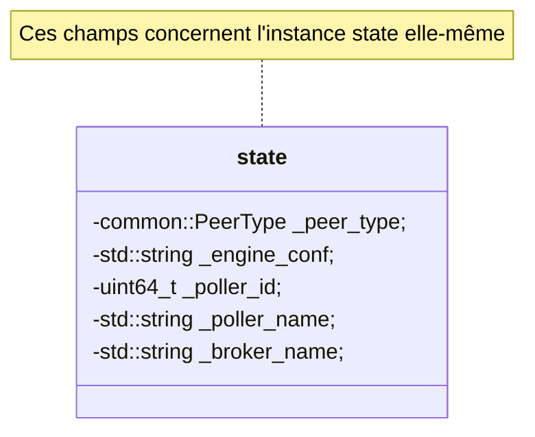
```mermaid
classDiagram
    note for state "Ces champs concernent l'instance state elle-même"
class state {
    -common::PeerType _peer_type;
    -std::string _engine_conf;
    -uint64_t _poller_id;
    -std::string _poller_name;
    -std::string _broker_name;
}
```

On a aussi la classe `broker::bbdo::stream` qui contient les champs suivants
(contenu partiel) :

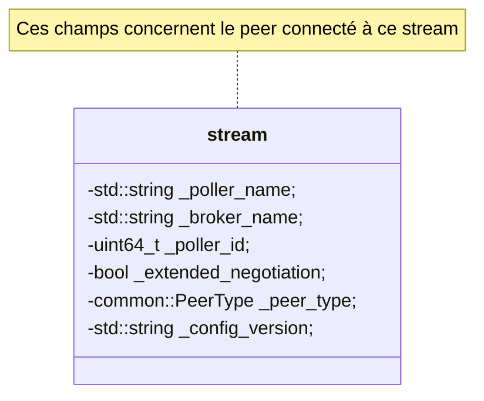
```mermaid
classDiagram
    note for stream "Ces champs concernent le peer connecté à ce stream"
class stream {
    -std::string _poller_name;
    -std::string _broker_name;
    -uint64_t _poller_id;
    -bool _extended_negotiation;
    -common::PeerType _peer_type;
    -std::string _config_version;
}
```
Au niveau de la négociation, les deux points importants sont de savoir
si la négociation étendue est supportée et dans le cas de la connexion
d’un `Engine`, savoir quelle version de la configuration, il connaît. Ce n’est pas
le moment d’échanger la configuration `Engine`, il y a potentiellement de
la rétention à liquider avant de basculer sur son envoi.

Comment fonctionne la négociation ? Deux cas se présentent :

1.  `Engine` initie la connexion.
2.  `Broker` initie la connexion.

On considère ici qu’`Engine` démarre et se connecte à un `Broker` déjà
en fonctionnement.

### Nouvelle fonctionnalité de Broker

`Broker` est configuré avec deux nouveaux répertoires dont on a déjà
parlé et qui sont :

-   `cache_config_directory`
-   `pollers-config`

Nous allons nous attarder sur ces deux répertoires. Le premier contient
des sous-répertoires qui sont les numéros des pollers connectés à ce
`Broker`. À côté de chacun, il existe un fichier `XX.lck` où `XX` est le numéro
d'un poller. Ces fichiers `.lck` sont écoutés sur les modifications par `Broker`.

Dès que le php finit de remplir un de ces répertoires avec la
configuration du poller concerné, c’est-à-dire qu’un nouveau
sous-répertoire `<poller_ID>` est créé, il crée à côté un fichier
`<poller_ID>.lck`, `Broker` en est directement notifié.

En réalité, `Broker` n’est pas directement notifié, cela coûterait
d’utiliser un thread pour cela. Du coup, dans la
réalité `Broker` exécute un timer (toutes les 5s) dans son objet
`config::applier::state`. Toutes les 5s,

1.  il demande à `inotify` s’il y a eu des modifications dans le
    répertoire de cache des configurations. Cette demande se traduit par
    une lecture de descripteur de fichier, non bloquante. S’il n’y a
    rien, la fonction retourne tout de suite avec rien comme résultat.

2.  Dans le cas d’une réponse positive, il récupère les noms de fichier
    `<poller ID>.lck` pour déduire quelles configurations viennent
    d’arriver.

3.  Pour chaque fichier de cette forme, il lit la configuration, crée un
    fichier `new-<poller ID>.prot` dans le répertoire `pollers-config`.

4.  Puis dans le cas où il existait déjà un fichier `<poller ID>.prot`
    dans ce répertoire, il crée aussi un fichier
    `<diff-<poller ID.prot>`. Si le fichier n'existe pas, le fichier de diff
    est créé mais avec la configuration complète.

5.  `Broker` entretient la liste de ses interlocuteurs, il met donc
    aussi à jour l’item correspondant à l’`Engine` avec le bon poller ID
    pour se souvenir qu’il a besoin d’une nouvelle configuration.

6.  Ces tâches sont toutes exécutées par un thread indépendant, elles ne
    devraient avoir qu’un impact limité sur le fonctionnement de
    `Broker`.

L’envoi de cette différence est géré dans le stream `bbdo`.

### Engine initie la connexion

`Engine` se connecte à `Broker` et envoie le message `Welcome`.
`Broker` est alors informé si la dernière version de configuration
`Engine` est connu par son interlocuteur. Il sait aussi s’il supporte la
nouvelle négociation. Et il répond par un message similaire.

Sachant que `Broker` écoute le répertoire de cache php, lorsqu’il aura
une nouvelle configuration disponible, il pourra l’envoyer.

Un point important, `Broker` ne regarde pas la version de configuration
`Engine` disponible pendant la négociation. C’est quelque chose qui se
fait en tâche de fond. Par contre, il stocke dans ses informations sur
le peer `Engine` sa version de conf. Par conséquent, à l'arrivée d'une
nouvelle version, il pourra vérifier si les deux sont bien différentes.

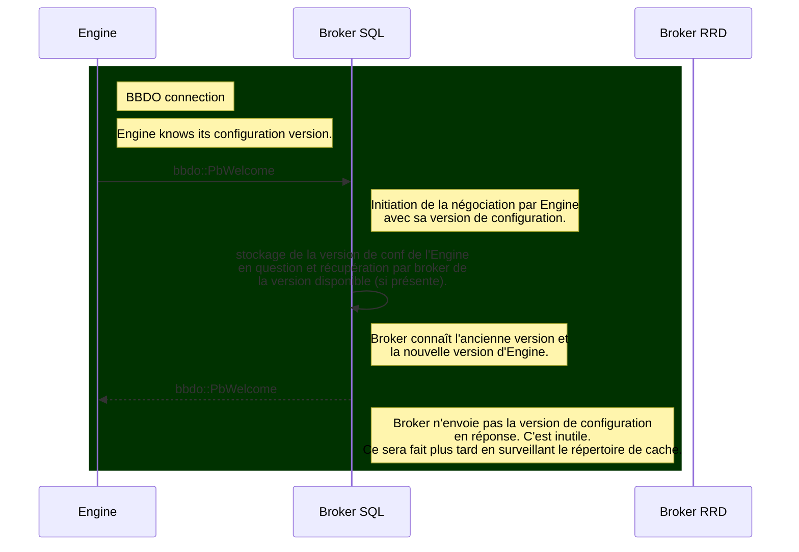
```mermaid
sequenceDiagram
    participant E as Engine
    participant BS as Broker SQL
    participant BR as Broker RRD

    rect rgb(0, 50, 0)
    note right of E: BBDO connection
    note right of E: Engine knows its configuration version.
    E ->> BS: bbdo::PbWelcome
    note right of BS: Initiation de la négociation par Engine<br/>avec sa version de configuration.

    BS ->> BS: stockage de la version de conf de l'Engine<br/>en question et récupération par broker de<br/>la version disponible (si présente).
    note right of BS: Broker connaît l'ancienne version et<br/>la nouvelle version d'Engine.
    BS -->> E: bbdo::PbWelcome
    note right of BS: Broker n'envoie pas la version de configuration<br/>en réponse. C'est inutile.<br/>Ce sera fait plus tard en surveillant le répertoire de cache.
    end
```

### Broker initie la connexion

`Broker` se connecte à `Engine` et envoie le message `Welcome`.
`Engine` apprend à ce moment si `Broker` supporte ou non la nouvelle
négociation. Et il répond en envoyant la version de configuration en
cours.

Au niveau diagramme, on est sur un schéma très similaire au précédent
hormis que les questions/réponses sont inversées.

# Lecture de la configuration Engine

## Gestion de la configuration côté Engine

`Engine` est démarré avec la nouvelle configuration. Il lit la
configuration sérialisée Protobuf disponible dans son `HOME`. Il se
connecte ensuite à `Broker` et envoie le message `Welcome` avec le bon
numéro de version de sa configuration. On a vu que `Broker` répond juste
en disant s'il supporte ou non la configuration centralisée. Dans un second temps,
Broker, en tâche de fond, vérifie si des nouvelles configurations sont disponibles
pour `Engine`. S'il s'en présente une, il
envoie un message avec la différence de configuration.
`cbmod` le garde en attente et lorsqu’`Engine` recommence un cycle dans
sa boucle principale, il applique cette configuration.

S’il y a de la rétention, elle est envoyée en tâche de fond pendant
l’application de la nouvelle configuration.
Une fois la rétention terminée, `Engine` ayant appliqué la configuration,
dans le cas d'un reload, envoie un message
`InstanceConfiguration` à `Broker` pour lui dire qu’il a bien reçu la
configuration.

FIXME DBO: Le message `InstanceConfiguration` est-il toujours nécessaire ?

Mais en fait, il y a un message spécifique pour cela, c'est le message
`pb_diff_state_ack` qui est envoyé par `Engine` à `Broker` pour lui dire
qu’il a bien reçu et appliqué la nouvelle configuration.

## Gestion de l’envoi de la configuration par Broker à Engine

`Broker` utilise `inotify` pour surveiller le répertoire de cache php.
Après que le php a fini d’écrire dans ce répertoire la configuration
du poller *X*, il crée à côté du répertoire *X*, un fichier `X.lck`.
`Broker` surveille la création/modification de n’importe quel fichier
`*.lck` dans ce répertoire. Pour cela un timer cadencé à 5 secondes fait
une lecture sur le descripteur de fichier `inotify`. Ce timer est lancé
en asynchrone et quand un fichier est détecté, `Broker` fait plusieurs
tâches:

En complément d’`inotify`, le timer effectue également un scan du répertoire à
chaque déclenchement. Ce fallback permet de détecter les fichiers `.lck` qu’`inotify`
aurait pu manquer (par exemple lorsque plusieurs `touch()` rapides saturent la file
d’événements du noyau). Tout fichier `.lck` trouvé lors du scan mais non signalé par
`inotify` est traité comme un événement de configuration manqué.

1.  Il lit le répertoire de configuration pour en faire une structure
    `engine::State`.

2.  Il sérialise dans son répertoire `pollers-conf` cette configuration
    dans un fichier `new-X.prot`.

3.  Dans le cas où un fichier `X.prot` existe déjà, il crée aussi un
    fichier `diff-X.prot` qui contient la différence entre les deux
    configurations.

4.  Dans le cas où le fichier `X.prot` n’existe pas, il crée aussi le
    fichier `diff-X.prot` mais le remplit avec la configuration
    complète.

Toutes ces étapes sont faites en tâche de fond.

Le stream BBDO en connexion avec le poller *X* est configuré sur la
lecture pour aussi vérifier si l’`Engine` connecté possède une nouvelle
version :

1.  `Broker` a la liste de ses interlocuteurs, parmi eux les
    `Engine` avec la configuration courante et la nouvelle si présente. Il sait
    donc si une nouvelle configuration est disponible pour l’`Engine` en
    face.

2.  si c’est le cas, juste après avoir reçu un event de l’`Engine`, il
    envoie le message `DiffState` avec la différence entre l'ancienne et
    la nouvelle configuration.

3.  après l’envoi du `DiffState`, et la réception d'un acquittement d'`Engine`,
    `Broker` efface le fichier de différence.

4.  Ce message est stocké côté `cbmod` par `Engine` et est appliqué au
    plus vite dans sa boucle principale.

Côté `Broker`, si on parle un peu plus technique, la lecture de la
configuration `Engine` est faite en utilisant la librairie
`engine_conf`. Une fois lue, la configuration est résolue afin que tous les
`host_id` et autres soient correctement remplis.

Ce code de résolution était à l'origine dans `Engine` mais il a été déplacé
dans la librairie `engine_conf`. Si `Engine` doit fonctionner comme avant,
il utilise aussi cette librairie.

La surveillance en utilisant `inotify` est faite au sein de la classe
`config::applier::state`.

## Calcul de la différence

`Broker` est notifié sur les nouvelles versions de configuration
`Engine`.

La configuration est reçue par l’instance
`config::applier::state` de `Broker`.

Il est intéressant de se garder une petite plage de temps afin de
pouvoir mutualiser les changements des différents pollers. Pour le
moment les interrogations auprès de `inotify` sont faites toutes les 5 secondes,
peut-être faudra-t-il augmenter un peu ce délai ou le paramétrer
autrement. L'intérêt de faire cela à des intervalles réguliers est que si plusieurs
pollers sont modifiés en parallèle, `Broker` devrait pouvoir les traiter
ensemble.

Dans l’étape précédente, nous avons fait évoluer la négociation entre
`Engine` et `Broker` mais globalement les deux fonctionnent comme avant.
Juste, dans un certain nombre de cas, on évite qu’`Engine` renvoie sa
configuration à Broker.

## Écriture de la configuration en base de données

### Étude de cas

Actuellement, même si la négociation a évolué, `Broker` continue à
écrire la configuration au compte-goutte en suivant ce que lui envoient
les pollers.

### Mise en pratique

La bonne solution semble être :

1.  À partir des différentiels de poller récupérés sur un changement de
    configuration, on crée un différentiel global. L’intérêt est de
    régler à l’avance les conflits inter poller.

2.  `Broker` doit apprendre à être moins strict sur les écritures en
    base. Par exemple, si un host est supprimé et qu’on envoie encore
    des données dessus, sachant que le host est juste désactivé, on
    devrait pouvoir quand même écrire les données.

3.  Lorsque le différentiel global est prêt, on ne serait plus obligé
    d’attendre un `Instance` pour le traiter. Ceci dit, si un poller a
    trois semaines de retard, quel serait l’impact sur les données
    d’envoyer presqu’à la connexion du poller la nouvelle configuration
    ?

Un algorithme pour le regroupement des différentiels pourrait suivre la
solution suivante :

-   Pour les objets ajoutés, on peut faire la réunion. On aura la
    globalité des objets ajoutés. A chaque ajout, il faut vérifier parmi
    les supprimés si l’objet n’est pas déjà référencé. S’il l’est on
    peut le déplacer dans les objets modifiés.

-   pour les objets modifiés (qui ne changent pas de poller), on peut
    aussi faire la réunion.

-   Pour un host déplacé d’un poller vers un autre, un différentiel va
    dire que le host est ajouté tandis qu’un autre va dire qu’il est
    supprimé.

-   pour un objet supprimé, il faut vérifier s’il n’est pas déjà ajouté,
    et s’il l’est, il faut le mettre dans les objets modifiés.

Côté Protobuf, nous avons deux objets de configuration qui sont `State`
et `DiffState`. Ils sont bien car sérialisables par contre ils ont le souci
d'être très limités pour les recherches.

On introduit donc deux nouveaux objets `IndexedState` et `IndexedDiffState` qui
stockent les objets dans des tables de hash. Une méthode `merge()` est implémentée
dans `IndexedDiffState` pour faire la fusion de plusieurs différentiels.

Le diagramme suppose que les pollers sont déjà connectés à `Broker` :

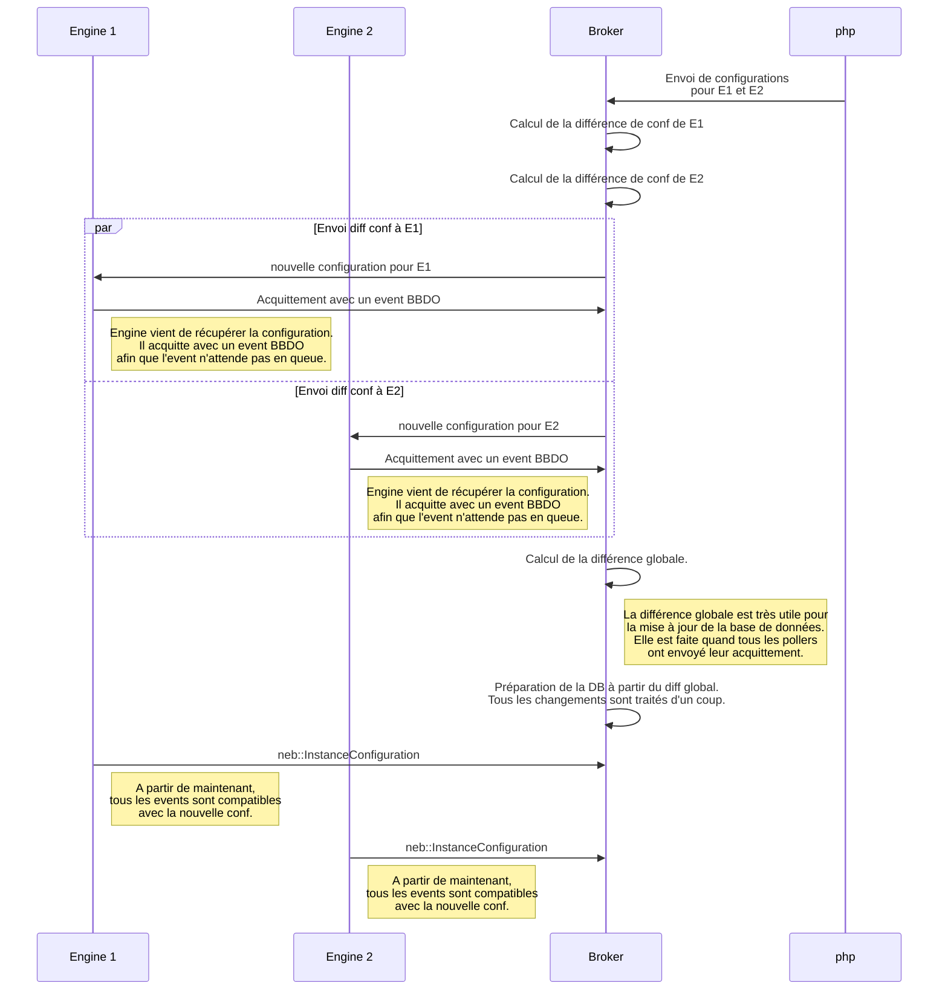
```mermaid
sequenceDiagram
  participant E1 as Engine 1
  participant E2 as Engine 2
  participant B as Broker
  participant php
  php ->> B: Envoi de configurations<br/>pour E1 et E2
  B ->> B: Calcul de la différence de conf de E1
  B ->> B: Calcul de la différence de conf de E2
  par Envoi diff conf à E1
    B ->> E1: nouvelle configuration pour E1
    E1 ->> B: Acquittement avec un event BBDO
    Note right of E1: Engine vient de récupérer la configuration.<br/> Il acquitte avec un event BBDO<br/>afin que l'event n'attende pas en queue.
  and Envoi diff conf à E2
    B ->> E2: nouvelle configuration pour E2
    E2 ->> B: Acquittement avec un event BBDO
    Note right of E2: Engine vient de récupérer la configuration.<br/> Il acquitte avec un event BBDO<br/>afin que l'event n'attende pas en queue.
  end
  B ->> B: Calcul de la différence globale.
  Note right of B: La différence globale est très utile pour<br/>la mise à jour de la base de données.<br/>Elle est faite quand tous les pollers<br/> ont envoyé leur acquittement.
  B ->> B: Préparation de la DB à partir du diff global.<br/>Tous les changements sont traités d'un coup.
  E1 ->> B: neb::InstanceConfiguration
  Note right of E1: A partir de maintenant,<br/> tous les events sont compatibles<br/> avec la nouvelle conf.
  E2 ->> B: neb::InstanceConfiguration
  Note right of E2: A partir de maintenant,<br/> tous les events sont compatibles<br/> avec la nouvelle conf.
```

**Remarques.**

1. Un point de vigilance : Dans le cas où le second poller a
   beaucoup de retard, l’arrivée de la seconde `ConfigurationInstance` peut
   vraiment tarder. Si `Broker` attend tous les `ConfigurationInstance` pour mettre à
   jour la base, ça pénalise les données de E1 puisque le cache va mettre longtemps
   avant d'être mis à jour.

2. Peut-être que la différence globale pourrait être faite sur la réception des
   acquittements. Et cadencée avec un timeout. Par exemple à partir de la première
   réception, Broker se donne un timeout de 10s, pendant ce laps de temps, dès qu'il
   reçoit un acquittement, il enrichit la différence globale avec la configuration
   acquittée. Lorsque le timeout est terminé, tout est envoyé à la base de données
   et au cache.

3. Un point de vigilance, nous avons supposé ici que la configuration arrivait du php,
   il faut aussi être capable de tout reprendre si la configuration est déjà côté
   Engine, y compris si elle a été supprimée côté Broker.

Pour le point 3., si Engine démarre avec une configuration connue de Broker, il n’y
a pas de souci, la configuration est déjà en place. Par contre, dans le cas où un
administrateur a supprimé la configuration connue par Engine, ce serait bien
qu’Engine soit en mesure de l’envoyer à Broker pour régler le souci.

Ce cas est géré de la façon suivante : lors de la négociation BBDO, si Broker ne
trouve ni fichier `<ID>.prot` ni fichier `<ID>.lck` pour un poller, il envoie un
`DiffState{unknown=true}` à Engine. Engine détecte ce message et tente d'envoyer sa
configuration courante à Broker. Si `state.prot` existe, Engine l'envoie ; sinon
(premier démarrage, aucune configuration encore appliquée), Engine journalise un
avertissement et n'envoie rien — le flux normal de configuration (via les fichiers
`.lck`) prendra le relais. Dans les deux cas, Engine remet immédiatement le flag
`reloading` à `false` afin de pouvoir traiter les diffs suivants.

Broker reçoit le `State` courant, puis appelle `create_prot_file()`. Avant d'écrire
`<ID>.prot`, Broker vérifie qu'aucune configuration plus récente n'est déjà en cours
de traitement :

- si un fichier `<ID>.lck` existe dans le répertoire de cache PHP, c'est que PHP
  vient d'envoyer une nouvelle configuration ; Broker laisse le flux normal
  s'en charger ;
- si un fichier `new-<ID>.prot` existe, le flux normal est déjà en train de
  préparer la nouvelle configuration ;
- si `<ID>.prot` existe déjà, le flux normal a déjà installé la configuration.

Dans ces trois cas, Broker remet simplement `conf_unknown` à `false` sans écraser
le fichier.

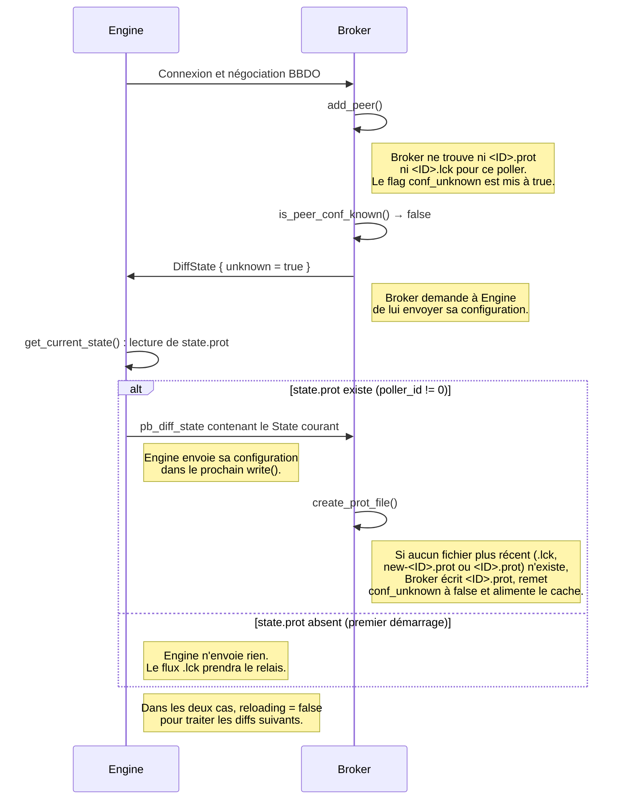
```mermaid
sequenceDiagram
    participant E as Engine
    participant B as Broker

    E ->> B: Connexion et négociation BBDO
    B ->> B: add_peer()
    note right of B: Broker ne trouve ni <ID>.prot<br/>ni <ID>.lck pour ce poller.<br/>Le flag conf_unknown est mis à true.
    B ->> B: is_peer_conf_known() → false
    B ->> E: DiffState { unknown = true }
    note right of B: Broker demande à Engine<br/>de lui envoyer sa configuration.
    E ->> E: get_current_state() : lecture de state.prot
    alt state.prot existe (poller_id != 0)
        E ->> B: pb_diff_state contenant le State courant
        note right of E: Engine envoie sa configuration<br/>dans le prochain write().
        B ->> B: create_prot_file()
        note right of B: Si aucun fichier plus récent (.lck,<br/>new-<ID>.prot ou <ID>.prot) n'existe,<br/>Broker écrit <ID>.prot, remet<br/>conf_unknown à false et alimente le cache.
    else state.prot absent (premier démarrage)
        note right of E: Engine n'envoie rien.<br/>Le flux .lck prendra le relais.
    end
    note right of E: Dans les deux cas, reloading = false<br/>pour traiter les diffs suivants.
```

Si l’`Engine` est redémarré avant l’envoi de cet
   *event*, il va se connecter avec la nouvelle configuration mais
   `Broker` aura encore des restes de travaux à effectuer ce qui peut être
   problématique. Pour éviter ça, on passe par un nouvel *event* BBDO (donc
   qui est géré en dehors de la pile des événements) ; dès qu’`Engine` lit
   la configuration, il émet ce nouvel *event* pour informer `Broker` au
   plus vite qu’elle est prise en compte. Pour appliquer la configuration
   sur la base de données, `Broker` attend d’avoir reçu tous ces
   acquittements.

Détaillons davantage la gestion des fichiers pendant l’envoi des
configurations pour mieux comprendre les soucis que l’on pourrait
rencontrer.


## Cas épineux

Lorsqu’il y a de la rétention, nous avons deux cas qui posent problème :

1.  si le premier poller est à l’heure et le second a de la rétention.
    Dans le cas où un host est déplacé du second vers le premier, Broker
    risque de recevoir des données du même host en même temps, provenant
    des deux pollers, ceci jusqu’à ce que le second poller rattrape la
    rétention. En terme de datation, les données arrivant du second
    poller seront plus anciennes.

2.  Si le second poller a de la rétention et avant que `Broker` ne
    reçoive son InstanceConfiguration, l’utilisateur pousse une nouvelle
    configuration. Il est possible dans ce cas, qu’`Engine` ait déjà
    pris en compte l’avant-dernière configuration, et par contre que
    `Broker` n’en soit pas encore informé et qu’il considère
    qu’`Engine`est encore sur la configuration précédente. Par
    conséquent, le différentiel nouvellement calculé par `Broker` va
    être faux.

Le second cas épineux devrait être réglé grâce à l’introduction de
l’event BBDO d’acquittement.

Nous avons un *flag* dans `Broker` pour spécifier s’il est occupé à
traiter la configuration des pollers ou non. Il y a deux portions de
code concernées par ce *flag*.

1.  Lorsque le timer crée les fichiers de diff, de state, etc…C’est tout
    un moment où le *flag* est activé. Du coup, si le stream bbdo veut
    accéder aux configurations disponibles, l’accès lui est refusé et il
    passe son chemin.

2.  Lorsque le stream BBDO envoie la configuration aux pollers. Le timer
    n’a plus accès aux fichiers de configuration, et le timer est juste
    reprogrammé pour plus tard en attendant que la tâche soit terminée.
    Le stream BBDO, dans l’idéal, devrait désactiver le flag lorsque
    tous les pollers ont envoyé un acquittement.

Ci-dessous l’illustration de la situation 2 que l’on souhaite éviter:


Grâce au message d’acquittement, `Broker` ne lira pas la nouvelle
configuration disponible tant qu’il n’a pas reçu l’acquittement
d’`Engine`. Et une fois l’acquittement reçu, `Broker` sait que c’est
maintenant cette configuration qui est en place (même si elle n’est pas
encore totalement effective à cause de la rétention). Par conséquent,
quand `Broker` lit la nouvelle configuration, il calcule bien le bon
différentiel avec la bonne configuration déjà en place.

Il y a un troisième cas inquiétant qui concerne tous les objets transverses. Considérons le Hostgroup par exemple.
Un poller dont certains hosts appartiennent à des Hostgroups, a une configuration déclarant les Hostgroups nécessaires avec les hosts qu'il contient. Le souci est que le poller 1 ne connaît que ses hosts, et par conséquent les Hostgroups qu'il a en définition ne connaissent aussi que ses hosts.

Prenons un exemple, nous avons les hosts 1 et 2 sur le poller 1 et les hosts 3 et 4 sur le poller 2.
Un Hostgroup contient les 4 hosts.

La configuration du poller 1 va donc contenir une déclaration du Hostgroup avec seulement les hosts 1 et 2 et la configuration du poller 2 en aura une autre avec les hosts 3 et 4.

Reprenons maintenant notre configuration centralisée, la configuration du poller 1 change en retirant les hosts 1 et 2 du Hostgroup. La diff de configuration va tout simplement supprimer le Hostgroup.

Dans le cas où seulement le poller 1 a des modifications de configuration, on se retrouve avec une diff qui déclare la suppression du Hostgroup. Ceci va être inséré au différentiel global utilisé pour préparer la base de données. Mais on ne peut pas supprimer le Hostgroup comme ça, il est toujours utilisé par le poller 2.

Donc pour les Hostgroups et Servicegroups, le système de différentiel mis en place ne peut pas s'appliquer.

Le différentiel avec Hostgroups, Servicegroups implémentés comme les autres doit être conservé car il est utilisé lors de l'envoi de la diff au poller.

Le souci est lorsqu'on rassemble les modifications sur ces objets pour l'écriture en base et plus tard pour le cache global de broker.

L'objet neb::service est plus complet que la configuration d'un configuration::service. Du coup, lors de l'initialisation avec un neb::service, on a aussi l'état du service, pending si rien n'est donné au départ. Dans le cas d'un configuration::service, on trouve NULL dans la colonne status de la table `resources` ; ce qui provoque des cas de tests qui peuvent échouer pour le moment et qu'il va falloir réparer.

## objets transverses

Nous avons un objet Protobuf DiffState qui est réparti dans un indexed_diff_state, qui, comme son nom l'indique, indexe les objets des conteneurs.

Pour le GlobalDiffState, nous avons actuellement les même objets. Pourrions-nous hériter de indexed_diff_state pour y ajouter des spécificités.

Imaginons la structure du global_indexed_diff_state. Cette classe hérite de indexed_diff_state. Traitons le merge d'un DiffState.

* Le poller 1 voit l'arrivée d'un nouveau Hostgroup avec les hosts 6 et 7. Son diff contient un Hostgroup ajouté avec deux membres. Le poller 2 voit le même nouveau Hostgroup auquel on ajoute les hosts 8 et 10.

	* Etat des lieux : le premier diff va compléter le global diff state avec un nouveau hostgroup et ses membres. Le second diff va aussi compléter le global diff state avec le même nouveau. Leurs contenus ne sont pas mergés, le second écrase le premier.
	* Evolution : On peut garder la même structure added/modified/removed mais les points de vue des différents pollers ne doivent pas interférer, donc le mieux est d'indexer ces changements par poller. Au niveau du cache global, on a l'état actuel de tous les Hostgroups et on peut vraiment appliquer les changements.

## De la nécessité du cache centralisé

Commençons par deux cas de figure :
1. Engine ne connaît aucune configuration, il démarre et se connecte à broker. Broker lui envoie la configuration complète.
   Dans ce cas, Broker calcule aussi la différence "globale" qui va permettre d'enregistrer cette configuration dans la
   base de données `centreon_storage`. Et la supervision peut commencer à tourner.
2. Imaginons maintenant la situation 1. mais on arrête `Engine`. Puis on le redémarre. Il se reconnecte à `Broker` et donne la configuration qu'il connaît.
   De son côté, `Broker` n'a pas de nouvelle configuration donc il n'envoie rien à `Engine`. Donc `Engine` n'acquitte rien. Donc le diff global ne contient
   rien sur ce poller qui vient de redémarrer. Lors de l'arrêt précédent d'`Engine`, toutes ses ressources ont été désactivées. Mais rien ne permet de les
   réactiver pour le moment. Donc `Engine` se connecte, fonctionne normalement, mais côté `Broker` on ne voit rien.

Le second cas avec le système que nous connaissons fonctionne très bien car `Engine` envoie toute sa configuration et les ressources sont réactivées
les unes après les autres.

Reprenons le schéma d'échange de configuration.

On suppose que Broker est déjà en train de fonctionner.

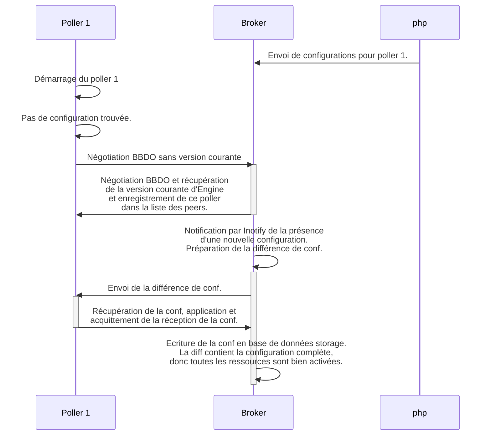
```mermaid
sequenceDiagram
    participant E as Poller 1
    participant B as Broker
    participant php
    php ->> B: Envoi de configurations pour poller 1.
    E ->> E: Démarrage du poller 1
    E ->> E: Pas de configuration trouvée.
    E ->> B: Négotiation BBDO sans version courante
    activate B
    B ->> E: Négotiation BBDO et récupération<br/>de la version courante d'Engine<br/>et enregistrement de ce poller<br/>dans la liste des peers.
    deactivate B
    B ->> B: Notification par Inotify de la présence<br/>d'une nouvelle configuration.<br/>Préparation de la différence de conf.
    activate B
    B ->> E: Envoi de la différence de conf.
    activate E
    E ->> B: Récupération de la conf, application et<br/>acquittement de la réception de la conf.
    deactivate E
    B ->> B: Ecriture de la conf en base de données storage.<br/> La diff contient la configuration complète,<br/>donc toutes les ressources sont bien activées.
    deactivate B
```

Reprenons le cas précédent, mais cette fois-ci, `Engine` connaît déjà la configuration.

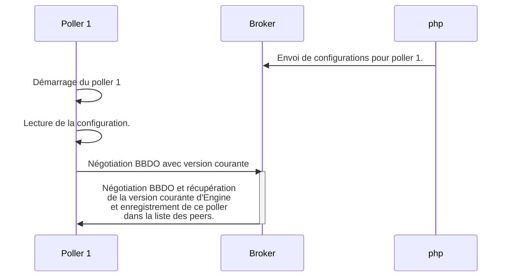
```mermaid
sequenceDiagram
    participant E as Poller 1
    participant B as Broker
    participant php
    php ->> B: Envoi de configurations pour poller 1.
    E ->> E: Démarrage du poller 1
    E ->> E: Lecture de la configuration.
    E ->> B: Négotiation BBDO avec version courante
    activate B
    B ->> E: Négotiation BBDO et récupération<br/>de la version courante d'Engine<br/>et enregistrement de ce poller<br/>dans la liste des peers.
    deactivate B
```

Dans ce second cas, il n'y a pas d'envoi de configuration, donc pas d'acquittement, donc pas de mise à jour de la base de données.
L'utilisateur se retrouve dans le noir, car les ressources sont désactivées et ne se réactivent pas.

Juste avant de démarrer la supervision, `Engine` envoie un message `Instance` qui pourrait servir pour réactiver les ressources.

Mais là, nous faisons face à un autre souci. Les ressources supprimées comme les ressources désactivées ont juste la colonne
`enabled` à 0 dans la table `resources`. Donc, on ne peut pas faire la différence entre les deux.

Donc si on met `enabled` à 1, toutes les ressources, y compris les anciennes seront réactivées ce qui est problématique.

`Broker` doit à tout prix garder une trace des ressources de son côté, ce qui permet de pouvoir réactiver ce qu'il faut
à ces moments-là. Nous avons donc besoin d'un cache sur `Broker`.

## Quelques points plus techniques

Lors de la connexion d'un Engine au Broker, la méthode `config::applier::add_peer()` est appelée. Elle fonctionne
de la façon suivante :

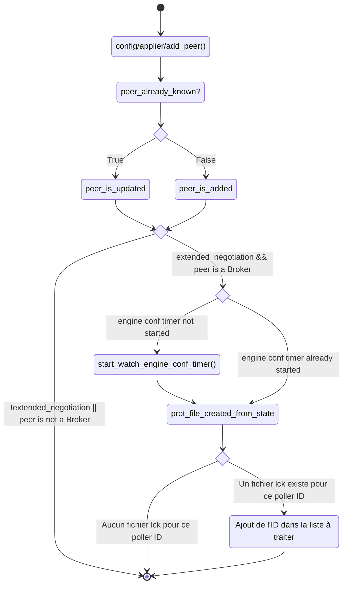
```mermaid
stateDiagram-v2
    [*] --> config/applier/add_peer()
    config/applier/add_peer() --> peer_already_known?
    state if_state <<choice>>
    peer_already_known? --> if_state
    if_state --> peer_is_updated:True
    if_state --> peer_is_added:False
    state extended_nego <<choice>>
    peer_is_updated --> extended_nego
    peer_is_added --> extended_nego
    extended_nego --> [*]: !extended_negotiation || peer is not a Broker
    state if_watch_engine_timer_started <<choice>>
    extended_nego --> if_watch_engine_timer_started: extended_negotiation && peer is a Broker
    if_watch_engine_timer_started --> start_watch_engine_conf_timer(): engine conf timer not started
    start_watch_engine_conf_timer() --> prot_file_created_from_state
    if_watch_engine_timer_started --> prot_file_created_from_state: engine conf timer already started

    state if_existing_lck_file_for_current_poller_id <<choice>>
    prot_file_created_from_state --> if_existing_lck_file_for_current_poller_id
    if_existing_lck_file_for_current_poller_id --> keep_lck_file_in_memory: Un fichier lck existe pour ce poller ID
    if_existing_lck_file_for_current_poller_id --> [*]: Aucun fichier lck pour ce poller ID
    keep_lck_file_in_memory: Ajout de l'ID dans la liste à traiter
    keep_lck_file_in_memory --> [*]
```

Cette méthode mémorise le poller dans sa liste de peers. Elle démarre le timer de surveillance de la configuration
`Engine` si la négociation est étendue et que le peer est un `Engine`. Et elle vérifie aussi s'il existe déjà un
fichier `.lck` pour le poller ID car `inotify` ne remonte pas les fichiers existant avant son démarrage. Si un tel
fichier est trouvé, l'ID du poller est ajouté à la liste à traiter pour le prochain tick du timer.

Par la suite, le timer est exécuté en tâche de fond et vérifie toutes les 5s si un fichier `.lck` a été modifié ou créé,
dans ce cas la liste des fichiers `.lck` est enrichie puis traitée en tâche de fond. Intéressons-nous à cette partie.

Le timer exécute la méthode `config::applier::state::_check_last_engine_conf()`.

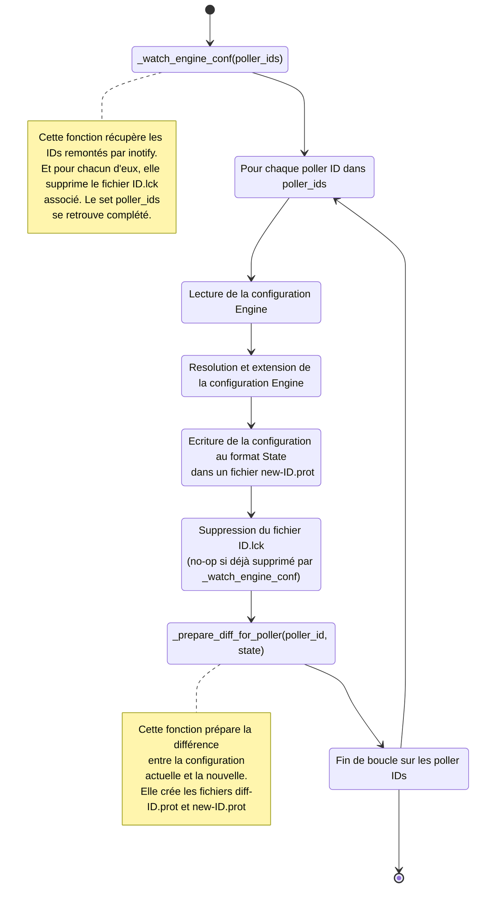
```mermaid
stateDiagram-v2
    [*] --> _watch_engine_conf(poller_ids)
    _watch_engine_conf(poller_ids) --> pour_chaque_poller_id
    note right of _watch_engine_conf(poller_ids): Cette fonction récupère les IDs remontés par inotify.<br/>Et pour chacun d'eux, elle supprime le fichier ID.lck<br/> associé. Le set poller_ids se retrouve complété.
    lect_conf_engine: Lecture de la configuration Engine
    pour_chaque_poller_id: Pour chaque poller ID dans poller_ids
    pour_chaque_poller_id --> lect_conf_engine
    lect_conf_engine --> resolution_de_la_configuration_engine
    resolution_de_la_configuration_engine: Resolution et extension de la configuration Engine
    resolution_de_la_configuration_engine --> ecriture_dans_fichier__new_ID_prot
    ecriture_dans_fichier__new_ID_prot: Ecriture de la configuration au format State<br/> dans un fichier new-ID.prot
    ecriture_dans_fichier__new_ID_prot --> suppression_fichier_lck
    suppression_fichier_lck: Suppression du fichier ID.lck<br/>(no-op si déjà supprimé par _watch_engine_conf)
    suppression_fichier_lck --> preparation_de_la_difference
    preparation_de_la_difference: _prepare_diff_for_poller(poller_id, state)
    preparation_de_la_difference --> fin_pour_chaque_poller_id
    note right of preparation_de_la_difference: Cette fonction prépare la différence<br/> entre la configuration actuelle et la nouvelle.<br/>Elle crée les fichiers diff-ID.prot et new-ID.prot
    fin_pour_chaque_poller_id: Fin de boucle sur les poller IDs
    fin_pour_chaque_poller_id --> pour_chaque_poller_id
    fin_pour_chaque_poller_id --> [*]
```

Détaillons un peu le comportement de la méthode `config::applier::state::_prepare_diff_for_poller()`.

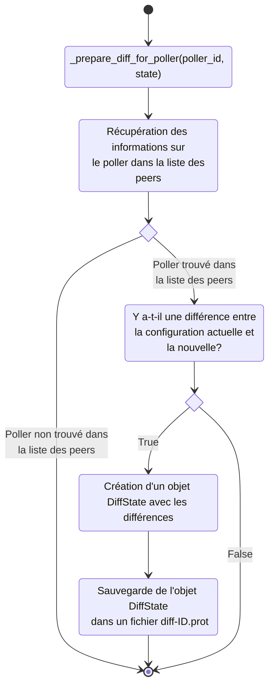
```mermaid
stateDiagram-v2
    prepare_diff_poller: _prepare_diff_for_poller(poller_id, state)
    [*] --> prepare_diff_poller
    recup_poller_in_peers: Récupération des informations sur<br/> le poller dans la liste des peers
    state si_pas_trouve <<choice>>
    recup_poller_in_peers --> si_pas_trouve
    prepare_diff_poller --> recup_poller_in_peers
    si_pas_trouve --> [*]: Poller non trouvé dans<br/> la liste des peers
    comparaison: Y a-t-il une différence entre<br/> la configuration actuelle et la nouvelle?
    si_pas_trouve --> comparaison: Poller trouvé dans<br/> la liste des peers
    state si_differe <<choice>>
    comparaison --> si_differe
    create_diff: Création d'un objet DiffState avec les différences
    si_differe --> create_diff: True
    sauv_diff: Sauvegarde de l'objet DiffState<br/> dans un fichier diff-ID.prot
    create_diff --> sauv_diff
    sauv_diff --> [*]
    si_differe --> [*]: False
```

Par conséquent, côté `state`, Broker surveille les configurations `Engine` et dès qu'une nouvelle est disponible,
il calcule la différence et crée les fichiers `diff-ID.prot` et `new-ID.prot`.

Chaque stream BBDO connaît son interlocuteur. Si `Broker` est connecté à `Engine`, un stream BBDO les relie et `Broker`
sait qu'il est connecté à un `Engine`, il connaît son poller ID, s'il supporte la configuration centralisée, etc...

Ce stream lit régulièrement les événements entrants, c'est de cette manière que `Broker` reçoit la supervision.
La lecture est faite par une méthode `bbdo::stream::read()`. C'est dans cette méthode que certaines actions comme
l'acquittement d'événements est faite. Et c'est aussi là que Broker détecte si une nouvelle configuration est disponible
pour le poller connecté. Dans le cas où une configuration est disponible, elle est alors lue et envoyée à `Engine`.

Un algorithme simplifié de cette méthode est le suivant :
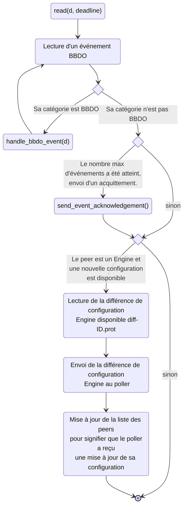
```mermaid
stateDiagram-v2
    read: read(d, deadline)
    read_one_event: Lecture d'un événement BBDO
    read --> read_one_event
    state if_bbdo_event <<choice>>
    read_one_event --> if_bbdo_event
    if_bbdo_event --> handle_bbdo_event(d): Sa catégorie est BBDO
    state if_ack_needed <<choice>>
    if_bbdo_event --> if_ack_needed: Sa catégorie n'est pas BBDO
    handle_bbdo_event(d) --> read_one_event
    if_ack_needed --> send_event_acknowledgement(): Le nombre max d'événements a été atteint,<br/>envoi d'un acquittement.
    state if_peer_is_engine <<choice>>
    if_ack_needed --> if_peer_is_engine: sinon
    send_event_acknowledgement() --> if_peer_is_engine
    read_conf: Lecture de la différence de configuration<br/> Engine disponible diff-ID.prot
    if_peer_is_engine --> read_conf: Le peer est un Engine et<br/> une nouvelle configuration est disponible
    if_peer_is_engine --> [*]: sinon
    send_conf: Envoi de la différence de configuration<br/> Engine au poller
    read_conf --> send_conf
    update_peers: Mise à jour de la liste des peers<br/> pour signifier que le poller a reçu<br/>une mise à jour de sa configuration
    send_conf --> update_peers
    update_peers --> [*]
```

Dans cette même méthode `read()`, on a un appel à la méthode `handle_bbdo_event()` pour les événements de catégorie BBDO.
C'est dans cette méthode qu'on trouve entre autre le traitement de l'acquittement de la configuration par `Engine`.

Lorsque l'acquittement est reçu pour un poller d'ID poller_id, la liste des peers est mise à jour pour signifier que
ce poller est bien à jour. Le fichier `new-ID.prot` remplace le fichier `ID.prot`.

Enfin, lorsque tous les pollers sont à jour, un objet `com::centreon::engine::configuration::indexeed_diff_state`
est construit en mergeant tous les différentiels de pollers. Cet objet est publié par `Broker` pour être
traité par le stream `unifie_sql`.

L'agencement de ces fonctions donne à peu près le diagramme suivant :

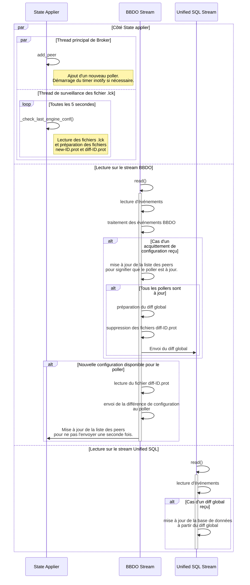
```mermaid
sequenceDiagram
participant S as State Applier
participant BBDO as BBDO Stream
participant USQL as Unified SQL Stream

par Côté State applier
    par Thread principal de Broker
    S ->> S: add_peer
    note right of S: Ajout d'un nouveau poller.<br/>Démarrage du timer inotify si nécessaire.
    and Thread de surveillance des fichier .lck
        loop Toutes les 5 secondes
            S ->> S: _check_last_engine_conf()
            note right of S: Lecture des fichiers .lck<br/>et préparation des fichiers<br/>new-ID.prot et diff-ID.prot
        end
    end
and Lecture sur le stream BBDO
    BBDO ->> BBDO: read()
    activate BBDO
    BBDO ->> BBDO: lecture d'événements
    BBDO ->> BBDO: traitement des événements BBDO
    alt Cas d'un acquittement de configuration reçu
        BBDO ->> BBDO: mise à jour de la liste des peers<br/>pour signifier que le poller est à jour.
        alt Tous les pollers sont à jour
            BBDO ->> BBDO: préparation du diff global
            BBDO ->> BBDO: suppression des fichiers diff-ID.prot
            BBDO ->> USQL: Envoi du diff global
        end
    end
    alt Nouvelle configuration disponible pour le poller
    BBDO ->> BBDO: lecture du fichier diff-ID.prot
    BBDO ->> BBDO: envoi de la différence de configuration<br/>au poller
    BBDO ->> S: Mise à jour de la liste des peers<br/>pour ne pas l'envoyer une seconde fois.
    end
    deactivate BBDO
and Lecture sur le stream Unified SQL
    USQL ->> USQL: read()
    activate USQL
    USQL ->> USQL: lecture d'événements
    alt Cas d'un diff global reçu
        USQL ->> USQL: mise à jour de la base de données<br/>à partir du diff global
    end
    deactivate USQL
end
```

## Split de broker::config::applier::state

Cet objet `broker::config::applier::state` est utilisé à la fois par
`cbmod` et par `broker`. Il gère la surveillance des fichiers de
configuration `Engine`, le calcul des différences, etc...

Son comportement est un peu différent selon qu'il est utilisé par
`cbmod` ou par `broker`.

Garder un unique objet pour les deux nous oblige à garder des attributs
utilisés par l'un et pas par l'autre. La liste des peers, par exemple,
a une gestion assez compliquée pour gérer les deux cas. L'attribut `_engine_conf`,
utilisé uniquement côté `cbmod` se retrouve aussi dans `broker` alors qu'il ne
sert à rien.

La classe `com::centreon::broker::config::applier::state` est donc découpée en trois :

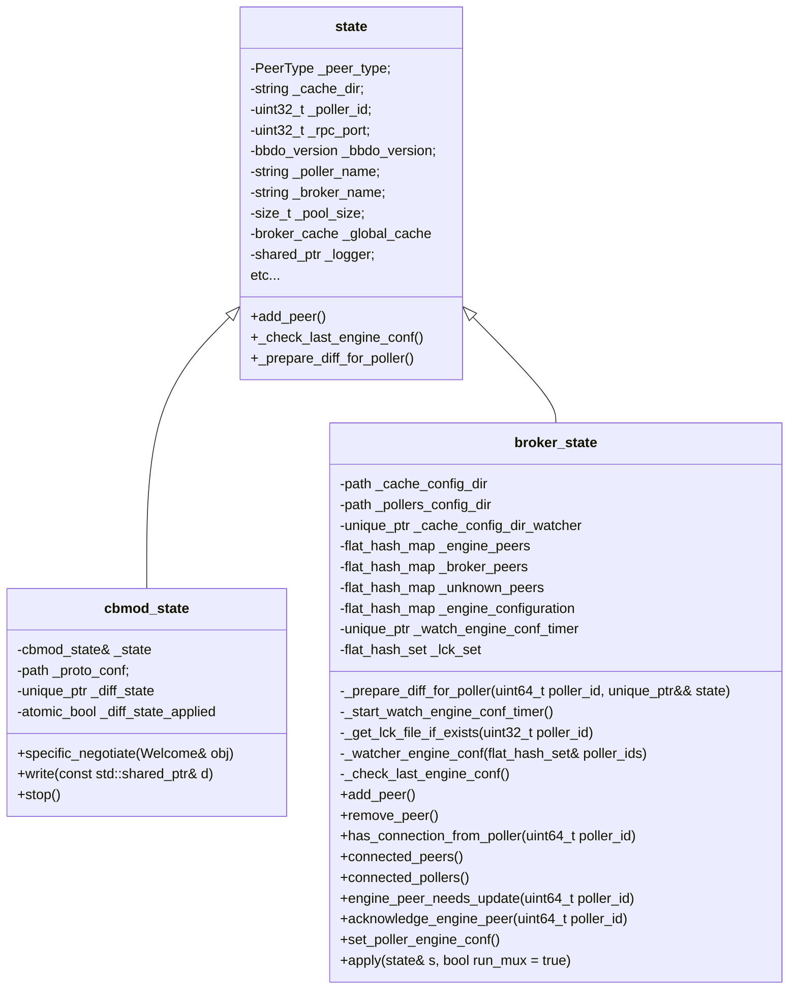
```mermaid
classDiagram
    class state {
        -PeerType _peer_type;
        -string _cache_dir;
        -uint32_t _poller_id;
        -uint32_t _rpc_port;
        -bbdo_version _bbdo_version;
        -string _poller_name;
        -string _broker_name;
        -size_t _pool_size;
        -broker_cache _global_cache
        -shared_ptr<spdlog::logger> _logger;

        +add_peer()
        +_check_last_engine_conf()
        +_prepare_diff_for_poller()
        etc...
    }
    class cbmod_state {
        -cbmod_state& _state
        -path _proto_conf;
        -unique_ptr<DiffState> _diff_state
        -atomic_bool _diff_state_applied
        +specific_negotiate(Welcome& obj)
        +write(const std::shared_ptr<io::data>& d)
        +stop()
    }
    class broker_state {
        -path _cache_config_dir
        -path _pollers_config_dir
        -unique_ptr<directory_watcher> _cache_config_dir_watcher
        -flat_hash_map<peer_key, engine_peer> _engine_peers
        -flat_hash_map<peer_key, broker_peer> _broker_peers
        -flat_hash_map<peer_key, unknown_peer> _unknown_peers
        -flat_hash_map<uint64_t, string> _engine_configuration
        -unique_ptr<steady_timer> _watch_engine_conf_timer
        -flat_hash_set<uint32_t> _lck_set
        -_prepare_diff_for_poller(uint64_t poller_id, unique_ptr<State>&& state)
        -_start_watch_engine_conf_timer()
        -_get_lck_file_if_exists(uint32_t poller_id)
        -_watcher_engine_conf(flat_hash_set<uint32_t>& poller_ids)
        -_check_last_engine_conf()
        +add_peer()
        +remove_peer()
        +has_connection_from_poller(uint64_t poller_id)
        +connected_peers()
        +connected_pollers()
        +engine_peer_needs_update(uint64_t poller_id)
        +acknowledge_engine_peer(uint64_t poller_id)
        +set_poller_engine_conf()
        +apply(state& s, bool run_mux = true)
    }
    state <|-- cbmod_state
    state <|-- broker_state
```

Le découpage de `state` implique aussi le découpage de la classe `bbdo::stream`.

Il y a les `bbdo::stream` utilisés par `cbmod` pour se connecter à un `broker`,
il y a les `bbdo::stream` utilisés par `broker` pour se connecter à un `engine`
et il y a aussi les `bbdo::stream` utilisés par des fichiers cache ou *unprocessed*.

pour représenter tout ça, il a fallu découper `bbdo::stream` en une classe de base `bbdo::basic_stream` puis une
classe virtuelle pure `bbdo::stream` qui hérite de `bbdo::basic_stream` et enfin deux classes concrètes
`bbdo::broker_stream` et `bbdo::cbmod_stream` qui héritent de `bbdo::stream`.

Ce qui donne la structure suivante :

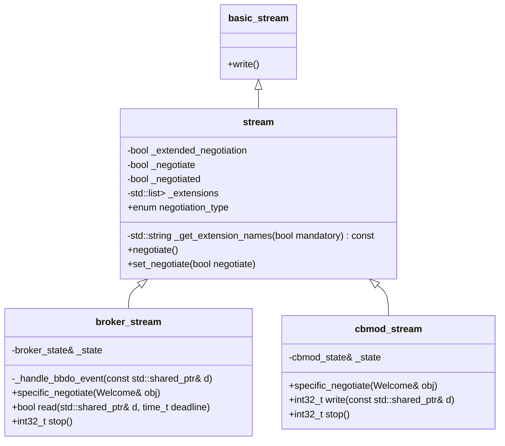
```mermaid
classDiagram
    class basic_stream {
        +write()
    }
    class stream {
        -bool _extended_negotiation
        -bool _negotiate
        -bool _negotiated
        -std::list<std::shared_ptr<io::extension>> _extensions
        -std::string _get_extension_names(bool mandatory) const
        +enum negotiation_type
        +negotiate()
        +set_negotiate(bool negotiate)
    }
    class broker_stream {
        -broker_state& _state
        -_handle_bbdo_event(const std::shared_ptr<io::data>& d)
        +specific_negotiate(Welcome& obj)
        +bool read(std::shared_ptr<io::data>& d, time_t deadline)
        +int32_t stop()
    }
    class cbmod_stream {
        -cbmod_state& _state
        +specific_negotiate(Welcome& obj)
        +int32_t write(const std::shared_ptr<io::data>& d)
        +int32_t stop()
    }
    basic_stream <|-- stream
    stream <|-- broker_stream
    stream <|-- cbmod_stream
```

# Streams sql/storage

Ces deux streams ont été dépréciés au profit du stream unifié SQL. Ces streams ne fonctionnent pas avec BBDO 3
et sont donc inutilisables avec la configuration centralisée.

Il est donc temps de les supprimer, cela évite des soucis avec de potentielles régressions.

Au niveau des tests *robot*, beaucoup sont encore basés sur ces streams. Il faut que Broker démarre par défaut
avec le stream unifié SQL et que les tests soient adaptés en conséquence.

# Cache centralisé Broker

## Fonctionnement en configuration centralisée

Comme les caches avant l'introduction du cache centralisé stockaient des `neb::services`, `neb::hosts`, le nouveau
cache va aussi contenir ces événements. Ça impose des conversions à partir de la configuration, mais vu le besoin
du Lua, il est difficile de faire autrement.

Le cache global, contrairement à la situation d'avant, n'est plus mis à jour par des `neb::services` et autres,
c'est essentiellement la configuration qui le remplit puis des `service_status`, `host_status` pour quelques mises
à jour.

Cette mise à jour est faite dans le multiplexeur. Quand son *engine* reçoit les événements, il en profite pour mettre
à jour le cache.

Il faut aussi regarder comment la configuration agit sur le cache.

Ce diagramme est à mettre à jour avec la mise à jour du cache...

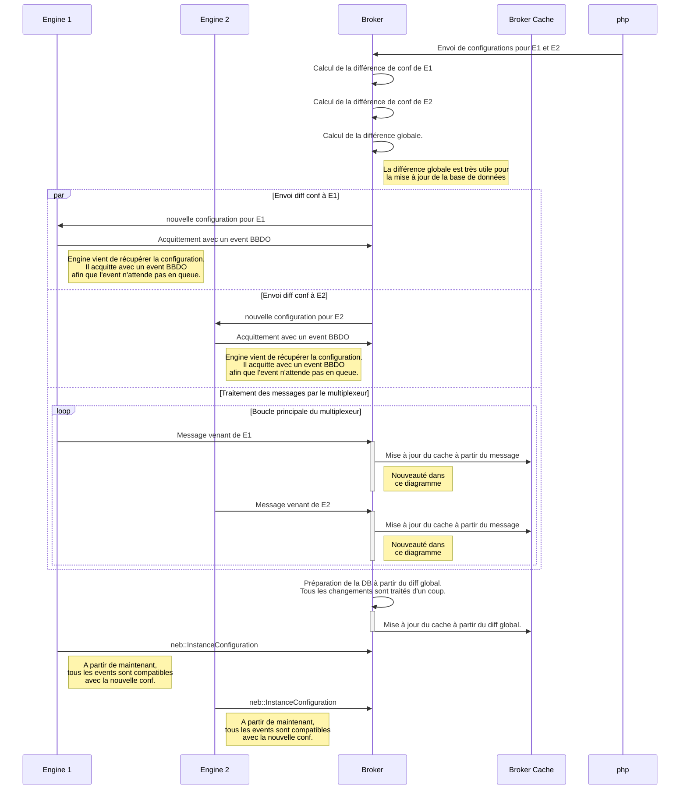
```mermaid
sequenceDiagram
    participant E1 as Engine 1
    participant E2 as Engine 2
    participant B as Broker
    participant C as Broker Cache
    participant php
    php ->> B: Envoi de configurations pour E1 et E2
    B ->> B: Calcul de la différence de conf de E1
    B ->> B: Calcul de la différence de conf de E2
    B ->> B: Calcul de la différence globale.
    Note right of B: La différence globale est très utile pour<br/>la mise à jour de la base de données
    par Envoi diff conf à E1
        B ->> E1: nouvelle configuration pour E1
        E1 ->> B: Acquittement avec un event BBDO
        Note right of E1: Engine vient de récupérer la configuration.<br/> Il acquitte avec un event BBDO<br/>afin que l'event n'attende pas en queue.
    and Envoi diff conf à E2
        B ->> E2: nouvelle configuration pour E2
        E2 ->> B: Acquittement avec un event BBDO
        Note right of E2: Engine vient de récupérer la configuration.<br/> Il acquitte avec un event BBDO<br/>afin que l'event n'attende pas en queue.
    and Traitement des messages par le multiplexeur
        loop Boucle principale du multiplexeur
            E1 ->> B: Message venant de E1
            activate B
            B ->> C: Mise à jour du cache à partir du message
            Note right of B: Nouveauté dans<br/>ce diagramme
            deactivate B
            E2 ->> B: Message venant de E2
            activate B
            B ->> C: Mise à jour du cache à partir du message
            Note right of B: Nouveauté dans<br/>ce diagramme
            deactivate B
        end
    end

    B ->> B: Préparation de la DB à partir du diff global.<br/>Tous les changements sont traités d'un coup.
    activate B
    B ->> C: Mise à jour du cache à partir du diff global.
    deactivate B
    E1 ->> B: neb::InstanceConfiguration
    Note right of E1: A partir de maintenant,<br/> tous les events sont compatibles<br/> avec la nouvelle conf.
    E2 ->> B: neb::InstanceConfiguration
    Note right of E2: A partir de maintenant,<br/> tous les events sont compatibles<br/> avec la nouvelle conf.
```

Le comportement de `Broker` est adapté avec l'ajout du cache centralisé.

**Remarques.**

1. Un point intéressant est de voir si on peut appliquer un DiffState au cache directement avant même l'écriture
en base de données. Ça simplifierait l'écriture du cache. Par contre, cela peut poser des soucis au moment
de la mise à jour de la base de données car elle utilise beaucoup le cache.

2. Sinon, on peut mettre le cache à jour au fur et à mesure de l'écriture dans la base de données. Mais que
se passe t-il si un jour la base est supprimée ?

Dans le cas où la mise à jour du cache est faite en amont de l'écriture en base de données, on obtient le schéma
suivant :

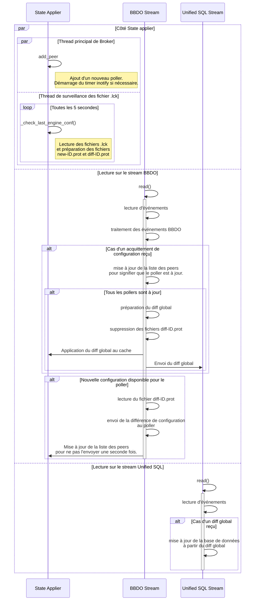
```mermaid
sequenceDiagram
    participant S as State Applier
    participant BBDO as BBDO Stream
    participant USQL as Unified SQL Stream

    par Côté State applier
        par Thread principal de Broker
            S ->> S: add_peer
            note right of S: Ajout d'un nouveau poller.<br/>Démarrage du timer inotify si nécessaire.
        and Thread de surveillance des fichier .lck
            loop Toutes les 5 secondes
                S ->> S: _check_last_engine_conf()
                note right of S: Lecture des fichiers .lck<br/>et préparation des fichiers<br/>new-ID.prot et diff-ID.prot
            end
        end
    and Lecture sur le stream BBDO
        BBDO ->> BBDO: read()
        activate BBDO
        BBDO ->> BBDO: lecture d'événements
        BBDO ->> BBDO: traitement des événements BBDO
        alt Cas d'un acquittement de configuration reçu
            BBDO ->> BBDO: mise à jour de la liste des peers<br/>pour signifier que le poller est à jour.
            alt Tous les pollers sont à jour
                BBDO ->> BBDO: préparation du diff global
                BBDO ->> BBDO: suppression des fichiers diff-ID.prot
                BBDO ->> S: Application du diff global au cache
                BBDO ->> USQL: Envoi du diff global
            end
        end
        alt Nouvelle configuration disponible pour le poller
            BBDO ->> BBDO: lecture du fichier diff-ID.prot
            BBDO ->> BBDO: envoi de la différence de configuration<br/>au poller
            BBDO ->> S: Mise à jour de la liste des peers<br/>pour ne pas l'envoyer une seconde fois.
        end
        deactivate BBDO
    and Lecture sur le stream Unified SQL
        USQL ->> USQL: read()
        activate USQL
        USQL ->> USQL: lecture d'événements
        alt Cas d'un diff global reçu
            USQL ->> USQL: mise à jour de la base de données<br/>à partir du diff global
        end
        deactivate USQL
    end
```

## Renseignement du `poller_id` des hosts dans le cache

### Le problème

Dans le message protobuf `State` (envoyé par Engine sous forme d'événement
`pb_engine_state`), le champ `poller_id` est positionné au **niveau du message**
— c'est-à-dire que `state.poller_id()` est non nul et identifie le poller.
Cependant, les objets `Host` individuels contenus dans `state.hosts()` ne portent
**pas** leur propre champ `poller_id` : ils n'ont que `host_id`, `host_name` et
d'autres attributs spécifiques au host. Il en va de même pour les objets
`DiffHost` dans les messages `DiffState`.

C'est important car `broker_cache` stocke les hosts dans un conteneur multi-index
`_hosts`, et les objets `Host` mis en cache doivent avoir un `instance_id`
(= `poller_id`) valide pour que la logique de suppression des liens de groupe dans
`apply()` fonctionne correctement. Quand un servicegroup ou un hostgroup est
supprimé d'un poller, le code itère sur tous les liens service/host-group et
n'efface que ceux dont le host appartient au poller concerné, via la comparaison :

```
host->obj().instance_id() == sgp.poller_id()
```

Si `instance_id` vaut 0 parce que le host n'a jamais reçu de `poller_id` valide,
cette comparaison échoue toujours et aucun lien n'est jamais supprimé.

### Le correctif — deux changements complémentaires

**1. `_fill_host()` accepte un `poller_id_hint`**

Le helper privé `broker_cache::_fill_host()` accepte désormais un paramètre
optionnel `poller_id_hint`. Quand `cfg.poller_id() == 0` (ce qui est toujours le
cas pour les hosts provenant d'un `pb_engine_state`), le hint est utilisé à la
place :

```cpp
uint64_t pid = cfg.poller_id() != 0 ? cfg.poller_id() : poller_id_hint;
```

`merge()` passe `state.poller_id()` comme hint :

```cpp
_fill_host(&h->mut_obj(), host, state.poller_id());
```

**2. `indexed_diff_state::add_diff_state()` estampille les hosts avec `poller_id`**

Avant la publication du diff global, `add_diff_state()` agrège tous les diffs
par poller. Sur le chemin full-state comme sur le chemin différentiel, le lambda
de construction de clé pour les hosts appelle désormais explicitement
`obj->set_poller_id(poller_id)` avant de retourner la clé :

```cpp
// Chemin full-state
_add_message<Host, uint64_t>(
    diff_state.mutable_state()->mutable_hosts(), ...,
    [poller_id = diff_state.poller_id()](Host* obj) {
      obj->set_poller_id(poller_id);   // estampillage avant extraction de la clé
      return obj->host_id();
    });

// Chemin différentiel
_add_diff_message<DiffHost, Host, uint64_t>(
    diff_state.mutable_hosts(), ...,
    [poller_id = diff_state.poller_id()](Host* obj) {
      obj->set_poller_id(poller_id);   // estampillage avant extraction de la clé
      return obj->host_id();
    });
```

Cela garantit que les objets `Host` stockés dans le diff global portent déjà un
`poller_id` valide, de sorte qu'`apply()` peut appeler `_fill_host()` sans hint
et produire quand même des entrées de cache correctement renseignées.

### Pourquoi le diff global n'a pas de `poller_id`

Le **diff global** (celui envoyé en tant que `pb_global_diff_state`) a
intentionnellement `poller_id == 0` au niveau du message, car il agrège des
changements provenant de plusieurs pollers. Chaque objet host individuel dans ce
diff global porte son propre `poller_id` (positionné par l'estampillage ci-dessus),
de sorte que l'association par host est préservée même si l'identifiant au niveau
du message est absent.

## Fonctionnement en mode *legacy*

Si la configuration centralisée n'est pas activée, le cache doit remplacer les anciens
caches de stream de manière assez analogue. Ce ne sera pas à l'identique, on sait qu'on peut
perdre avec le nouveau cache la synchronisation entre un poller et le central pendant
des mises à jour de configuration.

Lorsqu'un Engine démarre, il envoie sa configuration au Broker. Le cache est donc mis
à jour. Par contre, si le broker est redémarré, le cache est perdu. Le cache doit
donc être sauvegardé sur le disque lors de l'arrêt de Broker de manière à pouvoir
être rechargé à l'identique au redémarrage de Broker.

Dans le cas *legacy*, on obtient donc un fonctionnement de la forme :

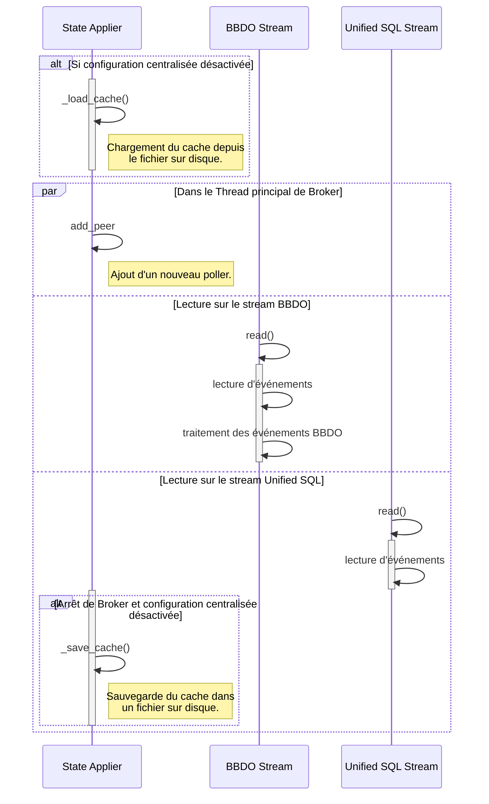
```mermaid
sequenceDiagram
    participant S as State Applier
    participant BBDO as BBDO Stream
    participant USQL as Unified SQL Stream

    alt Si configuration centralisée désactivée
        activate S
        S ->> S: _load_cache()
        note right of S: Chargement du cache depuis<br/>le fichier sur disque.
        deactivate S
    end
    par Dans le Thread principal de Broker
        S ->> S: add_peer
        note right of S: Ajout d'un nouveau poller.
    and Lecture sur le stream BBDO
        BBDO ->> BBDO: read()
        activate BBDO
        BBDO ->> BBDO: lecture d'événements
        BBDO ->> BBDO: traitement des événements BBDO
        deactivate BBDO
    and Lecture sur le stream Unified SQL
        USQL ->> USQL: read()
        activate USQL
        USQL ->> USQL: lecture d'événements
        deactivate USQL
        activate S
        alt Arrêt de Broker et configuration centralisée désactivée
            S ->> S: _save_cache()
            note right of S: Sauvegarde du cache dans<br/>un fichier sur disque.
        end
        deactivate S
    end
```

Un point d'attention sur le mode *legacy* et peut-être aussi en configuration centralisée concerne
les index mappings et les metric mappings. Ces deux objets sont stockés de manière très complète dans
le cache d'`unified_sql`. Ils sont obtenus en grande partie grace à une requête SQL faite lors du démarrage
du stream.

Lorsque les autres streams utilisent ces deux informations, ils en utilisent une petite partie.

Plusieurs points :

* inutile de sauvegarder dans le fichier de cache ces informations puisqu'elles sont récupérées au démarrage et
qu'elles seront beaucoup plus à jour. Surtout que le php peut aussi y écrire directement.
* cela signifie aussi que le cache, même s'il est en grande partie mis à jour par la configuration et par les envois
d'`engine`, est aussi mis à jour par les requêtes SQL faites au démarrage d'`unified_sql` et pour le moment il
semble difficile de s'en passer.
* Le plus simple est de mettre à jour les metrics et `index_mapping` qu'en passant par `unified_sql`. Et le cache n'a
pas à faire de requête SQL pour les récupérer.

En dehors de `unified_sql`, le seul stream à utiliser `index_mapping` est le stream lua.

Habituellement, ce stream est sur le broker central donc il a bien accès à la donnée.

Par contre, le jour où on veut déplacer le stream lua sur un broker déporté, `index_mapping` n'est plus
disponible.

## Evolutions possibles

Plutôt que d'accéder au cache en écriture depuis `unified_sql`, on pourrait passer par le multiplexeur.
L'`index_mapping` pourrait être transmis aux brokers voisins. Ça résoudrait déjà le souci du stream lua.

Une seconde évolution serait que le cache devienne un module broker. Ce cache pourrait être porté par un broker
et les brokers voisins pourraient y accéder en lecture/écriture via des messages BBDO. Cette solution est
particulièrement intéressante avec le cluster de brokers.

# Rétention et stream RRD

## Problème actuel

Lorsqu'un Engine est déconnecté pendant une longue période (ex. : une semaine), il
accumule des données en rétention. À la reconnexion, Broker reçoit ces données dans
l'ordre d'émission d'Engine, c'est-à-dire les plus anciennes en premier. Pendant
toute la durée de transmission de la rétention, les données actuelles ne sont pas
visibles.

Ce comportement pose deux problèmes distincts :

1. **Visibilité** : les données actuelles (état de monitoring en temps réel) ne
   parviennent à Broker qu'une fois toute la rétention transmise.
2. **Écriture RRD** : RRD impose que les données soient insérées en ordre
   chronologique strict. Toute valeur antérieure au dernier timestamp écrit est
   silencieusement rejetée. Il est donc impossible d'insérer des données dans le
   passé une fois que des données récentes ont été écrites.

## Architecture proposée

### Vue d'ensemble

L'idée centrale est de séparer le flux de données en deux canaux dès la reconnexion :

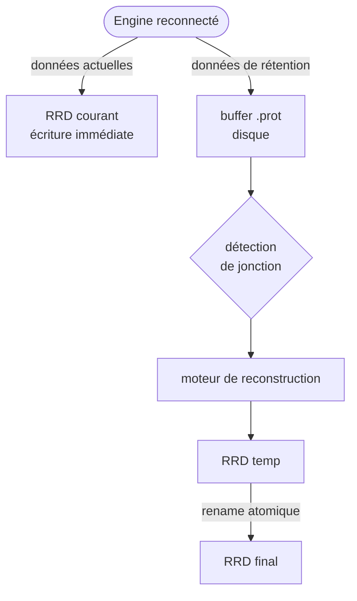
```mermaid
flowchart TD
    E([Engine reconnecté])
    E -->|données actuelles| RRD[RRD courant\nécriture immédiate]
    E -->|données de rétention| BUF[buffer .prot\ndisque]
    BUF --> J{détection\nde jonction}
    J --> MR[moteur de reconstruction]
    MR --> TMP[RRD temp]
    TMP -->|rename atomique| RRD2[RRD final]
```

Les données actuelles sont écrites immédiatement dans le RRD courant, garantissant
leur visibilité sans délai. Les données de rétention sont stockées dans un buffer
intermédiaire en mémoire (et sur disque si besoin) et intégrées ultérieurement via
un merge.

### Phase 1 : Reconnexion


```mermaid
gantt
    dateFormat X
    axisFormat %s
    section RRD courant
        données normales   : 0, 10
        vide (trou)        : crit, 10, 20
        données actuelles  : 20, 30
    section Buffer .prot
        données de rétention en attente : active, 10, 20
```

- Le RRD courant contient les données d'avant la déconnexion et les données
  actuelles (après reconnexion). La période de déconnexion reste un trou dans le
  RRD.
- Le buffer `.prot` accumule les données de la période de déconnexion au fur et à
  mesure qu'Engine les retransmet.

### Phase 2 : Détection de la jonction

La jonction est atteinte lorsque la dernière donnée du buffer et la première donnée
post-reconnexion du RRD courant sont séparées d'au plus un step (paramétrable,
5 minutes par défaut) :

```mermaid
gantt
    dateFormat X
    axisFormat %s
    section Buffer .prot
        données de rétention : 10, 19
    section RRD courant
        données actuelles    : 20, 30
    section Jonction
        écart ≤ step         : milestone, 19, 20
```

Cette condition est fiable car le step est connu statiquement pour chaque métrique.

### Phase 3 : Merge via le moteur de reconstruction

Une fois la jonction détectée (ou sur déclencheur externe), le moteur de
reconstruction produit un nouveau fichier RRD complet :

```mermaid
flowchart LR
    BUF["fichiers .prot\n(tri chrono)"]
    RRD["RRD courant\n(rrd_fetch)"]
    MS["merge-sort externe\n(mémoire bornée)"]
    TMP[RRD temp]
    OUT[RRD final]

    BUF -->|flux| MS
    RRD -->|flux| MS
    MS --> TMP
    TMP -->|rename atomique| OUT
```

Le merge-sort externe garantit une consommation mémoire bornée quelle que soit la
quantité de données en attente : chaque source est lue séquentiellement, seule la
tête de chaque flux est en mémoire à un instant donné.

## Format du buffer

### Fichiers `.prot`

Le buffer utilise des messages protobuf *length-delimited* écrits en *append* :

```protobuf
message MetricPoint {
  uint32 metric_id = 1;
  int64  timestamp = 2;
  double value     = 3;
}
```

Les fichiers sont co-localisés avec les fichiers `.rrd`, dans les répertoires
`metrics_path` et `status_path` de l'endpoint RRD (paramètres JSON) :

```
{metrics_path}/<metric_id>.prot              ← flush arrêt gracieux
{metrics_path}/<metric_id>.<ts>.prot         ← roté, immuable, en attente de merge
{status_path}/<index_id>.prot
{status_path}/<index_id>.<ts>.prot
```

Exemple en production :

```
/var/lib/centreon/metrics/42.prot
/var/lib/centreon/metrics/42.1735000000.prot
/var/lib/centreon/status/7.prot
```

La rotation se déclenche quand le nombre de points cumulé dans le batch en mémoire
atteint `retention_buffer_max_pending_points` (défaut : **144**, soit 12 heures à
un point toutes les 5 minutes). L'horodatage Unix est inséré avant `.prot` dans
le nom des fichiers rotatés.

Un fichier est **immuable** une fois roté : il peut être lu en streaming pendant le
merge sans verrouillage. Après un merge réussi, les fichiers `.prot` correspondants
sont supprimés.

### Déclencheurs du merge

| Déclencheur | Description |
|---|---|
| Jonction détectée | Buffer a rattrapé le RRD courant (écart ≤ step) |
| Nombre de fichiers | Nombre de fichiers rotatés atteint `retention_buffer_max_files` (défaut : 5) |
| Schedule | Merge nocturne à faible charge |
| Manuel | Commande d'administration explicite |

Le paramètre `retention_buffer_max_files` est lu dans le bloc JSON de l'endpoint
RRD (comme `cache_size`). Quand le nombre de fichiers rotatés d'une métrique
atteint cette limite, un merge partiel est déclenché immédiatement pour libérer
de l'espace avant de continuer le buffering.

## Gestion des déconnexions multiples

Si un Engine se déconnecte plusieurs fois, les trous s'accumulent dans le buffer
sans créer de fichiers supplémentaires : le buffer accueille tous les gaps dans
la même structure `(metric_id, timestamp, value)`, quel que soit leur nombre.

```mermaid
gantt
    dateFormat X
    axisFormat %s
    section RRD courant
        actif  : 0,  5
        actif  : 10, 15
        actif  : 20, 25
        actif  : 30, 35
    section Buffer .prot
        gap 1  : active, 5,  10
        gap 2  : active, 15, 20
        gap 3  : active, 25, 30
```

Le merge reste une opération unique : toutes les données du buffer (tous gaps
confondus) sont fusionnées avec le RRD courant en un seul passage.

## Intégration avec le rebuild existant

Le rebuild RRD actuel et le merge de rétention sont structurellement identiques :
tous deux créent un RRD temporaire, écrivent en ordre chronologique depuis des
sources multiples, puis effectuent un rename atomique. Ils partagent donc le même
**moteur de reconstruction** :

```mermaid
flowchart LR
    T1([Rebuild manuel])
    T2([Jonction rétention])
    T3([Schedule nocturne])
    S1[DB historique]
    S2[fichiers .prot]
    S3[RRD courant]
    MS[merge-sort]
    TMP[RRD temp]
    OUT[RRD final]

    T1 & T2 & T3 --> MS
    S1 & S2 & S3 -->|flux| MS
    MS --> TMP -->|rename atomique| OUT
```

Conséquence pratique : un rebuild déclenché manuellement **absorbe automatiquement**
les fichiers `.buf` en attente pour les métriques concernées. Il n'y a pas de chemin
de code séparé à maintenir.

## Cas limites

### Rétention dépassée

Si la période de déconnexion est supérieure à la durée des archives RRD (ex. :
déconnexion de 3 mois pour un RRD avec 1 mois de rétention), la jonction ne peut
jamais être atteinte. Dans ce cas :

- inutile de stocker les données trop vieilles, elles sont directement jetées.
- Quand le buffer est mergé, peut-être qu'il reste quelques données hors de la fenêtre
  RRD (elles seront ignorées par RRD mais ne causent pas d'erreur)
- Les fichiers `.prot` sont supprimés après le merge, qu'il soit complet ou partiel

### Crash broker pendant le merge

Le rename atomique garantit qu'un crash pendant le merge laisse le système dans un
état cohérent : soit l'ancien RRD est intact, soit le nouveau est en place. Les
fichiers `.prot` ne sont supprimés qu'après un rename réussi.

### Reprise après crash pendant le buffering

Si Broker crashe alors que des données de rétention sont en cours de buffering
(hors merge), les fichiers `.prot` sont sur disque mais l'état en mémoire est
perdu. La reconstruction est entièrement possible sans fichier de métadonnées
séparé.

| État perdu | Source de reconstruction |
|---|---|
| `last_retention_time[id]` | dernier enregistrement du dernier `.prot` de la métrique |
| `earliest_current_time[id]` | inutile à récupérer — réinitialisé à la première donnée courante reçue |
| `last_partial_merge[id]` | premier enregistrement du plus vieux `.prot` de la métrique − 1 step |

**Fichier courant potentiellement tronqué**

Un crash en pleine écriture peut laisser le fichier courant avec un dernier
message protobuf incomplet. Au démarrage, Broker répare chaque fichier courant :
il le lit séquentiellement jusqu'au dernier message *complet* (le format
length-delimited permet de détecter l'incomplétude) puis tronque le fichier à cet
offset. Les fichiers rotatés sont toujours intacts par définition (immuables dès
la rotation).

**Algorithme de démarrage**

```
pour chaque métrique ayant des fichiers .prot :
  1. réparer le fichier courant si nécessaire (truncate au dernier message valide)
  2. lire le dernier enregistrement → last_retention_time
  3. last_partial_merge = premier enregistrement du plus vieux fichier − step
  4. vérifier immédiatement la condition de jonction
     (peut-être atteinte avant le crash)
```

`earliest_current_time` est réinitialisé à « inconnu » ; la détection de jonction
reprend naturellement dès la première donnée courante reçue.

**Données en mémoire non encore flushées**

Le buffer étant memory-first, les données reçues mais pas encore écrites sur disque
au moment du crash sont définitivement perdues. Il s'agit de données de rétention
— donc déjà dans le passé — dont l'absence agrandit légèrement le trou dans le
graphe sans affecter le monitoring en temps réel. Ce compromis est acceptable : un
flush synchrone après chaque enregistrement serait trop coûteux, et un flush
périodique ajouterait de la complexité pour un bénéfice marginal sur des données
qui sont de toute façon hors ligne.

## Concurrence

Le `retention_buffer` est accédé depuis deux chemins simultanés :

- **Write path** : réception de données depuis `output::write()` (thread du muxer)
- **Merge path** : lecture des fichiers `.prot` et reconstruction du RRD (thread
  Asio via `asio::post`)

La propriété fondamentale qui simplifie la synchronisation est que les **fichiers
rotatés sont immuables** : le write path écrit toujours dans le fichier *courant*
de la métrique, le merge path lit toujours les fichiers *rotatés*. Ces deux
opérations ne se disputent jamais le même fichier — sauf au moment de la rotation.

**Modèle : mutex par métrique**

```cpp
struct MetricRetentionState {
  absl::Mutex           mutex;
  int                   current_fd;
  uint64_t              last_retention_time;
  uint64_t              earliest_current_time;
  uint64_t              last_partial_merge;
  std::vector<fs::path> rotated_files;  // immuables, lisibles sans lock
};
```

- **Write path** : acquiert le mutex, append dans `current_fd`, met à jour les
  timestamps, vérifie la condition de jonction, relâche. Section critique :
  quelques microsecondes.
- **Déclenchement du merge** : acquiert le mutex, effectue la rotation (ferme
  `current_fd`, l'ajoute à `rotated_files`, ouvre un nouveau fichier), relâche
  immédiatement. Puis lit les `rotated_files` **sans lock** (immuables). La
  section critique se limite à la rotation, pas à la durée du merge.
- **Après merge** : acquiert le mutex, met à jour `last_partial_merge`, supprime
  les fichiers mergés, relâche.

La contention est donc réduite à quelques microsecondes par rotation. Le merge
lui-même (potentiellement plusieurs secondes pour des fichiers volumineux) s'exécute
entièrement sans aucun verrou.

## Plan de migration

La transformation du module RRD actuel vers cette nouvelle architecture se fait en
quatre étapes séquentielles, résumées dans le diagramme suivant :

```mermaid
flowchart LR
    E1["Étape 1\nComposant retention_buffer\n(fichiers .prot)"]
    E2["Étape 2\nBifurcation output.cc\n(courant / rétention)"]
    E3["Étape 3\nDétection de jonction\n(timer Asio)"]
    E4["Étape 4\nMoteur de reconstruction\nunifié"]

    E1 --> E2
    E2 --> E3
    E3 --> E4
```

Aucun changement de protocole n'est nécessaire : Broker détermine lui-même si une
donnée est en rétention en comparant son horodatage à `now - step[id]`. Si le
timestamp est plus ancien que ce seuil, la donnée est considérée comme de la
rétention et aiguillée vers le buffer ; sinon elle va directement dans le RRD.

**Origine de `step` et `rrd_len`**

Le module RRD n'a pas accès à la base de données. Ces deux valeurs sont portées
directement par les événements `pb_metric` et `pb_status` via les champs
`interval()` et `rrd_len()`. Dès le premier événement reçu pour une métrique,
`step[id]` et `rrd_len[id]` sont connus et stockés dans le `MetricRetentionState`.
Au redémarrage après crash, ces valeurs sont récupérées depuis le premier événement
reçu pour chaque métrique — aucune persistance supplémentaire n'est nécessaire.

Les événements reçus par le module RRD sont `storage::pb_metric` (métriques) et
`storage::pb_status` (états). Ces messages sont volumineux ; avant d'être stockés
dans le buffer ils sont convertis en messages protobuf compacts définis dans un
fichier interne au module RRD (`broker/rrd/proto/rrd_retention.proto`) — ce format
n'est jamais transmis sur le réseau :

```protobuf
message MetricRetentionPoint {
  uint64 time  = 1;
  double value = 2;
}

message StatusRetentionPoint {
  uint64 time   = 1;
  uint32 status = 2;
}

// Chaque fichier .prot sur disque contient exactement un de ces messages batch.
message MetricRetentionBatch {
  repeated MetricRetentionPoint points = 1;
}

message StatusRetentionBatch {
  repeated StatusRetentionPoint points = 1;
}
```

Les points s'accumulent dans un **batch protobuf en mémoire** (`MetricRetentionBatch`
ou `StatusRetentionBatch`). Le batch n'est sérialisé sur disque que lorsqu'il
atteint le seuil de rotation configuré, ou à la destruction du manager (arrêt
gracieux). Chaque fichier `.prot` sur disque contient donc exactement un message
batch.

Le `retention_manager` crée **un fichier `.prot` par métrique et par status**,
co-localisé avec les fichiers `.rrd` :

- `<metric_id>.prot` dans `metrics_path` pour les métriques
- `<index_id>.prot` dans `status_path` pour les états

Cette organisation par identifiant est essentielle pour le merge (Étape 4) : à
la jonction de la métrique X, on ouvre uniquement les fichiers de rotation de X,
sans scanner de données étrangères.

### Étape 1 — Composant `retention_manager` ✅ implémenté

Le composant `broker/rrd/src/retention_manager.cc` (+ `.hh`) est responsable
de :

- Accumuler les points `MetricRetentionPoint` / `StatusRetentionPoint` dans des
  batchs protobuf en mémoire (`MetricRetentionBatch` / `StatusRetentionBatch`),
  un batch par identifiant métrique/status.
- Flusher un batch vers un fichier `.prot` roté lorsque le nombre de points
  cumulés atteint `retention_buffer_max_pending_points` (défaut : **144**). Ce
  paramètre est lu dans la config JSON de l'endpoint RRD.
- Sérialiser les batchs restants en mémoire sur disque à l'arrêt gracieux
  (`~retention_manager()`), pour ne perdre aucune donnée entre deux démarrages.
- Scanner `metrics_path` et `status_path` lors du `init()` pour récupérer les
  fichiers laissés par une instance précédente (reprise après crash).
- Maintenir `last_activity_time` par identifiant pour détecter et nettoyer les
  buffers orphelins après `retention_buffer_orphan_interval` secondes d'inactivité.
- Maintenir en mémoire le dernier horodatage reçu par `metric_id` (et par
  `index_id` pour les status) pour permettre la détection de jonction (Étape 3).
- Stocker `step[id]` lors de la réception du premier événement pour une métrique.

Ce composant est testé indépendamment avec des données synthétiques dans
`broker/rrd/test/retention_manager.cc`.

### Étape 2 — Bifurcation dans `stream.cc` ✅ implémentée

La méthode `write()` de `stream<T>` aiguille chaque point selon son âge par
rapport à `now - step`, où `step` est toujours disponible dans l'événement lui-même
(`pb_metric::interval()` / `pb_status::interval()`) :

- `timestamp ≥ now - step` → chemin **courant** : écriture directe dans le
  backend RRD.  Enregistre `_metric_earliest_current[id]` (ou
  `_status_earliest_current[id]`) = premier horodatage courant vu pour cet
  identifiant depuis l'instanciation du stream.  Utilisé par l'Étape 3 pour
  détecter la jonction.
- `timestamp < now - step` → données **anciennes / backfill** : délégation au
  `retention_manager` uniquement.  Le backend RRD **n'est pas** appelé.

La bifurcation s'applique à `storage::pb_metric` / `storage::pb_status` (protobuf)
et aux événements legacy `storage::metric` / `storage::status`.

`_metric_earliest_current[id]` est effacé dans `_do_metric_merge()` (gap comblé)
et sur les événements remove-graph.  `cleanup_orphans()` est appelé depuis
`update()` (déclenché sur SIGHUP).

Nécessite Étape 1.

### Étape 3 — Détection de jonction ✅ implémentée

La détection est **event-driven** : la vérification se fait dans `write()` à chaque
arrivée de donnée, en O(1) par lookup dans une `unordered_map`. Aucun scan
périodique de toutes les métriques n'est nécessaire.

La supervision ne s'arrête pas pendant les downtimes : les données sont collectées
toutes les 5 minutes sans interruption. Par conséquent, un grand écart entre deux
timestamps consécutifs dans le flux de rétention (> 2 × `step`) est un signal
fiable : c'est la frontière entre deux périodes de déconnexion distinctes. C'est
le moment naturel pour vérifier la jonction du batch qui vient de se terminer.

La jonction est atteinte dès que l'une de ces deux conditions est vraie :

| Condition | Déclencheur |
|---|---|
| `last_retention[id] + step ≥ earliest_current[id]` | arrivée d'une donnée courante ou de rétention pour `id` |
| `last_retention[id] + step ≥ now` | arrivée d'une donnée de rétention (sans donnée courante connue) |

Un troisième déclencheur s'ajoute pour les fins de batch : lorsqu'une donnée de
rétention présente un écart `timestamp − last_retention[id] > 2 × step`, le batch
précédent est terminé ; on vérifie immédiatement les conditions ci-dessus pour
`last_retention[id]` avant de mettre à jour la valeur.

#### Merge partiel progressif

Lorsque le retard de rétention est important (déconnexion de plusieurs jours ou
semaines), attendre la jonction complète pour déclencher le merge signifie que
l'utilisateur ne voit aucune reconstruction sur le graphe pendant toute la durée
du rattrapage.

Pour y remédier, un **merge partiel** est déclenché dès que le buffer d'une
métrique couvre une tranche complète de durée configurable (défaut : 1 jour) depuis
le dernier merge (ou depuis le début du buffering). Chaque tranche traitée produit
un RRD valide et visible immédiatement ; l'utilisateur voit le graphe se reconstruire
jour par jour au fil de la réception des données.

Ce déclencheur est géré par le même mécanisme event-driven : à chaque arrivée de
donnée de rétention, on vérifie si
`last_retention[id] − last_partial_merge[id] ≥ partial_merge_interval`.

Le moteur de reconstruction (Étape 4) doit donc supporter les merges partiels :
fusionner uniquement les `.prot` couvrant la tranche `[last_partial_merge[id],
last_partial_merge[id] + partial_merge_interval]` sans attendre que le buffer
complet soit disponible.

Quand une jonction ou un merge partiel est détecté, le merge est déclenché de façon
asynchrone via `asio::post` pour ne pas bloquer le chemin de write.

Un timer de nettoyage gère uniquement les **buffers orphelins** : métriques dont
la rétention est présente mais dont aucune donnée n'est arrivée depuis plus de
`retention_buffer_orphan_interval` secondes (host supprimé, métrique désactivée…).
Son rôle est de libérer les ressources, pas de détecter des jonctions. Il se
déclenche à la même période `retention_buffer_orphan_interval`.

Ce paramètre est lu dans le bloc JSON de l'endpoint RRD (comme `cache_size`) avec
une valeur par défaut de **3600 secondes** (1 heure). Si la clé est absente du
fichier de configuration, cette valeur par défaut s'applique.

Nécessite Étape 2.

### Étape 4 — Moteur de reconstruction unifié ✅ implémentée

Étendre le mécanisme de rebuild RRD existant (séquence START / DATA / END) pour
qu'il accepte en entrée soit :

- Un rebuild déclenché manuellement (comportement actuel), soit
- Le résultat d'une jonction détectée (Étape 3).

Dans les deux cas, le moteur :

1. Lit les fichiers `.prot` concernés par ordre chronologique (merge-sort externe
   à mémoire bornée).
2. Fusionne avec les données courantes déjà dans le RRD via `rrd_fetch`.
3. Écrit un nouveau fichier RRD temporaire en ordre strictement croissant.
4. Substitue atomiquement le nouveau RRD à l'ancien via `rename(2)`.
5. Supprime les fichiers `.prot` fusionnés.

Le chemin de code du rebuild manuel existant devient alors un cas particulier de
ce moteur : pas de changement visible pour les utilisateurs qui déclenchent un
rebuild via l'interface.

**Compatibilité librrd / rrdcached**

Le module RRD peut fonctionner avec deux backends : `librrd` (écriture directe)
ou `rrdcached` (écriture via un daemon qui batche les updates). Le moteur de
reconstruction doit adapter son comportement selon le backend actif :

| Étape | librrd | rrdcached |
|---|---|---|
| Avant `rrd_fetch` (étape 2) | rien | `FLUSH <path>` — force l'écriture des données en attente dans rrdcached |
| Après `rename(2)` (étape 4) | rien | `FORGET <old_path>` — purge la queue interne de rrdcached pour l'ancien chemin |

Sans le `FLUSH`, `rrd_fetch` lirait un fichier incomplet (données récentes encore
dans le buffer de rrdcached). Sans le `FORGET`, rrdcached tenterait d'écrire dans
un chemin inexistant ou incorrect après le rename.

Le mécanisme de rebuild existant gère déjà probablement le `FLUSH` ; le `FORGET`
après rename est le point à vérifier lors de l'implémentation.

# Remote Servers et configuration centralisée

Un **remote server** est un nœud intermédiaire entre le central et un groupe de pollers. Il possède sa propre instance `cbd` et sa propre base de données locale. Ses pollers Engine se connectent à son `cbd` local — ils ne voient pas directement le central.

## Situation actuelle

Le mécanisme de configuration centralisée tel qu'il est implémenté aujourd'hui ne couvre que les pairs de type `ENGINE` :

```cpp
if (peer_type() == common::ENGINE &&
    _state.engine_peer_needs_update(poller_id())) {
```

Un remote server se connecte au central en tant que pair `BROKER`. Il ne reçoit donc aucun diff de configuration. Ses pollers locaux ne sont pas visibles du central et ne reçoivent jamais leur configuration centralisée.

## Identification d'un relais

### Central vs relais

Le central et un relais ont tous les deux des connexions BBDO entrantes (depuis des pollers ou d'autres relais) et des connexions BBDO sortantes (vers rrd pour le central, vers le central pour le relais). La présence d'un output CBD seul ne suffit donc pas à les différencier.

**Le vrai discriminant est `pollers_config_dir`** : le central est configuré avec un répertoire `pollers_config_dir` où PHP dépose les fichiers `.prot`. Un relais ne l'a pas.

```cpp
bool supports_centralized_conf() const override {
  return !_pollers_config_dir.empty();
}
```

| | Central | Relais |
|---|---|---|
| `pollers_config_dir` | configuré | vide |
| `supports_centralized_conf()` | `true` | `false` |
| Output BBDO | vers rrd | vers le central |
| Réception `ConfigRequest` | traite (répond avec `DiffState`) | forward vers l'upstream |

### Comportement sur réception d'un ConfigRequest

Quand un `bbdo_stream` reçoit un `ConfigRequest` pour le poller N :

- `supports_centralized_conf() == true` → on est le **central** : rechercher le `.prot` de N et répondre avec `DiffState`.
- `supports_centralized_conf() == false` → on est un **relais** : enregistrer `_engine_peers[N].via_remote`, puis forwarder le `ConfigRequest` sur le stream CBD output.

### Auto-détection du mode relais

Aucun nouveau `PeerType` et aucun flag dans le `Welcome` ne sont nécessaires. Un cbd se détecte automatiquement comme relais dès que les trois conditions suivantes sont réunies :

1. **BBDO3 actif** — la configuration centralisée est activée
2. **Au moins une connexion entrante d'un Engine** — ce cbd reçoit des pollers
3. **`supports_centralized_conf() == false` et au moins une connexion sortante vers un CBD** — ce cbd est connecté à un broker amont sans être lui-même le central

Dès qu'il est en mode relais, un cbd envoie un `ConfigRequest` au central pour chaque poller Engine qui se connecte. C'est via ces `ConfigRequest` que le central découvre la topologie — pas depuis le `Welcome`. Il n'y a aucune déclaration explicite : le comportement du relais se manifeste de lui-même.

## Nouveaux messages BBDO

Un nouveau message permet au remote de demander la configuration d'un poller au central. La réponse est un `DiffState` ordinaire — le même message que le central envoie à un Engine connecté directement.

```proto
message ConfigRequest {
  uint64 poller_id      = 1;
  string config_version = 2;  // hash du .prot local pour ce poller
                               // vide si le remote n'a pas de cache pour ce poller
}
// Le central répond avec un DiffState standard.
```

Le central compare `config_version` avec sa propre version pour ce poller et répond :
- `config_version` vide **ou** central ne connaît pas N → `DiffState{unknown=true}`
- versions identiques → `DiffState` vide (aucun changement, rien à faire)
- central a une version plus récente → `DiffState{diff}`

Le remote traite ce `DiffState` de la même façon qu'un Engine direct : qu'il soit reçu en réponse à un `ConfigRequest` ou en push depuis le central (scénario 2), le comportement est identique. C'est le même mécanisme que la négociation directe Engine↔central (champ `engine_conf` du `Welcome`), déporté d'un niveau via le remote.

## Topologie dans broker\_cache

La topologie (quel poller est derrière quel remote) est encodée directement dans le champ `via_remote` des entrées `engine_peer` de `_engine_peers`. Quand le remote R envoie `ConfigRequest {poller_id=N}`, le central crée (ou met à jour) une entrée `engine_peer{poller_id=N, via_remote=R}` dans `_engine_peers`. Lors d'un push PHP, le central consulte `_engine_peers[N].via_remote` pour savoir vers quel remote router le diff.

Le central n'a qu'une vue partielle : pour une chaîne `N → R2 → R1 → central`, il voit uniquement `via_remote=R1`. R2 lui est opaque.

Il n'y a pas de table `remote_relay` séparée dans `broker_cache` : l'information est dérivée de `_engine_peers`. `broker_cache` reste responsable de la **persistance** de la topologie via `topology.cache` (voir section suivante), qui stocke les paires `(poller_id, remote_id)` pour reconstituer les hints au redémarrage.

## Persistance de la topologie

`broker_cache` est aujourd'hui purement en mémoire. En configuration centralisée, la partie topologie doit être persistée pour survivre à un redémarrage du central.

À l'arrêt propre, le central écrit un fichier `topology.cache` (protobuf). Au démarrage, il le recharge comme **hint** : la topologie est considérée valide jusqu'à preuve du contraire. Les `ConfigRequest` entrants au fur et à mesure des reconnexions des remotes corrigent ou confirment chaque entrée.

En cas de crash (pas d'arrêt propre), `topology.cache` est absent ou périmé. Ce n'est pas bloquant : le central démarre sans topologie et la reconstruit à mesure que les remotes se reconnectent. Les diffs PHP produits pendant cette fenêtre sont mis en attente.

## Scénario 1 : connexion d'un poller au remote

Un poller Engine se connecte au remote. Deux situations sont possibles selon que le remote est lui-même connecté ou non au central.

Le remote ne peut pas savoir si sa copie locale de la config de N est à jour sans interroger le central — quand la connexion est établie, il fait avec ce qu'il a à sa disposition.
Mais il envoie aussi un `ConfigRequest`. Quand la connexion est établie, ça lui permet de récupérer la dernière mise à jour de configuration de ce poller et dans ce cas
de notifier le poller qu'une nouvelle configuration est disponible.

Les configurations n'évoluent pas tant que ça et donc la plupart du temps, le remote est au courant de la dernière configuration.
Inutile d'attendre à chaque fois une réponse du central pour que le poller démarre.

```mermaid
sequenceDiagram
    participant E as Engine (poller N)
    participant R as Remote Broker
    participant C as Central Broker

    E->>R: Welcome {poller_id=N, engine_conf=version_E}

    alt Remote connecté au central
        opt Remote a N.prot en cache local (version_R ≠ version_E)
            Note over R,E: Service immédiat — pas d'attente du central
            R->>E: pb_diff_state {conf locale de N}
            E->>R: pb_diff_state_ack
        end

        R->>C: ConfigRequest {poller_id=N, config_version=version_R ou ""}
        C->>C: _engine_peers[N].via_remote ← R

        alt Central a une config plus récente → DiffState{diff}
            C->>R: DiffState {diff-N}
            R->>R: met à jour N.prot (→ version_R')
            R->>E: pb_diff_state {diff-N}
            E->>R: pb_diff_state_ack
            R->>C: pb_diff_state_ack
        else Central ne connaît pas N → DiffState{unknown=true}
            C->>R: DiffState {unknown=true}
            alt Remote a N.prot en cache local
                Note over R: Engine déjà servi — sync cache local vers central uniquement
                R->>C: pb_diff_state {conf locale de N}
                C->>C: crée N.prot
            else Remote n'a pas de cache pour N
                R->>E: pb_diff_state {unknown=true}
                E->>R: pb_diff_state {état complet}
                R->>R: stocke N.prot localement
                R->>C: pb_diff_state {état complet de N}
                C->>C: crée N.prot
            end
        else Central est à jour → DiffState{vide}
            Note over R: Cache local déjà à jour, rien à faire
        end

    else Remote non connecté au central
        alt Remote a N.prot en cache local
            R->>E: pb_diff_state {conf locale de N}
            E->>R: pb_diff_state_ack
        else Remote n'a pas de cache pour N
            R->>E: pb_diff_state {unknown=true}
            E->>R: pb_diff_state {état complet}
            R->>R: stocke N.prot localement
        end
        Note over R: Synchronisation avec le central à la reconnexion (voir Scénario 3)
    end
```

## Scénario 1b : chaîne de relais (multi-hop)

Ce scénario généralise le Scénario 1 à une topologie avec plusieurs relais en série.

```mermaid
graph LR
    E["Engine\n(poller N)"]
    R2["R2\n(relais direct)"]
    R1["R1\n(relais intermédiaire)"]
    C["Central Broker"]

    E -- BBDO --> R2
    R2 -- BBDO --> R1
    R1 -- BBDO --> C
```

R2 est le relais direct du poller. R1 est un relais intermédiaire entre R2 et le central.

### Routage hop-by-hop

`via_remote` reste un simple entier représentant le **saut suivant immédiat** vers le poller :

| Nœud | `_engine_peers[N].via_remote` |
|------|-------------------------------|
| Central C | `R1_id` |
| Relais R1 | `R2_id` |
| Relais R2 | `0` (connexion directe) |

Chaque relais déduit son saut suivant de **la connexion sur laquelle le `ConfigRequest` est arrivé** — pas besoin de chemin complet dans le message.

### Forwarding du ConfigRequest

Quand un relais reçoit un `ConfigRequest` pour un poller qu'il ne sert pas directement, il :
1. enregistre la connexion source comme `_engine_peers[N].via_remote` ;
2. reforwarde le `ConfigRequest` vers son upstream sans modification.

Les `DiffState` et acquittements transitent dans le sens inverse, chaque relais routant via son propre `_engine_peers[N].via_remote`.

```mermaid
sequenceDiagram
    participant E as Engine (poller N)
    participant R2 as Relais R2 (direct)
    participant R1 as Relais R1 (intermédiaire)
    participant C as Central Broker

    E->>R2: Welcome {poller_id=N, engine_conf=version_E}

    opt R2 a N.prot en cache local (version_R2 ≠ version_E)
        Note over R2,E: Service immédiat — pas d'attente (cf. Scénario 1)
        R2->>E: pb_diff_state {conf locale de N}
        E->>R2: pb_diff_state_ack
    end

    R2->>R1: ConfigRequest {poller_id=N, config_version=version_R2}
    R1->>R1: _engine_peers[N].via_remote ← R2
    R1->>C: ConfigRequest {poller_id=N, config_version=version_R2}
    C->>C: _engine_peers[N].via_remote ← R1 (R2 opaque pour le central)

    alt Central a une config plus récente → DiffState{diff}
        C->>R1: DiffState {diff-N}
        R1->>R2: DiffState {diff-N}
        R2->>R2: met à jour N.prot (→ version_R2')
        R2->>E: pb_diff_state {diff-N}
        E->>R2: pb_diff_state_ack
        R2->>R1: pb_diff_state_ack
        R1->>C: pb_diff_state_ack
    else Central ne connaît pas N → DiffState{unknown=true}
        C->>R1: DiffState {unknown=true}
        R1->>R2: DiffState {unknown=true}
        alt R2 a N.prot en cache local
            Note over R2: Engine déjà servi — sync cache vers C via R1
            R2->>R1: pb_diff_state {conf locale de N}
            R1->>C: pb_diff_state {conf locale de N}
            C->>C: crée N.prot
        else R2 n'a pas de cache pour N
            R2->>E: pb_diff_state {unknown=true}
            E->>R2: pb_diff_state {état complet}
            R2->>R2: stocke N.prot localement
            R2->>R1: pb_diff_state {état complet de N}
            R1->>C: pb_diff_state {état complet de N}
            C->>C: crée N.prot
        end
    else Central est à jour → DiffState{vide}
        C->>R1: DiffState {vide}
        R1->>R2: DiffState {vide}
        Note over R2: Caches locaux déjà à jour, rien à faire
    end
```

## Scénario 2 : configuration poussée par PHP

PHP produit une nouvelle configuration pour le poller N, qui est derrière le remote R.

```mermaid
sequenceDiagram
    participant P as PHP
    participant C as Central Broker
    participant R as Remote Broker
    participant E as Engine (poller N)

    P->>C: new-N.prot
    C->>C: calcule diff-N.prot
    C->>C: _engine_peers[N].via_remote = R → routage vers R
    C->>R: pb_diff_state {diff-N}
    R->>R: met à jour N.prot localement
    R->>E: pb_diff_state {diff-N}
    E->>E: applique la configuration
    E->>R: pb_diff_state_ack
    R->>C: pb_diff_state_ack
    C->>C: N.prot ← new-N.prot
```

## Scénario 3 : remote hors-ligne puis reconnexion

Phase 1 : le lien remote ↔ central est coupé, un ou plusieurs pollers se connectent au remote (voir Scénario 1, branche "non connecté au central").
Phase 2 : le remote se reconnecte au central.

À la fin de la négociation Welcome, le remote reconnaît que son pair est un CBD (peer_type=BROKER). Comme il est lui-même en mode relais, il itère alors tous ses `engine_peer` locaux et envoie un `ConfigRequest` par poller. C'est ce qui déclenche la resynchronisation en batch.

```mermaid
sequenceDiagram
    participant E1 as Engine (poller N)
    participant E2 as Engine (poller M)
    participant R as Remote Broker
    participant C as Central Broker

    Note over R,C: Lien Remote ↔ Central coupé
    Note over R: Pollers N et M se connectent (Scénario 1 hors-ligne)
    Note over R: R possède N.prot et M.prot en cache local

    Note over R,C: Reconnexion Remote ↔ Central

    R->>C: Welcome
    C->>R: Welcome {peer_type=BROKER}

    Note over R: Welcome reçu → R itère ses engine_peers (N, M)

    par ConfigRequest pour chaque poller connecté
        R->>C: ConfigRequest {poller_id=N, config_version=version_RN}
        C->>C: _engine_peers[N].via_remote ← R
    and
        R->>C: ConfigRequest {poller_id=M, config_version=version_RM}
        C->>C: _engine_peers[M].via_remote ← R
    end

    alt Central a une config plus récente pour N → DiffState{diff}
        C->>R: DiffState {diff-N}
        R->>R: met à jour N.prot (→ version_RN')
        R->>E1: pb_diff_state {diff-N}
        E1->>R: pb_diff_state_ack
        R->>C: pb_diff_state_ack
    else Central ne connaît pas N → DiffState{unknown=true}
        C->>R: DiffState {unknown=true for N}
        R->>C: pb_diff_state {conf locale de N}
        C->>C: crée N.prot
    else Central est à jour pour N → DiffState{vide}
        C->>R: DiffState {vide for N}
        Note over R,E1: version_RN comparée à version_EN (cf. Scénario 1)
    end

    Note over R,C: Même séquence pour M (en parallèle ou séquentiel)
```

## Scénario 4 : redémarrage du central

Le central redémarre. PHP a pu pousser une config pendant l'interruption.

```mermaid
sequenceDiagram
    participant P as PHP
    participant C as Central Broker
    participant R as Remote Broker
    participant E as Engine (poller N)

    Note over C: Arrêt propre — écrit topology.cache
    Note over C: Redémarrage — charge topology.cache
    C->>C: _engine_peers[N].via_remote = R (hint depuis topology.cache)

    P->>C: new-N.prot (pendant que R n'est pas encore reconnecté)
    C->>C: calcule diff-N.prot
    C->>C: _engine_peers[N].via_remote = R → diff mis en attente pour R

    Note over R,C: R se reconnecte au central
    R->>C: Welcome
    R->>C: ConfigRequest {poller_id=N}
    C->>C: _engine_peers[N].via_remote ← R (confirme ou corrige le hint)
    C->>R: DiffState {diff-N} (diff mis en attente envoyé)
    R->>R: met à jour N.prot localement
    R->>E: pb_diff_state {diff-N}
    E->>R: pb_diff_state_ack
    R->>C: pb_diff_state_ack
    C->>C: N.prot ← new-N.prot
```

## Migration d'un poller entre deux remotes

Un poller N passe de R1 à R2 (reconfiguration côté PHP). Quand N se connecte à R2, le central détecte la migration via `broker_state` et doit envoyer `ConfigRevoke` à R1 — mais ce message doit transiter par `bbdo_stream_1`, le stream connecté à R1, et non par `bbdo_stream_2` qui a reçu le `ConfigRequest`.

Le diagramme ci-dessous décompose le central en ses composants internes : `broker_state` gère la topologie, `bbdo_stream_1` est le stream vers R1, `bbdo_stream_2` est le stream vers R2.

```mermaid
sequenceDiagram
    participant E as Engine (poller N)
    participant R2 as Relais R2 (nouveau)
    box cbd_central
        participant S2 as bbdo_stream_2
        participant BS as broker_state
        participant S1 as bbdo_stream_1
    end
    participant R1 as Relais R1 (ancien)

    Note over BS: _engine_peers[N].via_remote = R1_id

    E->>R2: Welcome {poller_id=N, engine_conf=version_E}
    opt R2 a N.prot en cache local (version_R2 ≠ version_E)
        R2->>E: pb_diff_state {conf locale de N}
        E->>R2: pb_diff_state_ack
    end

    R2->>S2: ConfigRequest {poller_id=N, config_version=version_R2}
    S2->>BS: on_config_request(poller_id=N, relay_id=R2_id)
    Note over BS: R1_id ≠ R2_id → migration détectée
    BS->>BS: cherche le stream associé à R1_id → bbdo_stream_1
    BS->>S1: send_config_revoke(poller_id=N)
    S1->>R1: ConfigRevoke {poller_id=N}
    R1->>R1: supprime N.prot local
    BS->>BS: _engine_peers[N].via_remote ← R2_id
    BS->>S2: send_diff_state(poller_id=N)
    S2->>R2: DiffState {diff-N}
    R2->>R2: stocke N.prot localement
    R2->>E: pb_diff_state {diff-N}
    E->>R2: pb_diff_state_ack
    R2->>S2: pb_diff_state_ack
    S2->>BS: ack(poller_id=N)
```

## Endpoint gRPC GetTopology

Un endpoint gRPC expose la topologie courante du central. Il est utile pour le débogage, le monitoring et PHP.

Le central a toujours exactement **un niveau de CBD** directement connecté. Sa vue est partielle : pour une chaîne `N → R2 → R1 → central`, N apparaît comme directement derrière R1 — R2 est invisible.

```proto
// extrait de broker.proto
message PollerEntry {
  uint64 poller_id   = 1;
  string poller_name = 2;
}

message BrokerEntry {
  uint64               poller_id   = 1;
  string               broker_name = 2;
  repeated PollerEntry pollers     = 3;
}

message TopologyResponse {
  repeated BrokerEntry direct_brokers = 1; // brokers directement connectés au central
  repeated PollerEntry direct_pollers = 2; // pollers directement connectés au central (sans broker)
}
```

Exemple pour la topologie `N → R2 → R1 → central`, `M → R1 → central`, `P → central` :

```
direct_brokers:
  { poller_id: R1_id, broker_name: "r1", pollers: [
      { poller_id: N_id, poller_name: "n" },
      { poller_id: M_id, poller_name: "m" }
  ]}
direct_pollers:
  { poller_id: P_id, poller_name: "p" }
```

N apparaît derrière R1 bien qu'il soit en réalité derrière R2 — le central ne peut pas faire mieux avec les informations dont il dispose.

## Stockage des fichiers .prot

Le central reste la source de vérité pour les configs qu'il connaît. Le remote stocke localement les `.prot` de ses pollers pour pouvoir les servir en cas de déconnexion du central (scénario 3, phase 1). Cette persistance locale est aussi ce qui lui permet d'envoyer un `ConfigRequest` ciblé avec un numéro de version au moment de la reconnexion.

Un relais ne stocke que les `.prot` des pollers Engine qui lui sont **directement connectés**. Il ne stocke pas les `.prot` des relais enfants ni de leurs pollers — chaque relais est responsable de ses propres pollers directs.

## Évolution de broker\_state

L'ancienne structure `peer` unique mélangeait des champs spécifiques aux Engine et des champs génériques. Elle a été remplacée par trois structures distinctes, chacune stockée dans sa propre `flat_hash_map` indexée par `peer_key = tuple<poller_id, poller_name, broker_name>` :

```cpp
struct engine_peer {
    uint64_t    poller_id;
    std::string poller_name;
    std::string broker_name;
    time_t      connected_since;
    bool        extended_negotiation;
    std::string available_conf;      // diff disponible à envoyer à l'engine
    std::string engine_conf;         // version de config que l'engine déclare avoir
    bool        available_conf_sent;
    bool        conf_acknowledged;
    bool        conf_unknown;
};

struct broker_peer {
    uint64_t    poller_id;
    std::string poller_name;
    std::string broker_name;
    time_t      connected_since;
    bool        extended_negotiation;
};

struct unknown_peer {
    uint64_t         poller_id;
    std::string      poller_name;
    std::string      broker_name;
    time_t           connected_since;
    common::PeerType peer_type;       // type précis si connu ultérieurement
    bool             extended_negotiation;
};

// Structure de reporting retournée par connected_peers()
struct peer {
    engine_peer      ep;
    common::PeerType peer_type;
};

using peer_key = std::tuple<uint64_t, std::string, std::string>;

absl::flat_hash_map<peer_key, engine_peer>  _engine_peers
    ABSL_GUARDED_BY(_connected_peers_m);
absl::flat_hash_map<peer_key, broker_peer>  _broker_peers
    ABSL_GUARDED_BY(_connected_peers_m);
absl::flat_hash_map<peer_key, unknown_peer> _unknown_peers
    ABSL_GUARDED_BY(_connected_peers_m);
```

Trois maps séparées par type éliminent tout dispatch à l'itération : les méthodes qui opèrent sur les engine peers (`engine_peer_needs_update()`, `all_engine_peers_acknowledged()`, etc.) itèrent directement `_engine_peers` sans test de type. `connected_peers()` agrège les trois maps en un vecteur de `peer` avec le `peer_type` correct pour chaque entrée.

```cpp
// Itération ciblée sur les engine peers :
for (auto& [key, ep] : _engine_peers) {
    if (std::get<0>(key) == poller_id) { /* logique engine */ }
}

// Ajout d'un peer — suppression préalable dans les trois maps
// au cas où le type aurait changé à la reconnexion :
_engine_peers.erase(key);
_broker_peers.erase(key);
_unknown_peers.erase(key);
switch (peer_type) {
    case common::ENGINE:  _engine_peers[key]  = engine_peer{...};  break;
    case common::BROKER:  _broker_peers[key]  = broker_peer{...};  break;
    default:              _unknown_peers[key] = unknown_peer{...}; break;
}
```

## Modifications nécessaires

| Composant | Modification |
|-----------|-------------|
| `bbdo/bbdo.proto` | Ajouter `ConfigRequest` et `ConfigRevoke` |
| `broker_state` | Remplacer `_connected_peers` par trois `flat_hash_map` typées : `_engine_peers`, `_broker_peers`, `_unknown_peers` |
| `broker_cache` | Persistance de la topologie dans `topology.cache` à l'arrêt propre (paires `poller_id → remote_id`) |
| `broker_stream::read()` (central) | Détecter les `ConfigRequest` entrants ; peupler `_engine_peers[N].via_remote` ; envoyer `ConfigRevoke` sur migration |
| `broker_state` (central) | Router les diffs PHP via `_engine_peers[N].via_remote` ; mettre en attente si remote absent |
| `broker_state` (remote) | Stocker les `.prot` localement ; envoyer les `ConfigRequest` ; collecter et relayer les acks |
| `broker.proto` (gRPC) | Ajouter `GetTopology` |

## Mise en place

### Étape 1 — Nouveaux messages BBDO ( ✅ implémenté)
  Pas de test Robot à ce stade — la validation est purement à la compilation et aux tests unitaires
  (sérialisation/désérialisation des messages).

### Étape 2 — via_remote + détection relais ( ✅ implémenté)
  Idem — test unitaire sur is_relay() et la logique de détection.

### Étape 3 — ConfigRequest envoyé par le relais ( ✅ implémentée)
  → CCCRC1 (`centralized-relay-conf.robot`) : Un relay configuré reçoit un Engine. Vérifier dans
  les logs du central que `ConfigRequest{poller_id=N}` est bien reçu.

  Keywords implémentés : `Ctn Config Relay`, `Ctn Start Relay`, `Ctn Stop Relay`
  (dans `tests/resources/Broker.py` et `tests/resources/resources.resource`).

### Étape 4 — Traitement du ConfigRequest au central ( ✅ implémentée)
  → CCCRC2 (`centralized-relay-conf.robot`) : Une configuration de poller est pré-créée avant le
  démarrage du broker central. Vérifier que le central traite le fichier lck, calcule le diff, et
  envoie un `DiffState` non-unknown au relay lors de la réception d'un `ConfigRequest`.

  CCCRC1 couvre le cas unknown (central sans config → envoie `DiffState{unknown=true}`).
  CCCRC2 couvre le cas diff_ready (central avec config → envoie `DiffState` avec contenu).

### Étape 5 — Forward DiffState/ack dans le relais ( ✅ implémenté)
  → CCCRC3 (`centralized-relay-conf.robot`) : Config pré-créée pour le poller 1. Le central envoie
  un `DiffState` au relais. Le relais le met en file dans `_pending_diff_states` et le transmet à
  Engine au prochain cycle `read()` du stream ENGINE. Engine l'applique et renvoie un
  `DiffStateAck`. Le relais met l'ack en file dans `_pending_diff_state_acks` et le remonte au
  central au prochain cycle `read()` du stream BROKER. Aucun stockage local sur le relais.
  Vérifié par : log central `received diff state ack from poller 1`.
  Le handler `pb_diff_state_ack` a également été corrigé pour utiliser `obj.poller_id()` (et non
  `poller_id()`) afin que les acks forwardés soient traités correctement.

### Étape 6 — PHP push via relais ( ✅ implémentée)
  Quand PHP pousse un nouveau `.lck` pour un poller dont l'Engine est derrière un relais, le central
  doit router le DiffState résultant via le relais plutôt que de chercher un flux ENGINE direct.

  **Implémentation** : `broker_state::engine_peers_via_relay_needing_update(relay_id)` collecte les
  engine peers dont `via_remote == relay_id` avec `available_conf ≠ engine_conf` et
  `available_conf_sent == false`. Dans `broker_stream::read()`, quand `peer_type() == BROKER &&
  !is_relay()`, le central itère cette liste et pousse le `diff-N.prot` au relais — identique au
  chemin diff_ready du `ConfigRequest`, mais déclenché par le timer PHP push.

  → CCCRC4 (`centralized-relay-conf.robot`) : Config initiale établie via relais (ack reçu). Puis
  `Ctn Prepare Engine Config` ajoute 5 hôtes + `Ctn Notify Broker Of Engine Config Change` →
  vérifier dans le log du central "BBDO: sending DiffState to relay for poller 1" puis "received
  diff state ack from poller 1".

### Étape 7 — Migration + ConfigRevoke ( ✅ implémentée)
  Quand Engine N se reconnecte via un nouveau relais R2 alors qu'il était enregistré derrière R1,
  le central détecte la migration et doit envoyer `ConfigRevoke{poller_id=N}` à R1.

  **Implémentation** :
  - `broker_state::_pending_config_revokes` — `flat_hash_map<relay_id, vector<engine_id>>` protégée
    par `_connected_peers_m`.
  - `register_engine_peer_via_relay` : quand `old_relay != 0 && old_relay != relay_poller_id`,
    empile `engine_id` dans `_pending_config_revokes[old_relay]` avant de mettre à jour `via_remote`.
  - `pop_pending_config_revokes(relay_id)` : vide la file sous WriterMutex ; appelée par le flux
    BROKER de l'ancien relais dans `read()`.
  - `broker_stream::read()` (central, `BROKER && !is_relay()`) : envoie `pb_config_revoke` pour
    chaque engine dépilé.
  - `broker_stream::_handle_bbdo_event()` (relais, `pb_config_revoke`) : logue la réception et
    appelle `clear_pending_for_poller(pid)`.

  → CCCRC5 (`centralized-relay-conf.robot`) : Engine se connecte via Relay3 (poller_id=4, port 5669),
  config initiale ackée. Puis port cbmod changé en 5670, Relay4 (poller_id=5) démarré, Engine
  redémarré → Relay4 envoie ConfigRequest → central détecte la migration → envoie ConfigRevoke
  à Relay3 (vérifié dans le log relay3) + DiffState à Relay4 → ack.

### Étape 8 — Persistance de la topologie ( ✅ implémentée)
  **Implémentation** :
  - Message protobuf `TopologyCache` ajouté dans `bbdo/bbdo.proto` — format disque pour les
    paires `(poller_id, relay_id)`.
  - `broker_state::save_topology_cache()` — appelé depuis le destructeur à l'arrêt propre ;
    itère `_engine_peers` et écrit toutes les entrées avec `via_remote != 0`.
  - `broker_state::load_topology_cache()` — appelé depuis `apply()` lors du premier
    positionnement de `_pollers_config_dir` ; peuple `_engine_peers[N]` comme hints pour
    que les diffs PHP poussés pendant la coupure soient routés via `via_remote` avant que
    les relays se reconnectent.

  → CCCRC6 (`centralized-relay-conf.robot`) : Flow relay→central établi (DiffStateAck
  initial reçu). Central arrêté proprement. Nouvelle config poussée. Central redémarré.
  Vérifier que le relay se reconnecte et qu'un DiffStateAck est de nouveau reçu (le hint
  topology.cache permet le routage avant la reconnexion du relay).

### Étape 9 — gRPC GetTopology ( ✅ implémentée)
  **Implémentation** : `broker_impl::GetTopology` itère `connected_peers()` et construit un
  `TopologyResponse` avec `direct_brokers` (peers ENGINE avec `via_remote != 0` groupés sous
  leur relay) et `direct_pollers` (peers ENGINE avec `via_remote == 0`).
  Keyword Python `ctn_check_broker_topology(relay_poller_id, engine_poller_ids)` ajouté dans
  `tests/resources/Broker.py`.

  → CCCRC7 (`centralized-relay-conf.robot`) : Relay3 (poller_id=4) connecté au central avec
  Engine (poller_id=1) derrière lui. Appel de `GetTopology` sur le port gRPC du central.
  Vérifier que `direct_brokers` contient relay3 avec le poller 1 listé en dessous.

### Infrastructure Robot commune à créer dans tests/resources/ :
  - Relay.py (ou extension de Broker.py) — config/start/stop d'un relay cbd
  - Keyword Ctn Config Engine For Relay
  - Keyword Ctn Wait For Relay To Be Ready (log de connexion relay↔central)
  - Keyword Ctn Check Poller Config Via Relay (vérifie N.prot côté relay)

  Les tests vivraient dans tests/remote-servers/remote-servers.robot. On peut les créer au fil des
  étapes d'implémentation — BCSRV1 dès l'étape 3, BCSRV2/3 à l'étape 5/6, etc.

# Gestion centralisée des downtimes et acquittements

## Problème

Dans l'architecture actuelle, les downtimes et acquittements sont gérés directement par Engine.
PHP envoie des commandes à Engine, qui stocke et applique ces objets localement. Deux problèmes
distincts en découlent.

**Synchronisation BAM / Engine (problème existant)**

Le module BAM de Broker gère les *downtimes hérités* : quand un host ou service entre en
downtime, BAM peut propager ce downtime à une activité métier (Business Activity). Pour ce
faire, Broker doit créer ou supprimer des downtimes dans Engine via des commandes externes.
Or Engine reste la source de vérité de ses propres downtimes — Broker ne fait qu'y injecter
des commandes. Lors d'un redémarrage d'Engine ou de Broker, les deux peuvent se retrouver
désynchronisés : Engine a perdu les downtimes hérités que Broker pensait actifs, ou
inversement Broker ignore des downtimes qu'Engine a conservés dans sa rétention. Cette
désynchronisation provoque des fausses alertes ou des suppressions d'alertes non voulues.

**Migration Poller HA (problème à venir)**

Si un host est migré du poller A vers le poller B dans le cadre du Poller HA, les downtimes
et acquittements définis sur A ne sont pas automatiquement transférés à B. Le host arriverait
sur B sans ses downtimes actifs, risquant de générer de fausses alertes pendant une fenêtre
de maintenance.

## Solution : Broker comme source de vérité

Broker gère les downtimes et acquittements de façon centralisée, en cohérence avec son rôle de
source de vérité pour la configuration en BBDO3. PHP envoie les downtimes et acquittements à
Broker (et non plus directement à Engine). Broker les stocke de manière persistante et notifie
l'Engine concerné via de nouveaux messages BBDO.

**Broker détient toute l'intelligence du cycle de vie des downtimes.** C'est lui qui décide
quand un downtime se termine, selon les trois cas suivants :

- **Retour à OK** : quand Broker reçoit un résultat de check indiquant que la ressource repasse
  en état OK, il met fin immédiatement au downtime actif (downtime flexible déclenché ou downtime
  fixe interrompu).
- **Expiration de `end_time`** : Broker surveille l'horloge et envoie `DowntimeEnd` à l'Engine
  dès que la date de fin est atteinte.
- **Downtimes flexibles** : Broker détecte l'entrée en problème de la ressource, démarre le
  compteur de durée (`duration`), et envoie `DowntimeEnd` quand ce compteur expire.

Engine reçoit `DowntimeStart` / `DowntimeEnd` de Broker et maintient une copie locale de l'état
actif des downtimes. Cette copie sert uniquement à la suppression des notifications — Engine
n'exécute plus aucun calcul de cycle de vie ni aucun timer de downtime de son côté.

Lors d'une migration, aucune action spécifique n'est nécessaire pour les downtimes et
acquittements — ils restent dans Broker et suivent le host naturellement via le mécanisme
standard de notification décrit ci-dessous.

## Nouveaux messages BBDO

Ces messages sont envoyés par Broker à l'Engine qui supervise le host concerné :

```protobuf
// Broker → Engine : début d'un downtime sur un host ou service
message DowntimeStart {
  uint64 downtime_id = 1;   // identifiant unique attribué par Broker
  uint64 host_id     = 2;
  uint64 service_id  = 3;   // 0 pour un downtime d'host
  int64  start_time  = 4;
  int64  end_time    = 5;
  bool   fixed       = 6;
  int64  duration    = 7;   // pour les downtimes flexibles
  string author      = 8;
  string comment     = 9;
}

// Broker → Engine : fin ou annulation d'un downtime
message DowntimeEnd {
  uint64 downtime_id = 1;
  uint64 host_id     = 2;
  uint64 service_id  = 3;
}

// Broker → Engine : acquittement d'un host ou service
message AckSet {
  uint64 host_id    = 1;
  uint64 service_id = 2;   // 0 pour un acquittement d'host
  string author     = 3;
  string comment    = 4;
  bool   sticky     = 5;
  bool   notify     = 6;
}

// Broker → Engine : suppression d'un acquittement
message AckClear {
  uint64 host_id    = 1;
  uint64 service_id = 2;
}
```

Engine applique ces messages en temps réel pour supprimer ou rétablir les alertes. Il n'a plus
besoin de recevoir de commandes downtime ou ack directement depuis PHP.

## Persistance et redémarrage

Broker stocke les downtimes et acquittements dans sa base de données persistante, y compris les
downtimes futurs dont la fenêtre n'a pas encore commencé. Au redémarrage de Broker, ces objets
sont rechargés et renvoyés à chaque Engine lors de la reconnexion, au même titre que la
configuration (via le `DiffState` initial). Au redémarrage d'Engine, Broker lui renvoie
l'ensemble des downtimes et acquittements actifs pour ses hosts lors de l'envoi du `DiffState`.

## Migration et downtimes / acquittements

Lors d'une migration du poller A vers le poller B, Broker envoie à B les `DowntimeStart` et
`AckSet` correspondant aux hosts migrés immédiatement après le `DiffState(add)`, exactement
comme il le ferait pour toute reconnexion d'Engine. Engine A reçoit les `DowntimeEnd` et
`AckClear` correspondants avec le `DiffState(remove)`, pour qu'il cesse de supprimer les
alertes sur ces hosts.

Le `MigrationStateSnapshot` ne contient que l'état des checks (statuts, tentatives, perfdata).
Les downtimes et acquittements transitent par leur propre canal — le même que lors d'un
redémarrage.

# Poller HA
## Arborescence de configuration des pollers

Sans parler HA, on a la structure de fichiers suivante :
* engine:
	* 1/ fichiers de configuration du poller 1
	* 1.lck : fichier disant que broker peut récupérer la configuration du poller 1.

Ici le numero 1 représente l'ID du poller.

Actuellement, avec la configuration centralisée :

* création du fichier new-1.prot avec la configuration à l'intérieur
* Création de diff-1.prot qui contient la différence avec la configuration précédente.
* Envoi de diff-1 au poller 1.
* À l'acquittement de poller 1, on passe aux étapes suivantes:
* Mise à jour de la configuration globale pour le cache de broker
* mise à jour de la différence globale, si plusieurs configurations sont reçues simultanément, pour pouvoir faire la
mise à jour de la base de données STORAGE et celle du cache.

Avec Poller HA, nous voulons davantage d'autonomie des pollers :
* un poller s'éteint, ses ressources sont redistribuées sur les autres.
* un poller ne supporte pas sa charge, certaines de ses ressources sont redistribuées sur les autres.
* plus besoin d'affecter les ressources aux pollers, on crée un groupe de pollers, on donne la liste des ressources et
les ressources s'affectent le plus intelligemment possible.

Le groupe de pollers est ce qu'on appelle une zone. La pierre angulaire de la configuration `Engine` devient la zone.
La notion de zone remplace le poller comme unité de configuration centrale. L'architecture complète — fichiers
d'interface PHP→Broker, héritage zone→poller, activation par `min_pollers`, distribution des ressources et rebalancing —
est décrite dans la section [Architecture du protocole HA](#architecture-du-protocole-ha) ci-dessous.

## Auto-surveillance d'Engine

Pour alimenter le calcul de charge décrit ci-dessus, Engine doit se surveiller lui-même.
Dans un premier temps, deux indicateurs suffisent et sont peu coûteux à collecter :

**Latence globale** — à chaque exécution de check, Engine calcule déjà `latency = actual_start − scheduled_start` par host/service. Il suffit d'en tenir une moyenne glissante (fenêtre de N minutes, par exemple 5 min) sur l'ensemble des checks. Une latence moyenne qui dépasse un step est le premier signe de surcharge.

**Profondeur de la queue d'`events::loop`** — la boucle d'événements interne d'Engine maintient une file planifiée. Si cette file grandit de manière monotone entre deux échantillons, Engine accumule du retard plus vite qu'il ne le résorbe.

### Mise en œuvre

Un timer ASIO (`asio::steady_timer`) déclenché toutes les N secondes (par exemple 10 s) dans le thread de la boucle d'événements suffit. Il n'y a pas besoin d'un thread dédié :

```mermaid
flowchart TD
    A[events::loop] --> B["asio::steady_timer\n(toutes les 10 s)"]
    B --> C[latency_avg\nmoyenne glissante des N derniers checks]
    B --> D[queue_depth\ntaille de la file events::loop]
    C --> E["EngineHealth\n{ poller_id, latency_avg, queue_depth, timestamp }"]
    D --> E
    E --> F[log WARN\nsi seuils dépassés]
    E --> G["(phase suivante)\nmessage BBDO → Broker"]
```

Ces valeurs sont envoyées à Broker dans un message `Health` du namespace **bbdo** (pas `neb`),
ce qui garantit une livraison immédiate sans passer par la queue. Si Engine est surchargé,
c'est précisément le moment où la queue `neb` s'allonge — un message `Health` dans `neb`
serait retardé par l'overload qu'il est censé signaler.

## Architecture du protocole HA

### Vision générale

Le Poller HA combine deux mécanismes distincts qui partagent la même infrastructure de migration :

- **Load balancing** : Broker rééquilibre les hosts entre les pollers d'une zone en fonction de leur
  charge. Déclenché par seuil, pas en continu.
- **Failover** : quand un poller tombe, Broker redistribue ses hosts aux pollers survivants de la
  zone. C'est un cas particulier de migration où le poller source est mort.

Broker central ne maîtrise pas le démarrage des pollers. Le HA est donc entièrement réactif : Broker
détecte la panne et redistribue, mais ne peut pas démarrer un nouveau poller.

### La notion de zone

Une zone est un groupe de pollers pouvant superviser les mêmes ressources. À tout instant, chaque
host est assigné à **exactement un** poller de sa zone. La zone définit les pollers éligibles à
recevoir un host, pas un partage simultané.

Broker maintient une **table d'assignement** `host → poller` qui est la source de vérité. Cette table
doit être persistée pour survivre aux redémarrages de Broker.

### Mode non-HA : compatibilité et zone à un seul poller

Le Poller HA est une **option côté PHP**. Broker et Engine ignorent s'ils opèrent en mode
HA ou non — ils traitent toujours des zones, sans branche conditionnelle.

En mode libre, PHP génère des zones à un seul poller. Une zone mono-poller est sémantiquement
identique à l'ancien modèle par poller : pas de distribution, pas de migration, pas de rebalancing.
Le code Broker est le même dans les deux cas.

**`zone_id` est un identifiant stable, indépendant des `poller_id`s.**

PHP assigne les `zone_id`s dans son propre espace de nommage, distinct des `poller_id`s, dès le
premier déploiement — même pour une zone mono-poller. Broker traite les `zone_id`s de façon opaque
et ne fait jamais l'hypothèse `zone_id == poller_id`.

Cette indépendance garantit que le `zone_id` reste stable tout au long du cycle de vie de la zone :

```
# mode libre — zone mono-poller
define zone { zone_id 1001  pollers 1 }

# upgrade HA — PHP ajoute des pollers à la même zone
define zone { zone_id 1001  pollers 1 2 3 }

# rollback — PHP retire les pollers ajoutés
define zone { zone_id 1001  pollers 1 }
# → Broker migre tout vers poller 1 via le protocole habituel
# → aucun réalignement d'ID nécessaire
```

Le rollback est un cas ordinaire de mise à jour de zone : PHP renvoie un `centengine.cfg` avec un seul
poller, Broker redistribue les ressources via le protocole de migration, le `zone_id` ne change pas.

**Rétrocompatibilité : détection automatique du format**

Broker détecte le format de `centengine.cfg` à la lecture du `.lck` selon le champ présent :

- **`poller_id` présent** → ancien format. Broker génère automatiquement une zone mono-poller
  avec `zone_id = poller_id`. `pollers.cfg` n'est pas requis. L'installation existante continue
  de fonctionner sans aucun changement côté PHP.
- **`zone_id` présent** → nouveau format zone.

```
# ancien centengine.cfg — toujours supporté tel quel
poller_id=1
log_file=/var/log/centreon-engine/centengine.log
...
# → Broker crée implicitement : define zone { zone_id 1  pollers 1 }
```

PHP peut migrer progressivement, poller par poller : les anciens pollers continuent de
fonctionner pendant que les nouveaux sont déployés au format zone. Les tests Robot Framework
existants, qui utilisent le format `poller_id`, continuent de tourner sans modification.

### Interface PHP → Broker : le fichier centengine.cfg

PHP envoie un fichier `centengine.cfg` **en plus** des fichiers de configuration par poller qu'il envoie
déjà. Le format est identique aux fichiers `cfg` texte existants — l'impact côté PHP est minimal.

Le déclencheur passe de `{poller_id}.lck` à `{zone_id}.lck`.

Le répertoire de zone contient :

```
42/
  centengine.cfg       ← zone_id, liste pollers, paramètres partagés
  pollers.cfg    ← identité par poller (poller_id, poller_name)
  hosts.cfg      ← tous les hosts de la zone
  services.cfg
  commands.cfg
  contacts.cfg
  timeperiods.cfg
  hostgroups.cfg
  servicegroups.cfg
42.lck
```

`centengine.cfg` contient les paramètres Engine partagés entre tous les pollers ainsi que la structure
de la zone. `pollers.cfg` contient un bloc par poller, réduit à l'identité. Les fichiers ressources
(`hosts.cfg`, etc.) couvrent l'ensemble de la zone. Les hosts non couverts par un pattern
dans `pollers.cfg` sont libres — Broker les distribue automatiquement.

```
# centengine.cfg
define zone {
  zone_id   42
  pollers   1 3 7
  log_file  /var/log/centreon-engine/centengine.log
  ...
}

# pollers.cfg
define poller {
  poller_id    1
  poller_name  poller-paris
  hosts        paris-*
}
define poller {
  poller_id    3
  poller_name  poller-lyon
  hosts        lyon-* bordeaux-*
}
define poller {
  poller_id    7
  poller_name  poller-nice
}

# hosts.cfg — pas de poller_id dans les définitions de hosts
define host { host_name paris-web-01 }
define host { host_name lyon-db-01   }
define host { host_name srv-generic  }   # libre → aucun pattern ne correspond, Broker distribue
```

Quand Broker détecte `{zone_id}.lck`, il :

1. Lit `centengine.cfg` et `pollers.cfg`
2. Lit les fichiers ressources (`hosts.cfg`, `services.cfg`, …)
3. Calcule ou met à jour la distribution ressource → poller (voir section suivante)
4. Calcule les diffs pour les pollers **actuellement connectés** dont la configuration a changé —
   les pollers non connectés recevront leur diff au moment de leur reconnexion, par comparaison
   de leur état déclaré avec `{zone_id}.prot`
5. Stocke l'état complet de la zone dans `{zone_id}.prot`
6. Envoie `pb_diff_state` uniquement aux pollers dont la configuration a changé

### Héritage de configuration zone → poller

La zone sert de **template de configuration** pour ses pollers. Tous les paramètres de comportement
Engine peuvent être définis au niveau zone et hérités par les pollers.

**Règle de précédence** : si un paramètre est défini à la fois dans la zone et dans le poller,
**le poller a la priorité**. Un poller qui ne redéfinit pas un paramètre hérite de la valeur de la
zone.

```
config_poller_final = config_zone ← écrasé par config_poller
```

**Ce qui peut être défini au niveau zone (tout le comportement Engine) :**
- Niveaux et comportement des logs (`log_level_config`, `log_level_checks`, …)
- Intervalles et tentatives (`interval_length`, `max_check_attempts`, …)
- Timeouts de checks et notifications
- Paramètres de notifications (`enable_notifications`, …)
- Flap detection, freshness checks, event handlers
- Configuration BBDO de sortie — tous les pollers d'une zone se connectent au même Broker

**Ce qui reste obligatoirement per-poller :**
- Identité : `poller_id`, `poller_name`

Dans une architecture conteneurisée (cas cible), chaque poller tourne dans son propre container
avec un filesystem isolé. Les chemins comme `log_file`, `command_file` ou `lock_file` sont
**identiques dans chaque container** — ils peuvent donc être définis au niveau zone.

Le seul cas où ces chemins doivent être per-poller est une installation bare-metal avec plusieurs
pollers sur la même machine (cas legacy).

**Impact pratique pour PHP** : `pollers.cfg` se réduit à la pure identité. Tout le paramétrage
vit dans `centengine.cfg`.

```diff
# centengine.cfg — paramétrage complet de la zone
 define zone {
+  zone_id            42
+  pollers            1 3 7
   cfg_file           /etc/centreon-engine/42/hosts.cfg
   cfg_file           /etc/centreon-engine/42/services.cfg
   cfg_file           /etc/centreon-engine/42/commands.cfg
   cfg_file           /etc/centreon-engine/42/pollers.cfg
   log_file           /var/log/centreon-engine/centengine.log
   command_file       /var/run/centreon-engine/rw/centengine.cmd
   lock_file          /var/run/centreon-engine/centengine.pid
   log_level_checks   error
   interval_length    60
   max_check_attempts 3
   broker_host        central-broker.example.com
   broker_port        5669
 }

# pollers.cfg — pure identité
define poller {
  poller_id    1
  poller_name  poller-paris
}

define poller {
  poller_id    3
  poller_name  poller-lyon
}
```

#### Évolution du format `centengine.cfg`

Le `centengine.cfg` actuel est un fichier plat clé=valeur généré par PHP pour **un seul poller**.
Les chemins et identifiants sont propres à ce poller (le `1` dans les chemins est le `poller_id`) :

```
# centengine.cfg actuel — format plat, per-poller
cfg_file=/etc/centreon-engine/config1/hosts.cfg
cfg_file=/etc/centreon-engine/config1/services.cfg
cfg_file=/etc/centreon-engine/config1/commands.cfg
cfg_file=/etc/centreon-engine/config1/pollers.cfg
...
log_file=/var/log/centreon-engine/config1/centengine.log
command_file=/var/run/centreon-engine/config1/rw/centengine.cmd
interval_length=60
rpc_port=50002
broker_module=/usr/lib64/centreon-engine/externalcmd.so
broker_module_cfg_file=/etc/centreon-broker/central-module1.json
log_level_checks=info
...
```

Le nouveau format couvre une zone entière. Voici les changements champ par champ :

**Champs ajoutés (obligatoires)**

- `zone_id` : **remplace `poller_id`** dans `centengine.cfg` — identifiant stable de la zone (espace de nommage PHP, distinct des `poller_id`)
- `pollers` : liste espace-séparé des `poller_id` de la zone

**Champ ajouté (optionnel)**

- `min_pollers` : seuil d'activation de la zone (défaut : 1 — voir section suivante)

**Format**

Le format clé=valeur est conservé tel quel — les définitions existantes sont simplement
encadrées par `define zone {` en ouverture et `}` en fermeture (voir exemple ci-dessus).
Seuls `zone_id`, `min_pollers` et `pollers` sont ajoutés comme nouveaux champs.

**Nouveau fichier : `pollers.cfg`**

PHP doit créer ce fichier à côté de `centengine.cfg`. Il contient un bloc `define poller { }`
par poller déclaré dans `pollers`. Seuls `poller_id` et `poller_name` sont obligatoires.
Tout autre paramètre Engine dans un bloc `define poller` surcharge la valeur zone pour ce
poller uniquement (usage bare-metal : chemins et ports différents par poller).

**Récapitulatif des actions PHP**

1. Émettre **un seul** `centengine.cfg` par zone dans `{zone_id}/` au lieu d'un fichier
   par poller dans `config{poller_id}/`
2. Passer du format clé=valeur plat au bloc `define zone { ... }`
3. Créer `{zone_id}/pollers.cfg` — nouveau fichier
4. Regrouper tous les fichiers ressources dans `{zone_id}/` partagé
5. Créer `{zone_id}.lck` après avoir écrit tous les fichiers (déclenche Broker)

### Activation de la zone : min_pollers

Le paramètre `min_pollers` dans `centengine.cfg` définit le nombre de pollers attendus pour la
distribution initiale. Broker pré-découpe les ressources en `min_pollers` parts et les envoie
au fil des connexions, une part par poller.

```
define zone {
  zone_id      42
  pollers      1 3 7 53 99
  min_pollers  3            # défaut : 1
}
```

Broker pré-découpe les ressources en `min_pollers` parts de poids égal **avant** que le
premier poller se connecte. Chaque poller reçoit sa part au moment de sa première connexion,
sans que les parts déjà envoyées soient modifiées.

**Séquence de démarrage**

```
min_pollers=3, 30 ressources, pollers=[1, 3, 7]

Poller 1 se connecte → reçoit 10 ressources (1/3), pollers 3 et 7 inchangés
Poller 3 se connecte → reçoit 10 ressources (2/3), poller 1 inchangé
Poller 7 se connecte → reçoit 10 ressources (3/3), pollers 1 et 3 inchangés
```

La supervision démarre dès le premier poller connecté — sur sa fraction des ressources.
La couverture complète est atteinte quand tous les `min_pollers` pollers ont reçu leur part.

**Pollers supplémentaires**

Quand un poller au-delà de `min_pollers` se connecte, Broker ne redistribue que si le seuil
de rebalancing est dépassé (voir section *Rebalancing par seuil*).

**Part non affectée**

Les parts vont aux premiers `min_pollers` pollers qui se connectent, quel que soit leur
`poller_id`. Avec `min_pollers=3` et `pollers=[1, 3, 5, 7]`, il suffit que trois pollers
quelconques de la zone se connectent pour que toutes les ressources soient distribuées.

Des parts restent non affectées uniquement si le nombre total de pollers connectés
n'atteint jamais `min_pollers` — c'est une erreur de configuration utilisateur.

**Failover après initialisation complète**

Une fois que tous les `min_pollers` pollers ont reçu leur part, la zone est pleinement
initialisée. Toute déconnexion ultérieure déclenche le failover standard — les ressources
du poller tombé sont redistribuées sur les survivants, sans vérification de `min_pollers`.

**Valeur par défaut : 1** — toutes les ressources vont au premier poller connecté. C'est le
comportement non-HA et l'équivalent de l'ancien modèle per-poller.

### Distribution des ressources sur les pollers

Broker est responsable de la distribution des ressources sur les pollers d'une zone. Deux cas :

**Ressource assignée** : un host dont le `host_name` correspond à l'un des patterns glob du
champ `hosts` d'un `define poller` dans `pollers.cfg` est affecté à ce poller. `hosts`
accepte une liste de patterns séparés par des espaces (`hosts lyon-* bordeaux-*`). Si un
host correspond aux patterns de plusieurs pollers, Broker lève une erreur de configuration.
Si le poller cible ne fait pas partie de la zone, même erreur.

**Ressource libre** : un host qui ne correspond à aucun pattern est distribué par l'algorithme
de *sticky rebalancing* décrit ci-dessous.

#### Blocs de co-localisation

Avant toute distribution, Broker identifie les **blocs de co-localisation** : ensembles de hosts
qui doivent obligatoirement résider sur le même poller. Ces blocs sont calculés par fermeture
transitive des contraintes suivantes :

- `hostdependencies` / `servicedependencies` : les hosts liés doivent être sur le même poller
- `anomalydetection` : doit être sur le même poller que son service associé
- `hostescalation` / `serviceescalation` : doivent suivre l'objet supervisé

Un bloc est l'unité atomique de distribution — on ne peut pas en séparer les membres sur des
pollers différents. Le poids d'un bloc est la somme des services de tous ses hosts.

Les hosts sans contrainte forment chacun leur propre bloc de taille 1.

#### Algorithme en deux phases

**Phase 1 — Affectation initiale ou après changement de topologie**

```
Pour chaque bloc non encore affecté ou dont le poller a disparu :
  → affecter au poller actif ayant le poids total le plus faible
  (first-fit decreasing : trier les blocs par poids décroissant avant affectation)
```

Les assignments existants sont conservés sans modification.

**Phase 2 — Rééquilibrage si déséquilibre**

```
# quantités calculées par Broker
poids_total   = somme des services de tous les hosts de la zone
charge_cible  = poids_total / nb_pollers          # charge idéale si parfaitement équilibré

# paramètre configurable
rebalance_threshold = 0.2                         # défaut ±20%

# seuil dérivé
seuil_haut    = charge_cible × (1 + rebalance_threshold)

# poids effectifs, mis à jour au fil du traitement
W_eff[P] = W[P] pour tout poller P

# Phase 1 — constituer le pool des blocs à redistribuer
pool = []
pour chaque poller S (par W_eff décroissant) où W_eff[S] > seuil_haut :
  Δ = W_eff[S] − charge_cible
  sum = 0
  pour chaque bloc b de S (par poids décroissant) :
    pool.append((b, S))          # conserver l'origine pour l'échange bilatéral
    sum += poids(b) ; W_eff[S] −= poids(b)
    si sum >= Δ : break

# Phase 2 — redistribuer le pool vers les pollers les moins chargés
trier pool par poids décroissant
pour chaque (b, S_src) de pool :
  R = poller avec le W_eff minimal
  affecter b à R ; W_eff[R] += poids(b)
  # Échange bilatéral : si b a fait déborder R et que S_src est désormais sous charge_cible,
  # R rend un bloc léger à S_src — les deux convergent vers charge_cible en un seul cycle.
  si W_eff[R] > charge_cible et W_eff[S_src] < charge_cible :
    b' = bloc de R dont poids ≤ min(W_eff[R] − charge_cible, charge_cible − W_eff[S_src])
    si b' existe :
      affecter b' à S_src ; W_eff[S_src] += poids(b') ; W_eff[R] −= poids(b')

# Phase 3 — envoyer les migrations en un seul aller-retour par poller
pour chaque poller P ayant un bilan non nul (blocs reçus et/ou donnés) :
  envoyer DiffState(add blocs reçus, remove blocs donnés) → P
  attendre ack
```

- **Phase 1** : chaque poller surchargé libère ses blocs les plus lourds jusqu'à couvrir son surplus. Plusieurs pollers peuvent alimenter le pool simultanément.
- **Phase 2** : les blocs du pool sont redistribués un à un vers le poller le moins chargé. Si un bloc fait déborder son récepteur R alors que le poller source est passé sous `charge_cible`, R rend un de ses blocs légers à la source : les deux convergent vers `charge_cible` en un seul cycle Health, même avec des blocs à granularité grossière.
- **Phase 3** : toutes les additions et suppressions d'un poller sont regroupées en un seul DiffState, quelle que soit la taille du lot.
- Si un poller reste au-dessus de `charge_cible` après le pool (aucun échange possible), la migration partielle est appliquée ; le prochain cycle `Health` déclenchera une nouvelle itération.

`rebalance_threshold` est le seul paramètre à configurer (défaut : 0.2, soit ±20%). Il
contrôle le compromis entre stabilité et équilibre : une valeur élevée minimise les
mouvements, une valeur faible maintient un équilibre strict. En dessous de 0.1, le risque
de migrations incessantes augmente ; au-dessus de 0.3, le rééquilibrage devient rare.

Pour le rebalancing dynamique déclenché par les messages `Health`, la phase 2 s'applique avec
les métriques runtime (`latency_avg`, `queue_depth`) à la place du comptage de services.

### Comportement lors de la suppression d'un poller de la zone

Quand PHP supprime un poller de `pollers.cfg`, le bloc `define poller` disparaît avec son
champ `hosts`. Les hosts qui correspondaient à ses patterns n'ont plus aucun pattern qui les
réclame — ils deviennent libres et sont redistribués automatiquement vers les pollers restants
via le protocole de migration.

Un poller ajouté à la zone reçoit une partie des ressources libres des pollers les plus chargés.

### Protocole de migration d'un host

La migration d'un host H du poller A vers le poller B suit le protocole overlap :

```
1. Broker envoie DiffState(add H + runtime_state de H) → poller B  — B commence à superviser H
2. Broker attend le DiffStateAck de B
3. Broker envoie DiffState(remove H) → poller A
4. Broker attend le DiffStateAck de A
5. Broker met à jour la table d'assignment : H → B
```

Pendant la fenêtre entre les étapes 1 et 3, les deux pollers supervisent H simultanément. unified_sql
reçoit des doublons qu'il filtre en ne retenant que les résultats du poller assigné (selon la table
d'assignment) une fois l'étape 5 franchie. Le problème des données RRD hors-ordre étant déjà traité,
les résultats en retard de A n'affectent pas la cohérence des données.

**Cas du failover** (A est mort) : les étapes 3 et 4 sont supprimées. Broker envoie directement
`DiffState(add H + runtime_state de H)` → B puis met à jour la table. Pas de DiffState de
suppression envoyé à A.

### Préservation de l'état lors de la migration

Quand un host H est migré, le poller B doit recevoir le dernier état connu de H et de ses services
pour éviter les fausses alertes au démarrage du premier check.

Broker dispose de cette information : tous les status events (pb_host_status, pb_service_status)
transitent par Broker depuis les pollers. Broker connaît donc en permanence le dernier état de chaque
host et service.

L'état est embarqué dans le champ `runtime_state` optionnel de tout `DiffState` contenant des
hosts ajoutés lors d'une migration. Broker y place l'état connu en cache pour chaque host/service
ajouté, qu'il s'agisse du `DiffState(add)` initial vers le récepteur ou du `DiffState(add)` de
retour vers la source dans un échange bilatéral :

```protobuf
message HostRuntimeState {
  uint64 host_id           = 1;
  int32  current_status    = 2;  // UP/DOWN/UNREACHABLE
  int32  state_type        = 3;  // SOFT/HARD
  int32  current_attempt   = 4;
  string output            = 5;
  string perfdata          = 6;
  int64  last_check        = 7;
  int64  last_state_change = 8;
  bool   acknowledged      = 9;
  bool   in_downtime       = 10;
}

message ServiceRuntimeState {
  uint64 host_id           = 1;
  uint64 service_id        = 2;
  int32  current_status    = 3;
  int32  state_type        = 4;
  int32  current_attempt   = 5;
  string output            = 6;
  string perfdata          = 7;
  int64  last_check        = 8;
  int64  last_state_change = 9;
  bool   acknowledged      = 10;
  bool   in_downtime       = 11;
}

message MigrationStateSnapshot {
  repeated HostRuntimeState    hosts    = 1;
  repeated ServiceRuntimeState services = 2;
}

// Champ ajouté à DiffState — présent dans tout DiffState d'ajout issu d'une migration.
// Broker y embarque l'état de son cache pour les hosts/services ajoutés.
message DiffState {
  // ... champs existants (hosts, services, hostgroups, etc.) ...
  optional MigrationStateSnapshot runtime_state = N;
}
```

Engine initialise l'état interne de chaque host/service à partir de ce snapshot avant de commencer
à les superviser. Il planifie le prochain check à `last_check + check_interval` plutôt
qu'immédiatement.

En cas de failover, l'état transmis est celui du dernier message reçu de A avant sa déconnexion,
potentiellement un peu vieux selon la durée de la panne. C'est toujours préférable à un démarrage
à zéro.

### Rebalancing par seuil

#### Message Health

Broker reçoit périodiquement un message `Health` de chaque Engine. `Health` appartient au
namespace **bbdo** (comme `pb_welcome`, `pb_diff_state_ack`) : il est transmis immédiatement,
sans passer par la queue `neb`. C'est essentiel — si Engine est surchargé, la queue `neb`
est précisément en train de s'allonger, et un message dans `neb` serait retardé par l'overload
qu'il est censé signaler.

Les deux métriques retenues sont **latency** et **queue_depth** — métriques internes à Engine,
directement liées à sa capacité à tenir son workload, sans appel système ni code platform-specific :

```protobuf
// namespace bbdo — livraison immédiate, hors queue neb
message Health {
  uint32 poller_id    = 1;
  float  latency_avg  = 2;  // moyenne glissante de (actual_start − scheduled_start) en secondes
  uint32 queue_depth  = 3;  // nombre d'événements en attente dans la file de l'event loop
}
```

CPU et mémoire ont été écartés : ce sont des métriques système indirectes, sensibles au bruit
d'autres processus sur la machine et non corrélées fiablement à la surcharge de supervision.

L'implémentation dans Engine est un `asio::steady_timer` déclenché toutes les N secondes (ex. 10 s)
dans le thread de l'event loop — pas de thread dédié nécessaire.

#### Score de charge et seuils

Un score global est calculé à partir des deux métriques, chacune normalisée entre 0 et 1 :

```
C = α · min(latency_avg / latency_max, 1.0) + β · min(queue_depth / queue_max, 1.0)
    avec α + β = 1
```

Le rebalancing est déclenché uniquement par franchissement de seuil, pas en continu :

- Quand le score d'un poller dépasse le **seuil haut** (ex. 80%) : Broker calcule le lot de blocs
  à migrer (voir l'algorithme de la phase 2) et les distribue aux pollers les plus disponibles de
  la zone.
- Un **cooldown** est appliqué : un poller ayant reçu ou émis une migration récente ne peut pas en
  déclencher une nouvelle avant N minutes.
- Un host récemment migré ne peut pas être remigré pendant ce même délai (protection anti-ping-pong).

Le seuil haut, les poids α/β, latency_max, queue_max et le cooldown sont configurables.

```mermaid
sequenceDiagram
    participant E1 as Engine 1 (surchargé)
    participant B as Broker
    participant E2 as Engine 2 (disponible)

    loop toutes les 10 s
        E1->>B: Health { latency_avg=2.5s, queue_depth=850 }
        E2->>B: Health { latency_avg=0.1s, queue_depth=30 }
    end

    Note over B: score(E1) > seuil_haut (80 %)<br/>Δ = W_E1 − charge_cible<br/>blocs triés par poids desc,<br/>récepteurs triés par dispo desc

    B->>E2: DiffState(add blocs b₁…bₖ)
    E2-->>B: DiffStateAck
    Note over E2: commence à superviser les blocs

    B->>E1: DiffState(remove blocs b₁…bₖ)
    E1-->>B: DiffStateAck
    Note over E1: arrête de superviser les blocs

    Note over B: assignments mis à jour<br/>cooldown démarré pour E1 et les blocs migrés
```

### Détection de panne et failover

La perte d'un poller est détectée par l'**absence de messages BBDO pendant un délai configurable**,
et non par la coupure TCP pure qui peut être transitoire. Les messages Health périodiques servent de
heartbeat.

Séquence de failover :

```
1. Broker ne reçoit plus de message de A pendant le délai configuré
2. Broker marque A comme défaillant
3. Broker redistribue tous les hosts assignés à A vers les autres pollers de la zone
   (protocole de migration — étapes 1, 2, 4 seulement, pas de DiffState de suppression)
4. Les assignments sont mis à jour et persistés
```

Si A se reconnecte avant la fin du délai, la reconnexion est traitée normalement — aucun failover
n'est déclenché.

### Retour d'un poller défaillant

Quand un poller mort se reconnecte, le mécanisme de reconnexion centralisé existant s'applique :
Broker lui envoie la config correspondant à son assignment courant. Si tous ses hosts ont été
redistribués pendant le failover, il reçoit une config vide et reste sans hosts jusqu'à ce que le
rebalancing par seuil en redistribue naturellement vers lui (si les autres pollers de la zone sont
surchargés).

Aucun mécanisme spécial n'est nécessaire pour le retour d'un poller — reconnexion centralisée et
rebalancing par seuil couvrent le cas ensemble.


# Tickets

## Premiers tickets

### Check health interne à Engine avec remontée à Broker

Engine récupère ses indicateurs de santé pour envoyer un message Health à Broker:
```protobuf
message Health {
  uint32 poller_id    = 1;
  float  latency_avg  = 2;  // moyenne glissante de (actual_start − scheduled_start) en secondes
  uint32 queue_depth  = 3;  // nombre d'événements en attente dans la file de l'event loop
}
```

Ce format de message donne un but, mais n'est pas à prendre comme définitif. Une étude est nécessaire sur les infos utiles pour la répartition.

Un système classique est de pondérer les différents indicateurs afin de calculer une charge globale.
Pour arriver à ça, c'est bien que tous les paramètres soient entre 0 et 1.
Pour le cpu et la mémoire, le message contient déjà l'information à la bonne échelle.
Pour la latence, il faut définir un seuil au-delà duquel on considère que le poller est surchargé. Par exemple, si la latence est supérieure à 10s, on considère que le poller est surchargé.

On peut maintenant calculer la charge globale du poller avec le formule suivante :
C=alpha * cpu + beta * mem + gamma * latency / latency\_max avec alpha + beta + gamma = 1.

Si on trouve un autre paramètre intéressant, on peut toujours l'ajouter à la formule et rééquilibrer les poids.

Une étude plus poussée pourrait nous permettre de déterminer les poids optimaux pour chaque poller. Mais de manière empirique,
on peut commencer avec alpha = 0.4, beta = 0.2 et gamma = 0.4. Il semble que le cpu et la latence aient un impact plus important
que la mémoire d'où ces paramètres.

Une fois qu'on a cette charge, on peut définit un intervalle de charge limite. Par exemple,
de 60% à 80% ; l'intérêt d'avoir un intervalle est de pouvoir ainsi travailler avec un hysteresis.

* Lorsqu'on veut augmenter la charge d'un poller, on s'autorise à le faire tant que la charge est inférieure à 60%.
* on considère un poller trop chargé quand il dépasse 80%.
* Lorsqu'il est trop charge (charge > 80%), on essaie de réduire sa charge pour qu'il repasse sous les 60%.

L'intervalle [60%;80%] doit être configurable.

Lorsqu'un poller est trop chargé (donc charge > 80%), on doit lui retirer des hosts pour qu'il repasse sous les 60%.
Le 60% est un objectif, il est difficile de savoir exactement le nombre de hosts à retirer pour l'atteindre. Le tout
est donc de finir dans l'intervalle.

On a donc quelques paramètres de configuration à définir:
* latence maximale (par exemple 10 secondes)
* poids de la charge CPU, mémoire et latence (configurable)
* intervalle de charge entre 60% et 80% (configurable)

### A propos du calcul de diff

Broker reçoit les conf des zones, ce qui donne new-zone-1.prot, new-zone-2.prot, ...
Ces zones tournent déjà et leur conf est dans zone-1.prot, zone-2.prot, ...

On calcule ensuite diff-zone-1.prot, diff-zone-2.prot, ...

Si zone 1 contient les pollers 1, 2 et 3.

Le but serait de répartir les modifications sur chaque poller en fonction de sa charge. Et on utiliserait
la même machinerie que lors de la surveillance des pollers.

### Étude sur le mécanisme de répartition
Quelle charge remonter à broker et comment Broker doit adapter la répartition à ces charges ?
C'est surtout la seconde partie de la question qui nous intéresse.

### Introduction des messages Zone et DiffZone
le calcul de configuration initial par broker n'est plus du State/DiffState mais du Zone / DiffZone.

La Zone est un message très similaire au State, elle contient la configuration des
pollers de la zone, pour le moment on considère que tous les pollers sont configurés
de la même manière. Et peut-être que cela évoluera avec le temps.
La zone porte tous les hosts/services devant être gérés par les pollers
qu'elle contient. Par contre, contrairement au State, la Zone contient une liste
de pollers. Si les paramètres globaux définis au niveau de la Zone doivent être
différenciés par poller, on peut les déplacer de la zone vers les pollers (au
niveau des définitions de message).

Le contenu de centengine.cfg est une première ébauche de la configuration pour la zone. Mais on doit ajouter
un tableau par poller puisqu'il y a déjà des hosts spécifiques à chacun.
On peut aussi imaginer des niveaux de logs différents par poller.
Par contre, la durée de check minimale doit être partagée sur toute la zone.

Il reste encore à déterminer quels champs déplacer par poller.

13 points.

## Plusieurs tickets en parallèle

### Préparation d'unified\_sql
Le but est d'écrire la conf préparée par broker d'une traite dans centreon\_storage.

21 points.

### Cache centralisé
Tous les streams doivent accéder au même cache qui provient de la configuration en grande partie.

Il est composé de deux parties:
* configuration
* temps réel et autre (l'héritage des caches broker actuels)

Il faut recenser les caches actuellement utilisés. Et ensuite on produit un cache global pour alimenter l'ensemble.

On a la configuration engine globale qui est enrichie au fur et à mesure des envois de conf côté broker.
Le cache est à part et pointe sur cette configuration globale.
En faisant ça, côté Engine, le cbmod a aussi son cache qui pointe ce coup ci vers la conf Engine dans globals.cc.
L'alimentation est templatisée car faite soit par Zone, soit par State.

Possibilité de découper:
1. on fait le nouveau cache. Encore assez lourd mais raisonnable.
2. migrer progressivement les autres caches vers celui-là. Les migrations peuvent être faites en parallèle (influxdb, graphite, VictoriaMetrics, Lua, rrd, unified\_sql).
3. Un ticket existe déjà pour supprimer les outputs sql et storage.

### Le bloc de conversion
DiffZone vers DiffState, à partir de la zone, on lance un DiffState par poller.

Une première étape est de considérer tous les pollers identiques, et un round-robin fait l'affaire.

## Évolutions
### Amélioration du bloc de conversion
En partant de l'étude, la répartition sur les pollers doit pouvoir être améliorée.
Le bloc doit pouvoir être paramétrable à l'aide du fichier de conf de broker. Un algorithme ne suffira sûrement pas à gérer tous les cas.
### Récupération du check Health
La prise en compte par Broker du Health doit permettre le rééquilibrage des configurations des pollers.

# Soucis potentiels à résoudre
* commandes externes
* services passifs problématiques
* agent
* retention.dat (côté poller, si ça change on n'a plus l'info)
* hostdependencies les hosts doivent être sur le même poller.
* servicedependencies les hosts de ces services doivent être sur le même poller.
* Hostescalation / Serviceescalation : concerne les notifications. Elles doivent suivre l'objet notifié.
* Attention aussi aux downtimes
* Anomalydetection doit être sur le même poller que le service associé. Et sa conf doit suivre.
* Très difficile de garder la compatibilité avec l'ancien comportement d'engine
* ping-pong
* le check de la configuration Engine doit être migré en gRPC sur Broker.
* dans la table resources, nous n'avons actuellement que poller_id, est-il judicieux d'aussi ajouter la zone_id ? Première
impression: oui. Même si globalement nous remplaçons poller_id par zone_id, il y a des exceptions !! Les pollers ID gardent
leur sens par exemple pour accéder aux logs.

# Résolution des soucis
## Déplacement de l'envoi des commandes externes sur Broker
On crée les points d'entrée pour toutes les commandes externes Engine sur Broker.
Et Broker, en interne, envoie la demande au poller concerné.

