# Negociation entre Engine et Broker

<!-- TOC -->
* [Negociation entre Engine et Broker](#negociation-entre-engine-et-broker)
* [Introduction](#introduction)
* [Nouvelle négociation](#nouvelle-négociation)
  * [cbmod devient une librairie](#cbmod-devient-une-librairie)
  * [Nouveaux paramètres pour Engine/cbmod](#nouveaux-paramètres-pour-enginecbmod)
  * [Nouveaux paramètres pour Broker](#nouveaux-paramètres-pour-broker)
  * [La négociation](#la-négociation)
    * [Nouvelle fonctionnalité de Broker](#nouvelle-fonctionnalité-de-broker)
    * [Engine initie la connexion](#engine-initie-la-connexion)
    * [Broker initie la connexion](#broker-initie-la-connexion)
* [Lecture de la configuration Engine](#lecture-de-la-configuration-engine)
  * [Gestion de la configuration côté Engine](#gestion-de-la-configuration-côté-engine)
  * [Gestion de l’envoi de la configuration par Broker à Engine](#gestion-de-lenvoi-de-la-configuration-par-broker-à-engine)
  * [Calcul de la différence](#calcul-de-la-différence)
  * [Écriture de la configuration en base de données](#écriture-de-la-configuration-en-base-de-données)
    * [Étude de cas](#étude-de-cas)
    * [Mise en pratique](#mise-en-pratique)
  * [Cas épineux](#cas-épineux)
  * [objets transverses](#objets-transverses)
  * [De la nécessité du cache centralisé](#de-la-nécessité-du-cache-centralisé)
  * [Quelques points plus techniques](#quelques-points-plus-techniques)
  * [Split de broker::config::applier::state](#split-de-brokerconfigapplierstate)
* [Streams sql/storage](#streams-sqlstorage)
* [Cache centralisé Broker](#cache-centralisé-broker)
  * [Fonctionnement en configuration centralisée](#fonctionnement-en-configuration-centralisée)
  * [Fonctionnement en mode *legacy*](#fonctionnement-en-mode-legacy)
* [Rétention](#rétention)
* [Poller HA](#poller-ha)
  * [Arborescence de configuration des pollers](#arborescence-de-configuration-des-pollers)
  * [Fichiers de configuration Engine](#fichiers-de-configuration-engine)
  * [liste des peers](#liste-des-peers)
  * [unified\_sql](#unified_sql)
* [Tickets](#tickets)
  * [Premiers tickets](#premiers-tickets)
    * [Check health interne à Engine avec remontée à Broker](#check-health-interne-à-engine-avec-remontée-à-broker)
    * [A propos du calcul de diff](#a-propos-du-calcul-de-diff)
    * [Étude sur le mécanisme de répartition](#étude-sur-le-mécanisme-de-répartition)
    * [Introduction des messages Zone et DiffZone](#introduction-des-messages-zone-et-diffzone)
  * [Plusieurs tickets en parallèle](#plusieurs-tickets-en-parallèle)
    * [Préparation d'unified\_sql](#préparation-dunified_sql)
    * [Cache centralisé](#cache-centralisé)
    * [Le bloc de conversion](#le-bloc-de-conversion)
  * [Évolutions](#évolutions)
    * [Amélioration du bloc de conversion](#amélioration-du-bloc-de-conversion)
    * [Récupération du check Health](#récupération-du-check-health)
* [Soucis potentiels à résoudre](#soucis-potentiels-à-résoudre)
* [Résolution des soucis](#résolution-des-soucis)
  * [Déplacement de l'envoi des commandes externes sur Broker](#déplacement-de-lenvoi-des-commandes-externes-sur-broker)
<!-- TOC -->

# Introduction

Actuellement, deux bases de données tournent sur le central. La base de
configuration et la base temps réel. La première permet au php de
générer la configuration d’engine. Une fois cette configuration créée,
elle est transmise aux pollers par gorgone.

Chaque poller lit sa configuration et commence par l’envoyer à Broker,
qui au fil de l’eau prépare la base temps réel pour accepter par la
suite la supervision.

Nous aimerions arrêter ces aller-retours entre `Engine` et Broker.
L’idée serait plutôt qu’`Engine` se connecte à Broker, qu’il dise la
configuration qu’il connaît et que si besoin `Broker` lui transmette une
mise à jour.

# Nouvelle négociation

Nous ne pouvons pas casser tout le comportement actuel, les changements doivent être
faits *étape par étape*.

L’étape ici est de faire évoluer la négociation entre les deux
programmes.

`Engine` parle réseau car il est lié à `cbmod`. `Cbmod` n’a pas accès
directement au code d’Engine, il ne connaît que ce qu’il lui transmet.
Ceci est problématique car, par exemple, `cbmod` ne connaît pas le
répertoire de configuration d’`Engine`.

## cbmod devient une librairie

Les soucis rencontrés sur `cbmod` peuvent être réduits en le
transformant en librairie. Cela permettrait à `Engine` de l’utiliser
directement et de lui transmettre les informations nécessaires beaucoup
plus facilement.

Un des impacts à cela est que le paramètre passé à `cbmod` est
maintenant directement passé à `Engine` avec l’option `-b` suivie du
fichier de paramétrage `Broker`. On peut aussi fournir cette information
directement dans le fichier de configuration `Engine` avec la clé
`broker_module_cfg_file`. Enfin, suite à des soucis avec le traitement
des anciennes versions d’`Engine`, il est toujours possible de garder
l’ancien format de déclaration de module pour `cbmod`. Un message de
dépréciation est écrit dans les logs mais ça fonctionne.

## Nouveaux paramètres pour Engine/cbmod

````Actuellement, depuis la modification de `cbmod`, `Engine` démarre avec
essentiellement deux paramètres, de la façon suivante :

`centengine -b /etc/centreon-broker/central-module.json /etc/centreon-engine/centengine.cfg`

Nous allons remplacer progressivement l’utilisation du répertoire
`/etc/centreon-engine` par `/var/lib/centreon-engine` pour
qu’`Engine` en soit maître puisque ce répertoire est son `HOME`. C’est
lui qui écrira le fichier de configuration et qui le lira aussi. Ce
fichier n’est pas forcément présent, s’il l’est `Engine` peut démarrer
avec mais s’il ne l’est pas il va récupérer sa configuration et donc son
contenu au moment de la négociation avec `Broker`. Enfin, on ne précise
pas le nom du fichier, c’est `Engine` qui le détermine. Le seul point
important est le répertoire de travail.

Au final, si nous voulons garder deux manières de fonctionner pour
`Engine`, nous avons les deux cas suivants :

-   Avec `-p /var/lib/centreon-engine` : nous sommes dans la nouvelle
    génération où `Engine` récupère sa configuration lors de la
    négociation avec `Broker`;

-   Avec `/etc/centreon-engine/centengine.cfg` : nous sommes dans
    l’ancienne génération où `Engine` lit sa configuration dans un
    fichier `cfg`.

Les deux situations ne sont pas incompatibles, on peut imaginer
qu’`Engine` lit sa configuration dans un fichier `cfg` et qu’il la
mette à jour lors de la négociation avec `Broker`. Ça peut être utile
pendant la transition *ancienne génération* → *nouvelle génération*.

Pour résumer, on a le comportement suivant :


## Nouveaux paramètres pour Broker

`Broker` a deux nouveaux paramètres que l’on retrouve dans son fichier
de configuration qui sont :

-   `cache_config_directory` - le répertoire de cache php, c’est-à-dire
    le répertoire dans lequel la configuration envoyée par le php est
    écrite.

-   `pollers_config_directory` - le répertoire des configurations poller
    qu’il va désormais maintenir.

Le premier répertoire contient des sous-répertoires dont les noms sont
des entiers représentant l’ID du poller. Chacun de ces répertoires
contient la configuration de l’`Engine` installé dessus. Au même niveau
que chacun de ces répertoires, on trouve aussi un fichier vide nommé
avec l’ID du poller dont l’extension est `.lck` , qui est mis à jour
seulement une fois le répertoire concerné mis à jour.

Un exemple de répertoire pour `cache_config_directory` :

* cache:
  * 1
    * centengine.cfg
    * services.cfg
    * etc...
  * 1.lck
  * 2
    * centengine.cfg
    * services.cfg
    * etc...
  * 2.lck

Le principe est le suivant, dès que le php termine de mettre à jour un
répertoire pour un poller, il touche le fichier `lck` associé. Ce dernier est
écouté par `Broker` et dès qu’il est notifié il prend en considération
la nouvelle configuration écrite dans le répertoire.

Pour le second répertoire, `Broker` l’utilise pour gérer l’ensemble des
configurations des pollers. Ce répertoire contient déjà toutes les
configurations des pollers sous la forme Protobuf sérialisée.

À partir du moment où le répertoire de cache php est fourni,
`Broker` considère qu’il est en nouvelle génération.

Un exemple de répertoire `pollers_config_directory`:

* pollers-configuration:
  * 1.prot
  * 2.prot

## La négociation

Nous considérons que les nouvelles capacités implémentées ici ne
fonctionnent qu’avec BBDO3.

Le message `Welcome` se voit ajouter quelques paramètres :

-   `broker_name`,
-   `extended_negociation`
-   `peer_type`

Si `cbmod` est configuré avec les nouveaux paramètres, alors il remplit
ces nouveaux champs.

Le message `Welcome` est maintenant défini comme suit :

```
    message Welcome {
      Bbdo version = 1;
      string extensions = 2;
      uint64 poller_id = 3;
      string poller_name = 4;
      /* \Broker\ name is more relevant than poller name because for example on the
       * central, rrd broker, central broker and engine share the same poller name
       * that is 'Central'. */
      string broker_name = 5;
      com.centreon.common.PeerType peer_type = 6;
      bool extended_negotiation = 7;
      /* Engine configuration version sent by Engine so Broker is aware of it. */
      string engine_conf = 8;
    }
```

Les champs `version` et `extensions` ne changent pas. `poller_id` et
`poller_name` représentent toujours l’ID et le nom du poller. Mais sur
le Central, par exemple, il y a trois programmes qui partagent ces deux
informations. Donc pour rendre unique l’identification de l’instance qui
envoie le message, nous avons ajouté le `broker_name` (qui a aussi du
sens dans le cas d’`Engine`).

`peer_type` est un type énuméré qui peut prendre les valeurs suivantes :

-   ENGINE
-   BROKER
-   MAP
-   UNKNOWN

Enfin, `extended_negotiation` est un booléen qui indique si le programme
est capable de gérer la nouvelle négociation, donc pour un `Engine`,
s’il a connaissance du répertoire de configuration Protobuf, et pour un
`Broker`, s’il a connaissance du répertoire de cache php.

Jusqu'à présent, quand le code était exécuté dans `cbmod` ou dans `Broker`, on
n’avait pas la visibilité sur le programme en cours d’exécution, on ne
savait pas si on était dans un `Broker` ou dans un `Engine`. Avec cette
évolution, on peut le savoir. C’est important puisqu’on veut que
`Broker` envoie la configuration à `Engine`.

Dans le stream bbdo, `Broker` stocke des informations sur son
interlocuteur, on avait déjà le `poller_name` et le
`poller_id`. On complète ces informations avec le `broker_name`, le
`peer_type`, le booléen `extended_negociation` et la chaîne `config_version` qui
pour le moment contient le hash de la configuration `Engine`. Dans un
futur proche, cette information évoluera probablement.

Et dans le `configuration::applier::state` on a aussi ces informations
pour notre instance.

Pour résumer, on a la classe `broker::config::applier::state` qui
contient les champs suivants (contenu partiel) :

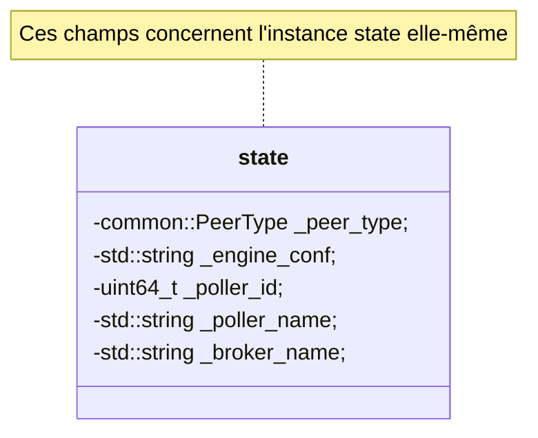

On a aussi la classe `broker::bbdo::stream` qui contient les champs suivants
(contenu partiel) :

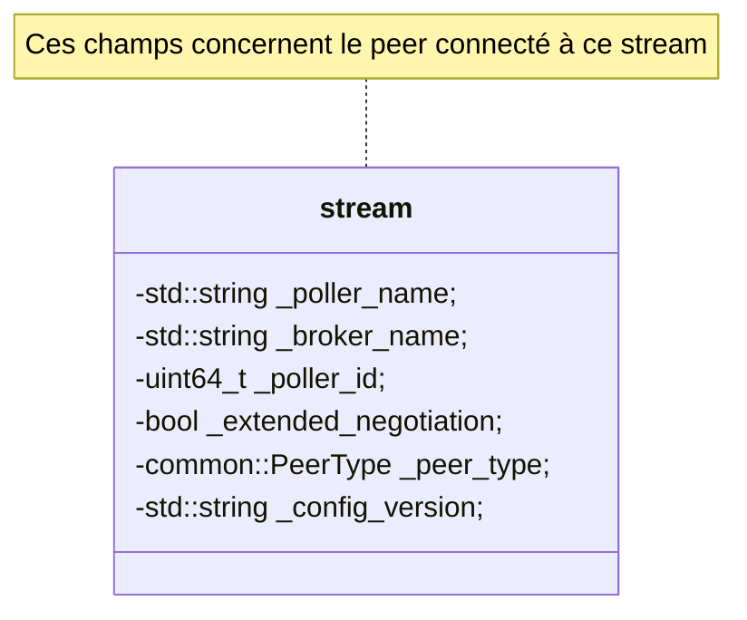
Au niveau de la négociation, les deux points importants sont de savoir
si la négociation étendue est supportée et dans le cas de la connexion
d’un `Engine`, savoir quelle version de la configuration, il connaît. Ce n’est pas
le moment d’échanger la configuration `Engine`, il y a potentiellement de
la rétention à liquider avant de basculer sur son envoi.

Comment fonctionne la négociation ? Deux cas se présentent :

1.  `Engine` initie la connexion.
2.  `Broker` initie la connexion.

On considère ici qu’`Engine` démarre et se connecte à un `Broker` déjà
en fonctionnement.

### Nouvelle fonctionnalité de Broker

`Broker` est configuré avec deux nouveaux répertoires dont on a déjà
parlé et qui sont :

-   `cache_config_directory`
-   `pollers-config`

Nous allons nous attarder sur ces deux répertoires. Le premier contient
des sous-répertoires qui sont les numéros des pollers connectés à ce
`Broker`. À côté de chacun, il existe un fichier `XX.lck` où `XX` est le numéro
d'un poller. Ces fichiers `.lck` sont écoutés sur les modifications par `Broker`.

Dès que le php finit de remplir un de ces répertoires avec la
configuration du poller concerné, c’est-à-dire qu’un nouveau
sous-répertoire `<poller_ID>` est créé, il crée à côté un fichier
`<poller_ID>.lck`, `Broker` en est directement notifié.

En réalité, `Broker` n’est pas directement notifié, cela coûterait
d’utiliser un thread pour cela. Du coup, dans la
réalité `Broker` exécute un timer (toutes les 5s) dans son objet
`config::applier::state`. Toutes les 5s,

1.  il demande à `inotify` s’il y a eu des modifications dans le
    répertoire de cache des configurations. Cette demande se traduit par
    une lecture de descripteur de fichier, non bloquante. S’il n’y a
    rien, la fonction retourne tout de suite avec rien comme résultat.

2.  Dans le cas d’une réponse positive, il récupère les noms de fichier
    `<poller ID>.lck` pour déduire quelles configurations viennent
    d’arriver.

3.  Pour chaque fichier de cette forme, il lit la configuration, crée un
    fichier `new-<poller ID>.prot` dans le répertoire `pollers-config`.

4.  Puis dans le cas où il existait déjà un fichier `<poller ID>.prot`
    dans ce répertoire, il crée aussi un fichier
    `<diff-<poller ID.prot>`. Si le fichier n'existe pas, le fichier de diff
    est créé mais avec la configuration complète.

5.  `Broker` entretient la liste de ses interlocuteurs, il met donc
    aussi à jour l’item correspondant à l’`Engine` avec le bon poller ID
    pour se souvenir qu’il a besoin d’une nouvelle configuration.

6.  Ces tâches sont toutes exécutées par un thread indépendant, elles ne
    devraient avoir qu’un impact limité sur le fonctionnement de
    `Broker`.

L’envoi de cette différence est géré dans le stream `bbdo`.

### Engine initie la connexion

`Engine` se connecte à `Broker` et envoie le message `Welcome`.
`Broker` est alors informé si la dernière version de configuration
`Engine` est connu par son interlocuteur. Il sait aussi s’il supporte la
nouvelle négociation. Et il répond par un message similaire.

Sachant que `Broker` écoute le répertoire de cache php, lorsqu’il aura
une nouvelle configuration disponible, il pourra l’envoyer.

Un point important, `Broker` ne regarde pas la version de configuration
`Engine` disponible pendant la négociation. C’est quelque chose qui se
fait en tâche de fond. Par contre, il stocke dans ses informations sur
le peer `Engine` sa version de conf. Par conséquent, à l'arrivée d'une
nouvelle version, il pourra vérifier si les deux sont bien différentes.

```mermaid
sequenceDiagram
    participant E as Engine
    participant BS as Broker SQL
    participant BR as Broker RRD

    rect rgb(0, 50, 0)
    note right of E: BBDO connection
    note right of E: Engine knows its configuration version.
    E ->> BS: bbdo::PbWelcome
    note right of BS: Initiation de la négociation par Engine<br/>avec sa version de configuration.

    BS ->> BS: stockage de la version de conf de l'Engine<br/>en question et récupération par broker de<br/>la version disponible (si présente).
    note right of BS: Broker connaît l'ancienne version et<br/>la nouvelle version d'Engine.
    BS -->> E: bbdo::PbWelcome
    note right of BS: Broker n'envoie pas la version de configuration<br/>en réponse. C'est inutile.<br/>Ce sera fait plus tard en surveillant le répertoire de cache.
    end
```

### Broker initie la connexion

`Broker` se connecte à `Engine` et envoie le message `Welcome`.
`Engine` apprend à ce moment si `Broker` supporte ou non la nouvelle
négociation. Et il répond en envoyant la version de configuration en
cours.

Au niveau diagramme, on est sur un schéma très similaire au précédent
hormis que les questions/réponses sont inversées.

# Lecture de la configuration Engine

## Gestion de la configuration côté Engine

`Engine` est démarré avec la nouvelle configuration. Il lit la
configuration sérialisée Protobuf disponible dans son `HOME`. Il se
connecte ensuite à `Broker` et envoie le message `Welcome` avec le bon
numéro de version de sa configuration. On a vu que `Broker` répond juste
en disant s'il supporte ou non la configuration centralisée. Dans un second temps,
Broker, en tâche de fond, vérifie si des nouvelles configurations sont disponibles
pour `Engine`. S'il s'en présente une, il
envoie un message avec la différence de configuration.
`cbmod` le garde en attente et lorsqu’`Engine` recommence un cycle dans
sa boucle principale, il applique cette configuration.

S’il y a de la rétention, elle est envoyée en tâche de fond pendant
l’application de la nouvelle configuration.
Une fois la rétention terminée, `Engine` ayant appliqué la configuration,
dans le cas d'un reload, envoie un message
`InstanceConfiguration` à `Broker` pour lui dire qu’il a bien reçu la
configuration.

FIXME DBO: Le message `InstanceConfiguration` est-il toujours nécessaire ?

Mais en fait, il y a un message spécifique pour cela, c'est le message
`pb_diff_state_ack` qui est envoyé par `Engine` à `Broker` pour lui dire
qu’il a bien reçu et appliqué la nouvelle configuration.

## Gestion de l’envoi de la configuration par Broker à Engine

`Broker` utilise `inotify` pour surveiller le répertoire de cache php.
Après que le php a fini d’écrire dans ce répertoire la configuration
du poller *X*, il crée à côté du répertoire *X*, un fichier `X.lck`.
`Broker` surveille la création/modification de n’importe quel fichier
`*.lck` dans ce répertoire. Pour cela un timer cadencé à 5 secondes fait
une lecture sur le descripteur de fichier `inotify`. Ce timer est lancé
en asynchrone et quand un fichier est détecté, `Broker` fait plusieurs
tâches:

En complément d’`inotify`, le timer effectue également un scan du répertoire à
chaque déclenchement. Ce fallback permet de détecter les fichiers `.lck` qu’`inotify`
aurait pu manquer (par exemple lorsque plusieurs `touch()` rapides saturent la file
d’événements du noyau). Tout fichier `.lck` trouvé lors du scan mais non signalé par
`inotify` est traité comme un événement de configuration manqué.

1.  Il lit le répertoire de configuration pour en faire une structure
    `engine::State`.

2.  Il sérialise dans son répertoire `pollers-conf` cette configuration
    dans un fichier `new-X.prot`.

3.  Dans le cas où un fichier `X.prot` existe déjà, il crée aussi un
    fichier `diff-X.prot` qui contient la différence entre les deux
    configurations.

4.  Dans le cas où le fichier `X.prot` n’existe pas, il crée aussi le
    fichier `diff-X.prot` mais le remplit avec la configuration
    complète.

Toutes ces étapes sont faites en tâche de fond.

Le stream BBDO en connexion avec le poller *X* est configuré sur la
lecture pour aussi vérifier si l’`Engine` connecté possède une nouvelle
version :

1.  `Broker` a la liste de ses interlocuteurs, parmi eux les
    `Engine` avec la configuration courante et la nouvelle si présente. Il sait
    donc si une nouvelle configuration est disponible pour l’`Engine` en
    face.

2.  si c’est le cas, juste après avoir reçu un event de l’`Engine`, il
    envoie le message `DiffState` avec la différence entre l'ancienne et
    la nouvelle configuration.

3.  après l’envoi du `DiffState`, et la réception d'un acquittement d'`Engine`,
    `Broker` efface le fichier de différence.

4.  Ce message est stocké côté `cbmod` par `Engine` et est appliqué au
    plus vite dans sa boucle principale.

Côté `Broker`, si on parle un peu plus technique, la lecture de la
configuration `Engine` est faite en utilisant la librairie
`engine_conf`. Une fois lue, la configuration est résolue afin que tous les
`host_id` et autres soient correctement remplis.

Ce code de résolution était à l'origine dans `Engine` mais il a été déplacé
dans la librairie `engine_conf`. Si `Engine` doit fonctionner comme avant,
il utilise aussi cette librairie.

La surveillance en utilisant `inotify` est faite au sein de la classe
`config::applier::state`.

## Calcul de la différence

`Broker` est notifié sur les nouvelles versions de configuration
`Engine`.

La configuration est reçue par l’instance
`config::applier::state` de `Broker`.

Il est intéressant de se garder une petite plage de temps afin de
pouvoir mutualiser les changements des différents pollers. Pour le
moment les interrogations auprès de `inotify` sont faites toutes les 5 secondes,
peut-être faudra-t-il augmenter un peu ce délai ou le paramétrer
autrement. L'intérêt de faire cela à des intervalles réguliers est que si plusieurs
pollers sont modifiés en parallèle, `Broker` devrait pouvoir les traiter
ensemble.

Dans l’étape précédente, nous avons fait évoluer la négociation entre
`Engine` et `Broker` mais globalement les deux fonctionnent comme avant.
Juste, dans un certain nombre de cas, on évite qu’`Engine` renvoie sa
configuration à Broker.

## Écriture de la configuration en base de données

### Étude de cas

Actuellement, même si la négociation a évolué, `Broker` continue à
écrire la configuration au compte-goutte en suivant ce que lui envoient
les pollers.

### Mise en pratique

La bonne solution semble être :

1.  À partir des différentiels de poller récupérés sur un changement de
    configuration, on crée un différentiel global. L’intérêt est de
    régler à l’avance les conflits inter poller.

2.  `Broker` doit apprendre à être moins strict sur les écritures en
    base. Par exemple, si un host est supprimé et qu’on envoie encore
    des données dessus, sachant que le host est juste désactivé, on
    devrait pouvoir quand même écrire les données.

3.  Lorsque le différentiel global est prêt, on ne serait plus obligé
    d’attendre un `Instance` pour le traiter. Ceci dit, si un poller a
    trois semaines de retard, quel serait l’impact sur les données
    d’envoyer presqu’à la connexion du poller la nouvelle configuration
    ?

Un algorithme pour le regroupement des différentiels pourrait suivre la
solution suivante :

-   Pour les objets ajoutés, on peut faire la réunion. On aura la
    globalité des objets ajoutés. A chaque ajout, il faut vérifier parmi
    les supprimés si l’objet n’est pas déjà référencé. S’il l’est on
    peut le déplacer dans les objets modifiés.

-   pour les objets modifiés (qui ne changent pas de poller), on peut
    aussi faire la réunion.

-   Pour un host déplacé d’un poller vers un autre, un différentiel va
    dire que le host est ajouté tandis qu’un autre va dire qu’il est
    supprimé.

-   pour un objet supprimé, il faut vérifier s’il n’est pas déjà ajouté,
    et s’il l’est, il faut le mettre dans les objets modifiés.

Côté Protobuf, nous avons deux objets de configuration qui sont `State`
et `DiffState`. Ils sont bien car sérialisables par contre ils ont le souci
d'être très limités pour les recherches.

On introduit donc deux nouveaux objets `IndexedState` et `IndexedDiffState` qui
stockent les objets dans des tables de hash. Une méthode `merge()` est implémentée
dans `IndexedDiffState` pour faire la fusion de plusieurs différentiels.

Le diagramme suppose que les pollers sont déjà connectés à `Broker` :

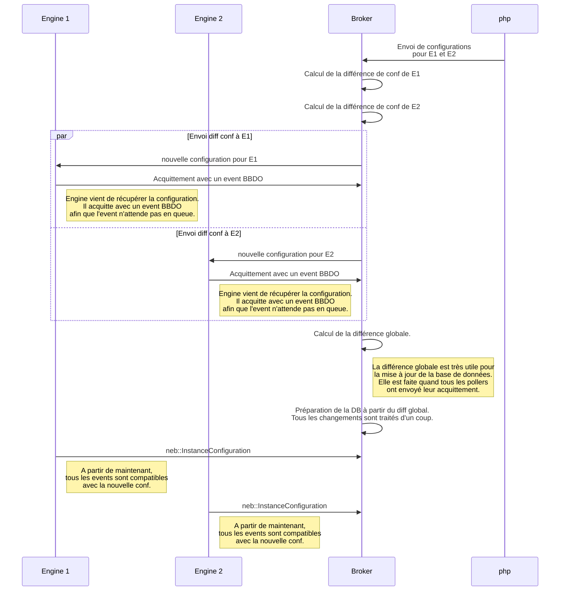

**Remarques.**

1. Un point de vigilance : Dans le cas où le second poller a
   beaucoup de retard, l’arrivée de la seconde `ConfigurationInstance` peut
   vraiment tarder. Si `Broker` attend tous les `ConfigurationInstance` pour mettre à
   jour la base, ça pénalise les données de E1 puisque le cache va mettre longtemps
   avant d'être mis à jour.

2. Peut-être que la différence globale pourrait être faite sur la réception des
   acquittements. Et cadencée avec un timeout. Par exemple à partir de la première
   réception, Broker se donne un timeout de 10s, pendant ce laps de temps, dès qu'il
   reçoit un acquittement, il enrichit la différence globale avec la configuration
   acquittée. Lorsque le timeout est terminé, tout est envoyé à la base de données
   et au cache.

3. Un point de vigilance, nous avons supposé ici que la configuration arrivait du php,
   il faut aussi être capable de tout reprendre si la configuration est déjà côté
   Engine, y compris si elle a été supprimée côté Broker.

Pour le point 3., si Engine démarre avec une configuration connue de Broker, il n’y
a pas de souci, la configuration est déjà en place. Par contre, dans le cas où un
administrateur a supprimé la configuration connue par Engine, ce serait bien
qu’Engine soit en mesure de l’envoyer à Broker pour régler le souci.

Ce cas est géré de la façon suivante : lors de la négociation BBDO, si Broker ne
trouve ni fichier `<ID>.prot` ni fichier `<ID>.lck` pour un poller, il envoie un
`DiffState{unknown=true}` à Engine. Engine détecte ce message et tente d'envoyer sa
configuration courante à Broker. Si `state.prot` existe, Engine l'envoie ; sinon
(premier démarrage, aucune configuration encore appliquée), Engine journalise un
avertissement et n'envoie rien — le flux normal de configuration (via les fichiers
`.lck`) prendra le relais. Dans les deux cas, Engine remet immédiatement le flag
`reloading` à `false` afin de pouvoir traiter les diffs suivants.

Broker reçoit le `State` courant, puis appelle `create_prot_file()`. Avant d'écrire
`<ID>.prot`, Broker vérifie qu'aucune configuration plus récente n'est déjà en cours
de traitement :

- si un fichier `<ID>.lck` existe dans le répertoire de cache PHP, c'est que PHP
  vient d'envoyer une nouvelle configuration ; Broker laisse le flux normal
  s'en charger ;
- si un fichier `new-<ID>.prot` existe, le flux normal est déjà en train de
  préparer la nouvelle configuration ;
- si `<ID>.prot` existe déjà, le flux normal a déjà installé la configuration.

Dans ces trois cas, Broker remet simplement `conf_unknown` à `false` sans écraser
le fichier.

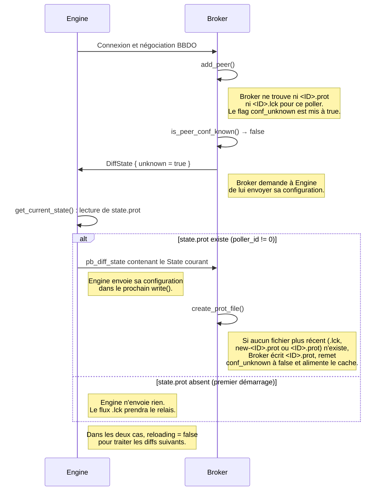

Si l’`Engine` est redémarré avant l’envoi de cet
   *event*, il va se connecter avec la nouvelle configuration mais
   `Broker` aura encore des restes de travaux à effectuer ce qui peut être
   problématique. Pour éviter ça, on passe par un nouvel *event* BBDO (donc
   qui est géré en dehors de la pile des événements) ; dès qu’`Engine` lit
   la configuration, il émet ce nouvel *event* pour informer `Broker` au
   plus vite qu’elle est prise en compte. Pour appliquer la configuration
   sur la base de données, `Broker` attend d’avoir reçu tous ces
   acquittements.

Détaillons davantage la gestion des fichiers pendant l’envoi des
configurations pour mieux comprendre les soucis que l’on pourrait
rencontrer.


## Cas épineux

Lorsqu’il y a de la rétention, nous avons deux cas qui posent problème :

1.  si le premier poller est à l’heure et le second a de la rétention.
    Dans le cas où un host est déplacé du second vers le premier, Broker
    risque de recevoir des données du même host en même temps, provenant
    des deux pollers, ceci jusqu’à ce que le second poller rattrape la
    rétention. En terme de datation, les données arrivant du second
    poller seront plus anciennes.

2.  Si le second poller a de la rétention et avant que `Broker` ne
    reçoive son InstanceConfiguration, l’utilisateur pousse une nouvelle
    configuration. Il est possible dans ce cas, qu’`Engine` ait déjà
    pris en compte l’avant-dernière configuration, et par contre que
    `Broker` n’en soit pas encore informé et qu’il considère
    qu’`Engine`est encore sur la configuration précédente. Par
    conséquent, le différentiel nouvellement calculé par `Broker` va
    être faux.

Le second cas épineux devrait être réglé grâce à l’introduction de
l’event BBDO d’acquittement.

Nous avons un *flag* dans `Broker` pour spécifier s’il est occupé à
traiter la configuration des pollers ou non. Il y a deux portions de
code concernées par ce *flag*.

1.  Lorsque le timer crée les fichiers de diff, de state, etc…C’est tout
    un moment où le *flag* est activé. Du coup, si le stream bbdo veut
    accéder aux configurations disponibles, l’accès lui est refusé et il
    passe son chemin.

2.  Lorsque le stream BBDO envoie la configuration aux pollers. Le timer
    n’a plus accès aux fichiers de configuration, et le timer est juste
    reprogrammé pour plus tard en attendant que la tâche soit terminée.
    Le stream BBDO, dans l’idéal, devrait désactiver le flag lorsque
    tous les pollers ont envoyé un acquittement.

Ci-dessous l’illustration de la situation 2 que l’on souhaite éviter:


Grâce au message d’acquittement, `Broker` ne lira pas la nouvelle
configuration disponible tant qu’il n’a pas reçu l’acquittement
d’`Engine`. Et une fois l’acquittement reçu, `Broker` sait que c’est
maintenant cette configuration qui est en place (même si elle n’est pas
encore totalement effective à cause de la rétention). Par conséquent,
quand `Broker` lit la nouvelle configuration, il calcule bien le bon
différentiel avec la bonne configuration déjà en place.

Il y a un troisième cas inquiétant qui concerne tous les objets transverses. Considérons le Hostgroup par exemple.
Un poller dont certains hosts appartiennent à des Hostgroups, a une configuration déclarant les Hostgroups nécessaires avec les hosts qu'il contient. Le souci est que le poller 1 ne connaît que ses hosts, et par conséquent les Hostgroups qu'il a en définition ne connaissent aussi que ses hosts.

Prenons un exemple, nous avons les hosts 1 et 2 sur le poller 1 et les hosts 3 et 4 sur le poller 2.
Un Hostgroup contient les 4 hosts.

La configuration du poller 1 va donc contenir une déclaration du Hostgroup avec seulement les hosts 1 et 2 et la configuration du poller 2 en aura une autre avec les hosts 3 et 4.

Reprenons maintenant notre configuration centralisée, la configuration du poller 1 change en retirant les hosts 1 et 2 du Hostgroup. La diff de configuration va tout simplement supprimer le Hostgroup.

Dans le cas où seulement le poller 1 a des modifications de configuration, on se retrouve avec une diff qui déclare la suppression du Hostgroup. Ceci va être inséré au différentiel global utilisé pour préparer la base de données. Mais on ne peut pas supprimer le Hostgroup comme ça, il est toujours utilisé par le poller 2.

Donc pour les Hostgroups et Servicegroups, le système de différentiel mis en place ne peut pas s'appliquer.

Le différentiel avec Hostgroups, Servicegroups implémentés comme les autres doit être conservé car il est utilisé lors de l'envoi de la diff au poller.

Le souci est lorsqu'on rassemble les modifications sur ces objets pour l'écriture en base et plus tard pour le cache global de broker.

L'objet neb::service est plus complet que la configuration d'un configuration::service. Du coup, lors de l'initialisation avec un neb::service, on a aussi l'état du service, pending si rien n'est donné au départ. Dans le cas d'un configuration::service, on trouve NULL dans la colonne status de la table `resources` ; ce qui provoque des cas de tests qui peuvent échouer pour le moment et qu'il va falloir réparer.

## objets transverses

Nous avons un objet Protobuf DiffState qui est réparti dans un indexed_diff_state, qui, comme son nom l'indique, indexe les objets des conteneurs.

Pour le GlobalDiffState, nous avons actuellement les même objets. Pourrions-nous hériter de indexed_diff_state pour y ajouter des spécificités.

Imaginons la structure du global_indexed_diff_state. Cette classe hérite de indexed_diff_state. Traitons le merge d'un DiffState.

* Le poller 1 voit l'arrivée d'un nouveau Hostgroup avec les hosts 6 et 7. Son diff contient un Hostgroup ajouté avec deux membres. Le poller 2 voit le même nouveau Hostgroup auquel on ajoute les hosts 8 et 10.

	* Etat des lieux : le premier diff va compléter le global diff state avec un nouveau hostgroup et ses membres. Le second diff va aussi compléter le global diff state avec le même nouveau. Leurs contenus ne sont pas mergés, le second écrase le premier.
	* Evolution : On peut garder la même structure added/modified/removed mais les points de vue des différents pollers ne doivent pas interférer, donc le mieux est d'indexer ces changements par poller. Au niveau du cache global, on a l'état actuel de tous les Hostgroups et on peut vraiment appliquer les changements.

## De la nécessité du cache centralisé

Commençons par deux cas de figure :
1. Engine ne connaît aucune configuration, il démarre et se connecte à broker. Broker lui envoie la configuration complète.
   Dans ce cas, Broker calcule aussi la différence "globale" qui va permettre d'enregistrer cette configuration dans la
   base de données `centreon_storage`. Et la supervision peut commencer à tourner.
2. Imaginons maintenant la situation 1. mais on arrête `Engine`. Puis on le redémarre. Il se reconnecte à `Broker` et donne la configuration qu'il connaît.
   De son côté, `Broker` n'a pas de nouvelle configuration donc il n'envoie rien à `Engine`. Donc `Engine` n'acquitte rien. Donc le diff global ne contient
   rien sur ce poller qui vient de redémarrer. Lors de l'arrêt précédent d'`Engine`, toutes ses ressources ont été désactivées. Mais rien ne permet de les
   réactiver pour le moment. Donc `Engine` se connecte, fonctionne normalement, mais côté `Broker` on ne voit rien.

Le second cas avec le système que nous connaissons fonctionne très bien car `Engine` envoie toute sa configuration et les ressources sont réactivées
les unes après les autres.

Reprenons le schéma d'échange de configuration.

On suppose que Broker est déjà en train de fonctionner.

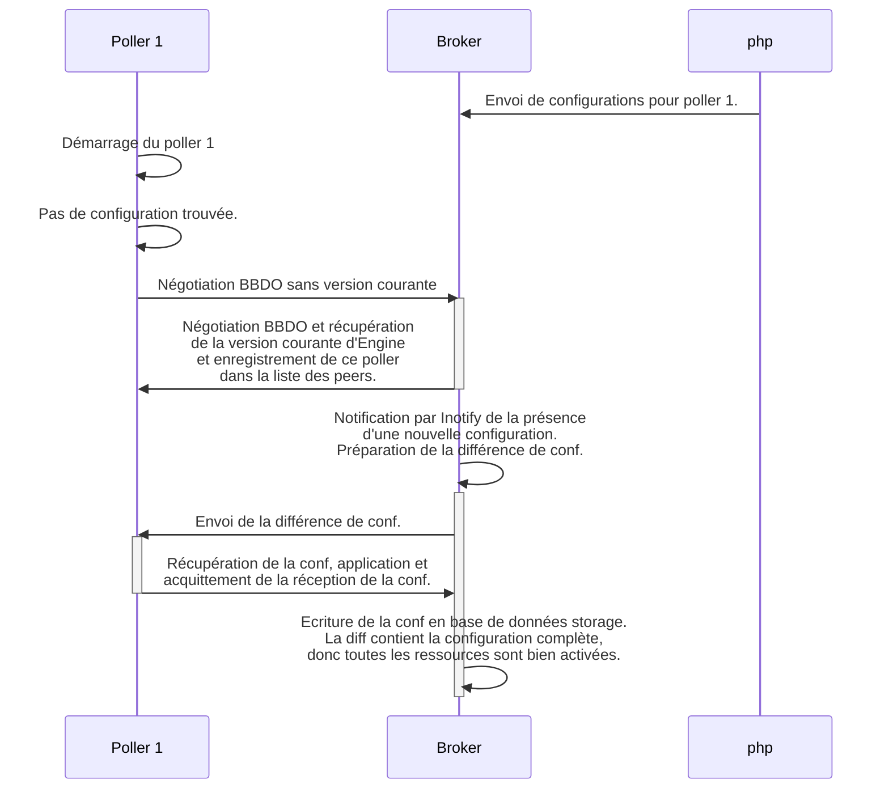

Reprenons le cas précédent, mais cette fois-ci, `Engine` connaît déjà la configuration.

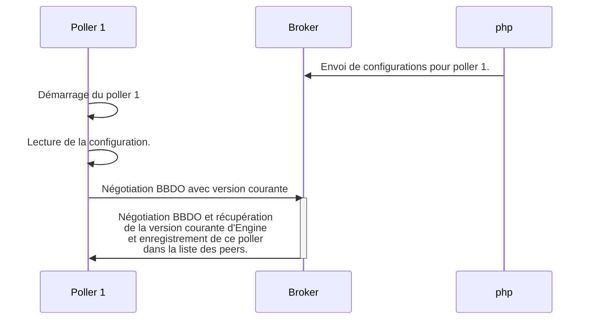
        
Dans ce second cas, il n'y a pas d'envoi de configuration, donc pas d'acquittement, donc pas de mise à jour de la base de données.
L'utilisateur se retrouve dans le noir, car les ressources sont désactivées et ne se réactivent pas.

Juste avant de démarrer la supervision, `Engine` envoie un message `Instance` qui pourrait servir pour réactiver les ressources.

Mais là, nous faisons face à un autre souci. Les ressources supprimées comme les ressources désactivées ont juste la colonne
`enabled` à 0 dans la table `resources`. Donc, on ne peut pas faire la différence entre les deux.

Donc si on met `enabled` à 1, toutes les ressources, y compris les anciennes seront réactivées ce qui est problématique.

`Broker` doit à tout prix garder une trace des ressources de son côté, ce qui permet de pouvoir réactiver ce qu'il faut
à ces moments-là. Nous avons donc besoin d'un cache sur `Broker`.

## Quelques points plus techniques

Lors de la connexion d'un Engine au Broker, la méthode `config::applier::add_peer()` est appelée. Elle fonctionne
de la façon suivante :

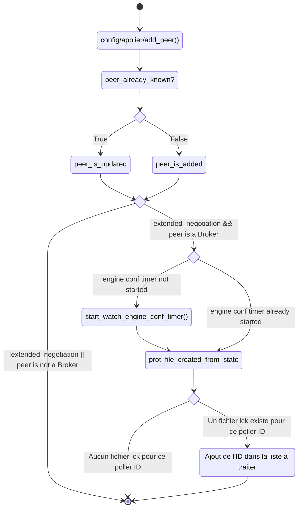

Cette méthode mémorise le poller dans sa liste de peers. Elle démarre le timer de surveillance de la configuration
`Engine` si la négociation est étendue et que le peer est un `Engine`. Et elle vérifie aussi s'il existe déjà un
fichier `.lck` pour le poller ID car `inotify` ne remonte pas les fichiers existant avant son démarrage. Si un tel
fichier est trouvé, l'ID du poller est ajouté à la liste à traiter pour le prochain tick du timer.

Par la suite, le timer est exécuté en tâche de fond et vérifie toutes les 5s si un fichier `.lck` a été modifié ou créé,
dans ce cas la liste des fichiers `.lck` est enrichie puis traitée en tâche de fond. Intéressons-nous à cette partie.

Le timer exécute la méthode `config::applier::state::_check_last_engine_conf()`.

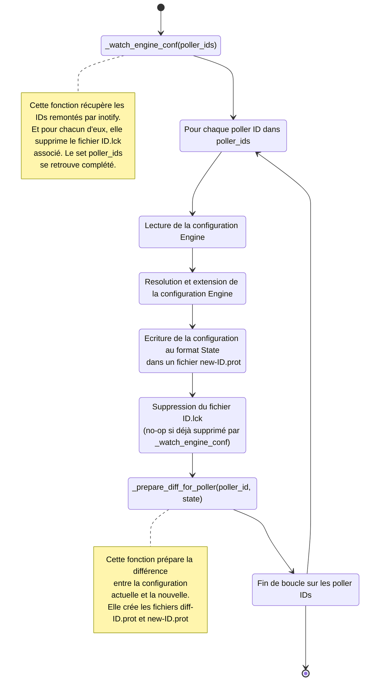

Détaillons un peu le comportement de la méthode `config::applier::state::_prepare_diff_for_poller()`.


Par conséquent, côté `state`, Broker surveille les configurations `Engine` et dès qu'une nouvelle est disponible,
il calcule la différence et crée les fichiers `diff-ID.prot` et `new-ID.prot`.

Chaque stream BBDO connaît son interlocuteur. Si `Broker` est connecté à `Engine`, un stream BBDO les relie et `Broker`
sait qu'il est connecté à un `Engine`, il connaît son poller ID, s'il supporte la configuration centralisée, etc...

Ce stream lit régulièrement les événements entrants, c'est de cette manière que `Broker` reçoit la supervision.
La lecture est faite par une méthode `bbdo::stream::read()`. C'est dans cette méthode que certaines actions comme
l'acquittement d'événements est faite. Et c'est aussi là que Broker détecte si une nouvelle configuration est disponible
pour le poller connecté. Dans le cas où une configuration est disponible, elle est alors lue et envoyée à `Engine`.

Un algorithme simplifié de cette méthode est le suivant :


Dans cette même méthode `read()`, on a un appel à la méthode `handle_bbdo_event()` pour les événements de catégorie BBDO.
C'est dans cette méthode qu'on trouve entre autre le traitement de l'acquittement de la configuration par `Engine`.

Lorsque l'acquittement est reçu pour un poller d'ID poller_id, la liste des peers est mise à jour pour signifier que
ce poller est bien à jour. Le fichier `new-ID.prot` remplace le fichier `ID.prot`.

Enfin, lorsque tous les pollers sont à jour, un objet `com::centreon::engine::configuration::indexeed_diff_state`
est construit en mergeant tous les différentiels de pollers. Cet objet est publié par `Broker` pour être
traité par le stream `unifie_sql`.

L'agencement de ces fonctions donne à peu près le diagramme suivant :

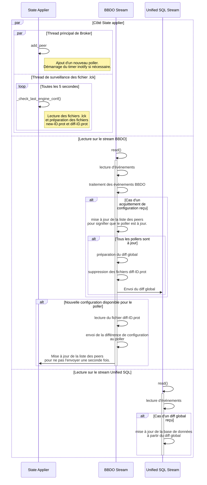

## Split de broker::config::applier::state

Cet objet `broker::config::applier::state` est utilisé à la fois par
`cbmod` et par `broker`. Il gère la surveillance des fichiers de
configuration `Engine`, le calcul des différences, etc...

Son comportement est un peu différent selon qu'il est utilisé par
`cbmod` ou par `broker`.

Garder un unique objet pour les deux nous oblige à garder des attributs
utilisés par l'un et pas par l'autre. La liste des peers, par exemple,
a une gestion assez compliquée pour gérer les deux cas. L'attribut `_engine_conf`,
utilisé uniquement côté `cbmod` se retrouve aussi dans `broker` alors qu'il ne
sert à rien.

La classe `com::centreon::broker::config::applier::state` est donc découpée en trois :

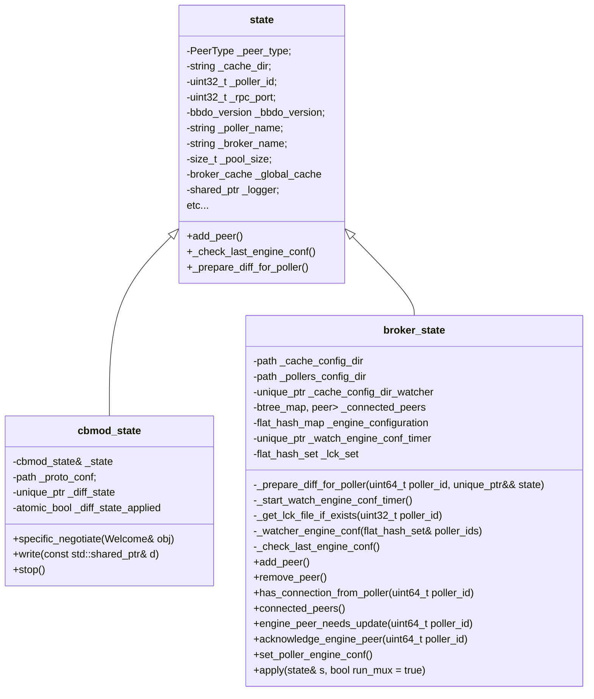

Le découpage de `state` implique aussi le découpage de la classe `bbdo::stream`.

Il y a les `bbdo::stream` utilisés par `cbmod` pour se connecter à un `broker`,
il y a les `bbdo::stream` utilisés par `broker` pour se connecter à un `engine`
et il y a aussi les `bbdo::stream` utilisés par des fichiers cache ou *unprocessed*.

pour représenter tout ça, il a fallu découper `bbdo::stream` en une classe de base `bbdo::basic_stream` puis une
classe virtuelle pure `bbdo::stream` qui hérite de `bbdo::basic_stream` et enfin deux classes concrètes
`bbdo::broker_stream` et `bbdo::cbmod_stream` qui héritent de `bbdo::stream`.

Ce qui donne la structure suivante :

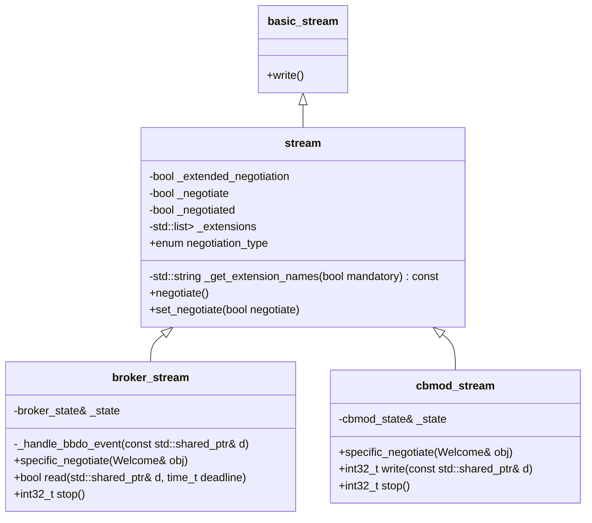

# Streams sql/storage

Ces deux streams ont été dépréciés au profit du stream unifié SQL. Ces streams ne fonctionnent pas avec BBDO 3
et sont donc inutilisables avec la configuration centralisée.

Il est donc temps de les supprimer, cela évite des soucis avec de potentielles régressions.

Au niveau des tests *robot*, beaucoup sont encore basés sur ces streams. Il faut que Broker démarre par défaut
avec le stream unifié SQL et que les tests soient adaptés en conséquence.

# Cache centralisé Broker

## Fonctionnement en configuration centralisée

Comme les caches avant l'introduction du cache centralisé stockaient des `neb::services`, `neb::hosts`, le nouveau
cache va aussi contenir ces événements. Ça impose des conversions à partir de la configuration, mais vu le besoin
du Lua, il est difficile de faire autrement.

Le cache global, contrairement à la situation d'avant, n'est plus mis à jour par des `neb::services` et autres,
c'est essentiellement la configuration qui le remplit puis des `service_status`, `host_status` pour quelques mises
à jour.

Cette mise à jour est faite dans le multiplexeur. Quand son *engine* reçoit les événements, il en profite pour mettre
à jour le cache.

Il faut aussi regarder comment la configuration agit sur le cache.

Ce diagramme est à mettre à jour avec la mise à jour du cache...

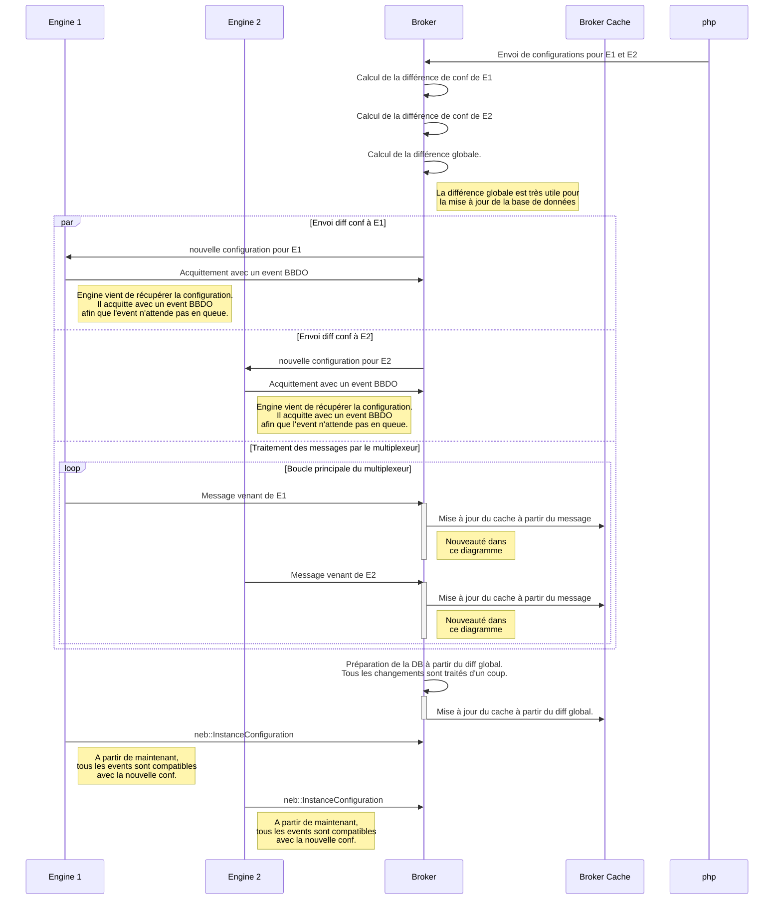

Le comportement de `Broker` est adapté avec l'ajout du cache centralisé.

**Remarques.**

1. Un point intéressant est de voir si on peut appliquer un DiffState au cache directement avant même l'écriture
en base de données. Ça simplifierait l'écriture du cache. Par contre, cela peut poser des soucis au moment
de la mise à jour de la base de données car elle utilise beaucoup le cache.

2. Sinon, on peut mettre le cache à jour au fur et à mesure de l'écriture dans la base de données. Mais que
se passe t-il si un jour la base est supprimée ?

Dans le cas où la mise à jour du cache est faite en amont de l'écriture en base de données, on obtient le schéma
suivant :

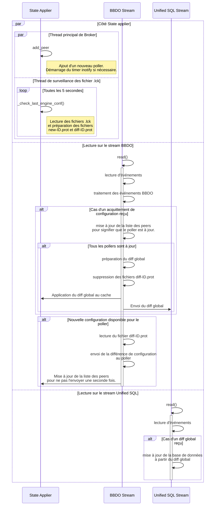

## Fonctionnement en mode *legacy*

Si la configuration centralisée n'est pas activée, le cache doit remplacer les anciens
caches de stream de manière assez analogue. Ce ne sera pas à l'identique, on sait qu'on peut
perdre avec le nouveau cache la synchronisation entre un poller et le central pendant
des mises à jour de configuration.

Lorsqu'un Engine démarre, il envoie sa configuration au Broker. Le cache est donc mis
à jour. Par contre, si le broker est redémarré, le cache est perdu. Le cache doit
donc être sauvegardé sur le disque lors de l'arrêt de Broker de manière à pouvoir
être rechargé à l'identique au redémarrage de Broker.

Dans le cas *legacy*, on obtient donc un fonctionnement de la forme :

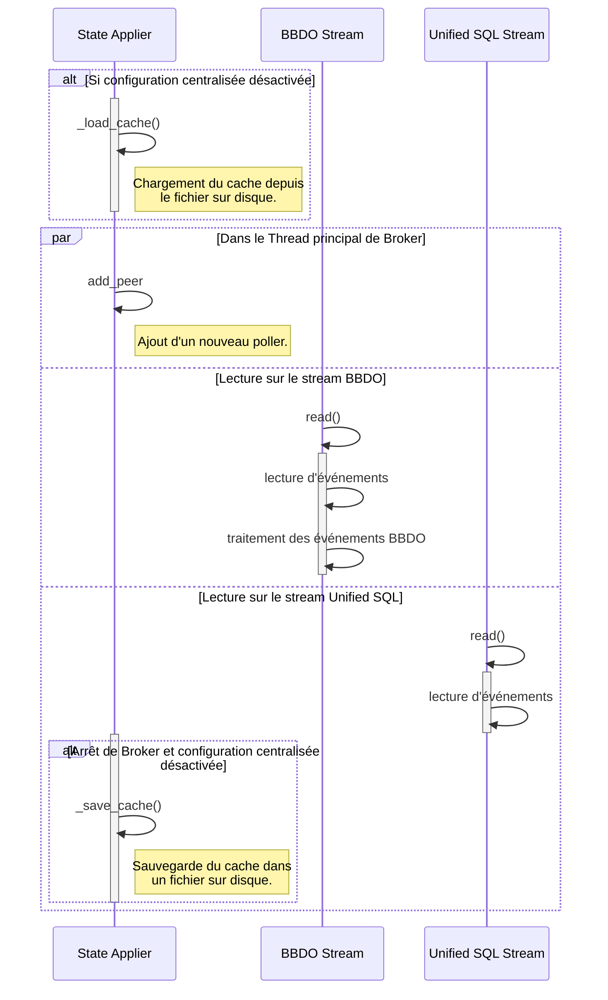

Un point d'attention sur le mode *legacy* et peut-être aussi en configuration centralisée concerne
les index mappings et les metric mappings. Ces deux objets sont stockés de manière très complète dans
le cache d'`unified_sql`. Ils sont obtenus en grande partie grace à une requête SQL faite lors du démarrage
du stream.

Lorsque les autres streams utilisent ces deux informations, ils en utilisent une petite partie.

Plusieurs points :

* inutile de sauvegarder dans le fichier de cache ces informations puisqu'elles sont récupérées au démarrage et
qu'elles seront beaucoup plus à jour. Surtout que le php peut aussi y écrire directement.
* cela signifie aussi que le cache, même s'il est en grande partie mis à jour par la configuration et par les envois
d'`engine`, est aussi mis à jour par les requêtes SQL faites au démarrage d'`unified_sql` et pour le moment il
semble difficile de s'en passer.
* Le plus simple est de mettre à jour les metrics et `index_mapping` qu'en passant par `unified_sql`. Et le cache n'a
pas à faire de requête SQL pour les récupérer.

En dehors de `unified_sql`, le seul stream à utiliser `index_mapping` est le stream lua.

Habituellement, ce stream est sur le broker central donc il a bien accès à la donnée.

Par contre, le jour où on veut déplacer le stream lua sur un broker déporté, `index_mapping` n'est plus
disponible.

## Evolutions possibles

Plutôt que d'accéder au cache en écriture depuis `unified_sql`, on pourrait passer par le multiplexeur.
L'`index_mapping` pourrait être transmis aux brokers voisins. Ça résoudrait déjà le souci du stream lua.

Une seconde évolution serait que le cache devienne un module broker. Ce cache pourrait être porté par un broker
et les brokers voisins pourraient y accéder en lecture/écriture via des messages BBDO. Cette solution est
particulièrement intéressante avec le cluster de brokers.

# Rétention


# Poller HA
## Arborescence de configuration des pollers
Sans parler HA, on a la structure suivante :
* engine:
	* 1/ configuration poller 1
	* 1.lck fichier disant que broker peut récupérer la configuration

Ici le numero 1 représente l'ID du poller.

Actuellement, avec la configuration centralisée :

* création du fichier new-1.prot avec la configuration à l'intérieur
* Création de diff-1.prot qui contient la différence avec la configuration précédente.
* Envoi de diff-1 au poller 1.
* A l'acquittement de poller 1, on passe aux étapes suivantes:
* Mise à jour de la configuration globale pour le cache de broker
* mise à jour de la différence globale, si plusieurs configurations sont reçues simultanément, pour pouvoir faire la mise à jour de la base de données STORAGE.

L'étape suivante est de remplacer le poller 1 par la zone 1.

* création du fichier new-1.prot avec la configuration à l'intérieur
* Création de diff-1.prot qui contient la différence avec la configuration précédente.

En passant à la configuration HA, cet ID va représenter un ID de zone (groupe de poller).
Le changement est à l'étape prochaine. diff-1.prot contient une différence concernant la zone 1. Donc il décrit plusieurs pollers en même temps.

1.prot contient la configuration en cours. Il n'est pas au courant de l'association hosts/pollers.
new-1.prot doit être créé de cette manière,
* lecture de la configuration
* résolution de la configuration
* le calcul de différence ne change pas.
* on peut traiter par poller, les objets supprimés ou modifiés.
* dans un second temps, on peut traiter les objets ajoutés, à faire globalement sur l'ensemble de la zone.
* Après cette dernière étape, on obtient les diff-1.prot, diff-2.prot, ...

## Fichiers de configuration Engine
Il y a un nouveau fichier qui est pollers.cfg. Il doit contenir les champs suivants pour chaque poller:
```
define poller {
  poller_id    1
  poller_name  titus
  address      192.168.1.18
  hosts        liste des hosts indispensables à chaque poller
}
```

Lorsque broker fabrique le premier fichier prot, qui s'appelle maintenant new-zone1.prot, c'est un nouveau message Zone qui contient les mêmes champs que State avec en plus :
* zone\_id
* une liste de Pollers, chacun avec les champs définis ci-dessus.

On redéfinit l'intégralité des champs du message Zone, il ne contient pas directement le message State, ceci afin de garder une flexibilité.

Conclusion: on ne définit plus 1.prot et new-1.prot mais zone1.prot et new-zon1.prot. Ils ne sont plus des dumps du message State mais des dumps de Zone.

L'étape suivante est la création de diff-1.prot

## liste des peers
com::centreon::broker::config::applier::state contient la liste des peers connectés à broker.

Il faut la compléter avec l'occupation du poller et la charge supportée. Cette charge n'est pas directement configurable mais calculée par broker au fur et à mesure du fonctionnement.

Il faut maintenir la liste des hosts associés aux pollers côté broker. Au prochain redémarrage, les attributions ne sont donc pas recalculées.

calcul de la charge assez problématique.

## unified\_sql
instance\_id va devenir zone\_id dans les resources et les hosts.

# Tickets
## Premiers tickets
### Check health interne à Engine avec remontée à Broker
Engine récupère son occupation CPU, MEM, latence des checks pour envoyer un message Health à Broker:
```
message Health {
  uint32 poller_id = 1;
  float cpu = 2; // nombre entre 0 et 1
  float mem = 3; // nombre entre 0 et 1
  float latency = 4;
}
```
Ce format de message donne un but mais n'est pas à prendre comme définitif. Une étude est nécessaire sur les infos utiles pour la répartition.

Un système classique est de pondérer les différents indicateurs afin de calculer une charge globale.
Pour arriver à ça, c'est bien que tous les paramètres soient entre 0 et 1.
Pour le cpu et la mémoire, le message contient déjà l'information à la bonne échelle.
Pour la latence, il faut définir un seuil au-delà duquel on considère que le poller est surchargé. Par exemple, si la latence est supérieure à 10s, on considère que le poller est surchargé.

On peut maintenant calculer la charge globale du poller avec le formule suivante :
C=alpha * cpu + beta * mem + gamma * latency / latency\_max avec alpha + beta + gamma = 1.

Si on trouve un autre paramètre intéressant, on peut toujours l'ajouter à la formule et rééquilibrer les poids.

Une étude plus poussée pourrait nous permettre de déterminer les poids optimaux pour chaque poller. Mais de manière empirique,
on peut commencer avec alpha = 0.4, beta = 0.2 et gamma = 0.4. Il semble que le cpu et la latence aient un impact plus important
que la mémoire d'où ces paramètres.

Une fois qu'on a cette charge, on peut définit un intervalle de charge limite. Par exemple,
de 60% à 80% ; l'intérêt d'avoir un intervalle est de pouvoir ainsi travailler avec un hysteresis.

* Lorsqu'on veut augmenter la charge d'un poller, on s'autorise à le faire tant que la charge est inférieure à 60%.
* on considère un poller trop chargé quand il dépasse 80%.
* Lorsqu'il est trop charge (charge > 80%), on essaie de réduire sa charge pour qu'il repasse sous les 60%.

L'intervalle [60%;80%] doit être configurable.

Lorsqu'un poller est trop chargé (donc charge > 80%), on doit lui retirer des hosts pour qu'il repasse sous les 60%.
Le 60% est un objectif, il est difficile de savoir exactement le nombre de hosts à retirer pour l'atteindre. Le tout
est donc de finir dans l'intervalle.

On a donc quelques paramètres de configuration à définir:
* latence maximale (par exemple 10 secondes)
* poids de la charge CPU, mémoire et latence (configurable)
* intervalle de charge entre 60% et 80% (configurable)

### A propos du calcul de diff

Broker reçoit les conf des zones, ce qui donne new-zone-1.prot, new-zone-2.prot, ...
Ces zones tournent déjà et leur conf est dans zone-1.prot, zone-2.prot, ...

On calcule ensuite diff-zone-1.prot, diff-zone-2.prot, ...

Si zone 1 contient les pollers 1, 2 et 3.

Le but serait de répartir les modifications sur chaque poller en fonction de sa charge. Et on utiliserait
la même machinerie que lors de la surveillance des pollers.

### Étude sur le mécanisme de répartition
Quelle charge remonter à broker et comment Broker doit adapter la répartition à ces charges ?
C'est surtout la seconde partie de la question qui nous intéresse.

### Introduction des messages Zone et DiffZone
le calcul de configuration initial par broker n'est plus du State/DiffState mais du Zone / DiffZone.

La Zone est un message très similaire au State, elle contient la configuration des
pollers de la zone, pour le moment on considère que tous les pollers sont configurés
de la même manière. Et peut-être que cela évoluera avec le temps.
La zone porte tous les hosts/services devant être gérés par les pollers
qu'elle contient. Par contre, contrairement au State, la Zone contient une liste
de pollers. Si les paramètres globaux définis au niveau de la Zone doivent être
différenciés par poller, on peut les déplacer de la zone vers les pollers (au
niveau des définitions de message).

Le contenu de centengine.cfg est une première ébauche de la configuration pour la zone. Mais on doit ajouter
un tableau par poller puisqu'il y a déjà des hosts spécifiques à chacun.
On peut aussi imaginer des niveaux de logs différents par poller.
Par contre, la durée de check minimale doit être partagée sur toute la zone.

Il reste encore à déterminer quels champs déplacer par poller.

13 points.

## Plusieurs tickets en parallèle

### Préparation d'unified\_sql
Le but est d'écrire la conf préparée par broker d'une traite dans centreon\_storage.

21 points.

### Cache centralisé
Tous les streams doivent accéder au même cache qui provient de la configuration en grande partie.

Il est composé de deux parties:
* configuration
* temps réel et autre (l'héritage des caches broker actuels)

Il faut recenser les caches actuellement utilisés. Et ensuite on produit un cache global pour alimenter l'ensemble.

On a la configuration engine globale qui est enrichie au fur et à mesure des envois de conf côté broker.
Le cache est à part et pointe sur cette configuration globale.
En faisant ça, côté Engine, le cbmod a aussi son cache qui pointe ce coup ci vers la conf Engine dans globals.cc.
L'alimentation est templatisée car faite soit par Zone, soit par State.

Possibilité de découper:
1. on fait le nouveau cache. Encore assez lourd mais raisonnable.
2. migrer progressivement les autres caches vers celui-là. Les migrations peuvent être faites en parallèle (influxdb, graphite, VictoriaMetrics, Lua, rrd, unified\_sql).
3. Un ticket existe déjà pour supprimer les outputs sql et storage.

### Le bloc de conversion
DiffZone vers DiffState, à partir de la zone, on lance un DiffState par poller.

Une première étape est de considérer tous les pollers identiques, et un round-robin fait l'affaire.

## Évolutions
### Amélioration du bloc de conversion
En partant de l'étude, la répartition sur les pollers doit pouvoir être améliorée.
Le bloc doit pouvoir être paramétrable à l'aide du fichier de conf de broker. Un algorithme ne suffira sûrement pas à gérer tous les cas.
### Récupération du check Health
La prise en compte par Broker du Health doit permettre le rééquilibrage des configurations des pollers.

# Soucis potentiels à résoudre
* commandes externes
* services passifs problématiques
* agent
* retention.dat (côté poller, si ça change on n'a plus l'info)
* hostdependencies les hosts doivent être sur le même poller.
* servicedependencies les hosts de ces services doivent être sur le même poller.
* Hostescalation / Serviceescalation : concerne les notifications. Elles doivent suivre l'objet notifié.
* Attention aussi aux downtimes
* Anomalydetection doit être sur le même poller que le service associé. Et sa conf doit suivre.
* Très difficile de garder la compatibilité avec l'ancien comportement d'engine
* ping-pong
* le check de la configuration Engine doit être migré en gRPC sur Broker.
* dans la table resources, nous n'avons actuellement que poller_id, est-il judicieux d'aussi ajouter la zone_id ? Première
impression: oui. Même si globalement nous remplaçons poller_id par zone_id, il y a des exceptions !! Les pollers ID gardent
leur sens par exemple pour accéder aux logs.

# Résolution des soucis
## Déplacement de l'envoi des commandes externes sur Broker
On crée les points d'entrée pour toutes les commandes externes Engine sur Broker.
Et Broker, en interne, envoie la demande au poller concerné.

