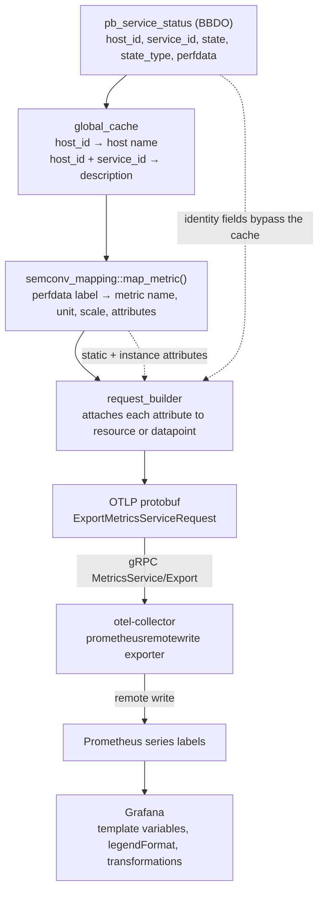
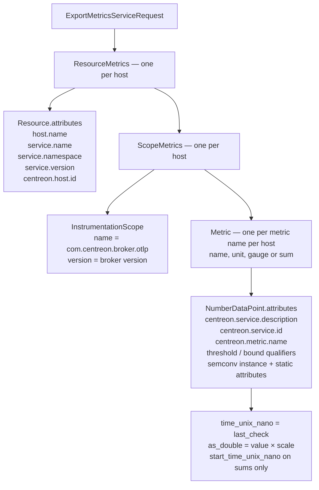
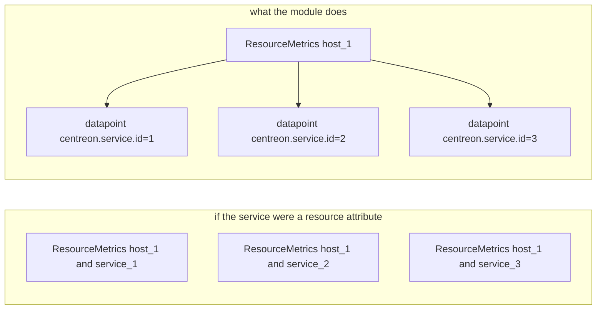
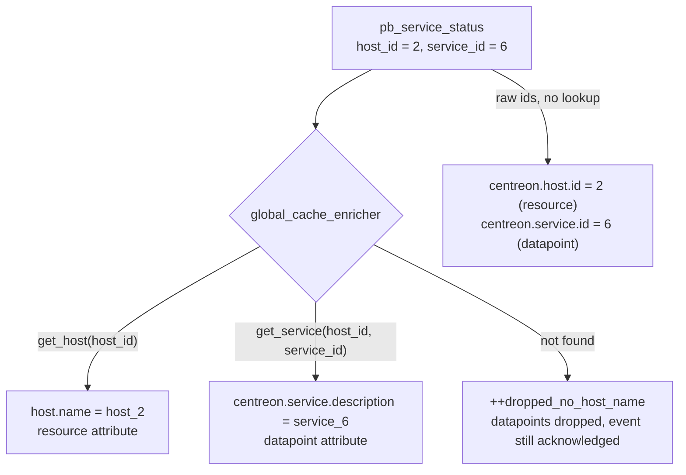
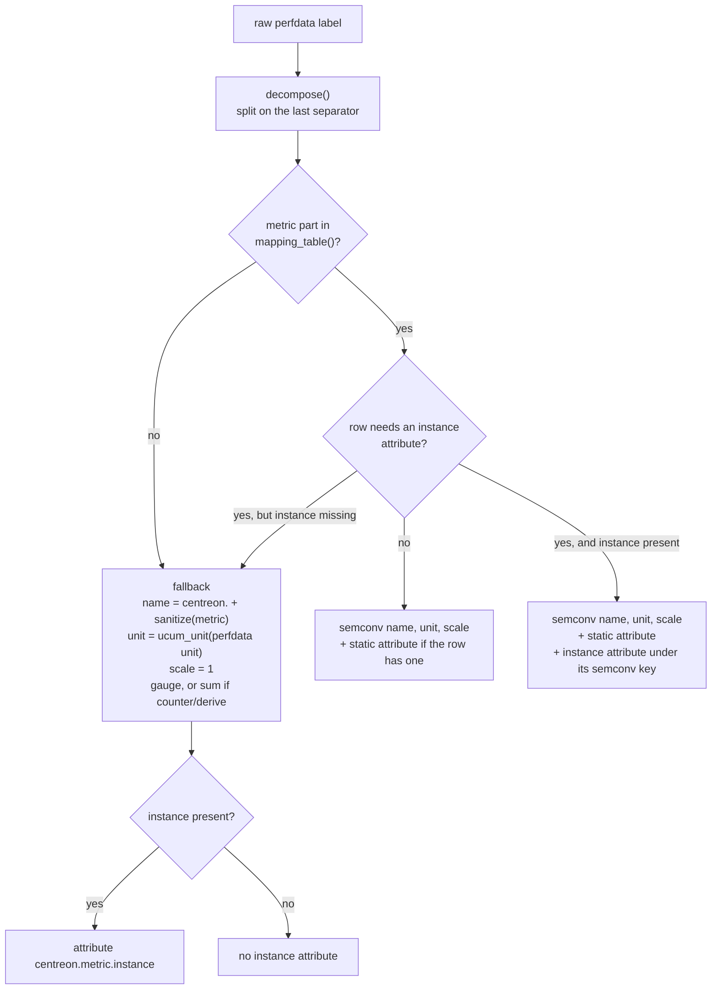
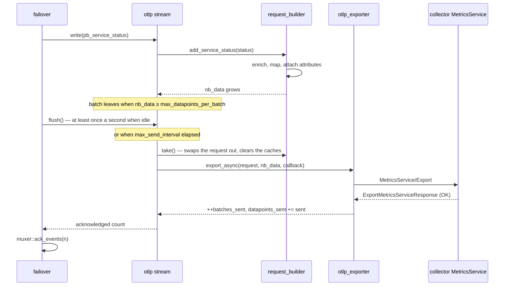
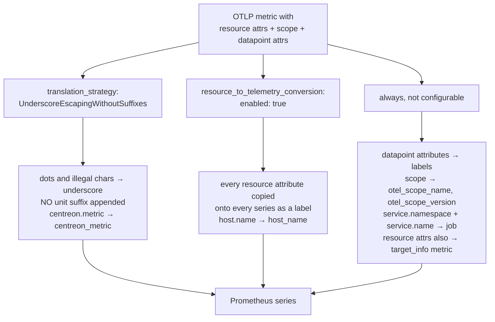
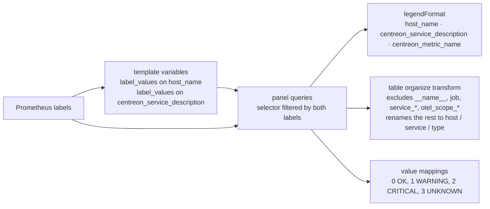
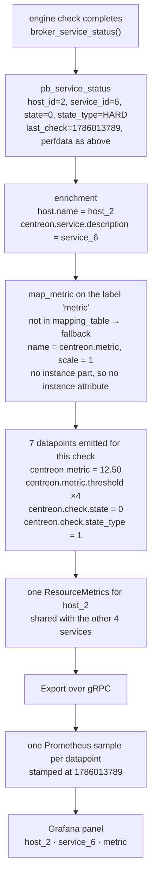

# From a BBDO field to a Grafana label

How every attribute of the `otlp` output is built, where it is attached in the OTLP protobuf,
what the collector renames it to, and how the dashboard consumes it.

- [1. The whole chain](#1-the-whole-chain)
- [2. Where an attribute is attached, and why](#2-where-an-attribute-is-attached-and-why)
- [3. The two enrichments](#3-the-two-enrichments)
- [4. Perfdata label to semconv attributes](#4-perfdata-label-to-semconv-attributes)
- [5. The wire: gRPC Export](#5-the-wire-grpc-export)
- [6. Collector translation to Prometheus labels](#6-collector-translation-to-prometheus-labels)
- [7. What Grafana does with them](#7-what-grafana-does-with-them)
- [8. Complete reference](#8-complete-reference)
- [9. One datapoint, end to end](#9-one-datapoint-end-to-end)

---

## 1. The whole chain

Five naming systems in a row, each renaming what the previous one produced.



The renaming happens twice and in two different styles, which is the whole source of confusion:

| Stage | Style | Example |
|---|---|---|
| Broker → OTLP | OTel semantic conventions, dotted | `host.name`, `centreon.service.id` |
| Collector → Prometheus | dots become underscores | `host_name`, `centreon_service_id` |

---

## 2. Where an attribute is attached, and why

OTLP has three places to put an attribute, and the choice is not cosmetic: it decides what the
attribute costs on the wire and whether Prometheus can filter on it.



The rule the module follows:

- **Resource = the emitter and the machine.** `_scope_for_host()` caches one `ResourceMetrics` per
  `host_id` in `_scope_by_host`, so every service of a host shares it. Host-level facts go here and
  are written once per host per batch instead of once per datapoint.
- **Scope = who produced the numbers.** Constant, purely informational.
- **Datapoint = everything that varies inside a host.** The Centreon *service* is here precisely
  because the resource is per host — a service attribute on the resource would force one
  `ResourceMetrics` per service and multiply the payload.

That is also why the Centreon service is **not** in `service.name`
([request_builder.cc:164-166](../otlp/src/request_builder.cc#L164-L166)): OTel reserves
`service.name` for the emitting application, and Prometheus turns it into the `job` label. Putting
`service_1` there would make every Centreon service a separate Prometheus job.



---

## 3. The two enrichments

`host_id` and `service_id` travel in the BBDO event; the human-readable names do not. They come
from the global cache, which the multiplexing engine fills before dispatching any event
(`engine::_send_to_subscribers()` calls `global_cache::write()` on the batch **first**, precisely so
outputs can resolve names).



Two asymmetries worth knowing:

- **A missing host name drops the datapoints**, because a series with no `host.name` cannot be
  correlated with anything. A missing service *description* does not: the attribute is simply
  omitted and `centreon.service.id` still identifies the series.
- **The event is acknowledged either way.** A host that never resolves would otherwise stall the
  muxer forever. That is what `dropped_no_host_name` in the endpoint statistics counts — if it
  climbs, the cache is not being populated, not that the export is broken.

---

## 4. Perfdata label to semconv attributes

A Centreon perfdata label is structured: `instance~sub1~sub2#metric.name`. The instance is where
the mountpoint, interface or device lives, so it must become an attribute rather than be smuggled
into the metric name.

```
/var#disk.space.usage.bytes     →  instance = /var        metric = disk.space.usage.bytes
eth0#network.traffic.bytes      →  instance = eth0        metric = network.traffic.bytes
metric                          →  instance = (none)      metric = metric
```



That last edge is the important one. `system.filesystem.usage` without
`system.filesystem.mountpoint` would silently aggregate every filesystem of the host into a single
series, so the mapping deliberately degrades to `centreon.disk.space.usage.bytes` rather than emit
an under-attributed semconv metric.

The instance key depends on the convention
([semconv_mapping.cc:245](../otlp/src/semconv_mapping.cc#L245)):

| Convention family | Instance attribute |
|---|---|
| filesystem | `system.filesystem.mountpoint` |
| network | `network.interface.name` |
| disk I/O | `system.device` |
| per-CPU | `cpu.logical_number` |
| fallback | `centreon.metric.instance` |

Static attributes come from the table row and are what makes one OTel metric name carry several
Centreon metrics:

| Centreon label | OTel metric | Static attribute |
|---|---|---|
| `cpu.user.percentage` | `system.cpu.utilization` | `cpu.mode=user` |
| `cpu.idle.percentage` | `system.cpu.utilization` | `cpu.mode=idle` |
| `memory.usage.bytes` | `system.memory.usage` | `system.memory.state=used` |
| `memory.free.bytes` | `system.memory.usage` | `system.memory.state=free` |
| `disk.io.read.bytes` | `system.disk.io` | `disk.io.direction=read` |

Note the `scale`: `cpu.user.percentage` is a percent in Centreon and a ratio in OTel, so the value
is multiplied by 0.01 before `set_as_double()`. The unit travels with it (`1` for a ratio, `By` for
bytes, `s` for seconds), which is why the threshold metric reuses the value's unit rather than
sharing one global threshold metric.

**`centreon.metric.name` is always attached**, mapped or not. Whatever semconv renaming happened,
an operator can still find a series by the label Centreon knows.

---

## 5. The wire: gRPC Export



`take()` clears `_scope_by_host` and `_metric_index`, so the per-host resource and per-metric
grouping is rebuilt for each batch. Attributes are therefore re-emitted every batch — that is
normal OTLP, and the reason resource attributes are worth keeping off the datapoint.

---

## 6. Collector translation to Prometheus labels

Prometheus has no notion of resource, scope or datapoint attributes — only flat labels. The
exporter flattens all three, with two settings deciding how much survives.



Both settings are load-bearing:

- **Without `resource_to_telemetry_conversion`**, resource attributes land *only* in the separate
  `target_info` metric. `host_name` would not exist on `centreon_metric`, and the dashboard could
  not filter by host without a join.
- **Without the suffix-free strategy**, the unit is appended per metric: `centreon.cpu.utilization`
  with unit `1` becomes `centreon_cpu_utilization_ratio`, bytes become `..._bytes`. Names would
  differ per metric and no fixed dashboard query would match. On collectors older than 0.146 the
  same thing is spelled `add_metric_suffixes: false`.

Verified against a live run:

```
centreon_metric{
  host_name="host_2", centreon_host_id="2",
  centreon_service_description="service_6", centreon_service_id="6",
  centreon_metric_name="metric",
  job="centreon/centreon-broker",
  otel_scope_name="com.centreon.broker.otlp", otel_scope_version="26.09.0",
  service_name="centreon-broker", service_namespace="centreon", service_version="26.09.0"
}
```

One more thing the collector does not do: it does not reorder time. Broker stamps datapoints with
`last_check`, so Prometheus needs `out_of_order_time_window` or it answers 400 and stores nothing.

---

## 7. What Grafana does with them



The variables and the selector they feed:

```promql
label_values(centreon_check_state, host_name)
label_values(centreon_check_state{host_name=~"$host"}, centreon_service_description)

centreon_metric{host_name=~"$host", centreon_service_description=~"$service"}
```

Which is why the exclude list in the table panel exists at all: the useful labels are a minority of
what arrives. `job`, `service_name`, `service_namespace`, `service_version`, `otel_scope_name` and
`otel_scope_version` are identical on every Centreon series and only add columns.

The threshold panel is the one place two metrics are correlated by label rather than by name: it
plots `centreon_metric` and `centreon_metric_threshold` together and relies on
`centreon_metric_name` matching between them, with `centreon_threshold_level` and
`centreon_threshold_bound` distinguishing the four bounds.

---

## 8. Complete reference

### Resource attributes — once per host per batch

| OTLP attribute | Prometheus label | Value | Source |
|---|---|---|---|
| `host.name` | `host_name` | e.g. `host_2` | `global_cache::get_host()->name()` |
| `centreon.host.id` | `centreon_host_id` | e.g. `2` | BBDO `host_id` |
| `service.name` | `service_name`, part of `job` | `centreon-broker` | constant |
| `service.namespace` | `service_namespace`, part of `job` | `centreon` | constant |
| `service.version` | `service_version` | broker version | constant |

`ResourceMetrics.schema_url` also carries the semantic convention version the mapping table
targets, so a consumer can migrate attribute names automatically across semconv releases. It must
be bumped whenever the table adopts conventions from a newer one.

### Scope

| OTLP | Prometheus label | Value |
|---|---|---|
| `InstrumentationScope.name` | `otel_scope_name` | `com.centreon.broker.otlp` |
| `InstrumentationScope.version` | `otel_scope_version` | broker version |
| `ScopeMetrics.schema_url` | not exported | same as the resource's |

### Emitted metrics

| Metric | Unit | Instrument | Value |
|---|---|---|---|
| semconv name, or `centreon.<label>` | UCUM | gauge, or sum for `counter`/`derive` perfdata | the perfdata value × scale |
| `<name>.threshold` | same as the value | gauge | a warning or critical bound |
| `<name>.bound` | same as the value | gauge | the perfdata min or max |
| `centreon.check.state` / `centreon.host.state` | `1` | gauge | the state enum, or 0/1 per state under `state_encoding: one_hot` |
| `centreon.check.state_type` / `centreon.host.state_type` | `1` | gauge | `1` hard, `0` soft |

Service states are `0 OK, 1 WARNING, 2 CRITICAL, 3 UNKNOWN, 4 PENDING`; host states are
`0 UP, 1 DOWN, 2 UNREACHABLE, 4 PENDING`, with 3 unused. `4` is what engine reports for a check
that has never run — `has_been_checked() ? get_current_state() : 4` — even though
`HostStatus.State` does not declare it, because proto3 enums are open.

Every metric carries a `description`, which Prometheus turns into its `HELP` text. Cumulative sums
additionally carry `start_time_unix_nano`, fixed for the life of the stream, so a consumer can tell
a counter reset from a first observation. Gauges deliberately do not.

### Datapoint attributes

| OTLP attribute | Prometheus label | On which metrics | Source |
|---|---|---|---|
| `centreon.service.description` | `centreon_service_description` | all service metrics | global cache, omitted if unresolved |
| `centreon.service.id` | `centreon_service_id` | all service metrics | BBDO `service_id` |
| `centreon.metric.name` | `centreon_metric_name` | value, threshold, bound | raw perfdata label |
| `centreon.state` | `centreon_state` | state metrics, `state_encoding: one_hot` only | `ok`/`warning`/`critical`/`unknown`/`pending`, or `up`/`down`/`unreachable`/`pending` |
| `centreon.threshold.level` | `centreon_threshold_level` | threshold only | `warning` / `critical` |
| `centreon.threshold.bound` | `centreon_threshold_bound` | threshold only | `upper` / `lower` |
| `centreon.bound.type` | `centreon_bound_type` | bound only | `min` / `max` |
| `centreon.metric.instance` | `centreon_metric_instance` | fallback metrics with an instance | perfdata instance part |
| `system.filesystem.mountpoint` | `system_filesystem_mountpoint` | filesystem semconv | perfdata instance part |
| `network.interface.name` | `network_interface_name` | network semconv | perfdata instance part |
| `system.device` | `system_device` | disk I/O semconv | perfdata instance part |
| `cpu.logical_number` | `cpu_logical_number` | per-CPU semconv | perfdata instance part |
| `cpu.mode`, `system.memory.state`, `system.paging.state`, `system.filesystem.state`, `disk.io.direction` | same with underscores | whichever row declares them | static, from `mapping_table()` |

Note `centreon.host.id` is a **resource** attribute while `centreon.service.id` is a **datapoint**
attribute. Same family of information, different attachment point, for the reason in section 2.

---

## 9. One datapoint, end to end

A service check on `host_2` / `service_6` whose plugin output is:

```
Test check 6 | metric=12.50;150.00;200.00
```



The value datapoint arrives in Prometheus as:

```promql
centreon_metric{
  host_name="host_2", centreon_host_id="2",
  centreon_service_description="service_6", centreon_service_id="6",
  centreon_metric_name="metric"
} = 12.5
```

Observed counts from a 90s run with 10 hosts × 5 services: 50 `centreon_metric` series,
200 `centreon_metric_threshold` series — 50 each for warning/critical × upper/lower, so 4 per
service — 50 `centreon_check_state` and 10 `centreon_host_state`. No `centreon_metric_bound`:
`add_bound()` is guarded by `std::isfinite` and this perfdata carries no min/max fields.

---

See also [otlp_output_architecture.md](otlp_output_architecture.md) for why the module consumes
status events rather than metric events, [cbd.md](cbd.md) for the pipeline that delivers them, and
`tests/otlp-grafana/README.md` for running the stack this document describes.
