# OTLP output for Centreon Broker — architecture study

**Status:** design study + PoC blueprint — *architecture verified against the codebase; mapping table (§5.2) not yet validated against the real centreon-plugins catalog*
**Ticket context:** MON-202235 — expose Engine-ingested data (Telegraf, CMA, poller) to third-party OTLP systems (CLM, Grafana, Prometheus)
**Deliverable:** an OTLP output broker module using a gRPC client
**Date:** 2026-08-03

---

## 1. Executive summary

**Feasibility: yes, with one significant caveat that shapes the whole design.**

Centreon Broker already has everything structurally required: a well-worn output-module pattern (`broker/victoria_metrics`, `broker/http_tsdb`), a persistent host/service name cache (`cache::global_cache`), a shared gRPC client base (`common::grpc::grpc_client_base`), and the OpenTelemetry protobuf messages already compiled into a library that broker modules link today (`pb_open_telemetry_lib`).

The caveat: **the obvious event to consume is the wrong one.**

The natural instinct is to build the exporter on `storage::pb_metric`, the way `victoria_metrics` does. But `bbdo/storage.proto`'s `Metric` message has no warning or critical fields. Thresholds are parsed out of the raw perfdata string by `unified_sql` and written straight to SQL — they never travel as structured BBDO metric fields. Since the ticket asks for thresholds and status to be exported (on by default), the exporter must instead consume **`neb::pb_service_status`** and parse the perfdata string itself using `common::perfdata::parse_perfdata`. That is the only event where value, unit, min, max, warning, critical *and* check state coexist.

This one decision cascades: it determines the module's event subscription, its dependency on `common/`, its enrichment path, and its test strategy. Everything else follows conventional Centreon Broker practice.

The four load-bearing design decisions:

| Decision | Choice | Why |
|---|---|---|
| Source event | `neb::pb_service_status`, not `storage::pb_metric` | Only event carrying thresholds + status + value together |
| `host.name` source | `cache::global_cache::get_host(host_id)->name()` | Already the precedent in `http_tsdb::line_protocol_query::_get_host` |
| Centreon "service" | `centreon.service.description` datapoint attribute — **never** `service.name` | `service.name` is reserved by OTel for the *emitting* service; squatting it breaks CLM correlation |
| gRPC stub | New `pb_otel_grpc_lib` target in `bbdo/CMakeLists.txt` | Avoids a 4th duplicated OTel proto tree — the repo already has a documented heap-corruption bug from exactly that |
| Backpressure | Return `0` from `write()` and let the muxer retain | Retention is the muxer's job, not the module's — see §3.4 |

---

## 2. Where this sits in the pipeline

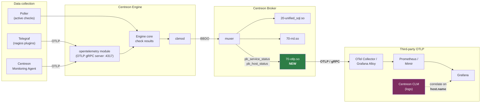

The new module is a **sibling of `70-rrd.so` and `70-victoria_metrics.so`** — a leaf consumer on the broker muxer. It adds no new ingestion path; it re-publishes what Broker already receives.

---

## 3. What the data actually looks like today

This section records the findings that constrain the design. Each is verified against the current tree.

### 3.1 The Telegraf format — our starting point

The ticket says to start from the Telegraf format rather than CMA. That format is documented in [opentelemetry.md](../../engine/modules/opentelemetry/doc/opentelemetry.md) and implemented in [nagios_check_result_builder.cc](../../engine/modules/opentelemetry/src/telegraf/nagios_check_result_builder.cc).

Its information model:

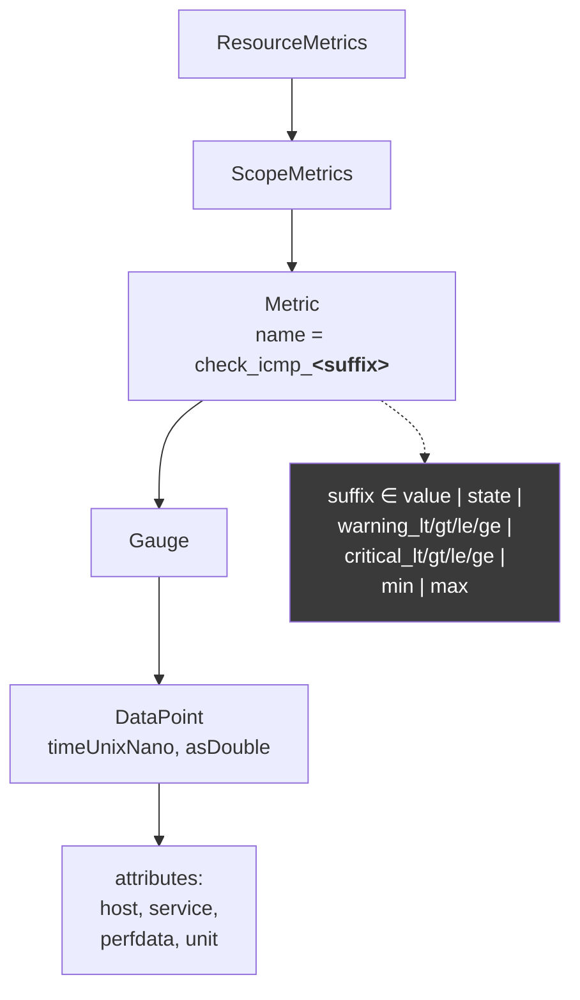

Two properties matter for the output design:

1. **One metric per (check, suffix); one datapoint per perfdata label.** A single `check_icmp_warning_gt` metric carries a datapoint for `rta` and another for `pl`, distinguished by the `perfdata` attribute.
2. **Thresholds, min, max and the Nagios state are sibling series**, not attributes of the value. `check_icmp_value`, `check_icmp_warning_gt`, `check_icmp_state` are separate metrics.

That second property is the one we carry forward. It is well-suited to Prometheus (each becomes its own time series) and it is what the ticket means by "use the Telegraf format as the starting point". What we deliberately *do not* carry forward is the **naming** — `check_icmp_warning_gt` is a Nagios name, and the ticket explicitly requires semconv names instead.

> **The framing that resolves the tension:** Telegraf's format defines *what information travels*. Semconv defines *what it is called*. The output is Telegraf's information model expressed in semconv vocabulary.

### 3.2 Thresholds are not in the BBDO metric event

`bbdo/storage.proto`:

```protobuf
message Metric {
  uint64 metric_id = 4;
  ValueType value_type = 7;   // GAUGE | COUNTER | DERIVE | ABSOLUTE | AUTOMATIC
  uint64 time = 8;
  double value = 9;
  string name = 10;
  uint64 host_id = 11;
  uint64 service_id = 12;
  double min = 13;
  double max = 14;
  string unit = 15;
}
```

No `warning`, no `critical`. Meanwhile [`common::perfdata`](../../common/inc/com/centreon/common/perfdata.hh) has all of them:

```cpp
float _critical;      float _critical_low;   bool _critical_mode;
float _warning;       float _warning_low;    bool _warning_mode;
float _min;           float _max;
std::string _unit;    data_type _value_type;
```

`unified_sql` obtains them by calling `perfdata::parse_perfdata()` on the raw string and binding the results into SQL ([stream_storage.cc:169](../unified_sql/src/stream_storage.cc#L169)). They are never re-emitted as BBDO fields.

And `neb.proto`'s `ServiceStatus` carries exactly what we need:

```protobuf
message ServiceStatus {
  uint64 host_id = 1;
  uint64 service_id = 2;
  State  state = 5;          // OK | WARNING | CRITICAL | UNKNOWN | PENDING
  StateType state_type = 6;  // SOFT | HARD
  string output = 14;
  string perfdata = 16;      // <-- the raw perfdata string
  int64  last_check = 21;
  ServiceType type = 31;
}
```

There is a second, independent reason not to build on `storage::pb_metric`: **it is a derived event manufactured by `unified_sql`**, not something the Engine sends. [stream_storage.cc:336](../unified_sql/src/stream_storage.cc#L336) constructs it *from* a `ServiceStatus` and its parsed perfdata, under the comment `// Send perfdata event to processing`:

```cpp
auto perf{std::make_shared<storage::pb_metric>()};
auto& m = perf->mut_obj();
m.set_metric_id(metric_id);   // <- requires a SQL index_data/metrics lookup
m.set_value(pd.value());
m.set_min(pd.min());
m.set_max(pd.max());          // <- warning/critical deliberately not carried
m.set_unit(pd.unit());
```

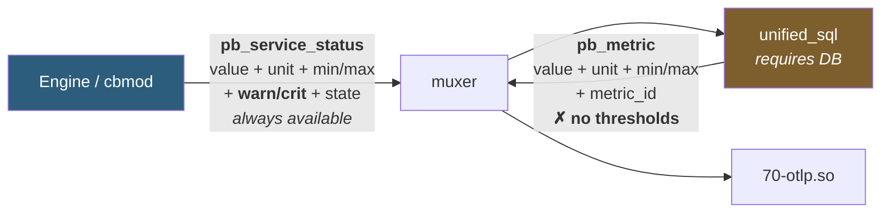

Building on `pb_metric` would therefore make the OTLP module **silently dependent on `unified_sql` and a database being present in the same broker instance**. On a poller-side broker, or any pipeline without `unified_sql`, no `pb_metric` is ever produced and the exporter would emit nothing at all — with no error to explain why.

**Conclusion:** subscribe to `neb::pb_service_status` (and `neb::pb_host_status`) and parse perfdata in-module with `common::perfdata::parse_perfdata`. This costs a duplicated parse of a string `unified_sql` also parses, and gives up `metric_id`/`interval`. Both are cheap prices for an exporter that carries thresholds and works in any topology.

### 3.3 Host and service names are already solved

`http_tsdb` resolves them through the persistent memory-mapped cache ([line_protocol_query.cc:428](../http_tsdb/src/line_protocol_query.cc#L428)):

```cpp
cache::global_cache::lock l;
const cache::host* host_info = _cache->get_host(host_id, l);
if (host_info) {
  is << host_info->name();
}
```

The cache is loaded from the factory ([victoria_metrics/src/factory.cc](../victoria_metrics/src/factory.cc)):

```cpp
if (config::applier::state::loaded()) {   // false only in UTs
  cache::global_cache::load(
      common::pool::io_context_ptr(),
      config::applier::state::instance().cache_dir() + ".cache.global");
}
```

Its **dual-cache design** is what makes this safe across restarts: a `.cnf` conf cache updated only by configuration events (stable, survives crashes) and a `.rt` real-time cache (discarded and rebuilt from conf if a crash is detected). Getters transparently fall back to the conf cache. So `host.name` survives a broker restart without waiting for a fresh config dump.

**Locking discipline is mandatory.** The cache lives in a mapped file segment that may be *remapped* when it grows, invalidating any pointer into it. A `global_cache::lock` must be held for as long as the returned pointer is used, and must never be held across a `write()`.

### 3.4 The `write()` / acknowledgement contract — and who owns retention

`io::stream` ([stream.hh](../core/inc/com/centreon/broker/io/stream.hh)):

```cpp
virtual int     write(std::shared_ptr<data> const& d) = 0;
virtual int32_t stop() = 0;
virtual int     flush();
virtual bool    read(std::shared_ptr<io::data>& d, time_t deadline);
virtual void    statistics(nlohmann::json& tree) const;
```

`write()` returns **the number of events durably delivered** — not a success flag, and not necessarily including the event just passed. The return value is fed verbatim to `multiplexing::muxer::ack_events()` by [failover.cc:391](../core/src/processing/failover.cc#L391):

| Return | Meaning |
|---|---|
| `N > 0` | Release N events from the muxer queue |
| `0` | Nothing acked yet — **keep them queued** |
| `< 0` | Write failure — triggers `increase_retry_delay_and_wait()`, exponential backoff capped by `max_retry_delay` (default 30 s) |

**This is the mechanism that makes module-level queue management unnecessary.** Unacknowledged events stay in the muxer's in-memory queue and, once `event_queue_max_size` is exceeded, spill to the retention (splitter) file. Retention and backpressure are **broker core's job, not the module's**. A module that invents its own bounded queue and drops on overflow is both redundant and worse — it discards data the retention file would have preserved.

`flush()` is called by the failover loop at most once per second whenever both the stream read and the muxer read time out, and its return is also acked. That is the natural place to force a partial batch out on a quiet system.

**Threading.** `processing::failover::_run()` is the *only* caller of `write()`, `flush()`, `read()` and `stop()` — one dedicated `std::thread` per output endpoint, every call serialized under `_stream_m`. So the stream sees a single writer thread. Blocking is *permitted* but stalls that endpoint's pipeline, which is why `http_tsdb` buffers in `write()` and hands the actual I/O to the shared `common::pool` asio threads, taking `_protect` again in the completion handler.

Note the useful precedent in `http_tsdb::stream::send_handler`: on export failure it **re-queues** the failed payload (`request->append(_request); _request = request;`) rather than dropping it. The OTLP module should do the same.

### 3.5 The gRPC and CMake situation

`bbdo/CMakeLists.txt` compiles the OTel protos **messages only** — `--cpp_out`, no gRPC plugin:

```cmake
set(otl_protobuf_files
    opentelemetry/proto/collector/metrics/v1/metrics_service
    opentelemetry/proto/metrics/v1/metrics
    opentelemetry/proto/common/v1/common
    opentelemetry/proto/resource/v1/resource)
# ... protoc --cpp_out=${CMAKE_SOURCE_DIR}/bbdo ...
add_library(pb_open_telemetry_lib STATIC ...)
```

So `pb_open_telemetry_lib` gives us `ExportMetricsServiceRequest` but **not** `MetricsService::Stub`. The gRPC stub is generated separately, into private source trees, by `engine/modules/opentelemetry/CMakeLists.txt` and `agent/CMakeLists.txt`.

**Good news — most of the build wiring already exists:**

- `centreon_pb_bbdo` links `pb_open_telemetry_lib` with the plain (PUBLIC) signature, so it propagates **transitively** onto every broker module that links `centreon_pb_bbdo`. Verified on the real link line of `50-grpc.so`.
- `${CMAKE_SOURCE_DIR}/bbdo` is already on the include path of every broker subdirectory, so `#include "opentelemetry/proto/.../metrics_service.pb.h"` resolves in a broker module today with no CMake change at all.
- Broker modules do **not** link `gRPC::grpc++` themselves. gRPC symbols stay undefined in the `.so` and are resolved at `dlopen` time from `cbd`, which links `gRPC::grpc++` and `protobuf::libprotobuf` inside `-Wl,--whole-archive`.

So the only genuinely new build work is (a) generating the gRPC stub centrally and (b) adding `${CMAKE_SOURCE_DIR}/common/grpc/inc` to the module's `include_directories` — it is *not* globally included in broker; `broker/grpc` adds it per-directory and a new module must do the same.

> ⚠️ **Do not follow `broker/stats_exporter`.** It looks like prior art for OTLP-from-broker but it is **dead code**: it targets the upstream `opentelemetry-cpp` SDK (`OtlpGrpcMetricExporterFactory`), is never `add_subdirectory()`'d, and its own CMake warns that linking `opentelemetry-cpp` twice deadlocks. This design deliberately uses the raw generated protobuf/gRPC stub instead of the upstream SDK, avoiding that whole dependency.

**The hazard.** There are already three generated OTel proto trees:

```
agent/src/opentelemetry/proto/...
bbdo/opentelemetry/proto/...
engine/modules/opentelemetry/src/opentelemetry/proto/...
```

Their contents differ by role: `bbdo/` has the four message `.pb.cc` only; `agent/src/` has the same four messages **plus** the gRPC stub; `engine/modules/opentelemetry/src/` has **only** the gRPC stub.

This repo has already been bitten by this: a stale `agent/src/.../common.pb.h` that was missing fields present in the `bbdo/` copy caused a `sizeof(KeyValue)` mismatch and heap corruption, because `agent/src` preceded `bbdo/` on the include path. The trees are byte-identical *today*, so no live mismatch exists — but the divergence is one submodule bump away.

Two details make this worse than ordinary duplication:

- Engine's otel module puts **`bbdo/` before its own `src/`** on the include path, so it takes messages from `bbdo/` and only the stub from its own tree. That is the correct pattern. The agent does the **opposite** ordering — which is precisely what produced the heap-corruption bug.
- Modules are `dlopen`'d with `RTLD_LAZY|RTLD_GLOBAL` ([modules.cc:168](../core/src/config/applier/modules.cc#L168)), so the **first-loaded module's copy of the OTel protobuf symbols interposes for every module loaded after it**. Duplicate copies in `10-neb.so` and `50-grpc.so` work today only because they are identical. Adding a fourth copy that could drift is a latent crash.

**A fourth tree under `broker/otlp/src/` must not be created.**

The fix is to generate the stub once, centrally:

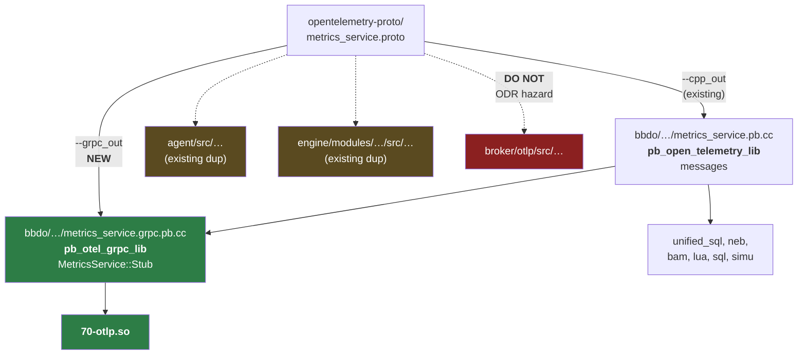

A separate `pb_otel_grpc_lib` target (rather than adding the stub to `pb_open_telemetry_lib`) keeps the gRPC dependency off the six modules that only need the messages.

### 3.6 A dormant OTLP carrier already exists in BBDO

Worth knowing before designing anything: BBDO **already** defines an event type that carries a raw OTLP request.

```cpp
// bbdo/events.hh:177
de_pb_otl_metrics = 13  // contains an
                        // ::opentelemetry::proto::collector::metrics::v1::ExportMetricsServiceRequest

// broker/neb/inc/com/centreon/broker/neb/internal.hh:115
using pb_otl_metrics = io::protobuf<
    opentelemetry::proto::collector::metrics::v1::ExportMetricsServiceRequest,
    make_type(io::storage, storage::de_pb_otl_metrics)>;
```

It is registered as `"OTLMetrics"` in [neb/src/broker.cc:228](../neb/src/broker.cc#L228) and handled by the BBDO gRPC transport generator. **But nothing anywhere publishes it.** It is complete, serializable, dormant plumbing.

This suggests an obviously cheaper architecture — *Option B: passthrough*:

```mermaid
flowchart LR
    subgraph B["Option B — passthrough (rejected)"]
        TG2["Telegraf / CMA"] -->|OTLP| ENG2["engine otel module"]
        ENG2 -->|"publish pb_otl_metrics<br/>(raw, unmodified)"| BRK2["broker"]
        BRK2 -->|"re-Export verbatim"| COL2["collector"]
        POLL2["poller active checks"] -.->|"❌ never becomes OTLP"| ENG2
    end

    subgraph A["Option A — normalize (chosen)"]
        ANY["Telegraf / CMA / poller<br/><i>all sources</i>"] --> ENG1["engine"]
        ENG1 -->|pb_service_status| BRK1["broker otlp module"]
        BRK1 -->|"semconv-mapped"| COL1["collector"]
    end

    style B fill:#3a2020
    style A fill:#203a20
```

**Rejected, for two decisive reasons:**

1. **It cannot satisfy the scope.** The ticket asks to export *any* data ingested by the Engine — "Telegraf, CMA, or poller". A passthrough only ever carries what arrived *as OTLP*. Poller-executed active checks never pass through the otel module and would be invisible.
2. **It cannot satisfy the study objective.** Forwarding the Telegraf payload verbatim re-emits `check_icmp_warning_gt` with a `host` datapoint attribute — the exact Nagios naming the ticket says to replace with `host.name` and `system.*`.

It remains genuinely useful as a **future optimisation** for the OTLP-native path (CMA data could skip a parse/re-serialize round trip), and the fact that the carrier already exists means that option stays open at zero cost. It just cannot be the PoC.

---

## 4. Target architecture

### 4.1 Module internals

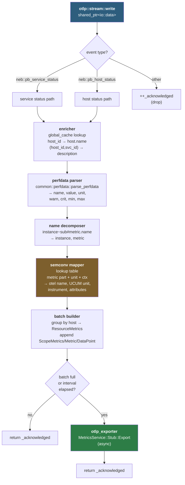

### 4.2 Class design

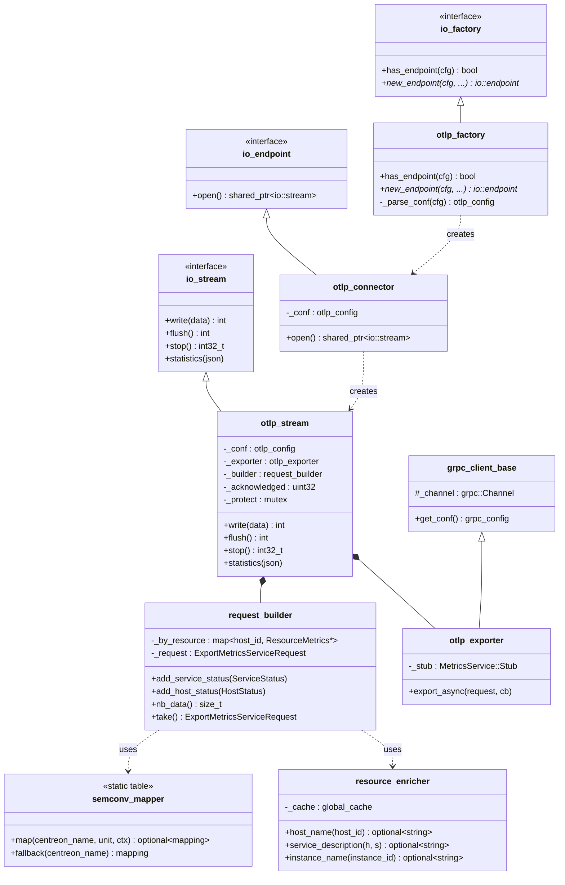

`otlp_exporter` deriving from `common::grpc::grpc_client_base` is the key reuse: that base already handles channel creation, TLS (`_certificate`, `_cert_key`, `_ca_cert`, `_ca_name`, `_ca_fingerprint`), bearer-token injection via a client interceptor, and compression. The subclass only adds the stub.

**The OTLP export RPC is unary**, not streaming:

```protobuf
rpc Export(ExportMetricsServiceRequest) returns (ExportMetricsServiceResponse);
```

That matters because the closest existing client in the repo, `to_agent_connector`, is **not** a template to copy — it drives a *bidirectional* stream (`ClientBidiReactor` + `AddHold`/`StartCall`) because `ReversedAgentService::Import` is bidi. All that reactor machinery is unnecessary here. Use the callback API, which is what all four gRPC client call sites in this repo use (there is zero `CompletionQueue`/`Next()` polling code anywhere):

```cpp
class otlp_exporter : public common::grpc::grpc_client_base {
  std::unique_ptr<
      opentelemetry::proto::collector::metrics::v1::MetricsService::Stub> _stub;

 public:
  otlp_exporter(const common::grpc::grpc_config::pointer& conf,
                const std::shared_ptr<spdlog::logger>& logger)
      : common::grpc::grpc_client_base(conf, logger),
        _stub(opentelemetry::proto::collector::metrics::v1::
                  MetricsService::NewStub(_channel)) {}

  void export_async(ExportMetricsServiceRequest&& req, export_callback cb) {
    // ctx/request/response must outlive the call — heap-allocate and
    // capture in the completion lambda.
    auto call = std::make_shared<pending_call>(std::move(req));
    _stub->async()->Export(&call->ctx, &call->request, &call->response,
                           [call, cb](::grpc::Status s) { cb(s, call); });
  }
};
```

The `common::defer(io_context, 10s, ...)` idiom used elsewhere in the repo is the right retry primitive for reconnection.

**Muxer subscription lives in the connector, not the stream.** The set of BBDO events a module receives is declared by passing filters to the `io::endpoint` constructor:

```cpp
static constexpr multiplexing::muxer_filter _otlp_stream_filter = {
    neb::pb_service_status::static_type(),
    neb::pb_host_status::static_type()};

static constexpr multiplexing::muxer_filter _otlp_forbidden_filter =
    multiplexing::muxer_filter(_otlp_stream_filter).reverse();

connector::connector(const otlp_config& conf)
    : io::endpoint(false, _otlp_stream_filter, _otlp_forbidden_filter),
      _conf(conf) {}
```

Setting `forbidden == ~mandatory` (the `.reverse()` above, as `victoria_metrics` does) makes `config::applier::endpoint` ignore any user `filters` block and force exactly this set — the right choice for a module whose correctness depends on receiving status events.

### 4.3 File layout

```
broker/otlp/
├── CMakeLists.txt
├── precomp_inc/precomp.hh
├── inc/com/centreon/broker/otlp/
│   ├── factory.hh
│   ├── connector.hh
│   ├── stream.hh
│   ├── otlp_config.hh
│   ├── otlp_exporter.hh
│   ├── request_builder.hh
│   ├── resource_enricher.hh
│   └── semconv_mapping.hh
├── src/
│   ├── main.cc              # broker_module_* entry points
│   ├── factory.cc
│   ├── connector.cc
│   ├── stream.cc
│   ├── otlp_config.cc
│   ├── otlp_exporter.cc
│   ├── request_builder.cc
│   ├── resource_enricher.cc
│   └── semconv_mapping.cc   # THE mapping table
└── test/
    ├── factory_test.cc
    ├── semconv_mapping_test.cc
    ├── request_builder_test.cc
    └── stream_test.cc
```

Module name **`70-otlp`** — the `70-*` tier is where output modules live (`70-rrd`, `70-graphite`, `70-influxdb`, `70-victoria_metrics`).

**Four registration points outside the module directory** — each easy to miss, and each producing a confusing failure if forgotten:

| # | File | Change | Symptom if forgotten |
|---|---|---|---|
| 1 | `broker/CMakeLists.txt` | `add_broker_module(OTLP ON)` | Module never built |
| 2 | `broker/core/src/config/parser.cc` | Add `else if (e.type == "otlp")` to the hardcoded type→module chain (~line 652) | Config parses but the `.so` is never loaded |
| 3 | `bbdo/CMakeLists.txt` | `--grpc_out` custom command + `pb_otel_grpc_lib` target | Undefined `MetricsService::Stub` at link |
| 4 | `broker/otlp/CMakeLists.txt` | `include_directories(${CMAKE_SOURCE_DIR}/common/grpc/inc)` | `grpc_client.hh` not found |

Point 2 is the one most likely to cost an afternoon: the endpoint `type` string is dispatched through an if-else chain in the parser, not through a registry, so a correctly-built module with correct configuration will simply never load.

---

## 5. The semconv mapping

### 5.1 Resource attributes

Emitted once per host, on the `ResourceMetrics.resource`.

| OTel attribute | Source | Status | Notes |
|---|---|---|---|
| `host.name` | `global_cache::get_host(host_id)->name()` | **available** | **The correlation key.** Centreon host name must equal the hostname CLM reports. |
| `service.name` | constant `"centreon-broker"` | **available** | The *emitting* service. See §5.3 — this is **not** the Centreon service. Becomes the Prometheus `job`. |
| `service.namespace` | constant `"centreon"` | available | |
| `service.instance.id` | `"<poller_name>:<broker_id>"` | derivable | Distinguishes broker instances |
| `service.version` | `CENTREON_BROKER_VERSION` | available | |
| `centreon.host.id` | `ServiceStatus.host_id` | available | Centreon-internal join key, kept for round-tripping |
| `centreon.poller.name` | poller/instance name | derivable | |
| `host.id` | — | **missing** | No machine-id/UUID in CIM today. See §8. |
| `host.arch` | — | **missing** | Not collected |
| `host.type` | — | **missing** | Not collected |
| `host.ip` | host `address` field | derivable | Centreon stores a resolution address, which may be a DNS name rather than an IP; needs validation before emitting |
| `os.type`, `os.name`, `os.version` | — | **missing** | Not collected |

Two rules from the spec constrain this table:

> "The `host.*` namespace SHOULD be exclusively used to capture resource attributes. To report host metrics, the `system.*` namespace SHOULD be used."

That is why every *metric* in §5.2 is `system.*` or `centreon.*`, and `host.*` appears only here, on the resource.

Second, and important to state plainly: **`host.name` is not an identity attribute.** The spec defines it loosely — "what the `hostname` command returns, or the fully qualified hostname, or another name specified by the user" — and does not guarantee uniqueness. `host.id` is the stable identifier (on Linux, `/etc/machine-id`). We are nonetheless using `host.name` as the correlation key because it is the only thing Centreon and CLM currently share, and because the ticket names it explicitly. The consequence is worth being honest about: **correlation is exactly as reliable as the operator's naming discipline.** Two hosts named `localhost` in different Centreon pollers will collide into one time series. Adding `host.id` (§8) is what would eventually make this robust rather than conventional.

The three `missing` rows are the substantive answer to the ticket's question *"what changes would be required to support OTLP attributes not currently available in CIM, such as `host.id`?"* — see §8.

### 5.2 Metric mapping table

Instrument types and units below are taken from the current [OTel system metrics semconv](https://opentelemetry.io/docs/specs/semconv/system/system-metrics/). Note several recent renames that older material gets wrong: the CPU state attribute is **`cpu.mode`** (not `system.cpu.state`), and dropped packets are **`system.network.packet.dropped`** (not `system.network.dropped`).

Confidence legend: **E** = exact semconv match · **C** = close, semantics need review · **N** = Centreon-namespaced, no standard exists.

#### 5.2.1 The structured metric name — where instance attributes come from

Centreon perfdata labels are not flat. They follow a structured convention parsed in [broker_utils.cc:659](../lua/src/broker_utils.cc#L659):

```
instance~subinstance1~subinstance2#metric.name
└──────────────┬──────────────────┘ └────┬────┘
        before the '#'                after the '#'
   instance = up to first '~'      the metric name proper
```

Examples:

| Raw perfdata label | instance | metric | Yields |
|---|---|---|---|
| `/var#disk.used.bytes` | `/var` | `disk.used.bytes` | `system.filesystem.mountpoint=/var` |
| `eth0#interface.traffic.in.bitspersecond` | `eth0` | `interface.traffic.in.bitspersecond` | `network.interface.name=eth0` |
| `sda~read#disk.io.bytes` | `sda` | `disk.io.bytes` | `system.device=sda`, sub `read` |
| `load1` | — | `load1` | no instance attribute |

This is the mechanism that makes semconv instance attributes (`system.filesystem.mountpoint`, `network.interface.name`, `system.device`, `cpu.logical_number`) genuinely derivable rather than guessed, and it is the single highest-value thing to implement in the mapper. Two consequences:

- The mapping table keys on the **metric part only** (after `#`), so one row covers every mountpoint.
- If a table row declares an instance attribute but the label has no instance part, **degrade to the `centreon.*` fallback** rather than emitting a semconv metric with an incomplete attribute set. A `system.filesystem.utilization` series with no mountpoint is worse than an honest vendor-named one, because it silently aggregates unrelated filesystems.

Note that this convention is a *plugin* convention, not something Broker enforces. Older or custom plugins emit flat labels, which is the main reason the mapping remains partial by design.

#### CPU

| Centreon metric | Unit | OTel metric | UCUM | Instrument | Attributes | Conf |
|---|---|---|---|---|---|---|
| `cpu`, `cpu_used`, `total_cpu_avg` | `%` | `system.cpu.utilization` | `1` | Gauge | — (aggregate) | E |
| `cpu_user`, `user` | `%` | `system.cpu.utilization` | `1` | Gauge | `cpu.mode=user` | E |
| `cpu_system`, `system` | `%` | `system.cpu.utilization` | `1` | Gauge | `cpu.mode=system` | E |
| `cpu_idle`, `idle` | `%` | `system.cpu.utilization` | `1` | Gauge | `cpu.mode=idle` | E |
| `cpu_iowait`, `iowait` | `%` | `system.cpu.utilization` | `1` | Gauge | `cpu.mode=iowait` | E |
| `cpu_steal`, `steal` | `%` | `system.cpu.utilization` | `1` | Gauge | `cpu.mode=steal` | E |
| `cpu_nice`, `nice` | `%` | `system.cpu.utilization` | `1` | Gauge | `cpu.mode=nice` | E |
| `cpu_N` (per-core) | `%` | `system.cpu.utilization` | `1` | Gauge | `cpu.logical_number=N` | E |

> **Unit conversion required.** Centreon reports percent (0–100); semconv `utilization` is a ratio with unit `1` (0–1). The mapper must divide by 100. This is the single most common silent-wrongness risk in the table.

#### Memory and swap

| Centreon metric | Unit | OTel metric | UCUM | Instrument | Attributes | Conf |
|---|---|---|---|---|---|---|
| `used` (memory ctx) | `B` | `system.memory.usage` | `By` | UpDownCounter | `system.memory.state=used` | E |
| `free` (memory ctx) | `B` | `system.memory.usage` | `By` | UpDownCounter | `system.memory.state=free` | E |
| `cached` | `B` | `system.memory.usage` | `By` | UpDownCounter | `system.memory.state=cached` | E |
| `buffer` | `B` | `system.memory.usage` | `By` | UpDownCounter | `system.memory.state=buffered` | E |
| `memory_used_pct`, `used_prct` | `%` | `system.memory.utilization` | `1` | Gauge | `system.memory.state=used` | E |
| `total` (memory ctx) | `B` | `system.memory.limit` | `By` | UpDownCounter | — | E |
| `swap_used`, `swap` | `B` | `system.paging.usage` | `By` | UpDownCounter | `system.paging.state=used` | E |
| `swap_free` | `B` | `system.paging.usage` | `By` | UpDownCounter | `system.paging.state=free` | E |
| `swap_used_prct` | `%` | `system.paging.utilization` | `1` | Gauge | `system.paging.state=used` | E |

> **Context-sensitivity.** `used`, `free` and `total` are ambiguous in isolation — they occur in memory, swap and filesystem checks alike. The mapper therefore keys on **(metric name, unit, service-description hint)**, not on the metric name alone. This is why `semconv_mapper::map()` takes a context argument.

#### Filesystem and disk

| Centreon metric | Unit | OTel metric | UCUM | Instrument | Attributes | Conf |
|---|---|---|---|---|---|---|
| `used` (disk ctx) | `B` | `system.filesystem.usage` | `By` | UpDownCounter | `system.filesystem.state=used`, `system.filesystem.mountpoint=<mp>` | E |
| `free` (disk ctx) | `B` | `system.filesystem.usage` | `By` | UpDownCounter | `system.filesystem.state=free`, `system.filesystem.mountpoint=<mp>` | E |
| `used_prct` (disk ctx) | `%` | `system.filesystem.utilization` | `1` | Gauge | `system.filesystem.mountpoint=<mp>` | E |
| `size`, `total` (disk ctx) | `B` | `system.filesystem.limit` | `By` | UpDownCounter | `system.filesystem.mountpoint=<mp>` | E |
| `read`, `read_bytes` | `B` | `system.disk.io` | `By` | Counter | `disk.io.direction=read`, `system.device=<dev>` | E |
| `write`, `write_bytes` | `B` | `system.disk.io` | `By` | Counter | `disk.io.direction=write`, `system.device=<dev>` | E |
| `read_iops` | `c` | `system.disk.operations` | `{operation}` | Counter | `disk.io.direction=read` | C |
| `write_iops` | `c` | `system.disk.operations` | `{operation}` | Counter | `disk.io.direction=write` | C |
| `inodes`, `inodes_used_prct` | `%` | `centreon.filesystem.inode.utilization` | `1` | Gauge | `system.filesystem.mountpoint=<mp>` | N |

> **Mountpoint, device and interface come from the structured metric name** — see §5.2.1. Where the instance part is absent, emit without the attribute rather than guessing.

#### Network

| Centreon metric | Unit | OTel metric | UCUM | Instrument | Attributes | Conf |
|---|---|---|---|---|---|---|
| `traffic_in` | `b/s` | `system.network.io` | `By` | Counter | `network.io.direction=receive`, `network.interface.name=<if>` | C |
| `traffic_out` | `b/s` | `system.network.io` | `By` | Counter | `network.io.direction=transmit`, `network.interface.name=<if>` | C |
| `packets_in` | `c` | `system.network.packet.count` | `{packet}` | Counter | `network.io.direction=receive` | E |
| `packets_out` | `c` | `system.network.packet.count` | `{packet}` | Counter | `network.io.direction=transmit` | E |
| `discard_in`, `drop_in` | `c` | `system.network.packet.dropped` | `{packet}` | Counter | `network.io.direction=receive`, `network.interface.name=<if>` | E |
| `discard_out`, `drop_out` | `c` | `system.network.packet.dropped` | `{packet}` | Counter | `network.io.direction=transmit`, `network.interface.name=<if>` | E |
| `error_in` | `c` | `system.network.errors` | `{error}` | Counter | `network.io.direction=receive` | E |
| `error_out` | `c` | `system.network.errors` | `{error}` | Counter | `network.io.direction=transmit` | E |
| `con_established` | `c` | `system.network.connection.count` | `{connection}` | UpDownCounter | `network.connection.state=established` | E |

> **`traffic_in`/`traffic_out` are bits per second; `system.network.io` is cumulative bytes.** These are genuinely different quantities — a rate versus a monotonic counter. Emitting a Centreon rate as `system.network.io` would be a silent data-lie: downstream `rate()` queries in Prometheus would produce nonsense. **Recommendation: map these to `centreon.network.throughput` (Gauge, `By/s`, after dividing by 8) rather than forcing them into `system.network.io`.** The table row above is marked `C` precisely because it should not be taken at face value. This is the clearest example of why a mapping table needs semantic review, not just name matching.

#### Load, latency, processes, uptime

| Centreon metric | Unit | OTel metric | UCUM | Instrument | Attributes | Conf |
|---|---|---|---|---|---|---|
| `load1` | — | `system.linux.cpu.load_1m` | `{run_queue_item}` | Gauge | — | E |
| `load5` | — | `system.linux.cpu.load_5m` | `{run_queue_item}` | Gauge | — | E |
| `load15` | — | `system.linux.cpu.load_15m` | `{run_queue_item}` | Gauge | — | E |
| `nbproc`, `processes` | `c` | `system.process.count` | `{process}` | UpDownCounter | `process.state=<st>` | E |
| `uptime` | `s` | `system.uptime` | `s` | Gauge | — | E |
| `rta` (check_icmp) | `ms` | `centreon.icmp.rtt` | `s` | Gauge | — | N |
| `rtmin`, `rtmax` | `ms` | `centreon.icmp.rtt.min` / `.max` | `s` | Gauge | — | N |
| `pl` (packet loss) | `%` | `centreon.icmp.packet_loss` | `1` | Gauge | — | N |
| `time` (response time) | `s` | `centreon.check.duration` | `s` | Gauge | — | N |

> `ms → s` conversion required for `rta`/`rtmin`/`rtmax`. There is no semconv for ICMP round-trip time, hence the Centreon namespace.

### 5.3 The `service.name` collision — resolved

This is the subtlest part of the design and the one most likely to be got wrong.

OpenTelemetry defines `service.name` as **the name of the service that is producing the telemetry**. Centreon's "service" is something entirely different: a *check* performed against a host (`Disk-/var`, `Ping`, `CPU`).

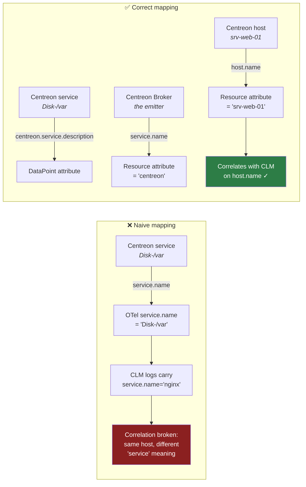

**Decision:**

- `service.name` = `"centreon-broker"` — a resource attribute naming the emitter, per spec.
- `service.namespace` = `"centreon"`.
- The Centreon service becomes **datapoint attributes**:
  - `centreon.service.description` — human-readable (`Disk-/var`)
  - `centreon.service.id` — numeric id
  - `centreon.service.type` — `service` | `metaservice` | `ba` | `anomaly-detection`
- `host.name` stays the single correlation key with CLM.

**The concrete cost of getting this wrong** is not merely philosophical. Prometheus's OTLP receiver derives the `job` label as `<service.namespace>/<service.name>`. Putting the check name in `service.name` would therefore make **every Centreon check its own Prometheus job**, multiplying `target_info` series by hosts × checks and fragmenting the very thing we are trying to correlate. With the scheme above there is one `job="centreon/centreon-broker"` and exactly one `target_info` series per host.

Putting the Centreon service at datapoint level rather than resource level is the same argument at a different layer: it keeps **one `ResourceMetrics` per host**, which is what makes host-level correlation natural, while still distinguishing each check's series by attribute.

**Name-reuse rule.** Where an OTel attribute is emitted for a concept, no `centreon.*` synonym is emitted for the same concept. We emit `host.name`, so `centreon.host.name` must not exist. We do *not* emit `host.id` (unavailable — §5.1), so `centreon.host.id` is both legal and necessary.

### 5.4 Centreon namespace convention

Following OTel's guidance that vendors must not extend `otel.*` or squat existing namespaces, everything Centreon-specific lives under a `centreon.` root:

| Prefix | Use |
|---|---|
| `centreon.host.*` | Centreon host identifiers (`centreon.host.id`) |
| `centreon.service.*` | Centreon service/check identifiers |
| `centreon.poller.*` | Poller identity |
| `centreon.metric.*` | Metric-level metadata (`centreon.metric.name` for the original perfdata label) |
| `centreon.threshold.*` | Threshold annotations |
| `centreon.state.*` | Check state annotations |
| `centreon.<domain>.<metric>` | Metrics with no semconv equivalent (`centreon.icmp.rtt`) |

Names are lowercase, dot-separated for namespaces, `snake_case` within a segment — matching OTel naming rules.

`centreon.` is chosen over the reverse-domain `com.centreon.`, which OTel guidance also permits, for two reasons: `centreon` is both the company and the product name, so it satisfies the "system name" rule directly; and it survives Prometheus label promotion legibly (`centreon_service_description`). Reserve `com.centreon.*` for customer-internal extensions that should never reach a shared backend — the shipped module never emits it.

Three hard rules:

1. **Never nest Centreon names under an existing OTel namespace root.** Forbidden: `system.centreon.*`, `host.centreon.*`, `service.centreon.*`, `network.centreon.*`, and anything under `otel.*` (explicitly reserved by the spec). This is exactly the clash semconv warns about.
2. **The reverse is allowed.** After the `centreon.` root, OTel-looking words may be reused freely — `centreon.system.filesystem.utilization.threshold` is fine, because the root already disambiguates and no future semconv addition can collide with it.
3. **No synonyms.** If an OTel attribute is emitted for a concept, no `centreon.*` equivalent is emitted for that same concept (§5.3).

**Fallback rule for unmapped metrics** (deterministic, no configuration):

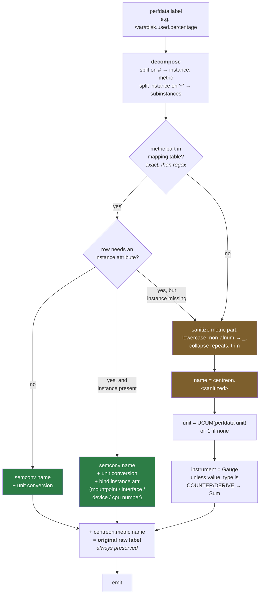

The "needs an instance attribute but none present" edge is the important one: it **degrades to the vendor namespace rather than emitting an under-attributed semconv metric**, for the reason given in §5.2.1.

`centreon.metric.name` is attached **in both branches**. That guarantees no information is lost by mapping, and gives operators a way to find a metric by its familiar Centreon name even after renaming.

### 5.5 Thresholds, state, min/max

No OTel semantic convention exists for alert thresholds or check state. Following the Telegraf model of sibling series, but relocated into the Centreon namespace so the semconv namespace stays clean.

**Naming rule — derive the threshold metric from the value metric:**

```
threshold_metric = "centreon." + <emitted name> + ".threshold"
   … with a collapse rule: if <emitted name> already starts with "centreon.",
     the prefix is not repeated.

system.filesystem.utilization  →  centreon.system.filesystem.utilization.threshold
centreon.icmp.rtt              →  centreon.icmp.rtt.threshold
```

| Emitted metric | Type | Unit | Attributes |
|---|---|---|---|
| `<mapped name>` | per table | per table | semconv instance attrs + `centreon.*` identity |
| `centreon.<mapped name>.threshold` | Gauge | **same as the value metric** | `centreon.threshold.level` = `warning`\|`critical`, `centreon.threshold.bound` = `lower`\|`upper` |
| `centreon.<mapped name>.bound` | Gauge | same as the value metric | `centreon.bound.type` = `min`\|`max` |
| `centreon.check.state` | Gauge | `1` | `centreon.state.type` = `soft`\|`hard`; value 0=OK 1=WARNING 2=CRITICAL 3=UNKNOWN 4=PENDING |

Deriving the name rather than using one generic `centreon.check.threshold` with a pointer label is deliberate, for one strong reason: **unit consistency**. A single shared threshold metric would mix bytes, ratios and seconds into one time series name, which breaks the Prometheus convention that a metric name implies a unit and makes `rate`/aggregation across it meaningless. Per-metric threshold names keep each series unit-correct and let a dashboard find a threshold by string construction from the value metric's name.

State is the exception — it is genuinely one unitless enum for every check, so one metric name is correct there.

**Rejected: exemplars.** The CMA encodes thresholds as `Exemplar.filtered_attributes` ([scheduler.cc](../../agent/src/scheduler.cc)). Do not copy that here. Exemplars exist to link a datapoint to a trace; Prometheus and Grafana's OTLP ingestion drop them, so the thresholds would simply vanish. `Metric.metadata` is likewise wrong — the spec states consumers should not need to be aware of those attributes.

Controlled by three independent config booleans, **all defaulting to `true`** per the ticket:

```
"send_thresholds": true,
"send_status":     true,
"send_min_max":    true
```

### 5.6 What we emit — payload shape

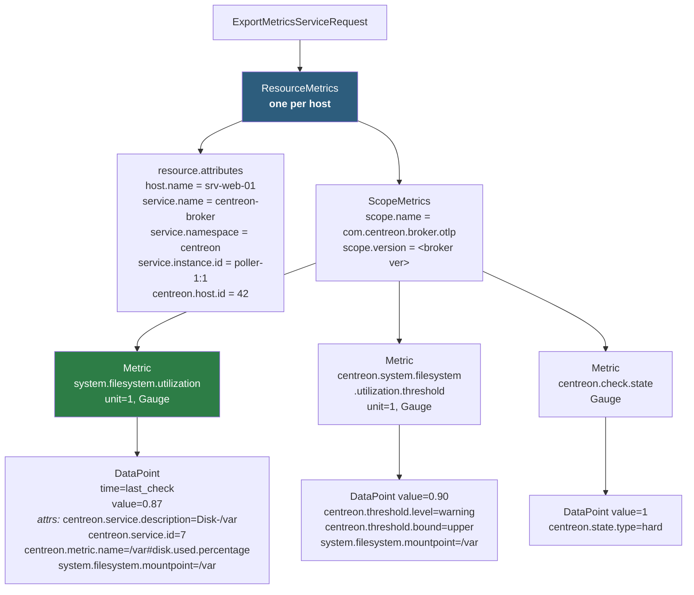

One `ResourceMetrics` per host is what makes the CLM correlation work: Prometheus's OTLP receiver turns resource attributes into a `target_info` series and promotes `host.name` to a label, so metrics and CLM logs from `srv-web-01` join naturally.

---

## 6. Runtime behaviour

### 6.1 Export sequence

```mermaid
sequenceDiagram
    participant MUX as broker muxer
    participant ST as otlp::stream
    participant CA as global_cache
    participant PD as perfdata parser
    participant RB as request_builder
    participant EX as otlp_exporter
    participant COL as OTLP collector

    MUX->>ST: write(pb_service_status)
    activate ST
    ST->>ST: lock _protect
    ST->>CA: lock; get_host(host_id)
    CA-->>ST: host.name
    ST->>CA: get_service(h,s)
    CA-->>ST: description
    Note over ST,CA: cache lock released<br/>before any I/O
    ST->>PD: parse_perfdata(status.perfdata())
    PD-->>ST: list<perfdata>
    loop each perfdata
        ST->>RB: add(mapped metric + threshold + bounds)
    end
    ST->>RB: nb_data()
    RB-->>ST: n

    alt n >= max_batch
        ST->>RB: take()
        RB-->>ST: ExportMetricsServiceRequest
        ST->>ST: unlock _protect
        ST->>EX: export_async(req, cb)
        EX->>COL: MetricsService::Export (gRPC)
        Note over ST: returns immediately;<br/>does not block muxer
    end
    ST-->>MUX: return _acknowledged
    deactivate ST

    COL-->>EX: ExportMetricsServiceResponse
    EX->>EX: cb — log partial_success<br/>rejected_data_points
```

Three things this diagram encodes deliberately:

1. **The cache lock is released before any network I/O.** Required — the `global_cache` documentation forbids holding a lock across a `write()`, and the segment can be remapped on growth.
2. **`export_async` does not block `write()`.** The muxer thread must not stall on a slow collector.
3. **Acknowledgement is optimistic** — events are acked when buffered, not when the collector confirms. `partial_success.rejected_data_points` is logged but cannot retroactively un-acknowledge. This is the same trade the existing TSDB outputs make.

### 6.2 Backpressure and failure

The single most important rule: **do not build a queue.** Broker core already has one, backed by a retention file. The module's job is to report honestly how many events it has delivered and let the muxer decide what to hold.

| Situation | Behaviour |
|---|---|
| Collector unreachable | Do **not** ack (`write()` returns `0`, or `< 0` to request backoff). Events stay in the muxer queue and spill to the retention splitter file once `event_queue_max_size` is exceeded. gRPC's channel retries with its own backoff underneath. |
| Collector slow | Cap concurrent exports at `max_inflight_requests`; stop acking while saturated. The muxer applies the backpressure. |
| Export fails after acking | Re-queue the failed payload into the pending batch, exactly as `http_tsdb::stream::send_handler` does. |
| Broker shutdown | `stop()` flushes the pending batch with a bounded timeout, then returns the ack count. |
| `partial_success` returned | Log rejected count and `error_message`. No retry — those datapoints are already acked. |
| Cache miss on `host.name` | **Drop the datapoint, ack the event, log rate-limited.** Emitting metrics without `host.name` would break the correlation acceptance criterion and pollute the target with unattributable series. Not acking would stall the pipeline forever on a permanently unresolvable event, so this fails *open* on the event and *closed* on the data. |

The one bound the module does own is the in-flight/pending batch cap. That is a bound on *concurrency*, not a replacement for retention, and it exists so a down collector cannot accumulate unbounded heap — the failure mode already documented in this repo's `unified_sql` memory-leak analysis.

### 6.3 Cardinality

Prometheus cardinality is `hosts × services × metrics-per-service`, multiplied by ~3 if thresholds and state are on. For a 5 000-host estate at 20 services each with 5 metrics that is ~500 000 series before thresholds, ~1.5 M with. That is real but manageable for Mimir-class backends; it is a reason the three `send_*` toggles exist. This should be called out in operator documentation rather than discovered in production.

### 6.4 Observability of the module itself

`statistics(nlohmann::json&)` should expose, at minimum: batches sent, datapoints sent, datapoints dropped (by reason: cache miss / queue full), export errors, partial-success rejections, in-flight requests, and last export latency. The existing `http_tsdb::stream` already reports `avg_connect_ms` / `avg_send_ms` and is the pattern to follow.

---

## 7. Configuration

A broker output endpoint block, parsed in `otlp::factory::new_endpoint`:

```json
{
  "name": "otlp-export",
  "type": "otlp",
  "endpoint": "otel-collector.example.com:4317",
  "encryption": true,
  "ca_certificate": "/etc/ssl/certs/ca.pem",
  "certificate": "/etc/ssl/certs/broker.crt",
  "private_key": "/etc/ssl/private/broker.key",
  "ca_name": "",
  "compression": true,
  "keepalive_interval": 30,

  "max_datapoints_per_batch": 5000,
  "max_send_interval": 10,
  "max_inflight_requests": 4,
  "export_timeout": 30,

  "send_thresholds": true,
  "send_status": true,
  "send_min_max": true
}
```

The first block maps one-to-one onto `common::grpc::grpc_config`, so no new TLS configuration code is needed. Per the ticket, **the mapping itself is not configurable** — there are no user-facing mapping knobs, only the three emission toggles.

---

## 8. Answers to the ticket's open questions

**"Management of custom attributes and mapping configuration."**
Out of scope for the PoC, by the ticket's own statement that the mapping is not configurable. The design keeps the door open: `semconv_mapping.cc` holds a single static table behind `semconv_mapper::map()`, so a future configurable overlay is a change to one file rather than a redesign. Recommendation: ship the PoC hard-coded, then evaluate demand.

**"What changes would be required in plugins, discovery, and other components to support OTLP attributes not currently available in CIM, such as `host.id`?"**

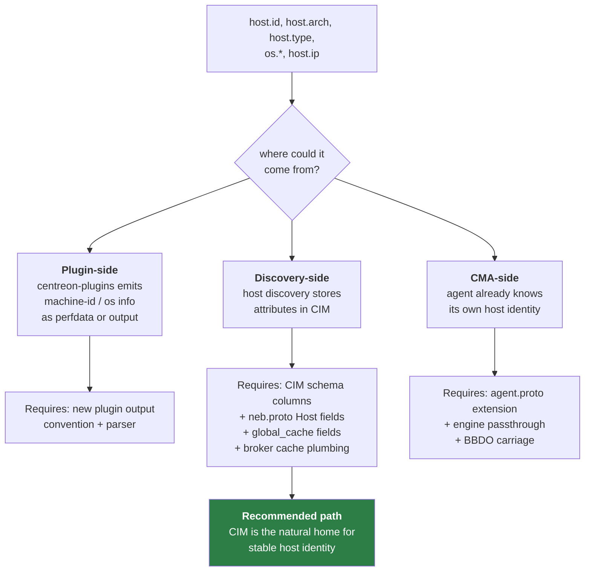

The cheapest credible increment is `host.id`: add a nullable `machine_id` column to the host configuration, surface it on `neb.proto`'s `Host` message, cache it in `global_cache`, and emit it. Everything else (`os.*`, `host.arch`) is a larger discovery-side project. **None of it blocks the PoC** — `host.name` alone satisfies the stated acceptance criterion.

**"Should thresholds, status, min/max be sent optionally? By default yes."**
Implemented as three independent booleans defaulting to `true` (§5.5). They are separate rather than one flag because their cardinality costs differ sharply — thresholds roughly double the series count, state adds a fixed one per service.

---

## 9. Testing strategy

| Level | What | Where |
|---|---|---|
| Unit | Mapping table: every row asserts name, unit, instrument, attributes, **and unit conversion** (`%`→ratio, `ms`→s, `b/s`→By/s) | `test/semconv_mapping_test.cc` |
| Unit | `request_builder`: one `ResourceMetrics` per host; correct nesting; threshold/state toggles honoured | `test/request_builder_test.cc` |
| Unit | `stream::write` acknowledgement arithmetic; unhandled events acked; batch-full triggers export | `test/stream_test.cc` |
| Unit | Config parsing and defaults | `test/factory_test.cc` |
| Integration | Robot test: engine + broker + a Python OTLP collector stub asserting the received protobuf | `tests/broker-engine/otlp_output.robot` |
| Acceptance | Real Grafana/Prometheus ingesting, dashboard joining metrics with CLM logs on `host.name` | manual |

The repo already has Python OTLP protobuf bindings at `tests/resources/opentelemetry/proto/collector/metrics/v1/metrics_service_pb2_grpc.py`, so a collector stub for the Robot test is largely free.

Broker modules do **not** produce their own test binaries. Each module appends its test `.cc` files to `TESTS_SOURCES` and its target to `TESTS_LIBRARIES`, both `PARENT_SCOPE`, and everything is compiled into the single `ut_broker` executable built by `broker/test/CMakeLists.txt`:

```cmake
if(WITH_TESTING)
  set(TESTS_SOURCES ${TESTS_SOURCES}
      ${TEST_DIR}/semconv_mapping_test.cc
      ${TEST_DIR}/request_builder_test.cc
      ${TEST_DIR}/stream_test.cc
      ${TEST_DIR}/factory_test.cc
      PARENT_SCOPE)
  set(TESTS_LIBRARIES ${TESTS_LIBRARIES} ${OTLP} PARENT_SCOPE)
endif()
```

Note the existing UT caveat: `config::applier::state::loaded()` is `false` in unit tests, which is why the factory guards the `global_cache::load` call. The enricher must therefore be injectable so tests can supply a fake cache rather than requiring a real mapped file.

---

## 10. Implementation roadmap

Ordered so the riskiest unknown is retired first — the point of a PoC is to fail fast on the thing that could invalidate the approach.

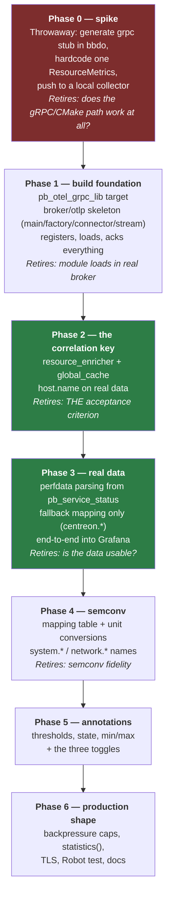

Phase 2 before Phase 4 is the important ordering: a semconv-perfect exporter that cannot resolve `host.name` fails the acceptance criterion, whereas a correlating exporter emitting only `centreon.*` names already demonstrates the concept end-to-end.

**Minimum viable PoC = Phases 0–3.** That satisfies "any incoming Engine data flow containing declared data exposed in a format ingestible by a third-party OTLP tool", correlating on `host.name`. Phases 4–5 deliver the semconv-compliance half of the study objective.

---

## 11. Risks

| Risk | Severity | Mitigation |
|---|---|---|
| Creating a 4th OTel proto tree → ODR heap corruption | **high** | Central `pb_otel_grpc_lib` in `bbdo/`; never copy generated headers into `broker/otlp/src/` |
| Silent unit mismatch (% vs ratio, ms vs s, b/s vs By) | **high** | Unit conversion is part of the mapping table, asserted per-row in unit tests |
| Semantic mismatch (`traffic_in` → `system.network.io`) | **high** | Prefer `centreon.*` over a wrong semconv name; every `C`-confidence row reviewed before shipping |
| Building on `storage::pb_metric` → module silently emits nothing without `unified_sql` | **high** | Source from `neb::pb_service_status` (§3.2) |
| Flat perfdata labels from older/custom plugins → no instance attribute | medium | Degrade to `centreon.*` fallback (§5.2.1); never emit an under-attributed semconv metric |
| Cardinality explosion in Prometheus | medium | Three emission toggles; document the multiplier |
| Re-implementing retention inside the module | medium | Return `0`/`<0` from `write()`; the muxer and splitter file own retention (§3.4) |
| Centreon host name ≠ CLM hostname | medium | Out of the module's control; document as a deployment prerequisite for correlation |
| Mapping table built on assumed plugin metric names | medium | §5.2 needs validation against the real centreon-plugins catalog before Phase 4 |

---

## 12. Implementation notes

The module exists at [broker/otlp/](../otlp/) and builds as `70-otlp.so`. Three things the design above did not anticipate, all found while making it compile and run:

**A fifth registration point.** §4.3 lists four; there is also `broker/test/CMakeLists.txt`, which needs `include_directories(${PROJECT_SOURCE_DIR}/otlp/inc)` or the module's unit tests will not compile into `ut_broker`. There is no `bbdo_neb` target either — the neb protobuf messages come from `pb_neb_lib` (`bbdo_storage` has no neb counterpart).

**The precompiled header carries more than its own includes.** `common/pool.hh` refers to `asio` unqualified, `grpc_config.hh` needs `absl::flat_hash_set` already included, and the `global_cache` headers declare their own boost interprocess aliases but expect the boost headers to be present. All of these must be in `precomp_inc/precomp.hh`, mirroring `http_tsdb`'s.

**Two concurrency/protobuf hazards worth keeping in mind for any similar module:**

1. *Do not call the exporter while holding the stream mutex.* The first implementation dispatched from inside the locked section, and the completion callback also takes that mutex — an exporter that completes synchronously deadlocks instantly, and even an asynchronous one means holding a lock across I/O. `stream::_prepare_send_locked()` now only *detaches* the batch; `stream::_dispatch()` is called after the lock is released.

2. *`gauge` and `sum` share a protobuf oneof.* `_metric_for()` indexes Metrics by name, and the fallback path picks the instrument from the perfdata value type, so the same name can be reached once as a gauge and once as a sum. Calling `mutable_sum()` on a Metric already holding a gauge clears the field and silently discards every datapoint collected so far. `_new_point()` therefore follows the instrument the Metric already has — which is also what OTLP requires, one type per metric name per scope.

Threshold and bound Metrics are created lazily on the first finite bound, so a perfdata without thresholds does not leave empty Metric entries in the payload.

---

## 13. Summary

The build is straightforward Centreon Broker work — the module skeleton, the name cache, the gRPC client base and the OTel protobuf messages all already exist and are all already used together elsewhere in the tree. The genuinely new engineering is concentrated in two places:

1. **Sourcing from `neb::pb_service_status` and parsing perfdata in-module**, because the structured BBDO metric event silently lacks the thresholds the ticket asks us to export.
2. **The mapping table** — where the risk is not writing code but writing *wrong equivalences*. A Centreon rate mapped onto a semconv cumulative counter produces dashboards that look right and are wrong. Marking each row's confidence, converting units explicitly, and preferring an honest `centreon.*` name over a flattering-but-incorrect `system.*` one is the discipline that makes this deliverable trustworthy.

`host.name` as the single correlation key is both the acceptance criterion and the simplest part of the design — it is one `global_cache` lookup that the codebase already performs in three other modules.
