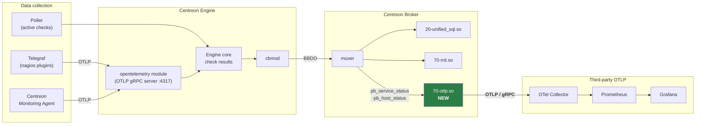
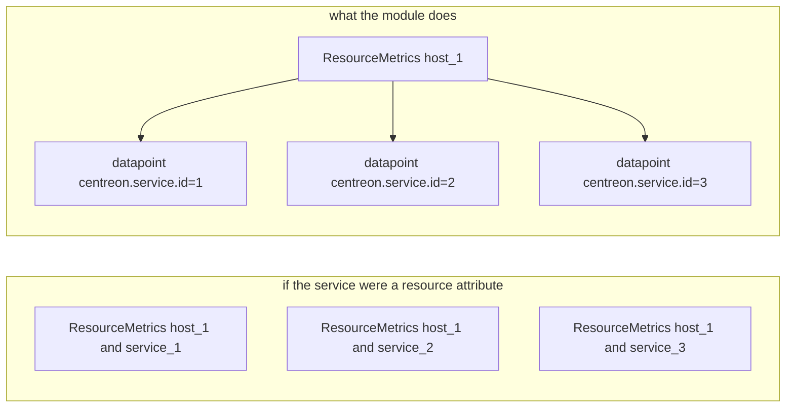

# Pipelane 

### Resource attributes

Emitted once per host, on the `ResourceMetrics.resource`.

| OTel attribute | Source | Status | Notes |
|---|---|---|---|
| `host.name` | `global_cache::get_host(host_id)->name()` | **available** | **The correlation key.** Centreon host name must equal the hostname CLM reports. |
| `service.name` | constant `"centreon-broker"` | **available** | The *emitting* service. See §5.3 — this is **not** the Centreon service. Becomes the Prometheus `job`. |
| `service.namespace` | constant `"centreon"` | available | |
| `service.instance.id` | `"<poller_name>:<broker_id>"` | derivable | Distinguishes broker instances |
| `service.version` | `CENTREON_BROKER_VERSION` | available | |
| `centreon.host.id` | `ServiceStatus.host_id` | available | Centreon-internal join key, kept for round-tripping |
| `centreon.poller.name` | poller/instance name | derivable | |
| `host.id` | — | **missing** | No machine-id/UUID in CIM today. See §8. |
| `host.arch` | — | **missing** | Not collected |
| `host.type` | — | **missing** | Not collected |
| `host.ip` | host `address` field | derivable | Centreon stores a resolution address, which may be a DNS name rather than an IP; needs validation before emitting |
| `os.type`, `os.name`, `os.version` | — | **missing** | Not collected |

# Data structure

---

### start semcov : *

Centreon metrics:

| Centreon label | OTel metric | Static attribute |
|---|---|---|
| `cpu.user.percentage` | `system.cpu.utilization` | `cpu.mode=user` |
| `cpu.idle.percentage` | `system.cpu.utilization` | `cpu.mode=idle` |
| `memory.usage.bytes` | `system.memory.usage` | `system.memory.state=used` |
| `memory.free.bytes` | `system.memory.usage` | `system.memory.state=free` |
| `disk.io.read.bytes` | `system.disk.io` | `disk.io.direction=read` |

---

