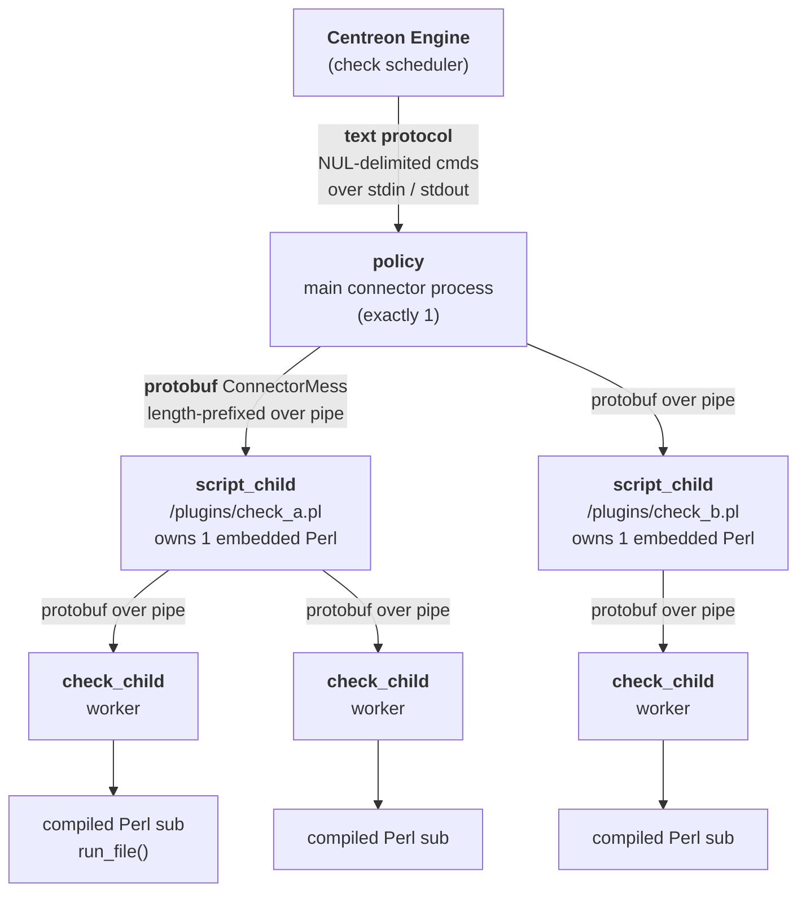
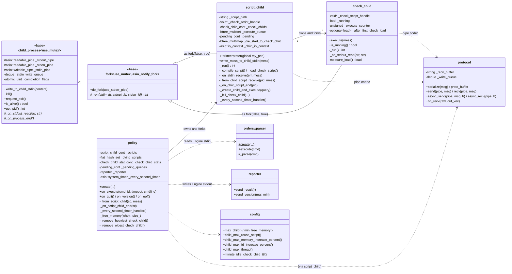
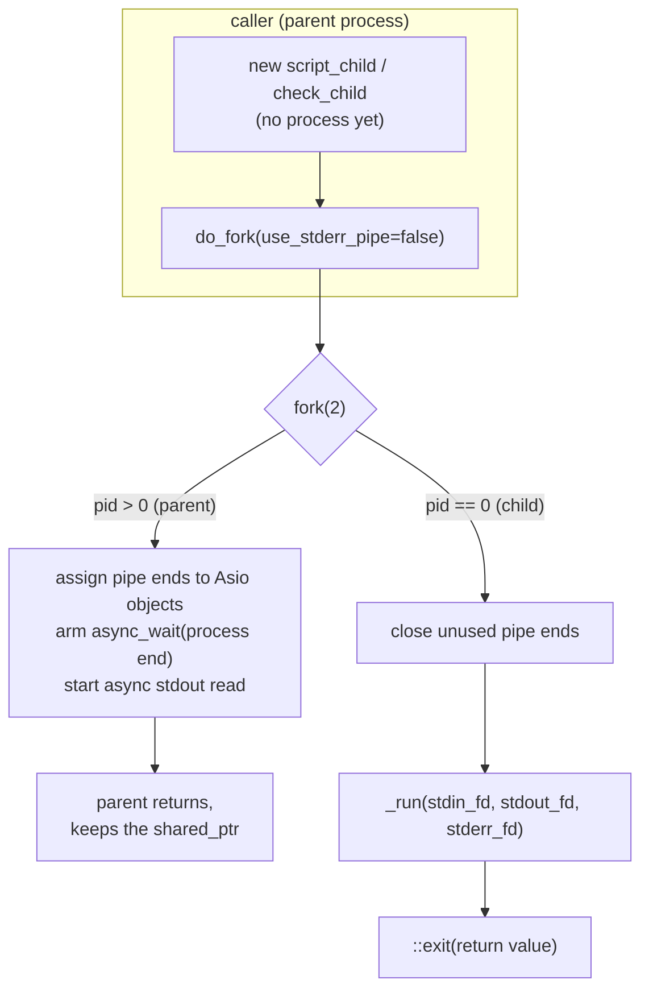
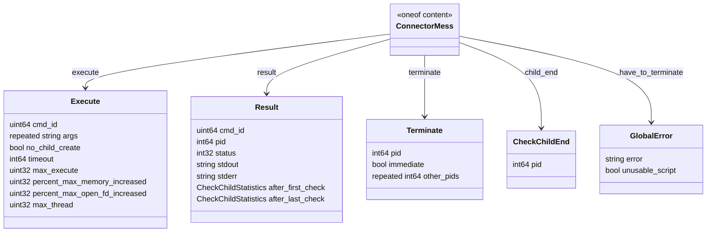
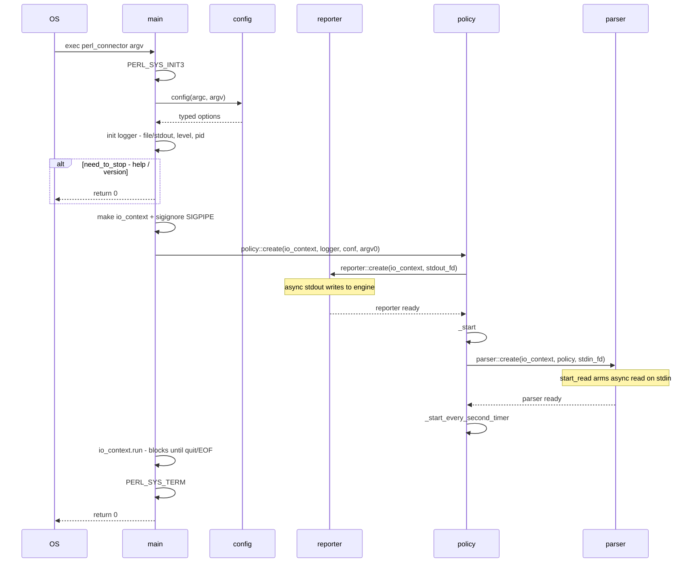
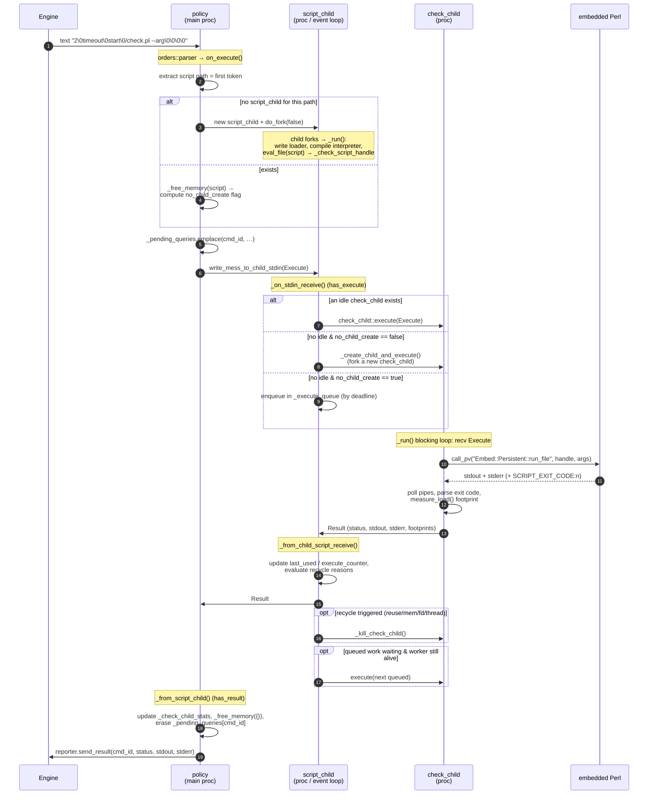
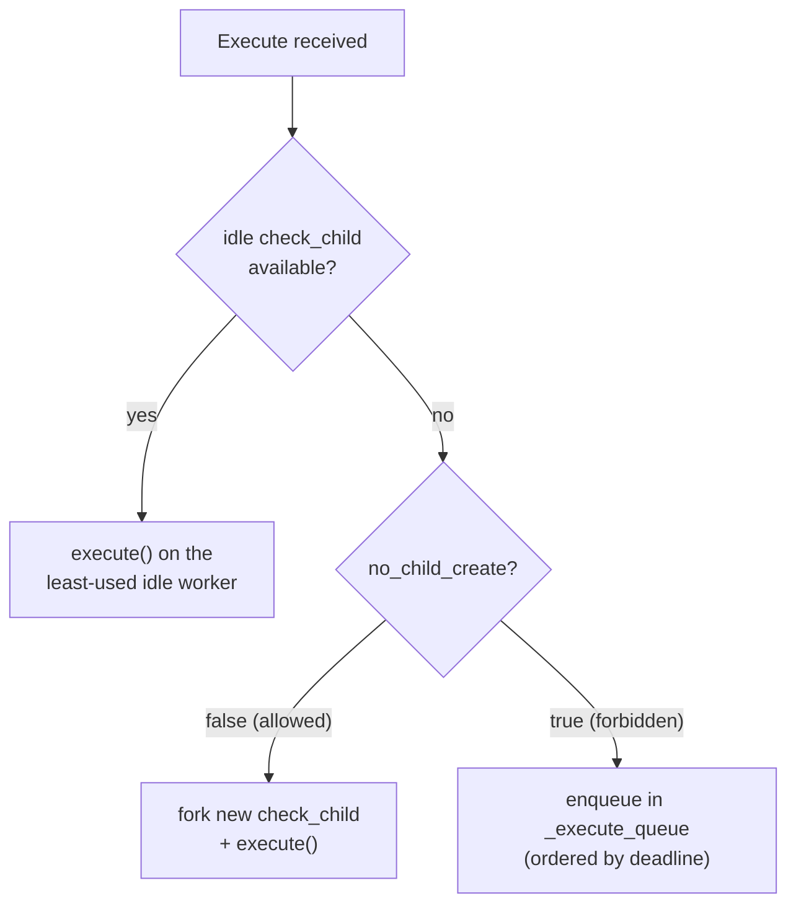
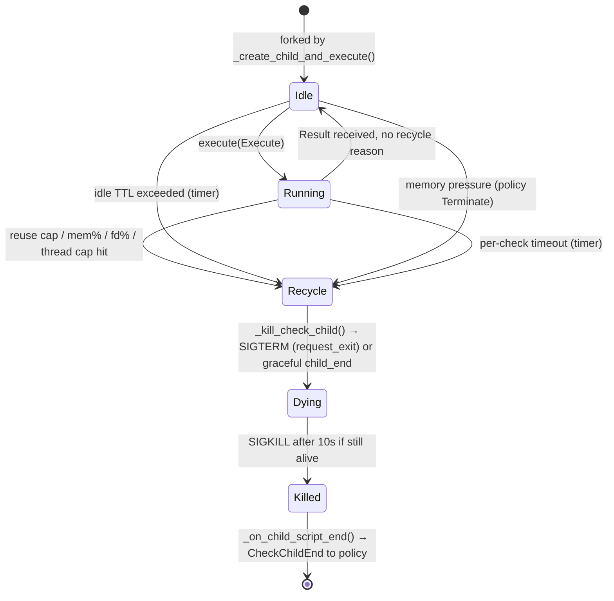
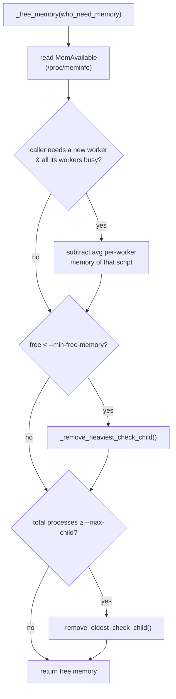
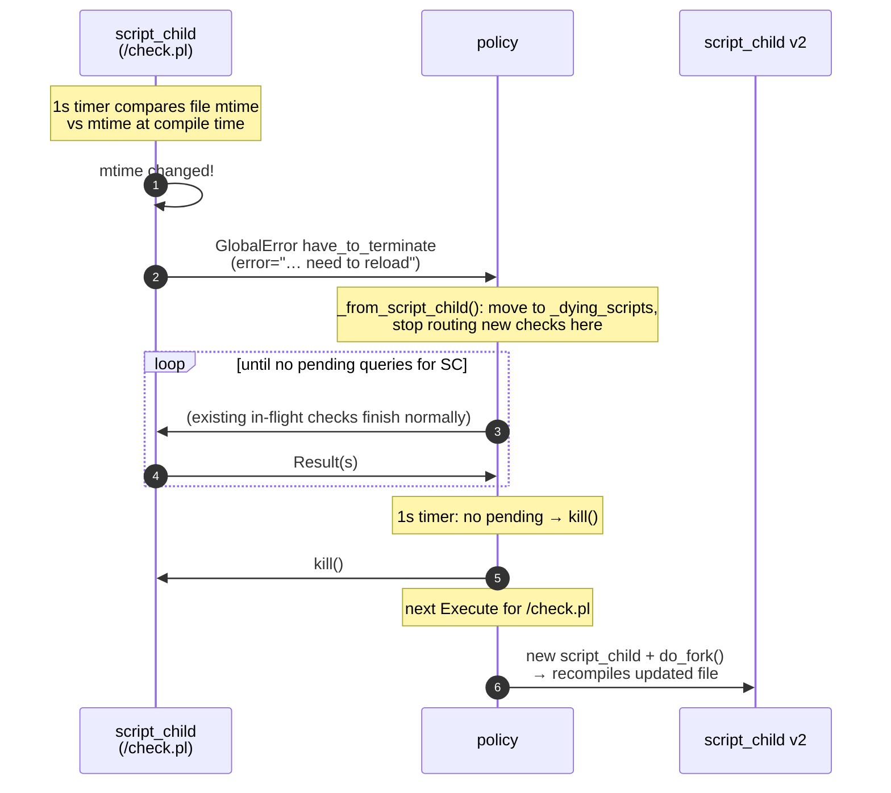

# Centreon Perl Connector — Architecture & Execution Flow

> Branch `MON-194602-perl-connector-reuse-perl-process`.
>
> This document describes the internal design of the Perl connector after the
> *reuse-perl-process* refactor. For the user-facing parameter reference, see
> [README.md](README.md). This document focuses on **classes, their
> interactions, and the runtime flow of execution**.

---

## 1. Why this design exists

A Centreon "Perl connector" runs Nagios/Centreon supervision plugins written in
Perl. The naive way (Nagios `epn`) would compile + run the `.pl` script on every
check; spinning up a fresh `perl` interpreter per check is expensive.

The goals of this design are:

1. **Compile each script once**, then re-run the compiled sub many times.
2. **Isolate each check** in a throw-away worker process so a crashing or
   leaking plugin cannot poison the interpreter that serves other checks.
3. **Bound resource usage** — cap the number of processes, recycle workers that
   leak memory / file descriptors / threads, and shed load under memory
   pressure.
4. **Hot-reload** a script when its file changes on disk, without dropping
   in-flight checks.

These goals lead directly to a **three-tier process tree**, where each tier is a
separate OS process communicating with its parent over pipes.

---

## 2. Process model



| Tier | Process count | Created by | Lives as long as |
|------|--------------|------------|------------------|
| `policy` | 1 | `main()` | the connector runs |
| `script_child` | 1 per **unique script path** | `policy` (`fork`) | the script is in use & unchanged on disk |
| `check_child` | N per `script_child` (a worker pool) | `script_child` (`fork`) | until recycled (reuse cap / leak / idle TTL / memory pressure) |

Key idea: a `check_child` is forked **from inside** a `script_child` process, so
it inherits the already-compiled Perl interpreter and the compiled sub
(`_check_script_handle`) via copy-on-write. No recompilation, no re-`fork`+`exec`
of `perl`.

---

## 3. Class catalogue



### Responsibility summary

| Class | File | Role |
|-------|------|------|
| `policy` | [src/policy.cc](src/policy.cc), [policy.hh](inc/com/centreon/connector/perl/policy.hh) | Top-level orchestrator. Engine-facing. Routes checks to the right `script_child`, tracks pending queries & per-worker resource footprints, enforces global ceilings and memory pressure. |
| `script_child` | [src/script_child.cc](src/script_child.cc), [script_child.hh](inc/com/centreon/connector/perl/script_child.hh) | One per script path. Owns the embedded `PerlInterpreter`, compiles the script once, and runs a worker pool of `check_child`. Schedules requests onto idle workers / a deadline-ordered queue. Watches the script's mtime for hot reload. |
| `check_child` | [src/check_child.cc](src/check_child.cc), [check_child.hh](inc/com/centreon/connector/perl/check_child.hh) | A single-check worker. Runs the compiled Perl sub synchronously, captures stdout/stderr, extracts the exit code, measures its own resource footprint, returns a `Result`. |
| `protocol` | [src/protocol.cc](src/protocol.cc), [protocol.hh](inc/com/centreon/connector/perl/protocol.hh) | Length-prefixed framing codec for `ConnectorMess` protobuf over POSIX pipes. Sync + async + streaming-reassembly variants. |
| `config` | [src/config.cc](src/config.cc), [config.hh](inc/com/centreon/connector/perl/config.hh) | Command-line parsing (Boost.Program_options) into typed accessors. |
| `orders::parser` | [src/orders/parser.cc](src/orders/parser.cc) | Decodes the Engine NUL-delimited text command stream into `policy` callbacks. |
| `reporter` | [common/src/reporter.cc](../../common/src/reporter.cc) | Encodes `result`/version back into the Engine text protocol on stdout. |
| `fork` / `child_process` | [common/process/](../../common/process/) | Reusable base: pipe setup, `fork(2)`, async pipe I/O, process-end notification. |

---

## 4. The common process layer (`child_process` → `fork`)

Both `script_child` and `check_child` derive from
`com::centreon::common::fork<false, true>`, which derives from
`child_process<false>`.

* `child_process<use_mutex>` — [child_process.hh](../../common/process/inc/com/centreon/common/process/child_process.hh) — owns the three Asio pipe objects (`_stdin_pipe`, `_stdout_pipe`, `_stderr_pipe`), an async stdin write queue (`_stdin_write_queue` + `_write_pending`), and a set of atomic completion flags (`process_end | stdout_eof | stderr_eof`) so the object only fires `_on_process_end()` once everything has drained. Exposes `write_to_child_stdin()`, `kill()` (SIGKILL), `request_exit()` (SIGTERM).
* `fork<use_mutex, asio_notify_fork>` — [fork.hh](../../common/process/inc/com/centreon/common/process/fork.hh) / [fork.cc](../../common/process/src/fork.cc) — adds the actual `fork(2)`. `do_fork()` creates the pipes, forks, and:
  * **parent**: assigns pipe ends into the Asio objects, wraps the child PID in a Boost.Process handle, arms `async_wait` for process end, and starts async reads.
  * **child**: closes the unused pipe ends, calls the pure-virtual `_run(stdin_fd, stdout_fd, stderr_fd)`, then `::exit(return_value)`.

### Two template flags that matter here

| Template param | Value used | Why |
|---|---|---|
| `use_mutex` | `false` | Each process drives **one** single-threaded `io_context`; no cross-thread access, so the mutex is compiled out (zero overhead — see the `detail::lock<false>` no-op in [child_process.hh](../../common/process/inc/com/centreon/common/process/child_process.hh#L42-L46)). |
| `asio_notify_fork` | `true` | The parent's `io_context` has active async ops (timers, pipe reads) at fork time. `do_fork()` issues `notify_fork(prepare/parent/child)` so Asio resets internal fds (e.g. the epoll fd) correctly. The header warns this is only safe for **single-threaded** io_contexts. |



> Note: `script_child` passes `fd_to_close_after_fork = policy._stdin_fd`. The
> child closes the inherited Engine-stdin fd so that, when Engine closes the
> connector's stdin, the EOF actually reaches `policy` instead of being held
> open by descendant processes. See [script_child.cc:365](src/script_child.cc#L365).

---

## 5. The wire protocol

### 5.1 Engine ↔ policy (text, NUL-delimited)

Decoded by `orders::parser` ([parser.cc](src/orders/parser.cc)) and the common
[parser.cc](../../common/src/parser.cc). Commands are separated by **4 NUL
bytes**; the first field is the command ID:

| ID | Command | Handler |
|----|---------|---------|
| `0` | Version query | `policy::on_version()` |
| `2` | Execute | `policy::on_execute(cmd_id, timeout, cmdline)` |
| `4` | Quit | `policy::on_quit()` |
| `10`| "no more stdin" (ignore EOF) | sets `_dont_care_about_stdin_eof` |

An `Execute` payload is `cmd_id \0 timeout \0 start_time \0 cmdline \0\0\0\0`
(see [orders/parser.cc:54](src/orders/parser.cc#L54)).

### 5.2 policy ↔ script_child ↔ check_child (binary, protobuf)

Every frame is a native-endian length prefix followed by a serialized
`ConnectorMess`:

```
┌─────────────────────────┬──────────────────────────────────┐
│  size_t  packet_len      │   protobuf bytes (packet_len -    │
│  (8 bytes, total length) │   sizeof(size_t))                 │
└─────────────────────────┴──────────────────────────────────┘
```

`protocol` ([protocol.cc](src/protocol.cc)) offers three usage modes:

* **`send()` / `recv()`** — synchronous, blocking. Used by `check_child::_run()` which owns both ends of its pipes and runs a simple blocking loop.
* **`async_send()` / `async_recv()`** — non-blocking. `async_recv()` uses an `async_compose` state machine (`detail::async_receive_impl`, states `read_len → read_data → decode`); `async_send()` serializes through a `_write_queue` so concurrent sends are serialized. Used on the `script_child` event-loop side.
* **`on_recv(raw, out)`** — streaming reassembly: feed arbitrary chunks from an async pipe read, get back every *complete* frame; partial tails are buffered. Used by the **parent** side of both forks in `_on_stdout_read()` because Asio hands over arbitrary-sized buffers.

### 5.3 `ConnectorMess` schema

Defined in [perl_connector.proto](src/perl_connector.proto). It is a `oneof`:



| Message | Direction | Meaning |
|---------|-----------|---------|
| `Execute` | down (parent→child) | run a check; carries per-check limits + `no_child_create` |
| `Result` | up (child→parent) | check outcome + resource footprint snapshots |
| `Terminate` | down | recycle a worker (`immediate`/deferred) or a list of candidate pids (`other_pids`) |
| `CheckChildEnd` | up (script_child→policy) | a `check_child` exited (policy drops its stats) |
| `GlobalError` (`have_to_terminate`) | up (script_child→policy) | fatal compile error (`unusable_script=true`) **or** script changed on disk → reload |

---

## 6. Execution flow — startup



Entry point: [main.cc](src/main.cc). The `io_context` is single-threaded and
runs the whole `policy` event loop. `policy::create()` is a factory that builds
the object behind a `shared_ptr` and wires the stdin parser + the 1-second timer
([policy.cc:98](src/policy.cc#L98)).

---

## 7. Execution flow — one check (the hot path)

This is the core sequence. It crosses **three processes** and the protobuf pipe
boundary twice.



### Step-by-step with code anchors

1. **Engine → policy.** `orders::parser::_parse()` matches command id `2` and calls `execute()`, which splits the NUL fields and calls `policy::on_execute()` — [orders/parser.cc:82](src/orders/parser.cc#L82).
2. **Route to a `script_child`.** `policy::on_execute()` extracts the script path (everything before the first space), then looks it up in the `_scripts` multi-index. If absent, it constructs a `script_child` with two lambdas (read-handler → `_from_script_child`, end-handler → `_on_script_child_end`) and calls `do_fork(false)` — [policy.cc:155](src/policy.cc#L155).
3. **Compute `no_child_create`.** For an existing script, `policy` decides whether the `script_child` is allowed to fork a new worker: it's forbidden if free memory minus a 50 MB margin would fall below `--min-free-memory`, or if the total process count + 10 would reach `--max-child` — [policy.cc:200](src/policy.cc#L200).
4. **Build the `Execute`.** `_create_execute()` fills global limits from `config`, then scans the command line for per-command overrides (`child-max-reuse-script`, `child-max-memory-increase-percent`, …) and adds the remaining tokens as the script's `args` — [policy.cc:231](src/policy.cc#L231).
5. **Track + send.** The query is recorded in `_pending_queries` (keyed by `cmd_id`, deadline, and owning `script_child`) and the `Execute` is written to the child's stdin pipe.
6. **script_child dispatch.** Inside the forked process, `_on_stdin_receive()` handles `has_execute()`: it scans `_check_childs` ordered by **fewest executions** for an idle worker; if found, `execute()` on it. Otherwise, depending on `no_child_create`, it either forks a new worker (`_create_child_and_execute`) or enqueues the request in `_execute_queue` (a `btree_multiset` ordered by deadline) — [script_child.cc:592](src/script_child.cc#L592).
7. **check_child runs Perl.** `check_child::_run()` is a synchronous loop: `recv` an `Execute`, push the compiled sub handle + script path + args on the Perl stack, `call_pv("Embed::Persistent::run_file")`, then `poll()` the redirected stdout/stderr pipes. The Perl `CORE::GLOBAL::exit` override emits `SCRIPT_EXIT_CODE:<n>` on stderr, which is parsed out with an RE2 regex; the rest of stderr is forwarded verbatim — [check_child.cc:151](src/check_child.cc#L151).
8. **Footprint.** After each check, `measure_load()` reads resident memory / thread count / open fds via `process_stat`. The **first** check's load is remembered (`_after_first_check_load`); both first and last snapshots ride back in the `Result` — [check_child.cc:131](src/check_child.cc#L131).
9. **script_child post-processing.** `_from_child_script_receive()` updates the worker's `last_used`/`execute_counter`, then decides whether to **recycle** it (see §9). It forwards the `Result` upward, prunes the queue, and — if the worker survives and there is queued work — immediately dispatches the next deadline-ordered request to the now-idle worker — [script_child.cc:674](src/script_child.cc#L674).
10. **policy → Engine.** `_from_script_child()` (the `has_result()` branch) refreshes `_check_child_stats`, runs an opportunistic `_free_memory({})` sweep, erases the pending query, and — only if the query is still known (not already timed-out) — calls `reporter.send_result()` back to Engine — [policy.cc:365](src/policy.cc#L365).

---

## 8. Concurrency model inside a `script_child`

A `script_child` is a single-threaded Asio event loop (`_child_io_context`,
deliberately a **fresh** io_context created after the fork — see the comment at
[script_child.hh:92](inc/com/centreon/connector/perl/script_child.hh#L92)). It
multiplexes:

* incoming `Execute`/`Terminate` from `policy` (`read_from_main_process_stdin` → `_on_stdin_receive`);
* incoming `Result` from each `check_child` (`_from_child_script_receive`);
* a 1-second timer (reload check, timeouts, deferred kills, idle TTL).

It keeps four data structures (all `boost::multi_index` or Abseil btrees so they
can be queried by several keys at once):

| Container | Keys | Purpose |
|-----------|------|---------|
| `_check_childs` | pid, last_used, execute_counter | the live worker pool; dispatch picks the idle worker with the **fewest** executions |
| `_execute_queue` | deadline (`btree_multiset`) | overflow checks waiting for a free worker, soonest-deadline first |
| `_pending` | pid, deadline | checks currently running on a worker, for timeout enforcement |
| `_die_start_to_check_child` | kill timestamp (`btree_multimap`) | workers being shut down, for the SIGTERM→(10 s)→SIGKILL escalation |

Dispatch decision tree on an incoming `Execute`:



---

## 9. `check_child` lifecycle & recycling

A worker is created on demand and torn down for one of several reasons. Recycle
decisions are made by `script_child` in `_from_child_script_receive()` right
after a `Result`, comparing the `Execute` limits against the footprints in the
result:



Recycle triggers (all configurable, with per-command overrides):

| Trigger | Source | Default |
|---------|--------|---------|
| Reused too many times | `execute_counter >= max_execute` | `--child-max-reuse-script` |
| Resident memory grew too much | `after_last > after_first × (1 + pct/100)` | `--child-max-memory-increase-percent` (10%) |
| Open fds grew too much | same comparison on fd count | `--child-max-fd-increase-percent` (10%) |
| Too many threads | `after_last.nb_thread >= max_thread` | `--child-max-thread` (10) |
| Idle too long | `now - last_used > ttl` (1-second timer) | `--idle-child-ttl` (15 min) |
| Per-check timeout | `now > deadline` while running | from the check's timeout |
| Memory pressure / over `max_child` | `policy` sends `Terminate` | `--min-free-memory`, `--max-child` |

The teardown itself is a two-phase escalation in `_kill_check_child()`
([script_child.cc:765](src/script_child.cc#L765)) and the 1-second handler: the
worker is asked to exit (graceful `child_end` message, or `SIGTERM` via
`request_exit()`), recorded in `_die_start_to_check_child` with a timestamp, and
`SIGKILL`-ed if it is still alive ~10 s later.

---

## 10. Memory-pressure management (policy side)

`policy::_free_memory()` ([policy.cc:484](src/policy.cc#L484)) reads
`MemAvailable` from `/proc/meminfo` (via the overridable weak symbol
`get_free_memory()`, which tests can stub). It runs both when a new check
arrives and after every `Result`.



`_remove_heaviest_check_child()` ([policy.cc:531](src/policy.cc#L531)) uses a
two-round strategy over `_check_child_stats` indexed by footprint:

* **Round 0** — find the heaviest worker that is **idle** and whose script owns ≥2 workers → send `Terminate{immediate=true}` (kill now).
* **Round 1** — if everything is busy, pick the heaviest and send `Terminate{immediate=false}` (deferred; kills after the current check finishes).

In both cases it passes the script's workers as `other_pids`, ordered heaviest
first, and the receiving `script_child` kills the first eligible one.
`_remove_oldest_check_child()` is the simpler LRU eviction used when the process
count hits `--max-child`.

The `policy` tracks every worker's footprint in `_check_child_stats` — a
multi-index container keyed by **owning script_child**, **pid**, **last_used**,
and **footprint** — so all of the above are O(log n) lookups.

---

## 11. Per-check timeouts

Two independent watchdogs, both on 1-second timers:

* **policy** ([policy.cc:443](src/policy.cc#L443)) expires entries in `_pending_queries` whose deadline passed and reports status `3` `(Process Timeout)` to Engine. Because the query is then erased, a late `Result` for it is silently dropped (the `erased > 0` guard at [policy.cc:375](src/policy.cc#L375)).
* **script_child** ([script_child.cc:472](src/script_child.cc#L472)) expires entries in its own `_pending`, **kills** the offending worker, and sends a timeout `Result` upward.

---

## 12. Hot reload of a changed script



The reload is transparent to Engine: in-flight checks drain on the old
interpreter, the next check for that path forks a fresh `script_child` that
recompiles the new file. The fatal-compile-error path uses the **same** message
with `unusable_script=true`, in which case `policy` additionally fails every
pending check for that script with the compile error
([policy.cc:354](src/policy.cc#L354)).

---

## 13. Death & error paths (summary)

| Event | Detected by | Result |
|-------|-------------|--------|
| `check_child` dies mid-check | `script_child::_on_child_script_end()` finds it still in `_pending` | synthesize status `3` "Process pid:N died during check execution", forward up, send `CheckChildEnd` |
| `script_child` dies unexpectedly | `policy::_on_script_child_end()` | drop its stats, fail all its pending checks with "script child … has died", remove from `_scripts`/`_dying_scripts` |
| Compile failure | `script_child::_run()` catches, sends `have_to_terminate{unusable_script=true}`, exits −1 | policy fails all pending checks for that path |
| Pipe decode error | `_on_stdout_read()` catch block | the child is `kill()`-ed so the parent isn't left waiting |
| Engine closes stdin | common parser → `policy::on_eof()` → `on_quit()` | stop the io_context, clean shutdown |
| Perl plugin calls `fork()` and the child reaches the result loop | `check_child::_run()` compares `getpid()` to the original | the accidental grandchild `::exit(0)` immediately |

---

## 14. Configuration reference (resolved defaults)

From [config.cc](src/config.cc):

| CLI option | Accessor | Default |
|------------|----------|---------|
| `--max-child` | `max_child()` | 64 |
| `--min-free-memory` (MB) | `min_free_memory()` | 500 → bytes |
| `--max-opened-fd` | `max_opened_fd()` | `RLIMIT_NOFILE` |
| `--child-max-memory-increase-percent` | `child_max_memory_increase_percent()` | 10 |
| `--child-max-fd-increase-percent` | `child_max_fd_increase_percent()` | 10 |
| `--child-max-thread` | `child_max_thread()` | 10 |
| `--child-max-reuse-script` | `child_max_reuse_script()` | 1 *(code default; README documents 100 as the operational value)* |
| `--idle-child-ttl` (min) | `minute_idle_check_child_ttl()` | 15 |
| `--code,-c` | `code()` | — (extra Perl run at interpreter init) |
| `--log-file,-l` / `--log-level` / `--debug,-d` | `log_file_path()` / `log_level()` | stderr / info |
| `--test-file,-x` | `test_file_path()` | — (read commands from a file instead of stdin) |

Four of these (`child-max-reuse-script`, `child-max-memory-increase-percent`,
`child-max-fd-increase-percent`, `child-max-thread`) can be overridden
per-command by embedding `keyword value` pairs in the check command line; see
§7 step 4 and the README.

---

## 15. File map

| Concern | Path |
|---------|------|
| Entry point | [connectors/perl/src/main.cc](src/main.cc) |
| Orchestrator | [connectors/perl/src/policy.cc](src/policy.cc) · [policy.hh](inc/com/centreon/connector/perl/policy.hh) |
| Per-script process | [connectors/perl/src/script_child.cc](src/script_child.cc) · [script_child.hh](inc/com/centreon/connector/perl/script_child.hh) |
| Worker process | [connectors/perl/src/check_child.cc](src/check_child.cc) · [check_child.hh](inc/com/centreon/connector/perl/check_child.hh) |
| Pipe codec | [connectors/perl/src/protocol.cc](src/protocol.cc) · [protocol.hh](inc/com/centreon/connector/perl/protocol.hh) |
| Message schema | [connectors/perl/src/perl_connector.proto](src/perl_connector.proto) |
| CLI config | [connectors/perl/src/config.cc](src/config.cc) · [config.hh](inc/com/centreon/connector/perl/config.hh) |
| Engine text parser | [connectors/perl/src/orders/parser.cc](src/orders/parser.cc) · [connectors/common/src/parser.cc](../../common/src/parser.cc) |
| Result reporter | [connectors/common/src/reporter.cc](../../common/src/reporter.cc) |
| Fork base classes | [common/process/](../../common/process/) |
| Tests | [test/policy_test.cc](test/policy_test.cc) · [test/script_child_test.cc](test/script_child_test.cc) · [test/protocol_test.cc](test/protocol_test.cc) · [test/endpoint_test.cc](test/endpoint_test.cc) |
```
