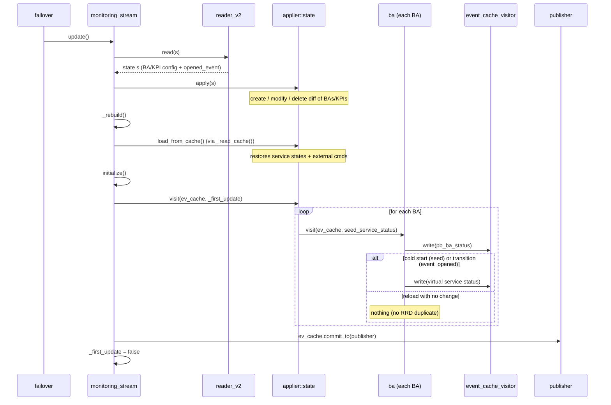

# BAM module — rebuild, reload and status publication

## Table of contents

  - [1. Stream life cycle](#1-stream-life-cycle)
  - [2. The three sources of a BA's state](#2-the-three-sources-of-a-bas-state)
  - [3. `update()` — rebuild sequence](#3-update--rebuild-sequence)
  - [4. Historical issue: duplicate status on reload (BAWORST 
  flake)](#4-historical-issue-duplicate-status-on-reload-baworst-flake)
  - [5. Refactor — current state](#5-refactor--current-state)
  - [5bis. Anomalies found during implementation](#5bis-anomalies-found-during-implementation)
  - [6. Tests](#6-tests)

This document describes how the BAM module works on the Broker side
(`broker/bam/`), in particular the rebuild cycle at startup and reload, and the
refactor aimed at removing duplicate statuses on reload.

## 1. Stream life cycle

The `monitoring_stream` (`broker/bam/src/monitoring_stream.cc`) is created once.
On reload, the `failover` **reuses the same stream**
(`broker/core/src/processing/failover.cc:289`, `_stream->update()` when `_update`
is set): the applier `_applier` and its `_applied` map (`bam::ba` / `bam::kpi`
objects) **persist** across reloads. `set_initial_event` is idempotent
(`ba.cc` `if (!_event)`), so it is not replayed on reload for a BA that has
already been rebuilt.

The constructor does **not** call `update()`: the first `update()` (config apply
+ cache restore + publication) is driven by the `failover` after the first
successful `open()`. Calling `update()` in the constructor as well would
initialize — and publish — the BAs twice (see §5bis).

## 2. The three sources of a BA's state

When rebuilding, a BA's state comes from three sources:

1. **`opened_event` (DB)** — the open BA event, read by `reader_v2` and injected
   by `ba::set_initial_event` (sets `_in_downtime`, `_last_kpi_update`).
2. **KPI state** — `kpi.apply` rebuilds the KPIs, `add_impact` updates
   `_last_kpi_update`, `notify_parents_of_change(nullptr)` recomputes the BA
   state without publishing.
3. **File cache** — `load_from_cache` restores **only** service states
   (`service_book`) and pending external commands. It does **not** restore the
   BA's inherited downtimes: those are recomputed from the KPIs/DB. (The former
   `save_inherited_downtime`, which was a no-op, and the related dead code have
   been removed — see §5 step 6.)

## 3. `update()` — rebuild sequence

```
update():
  reader_v2.read(s)      // re-reads BA/KPI config + opened_event from the DB
  _applier.apply(s)      // create/modify/delete diff of BAs/KPIs
  _rebuild()             // signals an RRD rebuild if needed
  _read_cache()          // restores runtime state (service states + ext. cmds)
  initialize()           // _applier.visit(&ev_cache, _first_update) → publishes
  _first_update = false  // subsequent update() calls are reloads
```



`_read_cache()` is called **before** `initialize()`. Previously `initialize()`
published a partial state (DB only), then the cache overwrote that state on top,
which produced inconsistent publications. Now the state is fully restored before
the single publication pass.

## 4. Historical issue: duplicate status on reload (BAWORST flake)

`initialize()` → `_applier.visit()` → `ba::visit()` publishes, on every
`update()` (hence on every reload):

- a `pb_ba_status`, and
- the BA's **virtual service status** (virtual host/service), with a `last_check`
  equal to `_last_kpi_update` / `_event->start_time()`.

On a reload with no new data, this `last_check` is **constant**: the status would
be republished at the same timestamp as before the reload. `unified_sql`
(`broker/unified_sql/src/stream_storage.cc`) turns it into a `storage::pb_status`,
and the RRD module receives **two** updates for the same second. rrdtool accepts
only one point per second and rejects the second one:

```
RRD: ignored update error in file '.../status/<index>.rrd':
illegal attempt to update using time T when last update time is T (minimum one second step)
```

This `[error]` message is grepped by the robot tests teardown
(`tests/resources/resources.resource`), which made BAWORST fail intermittently.

## 5. Refactor — current state

Chosen principle: **restore the whole state first, publish once at cold start, and
do not republish the virtual service status on reload for an unchanged BA.**

1. **[DONE]** Reorder `update()`: `_read_cache()` before `initialize()` (§3).

2. **[DONE — audit, no code]** The whole restoration is silent and deterministic:
   `visit(nullptr)` is a no-op (`ba.cc` `if (visitor)`), the cache goes through
   `notify_parents_of_change(nullptr)`; the order is BA (`set_initial_event`, DB)
   → KPI (`add_impact`) → cache, and `_last_kpi_update` takes the `std::max` (never
   regresses). `initialize()` is the single publication point and operates on a
   fully restored state.

3. **+4. [DONE]** Conditional seeding via a **cold start vs reload** mode:
   - `monitoring_stream` carries a `bool _first_update{true}` member
     (`monitoring_stream.hh`); the only caller of `update()` is the failover.
   - `initialize()` propagates this flag:
     `_applier.visit(&ev_cache, _first_update)`, then `_first_update` becomes
     `false` after the first `update()`.
   - The flag is threaded under the name `seed_service_status`:
     `applier::state::visit(visitor, seed_service_status)` →
     `_ba_applier.visit(visitor, seed_service_status)` →
     `ba::visit(io::stream* visitor, bool seed_service_status = false)`.
   - At cold start `true` → the virtual service status is seeded (for RRD); on
     reload `false` → no seeding.

5. **[DONE]** The `_last_published_service_*` guard is **removed**, replaced by a
   publication **driven by design**. In `ba::visit`, the `pb_ba_status` is always
   emitted; the **virtual service status is emitted only if
   `seed_service_status || event_opened`**:
   - `event_opened` is true when a new BA event is opened during the visit (first
     event creation, or a state/downtime change) — exactly when `last_check`
     (= `_event->start_time()`) moves forward. No transition ⇒ no new event ⇒ no
     republication at a constant `last_check` ⇒ RRD collision impossible.
   - `seed_service_status` only forces emission at cold start (RRD seeding).
   - The runtime path (`ba::update_from` → `visit(visitor)` with the default
     `false`) therefore republishes only on a real transition, and a reload with no
     change republishes nothing — with no remembered fields (the three
     `_last_published_service_*` members are gone).

6. **[DONE]** Dead code removed: `ba::save_inherited_downtime` (no-op) and
   `applier::ba::save_to_cache` (never called). Misleading cache logs/comments
   fixed (`applier::state::load_from_cache`, `monitoring_stream::_read_cache` /
   `_write_cache`), and the dead `//_ba_applier.apply(cache)` line dropped.

## 5bis. Anomalies found during implementation

- **Double `update()`/`initialize()` per life cycle [FIXED]**: the
  `monitoring_stream` constructor called `update()`, and the `failover` called
  `update()` again after the first successful `open()` (`failover.cc`,
  `_update = true`). Result: initialization (and publication) happened twice. Fix:
  remove the `update()` call from the constructor; the failover drives the single
  `update()` at the right time (after `open()`). Verified: 1 `initialize` per life
  cycle instead of 2.

- **The BAM endpoint was recreated on reload, not updated [FIXED]**: on reload, the
  endpoint applier **updates in place** `central-broker-master-input`,
  `centreon-broker-master-rrd`, `central-broker-unified-sql`, but **deleted then
  recreated** `centreon-bam-monitoring` / `centreon-bam-reporting`. The BAM stream
  was thus destroyed/rebuilt (the destructor writes the cache, the new stream reads
  it back), republishing the restored state → RRD duplicate.

  **Root cause**: `broker/bam/src/factory.cc` `has_endpoint()` **mutates** the
  config (`cfg.read_timeout = 1`, `cfg.cache_enabled = true`) at creation time. This
  mutated config becomes the **identity key** stored in `_endpoints`. On reload, the
  fresh config (the BAM JSON has no `read_timeout` → default `(time_t)-1`) is
  compared by `_diff_endpoints()` **before** being normalized → `read_timeout` `1`
  (stored) ≠ `-1` (fresh) → BAM seen as "reconfigured" → delete+create. The other
  endpoints do not mutate their config → stable. (`read_timeout=1` is necessary: the
  failover reads with a 1 s timeout for BAM.)

  **Fix**: in `broker/core/config/applier/endpoint.cc::apply()`, **normalize the
  desired config through its factory (`has_endpoint`) BEFORE `_diff_endpoints()`**
  (lines 116-135), just as creation will. The diff then compares like for like →
  BAM matches → **updated in place** like the others. The stream, the `ba` objects
  and their state (including the guard) persist across the reload, and
  `_first_update` (steps 3+4) suppresses any service status republish on reload →
  RRD collision impossible.

  Verified: on reload, the log shows `updating endpoint centreon-bam-monitoring`
  (instead of `removing`/`creating`); `monitoring_stream`: 1 constructor /
  1 destructor (the destructor = final teardown) instead of 2.

## 6. Tests

- UT: `broker/bam/test/` (`tests/ut_broker --gtest_filter='*Ba*:*bam*'`).
  Recommended UT (not added yet): a "double `update()`" test verifying the absence
  of a second `pb_service_status` at a constant `last_check` for an unchanged BA
  (`publish_service_status == false`).
- Robot (podman): `tests/bam/bam_pb.robot` (BAWORST, BAWORST2, reload cases),
  `inherited_downtime*.robot`, `boolean_rules*.robot`. Loop BAWORST ≥ 20× to judge
  intermittency before/after.
