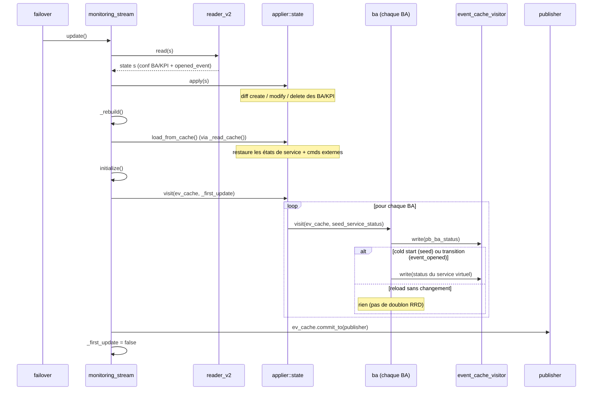

# Module BAM — reconstruction, reload et publication des status

## Sommaire

  - [1. Cycle de vie du stream](#1-cycle-de-vie-du-stream)
  - [2. Les trois sources d'état d'une BA](#2-les-trois-sources-détat-dune-ba)
  - [3. `update()` — séquence de reconstruction](#3-update--séquence-de-reconstruction)
  - [4. Problème historique : doublon de status au reload (flake 
  BAWORST)](#4-problème-historique--doublon-de-status-au-reload-flake-baworst)
  - [5. Refactor — état actuel](#5-refactor--état-actuel)
  - [5bis. Anomalies découvertes pendant 
  l'implémentation](#5bis-anomalies-découvertes-pendant-limplémentation)
  - [6. Tests](#6-tests)


Ce document décrit le fonctionnement du module BAM côté Broker (`broker/bam/`),
en particulier le cycle de reconstruction au démarrage et au reload, et le
refactor visant à supprimer les doublons de status au reload.

## 1. Cycle de vie du stream

Le `monitoring_stream` (`broker/bam/src/monitoring_stream.cc`) est créé une seule
fois. Au reload, le `failover` **réutilise le même stream**
(`broker/core/src/processing/failover.cc:289`, `_stream->update()` lorsque
`_update` est positionné) : l'applier `_applier` et sa map `_applied` (objets
`bam::ba` / `bam::kpi`) **persistent** d'un reload à l'autre. `set_initial_event`
est idempotent (`ba.cc` `if (!_event)`), il n'est donc pas rejoué au reload pour
une BA déjà reconstruite.

Le constructeur n'appelle **pas** `update()` : le premier `update()` (apply de la
conf + restauration du cache + publication) est piloté par le `failover` après le
premier `open()` réussi. Appeler aussi `update()` dans le constructeur
initialiserait — et publierait — les BA deux fois (voir §5bis).

## 2. Les trois sources d'état d'une BA

À la reconstruction, l'état d'une BA provient de trois sources :

1. **`opened_event` (DB)** — l'évènement BA ouvert, lu par `reader_v2` et injecté
   par `ba::set_initial_event` (fixe `_in_downtime`, `_last_kpi_update`).
2. **État des KPI** — `kpi.apply` reconstruit les KPI, `add_impact` met à jour
   `_last_kpi_update`, `notify_parents_of_change(nullptr)` recalcule l'état de la
   BA sans publier.
3. **Cache fichier** — `load_from_cache` restaure **uniquement** les états de
   services (`service_book`) et les commandes externes en attente. Il ne
   restaure **pas** les downtimes hérités de la BA : ceux-ci sont recalculés à
   partir des KPI/DB. (L'ancien `save_inherited_downtime`, qui était un no-op, et
   le code mort associé ont été supprimés — voir §5 étape 6.)

## 3. `update()` — séquence de reconstruction

```
update():
  reader_v2.read(s)      // relit la conf BA/KPI + opened_event depuis la DB
  _applier.apply(s)      // diff create/modify/delete des BA/KPI
  _rebuild()             // signale un rebuild RRD si nécessaire
  _read_cache()          // restaure l'état runtime (service states + cmds ext.)
  initialize()           // _applier.visit(&ev_cache, _first_update) → publie
  _first_update = false  // les update() suivants sont des reloads
```



`_read_cache()` est appelé **avant** `initialize()`. Auparavant `initialize()`
publiait un état partiel (DB seule) puis le cache écrasait l'état par-dessus, ce
qui produisait des publications incohérentes. Désormais l'état est entièrement
restauré avant l'unique passe de publication.

## 4. Problème historique : doublon de status au reload (flake BAWORST)

`initialize()` → `_applier.visit()` → `ba::visit()` publie, à chaque `update()`
(donc à chaque reload) :

- un `pb_ba_status`, et
- le **status du service virtuel** de la BA (host/service virtuels), avec un
  `last_check` égal à `_last_kpi_update` / `_event->start_time()`.

Au reload sans nouvelle donnée, ce `last_check` est **constant** : le status
serait republié au même timestamp qu'avant le reload. `unified_sql`
(`broker/unified_sql/src/stream_storage.cc`) en fait un `storage::pb_status`, et
le module RRD reçoit **deux** mises à jour à la même seconde. rrdtool n'accepte
qu'un point par seconde et rejette la seconde :

```
RRD: ignored update error in file '.../status/<index>.rrd':
illegal attempt to update using time T when last update time is T (minimum one second step)
```

Ce message en `[error]` est grep par le teardown des tests robot
(`tests/resources/resources.resource`), ce qui faisait échouer BAWORST de façon
intermittente.

## 5. Refactor — état actuel

Principe retenu : **restaurer tout l'état d'abord, publier une seule fois au
cold start, et ne pas republier le status du service virtuel au reload pour une BA
inchangée.**

1. **[FAIT]** Réordonner `update()` : `_read_cache()` avant `initialize()` (§3).

2. **[FAIT — audit, sans code]** Toute la restauration est silencieuse et
   déterministe : `visit(nullptr)` est un no-op (`ba.cc` `if (visitor)`), le cache
   passe par `notify_parents_of_change(nullptr)` ; l'ordre est BA
   (`set_initial_event`, DB) → KPI (`add_impact`) → cache, et `_last_kpi_update`
   prend le `std::max` (ne régresse jamais). `initialize()` est l'unique point de
   publication et opère sur un état complètement restauré.

3. **+4. [FAIT]** Amorçage conditionnel via un mode **cold start vs reload** :
   - `monitoring_stream` porte un membre `bool _first_update{true}`
     (`monitoring_stream.hh`) ; seul appelant de `update()` : le failover.
   - `initialize()` propage ce drapeau : `_applier.visit(&ev_cache, _first_update)`,
     puis `_first_update` passe à `false` après le premier `update()`.
   - Le drapeau est threadé sous le nom `seed_service_status` :
     `applier::state::visit(visitor, seed_service_status)` →
     `_ba_applier.visit(visitor, seed_service_status)` →
     `ba::visit(io::stream* visitor, bool seed_service_status = false)`.
   - Au cold start `true` → on amorce le status du service virtuel (pour le RRD) ;
     au reload `false` → pas d'amorçage.

5. **[FAIT]** Garde `_last_published_service_*` **supprimée**, remplacée par une
   publication **pilotée par conception**. Dans `ba::visit`, le `pb_ba_status` est
   toujours émis ; le **status du service virtuel n'est émis que si
   `seed_service_status || event_opened`** :
   - `event_opened` est vrai quand un nouvel évènement BA est ouvert pendant la
     visite (création du premier évènement, ou changement d'état/downtime) — c'est
     exactement quand le `last_check` (= `_event->start_time()`) avance. Aucune
     transition ⇒ pas de nouvel évènement ⇒ pas de republication à `last_check`
     constant ⇒ collision RRD impossible.
   - `seed_service_status` ne force l'émission qu'au cold start (amorçage RRD).
   - Le chemin runtime (`ba::update_from` → `visit(visitor)` avec le défaut
     `false`) ne republie donc plus que sur transition réelle, et le reload sans
     changement ne republie rien — sans aucun champ mémorisé (les trois membres
     `_last_published_service_*` ont disparu).

6. **[FAIT]** Code mort supprimé : `ba::save_inherited_downtime` (no-op) et
   `applier::ba::save_to_cache` (jamais appelé). Logs et commentaires trompeurs sur
   le cache corrigés (`applier::state::load_from_cache`,
   `monitoring_stream::_read_cache` / `_write_cache`), et la ligne morte
   `//_ba_applier.apply(cache)` retirée.

## 5bis. Anomalies découvertes pendant l'implémentation

- **Double `update()`/`initialize()` par cycle de vie [CORRIGÉ]** : le constructeur du
  `monitoring_stream` appelait `update()`, et le `failover` rappelait `update()`
  après le premier `open()` réussi (`failover.cc`, `_update = true`). Résultat :
  initialisation (et publication) deux fois. Correctif : retirer l'appel `update()`
  du constructeur ; le failover pilote l'unique `update()` au bon moment (après
  `open()`). Vérifié : 1 `initialize` par cycle de vie au lieu de 2.

- **L'endpoint BAM était recréé au reload, pas mis à jour [CORRIGÉ]** : au reload,
  l'applier d'endpoints **met à jour en place** `central-broker-master-input`,
  `centreon-broker-master-rrd`, `central-broker-unified-sql`, mais **supprimait puis
  recréait** `centreon-bam-monitoring` / `centreon-bam-reporting`. Le stream BAM
  était donc détruit/reconstruit (le destructeur écrit le cache, le nouveau stream
  le relit), republiant l'état restauré → doublon RRD.

  **Cause racine** : `broker/bam/src/factory.cc` `has_endpoint()` **mute** la config
  (`cfg.read_timeout = 1`, `cfg.cache_enabled = true`) au moment de la création. Cette
  config mutée devient la **clé d'identité** stockée dans `_endpoints`. Au reload, la
  config fraîche (le JSON BAM n'a pas de `read_timeout` → défaut `(time_t)-1`) est
  comparée par `_diff_endpoints()` **avant** d'être normalisée → `read_timeout` `1`
  (stockée) ≠ `-1` (fraîche) → BAM vu comme « reconfiguré » → delete+create. Les
  autres endpoints ne mutent pas leur config → stables. (`read_timeout=1` est
  nécessaire : le failover lit avec un timeout d'1 s pour BAM.)

  **Correctif** : dans `broker/core/config/applier/endpoint.cc::apply()`, **normaliser
  la config désirée via sa factory (`has_endpoint`) AVANT `_diff_endpoints()`**
  (lignes 116-135), comme le fera la création. Le diff compare alors à périmètre
  égal → BAM matche → **mis à jour en place** comme les autres. Le stream, les objets
  `ba` et leur état (dont la garde) persistent au reload, et `_first_update`
  (étapes 3+4) supprime tout re-publish du status de service au reload → collision
  RRD impossible.

  Vérifié : au reload, log `updating endpoint centreon-bam-monitoring` (au lieu de
  `removing`/`creating`) ; `monitoring_stream` : 1 constructeur / 1 destructeur (le
  destructeur = teardown final) au lieu de 2.

## 6. Tests

- UT : `broker/bam/test/` (`tests/ut_broker --gtest_filter='*Ba*:*bam*'`). UT
  recommandé (non encore ajouté) : « double `update()` » vérifiant l'absence d'un
  second `pb_service_status` à `last_check` constant pour une BA inchangée
  (`publish_service_status == false`).
- Robot (podman) : `tests/bam/bam_pb.robot` (BAWORST, BAWORST2, cas de reload),
  `inherited_downtime*.robot`, `boolean_rules*.robot`. Boucler BAWORST ≥ 20× pour
  juger l'intermittence avant/après.
