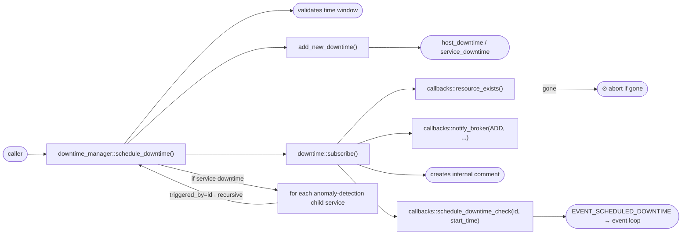
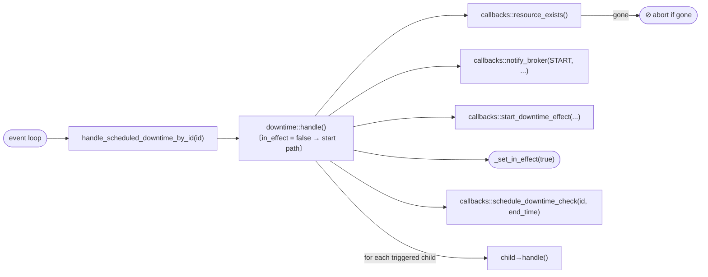
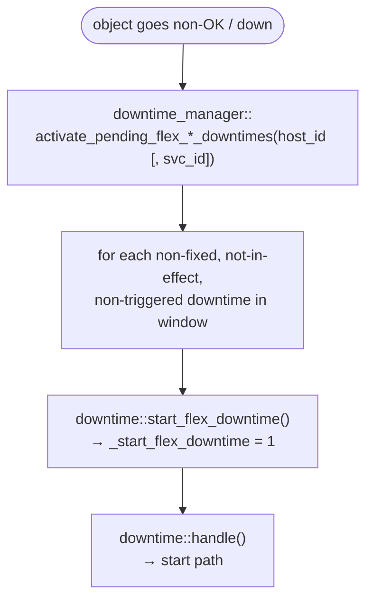
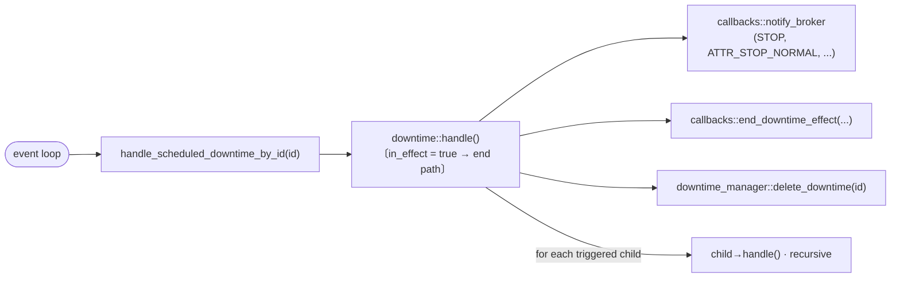
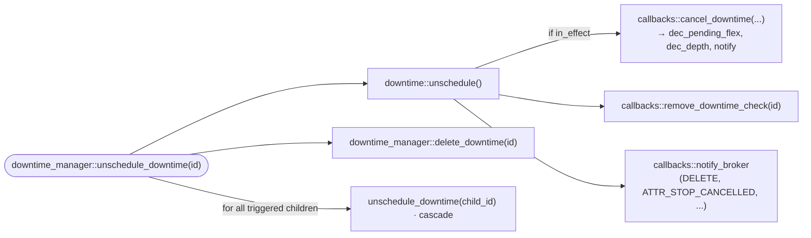

# Downtimes library — Broker integration guide

<!-- TOC -->
* [Downtimes library — Broker integration guide](#downtimes-library--broker-integration-guide)
* [Overview](#overview)
* [Architecture](#architecture)
  * [Class hierarchy](#class-hierarchy)
  * [downtime — base class](#downtime--base-class)
  * [host_downtime / service_downtime — specialisations](#host_downtime--service_downtime--specialisations)
  * [downtime_manager — singleton owner](#downtime_manager--singleton-owner)
  * [downtime_finder — search utility](#downtime_finder--search-utility)
  * [downtime_callbacks — integration contract](#downtime_callbacks--integration-contract)
* [Downtime lifecycle](#downtime-lifecycle)
  * [Creation and scheduling](#creation-and-scheduling)
  * [Fixed downtime start](#fixed-downtime-start)
  * [Flexible downtime](#flexible-downtime)
  * [End and deletion](#end-and-deletion)
  * [Triggered downtimes](#triggered-downtimes)
  * [Anomaly detection children](#anomaly-detection-children)
* [Broker integration](#broker-integration)
  * [Initialisation](#initialisation)
  * [Callbacks to implement](#callbacks-to-implement)
    * [Object existence and naming](#object-existence-and-naming)
    * [Anomaly detection lookup](#anomaly-detection-lookup)
    * [Event scheduling](#event-scheduling)
    * [State mutations](#state-mutations)
    * [Broker notification](#broker-notification)
  * [Driving the manager from BBDO events](#driving-the-manager-from-bbdo-events)
  * [Retention](#retention)
* [Depth ownership when Broker manages downtimes](#depth-ownership-when-broker-manages-downtimes)
* [BAM inherited downtimes](#bam-inherited-downtimes)
* [Comments for Broker-managed downtimes](#comments-for-broker-managed-downtimes)
  * [The internal_id problem](#the-internal_id-problem)
  * [Design](#design)
    * [Restoring the comment id across a cbd restart](#restoring-the-comment-id-across-a-cbd-restart)
  * [Triggered, flexible and BAM cases](#triggered-flexible-and-bam-cases)
  * [Decisions](#decisions)
  * [Relation to internal_id deprecation](#relation-to-internal_id-deprecation)
* [Shutdown safety](#shutdown-safety)
* [Key differences from the engine implementation](#key-differences-from-the-engine-implementation)
<!-- TOC -->

---

## Overview

The `common/downtimes` library provides a self-contained downtime scheduling engine shared between
`centengine` (Engine) and `cbd` (Broker). It handles:

* creation, scheduling, activation, and deletion of host and service downtimes;
* fixed and flexible downtime semantics;
* triggered (parent/child) downtime chains;
* automatic child downtime creation for anomaly-detection services;
* comment management and event scheduling via an abstract callback interface.

The library itself contains **no engine-specific or broker-specific code**. All integration points are
injected through the `downtime_callbacks` abstract class. Engine provides
`engine_downtime_callbacks`; Broker must provide its own implementation.

---

## Architecture

### Class hierarchy

```
downtime_callbacks  (abstract — injected at startup)
    ↑ implemented by
engine_downtime_callbacks   (Engine side, engine/src/)
broker_downtime_callbacks   (Broker side — to be written)

downtime            (base, common/downtimes/)
  ├── host_downtime
  └── service_downtime

downtime_manager    (singleton, owns all downtimes)
downtime_finder     (stateless search helper)
```

### downtime — base class

`common/downtimes/downtime.hh`

Holds the full state of one scheduled downtime:

| Field | Type | Meaning |
|---|---|---|
| `_host_id` | `uint64_t` | Host this downtime applies to |
| `_service_id` | `uint64_t` | 0 for host downtimes |
| `_entry_time` | `time_t` | When the downtime was created |
| `_start_time` / `_end_time` | `time_t` | Scheduled window |
| `_fixed` | `bool` | Fixed vs. flexible |
| `_duration` | `uint32_t` | Duration for flexible downtimes (seconds) |
| `_triggered_by` | `uint64_t` | Parent downtime ID (0 = none) |
| `_downtime_id` | `uint64_t` | Unique identifier |
| `_in_effect` | `bool` | Whether the downtime is currently active |
| `_comment_id` | `uint64_t` | Internal comment created at scheduling |
| `_start_flex_downtime` | `int` | Number of pending flex activations |
| `_incremented_pending_downtime` | `bool` | Guard against double-increment |

Key virtual methods (overridden by the specialisations):

| Method | Called when |
|---|---|
| `subscribe()` | Right after creation — creates comment, schedules start event |
| `handle()` | At start time or end time — activates or deactivates the downtime |
| `unschedule()` | On deletion — cancels the effect if in effect, removes events |
| `is_stale()` | At startup — returns true if the host/service no longer exists |
| `notify_broker_load()` | At retention reload — tells broker the downtime was restored |
| `print()` / `retention()` | Status/retention file serialisation |

### host_downtime / service_downtime — specialisations

`common/downtimes/host_downtime.hh` and `service_downtime.hh`

These classes are **compiled into Engine** (they include engine headers directly) and provide the
engine-specific implementations of `handle()` and `unschedule()` that interact with
`host::hosts_by_id`, `service::services_by_id`, `inc_scheduled_downtime_depth()`, engine notifications, etc.

For Broker, analogous classes must be written that interact with the broker cache and SQL streams
instead of the engine runtime objects.

`service_downtime` also skips BAM pseudo-services (host name starting with `_Module_BAM_`, service
description starting with `ba_`) in `print()` and `retention()`.

### downtime_manager — singleton owner

`common/downtimes/downtime_manager.hh`

The manager is the single point of access. It owns all scheduled downtimes in:

```cpp
std::multimap<time_t, std::shared_ptr<downtime>> _scheduled_downtimes;
// keyed by start_time; multiple downtimes can share the same start_time
```

Lifecycle methods:

| Method | Description |
|---|---|
| `load(callbacks)` | Initialises the singleton with the injected callbacks |
| `schedule_downtime(...)` | Creates, validates, and subscribes a new downtime |
| `unschedule_downtime(id)` | Cancels and removes a downtime and its triggered children |
| `delete_downtime(id)` | Removes from the map without unscheduling (used internally during `handle()`) |
| `find_downtime(type, id)` | Linear search by ID, optionally filtered by type |
| `initialize_downtime_data()` | Called at startup — removes stale entries, resets the ID counter |
| `validate_downtime_data()` | Removes orphaned triggered downtimes |
| `delete_expired_downtimes()` | Removes flexible downtimes whose window has passed |
| `activate_pending_flex_host_downtimes(host_id)` | Called when a host goes down |
| `activate_pending_flex_service_downtimes(host_id, svc_id)` | Called when a service goes non-OK |
| `callbacks()` | Access to the injected `downtime_callbacks` |

`schedule_downtime()` enforces:
* `start_time < end_time`
* `end_time > now()`
* clamps `start_time` and `end_time` to 2100-01-01 (timestamp 4 102 441 200)
* clamps `duration` to 366 days (31 622 400 s)

### downtime_finder — search utility

`common/downtimes/downtime_finder.hh`

Stateless helper that filters the multimap by a set of `criteria` (key/value string pairs). Supported
keys: `"host"`, `"service"`, `"start"`, `"end"`, `"fixed"`, `"triggered_by"`, `"duration"`,
`"author"`, `"comment"`. Returns a `result_set` (vector of downtime IDs matching **all** criteria).

### downtime_callbacks — integration contract

`common/downtimes/downtime_callbacks.hh`

The library calls back into the integrator for every operation that requires knowledge of the runtime
environment (does this host exist? schedule an event in the event loop; apply downtime effect to the
DB; etc.).

Two enums control broker notifications:

```cpp
enum class action { ADD, START, DELETE, LOAD, STOP };
enum class attribute { ATTR_NONE = 0, ATTR_STOP_NORMAL = 1, ATTR_STOP_CANCELLED = 2 };
```

All pure-virtual methods are listed in the [Callbacks to implement](#callbacks-to-implement) section.

---

## Downtime lifecycle

### Creation and scheduling



### Fixed downtime start

When the scheduled event fires:



### Flexible downtime

A flexible downtime waits for the monitored object to enter a non-OK/non-UP state within its window.



If the object recovers before the window closes, `callbacks::schedule_expire_downtime()` is used to
schedule an `EVENT_EXPIRE_DOWNTIME` event that calls `delete_expired_downtimes()`.

### End and deletion



Cancellation (e.g. `DEL_HOST_DOWNTIME` command):



### Triggered downtimes

A downtime with `triggered_by != 0` is started and stopped in lockstep with its parent. The parent
`handle()` (both start and end paths) iterates all downtimes and calls `handle()` on each child
whose `_triggered_by` matches the parent ID.

At unschedule time, `unschedule_downtime()` recursively unschedules all children before removing
the parent.

### Anomaly detection children

When `schedule_downtime()` creates a **service downtime**, it looks up anomaly-detection services
that monitor the same `(host_id, service_id)` pair via
`callbacks::get_anomaly_detection_services()`. For each returned service ID, it creates an
additional service downtime with `triggered_by` set to the parent's ID.

In Engine, `get_anomaly_detection_services()` is implemented via
`anomalydetection::find_by_dependent_service()`. In Broker, this information must come from the
global cache (or from configuration data received via BBDO).

---

## Broker integration

### Initialisation

```cpp
// In cbd startup, after the cache is ready:
downtime_manager::load(std::make_unique<broker_downtime_callbacks>(...));
downtime_manager::instance().initialize_downtime_data();
// reload downtimes from retention if any
```

`initialize_downtime_data()` removes stale entries (objects that no longer exist or whose window
has expired) and computes the next available downtime ID from the existing set.

### Callbacks to implement

#### Object existence and naming

```cpp
bool host_exists(uint64_t host_id) override;
bool service_exists(uint64_t host_id, uint64_t service_id) override;
bool resource_exists(uint64_t host_id, uint64_t service_id) override;
// resource_exists delegates to host_exists (svc_id == 0) or service_exists
```

In Broker, these query the global cache (`broker_cache`), which holds the current set of known
hosts and services.

```cpp
std::string get_host_name(uint64_t host_id) override;
std::pair<std::string,std::string>
    get_host_and_service_names(uint64_t host_id, uint64_t service_id) override;
```

Also satisfied from the global cache or the `resources` table.

```cpp
bool is_resource_ok(uint64_t host_id, uint64_t service_id) override;
```

Returns true if the host is UP (for host downtimes) or the service is OK (for service downtimes).
Broker must track the last known state, e.g. from `pb_host_status` / `pb_service_status` events.

#### Anomaly detection lookup

```cpp
std::vector<uint64_t>
    get_anomaly_detection_services(uint64_t host_id, uint64_t service_id) override;
```

Returns the list of `service_id` values of anomaly-detection services whose dependent service is
`(host_id, service_id)`.

In Engine this is provided by `anomalydetection::find_by_dependent_service()` which maintains an
in-process index. In Broker, the equivalent mapping must be built from configuration data received
via BBDO (specifically from `pb_service` objects where `type == ANOMALY_DETECTION` and
`internal_id` points to the dependent service).

A simple structure in `broker_downtime_callbacks`:

```cpp
// built from pb_service events with type == ANOMALY_DETECTION:
absl::flat_hash_map<std::pair<uint64_t,uint64_t>,   // {host_id, dependent_svc_id}
                    std::vector<uint64_t>>            // anomaly-detection svc_ids
    _anomaly_detection_index;
```

#### Event scheduling

```cpp
void schedule_downtime_check(uint64_t downtime_id, time_t when) override;
void remove_downtime_check(uint64_t downtime_id) override;
void schedule_expire_downtime(time_t when) override;
```

In Engine these insert `EVENT_SCHEDULED_DOWNTIME` and `EVENT_EXPIRE_DOWNTIME` into the engine event
loop. In Broker, the equivalent is the `io_context` timer infrastructure already used for
reconnection and heartbeat timers. Each scheduled downtime check is a one-shot timer that calls
`handle_scheduled_downtime_by_id(downtime_id)` at the scheduled time.

`schedule_expire_downtime()` schedules a one-shot timer that calls
`downtime_manager::instance().delete_expired_downtimes()`.

Broker must maintain a map `downtime_id → timer` so that `remove_downtime_check()` can cancel the
pending timer.

#### State mutations

```cpp
void inc_pending_flex_downtime(uint64_t host_id, uint64_t service_id) override;
```

Increments a pending flexible downtime counter on the host or service object. In Broker, this
counter may be maintained in the global cache or in a dedicated map, as there are no runtime engine
objects.

```cpp
void start_downtime_effect(uint64_t host_id, uint64_t service_id,
                           const std::string& author,
                           const std::string& comment) override;
void end_downtime_effect(uint64_t host_id, uint64_t service_id,
                         bool is_fixed, bool incremented_pending,
                         const std::string& author,
                         const std::string& comment) override;
```

In Engine, `start_downtime_effect()` calls `inc_scheduled_downtime_depth()` on the host/service
object, which triggers a notification and a status event. In Broker, this must:

* increment the `scheduled_downtime_depth` counter in the cache and propagate it to the DB (`hosts`
  or `services` table);
* suppress notifications for the object while the depth is > 0.

`end_downtime_effect()` does the reverse: decrements the depth and, if it reaches 0, re-enables
notifications.

```cpp
void cancel_downtime(uint64_t host_id, uint64_t service_id,
                     bool is_fixed, bool incremented_pending,
                     bool is_in_effect) override;
```

Called during `unschedule()` when the downtime was in effect. Must:

* if `incremented_pending` and `!is_fixed`: decrement the pending flex downtime counter;
* if `is_in_effect`: call `end_downtime_effect()` equivalent (decrement depth).

#### Broker notification

```cpp
void notify_broker(action act, attribute attr,
                   uint64_t host_id, uint64_t service_id,
                   const std::string& author, const std::string& comment,
                   time_t entry_time, time_t start_time, time_t end_time,
                   bool fixed, uint64_t triggered_by, uint32_t duration,
                   uint64_t downtime_id) override;
```

In Engine, this calls `broker_downtime_data()` (the NEB module callback) which publishes a
`pb_downtime` BBDO event to Broker. In Broker, this method plays the opposite role: it is the
point at which the library informs the Broker code that a downtime changed state. Depending on the
architecture, this may:

* update the `downtimes` table in the DB via `unified_sql`;
* publish a `pb_downtime` event to connected clients (e.g. MAP, Centreon Web) if needed;
* update the global cache.

The `action` enum maps to downtime NEBTYPE values:

| `action` | Engine NEBTYPE | Meaning |
|---|---|---|
| `ADD` | `NEBTYPE_DOWNTIME_ADD` | Downtime created |
| `START` | `NEBTYPE_DOWNTIME_START` | Downtime became active |
| `STOP` | `NEBTYPE_DOWNTIME_STOP` | Downtime ended normally |
| `DELETE` | `NEBTYPE_DOWNTIME_DELETE` | Downtime cancelled |
| `LOAD` | `NEBTYPE_DOWNTIME_LOAD` | Downtime reloaded from retention |

The `attribute` enum:

| `attribute` | Engine NEBATTR | Meaning |
|---|---|---|
| `ATTR_NONE` | `NEBATTR_NONE` | Normal event |
| `ATTR_STOP_NORMAL` | `NEBATTR_DOWNTIME_STOP_NORMAL` | Ended at scheduled time |
| `ATTR_STOP_CANCELLED` | `NEBATTR_DOWNTIME_STOP_CANCELLED` | Cancelled by command |

### Driving the manager from BBDO events

When Broker receives a `pb_downtime` BBDO event from Engine (or from another source), it must
translate it into a `downtime_manager` call:

| BBDO event content | `downtime_manager` call |
|---|---|
| `type == ADD` | `schedule_downtime(...)` |
| `type == DELETE` or `STOP_CANCELLED` | `unschedule_downtime(id)` |

Events of type `START` and `STOP_NORMAL` are driven internally by the library timers, not by
incoming BBDO events, so Broker should only persist them to the DB (via `notify_broker`) without
calling the manager again.

### Retention

The library serialises downtime state through `downtime::retention(os)`. The output format matches
the Engine `retention.dat` syntax. On startup, Broker reads its own retention file (if any) and
calls `schedule_downtime()` for each entry (with `triggered_by` preserved) followed by
`notify_broker_load()` to advertise the reload to clients.

---

## Depth ownership when Broker manages downtimes

When `notification_mode = broker` (the `downtime_manager` singleton is loaded), **Broker is the
sole writer** of `scheduled_downtime_depth` (table `services`/`hosts`) and `in_downtime`
(table `resources`). Broker sets them through the adaptive status published by
`broker_downtime_callbacks` (start/end of a downtime).

The decision is taken **locally inside Broker** — Engine is never told. Every consumer simply
checks `com::centreon::common::downtimes::downtime_manager::is_loaded()`:

* **`unified_sql`** — the full host/service status statements use
  `scheduled_downtime_depth = COALESCE(?, scheduled_downtime_depth)` and
  `in_downtime = COALESCE(?, in_downtime)`. In broker mode the status binds **NULL** for those
  columns, so the `COALESCE` keeps Broker's value; in engine mode it binds the real value. This is
  required because Engine status updates are written in **bulk (deferred)** while the adaptive
  depth update is a **direct (immediate)** query: without this, a stale bulk status bound before a
  downtime started could flush *after* the adaptive update and overwrite the depth (a hard-to-spot,
  intermittent clobber).
* **`broker_cache`** — a host/service status from Engine does not overwrite the cached
  `scheduled_downtime_depth` in broker mode (the cache counter is maintained by
  `broker_downtime_callbacks` and feeds its inc/dec logic).
* **`_clean_tables`** (poller disable, e.g. Engine restart) must **not** cancel downtimes
  (`UPDATE downtimes SET cancelled=1 ... WHERE instance_id=`): the downtimes belong to Broker's
  `downtime_manager`, not to the poller, and must survive a poller restart.

> Engine keeps emitting `scheduled_downtime_depth` as usual; Broker just ignores it in this mode.
> An earlier design that propagated a `broker_manages_downtimes` flag to Engine (so it would omit
> the field) was dropped in favour of this self-contained, Broker-local approach.

> **Known limitation.** A downtime scheduled *before* the target service row exists in the DB makes
> the adaptive direct `UPDATE ... WHERE host_id=? AND service_id=?` match 0 rows, so the depth is
> lost. This does not happen in practice (configuration is pushed before any downtime is
> schedulable) and is not covered.

## BAM inherited downtimes

A Business Activity can propagate an *inherited downtime* to its virtual service
(`_Module_BAM_<poller>` / `ba_<id>`). `bam::monitoring_stream::_handle_inherited_downtime()` routes
it according to who owns downtimes:

* **Engine-managed** (default): an external command is sent to Engine
  (`SCHEDULE_SVC_DOWNTIME` / `DEL_SVC_DOWNTIME_FULL`), exactly as historically.
* **Broker-managed** (`downtime_manager::is_loaded()`): the downtime is created/removed directly in
  the in-process `downtime_manager` — `schedule_downtime(service_downtime, ba->get_host_id(),
  ba->get_service_id(), ...)` and removal via
  `delete_downtime_by_hostname_service_description_start_time_comment()` matching the fixed comment
  *"Automatic downtime triggered by BA downtime inheritance"*. No external command is sent to Engine.

To make inherited downtimes survive an **Engine restart**, `monitoring_stream` must **not** call
`book_service().reset_downtime_state()` on poller stop when in broker mode (Broker keeps the
downtimes; Engine does not re-send them).

## Comments for Broker-managed downtimes

> **Status: implemented.** `broker_downtime_callbacks::create_downtime_comment()` /
> `delete_downtime_comment()` publish `pb_comment` events, so a downtime scheduled by
> Broker carries a `comments` row identical to an Engine-scheduled one. This section
> describes the design.

When Engine schedules a downtime, `downtime::subscribe()` creates an internal comment
(`entry_type = downtime`) through `create_downtime_comment()`; the returned id is
stored in `downtime::_comment_id` and the comment is removed from the destructor via
`delete_downtime_comment()`. In broker mode the same callbacks must produce and
remove a real `comments` row so the UI shows the downtime's comment.

> **What the comment actually contains.** The comment text and author are **hard-coded
> in the shared library** (`downtime::subscribe()`), they are *not* the `author` /
> `comment_data` of the request:
>
> ```cpp
> msg = "This host has been scheduled for fixed downtime from … to …";   // generated
> _comment_id = callbacks().create_downtime_comment(
>     _host_id, _service_id, "(Centreon Engine Process)", msg);            // fixed author
> ```
>
> The request's `author` / `comment_data` populate the **downtime** record
> (`_author` / `_comment`, carried by `notify_broker()`), **not** the `comments` row.
> So a Broker-scheduled downtime produces a comment authored
> *"(Centreon Engine Process)"*.

**Requirement (first step): byte-for-byte identical comments.** Broker must emit the
**exact same** comment content as Engine — same hard-coded author
*"(Centreon Engine Process)"*, same generated `data`, same `entry_type = DOWNTIME`,
`source = INTERNAL`, `persistent = false`. This is free: both sides already go through
the same shared-library `subscribe()`, so it suffices for Broker to *emit* the comment
(instead of the current no-op) **without touching its content**. The only field that
differs is `internal_id` (the high partition range below), which is exactly why PHP
must not rely on its value or ordering. Keeping the content identical avoids any PHP
test asserting on the comment author/text from failing depending on who scheduled the
downtime.

### The internal_id problem

`comments.internal_id` is a **signed `int(11)`**, and the table's unique key is
`(entry_time, host_id, service_id, instance_id, internal_id)`. `internal_id` is
therefore unique only **within an `instance_id`** — it is not a global sequence.
Engine generates it from a per-poller `next_comment_id` counter that starts at 1 and
**resets to 1 on configuration reload**.

Broker cannot continue Engine's counter (it lives in Engine's retention, per poller).
It must instead generate ids in a range that can never collide with Engine's.

### Design

* **Partitioned id range.** Broker generates `internal_id` from `INT32_MAX / 2`
  (`1 073 741 823`) upward, using its own monotonic counter **persisted in the global
  cache** (alongside the active downtimes). Engine never reaches that range (it stays
  near 1), so the two producers are disjoint. Starting at `INT32_MAX/2` keeps the
  value positive (the column is signed) and still leaves ~1.07 billion ids of
  headroom.
* **Counter thread-safety and persistence.** `create_downtime_comment()` runs on the
  `io_context` threads, so the counter must be **atomic / locked**. Its current value
  must be **saved with the cache and restored at startup** so it stays monotonic
  across a `cbd` restart (otherwise a reused id would re-emit / clobber an existing
  comment).
* **`instance_id` = the host's poller.** The comment is attributed to the real poller
  `instance_id` of its host (it exists in `instances`, the FK holds, and the UI shows
  the comment under the right poller). `instance_id` must be **non-NULL** — a NULL
  would defeat the `ON DUPLICATE KEY` upsert (NULL ≠ NULL in a MySQL unique key) and
  break idempotency.
* **Publication.** `create_downtime_comment()` builds a `neb::pb_comment`
  (`entry_type = DOWNTIME`, `source = INTERNAL`) and publishes it through
  `multiplexing::publisher`, exactly as `notify_broker()` publishes `pb_downtime`.
  `delete_downtime_comment()` publishes a delete-by-id `pb_comment` (`internal_id` +
  `deletion_time`). `unified_sql` already handles both (`_process_pb_comment`).
* **FK ordering (known limitation).** `comments_ibfk_1` requires the `hosts` row to
  exist before the comment `INSERT`. A downtime scheduled before its resource row
  exists in the DB would lose its comment — the same known limitation already noted
  for `scheduled_downtime_depth` (see
  [Depth ownership](#depth-ownership-when-broker-manages-downtimes)).
* **Restart purge guard.** `_clean_tables` purges a poller's non-persistent comments
  on its restart. Broker-owned downtime comments must survive an Engine restart (the
  downtime itself does — see
  [Depth ownership](#depth-ownership-when-broker-manages-downtimes)), so when
  `downtime_manager::is_loaded()` the purge must exclude them:
  ```sql
  UPDATE comments SET deletion_time=? WHERE instance_id=? AND persistent=0
    AND (deletion_time IS NULL OR deletion_time=0)
    AND entry_type <> 2   -- DOWNTIME comments belong to Broker
  ```
  This mirrors the existing guard that already stops `_clean_tables` from cancelling
  Broker-owned downtimes.

#### Restoring the comment id across a `cbd` restart

Persisting the comment is necessary but **not sufficient** to be able to *delete* it
later. The reinjection path does **not** recreate the comment (good — no duplicate),
but it also does **not** restore `_comment_id`:

* `downtime::reload()` (`downtime.cc`) only sets the downtime in effect and calls
  `notify_broker_load()`; it never calls `create_downtime_comment()`, so the comment
  row already in the DB is reused as-is;
* but `reload_started_downtime()` (`downtime_manager.cc`) is fed from the cache
  `Downtime` proto, which carries `host_id, service_id, entry_time, author,
  comment_data, start_time, end_time, fixed, triggered_by, duration, id` — **no
  `comment_id`**. The reloaded downtime therefore keeps `_comment_id = 0`, and at its
  end `delete_downtime_comment(0)` deletes nothing → **orphaned comment**.

This is closed by three coordinated changes (implemented):

1. `comment_id` was added to the cache `Downtime` message and is written when active
   downtimes are saved (`set_active_downtimes()` at shutdown);
2. it is threaded through `reload_started_downtime()`;
3. it is set back on the reloaded `downtime` object (`downtime::set_comment_id()`), so
   the eventual `delete_downtime_comment()` targets the right row. Because the callback
   now also receives `host_id`/`service_id`, the delete event resolves the same
   `instance_id` as on creation.

### Triggered, flexible and BAM cases

* **Triggered and anomaly-detection children.** Each child is a separate `downtime`
  that runs its own `subscribe()` → **one comment per child** (a host downtime with
  N triggered children produces N+1 comments). This matches Engine; all of them go
  through the same partitioned-id / `instance_id` path.
* **Flexible downtimes.** The comment is created at **scheduling** time
  (`subscribe()`), like a fixed downtime — not at activation. If a flexible downtime
  expires without ever starting, it is destroyed and `delete_downtime_comment()`
  removes the comment through the normal destructor path.
* **BAM inherited downtimes.** These target the BAM pseudo-services
  (`_Module_BAM_*` / `ba_*`). In **Engine mode** the inherited downtime is scheduled
  through an external `SCHEDULE_SVC_DOWNTIME` command, so Engine's `subscribe()`
  **creates a comment** for the BA pseudo-service. In **Broker mode** the
  `downtime_manager` is driven directly and the current no-op callback creates **none**
  — an asymmetry. To keep comments identical, Broker **must create the comment too**
  (it must *not* skip BAM pseudo-services for comment creation — the
  `service_downtime::print()` / `retention()` skip is about retention/`status.dat`
  serialisation only, not the comment). See [Decisions](#decisions).
* **Host/service removed from configuration.** `comments_ibfk_1 ON DELETE CASCADE`
  removes the comment rows, while the `downtime_manager` may still hold the downtime
  with a now-stale `_comment_id`; the later delete-by-id is then a harmless no-op
  (0 rows). No special handling needed.
* **HA (several active brokers).** Two brokers both generating ids from `INT32_MAX/2`
  could collide. Out of scope here, but to be addressed in the HA design (see
  [ha-target-architecture](ha-target-architecture-en.md)).

### Decisions

* **Comment author / text — decided: keep identical to Engine.** The hard-coded
  *"(Centreon Engine Process)"* author and the generated description are reused
  **verbatim** on the Broker side (no parameterisation), so a downtime comment is
  byte-for-byte identical whoever scheduled it. This is the first-step requirement
  above, taken to avoid PHP tests asserting on comment content from failing.
* **BAM inherited downtimes — decided: create the comment, like Engine.** Today Engine
  mode creates a comment for the BA pseudo-service (via the external
  `SCHEDULE_SVC_DOWNTIME` command) while Broker mode creates none (no-op callback).
  Broker must align on Engine and **create the comment**, so an inherited downtime
  carries the same comment whoever owns downtimes. The BAM pseudo-service skip in
  `service_downtime::print()` / `retention()` stays as-is (retention/`status.dat`
  only); it does **not** extend to comment creation.

### Relation to internal_id deprecation

This partitioning is a self-contained bridge — **no PHP change, no schema change**.
For a downtime comment, `internal_id` is never a UI deletion handle (deletion is
driven by the downtime lifecycle, not by a `DEL_*_COMMENT` carrying the id); it only
serves upsert idempotency and Broker-internal bookkeeping. It stays compatible with
the documented future move to address comments by the `comment_id` primary key (see
[comments-integration](comments-integration-en.md#comment-identity-comment_id-vs-internal_id))
— the high-range ids are trivial to identify and migrate when that cross-repo change
happens.

> **PHP consequence.** Because Broker-originated comments use a discontinuous high
> `internal_id` range, the comment list must **not** be ordered by `internal_id`. See
> [PHP evolutions](php-evolutions-en.md#ordering-comments--do-not-rely-on-internal_id).

---

## Shutdown safety

`downtime::~downtime()` notifies Broker via `downtime_manager::instance().callbacks()`. At shutdown
`downtime_manager::unload()` resets the singleton **before** the remaining scheduled downtimes are
destroyed, so the destructor must early-return when `!downtime_manager::is_loaded()` — otherwise
`cbd` aborts when stopped while a downtime is still active.

---

## Key differences from the engine implementation

| Aspect | Engine | Broker |
|---|---|---|
| Object lookup | `host::hosts_by_id`, `service::services_by_id` | Global cache (`broker_cache`) |
| Anomaly detection index | `anomalydetection::find_by_dependent_service()` (in-process) | Must be built from `pb_service` BBDO events |
| Event scheduling | Engine event loop (`timed_event`) | `io_context` one-shot timers |
| Downtime effect | `inc/dec_scheduled_downtime_depth()` on engine objects | DB update + cache counter |
| `start/end_downtime_effect` | Triggers engine notification pipeline | Updates `hosts`/`services` table and cache |
| `notify_broker` | Publishes BBDO event *to* Broker | Updates DB and/or publishes to clients |
| Comment creation | Internal engine comment map | `pb_comment` row in DB; `internal_id` from a disjoint high range (see [Comments for Broker-managed downtimes](#comments-for-broker-managed-downtimes)) |
| `host_downtime` / `service_downtime` sources | Compiled with engine objects | Must have broker-specific specialisations |
