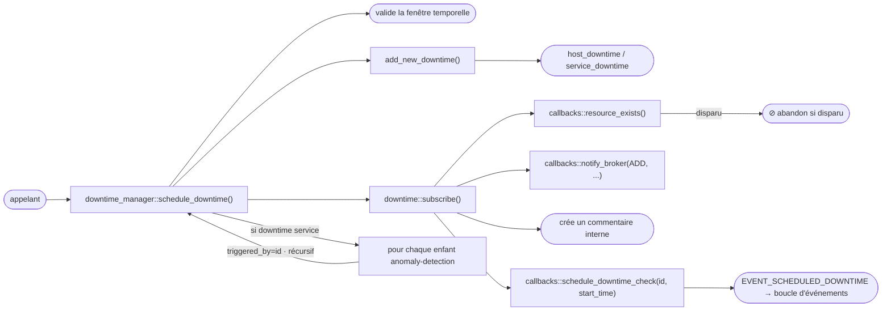
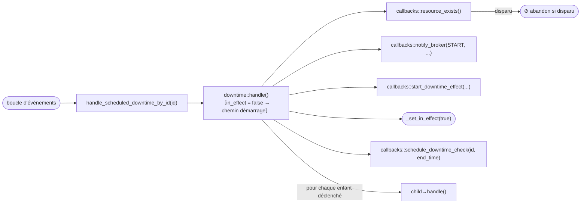
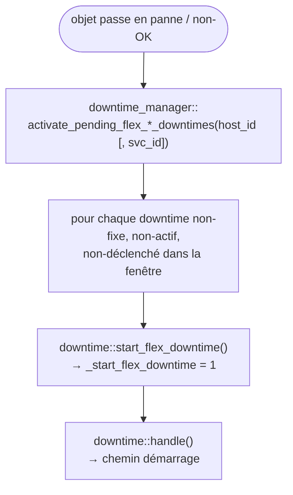
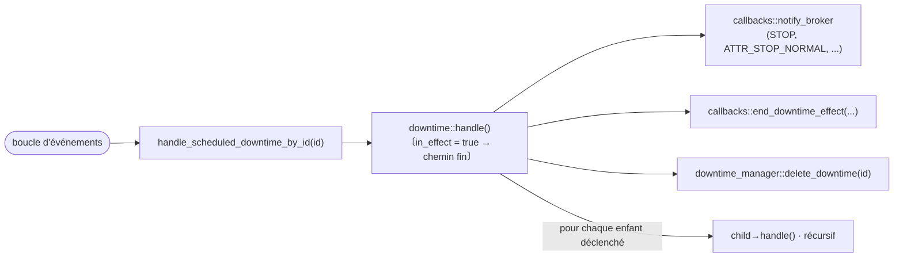
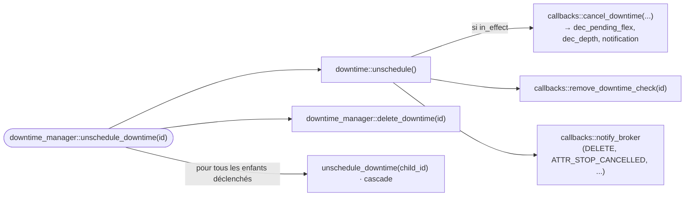

# Librairie downtimes — Guide d'intégration Broker

<!-- TOC -->
* [Librairie downtimes — Guide d'intégration Broker](#librairie-downtimes--guide-dintégration-broker)
  * [Vue d'ensemble](#vue-densemble)
  * [Architecture](#architecture)
    * [Hiérarchie des classes](#hiérarchie-des-classes)
    * [downtime — classe de base](#downtime--classe-de-base)
    * [host_downtime / service_downtime — spécialisations](#host_downtime--service_downtime--spécialisations)
    * [downtime_manager — singleton propriétaire](#downtime_manager--singleton-propriétaire)
    * [downtime_finder — utilitaire de recherche](#downtime_finder--utilitaire-de-recherche)
    * [downtime_callbacks — contrat d'intégration](#downtime_callbacks--contrat-dintégration)
  * [Cycle de vie d'un downtime](#cycle-de-vie-dun-downtime)
    * [Création et planification](#création-et-planification)
    * [Démarrage d'un downtime fixe](#démarrage-dun-downtime-fixe)
    * [Downtime flexible](#downtime-flexible)
    * [Fin et suppression](#fin-et-suppression)
    * [Downtimes déclenchés (triggered)](#downtimes-déclenchés-triggered)
    * [Enfants anomaly detection](#enfants-anomaly-detection)
  * [Intégration dans Broker](#intégration-dans-broker)
    * [Initialisation](#initialisation)
    * [Callbacks à implémenter](#callbacks-à-implémenter)
      * [Existence des objets et nommage](#existence-des-objets-et-nommage)
      * [Index anomaly detection](#index-anomaly-detection)
      * [Planification d'événements](#planification-dévénements)
      * [Mutations d'état](#mutations-détat)
      * [Notification broker](#notification-broker)
    * [Piloter le manager depuis les événements BBDO](#piloter-le-manager-depuis-les-événements-bbdo)
    * [Rétention](#rétention)
  * [Propriété de la profondeur quand Broker gère les downtimes](#propriété-de-la-profondeur-quand-broker-gère-les-downtimes)
  * [Inherited downtimes de BAM](#inherited-downtimes-de-bam)
  * [Commentaires des downtimes gérés par Broker](#commentaires-des-downtimes-gérés-par-broker)
    * [Le problème de l'internal_id](#le-problème-de-linternal_id)
    * [Design](#design)
      * [Restaurer le comment_id à travers un restart cbd](#restaurer-le-comment_id-à-travers-un-restart-cbd)
    * [Cas triggered, flexible et BAM](#cas-triggered-flexible-et-bam)
    * [Décisions](#décisions)
    * [Lien avec la suppression de l'internal_id](#lien-avec-la-suppression-de-linternal_id)
  * [Robustesse à l'arrêt](#robustesse-à-larrêt)
  * [Différences clés avec l'implémentation engine](#différences-clés-avec-limplémentation-engine)
<!-- TOC -->

---

## Vue d'ensemble

La librairie `common/downtimes` fournit un moteur de planification de downtimes partagé entre
`centengine` (Engine) et `cbd` (Broker). Elle gère :

* la création, la planification, l'activation et la suppression des downtimes hôtes et services ;
* la sémantique des downtimes fixes et flexibles ;
* les chaînes de downtimes déclenchés (parent/enfant) ;
* la création automatique de downtimes enfants pour les services anomaly detection ;
* la gestion des commentaires et la planification d'événements via une interface de callback abstraite.

La librairie **ne contient aucun code spécifique à engine ou broker**. Tous les points d'intégration
sont injectés via la classe abstraite `downtime_callbacks`. Engine fournit
`engine_downtime_callbacks` ; Broker doit fournir sa propre implémentation.

---

## Architecture

### Hiérarchie des classes

```
downtime_callbacks  (abstrait — injecté au démarrage)
    ↑ implémenté par
engine_downtime_callbacks   (côté Engine, engine/src/)
broker_downtime_callbacks   (côté Broker — à écrire)

downtime            (base, common/downtimes/)
  ├── host_downtime
  └── service_downtime

downtime_manager    (singleton, propriétaire de tous les downtimes)
downtime_finder     (helper de recherche sans état)
```

### downtime — classe de base

`common/downtimes/downtime.hh`

Contient l'état complet d'un downtime planifié :

| Champ | Type | Signification |
|---|---|---|
| `_host_id` | `uint64_t` | Hôte concerné |
| `_service_id` | `uint64_t` | 0 pour les downtimes hôtes |
| `_entry_time` | `time_t` | Date de création |
| `_start_time` / `_end_time` | `time_t` | Fenêtre planifiée |
| `_fixed` | `bool` | Fixe vs. flexible |
| `_duration` | `uint32_t` | Durée pour les downtimes flexibles (secondes) |
| `_triggered_by` | `uint64_t` | ID du parent (0 = aucun) |
| `_downtime_id` | `uint64_t` | Identifiant unique |
| `_in_effect` | `bool` | Si le downtime est actuellement actif |
| `_comment_id` | `uint64_t` | Commentaire interne créé à la planification |
| `_start_flex_downtime` | `int` | Nombre d'activations flex en attente |
| `_incremented_pending_downtime` | `bool` | Protection contre le double-incrément |

Méthodes virtuelles clés (redéfinies par les spécialisations) :

| Méthode | Appelée quand |
|---|---|
| `subscribe()` | Juste après la création — crée le commentaire, planifie l'événement de démarrage |
| `handle()` | À l'heure de début ou de fin — active ou désactive le downtime |
| `unschedule()` | À la suppression — annule l'effet si actif, retire les événements |
| `is_stale()` | Au démarrage — retourne true si l'hôte/service n'existe plus |
| `notify_broker_load()` | Au rechargement de rétention — informe broker du downtime restauré |
| `print()` / `retention()` | Sérialisation status/rétention |

### host_downtime / service_downtime — spécialisations

`common/downtimes/host_downtime.hh` et `service_downtime.hh`

Ces classes sont **compilées dans Engine** (elles incluent des en-têtes engine) et fournissent les
implémentations spécifiques engine de `handle()` et `unschedule()` qui interagissent avec
`host::hosts_by_id`, `service::services_by_id`, `inc_scheduled_downtime_depth()`, les notifications
engine, etc.

Pour Broker, des classes analogues doivent être écrites pour interagir avec le cache broker et les
streams SQL.

`service_downtime` ignore également les pseudo-services BAM (nom d'hôte commençant par
`_Module_BAM_`, description de service commençant par `ba_`) dans `print()` et `retention()`.

### downtime_manager — singleton propriétaire

`common/downtimes/downtime_manager.hh`

Le manager est le point d'accès unique. Il possède tous les downtimes planifiés dans :

```cpp
std::multimap<time_t, std::shared_ptr<downtime>> _scheduled_downtimes;
// indexé par start_time ; plusieurs downtimes peuvent avoir le même start_time
```

Méthodes du cycle de vie :

| Méthode | Description |
|---|---|
| `load(callbacks)` | Initialise le singleton avec les callbacks injectés |
| `schedule_downtime(...)` | Crée, valide et souscrit un nouveau downtime |
| `unschedule_downtime(id)` | Annule et supprime un downtime et ses enfants déclenchés |
| `delete_downtime(id)` | Supprime de la map sans unscheduler (usage interne dans `handle()`) |
| `find_downtime(type, id)` | Recherche linéaire par ID, filtrée optionnellement par type |
| `initialize_downtime_data()` | Appelé au démarrage — supprime les entrées obsolètes, remet à zéro le compteur d'ID |
| `validate_downtime_data()` | Supprime les downtimes déclenchés orphelins |
| `delete_expired_downtimes()` | Supprime les downtimes flexibles dont la fenêtre est passée |
| `activate_pending_flex_host_downtimes(host_id)` | Appelé quand un hôte tombe en panne |
| `activate_pending_flex_service_downtimes(host_id, svc_id)` | Appelé quand un service passe non-OK |
| `callbacks()` | Accès aux `downtime_callbacks` injectés |

`schedule_downtime()` impose :
* `start_time < end_time`
* `end_time > now()`
* tronque `start_time` et `end_time` au 01/01/2100 (timestamp 4 102 441 200)
* tronque `duration` à 366 jours (31 622 400 s)

### downtime_finder — utilitaire de recherche

`common/downtimes/downtime_finder.hh`

Helper sans état qui filtre la multimap par un ensemble de `criteria` (paires clé/valeur en
chaîne). Clés supportées : `"host"`, `"service"`, `"start"`, `"end"`, `"fixed"`,
`"triggered_by"`, `"duration"`, `"author"`, `"comment"`. Retourne un `result_set` (vecteur d'IDs
de downtimes satisfaisant **tous** les critères).

### downtime_callbacks — contrat d'intégration

`common/downtimes/downtime_callbacks.hh`

La librairie rappelle l'intégrateur pour toute opération nécessitant une connaissance de
l'environnement d'exécution (cet hôte existe-t-il ? planifier un événement dans la boucle
d'événements ; appliquer l'effet downtime en DB ; etc.).

Deux énumérations pilotent les notifications broker :

```cpp
enum class action { ADD, START, DELETE, LOAD, STOP };
enum class attribute { ATTR_NONE = 0, ATTR_STOP_NORMAL = 1, ATTR_STOP_CANCELLED = 2 };
```

Toutes les méthodes purement virtuelles sont détaillées dans la section
[Callbacks à implémenter](#callbacks-à-implémenter).

---

## Cycle de vie d'un downtime

### Création et planification



### Démarrage d'un downtime fixe

Quand l'événement planifié se déclenche :



### Downtime flexible

Un downtime flexible attend que l'objet surveillé entre dans un état non-OK/non-UP dans sa fenêtre.



Si l'objet se rétablit avant la fermeture de la fenêtre, `callbacks::schedule_expire_downtime()`
planifie un événement `EVENT_EXPIRE_DOWNTIME` qui appelle `delete_expired_downtimes()`.

### Fin et suppression



Annulation (p.ex. commande `DEL_HOST_DOWNTIME`) :



### Downtimes déclenchés (triggered)

Un downtime avec `triggered_by != 0` démarre et s'arrête en même temps que son parent. Le
`handle()` du parent (chemin démarrage et fin) itère tous les downtimes et appelle `handle()` sur
chaque enfant dont le `_triggered_by` correspond à l'ID du parent.

À l'unschedule, `unschedule_downtime()` annule récursivement tous les enfants avant de supprimer
le parent.

### Enfants anomaly detection

Quand `schedule_downtime()` crée un **downtime service**, il recherche les services
anomaly detection qui surveillent la même paire `(host_id, service_id)` via
`callbacks::get_anomaly_detection_services()`. Pour chaque ID de service retourné, il crée un
downtime service supplémentaire avec `triggered_by` positionné à l'ID du parent.

Dans Engine, `get_anomaly_detection_services()` est implémenté via
`anomalydetection::find_by_dependent_service()` qui maintient un index en mémoire. Dans Broker,
cette information doit provenir du cache global (ou des données de configuration reçues par BBDO).

---

## Intégration dans Broker

### Initialisation

```cpp
// Dans le démarrage de cbd, après que le cache est prêt :
downtime_manager::load(std::make_unique<broker_downtime_callbacks>(...));
downtime_manager::instance().initialize_downtime_data();
// recharger les downtimes depuis la rétention si nécessaire
```

`initialize_downtime_data()` supprime les entrées obsolètes (objets disparus ou fenêtre expirée) et
calcule le prochain ID disponible à partir de l'ensemble existant.

### Callbacks à implémenter

#### Existence des objets et nommage

```cpp
bool host_exists(uint64_t host_id) override;
bool service_exists(uint64_t host_id, uint64_t service_id) override;
bool resource_exists(uint64_t host_id, uint64_t service_id) override;
// resource_exists délègue à host_exists (svc_id == 0) ou service_exists
```

Dans Broker, ces méthodes interrogent le cache global (`broker_cache`) qui contient l'ensemble
connu des hôtes et services.

```cpp
std::string get_host_name(uint64_t host_id) override;
std::pair<std::string,std::string>
    get_host_and_service_names(uint64_t host_id, uint64_t service_id) override;
```

Également satisfaites depuis le cache global ou la table `resources`.

```cpp
bool is_resource_ok(uint64_t host_id, uint64_t service_id) override;
```

Retourne true si l'hôte est UP (pour les downtimes hôtes) ou le service est OK (pour les downtimes
services). Broker doit suivre le dernier état connu, p.ex. depuis les événements
`pb_host_status` / `pb_service_status`.

#### Index anomaly detection

```cpp
std::vector<uint64_t>
    get_anomaly_detection_services(uint64_t host_id, uint64_t service_id) override;
```

Retourne la liste des `service_id` des services anomaly detection dont le service dépendant est
`(host_id, service_id)`.

Dans Engine, ceci est fourni par `anomalydetection::find_by_dependent_service()` qui maintient un
index en mémoire. Dans Broker, le mapping équivalent doit être construit à partir des événements
de configuration reçus par BBDO (spécifiquement des objets `pb_service` où `type == ANOMALY_DETECTION`
et `internal_id` pointe vers le service dépendant).

Structure suggérée dans `broker_downtime_callbacks` :

```cpp
// construit à partir des événements pb_service avec type == ANOMALY_DETECTION :
absl::flat_hash_map<std::pair<uint64_t,uint64_t>,   // {host_id, svc_id_dépendant}
                    std::vector<uint64_t>>            // svc_ids anomaly detection
    _anomaly_detection_index;
```

#### Planification d'événements

```cpp
void schedule_downtime_check(uint64_t downtime_id, time_t when) override;
void remove_downtime_check(uint64_t downtime_id) override;
void schedule_expire_downtime(time_t when) override;
```

Dans Engine, ces méthodes insèrent `EVENT_SCHEDULED_DOWNTIME` et `EVENT_EXPIRE_DOWNTIME` dans la
boucle d'événements engine. Dans Broker, l'équivalent est l'infrastructure de timers `io_context`
déjà utilisée pour les reconnexions et les heartbeats. Chaque vérification de downtime planifiée
est un timer one-shot qui appelle `handle_scheduled_downtime_by_id(downtime_id)` à l'heure prévue.

`schedule_expire_downtime()` planifie un timer one-shot qui appelle
`downtime_manager::instance().delete_expired_downtimes()`.

Broker doit maintenir une map `downtime_id → timer` pour que `remove_downtime_check()` puisse
annuler le timer en attente.

#### Mutations d'état

```cpp
void inc_pending_flex_downtime(uint64_t host_id, uint64_t service_id) override;
```

Incrémente un compteur de downtime flexible en attente sur l'objet hôte ou service. Dans Broker,
ce compteur peut être maintenu dans le cache global ou dans une map dédiée, puisqu'il n'y a pas
d'objets engine en mémoire.

```cpp
void start_downtime_effect(uint64_t host_id, uint64_t service_id,
                           const std::string& author,
                           const std::string& comment) override;
void end_downtime_effect(uint64_t host_id, uint64_t service_id,
                         bool is_fixed, bool incremented_pending,
                         const std::string& author,
                         const std::string& comment) override;
```

Dans Engine, `start_downtime_effect()` appelle `inc_scheduled_downtime_depth()` sur l'objet
hôte/service, ce qui déclenche une notification et un événement de statut. Dans Broker, cela doit :

* incrémenter le compteur `scheduled_downtime_depth` dans le cache et le propager en DB (table
  `hosts` ou `services`) ;
* supprimer les notifications pour l'objet tant que la profondeur est > 0.

`end_downtime_effect()` fait l'inverse : décrémente la profondeur et, si elle atteint 0, réactive
les notifications.

```cpp
void cancel_downtime(uint64_t host_id, uint64_t service_id,
                     bool is_fixed, bool incremented_pending,
                     bool is_in_effect) override;
```

Appelé pendant `unschedule()` quand le downtime était en effet. Doit :

* si `incremented_pending` et `!is_fixed` : décrémenter le compteur de downtime flex en attente ;
* si `is_in_effect` : effectuer l'équivalent de `end_downtime_effect()` (décrémenter la profondeur).

#### Notification broker

```cpp
void notify_broker(action act, attribute attr,
                   uint64_t host_id, uint64_t service_id,
                   const std::string& author, const std::string& comment,
                   time_t entry_time, time_t start_time, time_t end_time,
                   bool fixed, uint64_t triggered_by, uint32_t duration,
                   uint64_t downtime_id) override;
```

Dans Engine, cette méthode appelle `broker_downtime_data()` (le callback du module NEB) qui publie
un événement BBDO `pb_downtime` vers Broker. Dans Broker, cette méthode joue le rôle inverse :
c'est le point auquel la librairie informe le code Broker qu'un downtime a changé d'état. Selon
l'architecture, cela peut :

* mettre à jour la table `downtimes` en DB via `unified_sql` ;
* publier un événement `pb_downtime` vers les clients connectés (p.ex. MAP, Centreon Web) si
  nécessaire ;
* mettre à jour le cache global.

L'énumération `action` correspond aux valeurs NEBTYPE :

| `action` | NEBTYPE Engine | Signification |
|---|---|---|
| `ADD` | `NEBTYPE_DOWNTIME_ADD` | Downtime créé |
| `START` | `NEBTYPE_DOWNTIME_START` | Downtime devenu actif |
| `STOP` | `NEBTYPE_DOWNTIME_STOP` | Downtime terminé normalement |
| `DELETE` | `NEBTYPE_DOWNTIME_DELETE` | Downtime annulé |
| `LOAD` | `NEBTYPE_DOWNTIME_LOAD` | Downtime rechargé depuis la rétention |

L'énumération `attribute` :

| `attribute` | NEBATTR Engine | Signification |
|---|---|---|
| `ATTR_NONE` | `NEBATTR_NONE` | Événement normal |
| `ATTR_STOP_NORMAL` | `NEBATTR_DOWNTIME_STOP_NORMAL` | Terminé à l'heure prévue |
| `ATTR_STOP_CANCELLED` | `NEBATTR_DOWNTIME_STOP_CANCELLED` | Annulé par commande |

### Piloter le manager depuis les événements BBDO

Quand Broker reçoit un événement BBDO `pb_downtime` d'Engine (ou d'une autre source), il doit le
traduire en appel `downtime_manager` :

| Contenu de l'événement BBDO | Appel `downtime_manager` |
|---|---|
| `type == ADD` | `schedule_downtime(...)` |
| `type == DELETE` ou `STOP_CANCELLED` | `unschedule_downtime(id)` |

Les événements `START` et `STOP_NORMAL` sont pilotés en interne par les timers de la librairie et
non par des événements BBDO entrants ; Broker doit donc seulement les persister en DB (via
`notify_broker`) sans rappeler le manager.

### Rétention

La librairie sérialise l'état des downtimes via `downtime::retention(os)`. Le format de sortie
correspond à la syntaxe `retention.dat` d'Engine. Au démarrage, Broker lit son propre fichier de
rétention (si existant) et appelle `schedule_downtime()` pour chaque entrée (avec `triggered_by`
préservé), suivi de `notify_broker_load()` pour annoncer le rechargement aux clients.

---

## Propriété de la profondeur quand Broker gère les downtimes

Quand `notification_mode = broker` (le singleton `downtime_manager` est chargé), **Broker est le
seul écrivain** de `scheduled_downtime_depth` (tables `services`/`hosts`) et de `in_downtime`
(table `resources`). Broker les positionne via le status adaptatif publié par
`broker_downtime_callbacks` (début/fin d'un downtime).

La décision est prise **localement dans Broker** — Engine n'est jamais informé. Chaque consommateur
teste simplement `com::centreon::common::downtimes::downtime_manager::is_loaded()` :

* **`unified_sql`** — les statements de status host/service utilisent
  `scheduled_downtime_depth = COALESCE(?, scheduled_downtime_depth)` et
  `in_downtime = COALESCE(?, in_downtime)`. En mode broker, le status binde **NULL** sur ces
  colonnes, donc le `COALESCE` conserve la valeur de Broker ; en mode engine il binde la vraie
  valeur. C'est nécessaire car les status d'Engine sont écrits en **bulk (différé)** tandis que la
  mise à jour de profondeur de l'adaptive est une requête **directe (immédiate)** : sans cela, un
  status bulk périmé (bindé avant le début du downtime) flushé *après* la mise à jour adaptive
  écraserait la profondeur (écrasement intermittent difficile à diagnostiquer).
* **`broker_cache`** — un status host/service venant d'Engine ne réécrit pas la profondeur en cache
  en mode broker (ce compteur est maintenu par `broker_downtime_callbacks` et alimente sa logique
  inc/dec).
* **`_clean_tables`** (désactivation d'un poller, p.ex. redémarrage d'Engine) ne doit **pas**
  annuler les downtimes (`UPDATE downtimes SET cancelled=1 ... WHERE instance_id=`) : ils
  appartiennent au `downtime_manager` de Broker, pas au poller, et doivent survivre au redémarrage.

> Engine continue d'émettre `scheduled_downtime_depth` comme d'habitude ; Broker l'ignore
> simplement dans ce mode. Une conception antérieure qui propageait un flag `broker_manages_downtimes`
> à Engine (pour qu'il omette le champ) a été abandonnée au profit de cette approche auto-contenue,
> locale à Broker.

> **Limite connue.** Un downtime programmé *avant* que la ligne du service n'existe en base fait que
> l'`UPDATE ... WHERE host_id=? AND service_id=?` direct de l'adaptive touche 0 ligne : la profondeur
> est perdue. Cela n'arrive pas en pratique (la configuration est poussée avant qu'un downtime ne
> soit programmable) et n'est pas couvert.

## Inherited downtimes de BAM

Une Business Activity peut propager un *inherited downtime* à son service virtuel
(`_Module_BAM_<poller>` / `ba_<id>`). `bam::monitoring_stream::_handle_inherited_downtime()` le
route selon qui gère les downtimes :

* **Géré par Engine** (défaut) : une commande externe est envoyée à Engine
  (`SCHEDULE_SVC_DOWNTIME` / `DEL_SVC_DOWNTIME_FULL`), comme historiquement.
* **Géré par Broker** (`downtime_manager::is_loaded()`) : le downtime est créé/supprimé directement
  dans le `downtime_manager` in-process — `schedule_downtime(service_downtime, ba->get_host_id(),
  ba->get_service_id(), ...)` et suppression via
  `delete_downtime_by_hostname_service_description_start_time_comment()` en matchant le comment fixe
  *« Automatic downtime triggered by BA downtime inheritance »*. Aucune commande externe vers Engine.

Pour que les inherited downtimes survivent à un **redémarrage d'Engine**, `monitoring_stream` ne doit
**pas** appeler `book_service().reset_downtime_state()` à l'arrêt du poller en mode broker (Broker
conserve les downtimes ; Engine ne les renvoie pas).

## Commentaires des downtimes gérés par Broker

> **Statut : implémenté.** `broker_downtime_callbacks::create_downtime_comment()` /
> `delete_downtime_comment()` publient des évènements `pb_comment`, donc un downtime
> planifié par Broker porte une ligne `comments` identique à celle d'un downtime
> planifié par Engine. Cette section décrit le design.

Quand Engine planifie un downtime, `downtime::subscribe()` crée un commentaire interne
(`entry_type = downtime`) via `create_downtime_comment()` ; l'id renvoyé est stocké
dans `downtime::_comment_id` et le commentaire est supprimé depuis le destructeur via
`delete_downtime_comment()`. En mode broker, les mêmes callbacks doivent produire et
supprimer une vraie ligne `comments` pour que l'UI affiche le commentaire du downtime.

> **Ce que contient réellement le commentaire.** Le texte et l'auteur du commentaire
> sont **codés en dur dans la librairie partagée** (`downtime::subscribe()`), ce ne
> sont *pas* l'`author` / `comment_data` de la requête :
>
> ```cpp
> msg = "This host has been scheduled for fixed downtime from … to …";   // généré
> _comment_id = callbacks().create_downtime_comment(
>     _host_id, _service_id, "(Centreon Engine Process)", msg);            // auteur en dur
> ```
>
> L'`author` / `comment_data` de la requête alimentent l'enregistrement **downtime**
> (`_author` / `_comment`, portés par `notify_broker()`), **pas** la ligne `comments`.
> Un downtime planifié par Broker produit donc un commentaire signé
> *« (Centreon Engine Process) »*.

**Exigence (première étape) : commentaires identiques au bit près.** Broker doit émettre
le **même** contenu de commentaire qu'Engine — même auteur codé en dur
*« (Centreon Engine Process) »*, même `data` générée, même `entry_type = DOWNTIME`,
`source = INTERNAL`, `persistent = false`. C'est gratuit : les deux côtés passent déjà
par le même `subscribe()` de la librairie partagée, il suffit donc que Broker *émette*
le commentaire (au lieu du no-op actuel) **sans toucher à son contenu**. Le seul champ
qui diffère est l'`internal_id` (la plage haute ci-dessous), ce qui est précisément la
raison pour laquelle PHP ne doit pas se fier à sa valeur ni à son ordre. Garder le
contenu identique évite qu'un test PHP qui vérifie l'auteur/le texte du commentaire
échoue selon qui a planifié le downtime.

### Le problème de l'internal_id

`comments.internal_id` est un **`int(11)` signé**, et la clé unique de la table est
`(entry_time, host_id, service_id, instance_id, internal_id)`. L'`internal_id` n'est
donc unique **qu'à l'intérieur d'un `instance_id`** — ce n'est pas une séquence
globale. Engine le génère depuis un compteur `next_comment_id` par poller, qui démarre
à 1 et **repart à 1 au rechargement de configuration**.

Broker ne peut pas poursuivre le compteur d'Engine (il vit dans la rétention d'Engine,
par poller). Il doit donc générer ses ids dans une plage qui ne peut jamais entrer en
collision avec celle d'Engine.

### Design

* **Plage d'id partitionnée.** Broker génère l'`internal_id` à partir de `INT32_MAX / 2`
  (`1 073 741 823`) en montant, via son propre compteur monotone **persisté dans le
  cache global** (à côté des downtimes actifs). Engine n'atteint jamais cette plage (il
  reste proche de 1), donc les deux producteurs sont disjoints. Démarrer à `INT32_MAX/2`
  garde la valeur positive (colonne signée) et laisse ~1,07 milliard d'ids de marge.
* **Thread-safety et persistance du compteur.** `create_downtime_comment()` tourne sur
  les threads `io_context`, le compteur doit donc être **atomique / verrouillé**. Sa
  valeur courante doit être **sauvegardée avec le cache et restaurée au démarrage** pour
  rester monotone à travers un restart `cbd` (sinon un id réutilisé réémettrait /
  écraserait un commentaire existant).
* **`instance_id` = le poller de l'hôte.** Le commentaire est attribué à l'`instance_id`
  du poller réel de son hôte (présent dans `instances`, la FK tient, et l'UI affiche le
  commentaire sous le bon poller). L'`instance_id` doit être **non-NULL** — un NULL
  ferait échouer l'upsert `ON DUPLICATE KEY` (NULL ≠ NULL dans une clé unique MySQL) et
  casserait l'idempotence.
* **Publication.** `create_downtime_comment()` construit un `neb::pb_comment`
  (`entry_type = DOWNTIME`, `source = INTERNAL`) et le publie via
  `multiplexing::publisher`, exactement comme `notify_broker()` publie `pb_downtime`.
  `delete_downtime_comment()` publie un `pb_comment` de suppression par id
  (`internal_id` + `deletion_time`). `unified_sql` sait déjà gérer les deux
  (`_process_pb_comment`).
* **Ordre vis-à-vis de la FK (known limitation).** `comments_ibfk_1` impose que la ligne
  `hosts` existe avant l'`INSERT` du commentaire. Un downtime planifié avant que sa
  ligne ressource n'existe en base perdrait son commentaire — même *known limitation*
  que celle déjà notée pour `scheduled_downtime_depth` (voir
  [Propriété de la profondeur](#propriété-de-la-profondeur-quand-broker-gère-les-downtimes)).
* **Garde de la purge au restart.** `_clean_tables` purge les commentaires
  non-persistants d'un poller à son redémarrage. Les commentaires de downtime
  appartenant à Broker doivent survivre à un restart d'Engine (le downtime lui-même y
  survit — voir
  [Propriété de la profondeur](#propriété-de-la-profondeur-quand-broker-gère-les-downtimes)),
  donc quand `downtime_manager::is_loaded()` la purge doit les exclure :
  ```sql
  UPDATE comments SET deletion_time=? WHERE instance_id=? AND persistent=0
    AND (deletion_time IS NULL OR deletion_time=0)
    AND entry_type <> 2   -- les commentaires DOWNTIME appartiennent à Broker
  ```
  Ceci est symétrique à la garde existante qui empêche déjà `_clean_tables` d'annuler
  les downtimes appartenant à Broker.

#### Restaurer le comment_id à travers un restart `cbd`

Persister le commentaire est nécessaire mais **pas suffisant** pour pouvoir le
*supprimer* ensuite. Le chemin de réinjection **ne recrée pas** le commentaire (bien :
pas de doublon), mais **ne restaure pas non plus** `_comment_id` :

* `downtime::reload()` (`downtime.cc`) se contente de remettre le downtime en effet et
  d'appeler `notify_broker_load()` ; il n'appelle jamais `create_downtime_comment()`,
  donc la ligne `comments` déjà en base est réutilisée telle quelle ;
* mais `reload_started_downtime()` (`downtime_manager.cc`) est alimenté par le proto
  `Downtime` du cache, qui porte `host_id, service_id, entry_time, author, comment_data,
  start_time, end_time, fixed, triggered_by, duration, id` — **pas de `comment_id`**. Le
  downtime rechargé garde donc `_comment_id = 0`, et à sa fin `delete_downtime_comment(0)`
  ne supprime rien → **commentaire orphelin**.

Ce point est couvert par trois changements coordonnés (implémentés) :

1. `comment_id` a été ajouté au message `Downtime` du cache et est écrit lors de la
   sauvegarde des downtimes actifs (`set_active_downtimes()` à l'arrêt) ;
2. il transite par `reload_started_downtime()` ;
3. il est réinjecté dans l'objet `downtime` rechargé (`downtime::set_comment_id()`), pour
   que le `delete_downtime_comment()` final cible la bonne ligne. Comme le callback reçoit
   désormais aussi `host_id`/`service_id`, l'évènement de suppression résout le même
   `instance_id` qu'à la création.

### Cas triggered, flexible et BAM

* **Enfants déclenchés et anomaly-detection.** Chaque enfant est un `downtime` distinct
  qui exécute son propre `subscribe()` → **un commentaire par enfant** (un downtime hôte
  avec N enfants déclenchés produit N+1 commentaires). C'est conforme à Engine ; tous
  passent par le même chemin id-partitionné / `instance_id`.
* **Downtimes flexibles.** Le commentaire est créé au moment de la **planification**
  (`subscribe()`), comme un downtime fixe — pas à l'activation. Si un downtime flexible
  expire sans jamais démarrer, il est détruit et `delete_downtime_comment()` retire le
  commentaire via le destructeur normal.
* **Inherited downtimes BAM.** Ils ciblent les pseudo-services BAM (`_Module_BAM_*` /
  `ba_*`). En **mode Engine**, l'inherited downtime est planifié via une commande externe
  `SCHEDULE_SVC_DOWNTIME`, donc le `subscribe()` d'Engine **crée un commentaire** pour le
  pseudo-service BA. En **mode Broker**, le `downtime_manager` est piloté directement et
  le callback no-op actuel n'en crée **aucun** — une asymétrie. Pour garder des
  commentaires identiques, Broker **doit créer le commentaire aussi** (il ne doit *pas*
  sauter les pseudo-services BAM pour la création de commentaire — le skip dans
  `service_downtime::print()` / `retention()` ne concerne que la sérialisation
  rétention/`status.dat`, pas le commentaire). Voir [Décisions](#décisions).
* **Hôte/service retiré de la configuration.** `comments_ibfk_1 ON DELETE CASCADE`
  supprime les lignes `comments`, alors que le `downtime_manager` peut encore tenir le
  downtime avec un `_comment_id` désormais périmé ; le delete-by-id ultérieur est alors
  un no-op inoffensif (0 ligne). Aucun traitement particulier nécessaire.
* **HA (plusieurs brokers actifs).** Deux brokers générant tous deux depuis `INT32_MAX/2`
  pourraient entrer en collision. Hors périmètre ici, mais à traiter dans le design HA
  (voir [ha-target-architecture](ha-target-architecture-fr.md)).

### Décisions

* **Auteur / texte du commentaire — tranché : identique à Engine.** L'auteur codé en dur
  *« (Centreon Engine Process) »* et la description générée sont réutilisés **tels quels**
  côté Broker (aucun paramétrage), de sorte qu'un commentaire de downtime est identique au
  bit près quel que soit celui qui l'a planifié. C'est l'exigence de première étape
  ci-dessus, prise pour éviter qu'un test PHP vérifiant le contenu du commentaire n'échoue.
* **Inherited downtimes BAM — tranché : créer le commentaire, comme Engine.** Aujourd'hui
  le mode Engine crée un commentaire pour le pseudo-service BA (via la commande externe
  `SCHEDULE_SVC_DOWNTIME`) alors que le mode Broker n'en crée aucun (callback no-op).
  Broker doit s'aligner sur Engine et **créer le commentaire**, afin qu'un inherited
  downtime porte le même commentaire quel que soit le propriétaire des downtimes. Le skip
  des pseudo-services BAM dans `service_downtime::print()` / `retention()` reste tel quel
  (rétention/`status.dat` uniquement) ; il ne s'étend **pas** à la création de commentaire.

### Lien avec la suppression de l'internal_id

Ce partitionnement est un pont auto-contenu — **aucun changement PHP, aucun changement
de schéma**. Pour un commentaire de downtime, l'`internal_id` n'est jamais un handle de
suppression UI (la suppression est pilotée par le cycle de vie du downtime, pas par un
`DEL_*_COMMENT` portant l'id) ; il ne sert qu'à l'idempotence de l'upsert et au
bookkeeping interne de Broker. Il reste compatible avec la future bascule documentée
vers l'adressage des commentaires par la clé primaire `comment_id` (voir
[comments-integration](comments-integration-fr.md#identité--comment_id-vs-internal_id))
— les ids en plage haute sont triviaux à repérer et migrer le jour où ce changement
cross-repo a lieu.

> **Conséquence PHP.** Comme les commentaires d'origine Broker utilisent une plage haute
> et discontinue d'`internal_id`, la liste des commentaires ne doit **pas** être triée
> par `internal_id`. Voir
> [Évolutions PHP](php-evolutions-fr.md#tri-des-commentaires--ne-pas-se-fier-à-linternal_id).

---

## Robustesse à l'arrêt

`downtime::~downtime()` notifie Broker via `downtime_manager::instance().callbacks()`. À l'arrêt,
`downtime_manager::unload()` réinitialise le singleton **avant** que les downtimes restants ne soient
détruits ; le destructeur doit donc retourner immédiatement si `!downtime_manager::is_loaded()` —
sinon `cbd` s'arrête en erreur (assert) quand il est stoppé avec un downtime encore actif.

---

## Différences clés avec l'implémentation engine

| Aspect | Engine | Broker |
|---|---|---|
| Lookup d'objet | `host::hosts_by_id`, `service::services_by_id` | Cache global (`broker_cache`) |
| Index anomaly detection | `anomalydetection::find_by_dependent_service()` (en mémoire) | À construire depuis les événements BBDO `pb_service` |
| Planification d'événements | Boucle d'événements engine (`timed_event`) | Timers one-shot `io_context` |
| Effet du downtime | `inc/dec_scheduled_downtime_depth()` sur objets engine | Mise à jour DB + compteur cache |
| `start/end_downtime_effect` | Déclenche le pipeline de notification engine | Met à jour table `hosts`/`services` et cache |
| `notify_broker` | Publie un événement BBDO *vers* Broker | Met à jour la DB et/ou publie vers les clients |
| Création de commentaire | Map de commentaires interne engine | Ligne `pb_comment` en DB ; `internal_id` dans une plage haute disjointe (voir [Commentaires des downtimes gérés par Broker](#commentaires-des-downtimes-gérés-par-broker)) |
| Sources `host_downtime` / `service_downtime` | Compilées avec les objets engine | Doivent avoir des spécialisations spécifiques broker |
