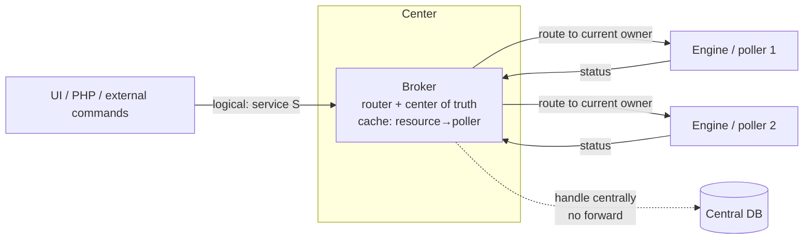
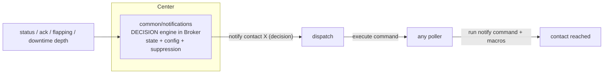
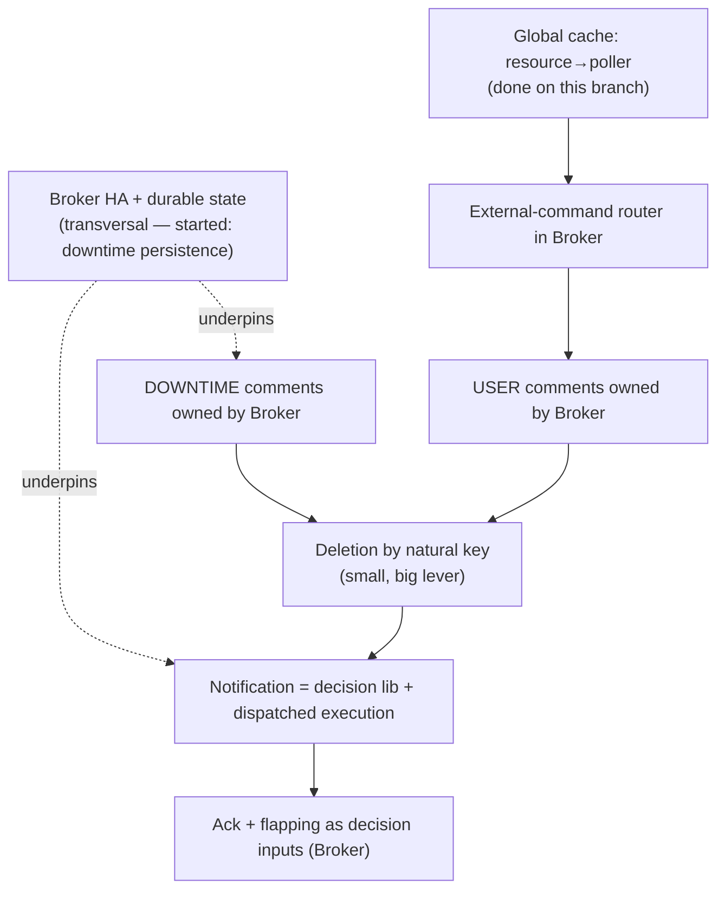

# Target architecture — toward poller HA

<!-- TOC -->
* [Target architecture — toward poller HA](#target-architecture--toward-poller-ha)
* [Purpose and status](#purpose-and-status)
* [The paradigm shift: the resource becomes *logical*](#the-paradigm-shift-the-resource-becomes-logical)
* [Consequence to name first: the center becomes the stateful critical path](#consequence-to-name-first-the-center-becomes-the-stateful-critical-path)
* [Building block: external commands routed by Broker](#building-block-external-commands-routed-by-broker)
* [Comments](#comments)
  * [USER comments](#user-comments)
  * [DOWNTIME comments](#downtime-comments)
  * [The id lever: deletion by natural key](#the-id-lever-deletion-by-natural-key)
* [Notification: separate decision from execution](#notification-separate-decision-from-execution)
* [Acknowledgement and flapping follow notification](#acknowledgement-and-flapping-follow-notification)
* [Who handles what, by mode](#who-handles-what-by-mode)
* [Dependency graph](#dependency-graph)
* [Suggested implementation order](#suggested-implementation-order)
* [Decisions to de-risk early](#decisions-to-de-risk-early)
* [Open questions](#open-questions)
<!-- TOC -->

# Purpose and status

This document is a **target-architecture note**, not an implementation spec. It
captures a direction the team wants to keep coherent while the individual
sub-projects are delivered one after another. The point of writing it now is to
avoid painting any single subsystem into a corner: the topics below are
deliberately discussed **in parallel** even though they will be **implemented
sequentially**.

It builds directly on work already on the `MON-187019` branch:

* the **global cache** in Broker, which already knows the `resource → poller_id`
  mapping;
* the **`notification_mode=broker`** option, under which Broker owns downtimes
  in-process (`common/downtimes::downtime_manager`);
* the **broker-side persistence of started downtimes** across a `cbd` restart —
  which, as explained below, is brick #1 of a much larger story.

# The paradigm shift: the resource becomes *logical*

The driver is **poller high availability**. In an HA world we no longer control
which poller carries a given host or service — placement becomes dynamic and a
poller is *fungible execution*. This inverts the addressing model:

* **Today**: an external command targets "poller P, service S".
* **Target**: a command targets "service S" (a *logical* identity) and **Broker
  resolves which poller currently carries it**.

Broker therefore becomes the **router and center of truth**; pollers (Engine)
become **execution units** that run checks and report status. The routing table
this requires — `resource → poller_id` — already exists in Broker's global
cache, so the foundation is in place.

# Consequence to name first: the center becomes the stateful critical path

Moving downtimes, comments and (eventually) notification to the center means the
**center holds the state**. Broker therefore has to become **highly available
and durable itself**: relocating the stateful core away from the (now fungible)
pollers turns Broker into the new single point of failure unless its state is
persisted and its role can fail over.

This is the largest *hidden* dependency of the whole programme, and it has
already started: the **persistence of started downtimes across a `cbd` restart**
is the first concrete instance of "Broker owns durable state". Every subsequent
step (comments, notification state) extends the same requirement. It must be
tracked as a **transversal track**, not as an afterthought of each feature.

# Building block: external commands routed by Broker

Every external command reaches Broker, which decides — using the cache — between
two outcomes:

1. **Handle centrally**: the target is a central-owned store (comments,
   downtimes in broker mode). Broker writes directly to the database; **no
   forward to a poller**.
2. **Route to the current owner**: the command touches a live Engine object
   (force a check, etc.). Broker forwards it to the poller currently carrying the
   resource.

The cache is what makes outcome (2) possible without the user knowing the
placement, and outcome (1) is what removes a whole class of round-trips.

# Comments

A reminder of the current state, post-`comment::comments`-removal: **Engine no
longer holds any comment in memory**; Broker is the comment store. Engine still
*mints* comments (it emits `NEBTYPE_COMMENT_ADD` / `..._DELETE` / `..._LOAD`) and
Broker writes them to the `comments` table. There is **no comment UPDATE** — a
comment is immutable, only its `deletion_time` ever changes.

The four creation categories today:

| `entry_type` | Trigger | Engine sites |
|---|---|---|
| USER | `ADD_HOST/SVC_COMMENT`, gRPC `AddHost/ServiceComment` | `commands.cc:208`, `engine_impl.cc:1478/1536` |
| DOWNTIME | downtime scheduling → `downtime::subscribe()` | `engine_downtime_callbacks.cc:472` (engine mode) |
| FLAPPING | host/service starts flapping | `host.cc:1980`, `service.cc:2742` |
| ACKNOWLEDGMENT | `acknowledge_*_problem`, gRPC acknowledge | `commands.cc:2516/2561`, `engine_impl.cc:1778/1845` |

## USER comments

Verified: Engine does **not** consume USER comments (the notifier only references
the *acknowledgement* comment id, at `notifier.cc:1096`, to delete it — never the
text). Therefore, once external commands are routed to Broker, a USER comment can
live **entirely** on the Broker side:

* the `ADD_*_COMMENT` command is handled centrally → Broker writes the row;
* the `DEL_*_COMMENT` from the UI also reaches Broker → delete-by-id on the Broker
  side.

No forward to a poller, no Engine involvement. This effectively completes the
deferred "Broker owns the comment id" option, scoped to USER comments.

## DOWNTIME comments

In `notification_mode=broker`, Broker already owns the downtime (the
`downtime_manager` is in-process). The hooks
`broker_downtime_callbacks::create_downtime_comment` /
`delete_downtime_comment` exist but are currently **no-ops**, so a
broker-scheduled downtime (gRPC or BAM inherited) has a row in `downtimes` but
**no associated row in `comments`** — an asymmetry with engine-managed downtimes.
Filling these two hooks (emit a lightweight `pb_comment` ADD on create, a
delete-by-id on removal) closes the gap, with **no PHP/UI change**.

Caveat introduced by downtime persistence: the persisted `Downtime` does not
carry its `comment_id`. On reload, `downtime::reload()` uses `notify_broker_load()`
(not `subscribe()`), so it does not recreate the comment (correct — the row is
still in the DB), but the in-memory `comment_id` is lost, which would orphan the
comment at deletion. The fix is to **persist `comment_id` alongside the downtime**
in `active_downtimes`.

## The id lever: deletion by natural key

This is the single change that unlocks the rest. Today Engine must *remember* the
id of the ack/flapping comment to delete it later
(`notifier::_acknowledgement_comment_id`, `_flapping_comment_id`). If deletion is
switched to a **natural key** `(host_id, service_id, entry_type)` — the mechanism
already proven by the Phase-4 bulk delete — then:

* Broker can own **all** comment ids (the DB auto-increment, the real PK), and
  Engine never needs to know a broker-assigned id;
* the `(internal_id, instance_id)` namespacing problem **dissolves**;
* the notifier no longer needs `_acknowledgement_comment_id` /
  `_flapping_comment_id`: it just emits "clear my ack/flapping comment".

This is the small change that later makes the ack/flapping migration cheap.

# Notification: separate decision from execution

Notification lives entirely in Engine today (`notifier.cc`, `notification.cc`,
`escalation.cc`, `contact.cc`, executed via `command_manager`) and is tightly
coupled to Engine's object model. The temptation is to extract a monolithic
`common/notifications` library mirroring `common/downtimes` — but notification is
**not self-contained** the way downtimes were. It must be split:

* **Decision** — who to notify, when, and whether to suppress. This is a state
  machine plus configuration (contacts, contactgroups, escalations,
  timeperiods). This part *can* be extracted to a `common/notifications` library
  and run inside Broker. The HA argument reinforces this: a decision about a
  *logical* resource belongs at the center, not on a fungible poller.
* **Execution** — running the notification command, with macro expansion. Engine
  can do this; Broker cannot. This is the real cost and the real risk.

The cleanest decoupling — and it mirrors how a downtime's *effect* is already
applied — is: **Broker decides "notify contact X" and dispatches the *execution*
to a fungible poller** (any available one). Decision central, execution
distributed. This avoids reimplementing a command executor and macro engine
inside Broker.

**Honest caution**: do not over-extract. `common/downtimes` worked because its
logic was closed. The notification library *will* leak (config access, macro
expansion). Put only the **decision core** in `common`, and accept that the
boundary will be less clean than for downtimes.

## Decision made (2026-07-22): model C — "fat decision", "thin execution"

`broker_notification_callbacks::deliver()` is currently a stub (TODO
MON-187019). Three models were compared to implement it:

* **A — fire-and-forget.** Broker decides *when*, dispatches "notify R" to a
  poller that does selection + escalations + macros + command, with no feedback.
  **Rejected**: intolerable regressions — the escalation interval is ignored
  (Broker falls back to the base interval) and recovery is routed to the current
  config instead of the contacts historically notified.
* **B — asynchronous round-trip.** Like A, but the poller sends back
  `{notified_contacts, interval, escalated}` which Broker records. **Rejected**:
  Engine↔Broker round-trips have proven error-prone in the past, and it breaks
  the synchronous contract of `deliver()`.
* **C — fat decision / thin execution (CHOSEN).** Broker itself performs contact
  selection + escalations (⇒ contacts/contactgroups/escalations in the cache),
  computes `notified_contacts` + interval **synchronously**, then dispatches only
  the *execution* (macro expansion + command launch) to the poller. The
  synchronous `deliver()` contract is preserved, recovery and escalation interval
  stay exact, **no round-trip**.

### Splitting `deliver`

* **decision** (`get_contacts_to_notify` + escalation interval) → ported into
  `common/notifications` over the cache data;
* **execution** (macros + the `notify_contact` loop, the tail of
  `engine_notification_callbacks::deliver`) → stays on the poller, triggered by a
  **one-way Broker→poller** dispatch event.

### Data to add to `broker_cache` (from the Engine selection code)

* **contact**: name, `host`/`service_notifications_enabled`,
  `host`/`service_notification_period`, `timezone`, `notify_on` bitmasks for host
  and service;
* **contactgroup**: name → members;
* **resource→contacts + contactgroups** links (host and service);
* **host/service escalations**: `first`/`last_notification`,
  `escalation_period`, `notification_interval`, contactgroups;
* reuse the notification-timeperiod cache for the `escalation_period` /
  `contact_notification_period`.

### Brick order

1. **one-way dispatch channel** — BBDO event `pb_notification_execute`
   (`{host_id, service_id, reason_type, category, notification_id,
   notification_number, escalated, author, message, options,
   repeated contact_name}`) + poller execution handler; prototypable end-to-end
   with an injected contact list (de-risks the channel first);
2. **notification-config cache** (the items above);
3. **selection logic** ported over the cache;
4. **wiring `deliver`** = selection → emit the event → `delivery_result`;
5. `on_notification_number_changed` (status push) — later.

### Sub-decisions still open (to settle before coding)

* **(a) — DECIDED (2026-07-22).** Broker dispatches execution to the **poller
  that supervises the resource**, identified by `resource→poller` from the cache
  (`host->obj().instance_id()`). That poller **always** has the macro context
  locally (a poller only notifies resources it supervises) — nothing to carry in
  the event. Same shape in v1 and HA: HA only changes the `resource→poller`
  resolution (to the **active** poller of a redundancy group, which also holds the
  config), not the event shape. Associated rule: **supervising poller
  disconnected → `deliver()` returns empty → retry on the next notification
  cycle** (consistent with "the next notification fires in X minutes").
* **(b) — DECIDED (2026-07-22).** Broker **replicates the per-contact filtering**
  of `contact::should_be_notified` (`contact.cc:826`): (1) `host`/
  `service_notifications_enabled`, (2) the contact's notification period evaluated
  in **its own** timezone, (3) the `notify_on` bitmask. This is the only option
  consistent with C without a round-trip (delegating this filtering to the poller
  would make Broker's `notified_contacts` wrong → mis-routed recovery / wrong
  `last_notification`). Point (2) directly reuses
  `string_to_timezone(contact.timezone)` + the timeperiod cache shipped for the
  timezone fallback. This is the config "leak" the doc announced, accepted.
* **(c) — DECIDED (2026-07-22).** Channel = a **dedicated new BBDO protobuf event
  `pb_notification_execute`** (in `bbdo/`), routed by `destination_id` to the
  supervising poller; the cbmod/neb handler is just one more `read()`. Rejected:
  hijacking the external-command path (historical text stream meant for "user
  orders", ill-suited to a structured payload, and colliding with the roadmap's
  external-command router) and a parallel gRPC RPC (Broker has no outbound channel
  to pollers outside BBDO; duplicate plumbing/HA).

# Acknowledgement and flapping follow notification

Ack and flapping are first of all **inputs to the notification decision** (an ack
suppresses notifications; flapping suppresses and annotates). As long as the
decision lives in Engine, moving ack/flapping alone buys almost nothing and costs
the id-correlation pain. The moment the decision engine is Broker-side,
**ack/flapping migrate naturally with it**, and their comments become trivial
thanks to deletion-by-natural-key. Therefore: **not before notification.**

# Who handles what, by mode

| Concern | Engine mode (today's default) | Broker mode (`notification_mode=broker`) |
|---|---|---|
| Checks / status | Engine | Engine (always — execution stays distributed) |
| Downtimes | Engine | **Broker** (`downtime_manager`, persistent across restart) |
| DOWNTIME comments | Engine mints, Broker writes | **Broker** mints + writes |
| USER comments | Engine mints, Broker writes | **Broker** (handled centrally, target state) |
| ACK / FLAPPING comments | Engine mints, Broker writes | Engine (until notification moves) → **Broker** (after) |
| Notification decision | Engine | Engine (until extracted) → **Broker** (target) |
| Notification execution | Engine | Engine, or **dispatched to a fungible poller** (target) |
| Comment id ownership | Engine `internal_id` | **Broker** (DB auto-increment) once delete-by-natural-key lands |
| Durable state | Poller retention | **Broker** (cache + persistence) — needs broker HA |

# Dependency graph

# Suggested implementation order

1. **DOWNTIME comments on the Broker side** — closes the asymmetry, no risk;
   fill the two no-op callbacks, persist `comment_id` with the downtime.
2. **Deletion by natural key** — small, but the lever that unlocks everything
   after it.
3. **External-command router + USER comments owned by Broker** — leans on the
   cache; removes a class of round-trips.
4. **Notification = decision library + dispatched execution** — the big rock.
5. **Ack + flapping as decision inputs** — fall out almost for free once (4) is
   done.

Throughout, the **Broker HA / durable-state** track runs in parallel and gates
how much state any of the above may safely hold centrally.

# Decisions to de-risk early

1. **Where the notification command executes** — dispatch-to-poller (recommended)
   vs an executor inside Broker. This gates the entire notification track and
   should be prototyped first. **DECIDED (2026-07-22): model C** — decision
   (contact selection + escalations) in Broker, execution (macros + command)
   dispatched to the poller; see "Decision made: model C" above.
2. **The id model** — switch comment deletion to a natural key. Small, but it
   conditions the cleanliness of everything else.
3. **Broker durable state / HA** — if Broker carries downtimes + comments +
   notification, it becomes the SPOF. This is the direct continuation of the
   cache/retention work and must be a first-class track.

# Open questions

* How is the **notification configuration** (contacts, escalations, timeperiods,
  notification commands, macros) made available at the center — pushed into the
  global cache, or fetched on demand?
* For dispatched execution, how is a **fungible poller selected** and what happens
  if the chosen poller dies mid-notification (idempotency / retry)?
* Does any consumer still rely on **status.dat** semantics that the center cannot
  reproduce? (Comments already dropped from status.dat; check before extending.)
* What is the **failover model** for Broker-owned state — active/passive with
  shared durable storage, or replicated? This determines how aggressively state
  can move to the center.
