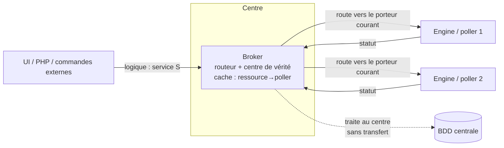
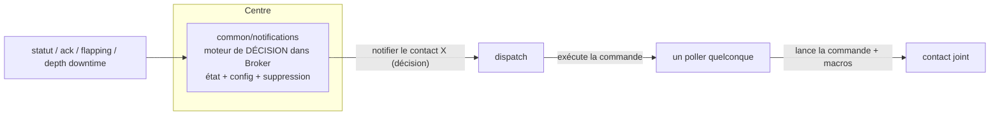
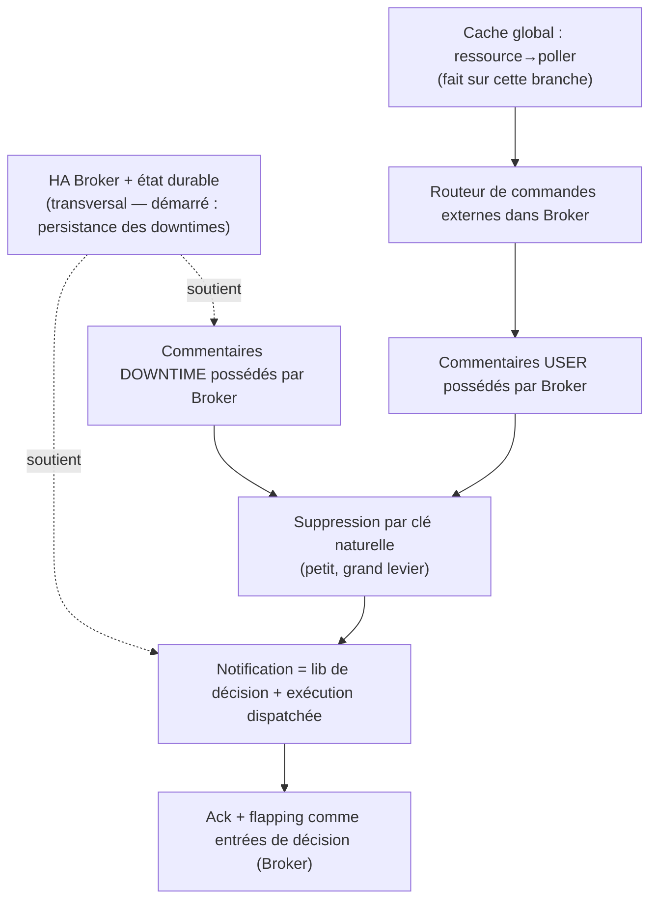

# Architecture cible — vers la HA des pollers

<!-- TOC -->
* [Architecture cible — vers la HA des pollers](#architecture-cible--vers-la-ha-des-pollers)
* [Objectif et statut](#objectif-et-statut)
* [Le changement de paradigme : la ressource devient *logique*](#le-changement-de-paradigme--la-ressource-devient-logique)
* [Conséquence à nommer d'abord : le centre devient le chemin critique avec état](#conséquence-à-nommer-dabord--le-centre-devient-le-chemin-critique-avec-état)
* [Brique de base : les commandes externes routées par Broker](#brique-de-base--les-commandes-externes-routées-par-broker)
* [Commentaires](#commentaires)
  * [Commentaires USER](#commentaires-user)
  * [Commentaires DOWNTIME](#commentaires-downtime)
  * [Le levier des ids : suppression par clé naturelle](#le-levier-des-ids--suppression-par-clé-naturelle)
* [Notification : séparer la décision de l'exécution](#notification--séparer-la-décision-de-lexécution)
* [Ack et flapping suivent la notification](#ack-et-flapping-suivent-la-notification)
* [Qui gère quoi, selon le mode](#qui-gère-quoi-selon-le-mode)
* [Graphe de dépendances](#graphe-de-dépendances)
* [Ordre d'implémentation proposé](#ordre-dimplémentation-proposé)
* [Décisions à dé-risquer tôt](#décisions-à-dé-risquer-tôt)
* [Questions ouvertes](#questions-ouvertes)
<!-- TOC -->

# Objectif et statut

Ce document est une **note d'architecture cible**, pas une spécification
d'implémentation. Il fixe une direction que l'équipe veut garder cohérente
pendant que les sous-projets seront livrés les uns après les autres. L'intérêt de
l'écrire maintenant est d'éviter de décrire un sous-système dans un coin : les
sujets ci-dessous sont volontairement discutés **en parallèle**, même s'ils
seront **implémentés en séquence**.

Il s'appuie directement sur le travail déjà présent sur la branche `MON-187019` :

* le **cache global** de Broker, qui connaît déjà l'association
  `ressource → poller_id` ;
* l'option **`notification_mode=broker`**, sous laquelle Broker gère les downtimes
  in-process (`common/downtimes::downtime_manager`) ;
* la **persistance côté broker des downtimes démarrés** au redémarrage de `cbd` —
  qui, comme expliqué plus bas, est la brique n°1 d'une histoire bien plus large.

# Le changement de paradigme : la ressource devient *logique*

Le moteur, c'est la **haute disponibilité des pollers**. Dans un monde HA, on ne
maîtrise plus quel poller porte un host ou un service donné — le placement devient
dynamique et un poller n'est qu'une *exécution fongible*. Cela inverse le modèle
d'adressage :

* **Aujourd'hui** : une commande externe vise « poller P, service S ».
* **Cible** : une commande vise « service S » (identité *logique*) et **Broker
  résout quel poller le porte actuellement**.

Broker devient donc le **routeur et centre de vérité** ; les pollers (Engine)
deviennent des **unités d'exécution** qui exécutent les checks et remontent les
statuts. La table de routage nécessaire — `ressource → poller_id` — existe déjà
dans le cache global de Broker : la fondation est posée.

# Conséquence à nommer d'abord : le centre devient le chemin critique avec état

Déplacer les downtimes, les commentaires et (à terme) la notification vers le
centre signifie que le **centre porte l'état**. Broker doit donc devenir
**hautement disponible et durable lui-même** : relocaliser le cœur d'état hors des
pollers (désormais fongibles) fait de Broker le nouveau point de défaillance
unique, sauf si son état est persisté et si son rôle peut basculer.

C'est la dépendance *cachée* la plus lourde de tout le programme, et elle a déjà
commencé : la **persistance des downtimes démarrés au redémarrage de `cbd`** est
la première instance concrète de « Broker porte un état durable ». Chaque étape
suivante (commentaires, état de notification) prolonge la même exigence. À traiter
comme un **track transversal**, pas comme un à-côté de chaque feature.

# Brique de base : les commandes externes routées par Broker

Chaque commande externe arrive à Broker, qui tranche — grâce au cache — entre deux
issues :

1. **Traiter au centre** : la cible est un store central (commentaires, downtimes
   en mode broker). Broker écrit directement en base ; **aucun transfert au
   poller**.
2. **Router vers le porteur courant** : la commande touche un objet vivant
   d'Engine (forcer un check, etc.). Broker la transfère au poller qui porte
   actuellement la ressource.

Le cache est ce qui rend l'issue (2) possible sans que l'utilisateur connaisse le
placement, et l'issue (1) est ce qui supprime toute une classe d'allers-retours.

# Commentaires

Rappel de l'état actuel, après suppression de `comment::comments` : **Engine ne
détient plus aucun commentaire en mémoire** ; Broker est le store des
commentaires. Engine les *frappe* encore (il émet `NEBTYPE_COMMENT_ADD` /
`..._DELETE` / `..._LOAD`) et Broker les écrit dans la table `comments`. Il n'y a
**pas d'UPDATE de commentaire** — un commentaire est immuable, seule sa
`deletion_time` change.

Les quatre catégories de création aujourd'hui :

| `entry_type` | Déclencheur | Sites Engine |
|---|---|---|
| USER | `ADD_HOST/SVC_COMMENT`, gRPC `AddHost/ServiceComment` | `commands.cc:208`, `engine_impl.cc:1478/1536` |
| DOWNTIME | planification d'un downtime → `downtime::subscribe()` | `engine_downtime_callbacks.cc:472` (mode engine) |
| FLAPPING | host/service entre en flapping | `host.cc:1980`, `service.cc:2742` |
| ACKNOWLEDGMENT | `acknowledge_*_problem`, gRPC acknowledge | `commands.cc:2516/2561`, `engine_impl.cc:1778/1845` |

## Commentaires USER

Vérifié : Engine ne **consomme pas** les commentaires USER (le notifier ne
référence que l'id du commentaire d'*acquittement*, en `notifier.cc:1096`, pour le
supprimer — jamais le texte). Donc, une fois les commandes externes routées vers
Broker, un commentaire USER peut vivre **entièrement** côté Broker :

* la commande `ADD_*_COMMENT` est traitée au centre → Broker écrit la ligne ;
* le `DEL_*_COMMENT` de l'UI arrive aussi à Broker → delete-by-id côté Broker.

Aucun transfert au poller, aucune implication d'Engine. Cela achève de fait
l'option différée « Broker possède l'id du commentaire », limitée aux USER.

## Commentaires DOWNTIME

En `notification_mode=broker`, Broker possède déjà le downtime (le
`downtime_manager` est in-process). Les hooks
`broker_downtime_callbacks::create_downtime_comment` /
`delete_downtime_comment` existent mais sont aujourd'hui **no-op** : un downtime
planifié par broker (gRPC ou inherited BAM) a une ligne dans `downtimes` mais
**aucune ligne associée dans `comments`** — une asymétrie avec les downtimes gérés
par engine. Remplir ces deux hooks (émettre un `pb_comment` ADD allégé à la
création, un delete-by-id à la suppression) referme le trou, **sans changement
PHP/UI**.

Réserve introduite par la persistance des downtimes : le `Downtime` persisté ne
porte pas son `comment_id`. Au rechargement, `downtime::reload()` utilise
`notify_broker_load()` (pas `subscribe()`), donc ne recrée pas le commentaire
(correct — la ligne est toujours en base), mais le `comment_id` en mémoire est
perdu, ce qui rendrait le commentaire orphelin à la suppression. Le correctif est
de **persister `comment_id` à côté du downtime** dans `active_downtimes`.

## Le levier des ids : suppression par clé naturelle

C'est le changement unique qui débloque le reste. Aujourd'hui Engine doit
*mémoriser* l'id du commentaire d'ack/flapping pour le supprimer plus tard
(`notifier::_acknowledgement_comment_id`, `_flapping_comment_id`). Si la
suppression bascule sur une **clé naturelle** `(host_id, service_id, entry_type)`
— le mécanisme déjà prouvé par le bulk-delete de la Phase 4 — alors :

* Broker peut posséder **tous** les ids de commentaires (l'auto-increment DB, la
  vraie PK), et Engine n'a plus jamais besoin de connaître un id assigné par
  broker ;
* le problème de namespace `(internal_id, instance_id)` **se dissout** ;
* le notifier n'a plus besoin de `_acknowledgement_comment_id` /
  `_flapping_comment_id` : il émet juste « efface mon commentaire d'ack/flapping ».

C'est le petit changement qui rend ensuite la migration d'ack/flapping bon marché.

# Notification : séparer la décision de l'exécution

La notification vit aujourd'hui entièrement dans Engine (`notifier.cc`,
`notification.cc`, `escalation.cc`, `contact.cc`, exécutée via `command_manager`)
et est fortement couplée au modèle objet d'Engine. La tentation est d'extraire une
librairie `common/notifications` monobloc calquée sur `common/downtimes` — mais la
notification n'est **pas auto-contenue** comme l'étaient les downtimes. Il faut la
scinder :

* **Décision** — qui notifier, quand, et faut-il supprimer. C'est une machine à
  états plus une configuration (contacts, contactgroups, escalations,
  timeperiods). Cette partie *peut* être extraite dans une librairie
  `common/notifications` et tourner dans Broker. L'argument HA va dans ce sens :
  une décision sur une ressource *logique* appartient au centre, pas à un poller
  fongible.
* **Exécution** — lancer la commande de notification, avec expansion de macros.
  Engine sait le faire ; Broker non. C'est le vrai coût et le vrai risque.

Le découplage le plus sain — et il calque la façon dont l'*effet* d'un downtime est
déjà appliqué — est : **Broker décide « notifier le contact X » et *dispatche
l'exécution* à un poller fongible** (n'importe lequel disponible). Décision
centrale, exécution distribuée. Cela évite de réimplémenter un exécuteur de
commandes et un moteur de macros dans Broker.

**Mise en garde honnête** : ne pas sur-extraire. `common/downtimes` a marché parce
que sa logique était close. La librairie de notification *fuira* (accès config,
expansion de macros). Ne mettre que le **cœur de décision** dans `common`, et
accepter que la frontière sera moins nette que pour les downtimes.

# Ack et flapping suivent la notification

Ack et flapping sont d'abord des **entrées de la décision de notification** (un
ack supprime les notifications ; le flapping supprime et annote). Tant que la
décision vit dans Engine, déplacer ack/flapping seuls ne rapporte presque rien et
coûte la corrélation d'id. Dès que le moteur de décision est côté Broker,
**ack/flapping migrent naturellement avec lui**, et leurs commentaires deviennent
triviaux grâce à la suppression par clé naturelle. Donc : **pas avant la
notification.**

# Qui gère quoi, selon le mode

| Préoccupation | Mode engine (défaut actuel) | Mode broker (`notification_mode=broker`) |
|---|---|---|
| Checks / statut | Engine | Engine (toujours — l'exécution reste distribuée) |
| Downtimes | Engine | **Broker** (`downtime_manager`, persistant au restart) |
| Commentaires DOWNTIME | Engine frappe, Broker écrit | **Broker** frappe + écrit |
| Commentaires USER | Engine frappe, Broker écrit | **Broker** (traité au centre, état cible) |
| Commentaires ACK / FLAPPING | Engine frappe, Broker écrit | Engine (jusqu'au déplacement de la notif) → **Broker** (après) |
| Décision de notification | Engine | Engine (jusqu'à extraction) → **Broker** (cible) |
| Exécution de notification | Engine | Engine, ou **dispatchée à un poller fongible** (cible) |
| Propriété de l'id de commentaire | `internal_id` d'Engine | **Broker** (auto-increment DB) une fois la suppression par clé naturelle en place |
| État durable | Rétention du poller | **Broker** (cache + persistance) — nécessite la HA broker |

# Graphe de dépendances

# Ordre d'implémentation proposé

1. **Commentaires DOWNTIME côté Broker** — referme l'asymétrie, sans risque ;
   remplir les deux callbacks no-op, persister `comment_id` avec le downtime.
2. **Suppression par clé naturelle** — petit, mais le levier qui débloque tout ce
   qui suit.
3. **Routeur de commandes externes + commentaires USER possédés par Broker** —
   s'appuie sur le cache ; supprime une classe d'allers-retours.
4. **Notification = librairie de décision + exécution dispatchée** — le gros
   rocher.
5. **Ack + flapping comme entrées de décision** — tombent presque tout seuls une
   fois (4) fait.

Tout du long, le track **HA Broker / état durable** tourne en parallèle et
conditionne la quantité d'état que chacun des points ci-dessus peut porter au
centre en toute sécurité.

# Décisions à dé-risquer tôt

1. **Où s'exécute la commande de notification** — dispatch-to-poller (recommandé)
   vs un exécuteur dans Broker. Ça gate tout le track notification et doit être
   prototypé en premier.
2. **Le modèle d'id** — basculer la suppression de commentaire sur une clé
   naturelle. Petit, mais il conditionne la propreté de tout le reste.
3. **État durable / HA de Broker** — si Broker porte downtimes + commentaires +
   notification, il devient le SPOF. C'est la continuation directe du chantier
   cache/rétention et doit être un track de premier plan.

# Questions ouvertes

* Comment la **configuration de notification** (contacts, escalations,
  timeperiods, commandes de notification, macros) est-elle rendue disponible au
  centre — poussée dans le cache global, ou récupérée à la demande ?
* Pour l'exécution dispatchée, comment **sélectionne-t-on un poller fongible** et
  que se passe-t-il si le poller choisi meurt en pleine notification (idempotence
  / retry) ?
* Un consommateur dépend-il encore de la sémantique **status.dat** que le centre
  ne saurait reproduire ? (Les commentaires en ont déjà été retirés ; à vérifier
  avant d'étendre.)
* Quel est le **modèle de bascule** pour l'état possédé par Broker — actif/passif
  avec stockage durable partagé, ou répliqué ? Cela détermine l'agressivité avec
  laquelle l'état peut migrer vers le centre.
