# Engine — Notifications

This document describes how notifications work on the Engine side
(`engine/`), from their triggering to the execution of the contacts'
notification commands. The core of the logic is the abstract `notifier` class
(`engine/src/notifier.cc`), which `host` and `service` inherit from.

## Table of contents

  - [1. Concepts](#1-concepts)
  - [2. The `notify()` pipeline](#2-the-notify-pipeline)
  - [3. Contact selection (escalations, groups)](#3-contact-selection-escalations-groups)
  - [4. Notification command execution](#4-notification-command-execution)
  - [5. Notifications by type](#5-notifications-by-type)
    - [5.1 PROBLEM (normal)](#51-problem-normal)
    - [5.2 RECOVERY](#52-recovery)
    - [5.3 ACKNOWLEDGEMENT](#53-acknowledgement)
    - [5.4 FLAPPING](#54-flapping)
    - [5.5 DOWNTIME](#55-downtime)
    - [5.6 CUSTOM](#56-custom)
  - [6. Configuration parameters](#6-configuration-parameters)
  - [Introduction to the new notification](#introduction-to-the-new-notification)

## 1. Concepts

A notification is characterized by a **type** (`notifier::reason_type`) which is
grouped into a **category** (`notifier::notification_category`):

| `reason_type`                 | Category (`notification_category`)  | `$NOTIFICATIONTYPE$` macro |
|-------------------------------|-------------------------------------|----------------------------|
| `reason_normal`               | `cat_normal`                        | `PROBLEM`                  |
| `reason_recovery`             | `cat_recovery`                      | `RECOVERY`                 |
| `reason_acknowledgement`      | `cat_acknowledgement`               | `ACKNOWLEDGEMENT`          |
| `reason_flappingstart`        | `cat_flapping`                      | `FLAPPINGSTART`            |
| `reason_flappingstop`         | `cat_flapping`                      | `FLAPPINGSTOP`             |
| `reason_flappingdisabled`     | `cat_flapping`                      | `FLAPPINGDISABLED`         |
| `reason_downtimestart`        | `cat_downtime`                      | `DOWNTIMESTART`            |
| `reason_downtimeend`          | `cat_downtime`                      | `DOWNTIMEEND`              |
| `reason_downtimecancelled`    | `cat_downtime`                      | `DOWNTIMECANCELLED`        |
| `reason_custom` (= 99)        | `cat_custom`                        | `CUSTOM`                   |

The type → category mapping is done by `notifier::get_category()`.

Each notifier remembers the **last notification of each category** in the
`_notification[cat]` array (one `std::unique_ptr<notification>` per category).
This array forms a small state machine:

- `_notification_number`: number of the current problem notification
  (incremented on every notification except `recovery`, reset to 0 after a
  recovery / flapping-stop, kept for acknowledgement and downtime).
- `_notification[cat_normal]` present ⇒ a PROBLEM has already been sent
  (a necessary condition for a RECOVERY to go out).
- `_last_notification` / `_next_notification`: timestamps used for periodic
  re-notification (`notification_interval`).

## 2. The current `notify()` pipeline

Everything goes through `notifier::notify(type, author, data, options)`. The
`host`/`service` states and the callbacks (downtime, external commands) merely
call it with the right `reason_type`.

This design is awkward because it is deeply intertwined with Engine's
internals. The goal is therefore to slim down the `notifier` class and to
introduce a `notification_manager` that will be the heart of Engine's
notification library — first for Engine, then for Broker if needed.

The diagrams below describe the **current** notification behaviour:

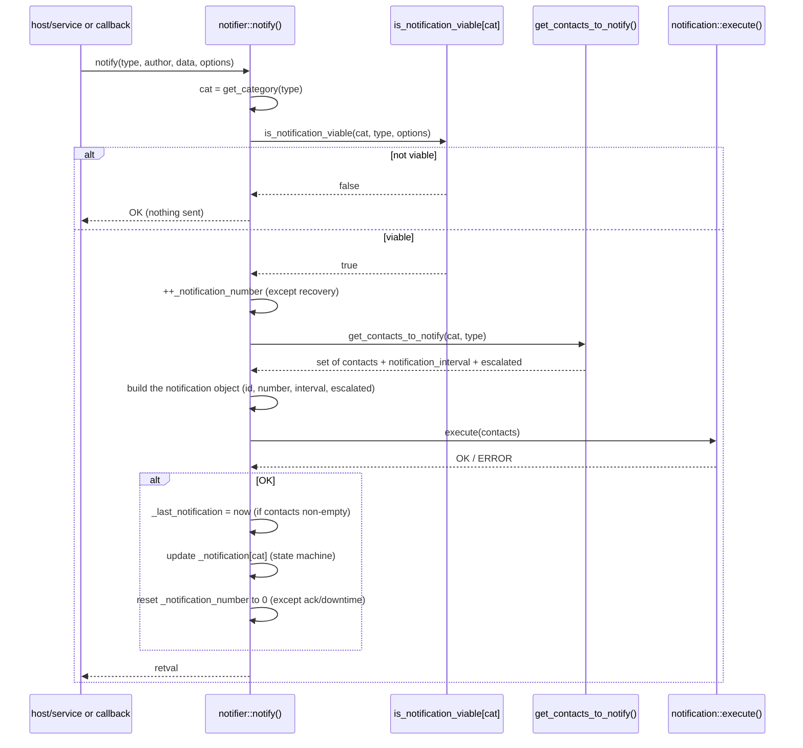

Key points:

- If the notification is **not viable**, `notify()` returns `OK` without
  sending anything (this is not an error).
- The `_notification_number` counter is incremented **before** sending for all
  types except `recovery`.
- The `_notification[cat]` update depends on the category: a RECOVERY clears
  `cat_normal` and `cat_recovery`; a FLAPPINGSTOP/DISABLED clears `cat_flapping`;
  a DOWNTIMEEND/CANCELLED clears `cat_downtime`. For acknowledgement and
  downtime, `_notification_number` is **kept** (otherwise the following recovery
  would not be sent).

## 3. Contact selection (escalations, groups)

`notifier::get_contacts_to_notify()` builds the set of contacts:

1. **Escalations first**: for each escalation that `is_viable(state, number)`,
   its contacts/contactgroups are added. If at least one escalation is viable,
   we are in **escalated** mode (`escalated = true`) and the chosen notification
   interval is the **smallest** among the viable escalations.
2. **Otherwise** (no viable escalation): the notifier's direct contacts **and**
   the contacts of its contactgroups are used.

In every case, a contact is kept only if
`contact::should_be_notified(cat, type, *this)` is true (per-contact filter:
the contact's notification options, the contact's timeperiod, accepted type,
etc.). The returned set is a `std::unordered_set` (a contact present in several
groups is notified only once).

## 4. Notification command execution

`notification::execute(contacts)` (`engine/src/notification.cc`):

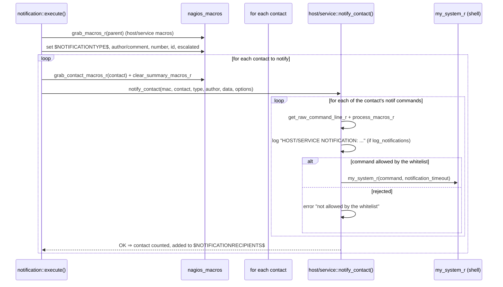

- The commands executed are the **contact's**:
  `get_host_notification_commands()` or `get_service_notification_commands()`.
- Each command is filtered by the **whitelist**
  (`command_is_allowed_by_whitelist(..., NOTIF_TYPE)`) before being run by
  `my_system_r`, with the `notification_timeout`.
- If `log_notifications` is enabled, a `HOST NOTIFICATION:` /
  `SERVICE NOTIFICATION:` line is logged per contact and per command.
- `notify_contact` updates the contact's `last_host_notification` /
  `last_service_notification`.

## 5. Notifications by type

Each category has its own viability function, selected through the
`_is_notification_viable[cat]` array. The `notification_option_forced` flag (for
example a notification forced by an external command) **bypasses** most of the
checks.

### 5.1 PROBLEM (normal)

Triggered when a host/service goes into a **hard** non-OK state
(`host::handle_*`, `service::handle_*` → `notify(reason_normal, …)`).

Viability (`_is_notification_viable_normal`) — all these conditions must be true
(unless forced):

- notifications enabled globally (`enable_notifications`) and for the notifier
  (`get_notifications_enabled()`);
- notifier **not** in downtime; **within** the notification timeperiod; **not**
  flapping;
- **hard** state (a `volatile` service is notified even outside hard);
- problem **not acknowledged**; current state **different from OK/UP**;
- `notify_on_current_state()` (the notifier is configured to notify that state;
  for a service, its host must not be down);
- first notification delay elapsed (`first_notification_delay`);
- allowed by dependencies (`authorized_by_dependencies(notification)`);
- if a PROBLEM has already been sent: the re-notification interval is respected
  (`notification_interval`; `0` ⇒ no re-notification).

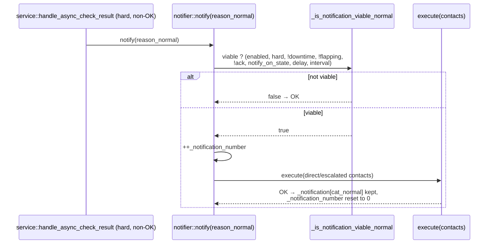

### 5.2 RECOVERY

Triggered when the notifier returns to **OK/UP** (`notify(reason_recovery, …)`).

Viability (`_is_notification_viable_recovery`):

- notifications enabled (globally and for the notifier);
- within the timeperiod **unless** `send_recovery_notifications_anyways` is set;
- not in downtime; not flapping; **hard** state; **OK/UP** state;
- configured to notify recovery (`notify_on(up)` / `notify_on(ok)`);
- `recovery_notification_delay` elapsed;
- `_notification_number > 0` **and** `_notification[cat_normal]` present: a
  PROBLEM must have been sent beforehand.

The `send_later` flag decides whether we will retry later (outside timeperiod,
downtime, flapping, soft…) or give up by resetting `_notification_number` (not
configured for recovery). A recovery clears `cat_normal` and `cat_recovery` and
resets `_notification_number` to 0.

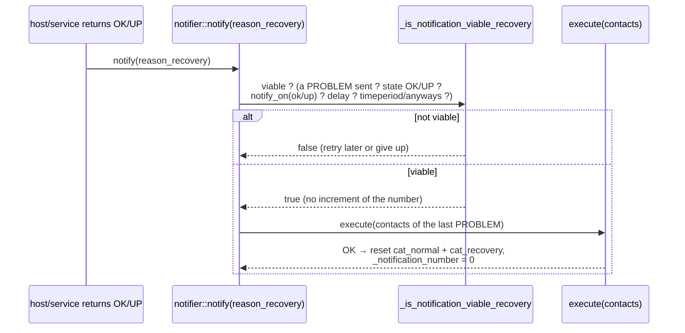

> Note: each PROBLEM re-notification **accumulates** the contacts of the
> previous normal notification (`notif->add_contacts(...)` in `notify()`), so
> `_notification[cat_normal]` keeps the cumulative set of everyone already
> warned. The RECOVERY's viability precisely requires this stored normal
> notification to exist.

### 5.3 ACKNOWLEDGEMENT

Triggered by the acknowledgement external command
(`commands.cc` `acknowledge_host`/`acknowledge_service` →
`notify(reason_acknowledgement, author, comment, …)`).

Viability (`_is_notification_viable_acknowledgement`) — minimal:

- forced ⇒ sent;
- notifications enabled (globally and for the notifier);
- the object must be **in a problem state** (state ≠ OK/UP).

`_notification_number` is **kept** (an acknowledgement must not prevent the later
recovery).

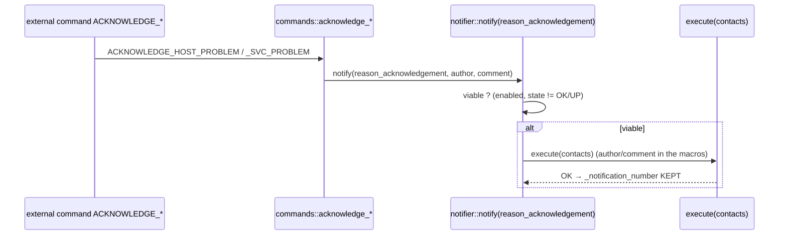

### 5.4 FLAPPING

Triggered by flapping detection (`host::set_flap`/`clear_flap`,
`service::set_flap`/`clear_flap`):
`reason_flappingstart`, `reason_flappingstop`, and `reason_flappingdisabled`
(when flap detection is disabled while the object is flapping).

Viability (`_is_notification_viable_flapping`):

- forced ⇒ sent; notifications enabled;
- configured for this type (`notify_on(flappingstart/stop/disabled)`);
- **no START** if a flapping notification is already running;
- **STOP/DISABLED** only if the last flapping notification was a START;
- not the same one twice (same `reason`);
- not during a scheduled downtime.

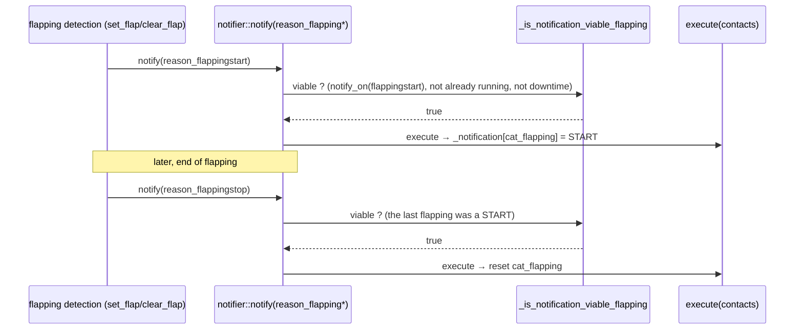

### 5.5 DOWNTIME

Triggered by the downtime callbacks
(`engine/src/engine_downtime_callbacks.cc`):
`reason_downtimestart` (start), `reason_downtimeend` (normal end),
`reason_downtimecancelled` (cancellation).

Viability (`_is_notification_viable_downtime`):

- forced ⇒ sent; notifications enabled (globally and for the notifier);
- configured for downtime (`notify_on(downtime)`);
- **not** already in a scheduled downtime (`get_scheduled_downtime_depth() == 0`).

Like the acknowledgement, downtime **keeps** `_notification_number`. A
DOWNTIMEEND/CANCELLED clears `_notification[cat_downtime]`.

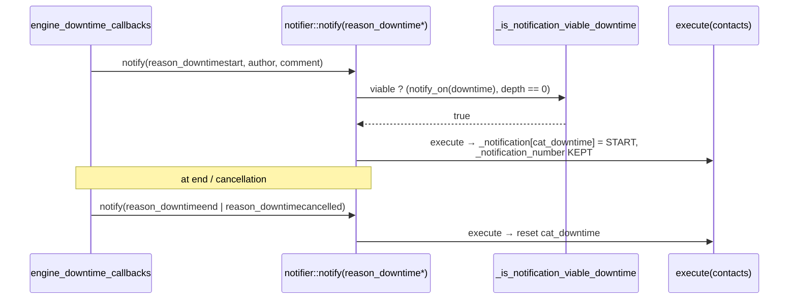

### 5.6 CUSTOM

Triggered by the custom notification external command
(`engine/src/commands/processing.cc` → `notify(reason_custom, author, data, …)`).

Viability (`_is_notification_viable_custom`):

- forced ⇒ sent; notifications enabled (globally and for the notifier);
- not during a scheduled downtime.

A CUSTOM notification does not touch the problem state machine: it is a one-off
send to the contacts, with the supplied author and message.

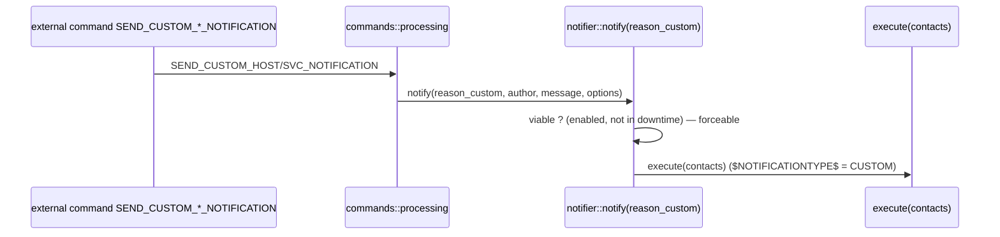

## 6. Configuration parameters

Parameters influencing the viability and the pace of notifications:

- **Global** (`pb_indexed_config.state()`): `enable_notifications`,
  `interval_length`, `notification_timeout`, `log_notifications`,
  `send_recovery_notifications_anyways`.
- **Per notifier**: `notifications_enabled`, `notification_period`,
  `notification_interval`, `first_notification_delay`,
  `recovery_notification_delay`, `notify_on` (mask
  `up/down/unreachable/ok/warning/critical/unknown/flapping*/downtime`),
  `is_volatile`.
- **Per contact**: notification options (host/service), the contact's
  timeperiod, host/service notification commands — all evaluated in
  `contact::should_be_notified()` then `notify_contact()`.
- **Escalations**: own interval, `first_notification`/`last_notification`
  range, contactgroups — evaluated by `escalation::is_viable()`.

## 7. Going further (code)

- `engine/src/notifier.cc` — `notify()`, `get_category()`,
  `get_contacts_to_notify()`, `is_notification_viable()` and the six
  `_is_notification_viable_*`.
- `engine/src/notification.cc` — `notification::execute()` (macros, contact
  iteration).
- `engine/src/host.cc` / `engine/src/service.cc` — `notify_contact()`
  (command execution, whitelist, logs) and the PROBLEM / RECOVERY / FLAPPING
  triggers.
- `engine/src/engine_downtime_callbacks.cc` — DOWNTIME triggers.
- `engine/src/commands/commands.cc` — ACKNOWLEDGEMENT trigger.
- `engine/src/commands/processing.cc` — CUSTOM trigger.

## Introduction to the new notification

The diagrams in the previous sections describe the **legacy** notification,
tightly coupled to `notifier`. This section describes the **new notification
library**, whose goal is to make notifications independent from Engine so that
they can eventually be reused (notably by Broker).

### Principle

The model follows the one of the downtimes library (`common/downtimes`): the
library no longer knows about Engine objects (`notifier`, `contact`,
`nagios_macros`, globals…). It talks to the host application through an
**injected interface**, `notification_callbacks`, and addresses resources by
**logical id `(host_id, service_id)`** (with `service_id == 0` for a host). All
the coupling to Engine is concentrated in a **single** implementation,
`engine_notification_callbacks`, living on the `cce_core` side.

### Components

| Component | Location | Role |
|---|---|---|
| `notification_manager` | library (`engine/src/notifications/`) | Singleton. Viability policy, per-`(host_id, service_id)` runtime state, orchestration of `notify()`. **No Engine dependency.** |
| `notification` | library | **Pure data** of an emitted notification event (type, author, message, id, number, notified contacts). No more `execute()`, no more `notifier*`. |
| `notification_callbacks` | library | Abstract interface to the host application, id-addressed. |
| `notification_types.hh` | library | Enums + value structs `global_config`, `resource_state`, `delivery_result`. |
| `engine_notification_callbacks` | Engine (`cce_core`) | Implementation: resolves host/service by id, provides the state, and **performs delivery** (contact selection + macros + `notify_contact`). |
| `notifier` | Engine | No longer stores notification state. Keeps `host_id()/service_id()` and **delegates** to the manager by id. |

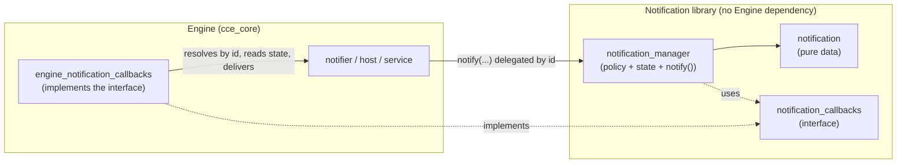

### Backend injection (load / unload)

The host application injects its implementation **once**, like for downtimes:

```cpp
notifications::notification_manager::load(
    std::make_unique<engine_notification_callbacks>());
```

This is done in `main.cc` (and in the test harness `engine/tests/helper.cc`)
next to `downtime_manager::load`. On teardown, `notification_manager::unload()`
releases the backend and clears the state. When a `notifier` is destroyed, its
destructor calls `forget(host_id, service_id)` to drop that resource's state
(the state no longer lives with the object, so it must be cleaned up
explicitly).

### The `notify()` pipeline

`notifier::notify(...)` is now only a delegator: it turns `this` into
`(host_id, service_id)` and calls `notification_manager::notify(...)`. All the
logic lives in the manager, which never touches the notifier directly.

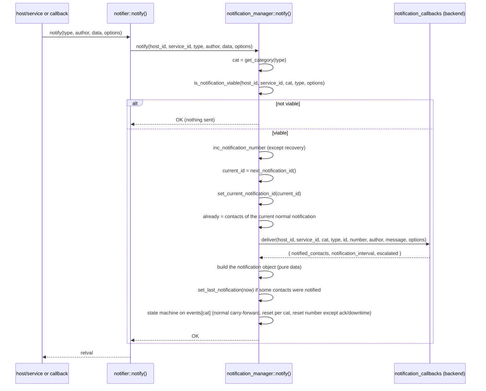

The state machine is unchanged from the legacy version (a RECOVERY clears
`cat_normal` and `cat_recovery`, etc.) — only its **storage location** changed:
the manager's `(host_id, service_id) → notification_state` map instead of the
`notifier`'s member array.

### Viability: a state snapshot, then a pure function

Viability no longer queries the notifier method by method. The manager fetches
**a snapshot** (`resource_state`) and the **global configuration**
(`global_config`) through the backend, then the decision is a **pure** function
of those values (plus the manager's internal state: current notification,
number).

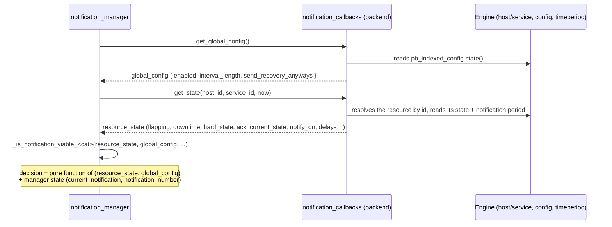

### Delivery: `deliver()`

Contact selection (escalations, groups) and the actual sending (macros, command
execution via `notify_contact`) stay **on the Engine side**, in
`engine_notification_callbacks::deliver()`. The manager provides the identity
and the parameters; the backend returns who was notified and the
escalation-adjusted parameters.

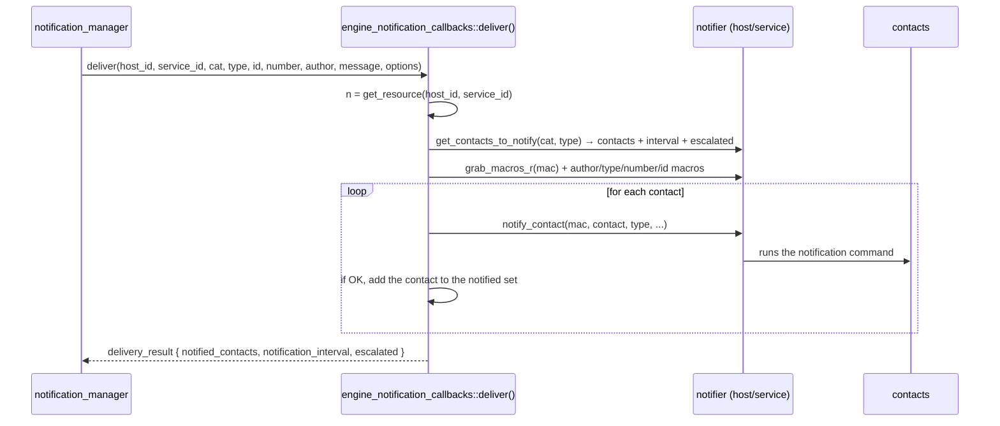

> For **recovery** routing, the selection (`get_contacts_to_notify` →
> `contact::should_be_notified`) consults the previous normal notification
> through the `notifier`'s accessors, which delegate to the manager by id. The
> loop therefore stays correct without the library having to know about the
> contacts.

### Key points

- The notification runtime state (number, ids, timestamps, and the six
  `notification` events) lives in the manager, **indexed by
  `(host_id, service_id)`** — which makes it persistable / centralizable
  (towards Broker) without changing the API.
- `notification_manager`, `notification` and the interface **reference no
  Engine type**; the library logs through `common/log_v2` (categories
  `FUNCTIONS` / `NOTIFICATIONS`).
- The only coupling to Engine is `engine_notification_callbacks` (on the
  `cce_core` side), injected at startup.
- The `notifier` destructor calls `forget(host_id, service_id)`; without it the
  state would leak in the global map.

### Files (code)

- `engine/src/notifications/notification_manager.{hh,cc}` — policy, state,
  `notify()`, viability.
- `engine/src/notifications/notification.{hh,cc}` — the event (pure data).
- `engine/src/notifications/notification_callbacks.hh` — the injected interface.
- `engine/src/notifications/notification_types.hh` — enums + value structs.
- `engine/src/engine_notification_callbacks.{hh,cc}` — Engine implementation
  (id resolution, delivery).
- `engine/src/notifier.cc` — id delegators, `host_id()/service_id()`,
  `~notifier` → `forget`.
