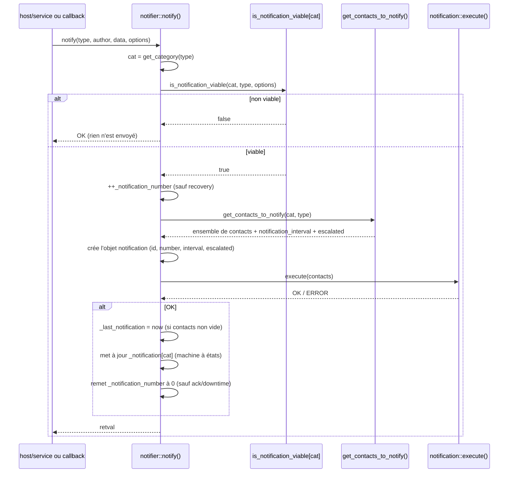
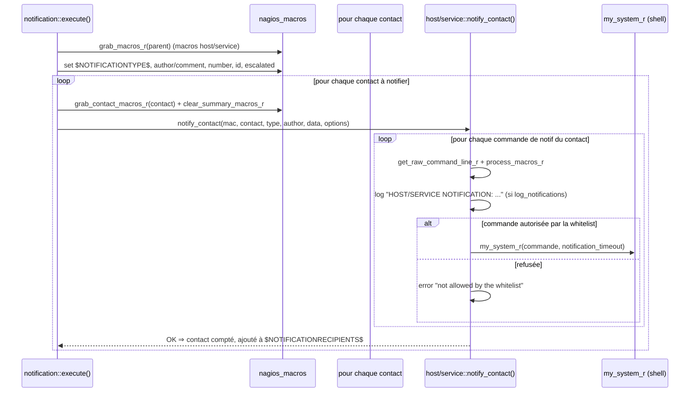
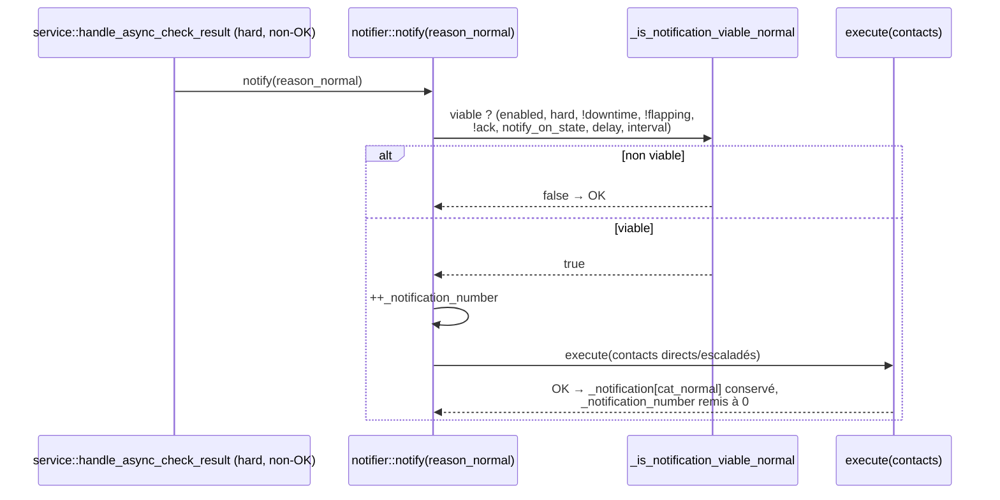
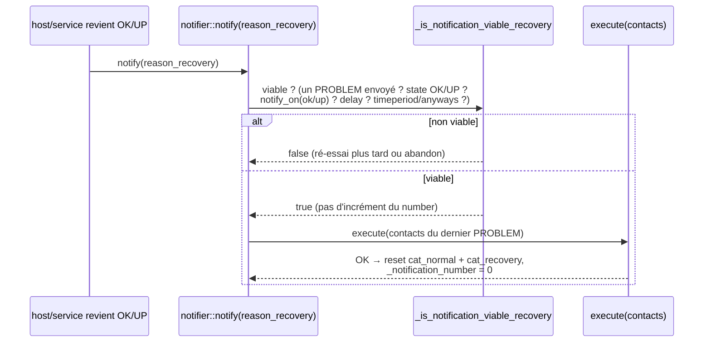
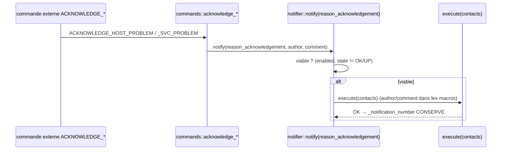
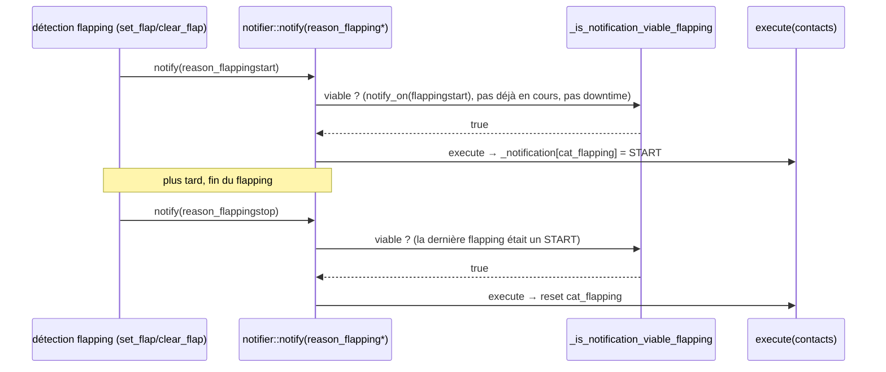
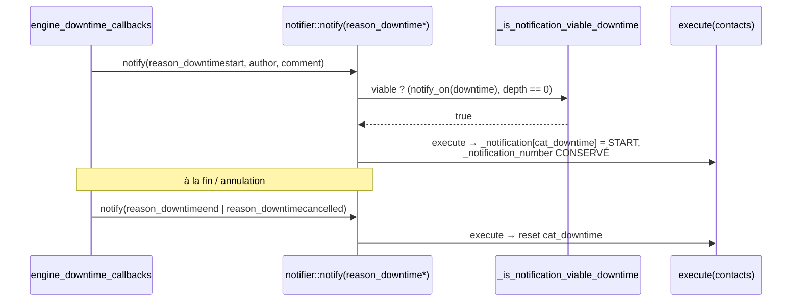
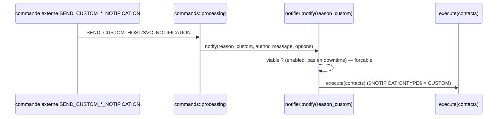

# Moteur — Notifications

Ce document décrit le fonctionnement des notifications côté moteur
(`engine/`), de leur déclenchement jusqu'à l'exécution des commandes de
notification des contacts. Le cœur de la logique est la classe abstraite
`notifier` (`engine/src/notifier.cc`), dont héritent `host` et `service`.

## Sommaire

  - [1. Concepts](#1-concepts)
  - [2. Le pipeline `notify()`](#2-le-pipeline-notify)
  - [3. Choix des contacts (escalations, groupes)](#3-choix-des-contacts-escalations-groupes)
  - [4. Exécution des commandes de notification](#4-exécution-des-commandes-de-notification)
  - [5. Notifications par type](#5-notifications-par-type)
    - [5.1 PROBLEM (normal)](#51-problem-normal)
    - [5.2 RECOVERY](#52-recovery)
    - [5.3 ACKNOWLEDGEMENT](#53-acknowledgement)
    - [5.4 FLAPPING](#54-flapping)
    - [5.5 DOWNTIME](#55-downtime)
    - [5.6 CUSTOM](#56-custom)
  - [6. Paramètres de configuration](#6-paramètres-de-configuration)

## 1. Concepts

Une notification est caractérisée par un **type** (`notifier::reason_type`) qui
est regroupé en **catégorie** (`notifier::notification_category`) :

| `reason_type`                 | Catégorie (`notification_category`) | Macro `$NOTIFICATIONTYPE$` |
|-------------------------------|-------------------------------------|----------------------------|
| `reason_normal`               | `cat_normal`                        | `PROBLEM`                  |
| `reason_recovery`             | `cat_recovery`                      | `RECOVERY`                 |
| `reason_acknowledgement`      | `cat_acknowledgement`               | `ACKNOWLEDGEMENT`          |
| `reason_flappingstart`        | `cat_flapping`                      | `FLAPPINGSTART`            |
| `reason_flappingstop`         | `cat_flapping`                      | `FLAPPINGSTOP`             |
| `reason_flappingdisabled`     | `cat_flapping`                      | `FLAPPINGDISABLED`         |
| `reason_downtimestart`        | `cat_downtime`                      | `DOWNTIMESTART`            |
| `reason_downtimeend`          | `cat_downtime`                      | `DOWNTIMEEND`              |
| `reason_downtimecancelled`    | `cat_downtime`                      | `DOWNTIMECANCELLED`        |
| `reason_custom` (= 99)        | `cat_custom`                        | `CUSTOM`                   |

La correspondance type → catégorie est faite par `notifier::get_category()`.

Chaque _notifier_ mémorise la **dernière notification de chaque catégorie** dans
le tableau `_notification[cat]` (un `std::unique_ptr<notification>` par
catégorie). Ce tableau forme une petite machine à états :

- `_notification_number` : numéro de la notification de problème en cours
  (incrémenté à chaque notification sauf `recovery`, remis à zéro après recovery /
  flapping-stop, conservé pour acknowledgement et downtime).
- `_notification[cat_normal]` présent ⇒ un PROBLEM a déjà été envoyé (condition
  nécessaire pour qu'un RECOVERY parte).
- `_last_notification` / `_next_notification` : horodatages utilisés pour la
  re-notification périodique (`notification_interval`).

## 2. Le pipeline `notify()`

Tout passe par `notifier::notify(type, author, data, options)`. Les états
`host`/`service` et les callbacks (downtime, commandes externes) ne font que
l'appeler avec le bon `reason_type`.

Points clés :

- Si la notification **n'est pas viable**, `notify()` retourne `OK` sans rien
  envoyer (ce n'est pas une erreur).
- Le compteur `_notification_number` est incrémenté **avant** l'envoi pour tous
  les types sauf `recovery`.
- La mise à jour de `_notification[cat]` dépend de la catégorie : un RECOVERY
  efface `cat_normal` et `cat_recovery` ; un FLAPPINGSTOP/DISABLED efface
  `cat_flapping` ; un DOWNTIMEEND/CANCELLED efface `cat_downtime`. Pour
  acknowledgement et downtime, `_notification_number` est **conservé** (sinon le
  recovery suivant ne partirait pas).

## 3. Choix des contacts (escalations, groupes)

`notifier::get_contacts_to_notify()` construit l'ensemble des contacts :

1. **Escalations d'abord** : pour chaque escalation `is_viable(state, number)`,
   ses contacts/contactgroups sont ajoutés. Si au moins une escalation est
   viable, on est en mode **escaladé** (`escalated = true`) et l'intervalle de
   notification retenu est le **plus petit** parmi les escalations viables.
2. **Sinon** (aucune escalation viable) : on prend les contacts directs du
   notifier **et** les contacts de ses contactgroups.

Dans tous les cas, chaque contact n'est retenu que si
`contact::should_be_notified(cat, type, *this)` est vrai (filtre par contact :
options de notification du contact, timeperiod du contact, type accepté, etc.).
L'ensemble retourné est un `std::unordered_set` (un contact présent dans
plusieurs groupes n'est notifié qu'une fois).

## 4. Exécution des commandes de notification

`notification::execute(contacts)` (`engine/src/notification.cc`) :

- Les commandes exécutées sont celles du **contact** :
  `get_host_notification_commands()` ou `get_service_notification_commands()`.
- Chaque commande est filtrée par la **whitelist** (`command_is_allowed_by_whitelist(..., NOTIF_TYPE)`)
  avant exécution par `my_system_r`, avec le timeout `notification_timeout`.
- Si `log_notifications` est activé, une ligne `HOST NOTIFICATION:` /
  `SERVICE NOTIFICATION:` est journalisée par contact et par commande.
- `notify_contact` met à jour `last_host_notification` /
  `last_service_notification` du contact.

## 5. Notifications par type

Chaque catégorie a sa propre fonction de viabilité, sélectionnée via le tableau
`_is_notification_viable[cat]`. Le drapeau `notification_option_forced` (par
exemple une notification forcée par commande externe) **court-circuite** la
plupart des vérifications.

### 5.1 PROBLEM (normal)

Déclenché quand un host/service passe en état **hard** non-OK
(`host::handle_*`, `service::handle_*` → `notify(reason_normal, …)`).

Viabilité (`_is_notification_viable_normal`) — toutes ces conditions doivent
être vraies (sauf si forcée) :

- notifications globales activées (`enable_notifications`) et activées pour le
  notifier (`get_notifications_enabled()`) ;
- notifier **pas** en downtime ; **dans** la timeperiod de notification ;
  **pas** en flapping ;
- état **hard** (un service `volatile` est notifié même hors hard) ;
- problème **non acquitté** ; état courant **différent d'OK/UP** ;
- `notify_on_current_state()` (le notifier est configuré pour notifier cet état ;
  pour un service, son host ne doit pas être down) ;
- délai de première notification écoulé (`first_notification_delay`) ;
- autorisé par les dépendances (`authorized_by_dependencies(notification)`) ;
- si un PROBLEM a déjà été envoyé : respect de l'intervalle de ré-notification
  (`notification_interval` ; `0` ⇒ pas de ré-notification).

### 5.2 RECOVERY

Déclenché quand le notifier revient en **OK/UP** (`notify(reason_recovery, …)`).

Viabilité (`_is_notification_viable_recovery`) :

- notifications activées (globalement et pour le notifier) ;
- dans la timeperiod **sauf si** `send_recovery_notifications_anyways` est activé ;
- pas en downtime ; pas en flapping ; état **hard** ; état **OK/UP** ;
- configuré pour notifier le recovery (`notify_on(up)` / `notify_on(ok)`) ;
- délai `recovery_notification_delay` écoulé ;
- `_notification_number > 0` **et** `_notification[cat_normal]` présent : un
  PROBLEM doit avoir été envoyé auparavant.

La distinction `send_later` détermine si l'on réessaiera plus tard (hors
timeperiod, downtime, flapping, soft…) ou si l'on abandonne en réinitialisant
`_notification_number` (non configuré pour le recovery). Un recovery efface
`cat_normal` et `cat_recovery` et remet `_notification_number` à 0.

> Note : chaque ré-notification PROBLEM **accumule** les contacts de la
> notification normale précédente (`notif->add_contacts(...)` dans `notify()`),
> de sorte que `_notification[cat_normal]` conserve l'ensemble cumulé des
> personnes déjà prévenues. La viabilité du RECOVERY exige justement que cette
> notification normale mémorisée existe.

### 5.3 ACKNOWLEDGEMENT

Déclenché par la commande externe d'acquittement
(`commands.cc` `acknowledge_host`/`acknowledge_service` →
`notify(reason_acknowledgement, author, comment, …)`).

Viabilité (`_is_notification_viable_acknowledgement`) — minimale :

- forcée ⇒ envoyée ;
- notifications activées (globalement et pour le notifier) ;
- l'objet doit être **en problème** (état ≠ OK/UP).

`_notification_number` est **conservé** (l'acquittement ne doit pas empêcher le
recovery ultérieur).

### 5.4 FLAPPING

Déclenché par la détection de flapping (`host::set_flap`/`clear_flap`,
`service::set_flap`/`clear_flap`) :
`reason_flappingstart`, `reason_flappingstop`, et `reason_flappingdisabled`
(quand la détection de flapping est désactivée alors que l'objet flappe).

Viabilité (`_is_notification_viable_flapping`) :

- forcée ⇒ envoyée ; notifications activées ;
- configuré pour ce type (`notify_on(flappingstart/stop/disabled)`) ;
- **pas de START** si une notification flapping est déjà en cours ;
- **STOP/DISABLED** uniquement si la dernière notification flapping était un
  START ;
- pas deux fois la même (même `reason`) ;
- pas pendant un downtime planifié.

### 5.5 DOWNTIME

Déclenché par les callbacks de downtime
(`engine/src/engine_downtime_callbacks.cc`) :
`reason_downtimestart` (début), `reason_downtimeend` (fin normale),
`reason_downtimecancelled` (annulation).

Viabilité (`_is_notification_viable_downtime`) :

- forcée ⇒ envoyée ; notifications activées (globalement et pour le notifier) ;
- configuré pour le downtime (`notify_on(downtime)`) ;
- **pas** déjà dans un downtime planifié (`get_scheduled_downtime_depth() == 0`).

Comme l'acquittement, le downtime **conserve** `_notification_number`. Un
DOWNTIMEEND/CANCELLED efface `_notification[cat_downtime]`.

### 5.6 CUSTOM

Déclenché par la commande externe de notification personnalisée
(`engine/src/commands/processing.cc` → `notify(reason_custom, author, data, …)`).

Viabilité (`_is_notification_viable_custom`) :

- forcée ⇒ envoyée ; notifications activées (globalement et pour le notifier) ;
- pas pendant un downtime planifié.

Une notification CUSTOM ne touche pas la machine à états des problèmes : c'est un
envoi ponctuel vers les contacts, avec l'auteur et le message fournis.

## 6. Paramètres de configuration

Paramètres influençant la viabilité et le rythme des notifications :

- **Globaux** (`pb_indexed_config.state()`) : `enable_notifications`,
  `interval_length`, `notification_timeout`, `log_notifications`,
  `send_recovery_notifications_anyways`.
- **Par notifier** : `notifications_enabled`, `notification_period`,
  `notification_interval`, `first_notification_delay`,
  `recovery_notification_delay`, `notify_on` (masque
  `up/down/unreachable/ok/warning/critical/unknown/flapping*/downtime`),
  `is_volatile`.
- **Par contact** : options de notification (host/service), timeperiod du
  contact, commandes de notification host/service — tout cela évalué dans
  `contact::should_be_notified()` puis `notify_contact()`.
- **Escalations** : intervalle propre, plage `first_notification`/
  `last_notification`, contactgroups — évaluées par `escalation::is_viable()`.

## 7. Pour aller plus loin (code)

- `engine/src/notifier.cc` — `notify()`, `get_category()`,
  `get_contacts_to_notify()`, `is_notification_viable()` et les six
  `_is_notification_viable_*`.
- `engine/src/notification.cc` — `notification::execute()` (macros, itération
  contacts).
- `engine/src/host.cc` / `engine/src/service.cc` — `notify_contact()`
  (exécution des commandes, whitelist, logs) et les déclencheurs PROBLEM /
  RECOVERY / FLAPPING.
- `engine/src/engine_downtime_callbacks.cc` — déclencheurs DOWNTIME.
- `engine/src/commands/commands.cc` — déclencheur ACKNOWLEDGEMENT.
- `engine/src/commands/processing.cc` — déclencheur CUSTOM.
