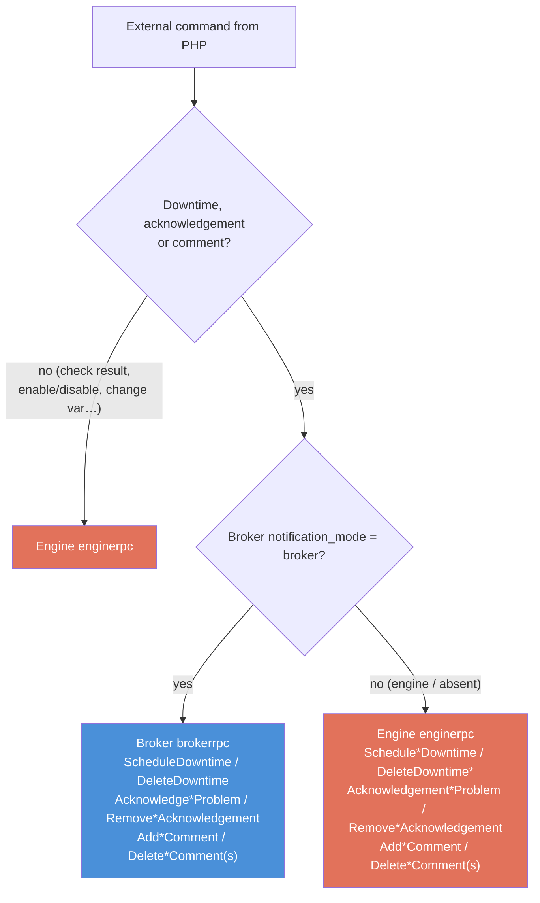

# PHP evolutions

<!-- TOC -->
* [PHP evolutions](#php-evolutions)
* [Introduction](#introduction)
* [Evolution 1 — New Broker/Engine configuration parameters](#evolution-1--new-brokerengine-configuration-parameters)
  * [Broker parameters](#broker-parameters)
    * [`cache_config_directory`](#cache_config_directory)
    * [`pollers_config_directory`](#pollers_config_directory)
    * [`notification_mode`](#notification_mode)
    * [`bbdo_version`](#bbdo_version)
    * [`grpc` (rpc\_port / listen\_address)](#grpc-rpc_port--listen_address)
  * [Engine parameters](#engine-parameters)
    * [`broker_module_cfg_file`](#broker_module_cfg_file)
    * [New-generation start (`-p`)](#new-generation-start--p)
    * [`grpc_port` / `rpc_listen_address`](#grpc_port--rpc_listen_address)
  * [Summary of who needs what](#summary-of-who-needs-what)
* [Evolution 2 — External commands over gRPC](#evolution-2--external-commands-over-grpc)
  * [Current situation](#current-situation)
  * [Target: gRPC entry points](#target-grpc-entry-points)
  * [Routing rule: Engine vs Broker](#routing-rule-engine-vs-broker)
  * [Downtime example](#downtime-example)
  * [Command catalogue](#command-catalogue)
  * [Discovery and ports](#discovery-and-ports)
  * [Ordering comments — do not rely on `internal_id`](#ordering-comments--do-not-rely-on-internal_id)
* [Evolution 3 — An explicit configuration batch: `pollers.lck`](#evolution-3--an-explicit-configuration-batch-pollerslck)
  * [The problem](#the-problem)
  * [The target](#the-target)
  * [The rules](#the-rules)
  * [What Broker does with it](#what-broker-does-with-it)
  * [What the announcement disappearing means](#what-the-announcement-disappearing-means)
  * [Backward compatibility](#backward-compatibility)
  * [Accepted limit](#accepted-limit)
<!-- TOC -->

---

# Introduction

This document gathers the changes the **PHP web interface** (and, where relevant,
Gorgone) must make to follow the Engine/Broker evolutions described in
[Negotiation between Engine and Broker](./nego-engine-broker-en.md).

It covers two independent evolutions:

1. **New configuration parameters** that PHP must expose in the Broker and Engine
   configuration forms so that centralized configuration and Broker-side downtime
   management can be enabled.
2. **External commands sent over gRPC** instead of the legacy command file, with a
   routing rule that depends on which component owns the data (Engine or Broker).

The two evolutions are orthogonal — one can be rolled out without the other.

---

# Evolution 1 — New Broker/Engine configuration parameters

These parameters already exist in the C++ code; what is missing is their exposure in
the PHP configuration interfaces so that an administrator can set them.

## Broker parameters

All Broker parameters below live in the Broker JSON configuration file, under the
top-level `centreonBroker` object, exactly like the existing `broker_name`,
`cache_directory`, etc.

### `cache_config_directory`

* **Type:** string (absolute directory path)
* **Where:** top-level key of `centreonBroker`
* **Meaning:** the PHP cache directory — the directory where PHP writes the
  configuration it generates for each poller. It contains one subdirectory per
  poller (named with the poller ID) plus a `<poller_id>.lck` file that PHP
  `touch()`es once the subdirectory is fully written.
* **Effect:** as soon as this directory is set, Broker considers itself in the
  **new generation** (centralized configuration) and starts watching the `.lck`
  files. This is the discriminant that turns on centralized configuration on the
  Broker side.

Example layout PHP must produce:

```
<cache_config_directory>/
├── 1/
│   ├── centengine.cfg
│   ├── services.cfg
│   └── ...
├── 1.lck          ← touched last, after 1/ is complete
├── 2/
│   └── ...
└── 2.lck
```

> **Important:** the `.lck` file must be touched **only after** the poller's
> subdirectory is completely written. Touching it early causes Broker to read a
> half-written configuration and compute a wrong diff.

### `pollers_config_directory`

* **Type:** string (absolute directory path)
* **Where:** top-level key of `centreonBroker`
* **Meaning:** the directory where Broker maintains the serialized Protobuf
  configuration of every poller (`<poller_id>.prot`). Broker owns and writes this
  directory; PHP never writes into it.
* **Effect:** a **central** Broker has this directory set (it owns the `.prot`
  configs). A **relay** (Remote Server) leaves it empty and forwards configuration
  requests upstream. PHP must therefore set it on the central Broker and leave it
  unset on relays.

### `notification_mode`

* **Type:** string — `broker` or `engine`
* **Where:** top-level key of `centreonBroker` (stored in the Broker `params` map)
* **Default:** `engine` (absent ⇒ `engine`)
* **Meaning:** decides who manages downtimes and acknowledgements:
  * `broker` → Broker loads the `downtime_manager` and the acknowledgement
    manager, owns downtimes, **acknowledgements and user comments**, schedules
    BAM inherited
    downtimes in-process and is the sole writer of `scheduled_downtime_depth`,
    `acknowledged` and `acknowledgement_type`. Engine is never told about
    downtimes nor acknowledgements: an acknowledgement command sent to Engine in
    this mode is **lost** for Broker (the flag is overwritten by the next status
    and no row is written to the database).
  * `engine` → Engine manages downtimes and acknowledgements, BAM sends
    `SCHEDULE_SVC_DOWNTIME` to Engine (legacy behaviour).
* **PHP impact:** this value also decides where downtime/acknowledgement external
  commands must be sent (see [Routing rule](#routing-rule-engine-vs-broker)).

### `bbdo_version`

* **Type:** string `"<major>.<minor>.<patch>"`, e.g. `"3.0.0"`
* **Where:** top-level key of `centreonBroker`
* **Constraint:** centralized configuration and Broker-managed downtimes only work
  with **BBDO ≥ 3.0.0**. PHP must guarantee BBDO 3 is selected whenever the
  centralized features are enabled.

### `grpc` (rpc_port / listen_address)

* **Where:** `centreonBroker.grpc` object — `rpc_port` (integer) and
  `listen_address` (string).
* **Meaning:** the address/port of Broker's gRPC server. Needed by Evolution 2 so
  that PHP knows where to send downtime/acknowledgement commands when
  `notification_mode=broker`.

## Engine parameters

### `broker_module_cfg_file`

* **Where:** Engine configuration (`centengine.cfg`), key `broker_module_cfg_file`.
* **Meaning:** path to the Broker module configuration file (e.g.
  `/etc/centreon-broker/central-module.json`). Since `cbmod` became a library, this
  replaces the old `broker_module` declaration line. The same information can be
  passed on the command line with `-b <file>`.
* **PHP impact:** PHP must write this key instead of (or in addition to, during the
  transition) the legacy `broker_module` line. The old format still works but emits
  a deprecation warning in the logs.

### New-generation start (`-p`)

* **Where:** Engine command line / unit file (managed by Gorgone, not the web form).
* **Meaning:**
  * `centengine -p /var/lib/centreon-engine` → **new generation**: Engine retrieves
    its configuration during negotiation with Broker, using
    `/var/lib/centreon-engine` (its `HOME`) as working directory.
  * `centengine /etc/centreon-engine/centengine.cfg` → **legacy**: Engine reads its
    configuration from the `.cfg` file.
* **PHP/Gorgone impact:** the launch arguments Gorgone uses to start Engine must
  switch to `-p` when centralized configuration is enabled. The two modes are not
  incompatible (Engine can read a `.cfg` and still be updated by Broker during the
  transition).

### `grpc_port` / `rpc_listen_address`

* **Where:** Engine configuration (`grpc_port`, `rpc_listen_address`).
* **Meaning:** address/port of Engine's gRPC server (`enginerpc`). Needed by
  Evolution 2 to send external commands to Engine.

## Summary of who needs what

| Capability | Parameter(s) PHP must set | Component | Owner-deciding effect |
|---|---|---|---|
| Centralized Engine configuration | `cache_config_directory` (Broker) + `bbdo_version ≥ 3` (Broker) + start Engine with `-p` | Broker + Engine launch | Set ⇒ **Broker** owns the Engine config |
| Central vs relay | `pollers_config_directory` (Broker) | Broker | Set ⇒ **central**; empty ⇒ **relay** |
| Downtime/ack ownership | `notification_mode` (Broker) | Broker | `broker` ⇒ **Broker** owns downtimes and acks |
| gRPC endpoints (Evolution 2) | `grpc.rpc_port` (Broker), `grpc_port` (Engine) | Both | where external commands are sent |
| Engine ↔ Broker module link | `broker_module_cfg_file` (Engine) | Engine | replaces legacy `broker_module` line |

> These choices are detailed and motivated in the
> [Overview: who handles what](./nego-engine-broker-en.md#overview-who-handles-what-depending-on-configuration)
> section of the negotiation document.

---

# Evolution 2 — External commands over gRPC

## Current situation

External commands (schedule a downtime, acknowledge a problem, add a comment, force
a check…) are currently written by PHP to Engine's **command file** (a named pipe),
one text line per command (`SCHEDULE_SVC_DOWNTIME;...`). This is asynchronous,
unacknowledged and Engine-only: PHP gets no return value and there is no way to send
a command to Broker.

## Target: gRPC entry points

Both Engine and Broker expose a gRPC service. PHP must send external commands as
**gRPC calls** instead of writing the command file:

* **Engine** — `enginerpc` service (`engine/enginerpc/engine.proto`). It already
  exposes the full command set: `ScheduleHostDowntime`, `ScheduleServiceDowntime`,
  `DeleteDowntime`, `AddHostComment`, `AcknowledgementHostProblem`,
  `ProcessServiceCheckResult`, `ScheduleServiceCheck`, etc. Each returns a
  `CommandSuccess`, so PHP gets a synchronous result.
* **Broker** — `brokerrpc` service (`broker/core/brokerrpc/broker.proto`). It
  exposes `ScheduleDowntime` (returning the new `downtime_id`), `DeleteDowntime`,
  and the four acknowledgement RPCs `AcknowledgeHostProblem`,
  `AcknowledgeServiceProblem`, `RemoveHostAcknowledgement`,
  `RemoveServiceAcknowledgement`. These RPCs are **only available when
  `notification_mode = broker`** (gRPC status `UNAVAILABLE` otherwise); failures
  are reported through the gRPC status, there is no `CommandSuccess`.

## Routing rule: Engine vs Broker

The destination of a command depends on **who owns the underlying data**, which is
driven by `notification_mode`:



* **Downtimes, acknowledgements and comments** follow `notification_mode`:
  * `notification_mode = broker` → call **Broker**'s `ScheduleDowntime` /
    `DeleteDowntime`, `AcknowledgeHostProblem` / `AcknowledgeServiceProblem` /
    `RemoveHostAcknowledgement` / `RemoveServiceAcknowledgement` and
    `AddHostComment` / `AddServiceComment` / `DeleteComment` /
    `DeleteAllHostComments` / `DeleteAllServiceComments`. Engine's acknowledgement
    and comment RPCs must **no longer** be called in this mode.
  * otherwise → call **Engine**'s downtime, acknowledgement and comment RPCs
    (legacy).
* **All other commands** (check results, notification toggles, object variable
  changes, forced checks…) always go to **Engine**.

## Downtime example

When `notification_mode = broker`, scheduling a downtime is a `ScheduleDowntime`
gRPC call on Broker with the following request:

```protobuf
message ScheduleDowntimeRequest {
  enum DowntimeType { HOST = 0; SERVICE = 1; }
  DowntimeType type = 1;
  oneof host    { string host_name = 2;          uint64 host_id = 3; }
  oneof service { string service_description = 4; uint64 service_id = 5; }
  int64  entry_time   = 6;
  string author       = 7;
  string comment_data = 8;
  int64  start_time   = 9;
  int64  end_time     = 10;
  bool   fixed        = 11;
  uint64 triggered_by = 12;
  uint32 duration     = 13;
}

message ScheduleDowntimeResponse {
  uint64 downtime_id = 1;   // PHP keeps this id to cancel the downtime later
}
```

Broker resolves the host/service against its centralized cache, schedules the
downtime in its `downtime_manager`, and returns the generated `downtime_id`.
Cancellation uses `DeleteDowntime(DowntimeIdentifier { downtime_id })`.

For the same operation in legacy mode (`notification_mode = engine`), PHP keeps
calling Engine's `ScheduleHostDowntime` / `ScheduleServiceDowntime` /
`ScheduleAndPropagateHostDowntime` / etc.

## Acknowledgement example

When `notification_mode = broker`, acknowledging a problem is an
`AcknowledgeHostProblem` or `AcknowledgeServiceProblem` gRPC call on Broker. The
request copies Engine's `EngineAcknowledgement` **field for field**: PHP switches
the target and the RPC name, not the payload.

```protobuf
message AcknowledgementRequest {
  string host_name    = 1;
  string service_desc = 2;   // empty for a host acknowledgement
  string ack_author   = 3;
  string ack_data     = 4;
  enum Type { NORMAL = 0; STICKY = 1; }
  Type   type         = 5;   // NORMAL: cleared on any state change; STICKY: cleared on return to UP/OK
  bool   notify       = 6;   // send the acknowledgement notification
  bool   persistent   = 7;   // keep the comment once the acknowledgement is cleared
}

rpc AcknowledgeHostProblem(AcknowledgementRequest) returns (google.protobuf.Empty) {}
rpc AcknowledgeServiceProblem(AcknowledgementRequest) returns (google.protobuf.Empty) {}
```

Broker resolves the resource against its cache, refuses with `FAILED_PRECONDITION`
when it is UP/OK (like Engine: "cannot acknowledge a non-existent problem"), then
writes the `acknowledgements` row, the comment, the `acknowledged` flags of
`hosts`/`services`/`resources`, the `logs` entry, and triggers the acknowledgement
notification when asked. Automatic clearing (recovery, state change of a non-sticky
ack) is done by Broker, without any PHP action.

Explicit removal uses `RemoveHostAcknowledgement(HostIdentifier)` and
`RemoveServiceAcknowledgement(ServiceIdentifier)`:

```protobuf
message HostIdentifier    { oneof host { string host_name = 1; uint64 host_id = 2; } }
message ServiceIdentifier {
  oneof host    { string host_name = 1;   uint64 host_id = 2; }
  oneof service { string description = 3; uint64 service_id = 4; }
}
```

In legacy mode (`notification_mode = engine`), PHP keeps calling Engine's
`AcknowledgementHostProblem` / `AcknowledgementServiceProblem` /
`RemoveHostAcknowledgement` / `RemoveServiceAcknowledgement`.

## Command catalogue

| Command family | Engine (`enginerpc`) | Broker (`brokerrpc`) |
|---|---|---|
| Schedule downtime | `ScheduleHostDowntime`, `ScheduleServiceDowntime`, `ScheduleHostServicesDowntime`, `ScheduleHostGroupHostsDowntime`, `ScheduleHostGroupServicesDowntime`, `ScheduleServiceGroupHostsDowntime`, `ScheduleServiceGroupServicesDowntime`, `ScheduleAndPropagateHostDowntime`, `ScheduleAndPropagateTriggeredHostDowntime` | `ScheduleDowntime` |
| Delete downtime | `DeleteDowntime`, `DeleteHostDowntimeFull`, `DeleteServiceDowntimeFull`, `DeleteDowntimeByHostName`, `DeleteDowntimeByHostGroupName`, `DeleteDowntimeByStartTimeComment` | `DeleteDowntime` |
| Acknowledgements | `AcknowledgementHostProblem`, `AcknowledgementServiceProblem`, `RemoveHostAcknowledgement`, `RemoveServiceAcknowledgement` | `AcknowledgeHostProblem`, `AcknowledgeServiceProblem`, `RemoveHostAcknowledgement`, `RemoveServiceAcknowledgement` (when `notification_mode = broker`) |
| Comments | `AddHostComment`, `AddServiceComment`, `DeleteComment`, `DeleteAllHostComments`, `DeleteAllServiceComments` | same names on Broker (`HostCommentRequest` / `ServiceCommentRequest` / `CommentIdentifier`), when `notification_mode = broker` |
| Checks | `ProcessHostCheckResult`, `ProcessServiceCheckResult`, `ScheduleHostCheck`, `ScheduleServiceCheck`, `ScheduleHostServiceCheck` | — |
| Notifications / toggles | `EnableHostNotifications`, `DisableHostNotifications`, `EnableServiceNotifications`, … | — |
| Object variable changes | `ChangeHostObjectIntVar`, `ChangeServiceObjectCustomVar`, … | — |

> The list of which downtime/acknowledgement families will progressively move to
> Broker is tracked under
> [Moving external command sending to Broker](./nego-engine-broker-en.md#moving-external-command-sending-to-broker).
> Today `ScheduleDowntime` / `DeleteDowntime` and the four acknowledgement RPCs exist
> on the Broker side: `AcknowledgeHostProblem`, `AcknowledgeServiceProblem`
> (`AcknowledgementRequest`, same fields as `EngineAcknowledgement`),
> `RemoveHostAcknowledgement` (`HostIdentifier`) and `RemoveServiceAcknowledgement`
> (Broker's `ServiceIdentifier`). The other families remain on Engine even when
> `notification_mode = broker`.

## Discovery and ports

* Engine's gRPC server is configured by `grpc_port` / `rpc_listen_address` in the
  Engine configuration.
* Broker's gRPC server is configured by `centreonBroker.grpc.rpc_port` /
  `listen_address` in the Broker configuration.

PHP must read these values from the configuration it generates to know which
endpoint to call, and must apply the [routing rule](#routing-rule-engine-vs-broker)
based on `notification_mode`.

## Ordering comments — do not rely on `internal_id`

When `notification_mode = broker`, the comment attached to a downtime is created by
**Broker**, not Engine. To avoid clashing with the per-poller `internal_id` sequence
Engine generates (it starts at 1 and resets on reload), Broker-originated comments
use a **disjoint high range** of `internal_id`, starting at `INT32_MAX/2`
(`1 073 741 823`). See
[Comments for Broker-managed downtimes](./downtimes-integration-en.md#comments-for-broker-managed-downtimes).

**Consequence for PHP:** the comment list must **not** be ordered or sorted by
`internal_id`. `internal_id` has never been a global chronological sequence — it is
only an idempotency / deletion key, scoped to
`(entry_time, host_id, service_id, instance_id)` — and with Broker-originated
comments its values are deliberately discontinuous. Order comments by `entry_time`
(or by the `comment_id` primary key) instead.

> If the current UI/API happens to order comments by `internal_id`, it must be fixed
> **before** enabling `notification_mode = broker`: otherwise every Broker downtime
> comment would sort after all Engine comments regardless of its real creation time.

# Evolution 3 — An explicit configuration batch: `pollers.lck`

## The problem

The current contract asks PHP to touch `<poller_id>.lck` **once that poller's
subdirectory is entirely written**. PHP therefore works poller by poller: it
writes `1/`, touches `1.lck`, writes `2/`, touches `2.lck`. The interval between
two `.lck` files is not the time it takes to write an empty file — it is the time
to **fully generate** the next poller's configuration: SQL queries, template
rendering, several megabytes of `.cfg` written. On a poller with 50,000 services,
that is measured in seconds.

Broker coalesces pushes that arrive close together and handles them as one batch,
but that coalescing rests on a delay (500 ms by default): it cannot guess that a
second configuration is still being generated. Past the delay, an export covering
several pollers becomes **several batches**.

This is not only about cost. An object **moved from one poller to another** — a
common case: rebalancing a host — is only correct if both configurations are in
the same batch. The global diff then reconciles the removal and the addition into
a plain modification (`indexed_diff_state`), and the host changes poller without
ever being disabled. In two batches that reconciliation does not happen:
depending on the order of arrival, the host can end up **disabled in the database
while a poller is still monitoring it**.

## The target

A single file, `pollers.lck`, takes the place of the individual `.lck` files on
the PHP side and **lists the pollers of the batch**:

```
<cache_config_directory>/
├── 1/
│   ├── centengine.cfg
│   └── ...
├── 2/
│   └── ...
└── pollers.lck      ← touched last, holds "1" and "2"
```

Contents: one poller id per line, nothing else.

```
1
2
```

Broker no longer has anything to guess: it knows exactly which pollers make up
the batch, waits until it has them all, and makes a single pass over them — one
read of the stored configurations, one global diff, no transient state in the
database. How long PHP takes to generate no longer matters.

## The rules

1. **`pollers.lck` is touched last**, after *all* the batch's subdirectories are
   complete. Same rule as today, moved from the poller to the batch.
2. **Two ways of writing it, whichever suits.** Writing straight into it --
   open, write the ids, close -- is fine: Broker waits for the file to be
   **closed** (`IN_CLOSE_WRITE`), so it never reads it half-written. Going
   through a temporary file in the same directory and a `rename()` is equally
   fine, Broker listening for an arrival by rename too (`IN_MOVED_TO`).

   What must not be done is leaving the file open after writing to it: nothing
   is reported until it is closed, and the batch would wait for the next scan.
3. **One batch at a time.** PHP must not write a new `pollers.lck` while the
   previous one is still there: its disappearance is Broker's acknowledgement. A
   further batch produced while one is being handled has to wait.
4. **A batch only names pollers whose directory has been written.** Naming a
   poller without having written its directory makes the validation of its
   configuration fail.

## What Broker does with it

Today the `.lck` carries two distinct pieces of information: "here is a new
configuration" and "this configuration is still waiting to be delivered to its
poller" — which is why Broker keeps it while the poller is not connected. With
`pollers.lck`, only the first stays PHP's concern. Tracking the delivery becomes
internal to Broker, in the directory it owns (`pollers_config_directory`), and
`pollers.lck` is consumed as soon as it is read.

That makes the contract cleaner: PHP announces, Broker keeps track. PHP no longer
has to wonder why a `.lck` it touched is still there.

## What the announcement disappearing means

Historically, a `<poller_id>.lck` disappeared once the configuration had **reached
its poller**. That is no longer the case: both shapes disappear once **Broker has
read the announcement and prepared the configurations** it named.

The distinction matters to PHP:

* what it can conclude from the disappearance is "Broker has taken the configuration
  over, I may push the next one" -- which is precisely what it needs, and rule 3
  above;
* what it **cannot** conclude is that the poller received it. A stopped poller cannot
  acknowledge anything, and waiting for it would block an otherwise correct export
  indefinitely. Broker keeps the configuration and delivers it when the poller
  connects, with no further action from PHP.

An export aimed at a stopped poller is therefore a success as far as PHP is
concerned. This has always been the behaviour of `pollers.lck`, now shared by both
shapes.

## Backward compatibility

Broker reads **both shapes, for good**:

* if `pollers.lck` is present, it prevails and defines the batch;
* otherwise the individual `<poller_id>.lck` files are handled as they are today,
  with the delay-based coalescing.

Reading the individual `.lck` files is not a migration bridge to be removed
later: it stays supported. A PHP older than this evolution, a platform upgraded
in stages, or a third-party tool pushing a configuration therefore keep working
untouched, with the limits described above — coalescing goes back to being a
matter of delay, and an object moved across two batches stays exposed.

A PHP that adopts `pollers.lck`, on the other hand, **stops writing** the
`<poller_id>.lck` files: both signals must not be emitted for one export, or the
same batch would be announced twice.

## Accepted limit

`pollers.lck` guarantees that one **export** is one batch, which covers moving an
object between pollers as long as it is exported in one go — the normal case.

It can do nothing for a move split across **two successive exports**: a user
exporting the source poller first, then the target poller in a second export.
`Broker` then sees two batches with nothing tying them together, and has no way
of knowing that the removal on one side and the addition on the other are the
same move.

**That case is accepted**, as a usage mistake: a move is done in one export. The
symptom, should it happen, is an object **disabled in the database while a poller
is still monitoring it** — the removal asked for by the source poller applies
whichever poller now monitors the object. The remedy is to re-export both pollers
together.
