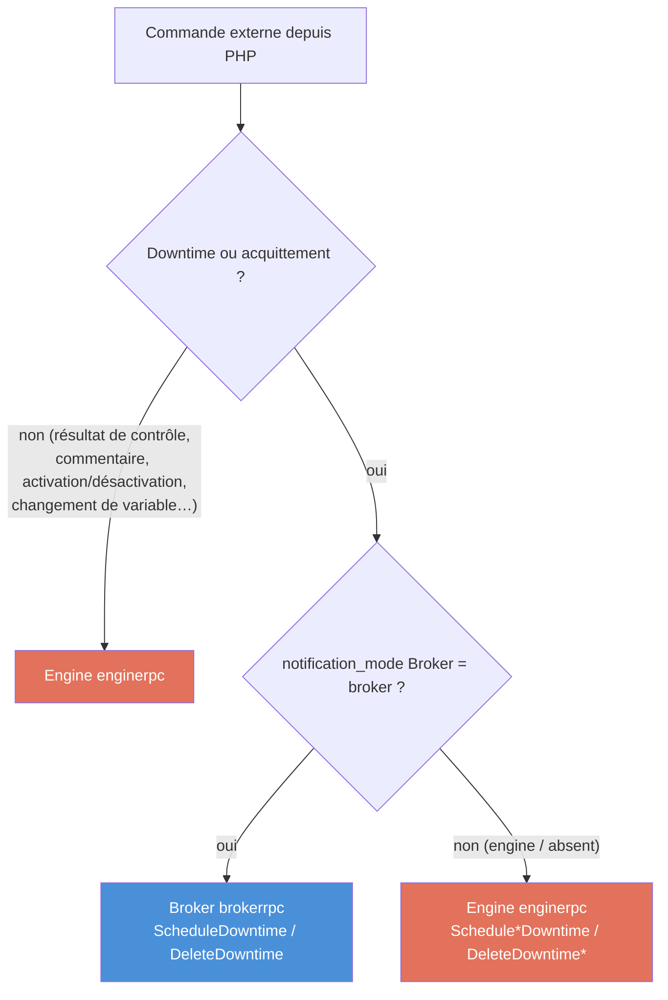

# Évolutions PHP

<!-- TOC -->
* [Évolutions PHP](#évolutions-php)
* [Introduction](#introduction)
* [Évolution 1 — Nouveaux paramètres de configuration Broker/Engine](#évolution-1--nouveaux-paramètres-de-configuration-brokerengine)
  * [Paramètres Broker](#paramètres-broker)
    * [`cache_config_directory`](#cache_config_directory)
    * [`pollers_config_directory`](#pollers_config_directory)
    * [`notification_mode`](#notification_mode)
    * [`bbdo_version`](#bbdo_version)
    * [`grpc` (rpc\_port / listen\_address)](#grpc-rpc_port--listen_address)
  * [Paramètres Engine](#paramètres-engine)
    * [`broker_module_cfg_file`](#broker_module_cfg_file)
    * [Démarrage nouvelle génération (`-p`)](#démarrage-nouvelle-génération--p)
    * [`grpc_port` / `rpc_listen_address`](#grpc_port--rpc_listen_address)
  * [Récapitulatif de qui a besoin de quoi](#récapitulatif-de-qui-a-besoin-de-quoi)
* [Évolution 2 — Commandes externes via gRPC](#évolution-2--commandes-externes-via-grpc)
  * [Situation actuelle](#situation-actuelle)
  * [Cible : des points d'entrée gRPC](#cible--des-points-dentrée-grpc)
  * [Règle de routage : Engine ou Broker](#règle-de-routage--engine-ou-broker)
  * [Exemple des downtimes](#exemple-des-downtimes)
  * [Catalogue des commandes](#catalogue-des-commandes)
  * [Découverte et ports](#découverte-et-ports)
  * [Tri des commentaires — ne pas se fier à l'`internal_id`](#tri-des-commentaires--ne-pas-se-fier-à-linternal_id)
* [Évolution 3 — Un lot de configuration explicite : `pollers.lck`](#évolution-3--un-lot-de-configuration-explicite--pollerslck)
  * [Le problème](#le-problème)
  * [La cible](#la-cible)
  * [Les règles](#les-règles)
  * [Ce que Broker en fait](#ce-que-broker-en-fait)
  * [Rétrocompatibilité](#rétrocompatibilité)
  * [Limite assumée](#limite-assumée)
<!-- TOC -->

---

# Introduction

Ce document rassemble les changements que l'**interface web PHP** (et, le cas
échéant, Gorgone) doit apporter pour suivre les évolutions Engine/Broker décrites
dans [Négociation entre Engine et Broker](./nego-engine-broker-fr.md).

Il couvre deux évolutions indépendantes :

1. **De nouveaux paramètres de configuration** que PHP doit exposer dans les
   formulaires de configuration de Broker et d'Engine afin de pouvoir activer la
   configuration centralisée et la gestion des downtimes côté Broker.
2. **Des commandes externes envoyées via gRPC** à la place de l'ancien fichier de
   commandes, avec une règle de routage qui dépend de quel composant possède la
   donnée (Engine ou Broker).

Les deux évolutions sont orthogonales — on peut déployer l'une sans l'autre.

---

# Évolution 1 — Nouveaux paramètres de configuration Broker/Engine

Ces paramètres existent déjà dans le code C++ ; ce qui manque, c'est leur exposition
dans les interfaces de configuration PHP afin qu'un administrateur puisse les
renseigner.

## Paramètres Broker

Tous les paramètres Broker ci-dessous se trouvent dans le fichier de configuration
JSON de Broker, sous l'objet de premier niveau `centreonBroker`, exactement comme
les `broker_name`, `cache_directory`, etc. déjà existants.

### `cache_config_directory`

* **Type :** chaîne (chemin de répertoire absolu)
* **Emplacement :** clé de premier niveau de `centreonBroker`
* **Signification :** le répertoire de cache PHP — le répertoire où PHP écrit la
  configuration qu'il génère pour chaque poller. Il contient un sous-répertoire par
  poller (nommé avec l'ID du poller) ainsi qu'un fichier `<poller_id>.lck` que PHP
  `touch()` une fois le sous-répertoire entièrement écrit.
* **Effet :** dès que ce répertoire est renseigné, Broker se considère en
  **nouvelle génération** (configuration centralisée) et commence à surveiller les
  fichiers `.lck`. C'est le discriminant qui active la configuration centralisée du
  côté Broker.

Arborescence que PHP doit produire :

```
<cache_config_directory>/
├── 1/
│   ├── centengine.cfg
│   ├── services.cfg
│   └── ...
├── 1.lck          ← touché en dernier, après que 1/ soit complet
├── 2/
│   └── ...
└── 2.lck
```

> **Important :** le fichier `.lck` ne doit être touché **qu'après** l'écriture
> complète du sous-répertoire du poller. Le toucher trop tôt amène Broker à lire une
> configuration à moitié écrite et à calculer un diff erroné.

### `pollers_config_directory`

* **Type :** chaîne (chemin de répertoire absolu)
* **Emplacement :** clé de premier niveau de `centreonBroker`
* **Signification :** le répertoire où Broker maintient la configuration Protobuf
  sérialisée de chaque poller (`<poller_id>.prot`). Broker possède et écrit ce
  répertoire ; PHP n'y écrit jamais.
* **Effet :** un Broker **central** a ce répertoire renseigné (il possède les
  configurations `.prot`). Un **relais** (Remote Server) le laisse vide et fait
  remonter les demandes de configuration en amont. PHP doit donc le renseigner sur
  le Broker central et le laisser vide sur les relais.

### `notification_mode`

* **Type :** chaîne — `broker` ou `engine`
* **Emplacement :** clé de premier niveau de `centreonBroker` (stockée dans la map
  `params` de Broker)
* **Défaut :** `engine` (absent ⇒ `engine`)
* **Signification :** détermine qui gère les downtimes et les acquittements :
  * `broker` → Broker charge le `downtime_manager`, possède les downtimes,
    planifie en interne les downtimes hérités de BAM et est le seul à écrire
    `scheduled_downtime_depth`.
  * `engine` → Engine gère les downtimes, BAM envoie `SCHEDULE_SVC_DOWNTIME` à
    Engine (comportement historique).
* **Impact PHP :** cette valeur détermine aussi où les commandes externes de
  downtime/acquittement doivent être envoyées (voir
  [Règle de routage](#règle-de-routage--engine-ou-broker)).

### `bbdo_version`

* **Type :** chaîne `"<major>.<minor>.<patch>"`, p. ex. `"3.0.0"`
* **Emplacement :** clé de premier niveau de `centreonBroker`
* **Contrainte :** la configuration centralisée et les downtimes gérés par Broker ne
  fonctionnent qu'avec **BBDO ≥ 3.0.0**. PHP doit garantir que BBDO 3 est
  sélectionné dès que les fonctionnalités centralisées sont activées.

### `grpc` (rpc_port / listen_address)

* **Emplacement :** objet `centreonBroker.grpc` — `rpc_port` (entier) et
  `listen_address` (chaîne).
* **Signification :** l'adresse/le port du serveur gRPC de Broker. Nécessaire pour
  l'Évolution 2 afin que PHP sache où envoyer les commandes de
  downtime/acquittement quand `notification_mode=broker`.

## Paramètres Engine

### `broker_module_cfg_file`

* **Emplacement :** configuration Engine (`centengine.cfg`), clé
  `broker_module_cfg_file`.
* **Signification :** chemin du fichier de configuration du module Broker (p. ex.
  `/etc/centreon-broker/central-module.json`). Depuis que `cbmod` est devenu une
  bibliothèque, cela remplace l'ancienne ligne de déclaration `broker_module`. La
  même information peut être passée en ligne de commande avec `-b <fichier>`.
* **Impact PHP :** PHP doit écrire cette clé au lieu de (ou en plus de, pendant la
  transition) la ligne `broker_module` historique. L'ancien format fonctionne encore
  mais émet un avertissement de dépréciation dans les logs.

### Démarrage nouvelle génération (`-p`)

* **Emplacement :** ligne de commande / unité Engine (gérée par Gorgone, pas par le
  formulaire web).
* **Signification :**
  * `centengine -p /var/lib/centreon-engine` → **nouvelle génération** : Engine
    récupère sa configuration lors de la négociation avec Broker, en utilisant
    `/var/lib/centreon-engine` (son `HOME`) comme répertoire de travail.
  * `centengine /etc/centreon-engine/centengine.cfg` → **historique** : Engine lit
    sa configuration depuis le fichier `.cfg`.
* **Impact PHP/Gorgone :** les arguments de lancement utilisés par Gorgone pour
  démarrer Engine doivent passer à `-p` quand la configuration centralisée est
  activée. Les deux modes ne sont pas incompatibles (Engine peut lire un `.cfg` et
  être tout de même mis à jour par Broker pendant la transition).

### `grpc_port` / `rpc_listen_address`

* **Emplacement :** configuration Engine (`grpc_port`, `rpc_listen_address`).
* **Signification :** adresse/port du serveur gRPC d'Engine (`enginerpc`).
  Nécessaire pour l'Évolution 2 afin d'envoyer les commandes externes à Engine.

## Récapitulatif de qui a besoin de quoi

| Capacité                           | Paramètre(s) que PHP doit renseigner                                                        | Composant                 | Effet déterminant                               |
|------------------------------------|---------------------------------------------------------------------------------------------|---------------------------|-------------------------------------------------|
| Configuration Engine centralisée   | `cache_config_directory` (Broker) + `bbdo_version ≥ 3` (Broker) + démarrer Engine avec `-p` | Broker + lancement Engine | Renseigné ⇒ **Broker** possède la config Engine |
| Central ou relais                  | `pollers_config_directory` (Broker)                                                         | Broker                    | Renseigné ⇒ **central** ; vide ⇒ **relais**     |
| Propriété downtime/acquittement    | `notification_mode` (Broker)                                                                | Broker                    | `broker` ⇒ **Broker** possède les downtimes     |
| Points d'entrée gRPC (Évolution 2) | `grpc.rpc_port` (Broker), `grpc_port` (Engine)                                              | Les deux                  | où sont envoyées les commandes externes         |
| Lien module Engine ↔ Broker        | `broker_module_cfg_file` (Engine)                                                           | Engine                    | remplace l'ancienne ligne `broker_module`       |

> Ces choix sont détaillés et motivés dans la section
> [Vue d'ensemble : qui gère quoi](./nego-engine-broker-fr.md#vue-densemble--qui-gère-quoi-selon-la-configuration)
> du document de négociation.

---

# Évolution 2 — Commandes externes via gRPC

## Situation actuelle

Les commandes externes (planifier un downtime, acquitter un problème, ajouter un
commentaire, forcer un contrôle…) sont aujourd'hui écrites par PHP dans le **fichier
de commandes** d'Engine (un tube nommé), une ligne de texte par commande
(`SCHEDULE_SVC_DOWNTIME;...`). C'est asynchrone, non acquitté et limité à Engine :
PHP n'obtient aucune valeur de retour et il n'y a aucun moyen d'envoyer une commande
à Broker.

## Cible : des points d'entrée gRPC

Engine et Broker exposent chacun un service gRPC. PHP doit envoyer les commandes
externes sous forme d'**appels gRPC** au lieu d'écrire dans le fichier de commandes :

* **Engine** — service `enginerpc` (`engine/enginerpc/engine.proto`). Il expose déjà
  l'ensemble des commandes : `ScheduleHostDowntime`, `ScheduleServiceDowntime`,
  `DeleteDowntime`, `AddHostComment`, `AcknowledgementHostProblem`,
  `ProcessServiceCheckResult`, `ScheduleServiceCheck`, etc. Chacune renvoie un
  `CommandSuccess`, donc PHP obtient un résultat synchrone.
* **Broker** — service `brokerrpc` (`broker/core/brokerrpc/broker.proto`). Il expose
  `ScheduleDowntime` (qui renvoie le nouveau `downtime_id`) et `DeleteDowntime`. Ces
  RPC ne sont **disponibles que lorsque `notification_mode = broker`**.

## Règle de routage : Engine ou Broker

La destination d'une commande dépend de **qui possède la donnée sous-jacente**, ce
qui est piloté par `notification_mode` :



* **Downtimes et acquittements** suivent `notification_mode` :
  * `notification_mode = broker` → appeler le `ScheduleDowntime` / `DeleteDowntime`
    de **Broker**.
  * sinon → appeler les RPC de downtime d'**Engine** (historique).
* **Toutes les autres commandes** (résultats de contrôle, commentaires, bascules de
  notification, changements de variables d'objet, contrôles forcés…) vont toujours
  vers **Engine**.

## Exemple des downtimes

Quand `notification_mode = broker`, planifier un downtime est un appel gRPC
`ScheduleDowntime` sur Broker avec la requête suivante :

```protobuf
message ScheduleDowntimeRequest {
  enum DowntimeType { HOST = 0; SERVICE = 1; }
  DowntimeType type = 1;
  oneof host    { string host_name = 2;          uint64 host_id = 3; }
  oneof service { string service_description = 4; uint64 service_id = 5; }
  int64  entry_time   = 6;
  string author       = 7;
  string comment_data = 8;
  int64  start_time   = 9;
  int64  end_time     = 10;
  bool   fixed        = 11;
  uint64 triggered_by = 12;
  uint32 duration     = 13;
}

message ScheduleDowntimeResponse {
  uint64 downtime_id = 1;   // PHP conserve cet id pour annuler le downtime plus tard
}
```

Broker résout l'hôte/le service dans son cache centralisé, planifie le downtime dans
son `downtime_manager` et renvoie le `downtime_id` généré. L'annulation utilise
`DeleteDowntime(GenericNameOrIndex)`.

Pour la même opération en mode historique (`notification_mode = engine`), PHP
continue d'appeler les `ScheduleHostDowntime` / `ScheduleServiceDowntime` /
`ScheduleAndPropagateHostDowntime` / etc. d'Engine.

## Catalogue des commandes

| Famille de commande              | Engine (`enginerpc`)                                                                                                                                                                                                                                                                                                   | Broker (`brokerrpc`)                |
|----------------------------------|------------------------------------------------------------------------------------------------------------------------------------------------------------------------------------------------------------------------------------------------------------------------------------------------------------------------|-------------------------------------|
| Planification de downtime        | `ScheduleHostDowntime`, `ScheduleServiceDowntime`, `ScheduleHostServicesDowntime`, `ScheduleHostGroupHostsDowntime`, `ScheduleHostGroupServicesDowntime`, `ScheduleServiceGroupHostsDowntime`, `ScheduleServiceGroupServicesDowntime`, `ScheduleAndPropagateHostDowntime`, `ScheduleAndPropagateTriggeredHostDowntime` | `ScheduleDowntime`                  |
| Suppression de downtime          | `DeleteDowntime`, `DeleteHostDowntimeFull`, `DeleteServiceDowntimeFull`, `DeleteDowntimeByHostName`, `DeleteDowntimeByHostGroupName`, `DeleteDowntimeByStartTimeComment`                                                                                                                                               | `DeleteDowntime`                    |
| Acquittements                    | `AcknowledgementHostProblem`, `AcknowledgementServiceProblem`, `RemoveHostAcknowledgement`, `RemoveServiceAcknowledgement`                                                                                                                                                                                             | (routés vers Engine pour l'instant) |
| Commentaires                     | `AddHostComment`, `AddServiceComment`, `DeleteComment`, `DeleteAllHostComments`, `DeleteAllServiceComments`                                                                                                                                                                                                            | —                                   |
| Contrôles                        | `ProcessHostCheckResult`, `ProcessServiceCheckResult`, `ScheduleHostCheck`, `ScheduleServiceCheck`, `ScheduleHostServiceCheck`                                                                                                                                                                                         | —                                   |
| Notifications / bascules         | `EnableHostNotifications`, `DisableHostNotifications`, `EnableServiceNotifications`, …                                                                                                                                                                                                                                 | —                                   |
| Changements de variables d'objet | `ChangeHostObjectIntVar`, `ChangeServiceObjectCustomVar`, …                                                                                                                                                                                                                                                            | —                                   |

> La liste des familles de downtime/acquittement qui migreront progressivement vers
> Broker est suivie dans
> [Déplacement de l'envoi des commandes externes sur Broker](./nego-engine-broker-fr.md#déplacement-de-lenvoi-des-commandes-externes-sur-broker).
> Aujourd'hui seuls `ScheduleDowntime` / `DeleteDowntime` existent côté Broker ; les
> autres restent sur Engine même lorsque `notification_mode = broker`.

## Découverte et ports

* Le serveur gRPC d'Engine est configuré par `grpc_port` / `rpc_listen_address` dans
  la configuration Engine.
* Le serveur gRPC de Broker est configuré par `centreonBroker.grpc.rpc_port` /
  `listen_address` dans la configuration Broker.

PHP doit lire ces valeurs dans la configuration qu'il génère pour savoir quel point
d'entrée appeler, et doit appliquer la
[règle de routage](#règle-de-routage--engine-ou-broker) selon `notification_mode`.

## Tri des commentaires — ne pas se fier à l'`internal_id`

Quand `notification_mode = broker`, le commentaire attaché à un downtime est créé par
**Broker**, pas par Engine. Pour éviter toute collision avec la séquence `internal_id`
par poller générée par Engine (elle démarre à 1 et repart à 1 au rechargement), les
commentaires d'origine Broker utilisent une **plage haute disjointe** d'`internal_id`,
démarrant à `INT32_MAX/2` (`1 073 741 823`). Voir
[Commentaires des downtimes gérés par Broker](./downtimes-integration-fr.md#commentaires-des-downtimes-gérés-par-broker).

**Conséquence pour PHP :** la liste des commentaires ne doit **pas** être ordonnée ni
triée par `internal_id`. L'`internal_id` n'a jamais été une séquence chronologique
globale — ce n'est qu'une clé d'idempotence / de suppression, à la portée de
`(entry_time, host_id, service_id, instance_id)` — et avec les commentaires d'origine
Broker ses valeurs sont volontairement discontinues. Trier les commentaires par
`entry_time` (ou par la clé primaire `comment_id`) à la place.

> Si l'UI/API actuelle trie les commentaires par `internal_id`, cela doit être corrigé
> **avant** d'activer `notification_mode = broker` : sinon chaque commentaire de downtime
> Broker se trierait après tous les commentaires Engine, quel que soit son instant réel
> de création.

# Évolution 3 — Un lot de configuration explicite : `pollers.lck`

## Le problème

Le contrat actuel demande à PHP de toucher `<poller_id>.lck` **une fois le
sous-répertoire de ce poller entièrement écrit**. PHP travaille donc poller par
poller : il écrit `1/`, touche `1.lck`, écrit `2/`, touche `2.lck`. L'intervalle
entre deux `.lck` n'est pas un délai d'écriture de fichier vide — c'est le temps
de **génération complète** de la configuration du poller suivant : requêtes SQL,
rendu des modèles, écriture de plusieurs mégaoctets de `.cfg`. Sur un poller à
50 000 services, cela se compte en secondes.

Broker regroupe les poussées rapprochées pour les traiter en un seul lot, mais ce
regroupement repose sur un délai (500 ms par défaut) : il ne peut pas deviner
qu'une seconde configuration est encore en cours de génération. Au-delà du délai,
un export qui concerne plusieurs pollers devient **plusieurs lots**.

Ce n'est pas seulement une question de coût. Un objet **déplacé d'un poller vers
un autre** — cas courant : rééquilibrer un host — n'est correct que si les deux
configurations sont dans le même lot. Le diff global réconcilie alors le retrait
et l'ajout en une simple modification (`indexed_diff_state`), et l'host change
de poller sans jamais être désactivé. En deux lots, cette réconciliation n'a pas
lieu : selon l'ordre d'arrivée, l'host peut se retrouver **désactivé en base
alors qu'un poller le surveille toujours**.

## La cible

Un fichier unique, `pollers.lck`, prend la place des `.lck` individuels côté PHP
et **énumère les pollers du lot** :

```
<cache_config_directory>/
├── 1/
│   ├── centengine.cfg
│   └── ...
├── 2/
│   └── ...
└── pollers.lck      ← touché en dernier, contient « 1 » et « 2 »
```

Contenu : un identifiant de poller par ligne, sans autre décoration.

```
1
2
```

Broker n'a plus rien à deviner : il sait exactement quels pollers composent le
lot, attend de les avoir tous, et n'en fait qu'une passe — une seule lecture des
configurations stockées, un seul diff global, aucun état transitoire en base.
La durée de génération de PHP n'entre plus en jeu, quelle qu'elle soit.

## Les règles

1. **`pollers.lck` est touché en dernier**, après que *tous* les sous-répertoires
   du lot soient complets. C'est la même règle qu'aujourd'hui, portée du poller
   au lot.
2. **Deux façons de l'écrire, au choix.** Écrire directement dedans — ouvrir,
   écrire les identifiants, fermer — convient : Broker attend la **fermeture** du
   fichier (`IN_CLOSE_WRITE`) et ne le lit donc jamais à moitié écrit. Passer par
   un fichier temporaire du même répertoire puis un `rename()` convient tout
   autant, Broker écoutant aussi l'arrivée par renommage (`IN_MOVED_TO`).

   Ce qu'il ne faut pas faire, en revanche, c'est laisser le fichier ouvert après
   y avoir écrit : rien n'est signalé tant qu'il n'est pas fermé, et le lot
   attendrait le prochain scan.
3. **Un seul lot à la fois.** PHP ne doit pas écrire un nouveau `pollers.lck`
   tant que le précédent est présent : sa disparition est l'accusé de réception
   de Broker. Un lot supplémentaire pendant qu'un autre est en cours de
   traitement doit attendre.
4. **Un lot ne contient que des pollers dont le répertoire a été écrit.**
   Nommer un poller sans avoir écrit son répertoire fait échouer la validation de
   sa configuration.

## Ce que Broker en fait

Le `.lck` porte aujourd'hui deux informations distinctes : « voici une nouvelle
configuration » et « cette configuration attend encore d'être livrée à son
poller » — c'est pourquoi Broker le conserve tant que le poller n'est pas
connecté. Avec `pollers.lck`, seule la première reste du ressort de PHP. Le suivi
de la livraison devient interne à Broker, dans le répertoire qu'il possède
(`pollers_config_directory`), et `pollers.lck` est consommé dès sa lecture.

Cela rend le contrat plus net : PHP annonce, Broker suit. PHP n'a plus à se
demander pourquoi un `.lck` qu'il a touché est toujours là.

## Rétrocompatibilité

Broker lit **les deux formes, durablement** :

* si `pollers.lck` est présent, il fait foi et définit le lot ;
* sinon les `<poller_id>.lck` individuels sont traités comme aujourd'hui, avec le
  regroupement par délai.

La lecture des `.lck` individuels n'est pas une passerelle de migration à retirer
plus tard : elle reste supportée. Un PHP antérieur à cette évolution, une
plateforme mise à jour par étapes ou un outil tiers qui pousse une configuration
continuent donc de fonctionner sans rien changer, avec les limites décrites plus
haut — le regroupement redevient une affaire de délai, et un déplacement d'objet
réparti sur deux lots reste exposé.

En revanche, un PHP qui adopte `pollers.lck` **cesse d'écrire** les
`<poller_id>.lck` : les deux signaux ne doivent pas être émis pour un même
export, sinon le même lot serait annoncé deux fois.

## Limite assumée

`pollers.lck` garantit qu'un **export** est un lot, ce qui couvre le déplacement
d'un objet entre pollers dès lors qu'il est exporté en une fois — le cas normal.

Il ne peut rien pour un déplacement réparti sur **deux exports successifs** : un
utilisateur qui exporterait d'abord le poller source, puis le poller cible dans
un second export. `Broker` voit alors deux lots sans rien qui les relie, et n'a
aucun moyen de savoir que le retrait d'un côté et l'ajout de l'autre sont le même
déplacement.

**Ce cas est accepté**, comme une maladresse d'usage : un déplacement se fait en
un export. Le symptôme, s'il se produit, est un objet **désactivé en base alors
qu'un poller le surveille toujours** — la désactivation demandée par le poller
source s'applique quel que soit le poller qui le surveille désormais. Le remède
est de réexporter les deux pollers ensemble.
