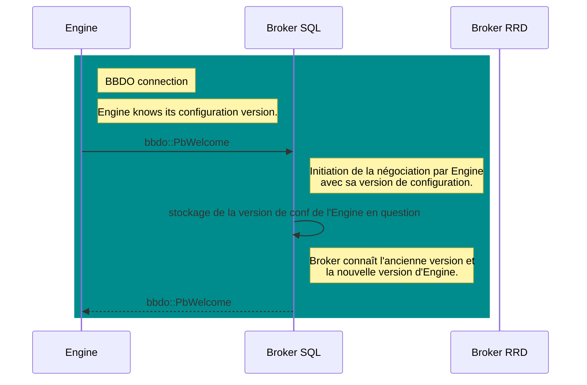

# Introduction

Actuellement, deux bases de données tournent sur le central. La base de
configuration et la base temps réel. La première permet au php de
générer la configuration d’engine. Une fois cette configuration créée,
elle est transmise aux pollers par gorgone.

Chaque poller lit sa configuration et commence par l’envoyer à Broker,
qui au fil de l’eau prépare la base temps réel pour accepter par la
suite la supervision.

Nous aimerions arrêter ces aller-retours entre `Engine` et Broker.
L’idée serait plutôt qu’`Engine` se connecte à Broker, qu’il dise la
configuration qu’il connaît et que si besoin `Broker` lui transmette une
mise à jour.

# Nouvelle négociation

Nous ne pouvons pas casser tout le comportement actuel, nous voulons
faire des changements étape par étape.

L’étape ici est de faire évoluer la négociation entre les deux
programmes.

`Engine` parle réseau car il est lié à `cbmod`. `Cbmod` n’a pas accès
directement au code d’Engine, il ne connaît que ce qu’il lui transmet.
Ceci est problématique car, par exemple, `cbmod` ne connaît pas le
répertoire de configuration d’`Engine`.

## cbmod devient une librairie

Les soucis rencontrés sur `cbmod` peuvent être bien réduits en le
transformant en librairie. Cela permettrait à `Engine` de l’utiliser
directement et de lui transmettre les informations nécessaires beaucoup
plus facilement.

Un des impacts à cela est que le paramètre passé à `cbmod` est
maintenant directement passé à `Engine` avec l’option `-b` suivie du
fichier de paramétrage `Broker`. On peut aussi fournir cette information
directement dans le fichier de configuration `Engine`  avec la clé
`broker_module_cfg_file`. Enfin, suite à des soucis avec le traitement
des anciennes version d’`Engine`, il est toujours possible de garder
l’ancien format de déclaration de module pour `cbmod`. Un message de
dépréciation est écrit dans les logs mais ça fonctionne.

## Nouveaux paramètres à engine/cbmod

Actuellement, depuis la modification de `cbmod`, `Engine` démarre avec
essentiellement deux paramètres, de la façon suivante :

`centengine -b /etc/centreon-broker/central-module.json /etc/centreon-engine/centengine.cfg`

Nous allons remplacer progressivement l’utilisation du répertoire
`/etc/centreon-engine` par `/var/lib/centreon-engine` pour
qu’`Engine` en soit maître puisque ce répertoire est son `HOME`. C’est
lui qui écrira le fichier de configuration et qui le lira aussi. Ce
fichier n’est pas forcément présent, s’il l’est `Engine` peut démarrer
avec mais s’il ne l’est pas il va récupérer sa configuration et donc son
contenu au moment de la négociation avec `Broker`. Enfin, on ne précise
pas le nom du fichier, c’est `Engine` qui le détermine. Le seul point
important est le répertoire de travail.

Au final, si nous voulons garder deux manières de fonctionner pour
`Engine`, nous avons les deux cas suivants :

-   Avec `-p /var/lib/centreon-engine` : nous sommes dans la nouvelle
    génération où `Engine` récupère sa configuration lors de la
    négociation avec `Broker`;

-   Avec `/etc/centreon-engine/centengine.cfg` : nous sommes dans
    l’ancienne génération où `Engine` lit sa configuration dans un
    fichier `cfg`.

Les deux situations ne sont pas incompatibles, on peut imaginer
qu’`Engine` lise sa configuration dans un fichier `cfg` et qu’il la
mette à jour lors de la négociation avec `Broker`. Ça peut être utile
pendant la transition ancienne génération → nouvelle génération .

## Nouveaux paramètres pour Broker

`Broker` a deux nouveaux paramètres que l’on retrouve dans son fichier
de configuration qui sont :

-   `cache_config_directory` - le répertoire de cache php, c’est-à-dire
    le répertoire dans lequel la configuration envoyée par le php est
    écrite.

-   `pollers_config_directory` - le répertoire des configurations poller
    qu’il va désormais maintenir.

Le premier répertoire contient des sous-répertoires dont les noms sont
des entiers représentant l’ID du poller. Chacun de ces répertoires
contient la configuration de l’`Engine` installé dessus. Au même niveau
que chacun de ces répertoires, on trouve aussi un fichier vide nommé
avec l’ID du poller dont l’extension est `.lck` , qui est mis à jour
seulement une fois le répertoire concerné mis à jour.

Par exemple, avec la configuration du poller 23 stockée dans le
répertoire `23` dans le répertoire `cache_config_directory`, on trouve
aussi le fichier `23.lck`.

Le principe est le suivant, dès que le php termine de mettre à jour un
répertoire pour un poller, il touche le fichier associé. Ce dernier est
écouté par `Broker` et dès qu’il est notifié il prend en considération
la nouvelle configuration écrite dans le répertoire.

Pour le second répertoire, `Broker` l’utilise pour gérer l’ensemble des
configurations des pollers. Ce répertoire contient déjà toutes les
configurations des pollers sous la forme Protobuf sérialisée.

A partir du moment où le répertoire de cache php est fourni,
`Broker` considère qu’il est en nouvelle génération .

## La négociation

Nous considérons que les nouvelles capacités implémentées ici ne
fonctionnent qu’avec BBDO3.

Le message `Welcome` se voit ajouter quelques paramètres :

-   `broker_name`,

-   `extended_negociation`

-   `peer_type`

Si `cbmod` est configuré avec les nouveaux paramètres, alors il remplit
ces nouveaux champs.

Le message `Welcome` est maintenant défini comme suit :

    message Welcome {
      Bbdo version = 1;
      string extensions = 2;
      uint64 poller_id = 3;
      string poller_name = 4;
      /* \Broker\ name is more relevant than poller name because for example on the
       * central, rrd broker, central broker and engine share the same poller name
       * that is 'Central'. */
      string broker_name = 5;
      com.centreon.common.PeerType peer_type = 6;
      bool extended_negotiation = 7;
      /* Engine configuration version sent by Engine so Broker is aware of it. */
      string engine_conf = 8;
    }

Les champs `version` et `extensions` ne changent pas. `poller_id` et
`poller_name` représentent toujours l’ID et le nom du poller. Mais sur
le Central, par exemple, il y a trois programmes qui partagent ces deux
informations. Donc pour rendre unique l’identification de l’instance qui
envoie le message, nous avons ajouté le `broker_name` (qui a aussi du
sens dans le cas d’`Engine`).

`peer_type` est un type énuméré qui peut prendre les valeurs suivantes :

-   ENGINE
-   BROKER
-   MAP
-   UNKNOWN

Avec la nouvelle connexion, la valeur `UNKNOWN` ne devrait pas
apparaître.

Enfin, `extended_negotiation` est un booléen qui indique si le programme
est capable de gérer la nouvelle négociation, donc pour un `Engine`,
s’il a connaissance du répertoire de configuration Protobuf, et pour un
`Broker`, s’il a connaissance du répertoire de cache php.

Jusque là, quand le code était exécuté dans `cbmod` ou dans `Broker`, on
n’avait pas la visibilité sur le programme en cours d’exécution, on ne
savait pas si on était dans un `Broker` ou dans un `Engine`. Avec cette
évolution, on peut le savoir. C’est important puisqu’on veut que
`Broker` envoie la configuration à `Engine`.

Dans le stream bbdo, `Broker` stocke des informations sur son
interlocuteur, on avait jusque là le `poller_name` et aussi le
`poller_id`. On complète ces informations avec le `broker_name`, le
`peer_type`, le booléen `extended_negociation` et `config_version` qui
pour le moment contient le hash de la configuration `Engine`. Dans un
futur proche, cette information évoluera probablement.

Et dans le `configuration::applier::state` on a aussi ces informations
pour notre instance.

Au niveau de la négociation, les deux points importants sont de savoir
si la négociation étendue est supportée et dans le cas de la connexion
d’un `Engine`, savoir quelle version de la conf il connaît. Ce n’est pas
le moment d’échanger la configuration Engine, il y a potentiellement de
la rétention à liquider avant de basculer sur son envoi.

Comment fonctionne la négociation ? Deux cas se présentent :

1.  `Engine` initie la connexion.
2.  `Broker` initie la connexion.

On considère ici qu’`Engine` démarre et se connecte à un `Broker` déjà
en fonctionnement.

### Nouvelle fonctionnalité de Broker

`Broker` est configuré avec deux nouveaux répertoires dont on a déjà
parlés et qui sont :

-   `cache_config_directory`
-   `pollers-config`

Nous allons nous attarder sur ces deux répertoires. Le premier contient
des sous-répertoires qui sont les numéros des pollers connectés à ce
`Broker`. À L’intérieur de chacun, il existe un fichier `conf.lock` qui
est écouté sur les modifications par `Broker`.

Dès que le php finit de remplir un de ces répertoires avec la
configuration du poller concerné, c’est-à-dire qu’un nouveau
sous-répertoire `<poller_ID>` est créé, il crée à côté un fichier
`<poller_ID>.lock`, `Broker` en est directement notifié.

En réalité, `Broker` n’est pas directement notifié, cela coûterait
d’utiliser un thread pour cela, et on va éviter. Du coup, dans la
réalité `Broker` exécute un timer (toutes les 5s) dans son objet
`config::applier::state`. Toutes les 5s,

1.  il demande à `inotify` s’il y a eu des modifications dans le
    répertoire de cache des configurations. Cette demande se traduit par
    une lecture de descripteur de fichier, non bloquante. S’il n’y a
    rien, la fonction retourne de suite avec rien comme résultat.

2.  Dans le cas d’une réponse positive, il récupère les noms de fichier
    `<poller ID>.lck` pour déduire quelles configurations viennent
    d’arriver.

3.  Pour chaque fichier de cette forme, il lit la configuration, crée un
    fichier `new-<poller ID>.prot` dans le répertoire `pollers-config`.

4.  Puis dans le cas où il existait déjà un fichier `<poller ID>.prot`
    dans ce répertoire, il crée aussi un fichier
    `<diff-<poller ID.prot>`

5.  `Broker` entretient la liste de ses interlocuteurs, il met donc
    aussi à jour l’item correspondant à l’`Engine` avec le bon poller ID
    pour se souvenir qu’il a besoin d’une nouvelle configuration.

6.  Ces tâches sont toutes exécutées par un thread indépendant, elles ne
    devraient avoir qu’un impact limité sur le fonctionnement de
    `Broker`.

L’envoi de cette différence est géré dans le stream `bbdo`.

### Engine initie la connexion

`Engine` se connecte à `Broker` et envoie le message `Welcome`.
`Broker` est alors informé de la dernière version de configuration
`Engine` connue par son interlocuteur. Il sait aussi s’il supporte la
nouvelle négociation. Et il répond par un message similaire.

Sachant que `Broker` écoute le répertoire de cache php, lorsqu’il aura
une nouvelle configuration disponible, il pourra l’envoyer.

Un point important, `Broker` ne regarde pas la version de configuration
`Engine` disponible pendant la négociation. C’est quelque chose qui se
fait en tâche de fond. Par contre, il stocke dans ses informations sur
le peer `Engine` sa version de conf. Du coup quand une nouvelle version
sera disponible, il pourra vérifier si les deux sont bien différentes.

### Broker initie la connexion

`Broker` se connecte à `Engine` et envoie le message `Welcome`.
`Engine` apprend à ce moment si `Broker` supporte ou non la nouvelle
négociation. Et il répond en envoyant la version de configuration en
cours.

Au niveau diagramme, on est sur un schéma très similaire du précédent
hormis que les questions-réponses sont inversées.

# Lecture de la configuration Engine

`Engine` est démarré avec la nouvelle configuration. Il la lit
sérialisée en Protobuf dans son `HOME`. Il se
connecte ensuite à `Broker` et envoie le message `Welcome` avec le bon
numéro de version de sa configuration. On a vu que `Broker` répond simplement
en mémorisant la dernière version connue par son interlocuteur.

## Gestion de l’envoi de la configuration à Engine

`Broker` utilise `inotify` pour surveiller le répertoire de cache php.
Après que le php ait fini d’écrire dans ce répertoire la configuration
du poller *X*, il crée à côté du répertoire *X*, un fichier `X.lck`.
`Broker` surveille la création/modification de n’importe quel fichier
`*.lck` dans ce répertoire. Pour cela un timer cadencé à 5 secondes fait
une lecture sur le descripteur de fichier `inotify`. Ce timer est lancé
en asynchrone et quand un fichier est détecté, `Broker` fait plusieurs
tâches:

1.  Il lit le répertoire de configuration pour en faire une structure
    `engine::State`.

2.  Il sérialise dans son répertoire `pollers-conf` cette configuration
    dans un fichier `new-X.prot`.

3.  Dans le cas où un fichier `X.prot` existe déjà, il crée aussi un
    fichier `diff-X.prot` qui contient la différence entre les deux
    configurations.

4.  Dans le cas où le fichier `X.prot` n’existe pas, il crée aussi le
    fichier `diff-X.prot` mais le remplit avec la configuration
    complète.

Toutes ces étapes sont faites en tâche de fond. Et un booléen atomique
`occupied` est mis à `true` pour éviter qu’un autre thread ne vienne
lire ces fichiers pendant leur manipulation. Une fois la différence bien
enregistrée, le flag `occupied` est remis à `false`.

Le stream BBDO en connexion avec le poller *X* est configuré
pour vérifier si l’`Engine` connecté a une nouvelle version :

1.  `Broker` connaît la liste de ses interlocuteurs, pour cela il garde en
    memoire un tableau de structures avec le `poller_id`, le `poller_name`
    et le `broker_id` de l'interlocuteur. Dans le cas d'un `Engine` il
    maintient aussi deux versions qui sont la courante et la nouvelle si
    présente (mais pas encore connue de l'`Engine`). Il sait
    donc si une nouvelle configuration est disponible pour l’`Engine` en
    face.

2.  si c’est le cas, juste après avoir reçu un *event* de l’`Engine`, il
    envoie le message `DiffState` avec la différence de configuration
    (le contenu de `diff-X.prot`).

3.  une fois ce `DiffState` traité par `Engine`, `Broker` reçoit en réponse
    un message d'acquittement de bonne réception du `DiffState`, `Broker` efface
    alors le fichier de différence.

4.  quand le `DiffState` arrive dans `Engine`, il est d'abord gardé en mémoire dans
    `cbmod`. Il est appliqué au plus vite par `Engine` au prochain redémarrage de
    sa boucle principale.

Côté `Broker` si on parle un peu plus technique, la lecture de la
configuration `Engine` est faite en utilisant la librairie
`engine_conf`. Une fois lue, elle est résolue afin que tous les
`host_id` et autres soient correctement remplis.

Cette résolution est faite par la librairie `engine_conf` et donc tous
le code correspondant dans `Engine` a été supprimé afin de mutualiser le
code entre les deux programmes.

La surveillance avec `inotify` est faite au sein de la classe
`configuration::applier::state`.

## Évolution sur la lecture de configuration par Broker

Dans l’étape précédente, nous avons fait évoluer la négociation entre
`Engine` et `Broker` mais globalement les deux fonctionnent comme avant.
Juste, dans un certain nombre de cas, on évite qu’`Engine` renvoie sa
configuration à Broker.

Un autre point important ici est qu'il ne suffit pas que `Broker`
lise la configuration. Il doit aussi la "résoudre".
Toute cette partie de résolution a été aussi déplacée de `Engine` vers
la librairie `engine_conf`.

Par exemple, l'affectation des `host_id` aux services sont maintenant
faits dans `engine_conf`, même chose pour les `servicegroups` contiennent
ne doivent plus contenir d'autres `servicegroups`...

Pour parvenir à cela, nous nous sommes inspiré du code déjà en place
dans `Engine` dans `configuration::applier::state`. Nous l'avons par
contre déplacé dans les `helpers` de `engine_conf`.

Cette nouvelle résolution sera à appeler lorsque nécessaire, plutôt par
`Broker`.

## Calcul de la différence

`Broker` est notifié sur les nouvelles versions de configuration
`Engine`.

La configuration est reçue par l’instance
`configuration::applier::state` de `Broker`.

Il est intéressant de se garder une petite plage de temps afin de
pouvoir mutualiser les changements des différents pollers. Pour le
moment les interrogations à `inotify` sont faites toutes les 5 secondes,
peut-être faudra t-il augmenter un peu ce délai ou le paramétrer
autrement.

`Broker` fait le découpage, d’un côté les objets ajoutés et modifiés et
de l’autre les objets supprimés. Les premiers peuvent faire partie d’un
premier message pour `unified_sql` qui peut être traité aussi tôt que
possible.

Pour le second, il faut le traiter par partie, à chaque réception d’un
message `InstanceConfiguration` d’un poller, on peut supprimer les
objets à supprimer de ce poller.

On a l’`IndexedState` qui indexe tous les objets d’un `State`. On peut
peut-être le généraliser pour l’utiliser sur un ensemble de `States` et
aussi faire de même avec le `DiffState`. Un tel *diff* permettrait de
gérer les différences au sein de la base de données.

Ce qui précède n’est pas directement lié au fait que `Broker` envoie les
configurations à chaque poller et est en mesure de connaître la liste
des pollers concernés par les changements.

Dès la réception d’un `InstanceConfiguration` d’un poller, le stream
`unified_sql` est notifié, et peut supprimer les objets à supprimer dans
la base de données pour ce poller.

# WIP

## Écriture de la configuration en base de données

### Étude de cas

Actuellement, même si la négociation a évolué, `Broker` continue à
écrire la configuration au compte-goutte en suivant ce que lui envoient
les pollers.

Avec le nouvel envoi de configuration à `Engine`, une première étape
serait la suivante :

-   `Engine` apprend qu’il y a une nouvelle configuration pour lui.

-   Il la lit et l’applique.

-   à partir de ce moment, les nouveaux événements émis concernent la
    nouvelle configuration.

-   il est possible qu’`Engine` envoie encore des événements de
    l’ancienne configuration à cause de la rétention.

-   Dans tous les cas, l’envoi des nouveaux événements est déterminée
    par l’envoi d’un événement `Instance`.

-   En mode *legacy*, `Engine` commence par envoyer un événement
    `Instance`, suivi par toute la configuration sous forme de plein
    d’événements `host`, `service`, etc…Et ce gros envoi se termine par
    l’envoi d’un événement `InstanceConfiguration`.

-   Donc, lorsque `InstanceConfiguration` est reçu, `Broker` ne reçoit
    plus que des événements de la nouvelle configuration.

L’idéal serait de préparer la configuration de tous les pollers
démarrant ou redémarrant en même temps, histoire d’éviter au maximum
tous les conflits potentiels de la base de données. Mais on est
contraint par l’envoi de `InstanceConfiguration`.

Par conséquent, il faut trouver un juste milieu.

Concentrons-nous sur les hosts. On a trois possibilités :

1.  Ajout de host

2.  modification de host

3.  suppression de host

Si on se réduit au scope d’un poller, un host modifié peut :

-   être vu comme modifié : par exemple, son nom change.

-   être vu comme supprimé : par exemple, on a changé le poller qui s’en
    occupe

-   être vu comme ajouté : par exemple, on a changé le poller qui s’en
    occupe.

Toujours dans le même contexte, un host ajouté peut être vu comme :

-   ajouté : il vient d’être ajouté sur le poller.

-   rien : le poller ne le connaissait pas et cet ajout ne le concerne
    pas.

Enfin, un host supprimé sur le poller peut être vu comme :

-   supprimé : il vient d’être supprimé sur le poller.

-   rien : le poller ne le connaissait pas et cette suppression ne le
    concerne pas.

Si on se reconcentre sur un changement de configuration sur quelques
pollers, comment mettre à jour la base ?

1.  `Broker` apprend par les fichiers `X.lck` les nouvelles
    configurations disponibles.

2.  Un fichier `X.prot` est produit pour chaque configuration.

Dans le cas d’un host supprimé de la configuration, le poller concerné
doit d’abord émettre un `InstanceConfiguration` avant de pouvoir
supprimer ce host (qui ne sera pas vraiment supprimé mais juste
désactivé). Si on supprime le host en avance, on peut avoir des soucis
si le poller a encore des données à envoyer dessus. Les écritures ne
seront pas faites vu que `Broker` ne considérera pas le host comme
valide.

Dans le cas d’un host modifié mais restant sur le même poller, on peut
faire les modifications rapidement sans attendre l’événement
`InstanceConfiguration`.

Dans le cas d’un host ajouté, c’est comme pour le modifié, on peut le
faire de suite, les vieilles données ne le concerneront pas.

Le cas épineux est le host déplacé d’un poller à un autre. Imaginons
qu’il soit déplacé du poller 1 vers le poller 2.

Si poller 1 envoie `InstanceConfiguration` avant poller 2,

Si on déplace, dans la base, le host avant la réception de l’event pour
poller 1, la réception d’un event concernant l’ancienne version de ce
host devrait toujours fonctionner puisque le host existe et apparaît
dans le cache d’`unified_sql`.

Par conséquent, sur la base de données, on peut mettre à jour sans
attendre l’événement `InstanceConfiguration` les points suivants :

1.  un host modifié qui ne bouge pas de poller

2.  un host déplacé de poller.

3.  un host ajouté

Par contre, on ne peut pas supprimer un host avant d’avoir reçu
l’événement `InstanceConfiguration`.

Le *stream* *unified_sql* fonctionne actuellement de la façon suivante :

1.  à la réception de l’événement `instance`, les objets du poller
    concerné sont désactivés.

2.  au fur et à mesure que les nouveaux objets sont reçus, ils sont
    insérés dans la base et réactivés.

3.  Lorsque toute la configuration est reçue, un événement
    `instanceConfiguration` est reçu par `Broker`

Nous avons donc un souci sur les suppressions. L’envoi différentiel
voudrait que les objets à supprimer le soient après `instance` alors que
tous les autres peuvent l’être avant.

D’un autre côté, la situation actuelle n’étant pas très fine sur la
suppression, elle se contente de commencer par tout supprimer avant de
tout reconstruire.

Pour la nouvelle configuration, le point sur la suppression est
obligatoire. `unified_sql` contient une table entre les ID de poller et
les ID de hosts. Au lieu de tout supprimer, on pourrait stocker les ID
de host à supprimer. Et ceci peut être fait dès la réception de
configuration. Ensuite toutes les modifications et ajouts peuvent être
faits sans souci.

Une autre solution est peut-être de faire pour que si un objet est
supprimé, ça ne gêne pas `Broker`, en tout cas pas suffisamment pour
poser de réel souci.

Par conséquent, on reçoit un lot de nouvelles configurations. Pour
chacune on calcule le différentiel avec la configuration précédente. On
sait donc quels objets sont ajoutés, modifiés ou supprimés.

### Mise en pratique

La bonne solution semble être :

1.  A partir des différentiels de poller récupérés sur un changement de
    configuration, on crée un différentiel global. L’intérêt est de
    régler à l’avance les conflits inter-poller.

2.  `Broker` doit apprendre à être moins strict sur les écritures en
    base. Par exemple, si un host est supprimé et qu’on envoie encore
    des données dessus, sachant que le host est juste désactivé, on
    devrait pouvoir quand même écrire les données.

3.  Lorsque le différentiel global est prêt, on ne serait plus obligé
    d’attendre un `Instance` pour le traiter. Ceci dit, si un poller a
    trois semaine de retard, quel serait l’impact sur les données
    d’envoyer presqu’à la connexion du poller la nouvelle configuration
    ?

Un algorithme pour le regroupement des différentiels pourrait suivre la
solution suivante :

-   Pour les objets ajoutés, on peut faire la réunion. On aura la
    globalité des objets ajoutés. A chaque ajout, il faut vérifier parmi
    les supprimés si l’objet n’est pas déjà référencé. S’il l’est on
    peut le déplacer dans les objets modifiés.

-   pour les objets modifiés (qui ne changent pas de poller), on peut
    aussi faire la réuion.

-   Pour un host déplacé d’un poller vers un autre, un différentiel va
    dire que le host est ajouté tandis qu’un autre va dire qu’il est
    supprimé.

-   pour un objet supprimé, il faut vérifier s’il n’est pas déjà ajouté,
    et s’il l’est, il faut le mettre dans les objets modifiés.

**Remarque.** Un point de vigilance : Dans le cas où le second poller a
beaucoup de retard, l’arrivée de la seconde `ConfigurationInstance` peut
vraiment tarder. Si l’`Engine` est redémarré avant l’envoi de cet
*event*, il va se connecter avec la nouvelle configuration mais
`Broker` aura encore des restes de travaux à effectuer ce qui peut être
problématique. Pour éviter ça, on passe par un nouvel *event* BBDO (donc
qui est géré en dehors de la pile des événements) ; dès qu’`Engine` lit
la configuration, il émet ce nouvel *event* pour informer `Broker` au
plus vite qu’elle est prise en compte. Pour appliquer la configuration
sur la base de données, `Broker` attend d’avoir reçu tous ces
acquittements.

Détaillons davantage la gestion des fichiers pendant l’envoi des
configurations pour mieux comprendre les soucis que l’on pourrait
rencontrer.

## Cas épineux

Lorsqu’il y a de la rétention, nous avons deux cas qui posent problème :

1.  si le premier poller est à l’heure et le second a de la rétention.
    Dans le cas où un host est déplacé du second vers le premier, Broker
    risque de recevoir des données du même host en même temps, provenant
    des deux pollers, ceci jusqu’à ce que le second poller rattrape la
    rétention. En terme de datation, les données arrivant du second
    poller seront plus anciennes.

2.  Si le second poller a de la rétention et avant que `Broker` ne
    reçoive son InstanceConfiguration, l’utilisateur pousse une nouvelle
    configuration. Il est possible dans ce cas, qu’`Engine` ait déjà
    pris en compte l’avant-dernière configuration, et par contre que
    `Broker` n’en soit pas encore informé et qu’il considère
    qu’`Engine`est encore sur la configuration précédente. Par
    conséquent, le différentiel nouvellement calculé par `Broker` va
    être faux.

Le second cas épineux devrait être réglé grâce à l’introduction de
l’event BBDO d’acquittement.

Nous avons un *flag* dans `Broker` pour spécifier s’il est occupé à
traiter la configuration des pollers ou non. Il y a deux portions de
code concernées par ce *flag*.

1.  Lorsque le timer crée les fichiers de diff, de state, etc…C’est tout
    un moment où le *flag* est activé. Du coup, si le stream bbdo veut
    accéder aux configurations disponibles, l’accès lui est refusé et il
    passe son chemin.

2.  Lorsque le stream BBDO envoie la configuration aux pollers. Le timer
    n’a plus accès aux fichiers de configuration, et le timer est juste
    reprogrammé pour plus tard en attendant que la tâche soit terminée.
    Le stream BBDO, dans l’idéal, devrait désactiver le flag lorsque
    tous les pollers ont envoyé un acquittement.

Ci-dessous l’illustration de la situation 2 que l’on souhaite éviter :

Grâce au message d’acquittement, `Broker` ne lira pas la nouvelle
configuration disponible tant qu’il n’a pas reçu l’acquittement
d’`Engine`. Et une fois l’acquittement reçu, `Broker` sait que c’est
maintenant cette configuration qui est en place (même si elle n’est pas
encore totalement effective à cause de la rétention). Par conséquent,
quand `Broker` lit la nouvelle configuration, il calcule bien le bon
différentiel avec la bonne configuration déjà en place.

# Remarques intéressantes

## Split de broker::config::applier::state

J’ai tenté de séparer cet objet de manière à avoir une version pour
cbmod et une pour broker. L’idfée semble intéressante car un certain
nombre d’objets sont spécifiques à l’un ou à l’autre.

Le souci, si l’on fait ça, c’est que le stream bbdo doit aussi être
découpé et je crains que ce ne soit pas le seul. Du coup, les travaux
s’étendent et je ne suis pas convaincu de l’intérêt pour le moment.
