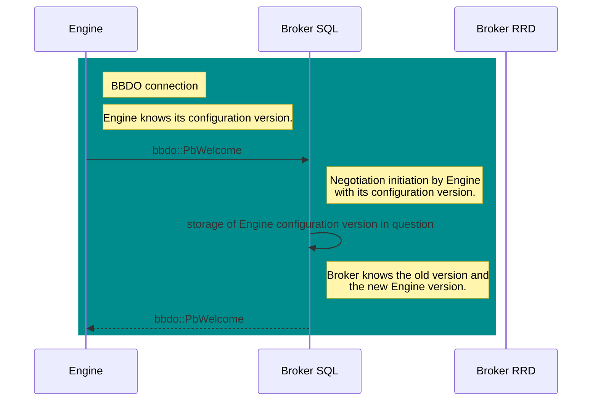

# Introduction

Currently, two databases run on the central. The configuration database and the real-time database. The first allows PHP to generate the Engine configuration. Once this configuration is created, it is transmitted to pollers through Gorgone.

Each poller reads its configuration and starts by sending it to Broker, which gradually prepares the real-time database to subsequently accept monitoring.

We would like to stop these round trips between `Engine` and Broker. The idea would be that `Engine` connects to Broker, tells it the configuration it knows, and if needed `Broker` transmits an update to it.

# New Negotiation

We cannot break all current behavior; we want to make changes step by step.

The step here is to evolve the negotiation between the two programs.

`Engine` speaks network because it is linked to `cbmod`. `Cbmod` does not have direct access to Engine code; it only knows what is transmitted to it. This is problematic because, for example, `cbmod` does not know Engine's configuration directory.

## cbmod becomes a library

The issues encountered with `cbmod` can be greatly reduced by transforming it into a library. This would allow `Engine` to use it directly and transmit necessary information much more easily.

One impact of this is that the parameter passed to `cbmod` is now directly passed to `Engine` with the `-b` option followed by the Broker configuration file. This information can also be provided directly in the Engine configuration file with the `broker_module_cfg_file` key. Finally, due to issues with processing older Engine versions, it is still possible to keep the old module declaration format for `cbmod`. A deprecation message is written to the logs but it works.

## New parameters for engine/cbmod

Currently, since the `cbmod` modification, `Engine` starts with essentially two parameters, as follows:

`centengine -b /etc/centreon-broker/central-module.json /etc/centreon-engine/centengine.cfg`

We will progressively replace the use of the `/etc/centreon-engine` directory with `/var/lib/centreon-engine` so that `Engine` masters it since this directory is its `HOME`. It is the one that will write the configuration file and read it too. This file is not necessarily present; if it is, `Engine` can start with it, but if it is not, it will retrieve its configuration and therefore its content during negotiation with `Broker`. Finally, we do not specify the file name; it is `Engine` that determines it. The only important point is the working directory.

In the end, if we want to keep two ways of operating for `Engine`, we have the following two cases:

-   With `-p /var/lib/centreon-engine`: we are in the new generation where `Engine` retrieves its configuration during negotiation with `Broker`;

-   With `/etc/centreon-engine/centengine.cfg`: we are in the old generation where `Engine` reads its configuration from a `cfg` file.

The two situations are not incompatible; we can imagine that `Engine` reads its configuration from a `cfg` file and updates it during negotiation with `Broker`. This can be useful during the old generation → new generation transition.

## New parameters for Broker

`Broker` has two new parameters found in its configuration file which are:

-   `cache_config_directory` - the PHP cache directory, i.e., the directory in which the configuration sent by PHP is written.

-   `pollers_config_directory` - the directory of poller configurations that it will now maintain.

The first directory contains subdirectories whose names are integers representing the poller ID. Each of these directories contains the configuration of the `Engine` installed on it. At the same level as each of these directories, there is also an empty file named with the poller ID whose extension is `.lck`, which is updated only once the concerned directory is updated.

For example, with poller 23's configuration stored in directory `23` in the `cache_config_directory` directory, we also find the `23.lck` file.

The principle is as follows: as soon as PHP finishes updating a directory for a poller, it touches the associated file. This file is watched by `Broker` and as soon as it is notified, it takes into consideration the new configuration written in the directory.

For the second directory, `Broker` uses it to manage all poller configurations. This directory already contains all poller configurations in serialized Protobuf form.

From the moment the PHP cache directory is provided, `Broker` considers that it is in new generation.

## The negotiation

We consider that the new capabilities implemented here only work with BBDO3.

The `Welcome` message gets some additional parameters:

-   `broker_name`,

-   `extended_negociation`

-   `peer_type`

If `cbmod` is configured with the new parameters, then it fills these new fields.

The `Welcome` message is now defined as follows:

    message Welcome {
      Bbdo version = 1;
      string extensions = 2;
      uint64 poller_id = 3;
      string poller_name = 4;
      /* \Broker\ name is more relevant than poller name because for example on the
       * central, rrd broker, central broker and engine share the same poller name
       * that is 'Central'. */
      string broker_name = 5;
      com.centreon.common.PeerType peer_type = 6;
      bool extended_negotiation = 7;
      /* Engine configuration version sent by Engine so Broker is aware of it. */
      string engine_conf = 8;
    }

The `version` and `extensions` fields do not change. `poller_id` and `poller_name` still represent the poller's ID and name. But on the Central, for example, there are three programs that share these two pieces of information. So to make the identification of the instance sending the message unique, we added the `broker_name` (which also makes sense in the case of `Engine`).

`peer_type` is an enumerated type that can take the following values:

-   ENGINE
-   BROKER
-   MAP
-   UNKNOWN

With the new connection, the `UNKNOWN` value should not appear.

Finally, `extended_negotiation` is a boolean that indicates whether the program is capable of handling the new negotiation, so for an `Engine`, if it is aware of the Protobuf configuration directory, and for a `Broker`, if it is aware of the PHP cache directory.

Until now, when code was executed in `cbmod` or in `Broker`, we did not have visibility on the program being executed; we did not know if we were in a `Broker` or in an `Engine`. With this evolution, we can know. This is important since we want `Broker` to send the configuration to `Engine`.

In the bbdo stream, `Broker` stores information about its interlocutor; we had until now the `poller_name` and also the `poller_id`. We complete this information with the `broker_name`, the `peer_type`, the `extended_negociation` boolean and `config_version` which for now contains the hash of the `Engine` configuration. In the near future, this information will probably evolve.

And in the `configuration::applier::state` we also have this information for our instance.

At the negotiation level, the two important points are knowing if extended negotiation is supported and in the case of an `Engine` connection, knowing which version of the configuration it knows. This is not the time to exchange the Engine configuration; there is potentially retention to liquidate before switching to its sending.

How does negotiation work? Two cases arise:

1.  `Engine` initiates the connection.
2.  `Broker` initiates the connection.

We consider here that `Engine` starts and connects to a `Broker` already in operation.

### New Broker functionality

`Broker` is configured with two new directories we already talked about which are:

-   `cache_config_directory`
-   `pollers-config`

We will focus on these two directories. The first contains subdirectories which are the numbers of pollers connected to this `Broker`. Inside each, there exists a `conf.lock` file that is watched for modifications by `Broker`.

As soon as PHP finishes filling one of these directories with the configuration of the concerned poller, i.e., a new `<poller_ID>` subdirectory is created, it creates next to it a `<poller_ID>.lock` file, `Broker` is directly notified.

In reality, `Broker` is not directly notified; it would be costly to use a thread for that, and we will avoid it. So in reality `Broker` executes a timer (every 5s) in its `config::applier::state` object. Every 5s,

1.  it asks `inotify` if there have been modifications in the configuration cache directory. This request translates to a non-blocking file descriptor read. If there is nothing, the function returns immediately with nothing as a result.

2.  In case of a positive response, it retrieves the `<poller ID>.lck` file names to deduce which configurations just arrived.

3.  For each file of this form, it reads the configuration, creates a `new-<poller ID>.prot` file in the `pollers-config` directory.

4.  Then in case a `<poller ID>.prot` file already existed in this directory, it also creates a `<diff-<poller ID>.prot` file

5.  `Broker` maintains the list of its interlocutors, so it also updates the item corresponding to the `Engine` with the correct poller ID to remember that it needs a new configuration.

6.  These tasks are all executed by an independent thread; they should have only a limited impact on `Broker`'s operation.

Sending this difference is handled in the `bbdo` stream.

### Engine initiates the connection

`Engine` connects to `Broker` and sends the `Welcome` message. `Broker` is then informed of the latest Engine configuration version known by its interlocutor. It also knows if it supports the new negotiation. And it responds with a similar message.

Knowing that `Broker` listens to the PHP cache directory, when it has a new configuration available, it can send it.

An important point: `Broker` does not look at the available Engine configuration version during negotiation. This is something done in the background. However, it stores in its information about the `Engine` peer its configuration version. So when a new version is available, it can check if the two are indeed different.

### Broker initiates the connection

`Broker` connects to `Engine` and sends the `Welcome` message. `Engine` learns at this moment whether `Broker` supports the new negotiation or not. And it responds by sending the current configuration version.

At the diagram level, we are on a very similar schema to the previous one except that the questions-answers are reversed.

# Reading Engine configuration

`Engine` is started with the new configuration. It reads it serialized in Protobuf in its `HOME`. It then connects to `Broker` and sends the `Welcome` message with the correct version number of its configuration. We have seen that `Broker` simply responds by memorizing the latest version known by its interlocutor.

## Managing configuration sending to Engine

`Broker` uses `inotify` to monitor the PHP cache directory. After PHP has finished writing in this directory the configuration of poller *X*, it creates next to directory *X*, a `X.lck` file. `Broker` monitors the creation/modification of any `*.lck` file in this directory. For this, a timer cadenced at 5 seconds does a read on the `inotify` file descriptor. This timer is launched asynchronously and when a file is detected, `Broker` performs several tasks:

1.  It reads the configuration directory to make an `engine::State` structure.

2.  It serializes this configuration in its `pollers-conf` directory in a `new-X.prot` file.

3.  In case an `X.prot` file already exists, it also creates a `diff-X.prot` file that contains the difference between the two configurations.

4.  In case the `X.prot` file does not exist, it also creates the `diff-X.prot` file but fills it with the complete configuration.

All these steps are done in the background. And an atomic boolean `occupied` is set to `true` to prevent another thread from reading these files during their manipulation. Once the difference is well recorded, the `occupied` flag is reset to `false`.

The BBDO stream in connection with poller *X* is configured to check if the connected `Engine` has a new version:

1.  `Broker` knows the list of its interlocutors; for this it keeps in memory an array of structures with the `poller_id`, the `poller_name` and the `broker_id` of the interlocutor. In the case of an `Engine` it also maintains two versions which are the current and the new if present (but not yet known to the `Engine`). It therefore knows if a new configuration is available for the `Engine` opposite.

2.  if this is the case, just after receiving an *event* from the `Engine`, it sends the `DiffState` message with the configuration difference (the content of `diff-X.prot`).

3.  once this `DiffState` is processed by `Engine`, `Broker` receives in response an acknowledgment message of good reception of the `DiffState`, `Broker` then deletes the difference file.

4.  when the `DiffState` arrives in `Engine`, it is first kept in memory in `cbmod`. It is applied as soon as possible by `Engine` at the next restart of its main loop.

On the `Broker` side, if we speak a bit more technically, reading the `Engine` configuration is done using the `engine_conf` library. Once read, it is resolved so that all `host_id` and others are correctly filled.

This resolution is done by the `engine_conf` library and therefore all corresponding code in `Engine` has been removed to mutualize the code between the two programs.

Monitoring with `inotify` is done within the `configuration::applier::state` class.

## Evolution on configuration reading by Broker

In the previous step, we evolved the negotiation between `Engine` and `Broker` but globally both work as before. Just, in a certain number of cases, we avoid having `Engine` send back its configuration to Broker.

Another important point here is that it is not enough for `Broker` to read the configuration. It must also "resolve" it. All this resolution part has also been moved from `Engine` to the `engine_conf` library.

For example, assigning `host_id` to services are now done in `engine_conf`, same thing for `servicegroups` which must no longer contain other `servicegroups`...

To achieve this, we were inspired by the code already in place in `Engine` in `configuration::applier::state`. We moved it however to the `helpers` of `engine_conf`.

This new resolution will be called when necessary, rather by `Broker`.

## Difference calculation

`Broker` is notified on new Engine configuration versions.

The configuration is received by the `configuration::applier::state` instance of `Broker`.

It is interesting to keep a small time range in order to be able to mutualize changes from different pollers. For now the `inotify` queries are done every 5 seconds; maybe we will need to increase this delay a bit or configure it differently.

`Broker` does the breakdown: on one side the added and modified objects and on the other the deleted objects. The first can be part of a first message for `unified_sql` which can be processed as early as possible.

For the second, it must be processed in parts; at each reception of an `InstanceConfiguration` message from a poller, we can delete the objects to be deleted from this poller.

We have the `IndexedState` which indexes all objects of a `State`. We can perhaps generalize it to use it on a set of `States` and also do the same with the `DiffState`. Such a *diff* would allow managing differences within the database.

What precedes is not directly linked to the fact that `Broker` sends configurations to each poller and is able to know the list of pollers concerned by the changes.

Upon reception of an `InstanceConfiguration` from a poller, the `unified_sql` stream is notified, and can delete the objects to be deleted in the database for this poller.

# WIP

## Writing configuration to database

### Case study

Currently, even if negotiation has evolved, `Broker` continues to write configuration piecemeal following what the pollers send it.

With the new configuration sending to `Engine`, a first step would be the following:

-   `Engine` learns that there is a new configuration for it.

-   It reads and applies it.

-   from this moment, the new events emitted concern the new configuration.

-   it is possible that `Engine` still sends events from the old configuration due to retention.

-   In all cases, sending new events is determined by sending an `Instance` event.

-   In *legacy* mode, `Engine` starts by sending an `Instance` event, followed by the entire configuration in the form of many `host`, `service`, etc... events. And this big send ends with sending an `InstanceConfiguration` event.

-   So, when `InstanceConfiguration` is received, `Broker` receives only events from the new configuration.

The ideal would be to prepare the configuration of all pollers starting or restarting at the same time, to avoid as much as possible all potential database conflicts. But we are constrained by sending `InstanceConfiguration`.

Therefore, we must find a middle ground.

Let's focus on hosts. We have three possibilities:

1.  Host addition

2.  Host modification

3.  Host deletion

If we reduce to the scope of a poller, a modified host can:

-   be seen as modified: for example, its name changes.

-   be seen as deleted: for example, we changed the poller that takes care of it

-   be seen as added: for example, we changed the poller that takes care of it.

Still in the same context, an added host can be seen as:

-   added: it has just been added on the poller.

-   nothing: the poller did not know it and this addition does not concern it.

Finally, a host deleted on the poller can be seen as:

-   deleted: it has just been deleted on the poller.

-   nothing: the poller did not know it and this deletion does not concern it.

If we refocus on a configuration change on some pollers, how to update the database?

1.  `Broker` learns through `X.lck` files the new available configurations.

2.  An `X.prot` file is produced for each configuration.

In the case of a host deleted from the configuration, the concerned poller must first emit an `InstanceConfiguration` before being able to delete this host (which will not really be deleted but just disabled). If we delete the host in advance, we can have problems if the poller still has data to send on it. The writes will not be done since `Broker` will not consider the host as valid.

In the case of a modified host but remaining on the same poller, we can make modifications quickly without waiting for the `InstanceConfiguration` event.

In the case of an added host, it's like for the modified one, we can do it right away, the old data will not concern it.

The tricky case is the host moved from one poller to another. Let's imagine it is moved from poller 1 to poller 2.

If poller 1 sends `InstanceConfiguration` before poller 2,

If we move, in the database, the host before receiving the event for poller 1, receiving an event concerning the old version of this host should still work since the host exists and appears in the `unified_sql` cache.

Therefore, on the database, we can update without waiting for the `InstanceConfiguration` event the following points:

1.  a modified host that does not move from poller

2.  a host moved from poller.

3.  an added host

However, we cannot delete a host before having received the `InstanceConfiguration` event.

The *unified_sql* stream currently works as follows:

1.  upon reception of the `instance` event, the objects of the concerned poller are deactivated.

2.  as new objects are received, they are inserted into the database and reactivated.

3.  When the entire configuration is received, an `instanceConfiguration` event is received by `Broker`

We therefore have a problem with deletions. Differential sending would want objects to be deleted to be so after `instance` while all others can be so before.

On the other hand, the current situation not being very fine on deletion, it is content to start by deleting everything before rebuilding everything.

For the new configuration, the point on deletion is mandatory. `unified_sql` contains a table between poller IDs and host IDs. Instead of deleting everything, we could store the host IDs to be deleted. And this can be done upon configuration reception. Then all modifications and additions can be done without worry.

Another solution is perhaps to make it so that if an object is deleted, it does not bother `Broker`, at least not enough to pose real problems.

Therefore, we receive a batch of new configurations. For each we calculate the differential with the previous configuration. We therefore know which objects are added, modified or deleted.

### Implementation

The good solution seems to be:

1.  From poller differentials retrieved on a configuration change, we create a global differential. The interest is to resolve inter-poller conflicts in advance.

2.  `Broker` must learn to be less strict on database writes. For example, if a host is deleted and we still send data on it, knowing that the host is just disabled, we should still be able to write the data.

3.  When the global differential is ready, we would no longer be obliged to wait for an `Instance` to process it. That said, if a poller is three weeks behind, what would be the impact on data of sending almost at the poller's connection the new configuration?

An algorithm for grouping differentials could follow the following solution:

-   For added objects, we can make the union. We will have the totality of added objects. At each addition, we must check among the deleted ones if the object is not already referenced. If it is, we can move it to the modified objects.

-   for modified objects (which do not change poller), we can also make the union.

-   For a host moved from one poller to another, one differential will say that the host is added while another will say it is deleted.

-   for a deleted object, we must check if it is not already added, and if it is, we must put it in the modified objects.

**Note.** A point of vigilance: In the case where the second poller is very late, the arrival of the second `ConfigurationInstance` can really be delayed. If the `Engine` is restarted before sending this *event*, it will connect with the new configuration but `Broker` will still have remains of work to perform which can be problematic. To avoid this, we go through a new BBDO *event* (therefore which is managed outside the event stack); as soon as `Engine` reads the configuration, it emits this new *event* to inform `Broker` as quickly as possible that it is taken into account. To apply the configuration on the database, `Broker` waits to have received all these acknowledgments.

Let's detail further the file management during configuration sending to better understand the problems we could encounter.

## Tricky cases

When there is retention, we have two cases that pose problems:

1.  if the first poller is on time and the second has retention. In the case where a host is moved from the second to the first, Broker risks receiving data from the same host at the same time, coming from both pollers, this until the second poller catches up with retention. In terms of dating, the data arriving from the second poller will be older.

2.  If the second poller has retention and before `Broker` receives its InstanceConfiguration, the user pushes a new configuration. It is possible in this case, that `Engine` has already taken into account the penultimate configuration, and on the other hand that `Broker` is not yet informed and considers that `Engine` is still on the previous configuration. Therefore, the differential newly calculated by `Broker` will be wrong.

The second tricky case should be resolved thanks to the introduction of the BBDO acknowledgment event.

We have a *flag* in `Broker` to specify if it is busy processing poller configuration or not. There are two portions of code concerned by this *flag*.

1.  When the timer creates diff files, state files, etc... It's a whole moment when the *flag* is activated. So, if the bbdo stream wants to access available configurations, access is refused and it goes on its way.

2.  When the BBDO stream sends configuration to pollers. The timer no longer has access to configuration files, and the timer is just reprogrammed for later waiting for the task to be finished. The BBDO stream, ideally, should deactivate the flag when all pollers have sent an acknowledgment.

Below is the illustration of situation 2 that we want to avoid:

Thanks to the acknowledgment message, `Broker` will not read the new available configuration until it has received the acknowledgment from `Engine`. And once the acknowledgment is received, `Broker` knows that it is now this configuration that is in place (even if it is not yet totally effective due to retention). Therefore, when `Broker` reads the new configuration, it calculates the right differential with the right configuration already in place.

# Interesting remarks

## Split of broker::config::applier::state

I tried to separate this object so as to have a version for cbmod and one for broker. The idea seems interesting because a certain number of objects are specific to one or the other.

The problem, if we do that, is that the bbdo stream must also be split and I fear that it is not the only one. So, the work extends and I am not convinced of the interest for the moment.