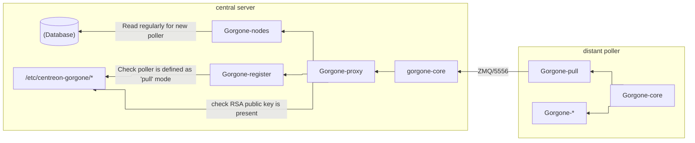

# Architecture

We are showing how to configure gorgone to manage that architecture:



In our case, we have the following configuration (need to adatp to your configuration).

* Central server:
  * address: 10.30.2.203
* Distant Poller:
  * id: 6 (configured in Centreon interface as **zmq**. You get it in the Centreon interface)
  * address: 10.30.2.179
  * rsa public key thumbprint: nJSH9nZN2ugQeksHif7Jtv19RQA58yjxfX-Cpnhx09s

# Distant Poller

## Installation

The Distant Poller is already installed and Gorgone also.

## Configuration

We configure the file **/etc/centreon-gorgone/config.d/40-gorgoned.yaml**:

```yaml
name:  distant-server
description: Configuration for distant server
gorgone:
  gorgonecore:
    id: 6
    privkey: "/var/lib/centreon-gorgone/.keys/rsakey.priv.pem"
    pubkey: "/var/lib/centreon-gorgone/.keys/rsakey.pub.pem"

  modules:
    - name: engine
      package: gorgone::modules::centreon::engine::hooks
      enable: true
      command_file: "/var/lib/centreon-engine/rw/centengine.cmd"

    - name: pull
      package: "gorgone::modules::core::pull::hooks"
      enable: true
      target_type: tcp
      target_path: 10.30.2.203:5556
      ping: 1
```

# Central server

## Installation

The Central server is already installed and Gorgone also.

## Configuration

We configure the file **/etc/centreon-gorgone/config.d/40-gorgoned.yaml**:

```yaml
...
gorgone:
  gorgonecore:
    ...
    external_com_type: tcp
    external_com_path: "*:5556"
    authorized_clients:
      - key: nJSH9nZN2ugQeksHif7Jtv19RQA58yjxfX-Cpnhx09s
    ...
  modules:
    ...
    - name: register
      package: "gorgone::modules::core::register::hooks"
      enable: true
      config_file: /etc/centreon-gorgone/nodes-register-override.yml
    ...
```

We create the file **/etc/centreon-gorgone/nodes-register-override.yml**:

```yaml
nodes:
  - id: 6
    type: pull
    prevail: 1
```
