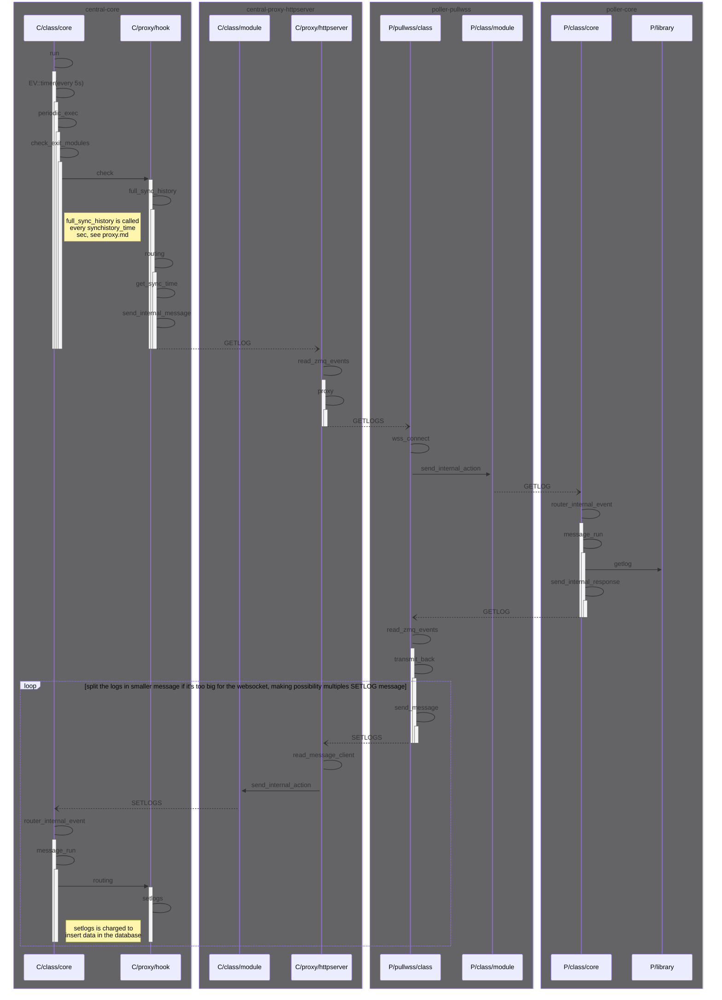

## Gorgone log syncronization with pullwss communcation mode.

each box represent a process running. Each participant represent a file used by the process.\
as participant name must be unique, P or C represent if the file is used on the Poller or the Central\
dotted line are zmq message, full line are direct subroutine call.

### Pullwss
Please note that pullwss communication mode have a limitation on the message size that zmq don't have.
To limit the size of the GETLOG message, the pullwss module split the message in smaller part, and send multiple SETLOGS message.
Other communication module send only one SETLOGS message in this case.

