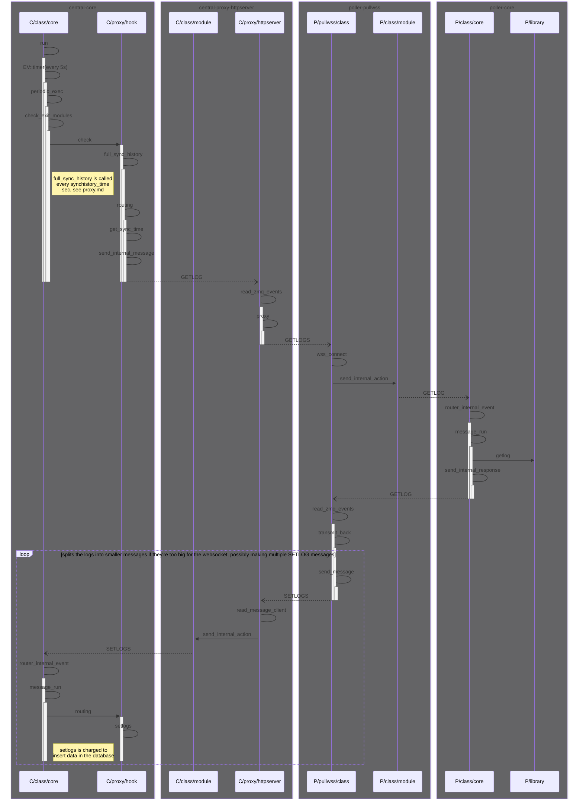

## Gorgone log synchronization with pullwss communication mode.

Each box represents a process running. Each participant represents a file used by the process.\

As participants' names must be unique, P or C represents whether the file is used on the Poller or the Central\

The dotted lines are zmq messages, the full lines are direct subroutine calls

### Pullwss

Please note that the pullwss communication mode has a limitation on message size that zmq doesn't have.
To limit the size of the GETLOG message, the pullwss module splits the message into smaller parts, and sends multiple SETLOGS messages.
Other communication modules send only one SETLOGS message in this case.

```mermaid
sequenceDiagram
    # title: 

    box rgb(100,100,102) central-core
        participant C/class/core
        participant C/proxy/hook
    end
    box rgb(100,100,102) central-proxy-httpserver
        participant C/class/module
        participant C/proxy/httpserver
    end

    box rgb(100,100,102) poller-pullwss
        participant P/pullwss/class
        participant P/class/module
    end
    box rgb(100,100,102) poller-core
        participant P/class/core
        participant P/library
    end

    C/class/core -> + C/class/core: run
    C/class/core -> + C/class/core: EV::timer(every 5s)
    C/class/core -> + C/class/core: periodic_exec
    C/class/core -> + C/class/core: check_exit_modules
    C/class/core ->> + C/proxy/hook: check
    C/proxy/hook -> + C/proxy/hook: full_sync_history
    note left of C/proxy/hook: full_sync_history is called<br/> every synchistory_time <br/>sec, see proxy.md
    C/proxy/hook -> + C/proxy/hook: routing
    C/proxy/hook -> C/proxy/hook: get_sync_time
    C/proxy/hook -> C/proxy/hook: send_internal_message
    C/proxy/hook --) + C/proxy/httpserver: GETLOG
    deactivate C/proxy/hook
    deactivate C/proxy/hook
    deactivate C/proxy/hook
    deactivate C/class/core
    deactivate C/class/core
    deactivate C/class/core
    deactivate C/class/core

# The central uses the proxy module to send data to the remote node. Proxies have multiples processes runing in parallel,
# it is not clear for now if the main process sees the message before the worker process.
    C/proxy/httpserver ->  + C/proxy/httpserver: read_zmq_events
    C/proxy/httpserver ->  + C/proxy/httpserver: proxy
    C/proxy/httpserver --) P/pullwss/class: GETLOGS
    deactivate C/proxy/httpserver
    deactivate C/proxy/httpserver

# The poller (which is a distant node) retrieves the GETLOG message, and processes it.
# First the pullwss module listens on the websocket, and transmits the message retrieved to the core.
# The core processes it and sends back the response.
# wss_connect is only called when the connexion is initiated.
    P/pullwss/class -> + P/pullwss/class: wss_connect
    P/pullwss/class ->> + P/class/module: send_internal_action
    P/class/module --) P/class/core: GETLOG
    P/class/core -> + P/class/core: router_internal_event
    P/class/core -> + P/class/core: message_run
    P/class/core ->> P/library: getlog
    P/class/core ->  + P/class/core: send_internal_response
    P/class/core --) P/pullwss/class: GETLOG
    deactivate P/class/core
    deactivate P/class/core
    deactivate P/class/core


    # On the distant poller, processing of the message.
    P/pullwss/class -> + P/pullwss/class: read_zmq_events
    P/pullwss/class -> + P/pullwss/class: transmit_back
    loop splits the logs into smaller messages if they're too big for the websocket, possibly making multiple SETLOG messages
        P/pullwss/class -> + P/pullwss/class: send_message
        P/pullwss/class --) C/proxy/httpserver: SETLOGS
        deactivate P/pullwss/class
        deactivate P/pullwss/class
        deactivate P/pullwss/class

        # on the central process the response
        C/proxy/httpserver -> + C/proxy/httpserver: read_message_client
        C/proxy/httpserver ->> + C/class/module: send_internal_action
        C/class/module --) C/class/core: SETLOGS
        C/class/core -> + C/class/core: router_internal_event
        C/class/core -> + C/class/core: message_run
        C/class/core ->> + C/proxy/hook: routing
        C/proxy/hook -> C/proxy/hook: setlogs
        note left of C/proxy/hook: setlogs is charged to <br/>insert data in the database

        deactivate C/proxy/hook
        deactivate C/class/core
        deactivate C/class/core
    end


``` 