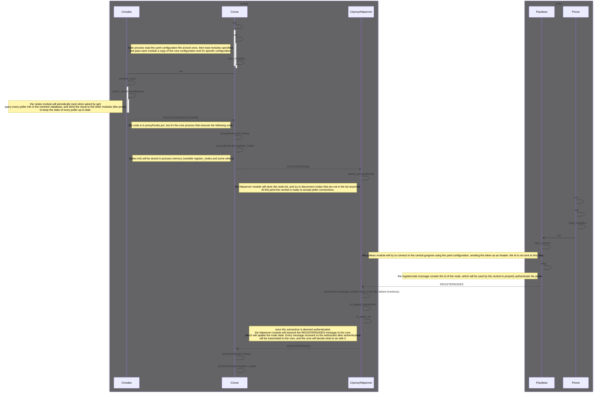

# Pullwss

## Description

This module should be used on remote nodes where the connection has to be HTTP/HTTPS and must be opened from the node to the Central Gorgone.

This module requires proxy and register module to be configured on the central Gorgone.
The register Module will allow Gorgone to keep the state of every poller, and find out the connection mode. 
The proxy module has to bind to a tcp port for the pullwss module to connect to.

## Configuration

| Directive            | Description                                                                    | Default value |
|:---------------------|:-------------------------------------------------------------------------------|:--------------|
| ssl                  | should the connection be made over TLS/SSL or not                              | `false`       |
| address              | IP address to connect to                                                       |               |
| port                 | TCP port to connect to                                                         |               |
| token                | token to authenticate to the central gorgone                                   |               |
| proxy                | HTTP(S) proxy to access central gorgone                                        |               |
| https_cert_no_verify | if ssl=true, if ssl=true, should certificate host name verification be skipped | `true`        |
| max_msg_size         | max message size to send to the central Gorgone                                | `130000`      |

> **Note on `https_cert_no_verify`:** Certificate verification is **disabled by default** (`true`). Set it to `false` and use a valid certificate signed by a trusted CA for production environments.

> **Note on `max_msg_size`:** The WebSocket protocol supports messages up to 262,144 characters, but in practice values above 130,000 have shown reliability issues in Perl. The default of 130,000 is conservative and safe. Adjust only if you have specific needs and have tested the result.

### Example

```yaml
name: pullwss
package: "gorgone::modules::core::pullwss::hooks"
enable: true
ssl: true
port: 8086
token: "1234"
address: 192.168.56.105
```

## Events

| Event          | Description                                             |
|:---------------|:--------------------------------------------------------|
| PULLWSSREADY   | Internal event to notify the core this module is ready. |


## Side notes on the connection lifecycle

1. **Startup**: the Poller connects to the Central's WebSocket endpoint, authenticates (see above), and sends an initial `REGISTERNODES` message. The Central maps the Poller's id to the WebSocket connection.

2. **Keepalive**: the Poller sends a `REGISTERNODES` ping every **30 seconds** while connected.

3. **Reconnection**: the Poller attempts to reconnect every **60 seconds** if the connection is lost or was never established.

4. **Timeouts**:
   - The Poller closes its connection if the Central is inactive for **120 seconds**.
   - The Central closes a WebSocket connection that has had no activity for **300 seconds**.

5. **Sending commands**: when the Central needs to send a command to the Poller, the `proxy/httpserver` subprocess forwards it through the stored WebSocket connection.

6. **Log synchronisation**: the Central sends `GETLOG` to the Poller via the WebSocket. Large responses are split into multiple messages of at most `max_msg_size` characters, and the Poller sends them back as a sequence of `SETLOGS` messages. The Central reassembles them.

7. **Shutdown**: when the Poller's Gorgone daemon stops (SIGTERM) and is still connected, it sends `UNREGISTERNODES` and waits for the message to drain before closing the connection.


## API

No API endpoints.

Here the visual representation of the start of the central gorgone, it's interaction with the database, and the authentication process of the pullwss module.
There is one box per server and a participant per process in gorgone in the diagram below.

