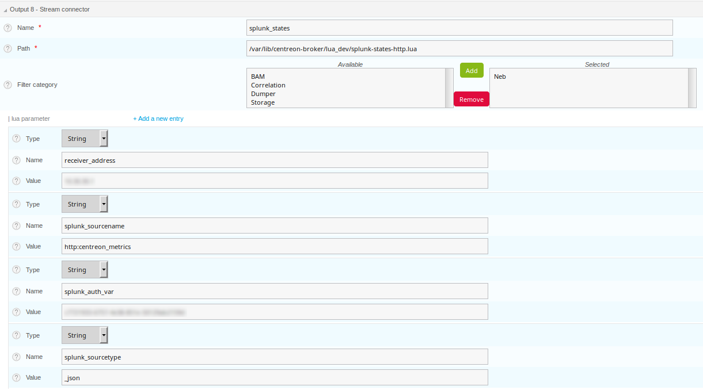
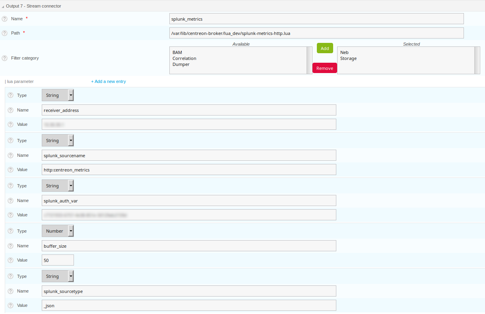

# Centreon Stream Connectors #

Here are several stream connectors for the
[Centreon Broker](https://github.com/centreon/centreon-broker).

# Stream connectors

The goal is to provide useful scripts to the community to extend the open source solution Centreon.

You can find Lua scripts written to export Centreon data to several outputs.

If one script is the good one for you, it is recommended to copy it on the Centreon central server
into the **/usr/share/centreon-broker/lua** directory. If it does not exist, you can create it. This
directory must be readable by the *centreon-broker* user.

When the script is copied, you have to configure it through the centreon web interface.

Stream connector documentation are provided here:
* https://documentation.centreon.com/docs/centreon/en/latest/developer/writestreamconnector.html
* https://documentation.centreon.com/docs/centreon-broker/en/latest/exploit/stream_connectors.html

Don't hesitate to propose improvements and/or contact the community through our Slack workspace. 

Here is a list of the available scripts here:

* [Elasticsearch](#elasticsearch)
* https://github.com/centreon/centreon-stream-connector-scripts#elasticsearch
* https://github.com/centreon/centreon-stream-connector-scripts#Influxdb
* https://github.com/centreon/centreon-stream-connector-scripts#Warp10
* https://github.com/centreon/centreon-stream-connector-scripts#Splunk
* https://github.com/centreon/centreon-stream-connector-scripts#Warp10
* https://github.com/centreon/centreon-stream-connector-scripts#service-now

# Elasticsearch

## Elasticsearch from metrics events: *elasticsearch/elastic-metrics.lua*

This stream connector works with **metric events**. So you need them to be configured in Centreon broker.

Parameters to specify in the stream connector configuration are:

* log-file as **string**: it is the *complete file name* of this script logs.
* elastic-address as **string**: it is the *ip address* of the Elasticsearch server
* elastic-port as **number**: it is the port, if not provided, this value is *9200*.
* max-row as **number**: it is the max number of events before sending them to the elastic server. If not specified, its value is 100

# Influxdb

## Influxdb from metrics events: *influxdb/influxdb-metrics.lua*

This stream connector works with **metric events**. So you need them to be configured in Centreon broker.

To use this script, one need to install the lua-socket library.

Parameters to specify in the stream connector configuration are:

* http\_server\_address as **string**: it is the *ip address* of the Influxdb server
* http\_server\_port as **number**: it is the port, if not provided, this value is *8086*
* http\_server\_protocol as **string**: by default, this value is *http*
* influx\_database as **string**: The database name, *mydb* is the default value
* max\_buffer\_size as **number**: The number of events to stock before them to be sent to influxdb
* max\_buffer\_age as **number**: The delay in seconds to wait before the next flush.

if one of max\_buffer\_size or max\_buffer\_age is reached, events are sent.

## Influxdb from neb events: *influxdb/influxdb-neb.lua*

This stream connector is an alternative to the previous one, but works with **neb service\_status events**.
As those events are always available on a Centreon platform, this script should work more often.

To use this script, one need to install the lua-socket library.

Parameters to specify in the stream connector configuration are:

* measurement as **string**: it is the influxdb *measurement*
* http\_server\_address as **string**: it is the *ip address* of the Influxdb server
* http\_server\_port as **number**: it is the port, if not provided, this value is *8086*
* http\_server\_protocol as **string**: by default, this value is *http*
* influx\_database as **string**: The database name, *mydb* is the default value
* max\_buffer\_size as **number**: The number of events to stock before them to be sent to influxdb
* max\_buffer\_age as **number**: The delay in seconds to wait before the next flush.

if one of max\_buffer\_size or max\_buffer\_age is reached, events are sent.

# Warp10

## Warp10 from neb events: *warp10/export-warp10.lua*

This stream connector works with **neb service\_status events**.

This stream connector need at least centreon-broker-18.10.1.

To use this script, one need to install the lua-curl library.

Parameters to specify in the stream connector configuration are:

* ipaddr as **string**: the ip address of the Warp10 server
* logfile as **string**: the log file
* port as **number**: the Warp10 server port
* token as **string**: the Warp10 write token
* max\_size as **number**: how many queries to store before sending them to the Warp10 server.

# Splunk

There are two ways to use our stream connector with Splunk. The first and probably most common way uses Splunk Universal Forwarder. The second 
method uses Splunk API. 

## The Splunk Universal Forwarder method

In that case, you're going to use "Centreon4Splunk", it comes with:
* A Splunk App. you may find on Splunkbase [here](https://splunkbase.splunk.com/app/4304/)
* The LUA script and documentation [here](https://github.com/lkco/centreon4Splunk)

Thanks to lkco!

## The Splunk API method

There are two Lua scripts proposed here:
1. *splunk-states-http.lua* that sends states to Splunk.
2. *splunk-metrics-http.lua* that sends metrics to Splunk.

In the first case, follow the instructions below:

* Copy them into the */usr/share/centreon-broker/lua/*
* Add a new broker output of type *stream connector*
* Fill it as shown below

In the second case, follow those instructions:

* Copy them into the */usr/share/centreon-broker/lua/*
* Add a new broker output of type *stream connector*
* Fill it as shown below

## The Splunk configuration

An HTTP events collector has be configured in data entries.

# Service Now

The stream connector sends the check results received from Centreon Engine to ServiceNow. Only the host and service check results are sent.

This stream connector is in **BETA** version because it has not been used enough time in production environments.

## Installation

This stream connector needs the lua-curl library available for example with *luarocks*:

`luarocks install lua-curl`

## Configuration

In *Configuration  >  Pollers  >  Broker configuration*, you need to modify the Central Broker Master configuration.

Add an output whose type is Stream Connector.
Choose a name for your configuration.
Enter the path to the **connector-servicenow.lua** file.

Configure the *lua parameters* with the following informations:

Name | Type | Description
--- | --- | ---
client\_id | String | The client id for OAuth authentication
client\_secret | String | The client secret for OAuth authentication
username | String | Username for OAuth authentication
password | Password | Password for OAuth authentication
instance | String | The ServiceNow instance
logfile | String | The log file with its full path (optional)

## Protocol description

The following table describes the matching information between Centreon and the
ServiceNow Event Manager.

**Host event**

Centreon | ServiceNow Event Manager field | Description
--- | --- | ---
hostname | node | The hostname
output | description | The Centreon Plugin output
last\_check | time\_of\_event | The time of the event
hostname | resource | The hostname
severity | The level of severity depends on the host status

**Service event**

Centreon | ServiceNow Event Manager field | Description
--- | --- | ---
hostname | node | The hostname
output | description | The Centreon Plugin output
last\_check | time\_of\_event | The time of the event
service\_description | resource | The service name
severity | The level of severity depends on the host status

