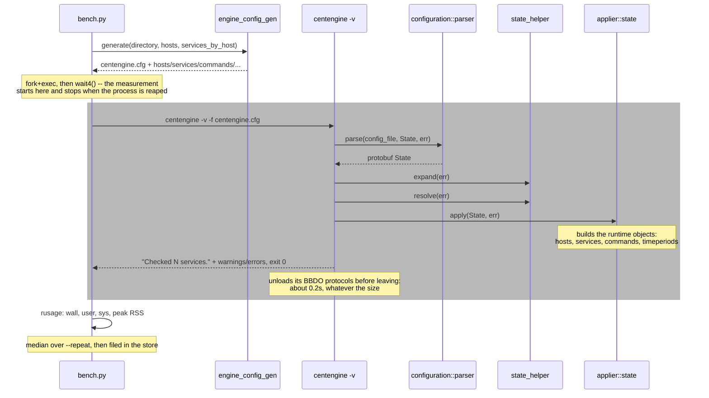
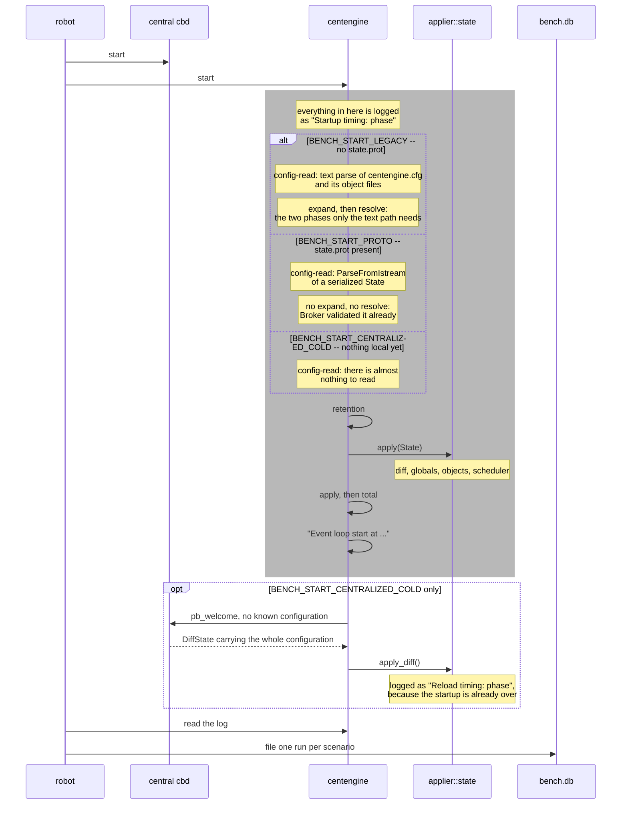
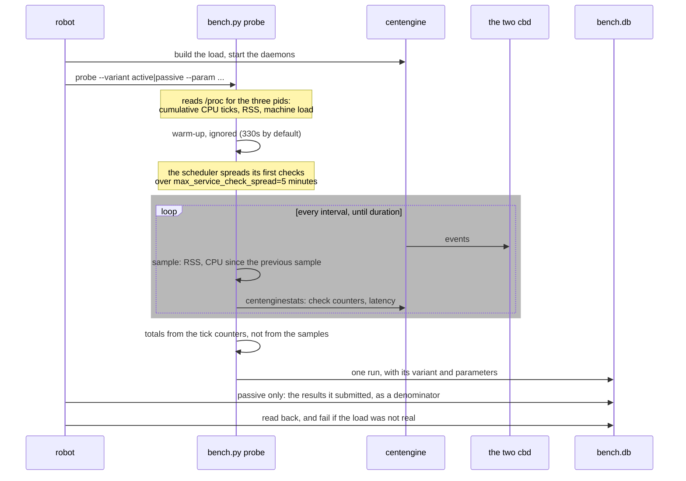
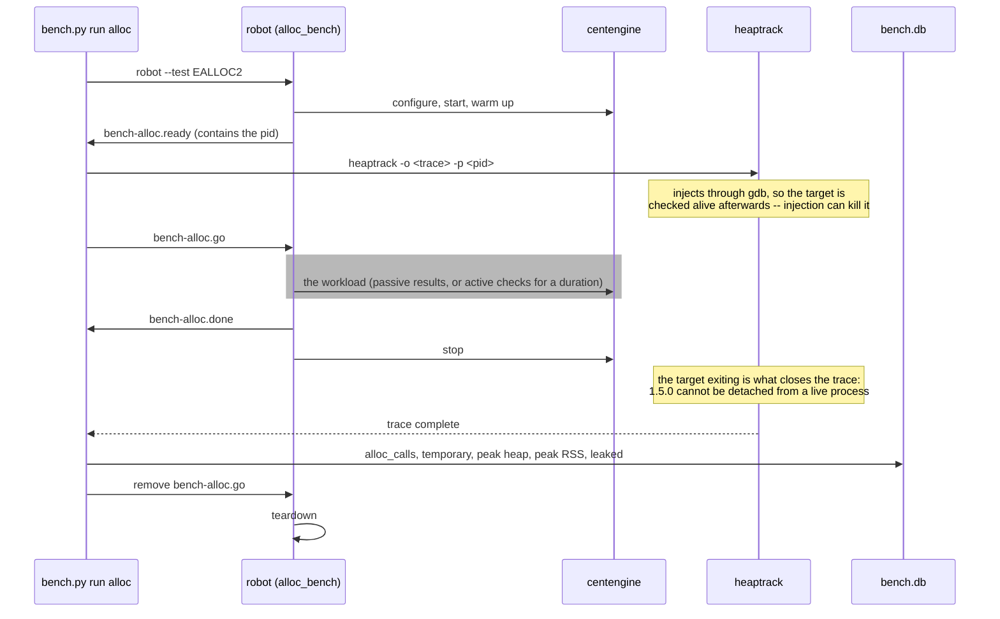
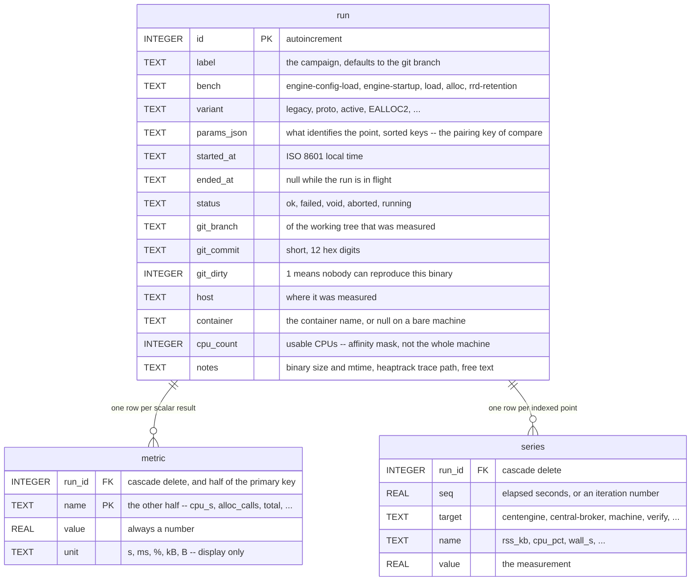

# Collect benchmarks

- [Introduction](#introduction)
- [Prerequisites](#prerequisites)
- [The benchmarks](#the-benchmarks)
  - [`engine-config-load` — reading and applying a configuration](#engine-config-load--reading-and-applying-a-configuration)
  - [`engine-startup` — from process start to monitoring](#engine-startup--from-process-start-to-monitoring)
  - [`load` — what the running daemons cost](#load--what-the-running-daemons-cost)
  - [`alloc` — heap allocations on the check path](#alloc--heap-allocations-on-the-check-path)
  - [`BENCH_RRD_METRIC_RETENTION` — the RRD retention buffer](#bench_rrd_metric_retention--the-rrd-retention-buffer)
- [In more depth](#in-more-depth)
  - [The store, and what the metrics mean](#the-store-and-what-the-metrics-mean)
  - [Comparing two versions](#comparing-two-versions)
  - [Traps, all of them measured](#traps-all-of-them-measured)
  - [The files](#the-files)

## Introduction

Hand-written, unlike `tests/README.md` which `./update-doc.py -f` regenerates from the robot
documentation. Do not overwrite this one with a generated file.

These benchmarks **measure**, they do not assert. A run that fails tells you the benchmark
broke, not that the product regressed; the verdict is always a comparison between two
campaigns. That is also why every robot test here carries the `unstable` tag: the default
selection is `robot -e unstable .`, which leaves them out — they take minutes to tens of
minutes and would say nothing useful in CI.

Everything lands in one SQLite store, `results/bench.db`, so two campaigns can be compared
months apart. A campaign is named by its **label**, which defaults to the current git branch.

## Prerequisites

**Nothing to install for the tooling itself.** Every Python file here uses the standard library
only, `sqlite3` included -- that one is a stdlib module, so the benchmarks never need anything
installed to write their results.

**In the test container**, a few packages beyond what a build needs:

```bash
apt-get update && apt-get install -y heaptrack gdb tzdata sqlite3
```

To plot benchmark results, you may need gnuplot. As explained below, you only need
`gnuplot-nox` to call `bench.py graph` and produce `.png` or `.svg` files but it
may be useful to install a full gnuplot package if you want to explore the `.dat` and `.gp` files interactively.

Here are two examples to install `gnuplot`:

```bash
apt-get install gnuplot-nox
# or
apt-get install gnuplot-x11
# or
apt-get install gnuplot-qt
```

- `heaptrack` and `gdb` for the allocation benchmark: it attaches to a running centengine, and
  heaptrack injects itself through gdb. `heaptrack_print` comes with the same package.
  `/proc/sys/kernel/yama/ptrace_scope` must be `0`, which it already is in the container.
- `tzdata` because the generated configurations carry `use_timezone=:Europe/Paris`, like the
  test suite's own template. Without it Engine refuses the timezone.
- `sqlite3`, the command line tool, for looking at the result store by hand:
  `sqlite3 results/bench.db` and a `SELECT` beat writing a Python snippet when all you want is
  to see what is in there. Nothing in the benchmarks needs it -- they use the stdlib module --
  so it is a convenience, but a real one.

- `gnuplot`, for `bench.py graph`. Only the drawing needs it: the `.dat` and `.gp` files are
  written whatever happens, and the command says what to run once gnuplot is there. The
  `-nox` package is enough -- png, svg and the ASCII terminal need no X11.

`gdb` and `tzdata` are already in the image; `heaptrack`, `sqlite3` and `gnuplot-nox` were added
to `Dockerfile.debian`, so a freshly built container has all five.

Here is a full example of a container with all the prerequisites installed:

```bash
**Robot** lives in a virtualenv `robotframework` under `tests/`. To use an existing one:

```bash
podman start eloquent_margulis
podman exec -ti eloquent_margulis /bin/bash
cd /work/tests && . robotframework/bin/activate
```

To build one from nothing, the list below is everything the resources actually import, and
nothing else. It can be installed with `uv` or with the standard tools; `uv` is only faster --
a tenth of a second for the virtualenv and about six for the eleven packages.

**If you want to use `uv` and it is missing, you can install it like this.** It is not in the
Debian repositories, so there is no `apt install uv`; the standalone installer is the usual way
-- a single binary, no system Python touched, nothing to compile:

```bash
uv --version                                      # already there? nothing to do
curl -LsSf https://astral.sh/uv/install.sh | sh   # installs uv and uvx in ~/.local/bin
. ~/.local/bin/env                                # puts them on PATH for this shell
uv --version                                      # 0.9 or later is fine
```

The installer also writes the `env` and `env.fish` snippets the third line sources; a shell
that already has `~/.local/bin` on its PATH does not need it. If you would rather install it as
a packaged tool, `pipx` is in the Debian repositories:

```bash
apt-get install -y pipx && pipx install uv
```

**With `uv`**, the virtualenv and its packages:

```bash
cd /work/tests
uv venv --python 3.13 robotframework
. robotframework/bin/activate
uv pip install robotframework \
               robotframework-databaselibrary \
               robotframework-httpctrl \
               robotframework-examples \
               robotframework-requests \
               grpcio grpcio-tools \
               pymysql python-dateutil psutil PyJWT
./init-proto.sh   # generates the gRPC stubs and resources/opentelemetry
./init-sql.sh     # creates the test database
```

**Without `uv`**, the same thing with the standard tools. The interpreter is then whatever
`python3` happens to be, so there is nothing to pin and nothing to download — but `venv` needs
its own package, which the image does not carry: `python3 -m venv` fails with *ensurepip is not
available* until it is installed. `uv venv` does not need it, since it builds the virtualenv
itself rather than through `ensurepip`.

```bash
cd /work/tests
apt-get install -y python3-venv        # or python3.13-venv, matching your python3
python3 -m venv robotframework
. robotframework/bin/activate
python3 -m pip install robotframework \
                       robotframework-databaselibrary \
                       robotframework-httpctrl \
                       robotframework-examples \
                       robotframework-requests \
                       grpcio grpcio-tools \
                       pymysql python-dateutil psutil PyJWT
./init-proto.sh
./init-sql.sh
```

`python3 -m pip` rather than `pip`, out of habit: it installs into the interpreter you named,
with no guessing about what `pip` resolves to. The old Python 2 trap is gone here — Debian 13
has no python2 at all, and `/usr/bin/pip` and `/usr/bin/pip3` are byte-identical wrappers over
`/usr/bin/python3` — and inside an activated virtualenv both are that virtualenv's own pip
anyway. The `-m` form simply never leaves the question open.

**On the Python version.** With `uv`, pin it, and pin it to what the image ships -- `uv`
downloads the interpreter it is asked for, so pinning costs nothing. It is worth doing: the
existing virtualenv was built on 3.12 back when Robot needed it, and a virtualenv whose
interpreter has been upgraded under it answers `pip list` with the wrong site-packages, which is
confusing enough to waste an afternoon. 3.13 no longer needs avoiding: verified on 2026-08-21
that the eleven packages install on 3.13.5 with no build failure, that `grpc`, `pymysql`,
`psutil`, `jwt`, `dateutil`, `sqlalchemy` and `protobuf` all import, that a real robot benchmark
passes, and that a dry-run of the whole suite gives **exactly the same fifteen failures on 3.12
and on 3.13** -- the same tests, for the same reason, none of them interpreter-related (they are
the `bench-unstable.robot` ones, calling keywords of the disabled `Bench.py`).

Why each of them: the four `robotframework-*` are the libraries `resources/import.resource`
declares; `grpcio` is what `Engine.py` and `Broker.py` talk to the daemons with and
`grpcio-tools` is what `init-proto.sh` generates the stubs with (it pulls `protobuf` in);
`pymysql` is the driver `DatabaseLibrary` and `Common.py` use; `python-dateutil` parses the log
timestamps; `psutil` watches processes; `PyJWT` is used by the vault tests. The
`opentelemetry` package is deliberately absent: that import resolves to
`resources/opentelemetry`, which `init-proto.sh` generates.

Packages that are **not** needed and are deliberately left out: `boto3`, `unqlite` and
`py-cpuinfo` are imported only by `resources/Bench.py`, the legacy benchmark that uploaded its
results to an S3 bucket, and that file is commented out of `import.resource`; `cython` and
`gitpython` are imported by nothing at all. `Dockerfile.debian` still installs `boto3`,
`py-cpuinfo`, `cython` and `gitpython` in its own `~/.venv`, and `unqlite` came from a manual
install in this one — history, not a requirement.

Optional, for contributing rather than running: `autopep8` formats the Python,
`robotframework-tidy` the robot files, `ruff` lints.

**MariaDB** has to be running for every benchmark that starts the daemons: they all write
through `unified_sql`, and a broker retrying against a missing database is not the profile
anyone means to measure.

```bash
service mariadb status || /work/tests/repair-db.sh
```

**On the host**, only `engine-config-load` can run, and it needs just a `centengine` binary
(the installed one, or `--engine <path>` to measure a build tree) plus `tzdata`. No daemon, no
database.

Optional: `centenginestats` gives the check counters the load benchmark uses as a denominator.
It ships with Engine. Without it the CPU totals stay comparable, but there is no cost per check.

## The benchmarks

| name | what it measures | how long | where |
|---|---|---|---|
| `engine-config-load` | cost of reading **and applying** a configuration, by size | seconds per point | host or container |
| `engine-startup` | from process start to the event loop, phase by phase | ~2 min per scenario | container |
| `load` | what the three daemons cost in steady state | ~15 min at the defaults | container |
| `alloc` | heap allocations of centengine on the check path | ~5 min (EALLOC2/3), ~20 min (EALLOC1) | container |
| `rrd-retention` | throughput and merge latency of the RRD retention buffer | ~5 min | container |

Those are the names in both senses: what `./bench.py run <name>` takes, and what the `bench`
column of the store holds. **All five go through the same entry point and land in the same
store**, so `./bench.py compare` works the same way for all of them. Three of them are robot
tests underneath — `engine-startup`, `load` and `rrd-retention` — and `bench.py run` simply
launches robot for those, forwarding `--var` and `--test`. Running robot directly works just as
well; going through `bench.py` only adds the campaign name and the refusal to measure a modified
working tree.

### `engine-config-load` — reading and applying a configuration

Pick **one** line, they are alternatives:

```bash
# the usual sweep
./bench.py run engine-config-load --sizes 1000,10000,50000

# one size, more repetitions, and the generated configuration left on disk
./bench.py run engine-config-load --sizes 50000 --repeat 5 --keep

# -v and -s both, against a build tree rather than the installed binary
./bench.py run engine-config-load --mode both --engine ../../build/engine/centengine
```



The shaded part is one process, measured from the outside with `wait4()`. Engine prints the
phase durations of its own accord (`Startup timing: …`), which the benchmark collects as
`phase.<name>_ms`; what the outside measurement adds is the peak RSS and a CPU figure the log
cannot give.

Measured on this branch, medians of two runs, and the reason this benchmark exists. The column
names are the phases Engine itself names in its log — `config-read` is a phase of the
`engine-config-load` benchmark, not another benchmark:

| services | `config-read` | `expand` | `resolve` | `objects` | total |
|---:|---:|---:|---:|---:|---:|
| 1 000 | 3 ms | 0 | 0 | 2 ms | 7 ms |
| 10 000 | 28 ms | 1 ms | 1 ms | 56 ms | 97 ms |
| 50 000 | 140 ms | 7 ms | 11 ms | **893 ms** | 1 132 ms |

Read the last two rows together, because that is where the interesting thing is.

**The text parse grows with the size, as expected.** From 10 000 to 50 000 services — five times
more — `config-read` goes from 28 ms to 140 ms, exactly five times more. It is linear, and at
fifty thousand services it is only 12 % of the total. Optimizing the parser would buy almost
nothing.

**Applying the objects grows faster than the size.** Over the same step it goes from 56 ms to
893 ms: **sixteen times more for five times the services**. Had it been linear it would have
taken 280 ms. Put differently, the cost grows roughly like N^1.7 instead of N, so each doubling
of the configuration costs more than twice as much — and the bigger the installation, the worse
the ratio gets. At fifty thousand services this single phase is 893 ms of the 1 132 ms total,
**79 %**. That is where an optimization of the configuration load would pay, and it is not where
one would have guessed.

Two caveats on that exponent: it comes from two points on one interval, not from a fitted curve,
and the 1 000-service row is too small to read anything into — 2 ms is mostly rounding. A wider
sweep (`--sizes 10000,20000,50000,100000`) would confirm it.

`scheduler` reads 0 because `-v` skips it on purpose; the startup scenarios below do measure it.

`--mode test-scheduling` uses `-s` instead of `-v`: it adds the retention parse and the
scheduling report. The difference between the two modes is those, not `apply` — both apply.

### `engine-startup` — from process start to monitoring

Pick **one** line, they are alternatives:

```bash
# the three scenarios
./bench.py run engine-startup

# one of them, bigger, under a chosen campaign name
./bench.py run engine-startup --test BENCH_START_LEGACY --var nb_hosts:500 --label dt-broker

# the same thing without going through bench.py -- robot takes -v directly
robot -v nb_hosts:500 -v label:dt-broker benchmarks/startup_bench.robot
```

Configuration reaches Engine in three shapes, and they do not cost the same. This is the
measurement that says what centralized configuration buys at startup.

The diagram below covers the three. The `alt` block is the part that differs, one branch per
scenario and **exactly one taken per run** — the `DiffState` exchange belongs to
`BENCH_START_CENTRALIZED_COLD` only, and note where it sits: *after* the event loop has started,
not during the startup.



The figures come from Engine itself: it emits one `Startup timing: <phase> = <n> ms` line per
phase, at info, once per startup. Measuring from the outside would give a total and nothing
else, since `--verify-config` runs parse, expand, resolve and apply as one block. A run whose log
carries no such line **fails on purpose**: the binary predates the instrumentation, and a bare
total would be read as a phase breakdown that is not there.

The same wording is used on the reload path (`Reload timing: …`, also info) and on the runtime
diff path (`Diff timing: …`, at debug because it runs on every configuration change). One
regular expression covers all three: `(Startup|Reload|Diff) timing: (\S+) = (\d+) ms`, and the
benchmark keeps them apart by prefixing the last two with `reload.` and `diff.`.

That distinction is not cosmetic. **A cold centralized poller reaches its event loop in about
ten milliseconds** — it has nothing local to start on — and receives its real configuration
afterwards, as a diff carrying the full state, which is applied under `Reload timing`. Reading
only the startup phases would report such a poller as starting in ten milliseconds and monitoring
nothing.

Measured on 10 000 services, one run each:

| phase | legacy | `state.prot` | centralized, cold |
|---|---:|---:|---:|
| `config-read` | 27 / 44 ms (text parse) | **8 / 7 ms** (protobuf) | 0, starts empty |
| `expand` + `resolve` | 8 / 7 ms | skipped | skipped |
| `extended-conf` | 2 / 2 ms | 0 / 0 ms | 0 / 0 ms |
| `rpc-server` | 3 / 3 ms | 2 / 2 ms | 1 / 1 ms |
| `retention` | 0 / 0 ms | 0 / 0 ms | 0 / 0 ms |
| `objects` | 54 / 49 ms | 53 / 57 ms | 138 / 133 ms, as `reload.objects` |
| `scheduler` | 14 / 14 ms | 24 / 25 ms | 16 / 19 ms, as `reload.scheduler` |
| **total** | **286 / 282 ms** | **153 / 157 ms** | 14 / 9 ms, then ~150 ms of reload |

Two passes of each scenario, both values shown: with figures this small, one sample says nothing
about what is noise and what is not.

Reading the configuration costs four to six times less as a serialized `State` than as text, and
the two validation phases disappear entirely since Broker has already run them: **282 ms against
155 ms, −45 % on the startup of a warm poller**, and the ratio held across both passes.
`objects` is the same on both sides — 54/49 against 53/57 — which is the consistency check one
wants: the phase that dominates at scale does the same work whichever way the configuration
arrived.

Two things in that table are stable enough to be worth a look some day. `scheduler` costs
consistently ten milliseconds more in the proto scenario (24-25 against 14) — twice in a row, so
not noise, and unexplained. And the text parse itself is the noisiest phase of all, 27 ms then
44 ms for identical work, which is worth remembering before reading anything into a single
`config-read` figure.

Worth a second look too: applying the same 10 000 services as a diff costs 133-138 ms against
49-57 ms as a full state, some 2.6× more. Measured twice, still unexplained.

**On reading a phase name literally.** An earlier version of these figures showed `retention` at
7 ms against 1 ms, which looked like reading `state.prot` somehow making the retention cheaper.
It did not: the phase then covered the retention parse *and* `extended_conf` *and* the start of
the gRPC server. Split apart and measured twice, `retention` is 0 ms in all three scenarios --
they all start with no retention file, which the test now enforces rather than inherit from the
log directory being wiped -- and what little there was sat in `extended-conf` and `rpc-server`.
Two lessons, both cheap: a phase must be named after everything it contains, and a six
millisecond gap on one sample is not a finding.

### `load` — what the running daemons cost

Pick **one** line, they are alternatives:

```bash
# both profiles, one after the other -- the usual way
./bench.py run load

# one profile only
./bench.py run load --test BENCH_LOAD_ACTIVE
./bench.py run load --test BENCH_LOAD_PASSIVE

# both, longer and bigger, filed under a chosen campaign name
./bench.py run load --var duration:1800 --var nb_hosts:100 --label dt-broker

# straight through robot, which takes the same variables as -v
robot -v duration:1800 -v nb_hosts:100 benchmarks/collect_load_bench.robot
```

Overridable with `-v name:value`: `duration`, `warmup`, `interval`, `nb_hosts`, `svc_by_host`,
`passive_rate`, `label`. Be careful with `warmup`, see the traps.

The probe can also be pointed at daemons the benchmark did not start — a real installation, or a
container someone left running. It is the only command here that does not build its own load:

```bash
./bench.py probe --duration 600 --engine-config /etc/centreon-engine/centengine.cfg
```

Note the naming, which is deliberate but easy to misread: `./bench.py probe` is **not** a
benchmark of its own. It files its window under the same `load` bench, as variant `probe`, next
to the `active` and `passive` variants that `./bench.py run load` produces. That is what lets a
window measured on a customer installation and one measured in the container end up in the same
query — and it is also why `compare` will not pair them: their variants differ, so it says so
instead of comparing a supervised load to an unknown one.



The two profiles answer different questions. **`BENCH_LOAD_ACTIVE`** is the production shape:
centengine schedules its own checks, cbmod publishes, the central cbd writes to the database and
forwards to the rrd one. Its plugin is reduced to a single `echo` — a real `check.pl` would make
the machine fork-bound, and since the probe deliberately excludes the CPU of the children, the
benchmark would end up measuring how fast the machine forks.

**`BENCH_LOAD_PASSIVE`** submits results at a steady rate instead, so no plugin is ever forked
and the hosts are passive too. It answers a narrower question — what processing one result costs
— with an exact denominator, which the active profile cannot give since the number of checks it
runs is not controlled.

Do not read one against the other: their rates differ by construction. Measured on the same
binary over a 120 s window, an active check costs about 15.8 ms of collect CPU and a passive
result about 0.77 ms. That gap is the fork, not a regression.

The verdict comes from *cumulative* counters, never from the samples: `utime+stime` in
`/proc/PID/stat` counts every tick the kernel charged to the process, so the difference between
two reads divided by the elapsed time is the exact average over the window. The samples exist
for the memory curve and for a rough view of the CPU over time.

### `alloc` — heap allocations on the check path

Pick **one**:

```bash
./bench.py run alloc --profile EALLOC2     # active checks, bare plugin path -- the default
./bench.py run alloc --profile EALLOC1     # passive results, no fork at all (~20 min)
./bench.py run alloc --profile EALLOC3     # active checks with a real command line
./bench.py run alloc --profile all         # the three above, one after the other
```

Three profiles, all of them making the check path dominant: **EALLOC1** submits a large number of
passive results, so no plugin is ever forked; **EALLOC2** runs active checks on a bare plugin
path; **EALLOC3** the same with a command line the length of a real one — their difference
isolates what forking costs per argument.

Attaching a profiler to a warm centengine used to need a human. It does not any more, and the
handshake is four files under `/tmp`:



The robot test also works on its own — it prints what to type:

```bash
robot --test EALLOC2 benchmarks/alloc_bench.robot
# when it prints the pid:
heaptrack -o /root/.cache/heaptrack/<name> -p <pid>   # -o BEFORE -p, always
touch /tmp/bench-alloc.go
# when it says the workload is over, it stops centengine and heaptrack exits by itself:
rm /tmp/bench-alloc.go
```

There is **no Ctrl-C step**, and that is not a simplification: see the traps.

Beyond the scalars, each run leaves `<profile>.report.txt` next to its trace — the per-stack
attribution, which is what tells *where* the allocations are. `compare --diff` puts two traces
side by side.

### `BENCH_RRD_METRIC_RETENTION` — the RRD retention buffer

Pick **one**:

```bash
./bench.py run rrd-retention                                        # defaults
./bench.py run rrd-retention --var N_METRICS:10 --var N_OLD_POINTS:1440   # bigger
robot benchmarks/rrd_retention_bench.robot                          # straight through robot
```

Injects back-dated `pb_metric` events straight into the central broker, then one current-time
event per metric to trigger the junction merge. It reports injection throughput and end-to-end
merge latency on the console, and files them as `injection_events`, `injection_s`,
`injection_events_per_s`, `merge_latency_s`, `merge_points_per_s` and `buffered_points`, with the
sizes (`metrics`, `old_points`, `step`) as parameters so that two campaigns pair correctly.

## In more depth

### The store, and what the metrics mean

```bash
./bench.py show                              # every campaign in the store
./bench.py show --label dt-broker            # its runs and their metrics
./bench.py show --run 12                     # one run in full, environment included
./bench.py show --label dt-broker --metrics cpu_s,maxrss_kb
./bench.py export --label dt-broker --out /tmp/campaign.json [--with-series]
```

A run also leaves its files under `results/<label>/`: for `alloc`, the heaptrack trace, the
per-stack report and robot's own `log.html` / `report.html`.

Three tables.



`run` is one measured point — one benchmark, one variant, one size. `metric` holds the scalars in
key/value form, which is what lets an allocation count and a CPU percentage live in the same
table without a column per benchmark. `series` holds anything indexed: the RSS curve of an hour
long window as much as the three repetitions of a configuration load. Two indexes,
`run(label, bench, variant)` and `series(run_id, target, name)`, and `metric` is `WITHOUT ROWID`
since `(run_id, name)` is already its key.

The environment columns are not decoration. A figure without them is not a measurement: nobody
can tell later whether two numbers came from the same machine, the same commit, or a tree with
uncommitted changes — which is exactly what `compare` warns about.

For a quick look, the command line tool is enough:

```bash
sqlite3 results/bench.db '.tables'
sqlite3 -header -column results/bench.db \
  "SELECT label, variant, name, value FROM run JOIN metric ON run.id = metric.run_id
   WHERE bench = 'engine-startup' AND name = 'total' ORDER BY run.id"
```

From Python, with no dependency at all — the module is in the standard library:

```python
import sqlite3
db = sqlite3.connect("results/bench.db")
db.row_factory = sqlite3.Row
for r in db.execute("SELECT label, variant, value FROM run JOIN metric ON run.id = metric.run_id "
                    "WHERE bench = 'engine-config-load' AND name = 'cpu_s' ORDER BY run.id"):
    print(dict(r))
```

Metric names are dotted by target — `centengine.`, `central-broker.`, `central-rrd.`, `collect.`
for the three together, `machine.` for the whole machine.

| metric | meaning |
|---|---|
| `<target>.cpu_total_s` | CPU seconds burnt over the window, user plus system, children excluded |
| `<target>.cpu_avg_pct` | the same as a percentage of **one core**, the way `top` shows a process |
| `machine.cpu_avg_pct` | busy CPU as a percentage of the **whole machine**, every core together; idle and iowait excluded |
| `collect.share_pct` | what share of the machine's busy CPU the three daemons account for, normalised by the core count so that the two units above can be compared |
| `<target>.rss_start_kb` / `_end_kb` / `_max_kb` | resident memory at the beginning of the window, at its end, and its high water mark |
| `active_checks.*_per_min`, `active_checks.total` | what centenginestats counted. **Active only** — a passive profile reports none |
| `cpu_ms_per_active_check` | collect CPU divided by those checks; only filed when at least ten of them ran |
| `results_submitted`, `results_in_window`, `cpu_ms_per_result` | the passive profile's own denominator, filed by the test since the probe cannot know it |
| `latency_avg_s` | average active service latency, as centenginestats reports it |
| `wall_s`, `cpu_s`, `maxrss_kb`, `ms_per_service`, `cpu_ms_per_service` | `engine-config-load`: medians over the repetitions |
| `config_warnings`, `config_errors` | what `centengine -v` reported; a warning per object would distort everything |
| `config-read`, `expand`, `resolve`, `retention`, `diff`, `globals`, `objects`, `scheduler`, `apply`, `total` | the phases Engine logged about its startup, in milliseconds. `engine-config-load` files the same under `phase.<name>_ms` |
| `reload.*`, `diff.*` | the same phases when the configuration arrived after the startup — a poller receiving it from Broker — or on a runtime change |
| `log_wall_ms` | from Engine's first log line to the one announcing the event loop |
| `alloc_calls`, `temporary_allocs`, `peak_heap_bytes`, `peak_rss_bytes`, `leaked_bytes`, `runtime_s` | what heaptrack measured |

### Comparing two versions

The point of the whole thing. Measure both under their own label, then:

```bash
git checkout 25.10 && ninja -Cbuild && ./bench.py run engine-config-load --label 25.10
git checkout dt-broker && ninja -Cbuild && ./bench.py run engine-config-load --label dt-broker
./bench.py compare 25.10 dt-broker
./bench.py compare 25.10 dt-broker --bench alloc --diff    # per-stack heaptrack diff
```

`compare` pairs runs by benchmark, variant and parameters, and refuses to pair anything else —
if a size differs it says what each label holds rather than comparing apples to oranges. It also
warns when the two runs were measured on different environments.

A window measured on a real installation can be imported next to them, which is how a container
figure and a field figure end up in the same query:

```bash
./bench.py import-csv --csv bench-load-25.10.csv --label 25.10-field --host customer-central
```

Those imported figures are named `*.cpu_mean_sample_pct`, never `cpu_avg_pct`: they are the mean
of samples, not the cumulative average a probe computes from the tick counters, and the two must
not be compared as if they were the same quantity.

`run` refuses a modified working tree — nobody can reproduce the binary it would have measured.
Pass `--allow-dirty` when you know what you are doing, and the run is flagged as such.

### Drawing a curve

`compare` answers "did this change help"; `graph` answers "how does the cost grow". It reads the
store, writes a gnuplot data file and the script that draws it, and runs gnuplot when it is
installed:

```bash
# one curve per target: centengine, central-broker, central-rrd, collect
./bench.py graph --label dt-broker-prog --x hosts --y cpu_total_s --variant passive

# one target only, two campaigns overlaid
./bench.py graph --label 25.10 --label dt-broker --x hosts --y collect.cpu_total_s --bench load

# a quick look with no image and no viewer, straight in the terminal
./bench.py graph --label dt-broker-prog --x hosts --y collect.cpu_total_s --terminal dumb

# log-log, to read a slope: a straight line of gradient 1.7 is a cost in N^1.7
./bench.py graph --label sizes --x services --y cpu_s --logx --logy
```

`--y` takes a bare suffix, and then every target that carries it becomes a curve -- which is the
graph worth looking at. Give it a full name (`collect.cpu_total_s`) for that one metric alone.
`--x` is a run parameter first (`hosts`, `services`, `duration`), a metric otherwise, so a cost
can be plotted against what actually drove it (`--x results_in_window`) rather than against the
size of the configuration.

Three things it deliberately does not do:

- **It does not average repetitions.** Three runs at the same size are three points, and the
  spread stays on the graph. Averaging two measurements that differ by 13 % draws a curve that
  looks far more solid than the measurement is.
- **It does not mix benchmarks or variants.** The passive and the active profile are two
  workloads, not one curve; the command stops and asks for `--bench` and/or `--variant`.
- **It does not hide a missing figure.** A run lacking the metric writes `NaN`, which gnuplot
  skips -- a gap in the line, rather than a point at zero that reads as "it cost nothing".

Runs still in flight are left out, since their metrics are only written when they end. Output
lands in `results/graphs/`, which is git-ignored like the rest of `results/`.

### Traps, all of them measured

**Comparisons hold only within one machine.** Different CPU counts burn CPU at different rates,
and the container is not the host. `compare` warns, it cannot fix it.

**For `engine-config-load`, watch `cpu_s`, not `wall_s`.** Wall clock carries about two tenths of
a second of fixed cost — centengine tears its BBDO protocols down before leaving, whatever the
size of the configuration. Repeatability, measured on the same binary: under 1 % on `cpu_s` and
`wall_s`, but ±10 to 38 % on the user/sys split, so never read those two separately.

**Watch `config_warnings`.** `resolve()` emits some warnings once per object; at fifty thousand
services that turns the benchmark into a measurement of spdlog. The count is stored as a metric
for exactly that reason, and the generated configuration sets `notification_period` to keep it
at zero.

**A short warm-up does not make the load benchmark noisier, it makes it wrong.** The generated
configuration carries `max_service_check_spread=5`, so Engine spreads its first checks over five
minutes. Measured on a 120 s window after a 30 s warm-up: 50 service checks per minute where the
configuration calls for about 200. Hence the 330 s default; lower it only if you know the
scheduler has already reached its cruising rate.

**`active_checks.*` counts active checks and nothing else.** In the passive profile
centenginestats reports none, and an earlier version happily divided a whole window of CPU by
the one host check that had slipped through — 1799 ms per check. The metric is now only filed
above ten checks, and the passive profile brings its own denominator.

**A percentage of one core is not a percentage of a machine.** `<target>.cpu_avg_pct` is a share
of one core, `machine.cpu_avg_pct` a share of every core together. The bash probe this was
ported from compared them directly, which overstated the collect's share by the number of cores
— 115 % on a 22-core machine. `collect.share_pct` now divides by the core count; treat any
figure from that script's *machine* line with suspicion.

**heaptrack 1.5.0 cannot be detached from a live process.** Signalling the tracer kills it
without its `trap cleanup EXIT`, leaving the injection in place and the trace growing until the
target dies on its own; and the cleanup itself — what Ctrl-C triggers — calls `heaptrack_stop()`
through gdb, which trips `Assertion '!s_forceCleanup' failed` and aborts the debuggee. So the
supported path is the only one used: the test stops centengine, heaptrack flushes and exits.

**`heaptrack -o` overwrites without warning**, and the trace extension depends on the
compressor the build uses — `.gz` in the container, `.zst` elsewhere. Never hardcode it.

**The injection can kill its target.** It goes through gdb calling into the process; a python3
was measured to take a SIGSEGV from it. `heaptrack_tools.attach()` therefore checks the target
is still alive rather than assuming it.

**In the active allocation profiles the number of checks is not controlled**, so per-check
figures need a denominator — a function whose per-check allocation count is known for *that*
binary. Recalibrate it on a passive trace of the same binary before using it; a stale
denominator inflates every per-check figure. In the passive profile (EALLOC1) never normalise by
a function at all: the test imposes the count.

**Assert what a robot keyword returns.** `Ctn Check Service Status With Timeout` returns `False`
on timeout instead of failing, so calling it bare is an assertion that can never fail. It cost
one green run that had verified nothing.

**`bench-load-25.10.csv` is suspect as a reference.** Its centengine column is perfectly
constant — 0.60 % of CPU and 67800 kB of RSS across all sixty samples — while the two cbd and
the machine vary normally, and its pids come from two different ranges. Re-measure before
trusting it.

### The files

| file | role |
|---|---|
| `bench.py` | the entry point: `list` / `run` / `probe` / `show` / `compare` / `graph` / `import-csv` / `export` |
| `benchdb.py` | the SQLite store: schema, insertions, queries |
| `procstat.py` | `/proc` reading: cumulative CPU, RSS, swap, I/O, machine load, cost of a command |
| `benchenv.py` | what a run must remember of its context: commit, dirty tree, container, usable CPUs |
| `engine_config_gen.py` | Engine configurations of arbitrary size, without robot |
| `heaptrack_tools.py` | attach, wait, read and diff heaptrack traces |
| `robot_bench.py` | the keywords the robot benchmarks need: passive load, log parsing, store access |
| `startup_bench.robot` | the three startup scenarios |
| `collect_load_bench.robot` | the two load profiles, active and passive |
| `alloc_bench.robot` | the three allocation profiles, EALLOC1 to EALLOC3 |
| `rrd_retention_bench.robot` | the RRD retention buffer benchmark |
| `results/` | the store and the per-run files, git-ignored |

Python here is stdlib only and formatted with `autopep8`, like the rest of `tests/`.
